# Multi-Tenancy Architecture

## Overview

ThingsBoard implements a comprehensive multi-tenancy architecture that enables a single platform instance to serve multiple independent organizations (tenants) with complete data isolation, configurable resource limits, and flexible permission models. The architecture enforces tenant boundaries at every layer: database, API, messaging, and rule processing.

## Key Behaviors

1. **Complete Data Isolation**: Each tenant's data is logically separated; cross-tenant queries are not permitted.

2. **Hierarchical Organization**: Three-level hierarchy (Tenant → Customer → User) supports complex organizational structures.

3. **Profile-Based Configuration**: Tenant profiles define quotas, limits, and features without code changes.

4. **Usage Tracking**: Real-time monitoring of resource consumption with warning and disabling thresholds.

5. **Queue Isolation**: Optional dedicated message processing for high-priority tenants.

6. **Role-Based Access Control**: Fine-grained permissions at resource and entity levels.

## Tenant Hierarchy

### Organization Structure

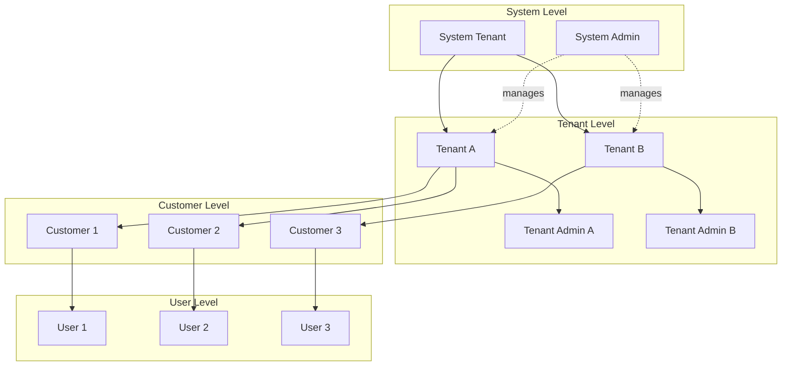

### Entity Hierarchy

| Level | Entity | Scope | Key Relationships |
|-------|--------|-------|-------------------|
| System | System Tenant | Platform-wide | Owns default profiles, system settings |
| Tenant | Tenant | Organization | Owns devices, assets, rule chains, dashboards |
| Customer | Customer | Sub-organization | Assigned devices, assets, dashboards |
| User | User | Individual | Belongs to tenant and optionally customer |

### Authority Levels

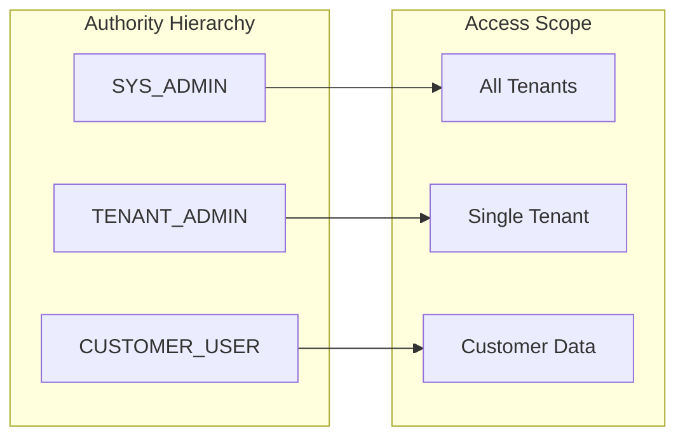

| Authority | Description | Tenant Access | Customer Access |
|-----------|-------------|---------------|-----------------|
| SYS_ADMIN | Platform administrator | All tenants | Cannot access directly |
| TENANT_ADMIN | Organization administrator | Own tenant only | All within tenant |
| CUSTOMER_USER | End user | Own tenant only | Assigned customer only |

## Data Isolation

### Database-Level Isolation

Every entity implements a tenant identifier interface, ensuring tenant context is always present:

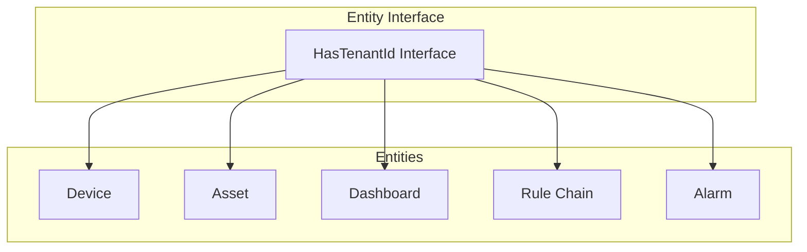

All database tables include `tenant_id` as a core column, enabling:
- Index optimization for tenant-scoped queries
- Efficient data partitioning
- Clear ownership boundaries

### Query Isolation Pattern

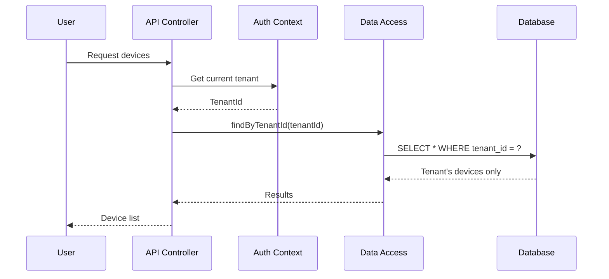

### Isolation Layers

| Layer | Mechanism | Enforcement |
|-------|-----------|-------------|
| Database | tenant_id column | DAO query filters |
| API | SecurityUser context | Controller validation |
| Messaging | Tenant ID in message | Queue partitioning |
| Rule Engine | Per-tenant routing | Submission strategies |
| WebSocket | Session binding | Subscription filters |

## Tenant Profiles

### Profile Structure

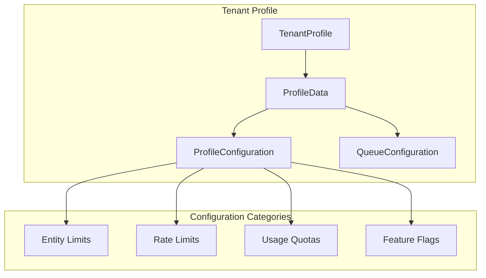

### Profile Assignment

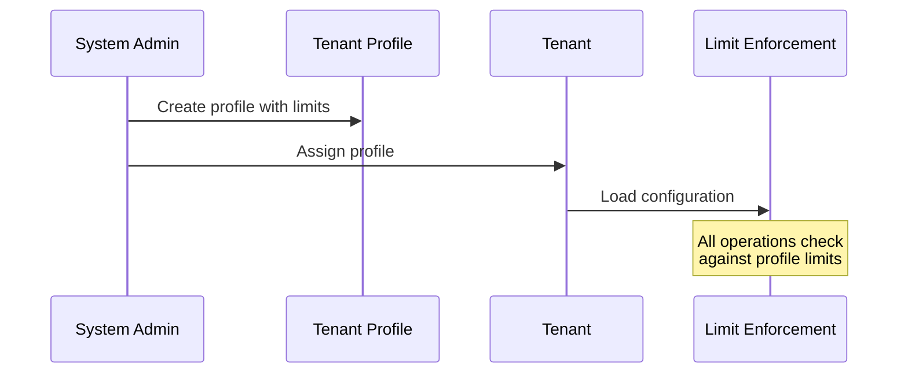

### Entity Limits

| Limit | Description | Default |
|-------|-------------|---------|
| maxDevices | Maximum devices per tenant | Unlimited (0) |
| maxAssets | Maximum assets per tenant | Unlimited (0) |
| maxCustomers | Maximum customers per tenant | Unlimited (0) |
| maxUsers | Maximum users per tenant | Unlimited (0) |
| maxDashboards | Maximum dashboards | Unlimited (0) |
| maxRuleChains | Maximum rule chains | Unlimited (0) |
| maxEdges | Maximum edge gateways | Unlimited (0) |
| maxResourcesInBytes | Total resource storage | Unlimited (0) |
| maxResourceSize | Single resource file size | Unlimited (0) |

### Rate Limits

Rate limits use the format `"<count>:<window_seconds>"` with support for multiple windows:

```
"1000:1,20000:60" = 1000 per second AND 20000 per minute
```

| Limit | Scope | Description |
|-------|-------|-------------|
| transportTenantMsgRateLimit | Tenant-wide | Overall message rate |
| transportTenantTelemetryMsgRateLimit | Tenant-wide | Telemetry message rate |
| transportTenantTelemetryDataPointsRateLimit | Tenant-wide | Data point rate |
| transportDeviceMsgRateLimit | Per device | Device message rate |
| transportGatewayMsgRateLimit | Per gateway | Gateway message rate |
| tenantServerRestLimitsConfiguration | Tenant-wide | REST API rate |
| customerServerRestLimitsConfiguration | Per customer | Customer API rate |

### Usage Quotas

| Quota | Description | Tracking |
|-------|-------------|----------|
| maxTransportMessages | Total transport messages allowed | Monthly/custom period |
| maxTransportDataPoints | Total data points allowed | Monthly/custom period |
| maxREExecutions | Rule Engine execution count | Monthly/custom period |
| maxJSExecutions | JavaScript execution count | Monthly/custom period |
| maxTbelExecutions | TBEL execution count | Monthly/custom period |
| maxEmails | Email sending limit | Monthly/custom period |
| maxSms | SMS sending limit | Monthly/custom period |
| maxCreatedAlarms | Maximum alarms | Monthly/custom period |

### WebSocket Limits

| Limit | Description |
|-------|-------------|
| maxWsSessionsPerTenant | Concurrent sessions tenant-wide |
| maxWsSessionsPerCustomer | Sessions per customer |
| maxWsSessionsPerRegularUser | Sessions per user |
| maxWsSubscriptionsPerTenant | Concurrent subscriptions |

### Data Retention

| Setting | Description |
|---------|-------------|
| defaultStorageTtlDays | Default telemetry retention |
| alarmsTtlDays | Alarm retention period |
| rpcTtlDays | RPC message retention |
| queueStatsTtlDays | Queue statistics retention |
| ruleEngineExceptionsTtlDays | Exception log retention |
| maxDPStorageDays | Data point retention (0 = unlimited) |

## Usage Tracking

### Usage State Machine

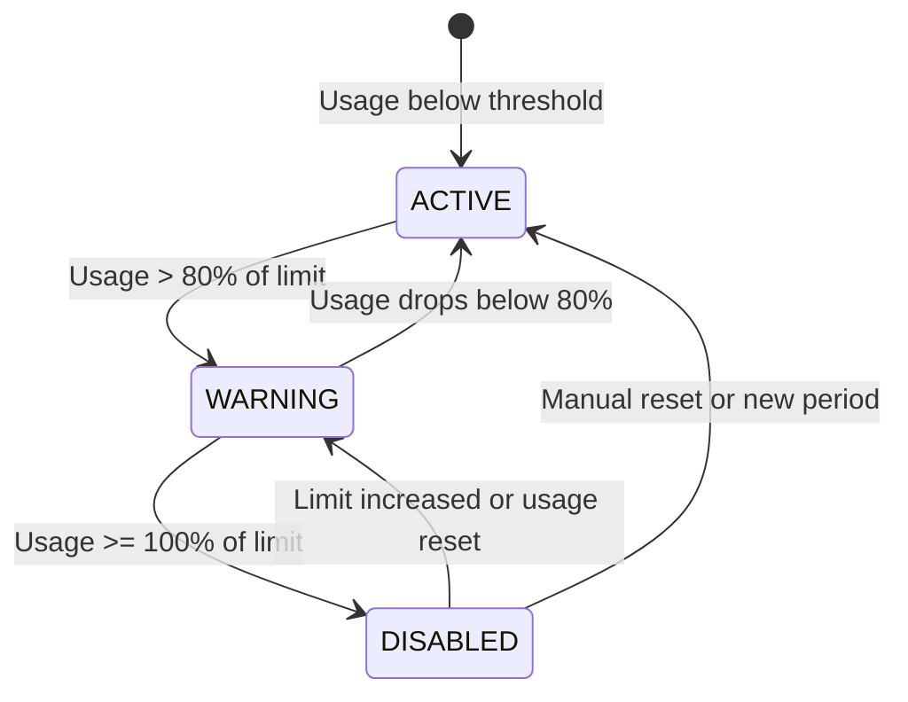

### Tracked Metrics

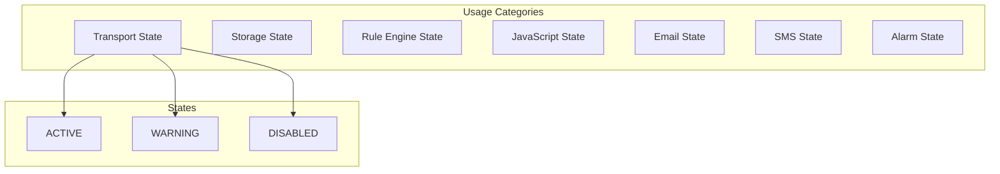

| Metric Key | Description |
|------------|-------------|
| TRANSPORT_MSG_COUNT | Total transport messages |
| TRANSPORT_DP_COUNT | Total data points transported |
| STORAGE_DP_COUNT | Data points in storage |
| RE_EXEC_COUNT | Rule Engine executions |
| JS_EXEC_COUNT | JavaScript executions |
| TBEL_EXEC_COUNT | TBEL executions |
| EMAIL_EXEC_COUNT | Emails sent |
| SMS_EXEC_COUNT | SMS sent |
| CREATED_ALARMS_COUNT | Alarms created |
| ACTIVE_DEVICES | Count of active devices |
| INACTIVE_DEVICES | Count of inactive devices |

### Warning Threshold

The warning threshold (default 80%) triggers notifications before limits are reached:

```
Warning triggered when: current_usage > limit * warnThreshold
```

## Isolated Rule Engine

### Isolation Concept

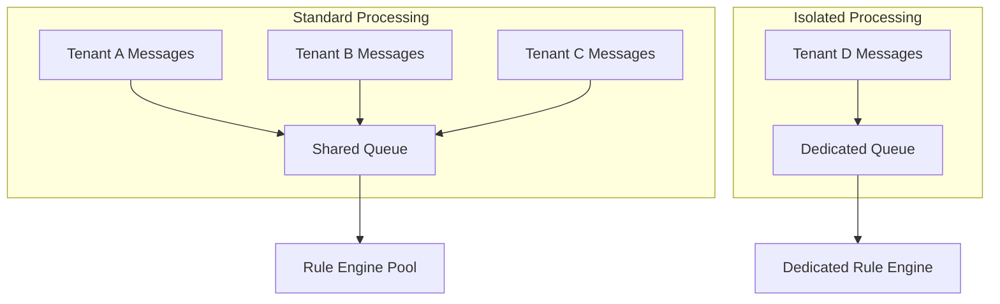

### When to Use Isolation

| Scenario | Recommendation |
|----------|----------------|
| Standard SaaS deployment | Shared queues |
| High-volume tenant | Isolated queue |
| Strict SLA requirements | Isolated queue |
| Predictable latency needs | Isolated queue |
| Cost-sensitive deployment | Shared queues |

### Configuration

Enable isolation in tenant profile:

```yaml
isolatedTbRuleEngine: true
```

This creates:
- Dedicated message queue topics
- Separate consumer group
- Independent processing threads
- Per-tenant statistics tracking

## Queue Isolation

### Queue Configuration per Profile

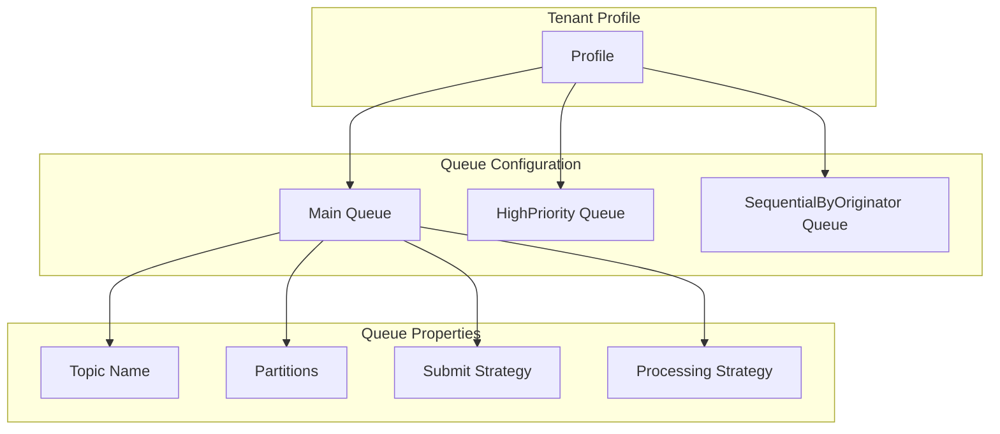

### Queue Configuration Options

| Setting | Description |
|---------|-------------|
| name | Queue identifier |
| topic | Underlying message broker topic |
| pollInterval | Consumer poll frequency (ms) |
| partitions | Number of queue partitions |
| consumerPerPartition | One consumer per partition |
| packProcessingTimeout | Message processing timeout |
| submitStrategy | How messages are submitted |
| processingStrategy | How messages are processed |

### Submission Strategies

| Strategy | Behavior | Use Case |
|----------|----------|----------|
| SequentialByTenantId | Ordered by tenant | Tenant consistency |
| SequentialByOriginatorId | Ordered by entity | Entity consistency |
| Burst | High throughput | Best effort |

### Message Routing

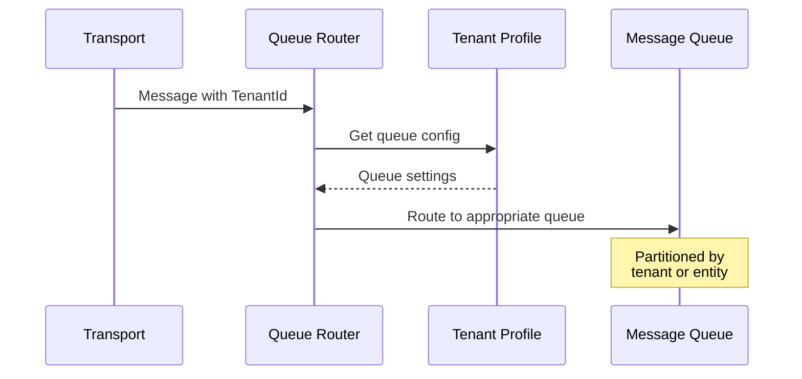

## Access Control

### Permission Model

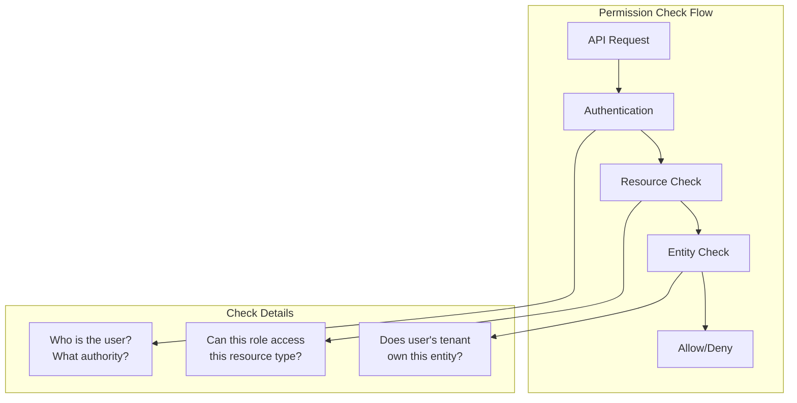

### Two-Tier Permission Checking

1. **Resource Level**: Can this user role access this type of resource?
2. **Entity Level**: Does the user's tenant/customer own this specific entity?

### Operations

| Operation | Description |
|-----------|-------------|
| CREATE | Create new entity |
| READ | Read entity data |
| WRITE | Update entity |
| DELETE | Remove entity |
| ASSIGN_TO_CUSTOMER | Assign to customer |
| UNASSIGN_FROM_CUSTOMER | Remove from customer |
| RPC_CALL | Execute remote procedure |
| READ_CREDENTIALS | View credentials |
| WRITE_CREDENTIALS | Modify credentials |
| READ_ATTRIBUTES | Read attributes |
| WRITE_ATTRIBUTES | Modify attributes |
| READ_TELEMETRY | Read time-series data |
| WRITE_TELEMETRY | Send telemetry |
| CLAIM_DEVICES | Claim unclaimed device |

### Protected Resources

| Category | Resources |
|----------|-----------|
| Core | DEVICE, ASSET, CUSTOMER, TENANT, USER, DASHBOARD |
| Configuration | DEVICE_PROFILE, ASSET_PROFILE, TENANT_PROFILE |
| Processing | RULE_CHAIN, ALARM, RPC |
| Advanced | ENTITY_VIEW, EDGE, WIDGETS_BUNDLE |
| System | ADMIN_SETTINGS, QUEUE, API_USAGE_STATE |

### Access Matrix

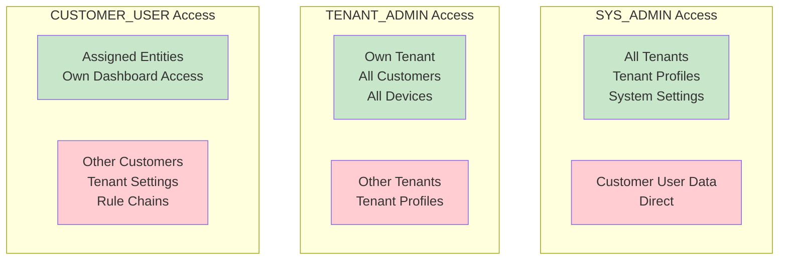

| Resource | SYS_ADMIN | TENANT_ADMIN | CUSTOMER_USER |
|----------|-----------|--------------|---------------|
| Tenant | Full access | Own only | Denied |
| Tenant Profile | Full access | Denied | Denied |
| Customer | Denied | Own tenant | Own only |
| Device | Denied | Own tenant | Assigned only |
| Rule Chain | Denied | Own tenant | Denied |
| Dashboard | Denied | Own tenant | Assigned only |

## Cross-Tenant Operations

### System Administrator Capabilities

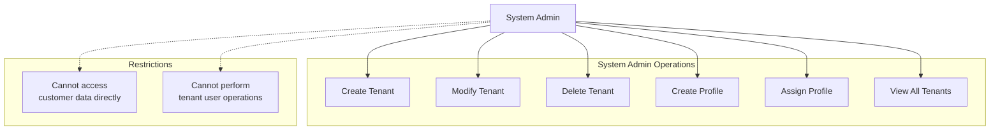

### System Tenant

The system tenant (UUID with all zeros) owns:
- Default tenant profiles
- System-wide settings
- Default device/asset profiles
- Widget bundles

### Tenant Listing

| Authority | Listing Scope |
|-----------|---------------|
| SYS_ADMIN | All tenants |
| TENANT_ADMIN | Own tenant only |
| CUSTOMER_USER | Not permitted |

## Security Validation Flow

### Complete Request Validation

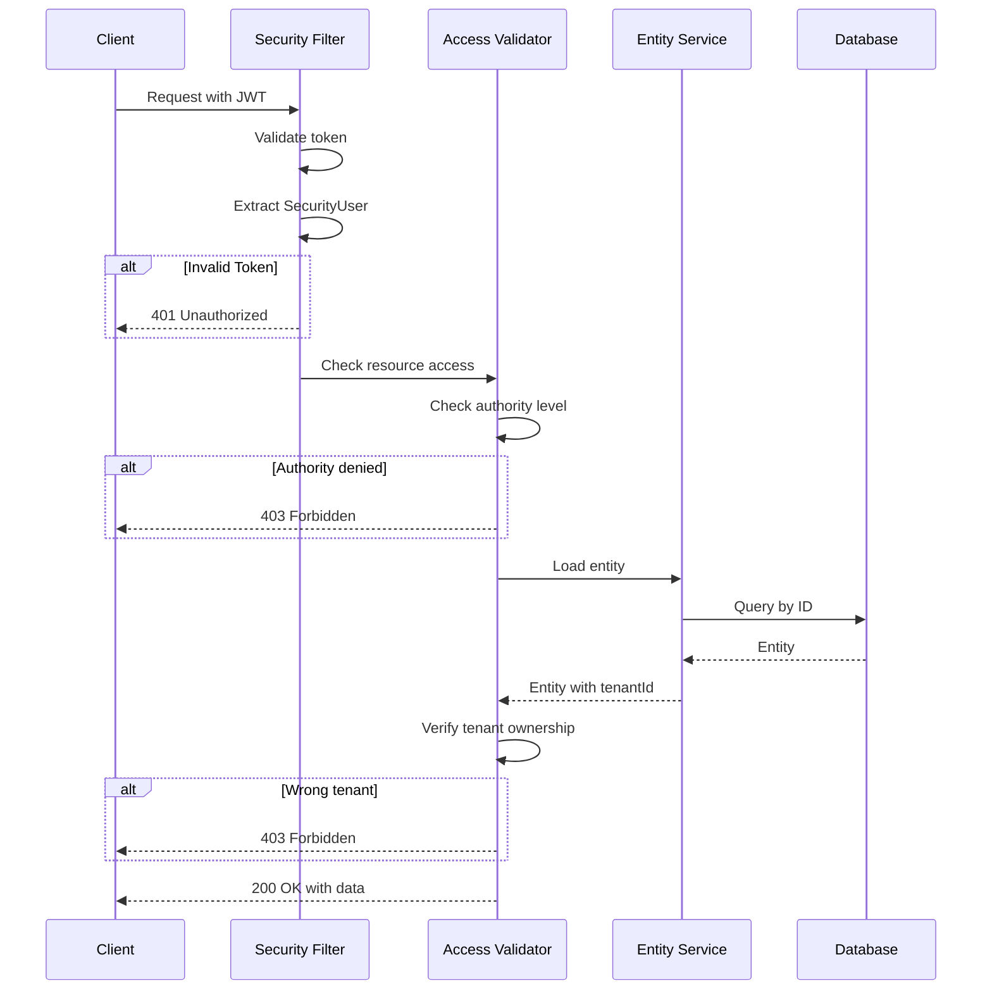

### Validation Rules by Entity Type

| Entity | SYS_ADMIN | TENANT_ADMIN | CUSTOMER_USER |
|--------|-----------|--------------|---------------|
| Device | Denied | Tenant match | Customer assignment |
| Asset | Denied | Tenant match | Customer assignment |
| Customer | Denied | Tenant match | Own customer only |
| User | Denied | Tenant match | Own user only |
| Tenant | All allowed | Own only | Denied |
| TenantProfile | All allowed | Denied | Denied |

## Best Practices

### Tenant Profile Design

1. **Start with defaults**: Use unlimited (0) for initial profiles
2. **Monitor before limiting**: Understand usage patterns first
3. **Gradual limits**: Implement limits incrementally
4. **Warning thresholds**: Keep at 80% for early notification

### Data Isolation

1. **Always filter by tenant**: Never query without tenant context
2. **Validate ownership**: Check entity ownership before operations
3. **Use DAO abstractions**: Let the framework handle filtering

### Queue Configuration

1. **Default shared queues**: Start with shared for simplicity
2. **Isolate when needed**: Use isolation for specific SLA requirements
3. **Monitor queue depth**: Track per-tenant queue metrics

### Performance

1. **Index on tenant_id**: Ensure all tables have tenant indexes
2. **Partition large tables**: Consider tenant-based partitioning
3. **Cache profiles**: Profile lookups should be cached

## Configuration Example

### Tenant Profile Configuration

```yaml
name: "Standard Tier"
description: "Standard tenant limits"
isolatedTbRuleEngine: false
profileData:
  configuration:
    type: "DEFAULT"
    # Entity limits
    maxDevices: 1000
    maxAssets: 500
    maxCustomers: 50
    maxUsers: 100
    maxDashboards: 100
    maxRuleChains: 20

    # Rate limits
    transportTenantMsgRateLimit: "1000:1,30000:60"
    transportDeviceMsgRateLimit: "100:1"

    # Usage quotas
    maxTransportMessages: 10000000
    maxREExecutions: 5000000
    maxJSExecutions: 1000000

    # WebSocket limits
    maxWsSessionsPerTenant: 500
    maxWsSubscriptionsPerTenant: 1000

    # Retention
    defaultStorageTtlDays: 90
    alarmsTtlDays: 365

    # Thresholds
    warnThreshold: 0.8
```

## Troubleshooting

### Common Issues

| Issue | Cause | Solution |
|-------|-------|----------|
| 403 Forbidden | Tenant mismatch | Verify entity ownership |
| Rate limit exceeded | Too many requests | Increase limits or throttle |
| Usage disabled | Quota exhausted | Reset or increase quota |
| Missing data | Wrong tenant context | Check authentication |
| Queue delays | Shared queue congestion | Consider isolation |

### Monitoring Points

- Per-tenant API usage
- Queue depth per tenant
- Rate limit rejections
- Usage state transitions
- Cross-tenant access attempts (should be zero)

## Implementation Details

### Tenant Profile Caching

**DefaultTbTenantProfileCache** implements dual-level caching:
- **Layer 1**: `Map<TenantProfileId, TenantProfile>` - profile by ID
- **Layer 2**: `Map<TenantId, TenantProfileId>` - tenant's assigned profile
- Uses `ReentrantLock` with double-checked locking pattern
- Cache invalidation broadcasts via `addListener()` callbacks

### Rate Limit Implementation

**DefaultRateLimitService** uses token bucket algorithm:
- **Cache**: Caffeine in-memory (TTL: 120 minutes, max 200k entries)
- **Key**: `RateLimitKey(api, level)` where level is TenantId or EntityId
- **Rate Limit Format**: `"capacity:duration_seconds,capacity:duration_seconds"` (e.g., `"1000:1,20000:60"`)
- **Enforcement**: `TbRateLimits.tryConsume()` returns true if within limit
- Triggers `RateLimitsTrigger` notification on limit exceeded

### API Usage State Tracking

**TenantApiUsageState** tracks resource consumption:
- Maintains `currentCycleValues` and `currentHourValues` (ConcurrentHashMap)
- Monthly cycle boundaries with hourly granularity
- State transitions via `checkStateUpdatedDueToThreshold()`:
  - `ENABLED`: usage < warnThreshold (default 80%)
  - `WARNING`: warnThreshold ≤ usage < threshold
  - `DISABLED`: usage ≥ threshold
- Uses `toMoreRestricted()` to combine multiple record keys per feature

**DefaultTbApiUsageStateService** processes usage messages:
- Per-entity lock prevents concurrent updates
- Counters: Additive accumulation across reports
- Gauges: Max per service, aggregated across instances
- Persists state changes to database and triggers notifications

### Access Control Implementation

**DefaultAccessControlService** routes permission checks by authority:

**Permission Check Flow:**
```
checkPermission(user, resource, operation)
  → getPermissionChecker(authority, resource)
  → PermissionChecker.hasPermission(user, operation, entityId, entity)
  → Returns boolean / throws ThingsboardException
```

**Authority-Specific Validation:**

| Authority | Tenant Check | Customer Check |
|-----------|--------------|----------------|
| SYS_ADMIN | Entity must be system-level (null tenant) | N/A |
| TENANT_ADMIN | `user.getTenantId() == entity.getTenantId()` | N/A |
| CUSTOMER_USER | Tenant match required | `user.getCustomerId() == entity.getCustomerId()` |

**Special Cases:**
- CLAIM_DEVICES: Bypasses customer check for customer users
- Dashboards: Uses `isAssignedToCustomer()` instead of direct ID comparison
- Public resources: Allow READ on null/NullUid tenant entities
- User self-modification: Customer users can modify own account

### Entity Limit Enforcement

**DefaultTenantProfileConfiguration** provides limit methods:
- `getEntitiesLimit(EntityType)`: Returns max for DEVICE, ASSET, CUSTOMER, etc.
- Entity creation services check limits before persisting
- Returns 0 for unlimited

### Profile Data Structure

**TenantProfile** entity uses lazy deserialization:
- `profileDataBytes`: Persisted JSON bytes
- `TenantProfileData`: Transient wrapper containing:
  - `TenantProfileConfiguration` (polymorphic interface)
  - `List<TenantProfileQueueConfiguration>` for queue definitions

**DefaultTenantProfileConfiguration** fields:
- Entity limits: `maxDevices`, `maxAssets`, `maxCustomers`, `maxUsers`, `maxDashboards`, `maxRuleChains`, `maxEdges`
- Usage thresholds: `maxTransportMessages`, `maxREExecutions`, `maxJSExecutions`, `maxEmails`, `maxSms`
- TTL settings: `defaultStorageTtlDays`, `alarmsTtlDays`, `rpcTtlDays`
- WebSocket limits: `maxWsSessionsPerTenant`, `maxWsSubscriptionsPerTenant`
- Warning threshold: `warnThreshold` (default 0.8)

## See Also

- [System Overview](./system-overview.md) - Platform architecture
- [Database Schema](../07-data-persistence/database-schema.md) - Tenant tables
- [Authentication](../06-api-layer/authentication.md) - JWT and security
- [Message Queue Architecture](../08-message-queue/queue-architecture.md) - Queue system
- [REST API Overview](../06-api-layer/rest-api-overview.md) - API structure
