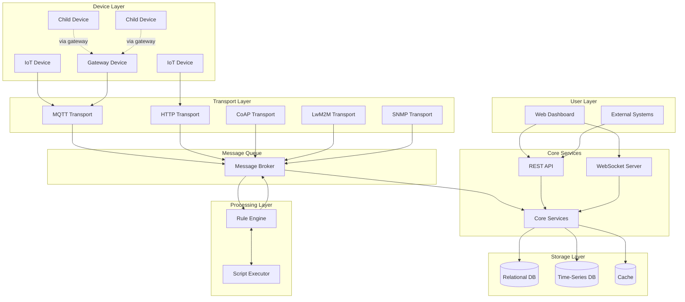
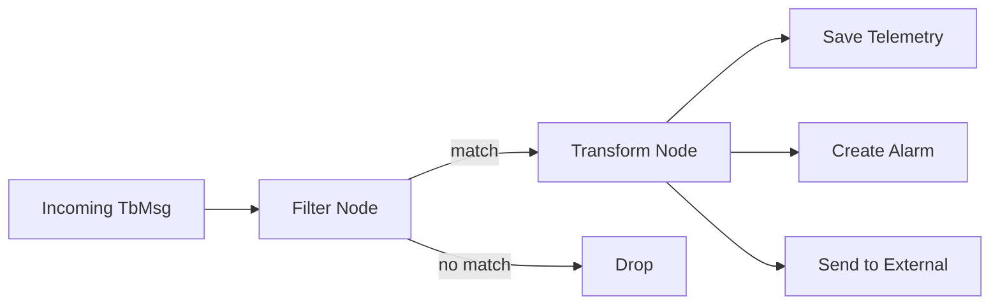
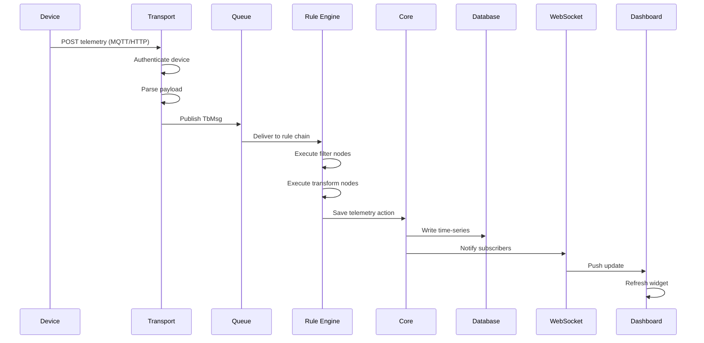
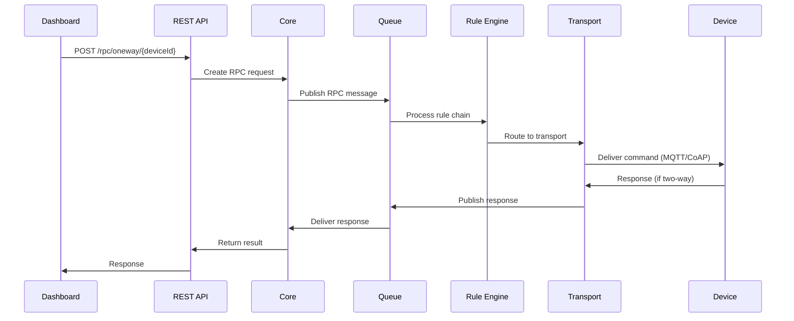
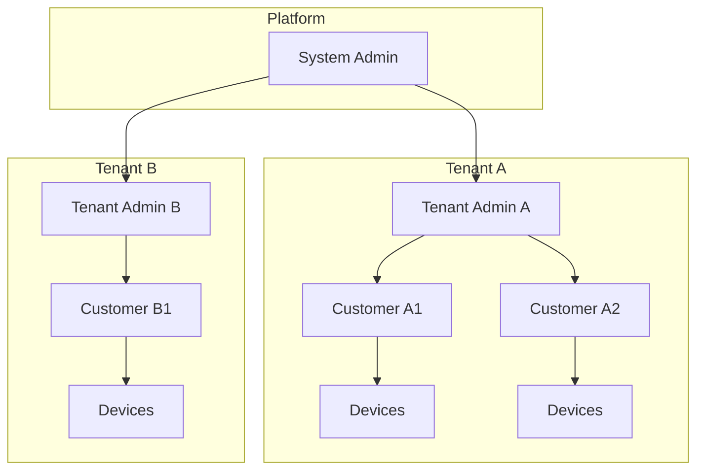
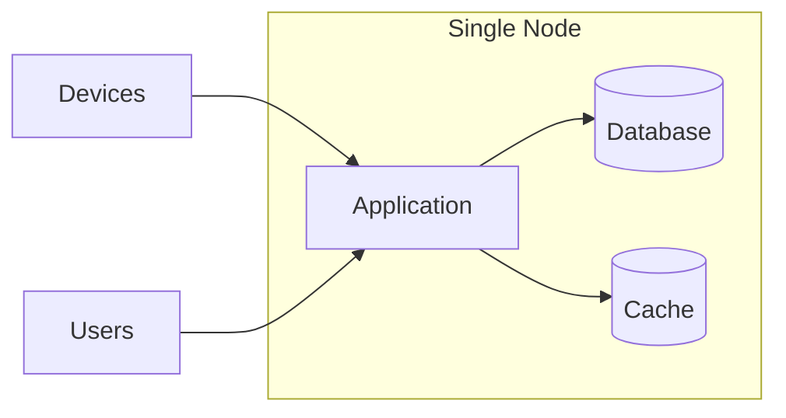
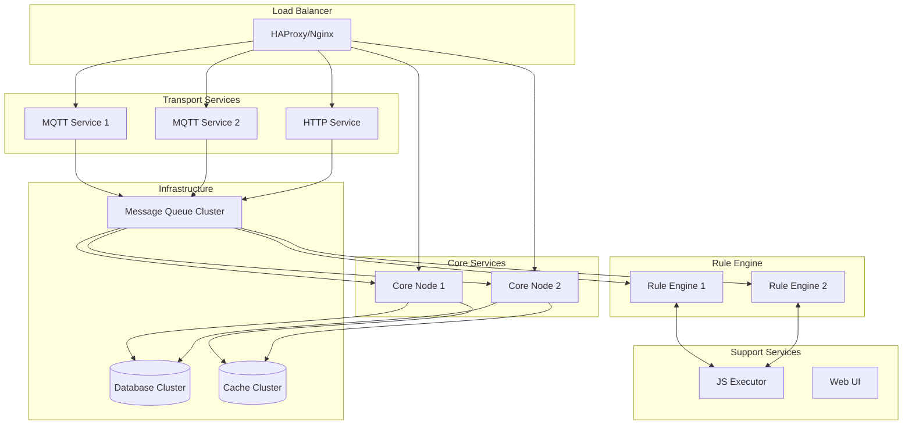

# System Overview

## Overview

ThingsBoard is a multi-tenant IoT platform that collects data from devices, processes it through configurable rule chains, stores it in databases, and presents it to users via dashboards. The platform handles millions of devices and messages through a scalable, distributed architecture.

## Technology Stack

| Component | Technology | Version |
|-----------|------------|---------|
| Language | Java | 17 |
| Framework | Spring Boot | 3.4.10 |
| Message Queue | Apache Kafka | 3.9.1 |
| Time-Series DB | Apache Cassandra | 4.17.0 |
| Relational DB | PostgreSQL | 15+ |
| Cache | Valkey/Redis | 7+ |
| RPC | gRPC | 1.76.0 |
| Serialization | Protocol Buffers | 3.25.5 |
| Networking | Netty | 4.1.128 |
| Frontend | Angular | 18+ |
| Service Discovery | Apache ZooKeeper | 3.9.3 |

## High-Level Architecture



## Component Responsibilities

### Transport Layer
Handles device connections and protocol translation.

| Component | Protocol | Responsibility |
|-----------|----------|----------------|
| MQTT Transport | MQTT 3.1.1/5.0 | Publish/subscribe messaging, session management |
| HTTP Transport | HTTP/HTTPS | REST-style device API, one-shot requests |
| CoAP Transport | CoAP | Constrained device communication over UDP |
| LwM2M Transport | LwM2M | Device management, object model mapping |
| SNMP Transport | SNMP v2c/v3 | Network device monitoring, polling/traps |

All transports perform:
1. **Authentication** - Validate device credentials
2. **Protocol Translation** - Convert to internal message format (TbMsg)
3. **Session Management** - Track connected devices
4. **Rate Limiting** - Protect against device flooding

### Message Queue
Decouples producers from consumers, enabling scalability.

- **Topics** organize messages by type and destination
- **Partitioning** distributes load across cluster nodes
- **Consumer Groups** enable parallel processing
- **Durability** prevents message loss during failures

### Rule Engine
Processes messages through configurable node chains.



Key behaviors:
- Each tenant has a default "root" rule chain
- Device profiles can override the rule chain
- Nodes process messages asynchronously
- Failed nodes can route to error handlers

### Core Services
Business logic and data management.

| Service | Responsibility |
|---------|----------------|
| Device Service | Device CRUD, credentials, state tracking |
| Telemetry Service | Time-series data storage and retrieval |
| Alarm Service | Alarm lifecycle (create, ack, clear) |
| Relation Service | Entity relationship management |
| Dashboard Service | Dashboard/widget configuration |
| User Service | Authentication, authorization |
| Notification Service | Email, SMS, push notifications |
| Calculated Field Service | Derived/computed telemetry values |
| Export/Import Service | Entity backup and migration |
| Version Control Service | Git-based entity versioning |
| Job Manager | Scheduled and triggered job execution |
| Housekeeper Service | TTL-based data cleanup and retention |
| AI Request Executor | LLM/AI model inference integration |

### Advanced Services (v4.3.0)

| Service | Responsibility |
|---------|----------------|
| **Calculated Fields** | Compute derived telemetry from aggregations, scripts, geofencing |
| **Entity Version Control** | Git-based versioning with commit/rollback for entities |
| **Notification Center** | Multi-channel dispatch (Email, SMS, Slack, Firebase) with rule triggers |
| **Edge Gateway** | Distributed edge deployment with cloud synchronization |
| **Housekeeper** | Automated cleanup of telemetry, alarms, events by TTL policy |
| **EDQS** | Entity Data Query Service for distributed entity queries |
| **Mobile App Service** | Mobile bundle management, QR codes, deep linking |

### Storage Layer

**Relational Database** (PostgreSQL):
- Entity metadata (devices, assets, users)
- Configuration (rule chains, dashboards)
- Relationships and hierarchies
- Audit logs

**Time-Series Database** (PostgreSQL or Cassandra):
- Telemetry data with timestamps
- Optimized for range queries
- Configurable retention (TTL)

**Cache**:
- Session data
- Frequently accessed entities
- Rate limiting counters

### API Layer
External interfaces for users and integrations.

**REST API**:
- CRUD operations on all entities
- JWT authentication
- Pagination via PageLink
- Role-based access control

**WebSocket API**:
- Real-time telemetry subscriptions
- Alarm notifications
- Dashboard live updates

## Data Flow: Device Telemetry



## Data Flow: Server-to-Device RPC



## Multi-Tenancy Model



**Isolation guarantees:**
- Tenants cannot access each other's data
- Each tenant has separate:
  - Devices and assets
  - Rule chains
  - Dashboards
  - Users and customers
- Database queries always filter by tenant ID
- Actors process messages within tenant context

## Deployment Modes

### Monolithic
Single application instance with embedded services.



**Use case**: Development, small deployments (<10K devices)

### Microservices
Distributed services with message queue coordination.



**Use case**: Production, high availability, >100K devices

## Advanced Subsystems

### Calculated Fields
Computes derived values from telemetry data with multiple computation types:

| Type | Description |
|------|-------------|
| SIMPLE | Direct value mapping |
| SCRIPT | Custom TBEL/JavaScript computation |
| GEOFENCING | Location-based presence detection |
| ALARM | Alarm state-based calculations |
| PROPAGATION | Cross-entity value propagation |
| RELATED_ENTITIES_AGGREGATION | Aggregate across related entities |
| ENTITY_AGGREGATION | Single entity aggregations |

Supports rolling window aggregations with RocksDB or Kafka state backends.

### Edge Computing Gateway
Distributed deployment pattern for edge-to-cloud scenarios:
- Edge device gateway RPC processor
- Event sourcing via Kafka
- Bidirectional entity synchronization
- Edge statistics collection
- Installation and upgrade instruction services

### Notification System
Multi-channel notification dispatch with rule-based triggers:
- **Channels**: Email, SMS, Slack, Microsoft Teams, Firebase
- **Triggers**: 10+ event types (alarm, entity action, device inactivity)
- **Features**: Template system, deduplication, WebSocket push

### Housekeeper Service
Automated data lifecycle management:
- TTL-based telemetry deletion
- Alarm auto-cleanup
- Event stream purging
- Calculated field state cleanup
- Job deletion and retry processing

## Key Architectural Decisions

### Actor Model for Concurrency
Each device and rule chain has a dedicated actor that processes messages sequentially. This eliminates race conditions and enables millions of concurrent devices without complex locking.

### Message Queue for Decoupling
Asynchronous communication via message queue allows:
- Independent scaling of transports, core, and rule engine
- Fault isolation (failed component doesn't block others)
- Replay capability for recovery

### Configurable Rule Chains
Processing logic is defined as data (rule chains) rather than code. Users can modify behavior without deployments.

### Protocol-Agnostic Core
The core services work with a unified message format (TbMsg). Transport adapters handle protocol-specific details, making it easy to add new protocols.

## Implementation Details

### Actor System Configuration

**DefaultActorService** initializes the actor system with six dispatchers:

| Dispatcher | Threads | Purpose |
|------------|---------|---------|
| `app-dispatcher` | 1 | Application-level actors |
| `tenant-dispatcher` | 2 | Per-tenant actors |
| `device-dispatcher` | 4 | Device actors |
| `rule-dispatcher` | 8 | Rule chain actors |
| `cf-manager-dispatcher` | 2 | Calculated field managers |
| `cf-entity-dispatcher` | 8 | Calculated field entity actors |

Settings: Throughput of 5 messages per actor before switching, max 10 initialization attempts.

### Service Types

**ServiceType** enum defines seven service categories:

| Type | Description |
|------|-------------|
| `TB_CORE` | Core message processing |
| `TB_RULE_ENGINE` | Rule engine processing |
| `TB_TRANSPORT` | Device transport layer |
| `JS_EXECUTOR` | JavaScript execution |
| `TB_VC_EXECUTOR` | Version control executor |
| `EDQS` | Entity Data Query Service |
| `TASK_PROCESSOR` | Task processing |

### Queue Topic Configuration

Default topic names and partitions:

| Service | Topic | Partitions |
|---------|-------|------------|
| TB_CORE | `tb_core` | 10 |
| TB_RULE_ENGINE | Per-queue configured | Configurable |
| Edge | `tb_edge` | 10 |
| Calculated Fields | `tb_cf_event`, `tb_cf_state` | Configurable |

Consumer settings: 25ms poll interval, 2000ms pack processing timeout.

### Partition Service

**HashPartitionService** provides consistent entity routing:
- Hash function: `murmur3_128` (configurable, also supports `murmur3_32`, `sha256`)
- Formula: `partition = Math.abs(hash(entityId) % partitionSize)`
- Two-level hashing for tenant isolation: `(hash(tenantId) + partition) % serverCount`

### Cluster Discovery (ZooKeeper)

**ZkDiscoveryService** manages node registration:
- Creates ephemeral sequential ZK nodes at startup
- Publishes `ServiceInfo` protobuf with node metadata
- Watches for `CHILD_ADDED`/`CHILD_REMOVED` events
- Triggers partition recalculation on topology changes
- Configurable recalculation delay (`zk.recalculate_delay`)

### Inter-Node Communication

**TbClusterService** provides cross-node messaging:
- `pushMsgToCore()` - Route to core service partition
- `pushMsgToRuleEngine()` - Route to rule engine partition
- `broadcastToCore()` - Broadcast to all core nodes
- `pushNotificationToTransport()` - Target-specific transport notification

### Configuration Example

```yaml
queue:
  type: kafka
  core:
    topic: tb_core
    partitions: 10
    poll-interval: 25ms

actors:
  system:
    throughput: 5
    tenant_dispatcher_pool_size: 2
    device_dispatcher_pool_size: 4
    rule_dispatcher_pool_size: 8

zk:
  enabled: true
  recalculate_delay: 0ms
```

## Common Pitfalls

### Deployment Mode Selection

| Pitfall | Symptom | Solution |
|---------|---------|----------|
| **Using monolith for production at scale** | Performance degradation beyond 10K devices | Migrate to microservices deployment for >10K devices |
| **Microservices for small deployments** | Unnecessary operational complexity | Use monolithic deployment for dev/small deployments |
| **Missing load balancer** | Single point of failure | Deploy HAProxy/Nginx in front of services |
| **Ignoring resource requirements** | OOM errors, crashes | Size containers/VMs per official guidelines |

### Horizontal Scaling Issues

| Pitfall | Symptom | Solution |
|---------|---------|----------|
| **Scaling stateful components** | Data inconsistency | Only scale stateless services; use shared storage for state |
| **Uneven partition distribution** | Some nodes overloaded | Verify consistent hashing; adjust partition count |
| **Missing ZooKeeper** | Cluster coordination fails | ZooKeeper required for service discovery in clusters |
| **Auto-scaling too aggressive** | Partition rebalancing storms | Set conservative scaling thresholds; allow stabilization time |

### Component Interaction Errors

| Pitfall | Symptom | Solution |
|---------|---------|----------|
| **Transport directly hitting database** | Bypassed rate limiting | All device data must flow through message queue |
| **Synchronous processing in rule nodes** | Rule engine backpressure | Use async operations; offload to external systems |
| **Missing message queue** | Tight coupling, no backpressure | Message queue is required even in monolith mode |
| **Queue consumer lag** | Message processing delays | Add more rule engine instances; optimize rule chains |

### Data Flow Problems

| Pitfall | Symptom | Solution |
|---------|---------|----------|
| **Telemetry processed but not stored** | Data missing from dashboards | Verify rule chain has "Save Telemetry" action node |
| **RPC not reaching devices** | Timeout errors | Check device connectivity; verify transport subscription |
| **WebSocket subscriptions not updating** | Stale dashboard data | Verify subscription paths; check WebSocket connection |
| **Alarm not triggering** | Expected alarms missing | Verify alarm rule configuration; check device profile |

### Storage Layer Issues

| Pitfall | Symptom | Solution |
|---------|---------|----------|
| **PostgreSQL for high-volume telemetry** | Slow queries, disk full | Use Cassandra or TimescaleDB for time-series data |
| **No TTL configured** | Unlimited storage growth | Configure telemetry TTL in tenant profile |
| **Cache size too small** | High database load | Increase cache memory; monitor hit rates |
| **Missing database indexes** | Slow queries | Ensure tenant_id indexes exist on all tables |

### High Availability Gaps

| Pitfall | Symptom | Solution |
|---------|---------|----------|
| **Single database instance** | Data loss on failure | Configure database replication |
| **No Kafka replication** | Message loss on broker failure | Set replication factor ≥ 2 for production |
| **Missing health checks** | Failed instances not removed | Configure container/service health probes |
| **Recovery time not tested** | Prolonged outage | Document and test failover procedures |

### Actor System Misconfiguration

| Pitfall | Symptom | Solution |
|---------|---------|----------|
| **Dispatcher pool too small** | Message processing delays | Increase pool size based on workload |
| **Throughput too high** | Actor starvation | Reduce throughput to allow fair scheduling |
| **Device actor timeouts** | Device messages dropped | Increase actor initialization timeout |
| **Rule chain loops** | Stack overflow, infinite loops | Add cycle detection; use finite processing depth |

### Network and Security

| Pitfall | Symptom | Solution |
|---------|---------|----------|
| **Transport ports not exposed** | Devices cannot connect | Open MQTT (1883), HTTP (8080), CoAP (5683) ports |
| **No TLS termination** | Insecure device communication | Configure SSL at load balancer or transport level |
| **Internal services exposed** | Security vulnerability | Firewall internal services; expose only API/transport |
| **gRPC without TLS** | Inter-service eavesdropping | Enable TLS for gRPC in production clusters |

### Performance Tuning

| Pitfall | Symptom | Solution |
|---------|---------|----------|
| **Default JVM settings** | Suboptimal memory usage | Tune heap size (Xmx), GC algorithm |
| **Too many partitions** | Coordination overhead | Use 10-20 partitions per service type initially |
| **Poll interval too long** | Processing latency | Reduce poll interval (default 25ms is usually good) |
| **Pack processing timeout too short** | Message drops during spikes | Increase timeout for batch-heavy workloads |

## See Also

- [Actor System](../03-actor-system/README.md) - Concurrency model details
- [Rule Engine](../04-rule-engine/) - Rule chain architecture
- [Transport Layer](../05-transport-layer/) - Protocol implementations
- [Multi-Tenancy](./multi-tenancy.md) - Isolation details
