# System Overview

## Overview

ThingsBoard is a multi-tenant IoT platform that collects data from devices, processes it through configurable rule chains, stores it in databases, and presents it to users via dashboards. The platform handles millions of devices and messages through a scalable, distributed architecture.

## Technology Stack

| Component | Technology | Version |
|-----------|------------|---------|
| Language | Java | 17 |
| Framework | Spring Boot | 3.4.10 |
| Message Queue | Apache Kafka | 3.9.1 |
| Time-Series DB | Apache Cassandra | 4.17.0 |
| Relational DB | PostgreSQL | 15+ |
| Cache | Valkey/Redis | 7+ |
| RPC | gRPC | 1.76.0 |
| Serialization | Protocol Buffers | 3.25.5 |
| Networking | Netty | 4.1.128 |
| Frontend | Angular | 18+ |
| Service Discovery | Apache ZooKeeper | 3.9.3 |

## High-Level Architecture

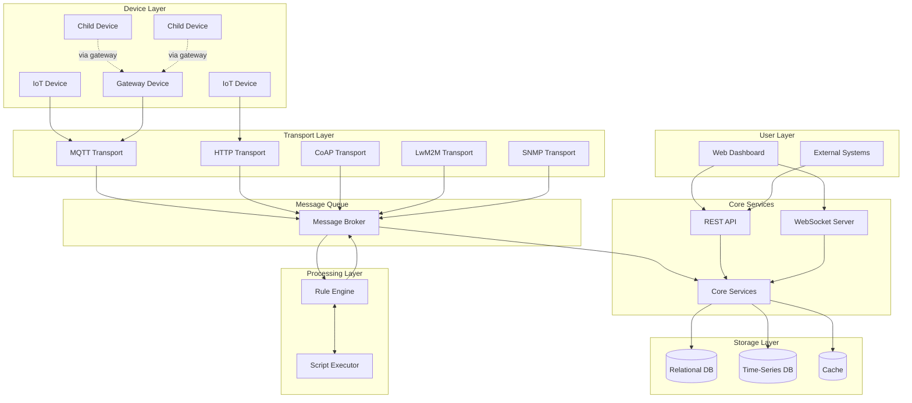

## Component Responsibilities

### Transport Layer
Handles device connections and protocol translation.

| Component | Protocol | Responsibility |
|-----------|----------|----------------|
| MQTT Transport | MQTT 3.1.1/5.0 | Publish/subscribe messaging, session management |
| HTTP Transport | HTTP/HTTPS | REST-style device API, one-shot requests |
| CoAP Transport | CoAP | Constrained device communication over UDP |
| LwM2M Transport | LwM2M | Device management, object model mapping |
| SNMP Transport | SNMP v2c/v3 | Network device monitoring, polling/traps |

All transports perform:
1. **Authentication** - Validate device credentials
2. **Protocol Translation** - Convert to internal message format (TbMsg)
3. **Session Management** - Track connected devices
4. **Rate Limiting** - Protect against device flooding

### Message Queue
Decouples producers from consumers, enabling scalability.

- **Topics** organize messages by type and destination
- **Partitioning** distributes load across cluster nodes
- **Consumer Groups** enable parallel processing
- **Durability** prevents message loss during failures

### Rule Engine
Processes messages through configurable node chains.

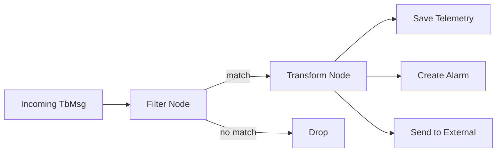

Key behaviors:
- Each tenant has a default "root" rule chain
- Device profiles can override the rule chain
- Nodes process messages asynchronously
- Failed nodes can route to error handlers

### Core Services
Business logic and data management.

| Service | Responsibility |
|---------|----------------|
| Device Service | Device CRUD, credentials, state tracking |
| Telemetry Service | Time-series data storage and retrieval |
| Alarm Service | Alarm lifecycle (create, ack, clear) |
| Relation Service | Entity relationship management |
| Dashboard Service | Dashboard/widget configuration |
| User Service | Authentication, authorization |
| Notification Service | Email, SMS, push notifications |
| Calculated Field Service | Derived/computed telemetry values |
| Export/Import Service | Entity backup and migration |
| Version Control Service | Git-based entity versioning |
| Job Manager | Scheduled and triggered job execution |
| Housekeeper Service | TTL-based data cleanup and retention |
| AI Request Executor | LLM/AI model inference integration |

### Advanced Services (v4.3.0)

| Service | Responsibility |
|---------|----------------|
| **Calculated Fields** | Compute derived telemetry from aggregations, scripts, geofencing |
| **Entity Version Control** | Git-based versioning with commit/rollback for entities |
| **Notification Center** | Multi-channel dispatch (Email, SMS, Slack, Firebase) with rule triggers |
| **Edge Gateway** | Distributed edge deployment with cloud synchronization |
| **Housekeeper** | Automated cleanup of telemetry, alarms, events by TTL policy |
| **EDQS** | Entity Data Query Service for distributed entity queries |
| **Mobile App Service** | Mobile bundle management, QR codes, deep linking |

### Storage Layer

**Relational Database** (PostgreSQL):
- Entity metadata (devices, assets, users)
- Configuration (rule chains, dashboards)
- Relationships and hierarchies
- Audit logs

**Time-Series Database** (PostgreSQL or Cassandra):
- Telemetry data with timestamps
- Optimized for range queries
- Configurable retention (TTL)

**Cache**:
- Session data
- Frequently accessed entities
- Rate limiting counters

### API Layer
External interfaces for users and integrations.

**REST API**:
- CRUD operations on all entities
- JWT authentication
- Pagination via PageLink
- Role-based access control

**WebSocket API**:
- Real-time telemetry subscriptions
- Alarm notifications
- Dashboard live updates

## Data Flow: Device Telemetry

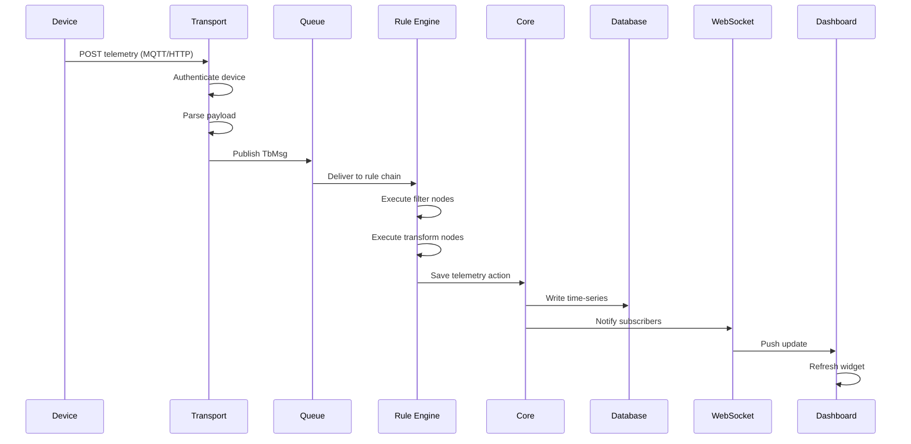

## Data Flow: Server-to-Device RPC

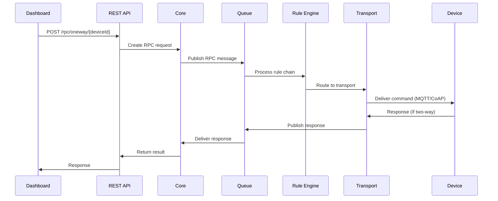

## IoT Device Connectivity Architecture

### Connection Lifecycle

Devices progress through a connection lifecycle managed by the transport layer:

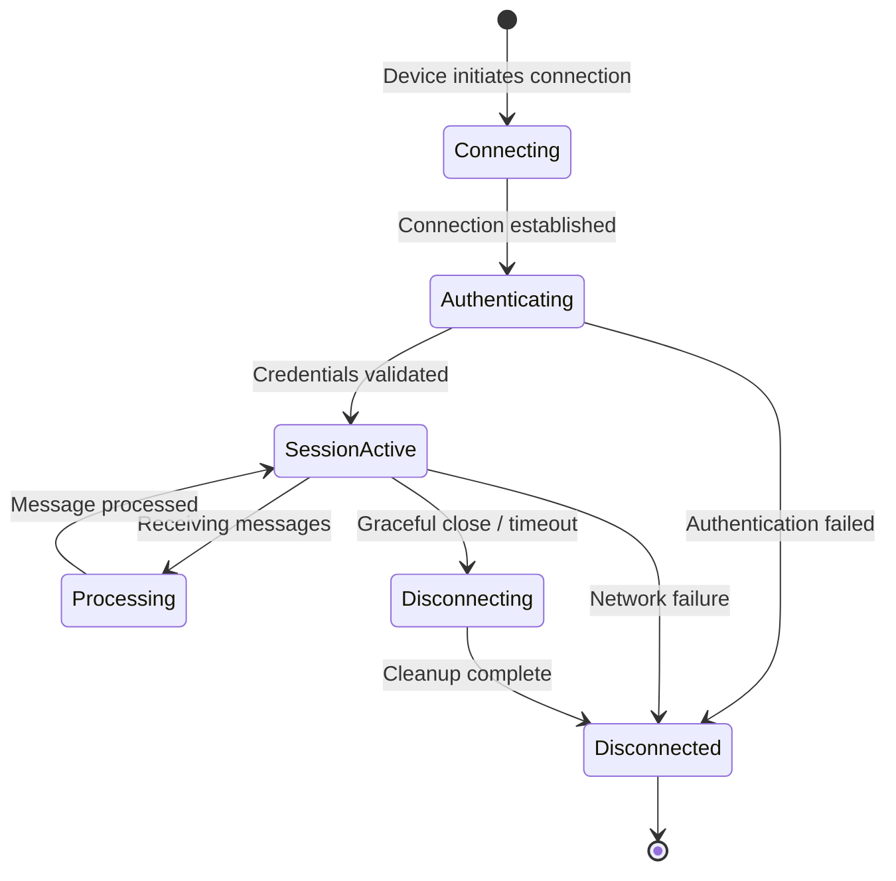

**Lifecycle Phases**:
1. **Connecting**: Device establishes network connection (TCP for MQTT/HTTP, UDP for CoAP)
2. **Authenticating**: Transport validates device credentials against core services
3. **SessionActive**: Device can send telemetry and receive commands
4. **Processing**: Messages are queued and forwarded to rule engine
5. **Disconnecting**: Session cleanup and resource release

### Authentication Flows

#### Token-Based Authentication

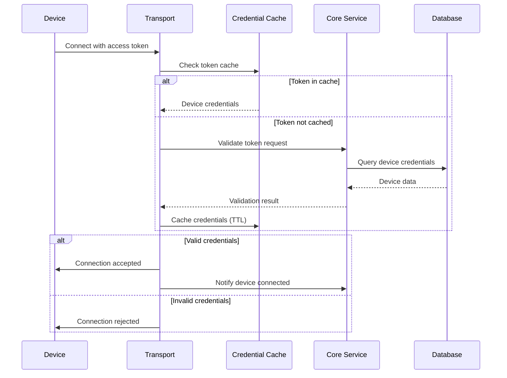

**Key Behaviors**:
- **Credential Caching**: Valid credentials cached (configurable TTL) to reduce database load
- **Cache Invalidation**: Credentials removed from cache when device is deleted/disabled
- **Failed Auth Handling**: Rate limiting on authentication failures prevents brute force

#### Certificate-Based Authentication (X.509)

For MQTT over TLS and LwM2M over DTLS:
- Device presents X.509 certificate during TLS/DTLS handshake
- Common Name (CN) or certificate fingerprint maps to device identity
- Certificate validation occurs before application-level processing
- Revocation checking via CRL or OCSP (configurable)

### Protocol-Specific Connection Patterns

#### MQTT Connection Patterns

**Persistent Sessions** (Clean Session = false):
- Session state stored across connections (subscriptions, unacknowledged messages)
- Device reconnects resume from previous state
- Session expiry configurable (default: 24 hours after disconnect)

**QoS Level Guarantees**:
- **QoS 0** (At most once): No delivery guarantee, lowest overhead
- **QoS 1** (At least once): Acknowledged delivery, possible duplicates
- **QoS 2** (Exactly once): Highest guarantee, highest overhead

**Will Messages**:
- Device specifies "last will" message at connection time
- Platform publishes will message if device disconnects unexpectedly
- Used for device state tracking and alarm generation

#### HTTP Connection Patterns

**Stateless Requests**:
- Each request is independent
- Authentication token included in every request (header or query param)
- No session state maintained on server
- Suitable for constrained devices with intermittent connectivity

**Long-Polling** (for device-to-cloud commands):
- Device sends request with timeout parameter
- Server holds request open until command available or timeout
- Reduces polling overhead while maintaining HTTP compatibility

#### CoAP Connection Patterns

**Observe Pattern** (CoAP Observe):
- Device registers for resource observations
- Server pushes updates when resource changes
- Uses UDP multicast for efficiency in local networks

**Block-Wise Transfer**:
- Large payloads split into blocks
- Suitable for constrained networks
- Automatic reassembly at application layer

#### LwM2M Connection Patterns

**Registration Lifecycle**:
- Device registers with platform (endpoint name, objects, lifetime)
- Platform tracks registration state
- Re-registration before lifetime expires or device sleeps

**Object Model**:
- Devices expose standardized objects (Device, Connectivity, Firmware, etc.)
- Platform reads/writes object resources
- Observations trigger telemetry updates

### Session Management Across Cluster

#### Session State Persistence

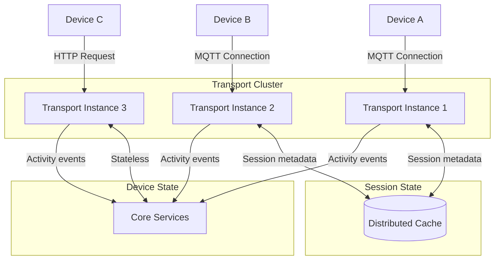

**State Management Strategy**:
- **MQTT**: Session metadata in distributed cache (subscriptions, QoS state)
- **HTTP**: Stateless, no session tracking required
- **CoAP**: Observation state in cache
- **LwM2M**: Registration state in core services database

**Load Balancer Affinity**:
- **MQTT/LwM2M**: Sticky sessions required (persistent connections)
- **HTTP/CoAP**: No affinity required (stateless or short-lived)

### Device State Tracking

Platform maintains device connectivity state:

| State | Trigger | Meaning |
|-------|---------|---------|
| **ACTIVE** | Recent message within activity timeout | Device connected and sending data |
| **INACTIVE** | No messages within activity timeout | Device disconnected or not reporting |
| **SUSPENDED** | Administratively disabled | Device credentials revoked |

**Activity Detection**:
- Any message from device updates last activity timestamp
- Configurable activity timeout per device profile (default: 10 minutes)
- Inactive → Active transition generates "Device Connected" event
- Active → Inactive transition generates "Device Disconnected" event
- Events trigger rule chain processing (e.g., send alarm)

### Connection Limits and Resource Management

**Per-Transport Instance Limits**:
- **Max Concurrent Connections**: Configurable per transport type
- **Connection Rate Limiting**: Max new connections per second
- **Message Rate Limiting**: Per-device and per-tenant limits
- **Payload Size Limits**: Per-protocol maximums

**Resource Allocation**:
- Each active connection consumes: file descriptor, memory buffer, session state
- Transport instances scale horizontally to support more connections
- Recommended connections per instance: 10K-50K (MQTT), depends on message rate

**Back-Pressure Mechanisms**:
- Transport stops accepting new connections when queue depth exceeds threshold
- TCP backlog limits new connection rate
- QoS 1/2 delivery slows when consumer lags behind producer

### Network Topology Considerations

#### NAT Traversal

**Devices Behind NAT**:
- **Outbound Connections**: Device initiates connection (standard pattern)
- **Keep-Alive**: Required to maintain NAT mapping
  - MQTT: PINGREQ/PINGRESP every keep-alive interval
  - HTTP: Long-polling or periodic requests
  - CoAP: Confirmable messages maintain UDP NAT state
  - LwM2M: Update message before lifetime expires

**Keep-Alive Recommendations**:
- Mobile networks: 30-120 seconds
- WiFi/Fixed networks: 300-600 seconds
- Balance between battery life and connection stability

#### TLS/DTLS Termination

**Transport-Level TLS**:
- TLS termination at transport microservice
- Certificate verification before application processing
- Per-protocol TLS configuration (cipher suites, TLS versions)

**Load Balancer TLS**:
- Alternative: TLS termination at load balancer (HAProxy, nginx)
- Reduces transport CPU load
- Requires trust between load balancer and transports

#### Port and Firewall Requirements

| Protocol | Default Port | TLS/DTLS Port | Protocol Type |
|----------|--------------|---------------|---------------|
| MQTT | 1883 | 8883 | TCP |
| HTTP | 8080 | 443 | TCP |
| CoAP | 5683 | 5684 | UDP |
| LwM2M | 5685 | 5686 | UDP |
| SNMP | 161 (trap: 162) | N/A | UDP |

**Firewall Configuration**:
- Inbound: Allow device connections to transport ports
- Outbound: Allow transport to message queue, core services
- Internal: Secure inter-service communication (gRPC, REST)

### Gateway Connectivity Patterns

#### Protocol Gateway Pattern

Device uses non-IP protocol (Modbus, BLE, Zigbee), gateway translates to MQTT/HTTP:

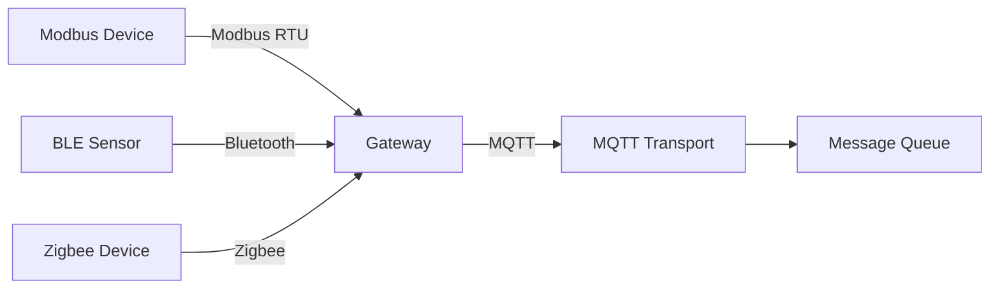

**Gateway Responsibilities**:
- Protocol translation (Modbus → JSON, BLE → JSON)
- Message aggregation (multiple devices → single MQTT connection)
- Local buffering during connectivity loss
- Device identity management (child devices)

#### Aggregation Gateway Pattern

Multiple IP-capable devices connect through gateway for centralized management:

**Use Cases**:
- Reduce cellular data costs (single connection vs many)
- Centralized security policy enforcement
- Edge processing and filtering
- Simplified firewall management

### Offline Operation and Reconnection

**Device-Side Buffering**:
- Device buffers messages when disconnected
- Publishes buffered messages on reconnection
- MQTT QoS 1/2 ensures delivery after reconnect

**Platform-Side Buffering**:
- Downlink messages (commands, configuration) queued for offline devices
- Delivered when device reconnects
- Configurable message TTL (time-to-live)

**Reconnection Strategy**:
- Exponential backoff: 1s, 2s, 4s, 8s, 16s, max 5 minutes
- Randomized jitter to prevent thundering herd
- Immediate reconnect on transient errors (TCP reset, DNS timeout)

## Multi-Tenancy Model

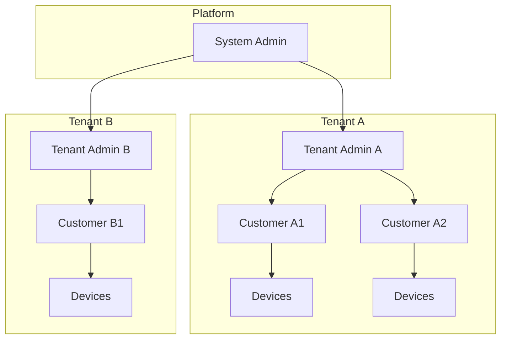

**Isolation guarantees:**
- Tenants cannot access each other's data
- Each tenant has separate:
  - Devices and assets
  - Rule chains
  - Dashboards
  - Users and customers
- Database queries always filter by tenant ID
- Actors process messages within tenant context

## Deployment Modes

### Monolithic
Single application instance with embedded services.

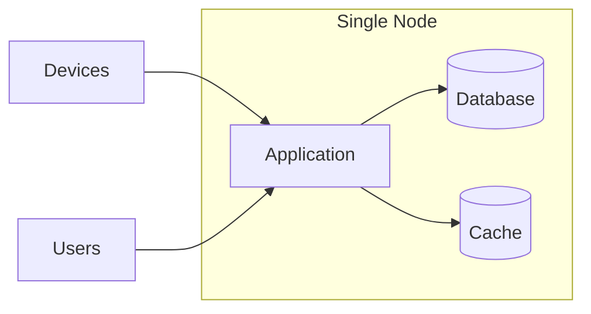

**Use case**: Development, small deployments (<10K devices)

### Microservices
Distributed services with message queue coordination.

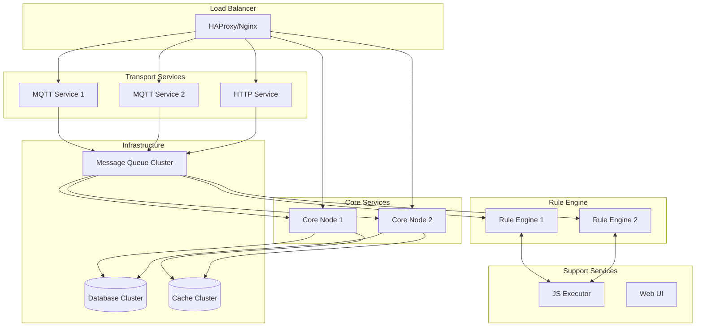

**Use case**: Production, high availability, >100K devices

### Deployment Sizing Guidelines

Proper deployment sizing depends on device count, message rate, data point volume, and protocol distribution.

#### Sizing Calculation Formula

**Step 1: Calculate Message Throughput**
```
Messages per second = (Total Devices × Messages per Device per Hour) / 3600
```

**Step 2: Calculate Data Point Rate**
```
Data points per second = Messages per second × Average Data Points per Message
```

**Step 3: Calculate Daily Storage**
```
Daily storage (GB) = Data points per day × Bytes per data point × Retention days / 1,000,000,000
```

**Example Calculation** (100K smart meters, reporting every hour):
```
Messages/sec = (100,000 devices × 1 msg/hour) / 3600 = 28 messages/sec
Data points/sec = 28 msg/sec × 3 points/msg = 84 data points/sec
Daily data points = 84 × 86,400 = 7,257,600 data points/day
Daily storage (PostgreSQL) = 7.26M points × 40 bytes ≈ 290 MB/day
Daily storage (Cassandra) = 7.26M points × 15 bytes ≈ 109 MB/day
```

#### Transport Layer Sizing

**MQTT Transport Instances**:
```
Required instances = Concurrent Connections / Connections per Instance
```

| Hardware | Max Connections per Instance | Throughput per Instance |
|----------|----------------------------|-------------------------|
| 2 vCPU, 4 GB RAM | 10,000 connections | 1,000 msg/sec |
| 4 vCPU, 8 GB RAM | 25,000 connections | 3,000 msg/sec |
| 8 vCPU, 16 GB RAM | 50,000 connections | 8,000 msg/sec |

**Connection Considerations**:
- Each MQTT connection: ~40-60 KB memory overhead
- HTTP connections: Stateless, no persistent connection overhead
- CoAP connections: Observation state ~20 KB per device
- LwM2M registrations: ~30 KB per device

**Example** (50K MQTT devices, 2K messages/sec):
- Connections: 50K / 25K per instance = 2 transport instances (4 vCPU each)
- Throughput: 2K msg/sec well below 3K msg/sec per instance ✓

#### Core Services Sizing

**Core Service Instances**:
```
Required instances = API Request Rate / Requests per Instance + Data Subscription Load
```

| Hardware | API Throughput | WebSocket Subscriptions |
|----------|----------------|------------------------|
| 4 vCPU, 8 GB RAM | 500 requests/sec | 5,000 subscriptions |
| 8 vCPU, 16 GB RAM | 1,500 requests/sec | 15,000 subscriptions |
| 16 vCPU, 32 GB RAM | 4,000 requests/sec | 40,000 subscriptions |

**Load Factors**:
- Dashboard users: ~10-50 API requests/sec per active user
- WebSocket subscriptions: ~5-10 per dashboard widget
- Mobile apps: ~5-10 API requests/sec per active session

**Example** (100 concurrent dashboard users):
- API load: 100 users × 30 req/sec = 3,000 req/sec
- Subscriptions: 100 users × 30 widgets = 3,000 subscriptions
- Required: 2× (8 vCPU, 16 GB) core instances

#### Rule Engine Sizing

**Rule Engine Instances**:
```
Required instances = Message Throughput / Processing Capacity
```

| Hardware | Simple Rules | Complex Rules (scripts/external calls) |
|----------|--------------|--------------------------------------|
| 4 vCPU, 8 GB RAM | 2,000 msg/sec | 500 msg/sec |
| 8 vCPU, 16 GB RAM | 5,000 msg/sec | 1,500 msg/sec |
| 16 vCPU, 32 GB RAM | 12,000 msg/sec | 4,000 msg/sec |

**Rule Complexity Factors**:
- **Simple Rules**: Filter, transform, enrichment from cache (< 5ms per message)
- **Medium Rules**: Database lookups, REST API calls (10-50ms per message)
- **Complex Rules**: JavaScript execution, ML inference, complex joins (50-200ms per message)

**JavaScript Executor Sizing**:
- Required when rule chains use Script nodes
- Recommended ratio: 10-20 JS executors per rule engine instance
- Each JS executor: 1 vCPU, 2 GB RAM
- Handles ~100-200 script executions/sec

**Example** (5K msg/sec, 30% use scripts):
- Simple processing: 3,500 msg/sec → 1× (8 vCPU) rule engine
- Script processing: 1,500 msg/sec → 1× (8 vCPU) rule engine + 15 JS executors

#### Database Sizing

**Time-Series Database** (PostgreSQL vs Cassandra):

| Database | Max Data Points/sec | Use Case |
|----------|---------------------|----------|
| PostgreSQL (db.t3.medium) | 1,000 | < 100M data points/day |
| PostgreSQL (db.m5.large) | 5,000 | < 500M data points/day |
| TimescaleDB (db.m5.xlarge) | 15,000 | < 1.5B data points/day |
| Cassandra (3-node cluster) | 50,000 | > 1B data points/day |
| Cassandra (5-node cluster) | 150,000 | > 5B data points/day |

**Entity Database** (PostgreSQL):
- Stores device metadata, rule chains, dashboards (not telemetry)
- Size based on entity count, not message rate
- Typical sizing: db.t3.medium handles 1M entities

**Storage Capacity Planning**:
```
Total storage = Daily storage × Retention days × Replication factor
```

| Database | Bytes per Data Point | Replication Factor |
|----------|---------------------|-------------------|
| PostgreSQL | 35-45 bytes | 1 (use backup snapshots) |
| TimescaleDB | 20-30 bytes (compressed) | 1 (use backup snapshots) |
| Cassandra | 12-18 bytes | 3 (recommended) |

**Example** (10M data points/day, 90-day retention, Cassandra):
```
Total storage = 10M × 15 bytes × 90 days × 3 replicas
             = 13.5B bytes × 3 = 40.5 GB raw storage needed
             = ~60 GB with overhead (metadata, indexes, compaction)
```

#### Message Queue Sizing

**Kafka Cluster**:
```
Required brokers = Peak Message Rate / Broker Throughput + Replication Overhead
```

| Hardware | Throughput (w/ replication) | Retention Storage |
|----------|-----------------------------|--------------------|
| kafka.m5.large | 10,000 msg/sec | 1 TB per broker |
| kafka.m5.xlarge | 30,000 msg/sec | 2 TB per broker |
| kafka.m5.2xlarge | 80,000 msg/sec | 4 TB per broker |

**Partition Sizing**:
- Core queue: 10 partitions (default, supports 10 concurrent consumers)
- Rule engine queue: 10 partitions per queue
- Each partition: ~1,000-2,000 msg/sec max throughput

**Retention**:
- Time-based: 7 days (default) ensures message replay during outages
- Size-based: 50 GB per partition (prevents disk full)

**Example** (10K msg/sec sustained, 20K msg/sec peak):
- Brokers: 3× kafka.m5.large (30K msg/sec combined) ✓
- Partitions: 10 partitions × 2K msg/sec = 20K max ✓
- Storage: 20K msg/sec × 500 bytes × 7 days × 1.5 (replication) = 900 GB ✓

#### Cache Sizing

**Redis/Valkey Cluster**:
```
Required memory = Active Devices × Cache per Device + Session State
```

| Cached Data | Memory per Item |
|-------------|----------------|
| Device credentials | 2 KB |
| Device attributes | 5 KB |
| Latest telemetry | 3 KB |
| User session | 10 KB |
| Tenant profile | 15 KB |

**Example** (100K devices, 1K active sessions):
```
Device cache = 100K × (2 KB + 5 KB + 3 KB) = 1 GB
Session cache = 1K × 10 KB = 10 MB
Total needed = 1.1 GB
Recommended = 2 GB (with headroom for peak usage)
Instance: cache.m5.large (6.38 GB) ✓
```

#### Complete Deployment Examples

**Small Deployment** (10K devices, 100 msg/sec):
- **Deployment Mode**: Monolithic
- **Hardware**: 1× (4 vCPU, 8 GB RAM)
- **Database**: PostgreSQL (db.t3.medium)
- **Total Cost** (AWS): ~$150/month

**Medium Deployment** (100K devices, 1K msg/sec, mostly MQTT):
- **Deployment Mode**: Microservices
- **Transport**: 2× MQTT (4 vCPU, 8 GB)
- **Core**: 2× (8 vCPU, 16 GB)
- **Rule Engine**: 2× (8 vCPU, 16 GB)
- **JS Executor**: 20× (1 vCPU, 2 GB)
- **Database**: PostgreSQL (db.m5.large) or TimescaleDB
- **Kafka**: 3× kafka.m5.large
- **Cache**: cache.m5.large
- **Total Cost** (AWS): ~$2,500-3,500/month

**Large Deployment** (1M devices, 15K msg/sec, mixed protocols):
- **Deployment Mode**: Microservices
- **Transport**: 8× MQTT (4 vCPU, 8 GB), 3× HTTP (4 vCPU, 8 GB)
- **Core**: 4× (16 vCPU, 32 GB)
- **Rule Engine**: 6× (16 vCPU, 32 GB)
- **JS Executor**: 60× (1 vCPU, 2 GB)
- **Database**: Cassandra 5-node cluster (m5.2xlarge) + PostgreSQL (db.m5.xlarge)
- **Kafka**: 5× kafka.m5.xlarge
- **Cache**: cache.r5.xlarge (replica enabled)
- **Total Cost** (AWS): ~$25,000-35,000/month

#### Sizing Decision Matrix

| Criteria | Monolithic | Microservices |
|----------|-----------|---------------|
| **Devices** | < 10,000 | > 10,000 |
| **Message Rate** | < 500/sec | > 500/sec |
| **Data Points** | < 50M/day | > 50M/day |
| **HA Required** | No | Yes |
| **Multi-Region** | No | Yes |
| **Operational Complexity** | Low | Medium-High |
| **Cost** | Low | High |

#### Protocol-Specific Considerations

**MQTT-Heavy Deployments** (> 70% MQTT):
- More transport instances needed (persistent connections)
- Sticky load balancer sessions required
- Higher memory per transport instance
- Session state in distributed cache

**HTTP-Heavy Deployments** (> 70% HTTP):
- Fewer transport instances (stateless)
- No load balancer affinity required
- Lower memory per transport
- Database load for credential validation (cache aggressively)

**Mixed Protocol Deployments**:
- Separate transport instances per protocol
- Size each transport type independently
- MQTT instances: connection count
- HTTP instances: request rate
- CoAP/LwM2M instances: observation count

#### Monitoring and Auto-Scaling

**Scale-Up Indicators**:
- Transport CPU > 70% sustained
- Rule engine queue depth > 10K messages
- Database CPU > 80% sustained
- Kafka consumer lag > 60 seconds
- Memory usage > 85%

**Scale-Down Indicators**:
- All metrics < 30% for > 1 hour
- No message queue lag
- Response times consistently fast

**Auto-Scaling Strategy**:
- Transport: Scale on connection count
- Core/Rule Engine: Scale on queue depth
- Database: Vertical scaling (upgrade instance) or read replicas
- Kafka: Add brokers (manual, plan ahead)
- Cache: Vertical scaling or cluster sharding

## Advanced Subsystems

### Calculated Fields
Computes derived values from telemetry data with multiple computation types:

| Type | Description |
|------|-------------|
| SIMPLE | Direct value mapping |
| SCRIPT | Custom TBEL/JavaScript computation |
| GEOFENCING | Location-based presence detection |
| ALARM | Alarm state-based calculations |
| PROPAGATION | Cross-entity value propagation |
| RELATED_ENTITIES_AGGREGATION | Aggregate across related entities |
| ENTITY_AGGREGATION | Single entity aggregations |

Supports rolling window aggregations with RocksDB or Kafka state backends.

### Edge Computing Gateway
Distributed deployment pattern for edge-to-cloud scenarios:
- Edge device gateway RPC processor
- Event sourcing via Kafka
- Bidirectional entity synchronization
- Edge statistics collection
- Installation and upgrade instruction services

### Notification System
Multi-channel notification dispatch with rule-based triggers:
- **Channels**: Email, SMS, Slack, Microsoft Teams, Firebase
- **Triggers**: 10+ event types (alarm, entity action, device inactivity)
- **Features**: Template system, deduplication, WebSocket push

### Housekeeper Service
Automated data lifecycle management:
- TTL-based telemetry deletion
- Alarm auto-cleanup
- Event stream purging
- Calculated field state cleanup
- Job deletion and retry processing

## Key Architectural Decisions

### Actor Model for Concurrency
Each device and rule chain has a dedicated actor that processes messages sequentially. This eliminates race conditions and enables millions of concurrent devices without complex locking.

### Message Queue for Decoupling
Asynchronous communication via message queue allows:
- Independent scaling of transports, core, and rule engine
- Fault isolation (failed component doesn't block others)
- Replay capability for recovery

### Configurable Rule Chains
Processing logic is defined as data (rule chains) rather than code. Users can modify behavior without deployments.

### Protocol-Agnostic Core
The core services work with a unified message format (TbMsg). Transport adapters handle protocol-specific details, making it easy to add new protocols.

## Service Component Architecture

The platform implements a layered service architecture where business logic is encapsulated in service components with well-defined responsibilities and lifecycle management.

### Service Layer Organization

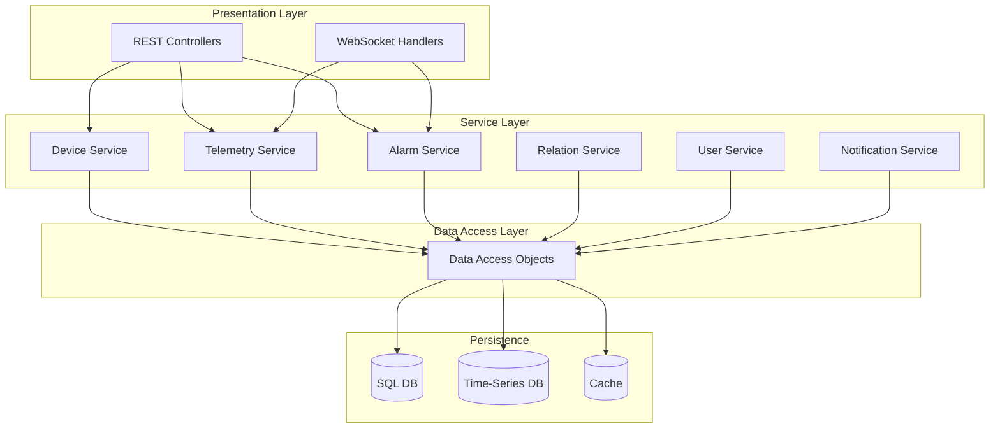

**Architectural Layers**:
1. **Presentation Layer**: HTTP endpoints (REST API, WebSocket subscriptions)
2. **Service Layer**: Business logic, validation, orchestration
3. **Data Access Layer**: Database operations, caching, query optimization
4. **Persistence**: Physical storage (databases, cache)

### Component Lifecycle

Components participate in application lifecycle through well-defined phases:

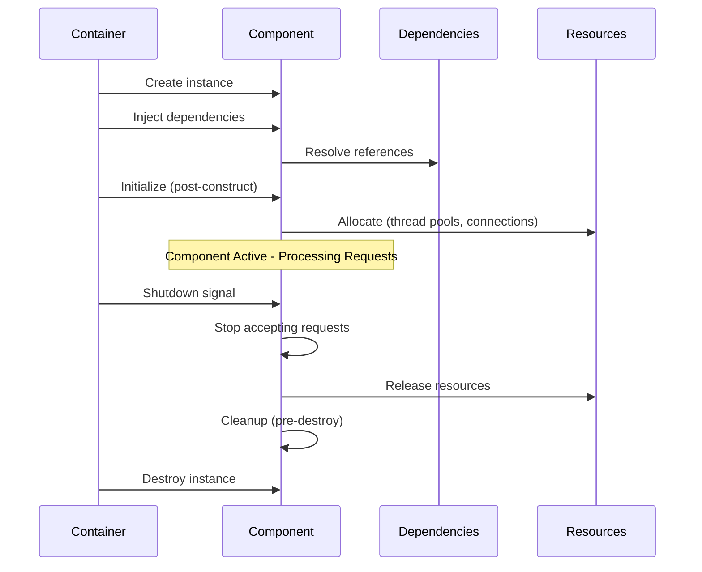

**Lifecycle Phases**:
1. **Instantiation**: Container creates component instance
2. **Dependency Injection**: Container injects required dependencies (other services, configuration)
3. **Initialization**: Component performs setup (initialize actor system, open connections, start threads)
4. **Active**: Component processes requests
5. **Pre-Shutdown**: Component stops accepting new requests, completes in-flight requests
6. **Cleanup**: Component releases resources (close connections, stop threads)
7. **Destruction**: Container destroys component

**Initialization Examples**:
- **Actor Service**: Creates actor system, initializes dispatchers, starts root actors
- **Transport Services**: Bind to network ports, initialize session management, start message processors
- **Rule Engine**: Load rule chains from database, initialize rule node actors
- **Database Services**: Initialize connection pools, verify schema, warm up caches

**Cleanup Examples**:
- **Actor System**: Stop all actors gracefully, wait for message processing completion
- **Transport Services**: Close active connections with proper protocol-level goodbye messages
- **Message Queue**: Flush pending messages, close producer/consumer connections

### Dependency Management

Components declare dependencies on interfaces rather than concrete implementations:

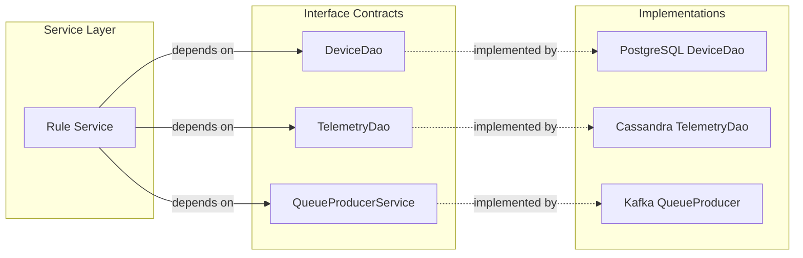

**Benefits**:
- **Testability**: Mock implementations for unit testing
- **Flexibility**: Swap implementations (PostgreSQL → TimescaleDB) without changing service code
- **Modularity**: Services depend on contracts, not implementations

**Dependency Injection Pattern**:
- Components declare dependencies (interfaces)
- Container resolves dependencies at startup
- Circular dependencies detected and reported as errors
- Missing dependencies cause application startup failure (fail-fast principle)

### Service Responsibilities

| Service Category | Examples | Responsibilities |
|------------------|----------|------------------|
| **Entity Services** | DeviceService, AssetService, CustomerService | CRUD operations, validation, relationship management |
| **Data Services** | TelemetryService, AttributeService | Time-series data storage/retrieval, aggregations, latest values |
| **Processing Services** | RuleEngineService, ScriptExecutorService | Message processing, transformation, user-defined logic |
| **Integration Services** | NotificationService, IntegrationService | External system communication, email/SMS, webhooks |
| **Security Services** | AuthenticationService, AuthorizationService | User authentication, permission checks, JWT management |
| **System Services** | AuditLogService, HousekeeperService, JobService | Platform operations, cleanup, scheduled tasks |

### Resource Management

Different workload types use dedicated thread pools to prevent resource contention:

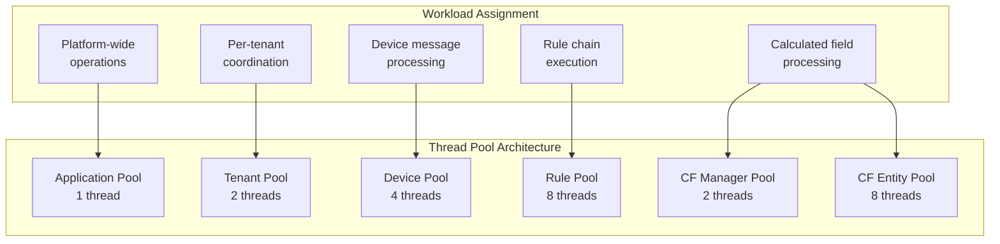

**Thread Pool Strategy**:
- **Isolation**: Heavy workloads (rule processing) don't starve lightweight operations (tenant coordination)
- **Predictability**: Each workload type has guaranteed resources
- **Tuning**: Pool sizes configurable based on workload characteristics and hardware

**Pool Sizing Guidelines**:
- **CPU-Bound Workloads** (calculations, transformations): Pool size ≈ CPU cores
- **I/O-Bound Workloads** (database queries, external APIs): Pool size > CPU cores (typically 2-4x)
- **Coordination Workloads** (tenant management): Small pool (1-2 threads)
- **High-Throughput Workloads** (rule processing): Larger pool (8-16 threads)

**Auto-Sizing**:
- If pool size configured as 0, automatically size to `max(1, CPU_cores / 2)`
- Useful for container deployments where CPU allocation varies

### Back-Pressure Handling

The actor system implements throughput limits to prevent overload:

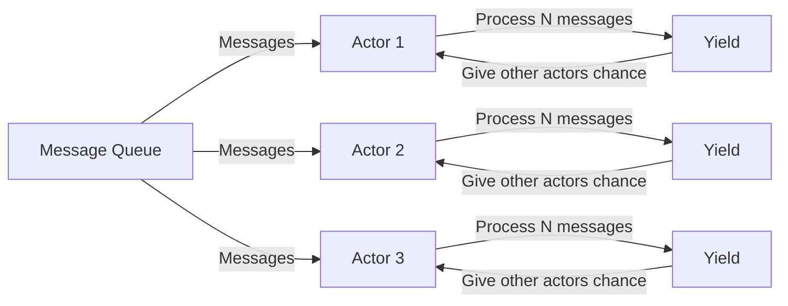

**Throughput Configuration**:
- **Actor Throughput**: Number of messages processed before yielding (default: 5)
- **Purpose**: Prevent single busy actor from starving others
- **Trade-off**: Higher throughput = better per-actor performance, lower = fairer scheduling

**Fairness Guarantees**:
- High-traffic devices/tenants don't starve low-traffic ones
- All actors get regular processing time
- Prevents "noisy neighbor" problems in multi-tenant environment

## Configuration Management Architecture

All platform behavior is controlled through externalized configuration, enabling the same application to run in different environments without code changes.

### Configuration Hierarchy

Configuration is organized by functional domain in a hierarchical structure:

```
thingsboard.yml
├── server                    # HTTP server settings
│   ├── address              # Bind address
│   ├── port                 # Bind port
│   ├── ssl                  # TLS configuration
│   └── ws                   # WebSocket settings
├── database                  # Database configuration
│   ├── type                 # PostgreSQL, TimescaleDB, Cassandra
│   ├── ts                   # Time-series database
│   └── entities             # Entity database
├── actors                    # Actor system configuration
│   └── system
│       ├── throughput       # Messages per yield
│       ├── app_dispatcher_pool_size
│       ├── tenant_dispatcher_pool_size
│       └── device_dispatcher_pool_size
├── queue                     # Message queue configuration
│   ├── type                 # Kafka, In-Memory
│   ├── kafka                # Kafka-specific settings
│   └── core                 # Core service queue
├── transport                 # Transport layer configuration
│   ├── mqtt                 # MQTT transport settings
│   ├── http                 # HTTP transport settings
│   ├── coap                 # CoAP transport settings
│   └── lwm2m                # LwM2M transport settings
└── cache                     # Cache configuration
    └── type                 # Redis, Valkey, Caffeine
```

### Environment-Specific Configuration

Configuration values support environment variable substitution:

```yaml
# Configuration file example
server:
  port: "${HTTP_BIND_PORT:8080}"
  ssl:
    enabled: "${SSL_ENABLED:false}"

database:
  type: "${DATABASE_TYPE:sql}"
  host: "${DATABASE_HOST:localhost}"
```

**Substitution Pattern**: `${ENVIRONMENT_VARIABLE:default_value}`

**Configuration Priority** (highest to lowest):
1. **Command-line arguments**: `--server.port=9090`
2. **Environment variables**: `HTTP_BIND_PORT=9090`
3. **Configuration file**: `server.port: 8080`
4. **Built-in defaults**: Hardcoded in application

**Deployment Scenarios**:
- **Development**: Use defaults from configuration file
- **Staging**: Override database host, message queue endpoints via environment variables
- **Production**: Override all infrastructure endpoints, enable SSL, tune thread pools

### Dynamic vs Static Configuration

| Configuration Type | Hot-Reload | Requires Restart | Examples |
|--------------------|------------|------------------|----------|
| **Static** | No | Yes | Server port, SSL certificates, database connection strings |
| **Dynamic** | Yes | No | Rate limits, timeouts, feature flags, tenant profiles |
| **Semi-Dynamic** | Partial | Depends | Thread pool sizes (new size on restart), cache TTL (gradual effect) |

**Static Configuration**:
- Changes require application restart
- Examples: Network bindings (ports), persistent connections (database URL), SSL keystores

**Dynamic Configuration**:
- Changes take effect immediately or gradually
- Stored in database, retrieved at runtime
- Examples: Tenant profiles (rate limits, quotas), device profiles (transport timeout, firmware URL)

**Configuration Reload**:
- Most static configuration cached at startup for performance
- Cache invalidation events trigger reload without restart (e.g., tenant profile updates)
- Some settings require restart due to OS/JVM limitations (port binding, memory allocation)

### Configuration Validation

**Startup Validation**:
- Required configuration properties checked at startup
- Invalid values (negative port, malformed URL) cause startup failure
- Fail-fast principle: Better to fail at startup than at runtime

**Runtime Validation**:
- User-provided configuration (tenant profiles, device profiles) validated on save
- Invalid configuration rejected with clear error message
- Prevents invalid configuration from entering system

**Common Validation Rules**:
- **Port numbers**: 1-65535 range
- **Thread pool sizes**: Positive integers
- **Timeouts**: Positive durations with units (ms, seconds, minutes)
- **File paths**: Exist and readable
- **URLs**: Valid format, reachable (optional ping check)

## Implementation Details

### Actor System Configuration

**DefaultActorService** initializes the actor system with six dispatchers:

| Dispatcher | Threads | Purpose |
|------------|---------|---------|
| `app-dispatcher` | 1 | Application-level actors |
| `tenant-dispatcher` | 2 | Per-tenant actors |
| `device-dispatcher` | 4 | Device actors |
| `rule-dispatcher` | 8 | Rule chain actors |
| `cf-manager-dispatcher` | 2 | Calculated field managers |
| `cf-entity-dispatcher` | 8 | Calculated field entity actors |

Settings: Throughput of 5 messages per actor before switching, max 10 initialization attempts.

### Service Types

**ServiceType** enum defines seven service categories:

| Type | Description |
|------|-------------|
| `TB_CORE` | Core message processing |
| `TB_RULE_ENGINE` | Rule engine processing |
| `TB_TRANSPORT` | Device transport layer |
| `JS_EXECUTOR` | JavaScript execution |
| `TB_VC_EXECUTOR` | Version control executor |
| `EDQS` | Entity Data Query Service |
| `TASK_PROCESSOR` | Task processing |

### Queue Topic Configuration

Default topic names and partitions:

| Service | Topic | Partitions |
|---------|-------|------------|
| TB_CORE | `tb_core` | 10 |
| TB_RULE_ENGINE | Per-queue configured | Configurable |
| Edge | `tb_edge` | 10 |
| Calculated Fields | `tb_cf_event`, `tb_cf_state` | Configurable |

Consumer settings: 25ms poll interval, 2000ms pack processing timeout.

### Partition Service

**HashPartitionService** provides consistent entity routing:
- Hash function: `murmur3_128` (configurable, also supports `murmur3_32`, `sha256`)
- Formula: `partition = Math.abs(hash(entityId) % partitionSize)`
- Two-level hashing for tenant isolation: `(hash(tenantId) + partition) % serverCount`

### Cluster Discovery (ZooKeeper)

**ZkDiscoveryService** manages node registration:
- Creates ephemeral sequential ZK nodes at startup
- Publishes `ServiceInfo` protobuf with node metadata
- Watches for `CHILD_ADDED`/`CHILD_REMOVED` events
- Triggers partition recalculation on topology changes
- Configurable recalculation delay (`zk.recalculate_delay`)

### Inter-Node Communication

**TbClusterService** provides cross-node messaging:
- `pushMsgToCore()` - Route to core service partition
- `pushMsgToRuleEngine()` - Route to rule engine partition
- `broadcastToCore()` - Broadcast to all core nodes
- `pushNotificationToTransport()` - Target-specific transport notification

### Configuration Example

```yaml
queue:
  type: kafka
  core:
    topic: tb_core
    partitions: 10
    poll-interval: 25ms

actors:
  system:
    throughput: 5
    tenant_dispatcher_pool_size: 2
    device_dispatcher_pool_size: 4
    rule_dispatcher_pool_size: 8

zk:
  enabled: true
  recalculate_delay: 0ms
```

## Common Pitfalls

### Deployment Mode Selection

| Pitfall | Symptom | Solution |
|---------|---------|----------|
| **Using monolith for production at scale** | Performance degradation beyond 10K devices | Migrate to microservices deployment for >10K devices |
| **Microservices for small deployments** | Unnecessary operational complexity | Use monolithic deployment for dev/small deployments |
| **Missing load balancer** | Single point of failure | Deploy HAProxy/Nginx in front of services |
| **Ignoring resource requirements** | OOM errors, crashes | Size containers/VMs per official guidelines |

### Horizontal Scaling Issues

| Pitfall | Symptom | Solution |
|---------|---------|----------|
| **Scaling stateful components** | Data inconsistency | Only scale stateless services; use shared storage for state |
| **Uneven partition distribution** | Some nodes overloaded | Verify consistent hashing; adjust partition count |
| **Missing ZooKeeper** | Cluster coordination fails | ZooKeeper required for service discovery in clusters |
| **Auto-scaling too aggressive** | Partition rebalancing storms | Set conservative scaling thresholds; allow stabilization time |

### Component Interaction Errors

| Pitfall | Symptom | Solution |
|---------|---------|----------|
| **Transport directly hitting database** | Bypassed rate limiting | All device data must flow through message queue |
| **Synchronous processing in rule nodes** | Rule engine backpressure | Use async operations; offload to external systems |
| **Missing message queue** | Tight coupling, no backpressure | Message queue is required even in monolith mode |
| **Queue consumer lag** | Message processing delays | Add more rule engine instances; optimize rule chains |

### Data Flow Problems

| Pitfall | Symptom | Solution |
|---------|---------|----------|
| **Telemetry processed but not stored** | Data missing from dashboards | Verify rule chain has "Save Telemetry" action node |
| **RPC not reaching devices** | Timeout errors | Check device connectivity; verify transport subscription |
| **WebSocket subscriptions not updating** | Stale dashboard data | Verify subscription paths; check WebSocket connection |
| **Alarm not triggering** | Expected alarms missing | Verify alarm rule configuration; check device profile |

### Storage Layer Issues

| Pitfall | Symptom | Solution |
|---------|---------|----------|
| **PostgreSQL for high-volume telemetry** | Slow queries, disk full | Use Cassandra or TimescaleDB for time-series data |
| **No TTL configured** | Unlimited storage growth | Configure telemetry TTL in tenant profile |
| **Cache size too small** | High database load | Increase cache memory; monitor hit rates |
| **Missing database indexes** | Slow queries | Ensure tenant_id indexes exist on all tables |

### High Availability Gaps

| Pitfall | Symptom | Solution |
|---------|---------|----------|
| **Single database instance** | Data loss on failure | Configure database replication |
| **No Kafka replication** | Message loss on broker failure | Set replication factor ≥ 2 for production |
| **Missing health checks** | Failed instances not removed | Configure container/service health probes |
| **Recovery time not tested** | Prolonged outage | Document and test failover procedures |

### Actor System Misconfiguration

| Pitfall | Symptom | Solution |
|---------|---------|----------|
| **Dispatcher pool too small** | Message processing delays | Increase pool size based on workload |
| **Throughput too high** | Actor starvation | Reduce throughput to allow fair scheduling |
| **Device actor timeouts** | Device messages dropped | Increase actor initialization timeout |
| **Rule chain loops** | Stack overflow, infinite loops | Add cycle detection; use finite processing depth |

### Network and Security

| Pitfall | Symptom | Solution |
|---------|---------|----------|
| **Transport ports not exposed** | Devices cannot connect | Open MQTT (1883), HTTP (8080), CoAP (5683) ports |
| **No TLS termination** | Insecure device communication | Configure SSL at load balancer or transport level |
| **Internal services exposed** | Security vulnerability | Firewall internal services; expose only API/transport |
| **gRPC without TLS** | Inter-service eavesdropping | Enable TLS for gRPC in production clusters |

### IoT Device Connectivity

| Pitfall | Symptom | Solution |
|---------|---------|----------|
| **MQTT session not persistent** | Devices lose subscriptions on reconnect | Use Clean Session = false for persistent sessions |
| **Keep-alive too short** | Excessive battery drain, frequent reconnects | Set keep-alive to 5-10 minutes for mobile devices |
| **Keep-alive too long** | NAT timeout closes connection silently | Set keep-alive < NAT timeout (typically < 5 min for cellular) |
| **No sticky sessions for MQTT** | Connection rejected on reconnect to different instance | Configure load balancer sticky sessions for MQTT/LwM2M |
| **HTTP long-polling timeout mismatch** | Commands not delivered to devices | Align device timeout with server processing timeout |
| **QoS 2 for high-volume telemetry** | Excessive overhead, reduced throughput | Use QoS 0 for telemetry, QoS 1 for commands |
| **Will message not configured** | Device disconnect not detected | Configure MQTT will message for state tracking |
| **Credential caching disabled** | Database overload from auth queries | Enable credential caching with appropriate TTL |
| **Device token in URL query param** | Token logged in access logs, security risk | Use HTTP header (X-Authorization) for device tokens |
| **Certificate validation skipped** | Man-in-the-middle attacks possible | Enable proper certificate validation with trusted CA |

### Protocol-Specific Issues

| Pitfall | Symptom | Solution |
|---------|---------|----------|
| **CoAP UDP port exhaustion** | Connection refused errors | Scale horizontally; monitor port usage |
| **LwM2M lifetime too short** | Excessive registration traffic | Set lifetime to 24 hours for battery-powered devices |
| **SNMP trap flooding** | Rule engine overload | Configure trap rate limiting per device |
| **Large MQTT payload** | Connection drops, slow processing | Split large payloads; use compression; enforce size limits |
| **HTTP status code ignored** | Device doesn't detect errors | Device must check HTTP 429 (rate limit), 400 (bad request) |

### Gateway and Edge Connectivity

| Pitfall | Symptom | Solution |
|---------|---------|----------|
| **Gateway single point of failure** | All child devices offline if gateway fails | Deploy redundant gateways with failover |
| **No local buffering** | Data loss during connectivity outage | Implement local buffering at gateway/device |
| **Child device identity collision** | Gateway reports wrong device data | Use unique IDs per child device; validate at platform |
| **Gateway credential shared** | Security vulnerability if gateway compromised | Use device-specific credentials, not shared gateway token |
| **Protocol translation errors** | Malformed JSON, parsing failures | Validate translated payload before sending to platform |

### Authentication and Security

| Pitfall | Symptom | Solution |
|---------|---------|----------|
| **Hardcoded credentials** | Cannot rotate credentials without firmware update | Store credentials in device secure storage; support remote provisioning |
| **No rate limiting per device** | Single device can DoS tenant | Configure per-device message rate limits in device profile |
| **Weak credential rotation** | Credentials never expire | Implement credential expiry and rotation policy |
| **Token in device logs** | Credentials leaked in diagnostic logs | Never log full credentials; redact in logs |
| **Failed auth not throttled** | Brute force attacks succeed | Implement exponential backoff for failed auth attempts |

### Session Management

| Pitfall | Symptom | Solution |
|---------|---------|----------|
| **Session state not in cache** | Session loss on transport failover | Use distributed cache (Redis) for session state |
| **Cache TTL too short** | Frequent session re-creation | Align cache TTL with typical device connection duration |
| **Session cleanup not triggered** | Memory leak from orphaned sessions | Implement session timeout cleanup job |
| **No graceful disconnect** | Platform doesn't detect device offline | Use protocol-specific disconnect messages (MQTT DISCONNECT) |

### Performance Tuning

| Pitfall | Symptom | Solution |
|---------|---------|----------|
| **Default JVM settings** | Suboptimal memory usage | Tune heap size (Xmx), GC algorithm |
| **Too many partitions** | Coordination overhead | Use 10-20 partitions per service type initially |
| **Poll interval too long** | Processing latency | Reduce poll interval (default 25ms is usually good) |
| **Pack processing timeout too short** | Message drops during spikes | Increase timeout for batch-heavy workloads |

## See Also

**Core Architecture**:
- [Actor System](../03-actor-system/README.md) - Concurrency model details, actor lifecycle, message processing
- [Rule Engine](../04-rule-engine/) - Rule chain architecture, node types, message flow
- [Multi-Tenancy](./multi-tenancy.md) - Tenant isolation, profiles, usage tracking, access control

**Device Connectivity**:
- [Transport Layer](../05-transport-layer/) - Protocol implementations (MQTT, HTTP, CoAP, LwM2M, SNMP)
- [Device Provisioning](../02-core-concepts/device-provisioning.md) - Device onboarding strategies and workflows
- [Device Claiming](../02-core-concepts/device-claiming.md) - Device ownership management
- [OTA Updates](../02-core-concepts/ota-updates.md) - Firmware update architecture

**Edge and Gateway**:
- [Edge Architecture](../12-edge/edge-architecture.md) - Edge computing deployment patterns
- [IoT Gateway](../13-iot-gateway/gateway-architecture.md) - Gateway connectivity and protocol translation

**Data and Integration**:
- [Data Persistence](../07-data-persistence/) - Database architecture and storage strategies
- [Message Queue](../08-message-queue/) - Kafka configuration and partitioning
- [API Layer](../06-api-layer/) - REST API, WebSocket, authentication

**Deployment and Operations**:
- [Deployment Guide](../18-deployment/) - Installation, configuration, monitoring
