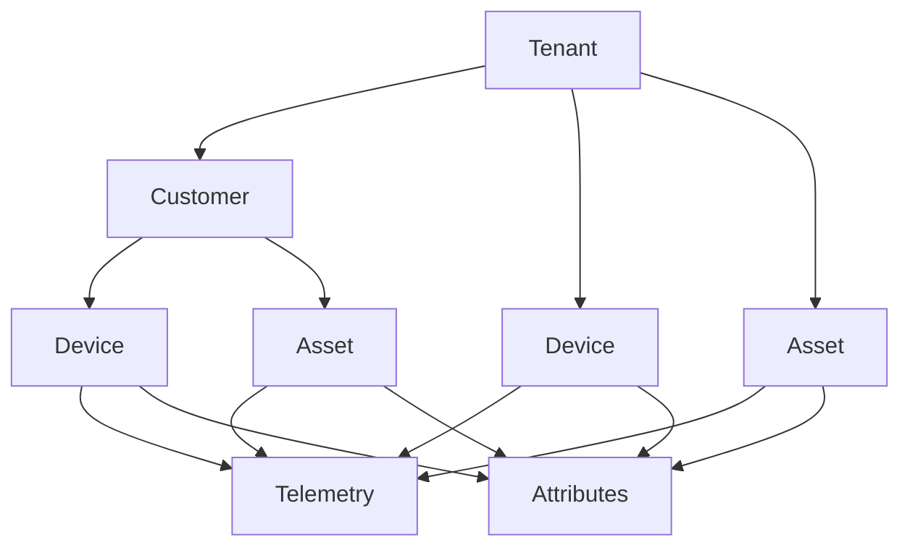

# Core Concepts

## Overview

This section defines the fundamental building blocks of the ThingsBoard platform: entities, data models, and identity management. Understanding these concepts is essential before working with any other part of the system.

## Contents

| Subsection | Description |
|------------|-------------|
| [Entities](./entities/) | Core entity types: devices, assets, tenants, customers, dashboards, alarms, and relations |
| [Data Model](./data-model/) | Data types: telemetry, attributes, RPC commands, and calculated fields |
| [Identity](./identity/) | Entity identification and UUID-based addressing |

## Key Concepts

- **Entity-Centric Design**: Everything in the platform is an entity with a unique ID
- **Telemetry vs Attributes**: Time-series data (telemetry) vs static/semi-static properties (attributes)
- **Hierarchical Ownership**: Tenant → Customer → Device/Asset ownership chain
- **Relations**: Flexible entity-to-entity connections with typed relationships
- **Alarms**: State-machine based alerting tied to entities

## Entity Hierarchy

## See Also

- [Architecture](../01-architecture/README.md) - System-level context
- [Rule Engine](../04-rule-engine/README.md) - Processing entity data
- [Data Persistence](../07-data-persistence/README.md) - Storage layer for entities and data
