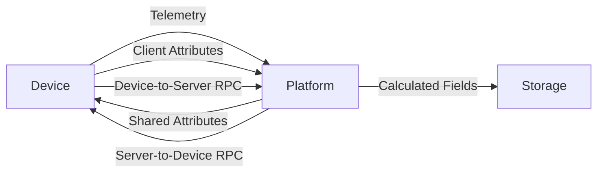

# Data Model

## Overview

The data model defines how information flows into and out of the platform. ThingsBoard distinguishes between time-series telemetry, key-value attributes, remote procedure calls (RPC), and server-side calculated fields.

## Contents

| Document | Description |
|----------|-------------|
| [Telemetry](./telemetry.md) | Time-series data: ingestion, storage, aggregation, and retention |
| [Attributes](./attributes.md) | Key-value properties: client, server, and shared scopes |
| [RPC](./rpc.md) | Remote procedure calls: server-to-device and device-to-server commands |
| [Calculated Fields](./calculated-fields.md) | Server-side computed values using scripts or expressions |

## Key Concepts

- **Telemetry**: Time-stamped measurements (temperature, humidity, status changes)
- **Attributes**: Static or slowly-changing properties (firmware version, configuration)
- **Attribute Scopes**: Client-side (device reports), Server-side (platform sets), Shared (bidirectional)
- **RPC**: Two-way command channel between platform and devices
- **Calculated Fields**: Derived values computed from other data points

## Data Flow

## See Also

- [Entities](../entities/) - What data belongs to
- [Transport Layer](../../05-transport-layer/) - How data arrives
- [Data Persistence](../../07-data-persistence/) - How data is stored
