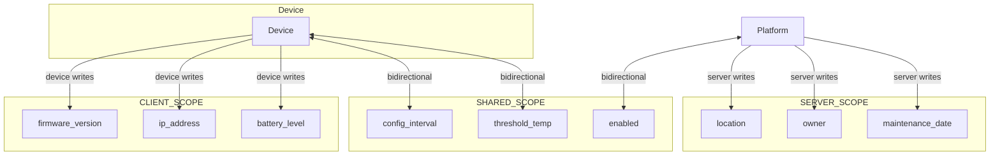
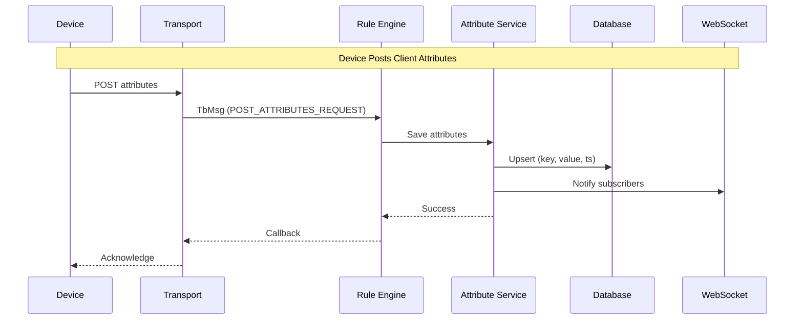
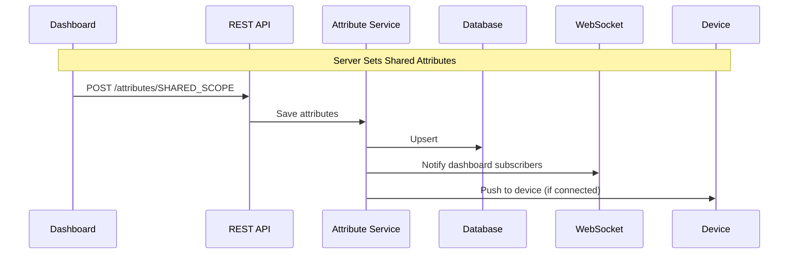
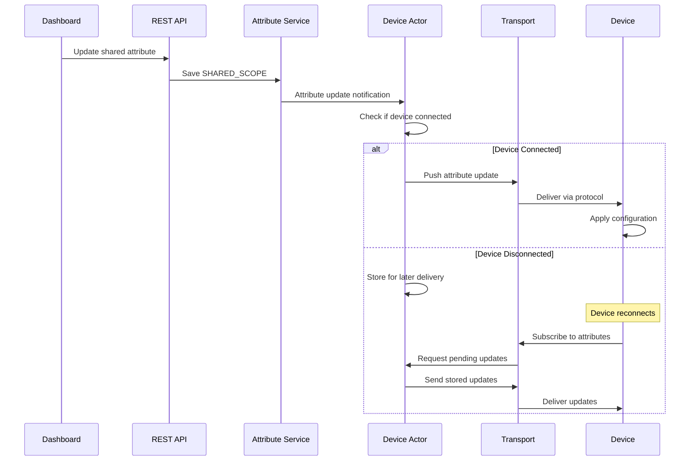
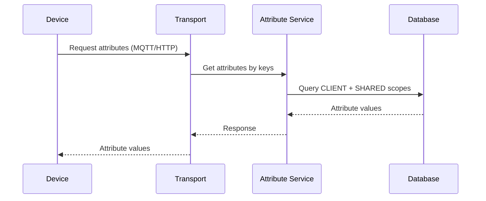

# Attributes Data Model

## Overview

Attributes are key-value pairs that represent the current state or configuration of an entity. Unlike telemetry (which is time-series data), attributes store only the latest value for each key. Attributes are organized into three scopes based on who can read and write them: client, server, and shared.

## Key Behaviors

1. **Current State Only**: Attributes store a single value per key, not historical data. Each update overwrites the previous value.

2. **Three Scopes**: Attributes are partitioned into CLIENT_SCOPE (device-writable), SERVER_SCOPE (platform-writable), and SHARED_SCOPE (bidirectional sync).

3. **Last Update Tracking**: Each attribute records when it was last modified, useful for staleness detection.

4. **Entity-Agnostic**: Attributes can be attached to any entity type (Device, Asset, Tenant, Customer, etc.).

5. **Subscription Support**: Changes to attributes trigger WebSocket notifications to subscribers.

6. **Rule Engine Integration**: Attribute changes generate messages that flow through rule chains.

## Attribute Scopes



### Scope Comparison

| Scope | ID | Device Can Read | Device Can Write | Server Can Read | Server Can Write |
|-------|----|----|----|----|-----|
| CLIENT_SCOPE | 1 | ✅ | ✅ | ✅ | ❌ |
| SERVER_SCOPE | 2 | ❌ | ❌ | ✅ | ✅ |
| SHARED_SCOPE | 3 | ✅ | ❌ | ✅ | ✅ |

### Scope Use Cases

**CLIENT_SCOPE** - Device-reported information:
- Firmware version
- Hardware model
- IP address
- Battery level
- Signal strength
- Device capabilities

**SERVER_SCOPE** - Platform-managed metadata:
- Physical location
- Asset assignment
- Maintenance schedules
- Internal notes
- Billing information
- Administrative flags

**SHARED_SCOPE** - Configuration pushed to device:
- Reporting interval
- Threshold values
- Feature flags
- Operating mode
- Calibration settings
- Remote configuration

## Data Structure

### Attribute Entry (AttributeKvEntry)

| Field | Type | Description |
|-------|------|-------------|
| key | string | Attribute name (e.g., "firmware_version") |
| value | varies | Typed value (same types as telemetry) |
| lastUpdateTs | long | Unix timestamp of last modification |
| version | long | Optimistic locking version (optional) |

### Data Types

Same as telemetry - see [Telemetry Data Model](./telemetry.md#data-types):

| Type | Description | Example |
|------|-------------|---------|
| BOOLEAN | True/false | `true` |
| LONG | 64-bit integer | `42` |
| DOUBLE | 64-bit float | `25.5` |
| STRING | Text | `"v1.2.3"` |
| JSON | Structured object | `{"lat": 40.7, "lon": -74.0}` |

### Example Attribute Payload

**Device posting client attributes:**

```json
{
  "firmware_version": "1.2.3",
  "hardware_model": "ESP32-WROOM",
  "ip_address": "192.168.1.100",
  "rssi": -67
}
```

**Server setting shared attributes:**

```json
{
  "reporting_interval": 60,
  "temperature_threshold": 30.5,
  "maintenance_mode": false
}
```

## Attribute Operations

### Write Operations





### Read Operations

| Operation | Description |
|-----------|-------------|
| find(key) | Get single attribute by key |
| find(keys) | Get multiple attributes by keys |
| findAll(scope) | Get all attributes in a scope |
| findAllKeysByEntityIds | List all attribute keys for entities |

### Delete Operations

| Operation | Description |
|-----------|-------------|
| removeAll(keys) | Delete specific attributes |
| removeAllByEntityId | Delete all attributes for an entity |

## Protocol-Specific Formats

### MQTT

**Post client attributes:**
- Topic: `v1/devices/me/attributes`
- Payload: `{"key": "value", ...}`

**Request shared/client attributes:**
- Topic: `v1/devices/me/attributes/request/{requestId}`
- Payload: `{"clientKeys": "key1,key2", "sharedKeys": "key3,key4"}`
- Response Topic: `v1/devices/me/attributes/response/{requestId}`

**Subscribe to shared attribute updates:**
- Topic: `v1/devices/me/attributes`
- Device receives: `{"key": "newValue", ...}`

### HTTP

**Post client attributes:**
```
POST /api/v1/{accessToken}/attributes
Content-Type: application/json

{"firmware_version": "1.2.3"}
```

**Get client/shared attributes:**
```
GET /api/v1/{accessToken}/attributes?clientKeys=key1,key2&sharedKeys=key3
```

### Gateway Protocol

**Post attributes for multiple devices:**
- Topic: `v1/gateway/attributes`
- Payload:
```json
{
  "Device A": {"firmware": "1.0"},
  "Device B": {"firmware": "1.1"}
}
```

## Shared Attribute Synchronization

Shared attributes enable configuration push from server to device.

### Push Flow



### Device Request Flow



## Rule Engine Processing

Attribute changes trigger rule chain messages:

### Message Types

| Event | TbMsg Type | When |
|-------|------------|------|
| Device posts attributes | POST_ATTRIBUTES_REQUEST | Device sends client attributes |
| Server updates attributes | ATTRIBUTES_UPDATED | API call updates any scope |
| Attributes deleted | ATTRIBUTES_DELETED | Attributes removed |

### TbMsg for Attribute Update

| Field | Value |
|-------|-------|
| type | POST_ATTRIBUTES_REQUEST or ATTRIBUTES_UPDATED |
| originator | Entity ID |
| data | `{"key1": "value1", "key2": "value2"}` |
| metadata | scope, deviceName, deviceType |

### Common Rule Node Patterns

**Enrich with attributes:**
```
[Message] → [Originator Attributes] → [Next Node]
                    ↓
            Adds attributes to
            message metadata
```

**React to attribute changes:**
```
[Attribute Update] → [Filter by Key] → [Send Notification]
                           ↓
                    Check if "threshold"
                    changed
```

## Comparison: Attributes vs Telemetry

| Aspect | Attributes | Telemetry |
|--------|------------|-----------|
| **Storage** | Current value only | Time-series history |
| **Use Case** | State, configuration | Measurements, events |
| **Query** | Key lookup | Time range queries |
| **Aggregation** | N/A | MIN, MAX, AVG, SUM, COUNT |
| **TTL** | No expiration | Configurable retention |
| **Scopes** | Client, Server, Shared | N/A |
| **Device Sync** | Shared scope pushes | One-way to platform |

### When to Use Each

**Use Attributes for:**
- Device configuration
- Current status flags
- Metadata that doesn't change frequently
- Values that need bidirectional sync

**Use Telemetry for:**
- Sensor readings
- Metrics that need historical analysis
- High-frequency data
- Values that need aggregation

## Storage Architecture

### Single Table Per Scope

Attributes are stored in a key-value table:

| Column | Type | Description |
|--------|------|-------------|
| entity_id | UUID | Entity identifier |
| attribute_type | integer | Scope (1=CLIENT, 2=SERVER, 3=SHARED) |
| attribute_key | integer | Dictionary-mapped key ID |
| bool_v | boolean | Boolean value (if applicable) |
| long_v | bigint | Long value (if applicable) |
| dbl_v | double precision | Double value (if applicable) |
| str_v | varchar(10000000) | String value (up to ~10GB) |
| json_v | varchar | JSON value (if applicable) |
| last_update_ts | bigint | Last modification timestamp |
| version | bigint | Optimistic locking version |

### Key Dictionary Optimization

String attribute keys are mapped to integer IDs via `KeyDictionaryDao`:
- Reduces storage footprint (4-byte int vs variable-length string)
- Speeds up composite key comparisons
- Cached locally in Caffeine cache (50,000 keys, 24-hour TTL)
- Keys created on-demand via `getOrSaveKeyId()`

### Index Strategy

- Primary: (entity_id, attribute_type, attribute_key)
- Enables fast lookups by entity + scope + key

### Service Implementation Variants

**BaseAttributesService** (default when `cache.attributes.enabled=false`):
- Direct DAO access without caching
- Minimal latency, no cache overhead
- Suitable for single-node deployments

**CachedAttributesService** (when `cache.attributes.enabled=true`):
- Two-tier caching (Caffeine local or Redis distributed)
- Hit/miss statistics tracking
- Versioned cache prevents stale updates
- Negative caching for non-existent attributes

### Batch Processing Architecture

| Property | Default | Description |
|----------|---------|-------------|
| `sql.attributes.batch_size` | 1000 | Max entries per batch |
| `sql.attributes.batch_max_delay` | 100ms | Max wait before flush |
| `sql.attributes.batch_threads` | 4 | Parallel processors |
| `sql.batch_sort` | true | Sort to prevent deadlocks in cluster |

**Batching Flow**:
- Uses `TbSqlBlockingQueueWrapper` to accumulate writes
- Hash-based thread distribution ensures per-entity ordering
- Flushes when size OR delay threshold reached
- Parallel processing across threads

## WebSocket Subscriptions

### Subscribe to Attribute Updates

```json
{
  "attrSubCmds": [
    {
      "entityType": "DEVICE",
      "entityId": "784f3940-2f04-11ec-8f2e-4d7a8c12df56",
      "scope": "SHARED_SCOPE",
      "cmdId": 1
    }
  ]
}
```

### Update Notification

```json
{
  "subscriptionId": 1,
  "data": {
    "reporting_interval": [[1634567890123, "60"]],
    "threshold": [[1634567890123, "30.5"]]
  }
}
```

## Edge Cases

### Key Naming Conflicts
- Same key can exist in different scopes
- Example: "status" in CLIENT_SCOPE and SERVER_SCOPE are independent
- Query must specify scope to avoid ambiguity

### Large Values
- STRING and JSON values limited (typically 10KB)
- Large configurations should be stored as resources, not attributes
- Binary data not supported (use base64 encoding)

### Concurrent Updates
- Version field enables optimistic locking
- Without version, last write wins
- High-frequency updates may cause overwrites

### Scope Changes
- Cannot move attribute between scopes
- Must delete from old scope, create in new scope
- Triggers separate DELETED and UPDATED events

## Interactions

### With Devices
- Devices post CLIENT_SCOPE attributes
- Devices receive SHARED_SCOPE updates
- Used for configuration synchronization

### With Rule Engine
- Attribute changes trigger rule processing
- "Originator Attributes" node enriches messages
- Attributes can control rule logic

### With Dashboards
- Widgets display current attribute values
- Real-time updates via WebSocket
- Often combined with telemetry in single view

### With Alarms
- Alarm rules can reference attribute values
- Example: "Alert if temperature > threshold attribute"
- Dynamic thresholds based on device config

## Common Pitfalls

### Scope Pitfalls

| Pitfall | Impact | Solution |
|---------|--------|----------|
| **Using SERVER_SCOPE for device config** | Device cannot read server attributes | Use SHARED_SCOPE for device-readable configuration |
| **Device writing to SHARED_SCOPE** | Permission denied; device can only read shared | Device writes CLIENT_SCOPE; server writes SHARED_SCOPE |
| **Same key in multiple scopes** | Ambiguous; queries must specify scope | Use distinct key names or always specify scope in queries |
| **Moving attribute between scopes** | Cannot move; must delete and recreate | Delete from old scope, create in new; triggers separate events |

### Synchronization Pitfalls

| Pitfall | Impact | Solution |
|---------|--------|----------|
| **Expecting immediate device sync** | Device may be offline; sync happens on reconnect | Design for eventual consistency; track sync status |
| **MQTT disconnect before attribute request response** | Device never receives requested attributes | Implement retry logic with request timeout |
| **Large shared attribute payloads** | Slow sync; may exceed transport limits | Keep shared attributes small; use OTA for large configs |
| **Frequent shared attribute updates** | Push storms to connected devices | Batch related changes; throttle updates |

### Data Type Pitfalls

| Pitfall | Impact | Solution |
|---------|--------|----------|
| **Large STRING values** | 10KB limit exceeded | Use TB_RESOURCE for large files; store reference in attribute |
| **Binary data in attributes** | Not supported directly | Base64 encode or use TB_RESOURCE |
| **Changing type for existing key** | Old value type preserved until overwritten | Delete and recreate if type change needed |
| **JSON too deeply nested** | Parse complexity; storage overhead | Flatten structure or store key parts separately |

### Caching Pitfalls

| Pitfall | Impact | Solution |
|---------|--------|----------|
| **Expecting immediate cache invalidation** | Cluster propagation has latency | Design for eventual consistency; use versioned reads |
| **High-frequency attribute updates** | Cache thrashing, increased DB load | Batch updates; consider if telemetry is more appropriate |
| **Cache miss storms after restart** | Sudden DB load spike | Implement warm-up or gradual traffic increase |

### Rule Engine Pitfalls

| Pitfall | Impact | Solution |
|---------|--------|----------|
| **Originator attributes node on wrong entity** | Attributes not found | Verify originator matches expected entity type |
| **Attribute update triggering infinite loop** | Rule chain repeatedly fires on own updates | Use filter nodes to break update cycles |
| **Confusing POST_ATTRIBUTES_REQUEST and ATTRIBUTES_UPDATED** | Wrong message type handled | POST_ATTRIBUTES_REQUEST = device post; ATTRIBUTES_UPDATED = server update |

### API Pitfalls

| Pitfall | Impact | Solution |
|---------|--------|----------|
| **Querying without specifying scope** | Returns only one scope (scope-dependent) | Always specify scope in API calls |
| **Bulk delete deleting wrong scope** | Attributes deleted from unexpected scope | Verify scope parameter in delete operations |
| **Version conflict on concurrent updates** | Update rejected with conflict error | Implement retry with fresh version fetch |

## See Also

- [Telemetry](./telemetry.md) - Time-series data model
- [Device Entity](../entities/device.md) - Primary attribute source
- [Rule Engine](../../04-rule-engine/) - Attribute processing
- [WebSocket API](../../06-api-layer/websocket/) - Real-time subscriptions
