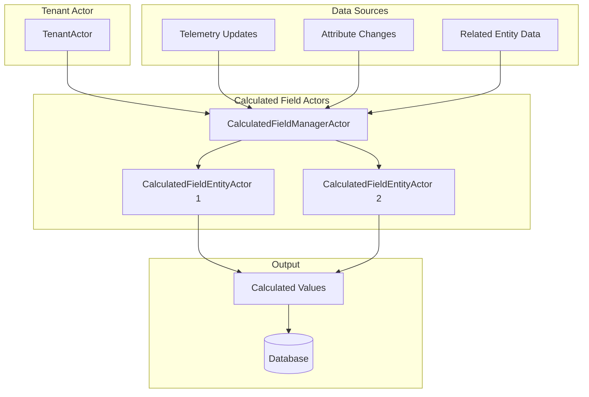
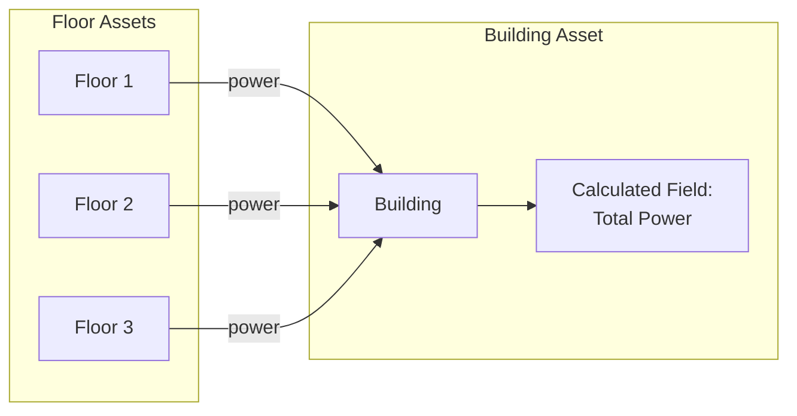
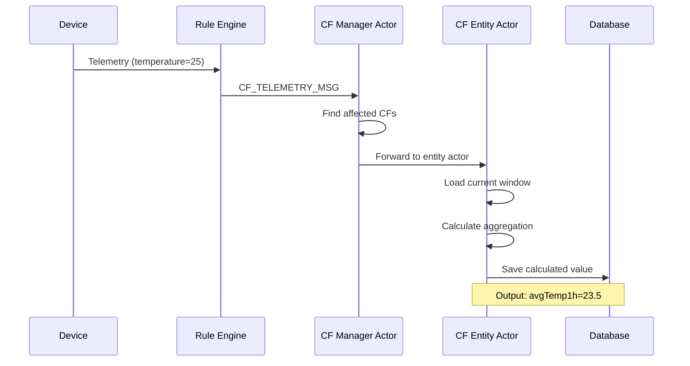

# Calculated Fields

## Overview

Calculated Fields are derived data values computed automatically from source telemetry, attributes, or other calculated fields. They enable real-time aggregation, transformation, and complex computations without custom rule chain logic. Introduced in ThingsBoard 4.x, calculated fields run via dedicated actors for efficient processing.

## Key Behaviors

1. **Automatic Computation**: Values are recalculated when source data changes.

2. **Actor-Based Processing**: Each entity with calculated fields has a dedicated actor for isolation.

3. **Multi-Source Aggregation**: Can aggregate data from multiple related entities.

4. **Expression-Based**: Uses TBEL (ThingsBoard Expression Language) for calculations.

5. **Geofencing Support**: Built-in support for location-based calculations.

## Architecture



## Calculated Field Types

ThingsBoard v4.3.0 supports 7 calculation types:

| Type | Description |
|------|-------------|
| **SIMPLE** | Direct value mapping without transformation |
| **SCRIPT** | Custom TBEL or JavaScript computation |
| **GEOFENCING** | Location-based presence detection |
| **ALARM** | Alarm rule creation and management |
| **PROPAGATION** | Cross-entity value propagation |
| **RELATED_ENTITIES_AGGREGATION** | Aggregate across related entities |
| **ENTITY_AGGREGATION** | Single entity time-window aggregations |

### Supported Entity Types

| Entity Type | Supported CF Types |
|-------------|-------------------|
| DEVICE | All 7 types |
| ASSET | All 7 types |
| DEVICE_PROFILE | All 7 types |
| ASSET_PROFILE | All 7 types |
| CUSTOMER | ALARM only |

### Single Entity Aggregation (ENTITY_AGGREGATION)

Aggregates telemetry from a single entity over time:

| Aggregation | Description | Example |
|-------------|-------------|---------|
| AVG | Average value | Average temperature over 1 hour |
| SUM | Sum of values | Total energy consumption |
| MIN | Minimum value | Lowest temperature today |
| MAX | Maximum value | Peak power usage |
| COUNT | Number of samples | Readings per day |
| COUNT_UNIQUE | Distinct values count | Unique states observed |
| FIRST | First value in window | Opening price |
| LAST | Last value in window | Closing price |

### Multi-Entity Aggregation

Aggregates data from related entities:



### Geofencing Calculations

Location-based calculations with coordinates:

| Type | Description |
|------|-------------|
| EntityCoordinates | Geographic position from telemetry |
| Distance | Distance between entities |
| Geofence Entry/Exit | Boundary crossing detection |

## Configuration

### Calculated Field Entity

```json
{
  "id": {
    "entityType": "CALCULATED_FIELD",
    "id": "cf-uuid-here"
  },
  "tenantId": { "id": "tenant-uuid" },
  "entityId": { "entityType": "ASSET", "id": "asset-uuid" },
  "name": "avgTemperature",
  "type": "SINGLE_ENTITY_AGGREGATION",
  "configuration": {
    "aggregationType": "AVG",
    "sourceKey": "temperature",
    "windowType": "SLIDING",
    "windowSizeMs": 3600000
  },
  "outputKey": "avgTemp1h"
}
```

### Configuration Types

| Type | Config Class | Purpose |
|------|--------------|---------|
| SIMPLE | SimpleCalculatedFieldConfiguration | Direct value mapping |
| SCRIPT | ScriptCalculatedFieldConfiguration | Custom script execution |
| ENTITY_AGGREGATION | EntityAggregationCalculatedFieldConfiguration | Time-window aggregation |
| RELATED_ENTITIES_AGGREGATION | MultiEntityAggregationConfiguration | Cross-entity aggregation |
| GEOFENCING | GeofencingCalculatedFieldConfiguration | Location-based |
| EXPRESSION | ExpressionBasedCalculatedFieldConfiguration | Custom TBEL expressions |
| ALARM | AlarmCalculatedFieldConfiguration | Alarm-state based |
| PROPAGATION | PropagationCalculatedFieldConfiguration | Value propagation |

### Interval Types

| Interval | Description |
|----------|-------------|
| MILLISECONDS | Custom millisecond interval |
| HOUR | Hourly calendar interval |
| DAY | Daily calendar interval |
| WEEK | Week starting Monday |
| WEEK_SUN_SAT | Week Sunday to Saturday |
| MONTH | Monthly calendar interval |
| QUARTER | Quarterly (90-day) interval |
| YEAR | Yearly calendar interval |
| CUSTOM | Arbitrary millisecond interval |

### Output Strategies

| Strategy | Description |
|----------|-------------|
| TimeSeriesImmediateOutputStrategy | Save directly to time-series storage |
| TimeSeriesRuleChainOutputStrategy | Route through rule chain before saving |
| AttributesImmediateOutputStrategy | Save as server-side attribute |
| AttributesRuleChainOutputStrategy | Route attribute through rule chain |

### Scheduled Updates

Calculated fields can be configured for periodic recalculation:

```json
{
  "scheduledUpdateEnabled": true,
  "scheduledUpdateInterval": 60000
}
```

## Message Flow



## Actor Messages

### To Calculated Field System

| Message Type | Purpose |
|--------------|---------|
| CF_TELEMETRY_MSG | New telemetry data arrived |
| CF_LINKED_TELEMETRY_MSG | Related entity telemetry |
| CF_CACHE_INIT_MSG | Initialize calculation cache |
| CF_STATE_RESTORE_MSG | Restore state after restart |
| CF_ENTITY_ACTION_EVENT_MSG | Entity lifecycle events |
| CF_PARTITIONS_CHANGE_MSG | Cluster rebalancing |

### Internal Processing

| Message Type | Purpose |
|--------------|---------|
| CF_STATE_PARTITION_RESTORE_MSG | Partition state recovery |

## Window Types

### Sliding Window

Continuous time-based window:

```
|-------- 1 hour --------|
                    Now →|
[samples included in avg]
```

### Tumbling Window

Fixed non-overlapping windows:

```
|-- Hour 1 --|-- Hour 2 --|-- Hour 3 --|
[   batch 1  ][   batch 2 ][  batch 3  ]
```

### Count-Based Window

Fixed number of samples:

```
Last 100 samples regardless of time
```

## Expression Language (TBEL)

Calculated fields use TBEL for custom expressions:

```javascript
// Simple arithmetic
(temperature * 9/5) + 32

// Conditional logic
temperature > 30 ? 'hot' : 'normal'

// Aggregation reference
sum(power) * costPerKwh
```

## Argument Types and Sources

### ArgumentType Enum

| Type | Description |
|------|-------------|
| **TS_LATEST** | Latest telemetry value for a key |
| **ATTRIBUTE** | Attribute value (with optional scope) |
| **TS_ROLLING** | Rolling window of time-series data |

### Argument Configuration

```json
{
  "refEntityId": null,                    // Optional: link to another entity
  "refEntityKey": {
    "key": "temperature",
    "type": "TS_LATEST",
    "scope": null                         // For attributes: SERVER, SHARED, CLIENT
  },
  "refDynamicSourceConfiguration": null,  // Dynamic source (relation paths)
  "defaultValue": "0",                    // Fallback if unavailable
  "limit": 100,                           // For TS_ROLLING: max points
  "timeWindow": 3600000                   // For TS_ROLLING: window in ms
}
```

### Dynamic Source Types

| Type | Description |
|------|-------------|
| **RELATION_PATH_QUERY** | Traverse entity relations to get arguments |
| **CURRENT_OWNER** | Use current owner of the entity |

## Actor-Based Execution Model

### CalculatedFieldManagerActor

Per-tenant singleton that handles:
- `CF_PARTITIONS_CHANGE_MSG`: Cluster partition changes
- `CF_CACHE_INIT_MSG`: Initialize calculated field cache
- `CF_STATE_RESTORE_MSG`: Restore state from RocksDB
- `CF_TELEMETRY_MSG`: Incoming telemetry/attribute updates
- `CF_LINKED_TELEMETRY_MSG`: Updates to linked entities

Routes messages to appropriate entity actors based on tenant/entity partition.

### CalculatedFieldEntityActor

Per-entity actor (identified by `TbCalculatedFieldEntityActorId`) that handles:
- `CF_ENTITY_INIT_CF_MSG`: Initialize calculated fields for entity
- `CF_ENTITY_DELETE_MSG`: Cleanup on entity deletion
- `CF_ENTITY_TELEMETRY_MSG`: Process telemetry/attribute updates
- `CF_RELATION_ACTION_MSG`: Relation changes
- `CF_REEVALUATE_MSG`: Scheduled re-evaluation
- `CF_ALARM_ACTION_MSG`: Alarm state changes

### State Storage (RocksDB)

Calculation state persisted to RocksDB for recovery:
- Keyed by `CalculatedFieldEntityCtxId` (tenant, entity, calculated field)
- State includes: argument values/versions, last update timestamps, interval bookkeeping
- Enables recovery after restarts without data loss

## Expression Evaluation

### TBEL (ThingsBoard Expression Language)

Uses `TbelInvokeService` for script execution:
- Cached per calculated field in `Map<String, CalculatedFieldScriptEngine>`
- Access to platform services via context
- Supports custom functions and math operations

### Simple Expressions (exp4j)

For SIMPLE type calculations:
- Cached in `Map<String, ThreadLocal<Expression>>`
- Thread-safe via ThreadLocal for concurrent access
- Lightweight arithmetic evaluation

## Performance Considerations

### Actor Lifecycle

- Actors created lazily on first calculation
- Idle actors stopped after timeout
- State persisted to RocksDB for recovery
- Partition-aware state management enables horizontal scaling

### Caching

- Expression parsing cached (prevents re-parsing)
- Recent telemetry cached in actor state
- Window data cached for efficiency
- Cache invalidated on configuration change

### Partitioning

- Calculated fields partitioned across cluster
- Partition changes trigger state migration
- High-priority messages for lifecycle events

### Debug Support

When `debugSettings.enabled=true`:
- Logs arguments passed to expression
- Captures calculated result
- Records error messages and stack traces
- Events persisted to `calculated_field_debug_event` table

## Use Cases

### Energy Monitoring

```
Building → Total Power = SUM(Floor.power)
Floor → Efficiency = power / area
```

### Fleet Management

```
Vehicle → Distance Today = SUM(odometer delta)
Fleet → Total Distance = SUM(Vehicle.distanceToday)
```

### Environmental Monitoring

```
Sensor → Avg Temperature = AVG(temperature, 1 hour)
Zone → Max Temperature = MAX(Sensor.avgTemperature)
```

## Common Pitfalls

### Configuration Pitfalls

| Pitfall | Impact | Solution |
|---------|--------|----------|
| **Source key misspelling** | Calculated field never updates | Verify exact key names match source telemetry/attributes |
| **Wrong argument type** | Expression evaluation fails | Use TS_LATEST for latest telemetry, ATTRIBUTE for attributes |
| **Missing default value** | Calculation fails when source unavailable | Always set defaultValue for graceful handling |
| **Output key conflicts with source** | Feedback loops, unexpected overwrites | Use distinct output key names |

### Window Pitfalls

| Pitfall | Impact | Solution |
|---------|--------|----------|
| **Window too small** | Noisy calculations, insufficient data | Use window appropriate for data frequency |
| **Window too large** | High memory usage, slow calculations | Limit window size; consider pre-aggregation |
| **Tumbling window misalignment** | Results don't align with business expectations | Use calendar-based intervals (HOUR, DAY) for reporting |
| **Sliding window memory growth** | Out of memory with many entities | Monitor actor memory; use tumbling windows for high-volume |

### Expression Pitfalls

| Pitfall | Impact | Solution |
|---------|--------|----------|
| **Division by zero** | Calculation error, field not updated | Add zero-check in expression: `divisor != 0 ? (num/div) : 0` |
| **Null value in expression** | Expression fails | Use default values; check for null before calculation |
| **Type mismatch in expression** | Type conversion error | Ensure consistent types; cast if necessary |
| **Complex TBEL without debugging** | Hard to diagnose failures | Enable debug settings during development |

### Multi-Entity Aggregation Pitfalls

| Pitfall | Impact | Solution |
|---------|--------|----------|
| **Relation path too deep** | Performance degradation | Limit relation traversal depth; use intermediate aggregations |
| **Missing related entities** | Aggregation result is 0 or null | Handle missing data in aggregation logic |
| **Relation changes not triggering update** | Stale aggregation values | Use CF_RELATION_ACTION_MSG handling; or scheduled recalculation |
| **High fan-out aggregation** | Memory pressure, slow updates | Aggregate at intermediate hierarchy levels |

### Performance Pitfalls

| Pitfall | Impact | Solution |
|---------|--------|----------|
| **Too many calculated fields per entity** | Actor overhead, memory pressure | Consolidate related calculations; limit to essential fields |
| **TS_ROLLING with large limit** | High memory per entity actor | Balance limit vs window size; use smaller windows |
| **Expression parsing on every update** | CPU overhead | Expressions are cached; avoid dynamic expression changes |
| **Scheduled updates too frequent** | Unnecessary calculation overhead | Set scheduledUpdateInterval appropriate for data change rate |

### State Recovery Pitfalls

| Pitfall | Impact | Solution |
|---------|--------|----------|
| **RocksDB state loss** | Recalculation required on restart | Ensure RocksDB persistence configured properly |
| **Partition rebalance during calculation** | Temporary inconsistency | System handles; allow time for state migration |
| **Debug events filling disk** | Storage exhaustion | Disable debug in production; configure event retention |

## See Also

- [Telemetry](./telemetry.md) - Source data for calculations
- [Attributes](./attributes.md) - Configuration data
- [Actor System](../../03-actor-system/README.md) - Actor-based processing
- [Rule Engine](../../04-rule-engine/README.md) - Integration with rules
