# RPC (Remote Procedure Call)

## Overview

RPC enables bidirectional command execution between the platform and devices. Server-side RPC allows the platform to send commands to devices (e.g., "turn on LED"), while client-side RPC allows devices to request data or actions from the platform (e.g., "get configuration"). The system is transport-agnostic and works over MQTT, CoAP, and HTTP.

## Key Behaviors

1. **Bidirectional**: Platform can call device methods (server-side) and devices can call platform methods (client-side).

2. **Two Modes**: One-way RPC fires and forgets; two-way RPC waits for a response.

3. **Persistent Option**: Critical RPCs can be stored in the database for tracking, retry, and audit.

4. **Timeout Management**: All RPCs have configurable timeouts with automatic cleanup.

5. **Transport Agnostic**: Same RPC semantics work across MQTT, CoAP, and HTTP.

## Data Structures

### RPC Request

| Field | Type | Description | Constraints |
|-------|------|-------------|-------------|
| method | string | Method name to invoke | Required |
| params | object | Parameters for the method | Required (can be empty) |
| timeout | integer | Timeout in milliseconds | Min 5000, default 10000 |
| expirationTime | timestamp | Absolute expiration (UTC ms) | Optional, overrides timeout |
| persistent | boolean | Store in database | Default: false |
| retries | integer | Retry attempts if failed | Only for persistent RPC |
| additionalInfo | object | Custom metadata | Optional |

### Example RPC Request

```json
{
  "method": "setGpio",
  "params": {
    "pin": 7,
    "value": 1
  },
  "timeout": 10000,
  "persistent": true,
  "retries": 3
}
```

### RPC Response

| Field | Type | Description |
|-------|------|-------------|
| response | object | Response data from device |
| error | string | Error type if failed |

### Example RPC Response

```json
{
  "response": {
    "status": "ok",
    "pin": 7,
    "value": 1
  }
}
```

### Persistent RPC Record

| Field | Type | Description |
|-------|------|-------------|
| id | UUID | Unique RPC identifier |
| tenantId | UUID | Owning tenant |
| deviceId | UUID | Target device |
| status | enum | Current RPC state |
| request | object | Original request |
| response | object | Device response (if received) |
| expirationTime | timestamp | When RPC expires |
| createdTime | timestamp | When RPC was created |
| additionalInfo | object | Custom metadata |

## RPC Status Lifecycle

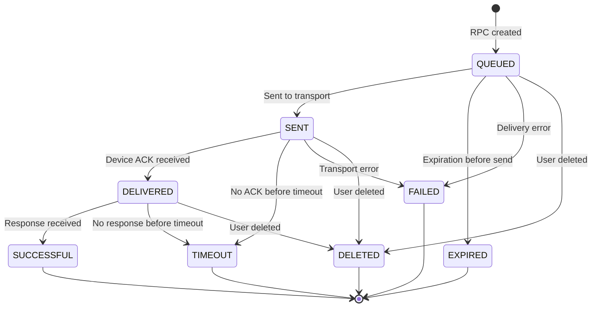

### Status Definitions

| Status | Meaning |
|--------|---------|
| QUEUED | RPC accepted, not yet sent |
| SENT | Delivered to transport layer |
| DELIVERED | Device acknowledged receipt |
| SUCCESSFUL | Device responded with result |
| TIMEOUT | No response before expiration |
| EXPIRED | Expired before processing |
| FAILED | Delivery or processing failed |
| DELETED | Manually deleted by user |

## Server-Side RPC (Platform to Device)

Server-side RPC sends commands from the platform to devices.

### Request Flow

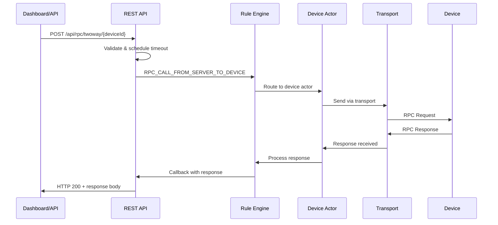

### REST API Endpoints

**One-Way RPC** (fire and forget):
```
POST /api/rpc/oneway/{deviceId}
```

**Two-Way RPC** (wait for response):
```
POST /api/rpc/twoway/{deviceId}
```

**Query Persistent RPCs**:
```
GET /api/rpc/persistent/device/{deviceId}?rpcStatus=QUEUED&page=0&pageSize=10
```

**Get RPC by ID**:
```
GET /api/rpc/persistent/{rpcId}
```

**Delete RPC**:
```
DELETE /api/rpc/persistent/{rpcId}
```

### One-Way vs Two-Way

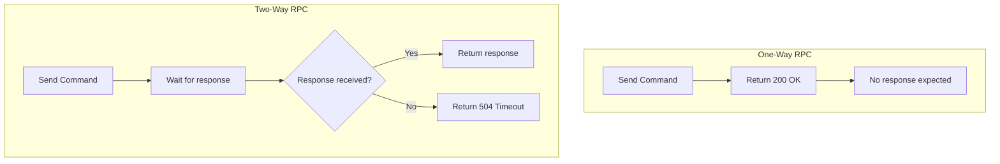

| Aspect | One-Way | Two-Way |
|--------|---------|---------|
| Response | None expected | Waits for device response |
| HTTP Return | 200 OK immediately | 200 with response or 504 |
| Use Case | Logging, fire-and-forget | Config reads, sensor queries |
| Performance | Faster, less overhead | Slower, maintains callback |

## Client-Side RPC (Device to Platform)

Client-side RPC allows devices to request data or services from the platform.

### Request Flow

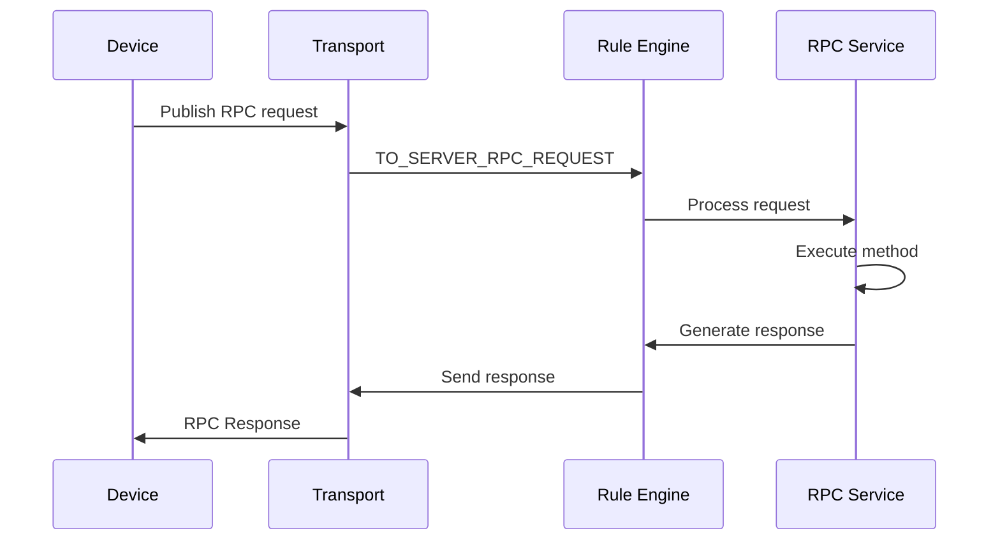

### Common Client-Side Methods

| Method | Purpose | Response |
|--------|---------|----------|
| getAttributes | Fetch device attributes | Attribute values |
| getSessionLimits | Get rate limits | Limit configuration |
| getTime | Get server time | Current timestamp |

## Transport Patterns

### MQTT Topics

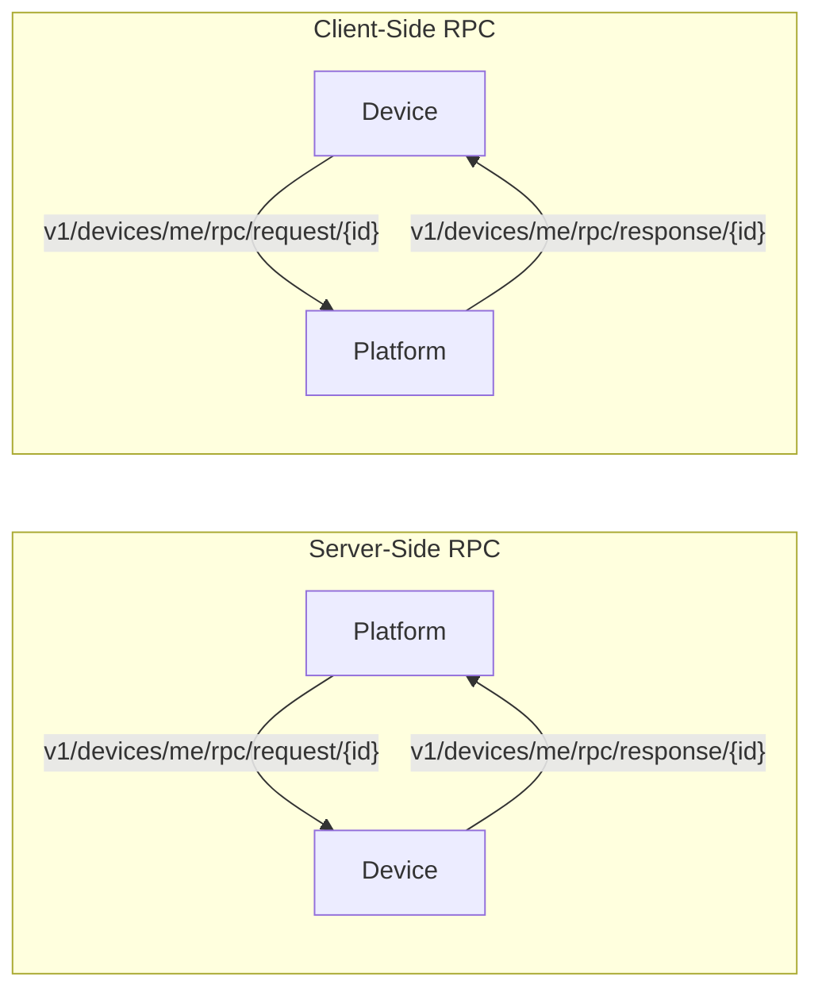

**Server-side (platform sends command):**
- Device subscribes: `v1/devices/me/rpc/request/+`
- Device responds: `v1/devices/me/rpc/response/{requestId}`

**Client-side (device requests):**
- Device publishes: `v1/devices/me/rpc/request/{requestId}`
- Device subscribes: `v1/devices/me/rpc/response/+`

**Gateway topics:**
- Request: `v1/gateway/rpc`
- Payload includes device name and request ID

### CoAP Resources

| Resource | Method | Purpose |
|----------|--------|---------|
| `/api/rpc` | POST | Send RPC request |
| `/api/rpc` | GET (Observe) | Subscribe to incoming RPC |

### HTTP Endpoints

| Endpoint | Direction | Purpose |
|----------|-----------|---------|
| `POST /api/v1/{token}/rpc/{requestId}` | Device → Platform | Client-side RPC |
| Long polling endpoint | Platform → Device | Server-side RPC |

## Timeout and Error Handling

### Timeout Flow

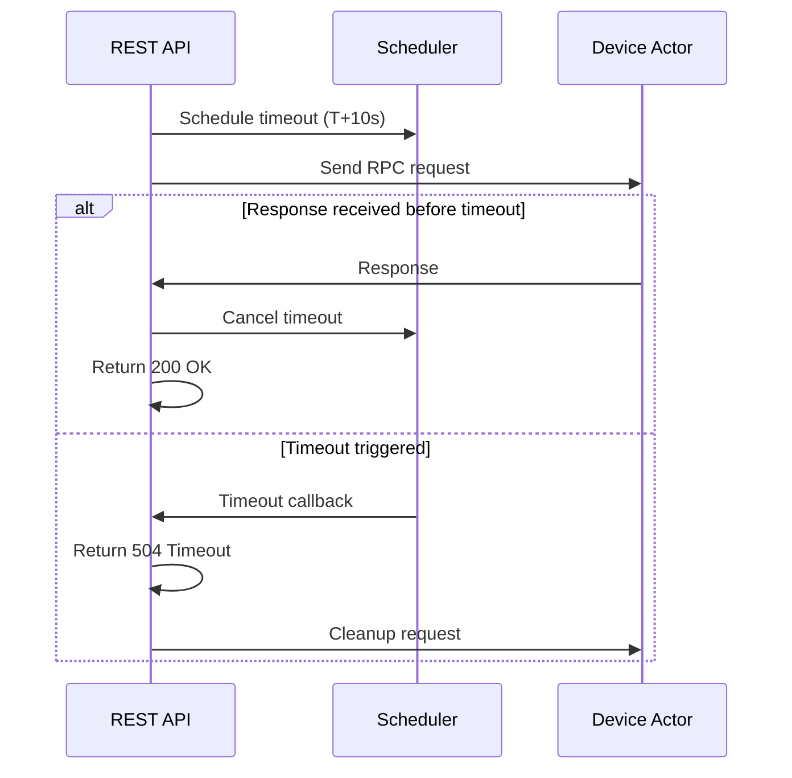

### Error Types

| Error | HTTP Code | Cause |
|-------|-----------|-------|
| NOT_FOUND | 404 | Device doesn't exist |
| FORBIDDEN | 401 | No RPC permission |
| NO_ACTIVE_CONNECTION | 504 | Device offline |
| TIMEOUT | 504 | No response in time |
| INTERNAL | 500 | Server error |

### Timeout Priority

1. If `expirationTime` provided → use directly
2. Else → `expirationTime = now + max(5000, timeout)`
3. Default timeout: 10 seconds
4. Minimum timeout: 5 seconds

## Persistent vs Lightweight RPC

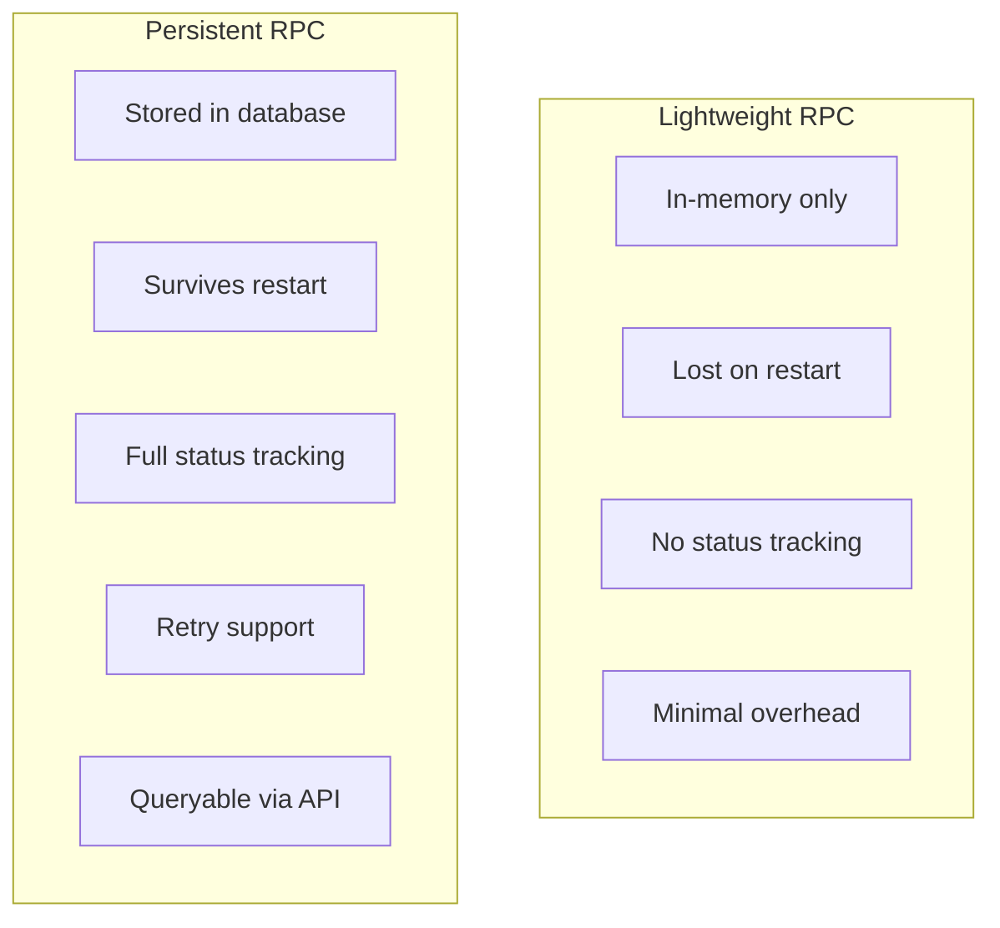

| Aspect | Lightweight | Persistent |
|--------|-------------|------------|
| Storage | Memory only | Database |
| Durability | Lost on restart | Survives restart |
| Status tracking | None | Full lifecycle |
| Retry support | No | Yes |
| Query API | No | Yes |
| Use case | Non-critical commands | Audit trail, critical ops |

## Retry Mechanism

Only available for persistent RPCs:

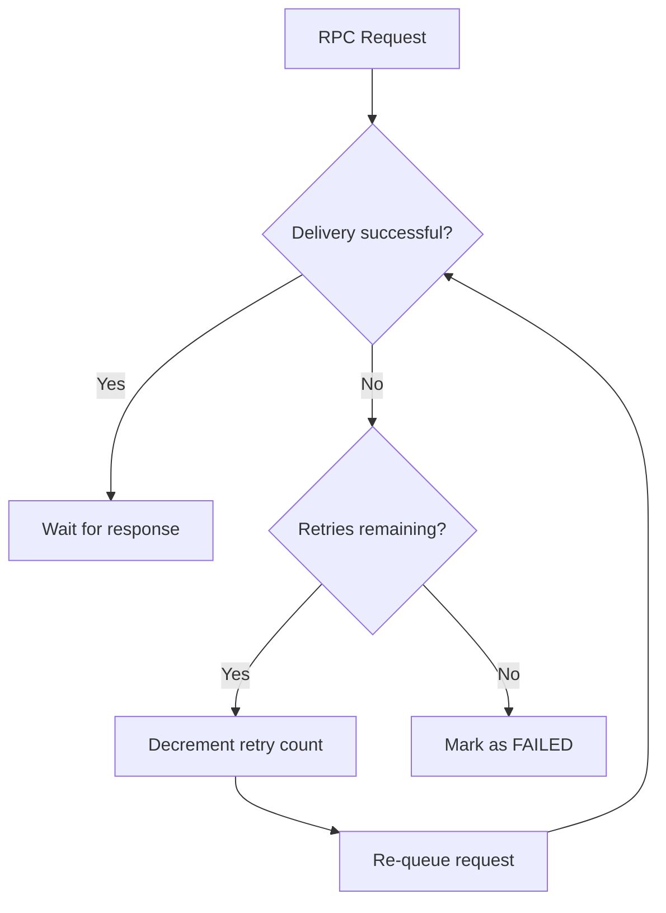

Configuration:
```json
{
  "method": "updateFirmware",
  "params": { "url": "https://..." },
  "persistent": true,
  "retries": 3
}
```

## Rule Engine Integration

### RPC Message Types

| Type | Direction | Description |
|------|-----------|-------------|
| RPC_CALL_FROM_SERVER_TO_DEVICE | Platform → Device | Server-side RPC |
| TO_SERVER_RPC_REQUEST | Device → Platform | Client-side RPC |
| RPC_QUEUED | Status | RPC queued |
| RPC_SENT | Status | RPC sent |
| RPC_DELIVERED | Status | Device ACK |
| RPC_SUCCESSFUL | Status | Response received |
| RPC_TIMEOUT | Status | Timed out |
| RPC_FAILED | Status | Failed |

### Rule Engine RPC Flow

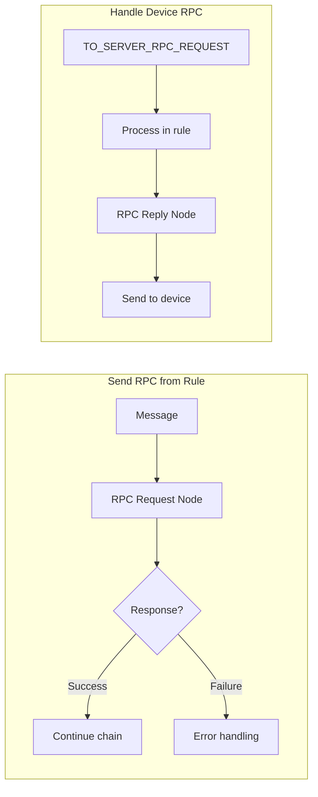

### Message Metadata

Standard metadata for RPC messages:
- `requestUUID`: Request identifier
- `originServiceId`: Originating service
- `expirationTime`: When RPC expires
- `oneway`: One-way flag
- `persistent`: Persistence flag
- `retries`: Retry count

## Common Use Cases

### Device Configuration

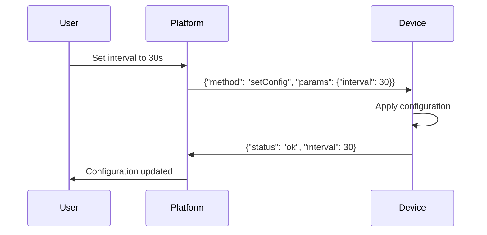

### Sensor Reading

```json
// Request
{
  "method": "readTemperature",
  "params": {},
  "timeout": 5000
}

// Response
{
  "temperature": 22.5,
  "unit": "celsius",
  "timestamp": 1634567890123
}
```

### Firmware Update

```json
// Request (persistent with retries)
{
  "method": "updateFirmware",
  "params": {
    "url": "https://firmware.example.com/v2.1.bin",
    "version": "2.1",
    "checksum": "abc123..."
  },
  "persistent": true,
  "retries": 3,
  "timeout": 300000
}
```

### Device Health Check

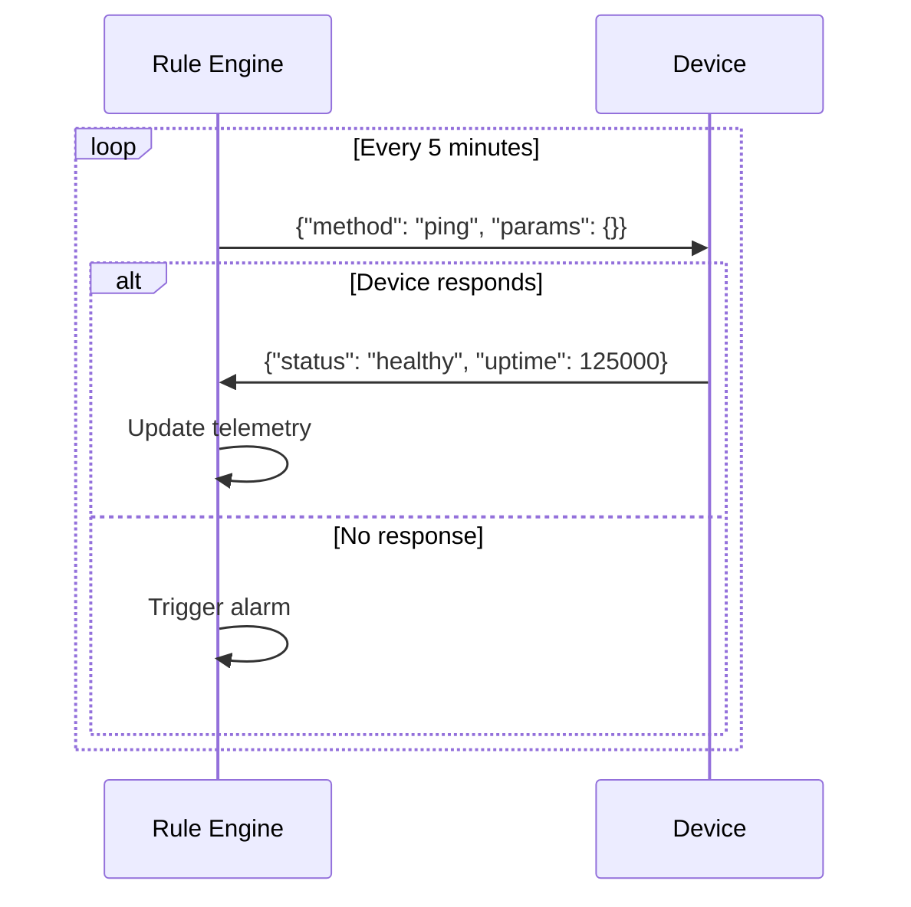

## Access Control

| User Type | Permissions |
|-----------|------------|
| Tenant Admin | RPC to all tenant devices |
| Customer User | RPC to assigned devices only |
| Device | Client-side RPC only |

Required permission: `RPC_CALL` on target device

## Edge Cases

### Device Offline

- One-way: Returns 504 immediately (unless persistent)
- Two-way: Returns 504 after timeout
- Persistent: Queued for delivery when online

### Stale Response

Response arrives after timeout:
- Ignored (callback already removed)
- Logged for debugging
- No impact on system state

### Duplicate Response

Device sends response twice:
- First response processed
- Second response discarded
- Idempotent by design

### Request Queue Full

Device actor mailbox at capacity:
- New requests rejected
- Returns error to caller
- Consider increasing mailbox size

## Performance Considerations

| Factor | Impact | Mitigation |
|--------|--------|------------|
| Concurrent RPCs | Memory per callback | Set reasonable limits |
| Timeout scheduling | Timer per request | Efficient scheduler |
| Persistent RPC | Database write per RPC | Use only when needed |
| Large payloads | Network/memory | Chunk large transfers |

## Implementation Details

### Service Architecture

The RPC implementation uses a three-tier service model:

**DefaultTbCoreDeviceRpcService** (REST API layer):
- Handles REST API RPC calls and coordinates between Rule Engine and Device Actor
- Maintains `ConcurrentMap<UUID, Consumer<FromDeviceRpcResponse>>` for REST API response callbacks
- Uses single-threaded scheduler (`tb-core-rpc-scheduler`) for timeout management

**DefaultTbRuleEngineRpcService** (Rule Engine layer):
- Manages RPC flow through Rule Engine with partition-aware routing
- Uses `PartitionService` to determine target Core service instance
- Maintains callback map for Rule Engine-initiated RPCs

**DeviceActorMessageProcessor** (Device Actor layer):
- Uses `LinkedHashMap<Integer, ToDeviceRpcRequestMetadata>` for pending RPCs
- Sequential `rpcSeq` counter per device for protocol-level request IDs
- Tracks `sent` and `delivered` state for each RPC

### RPC Submission Strategies

Configured via `actors.rpc.submit_strategy`:

| Strategy | Behavior |
|----------|----------|
| `BURST` (default) | Send all pending RPCs immediately to all subscribed sessions |
| `SEQUENTIAL_ON_ACK_FROM_DEVICE` | Wait for transport ACK before sending next RPC |
| `SEQUENTIAL_ON_RESPONSE_FROM_DEVICE` | Wait for device response before sending next RPC |

Sequential strategies use `actors.rpc.response_timeout_ms` (default 30s) to await response before proceeding.

### Cluster Coordination

- **Partition-aware routing**: `PartitionService.resolve(ServiceType.TB_CORE, tenantId, deviceId)` determines device owner
- **Service affinity**: Each device RPC routes to the specific Core service that owns it
- **ServiceId tracking**: Each RPC request includes `originServiceId` in metadata to route responses correctly
- **Inter-service communication**: Uses `TbClusterService` with queue-based notifications

### TTL Cleanup

`RpcCleanUpService` runs scheduled cleanup:
- Interval: 2 hours (configurable via `sql.ttl.rpc.checking_interval`)
- Deletes RPC records older than `rpcTtlDays` (tenant-configurable)
- Query: `deleteOutdatedRpcByTenantId(tenantId, expirationTime)`

### Configuration Properties

```yaml
rest.server_side_rpc:
  min_timeout: 5000ms
  default_timeout: 10000ms

actors.rpc:
  max_retries: 5
  submit_strategy: BURST
  response_timeout_ms: 30000

sql.ttl.rpc:
  enabled: true
  checking_interval: 7200000  # 2 hours

transport.client_side_rpc:
  timeout: 60000ms  # Device-to-server RPC
```

## See Also

- [Device Entity](../entities/device.md) - RPC target
- [Transport Contract](../../05-transport-layer/transport-contract.md) - Transport abstraction
- [MQTT Protocol](../../05-transport-layer/mqtt.md) - MQTT RPC topics
- [Rule Engine](../../04-rule-engine/README.md) - RPC nodes
- [WebSocket](../../06-api-layer/websocket-overview.md) - Real-time RPC status
