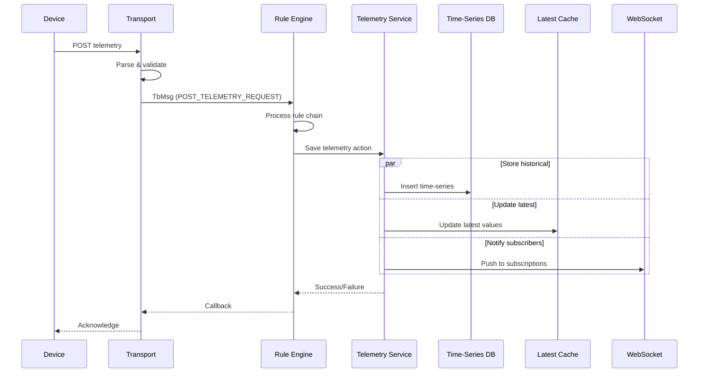
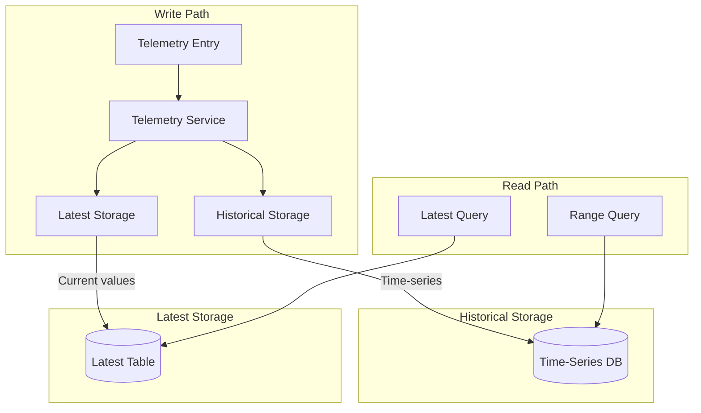
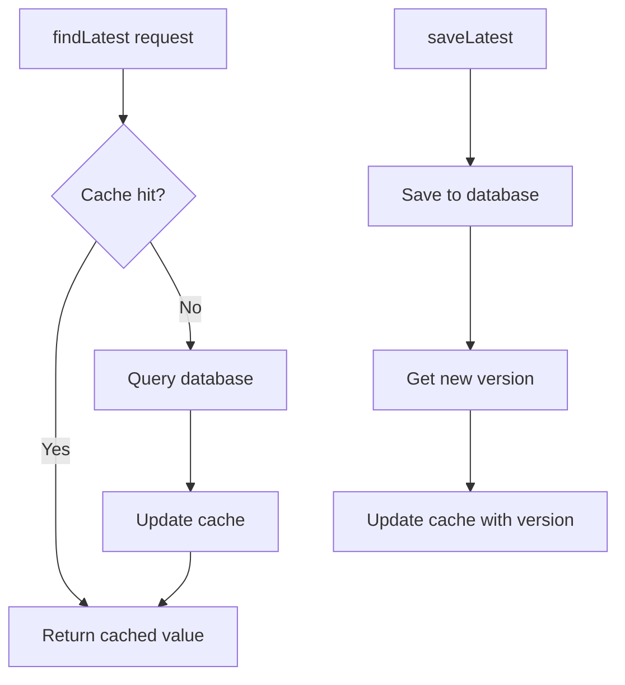
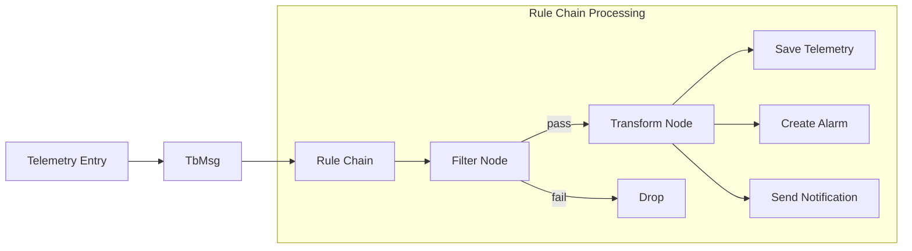
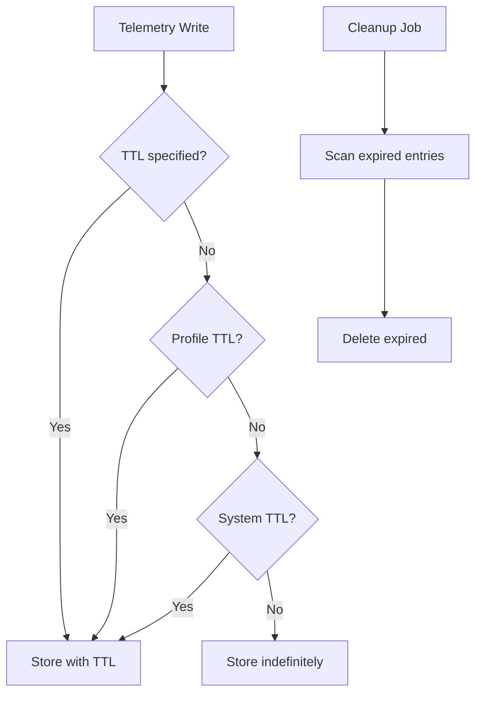
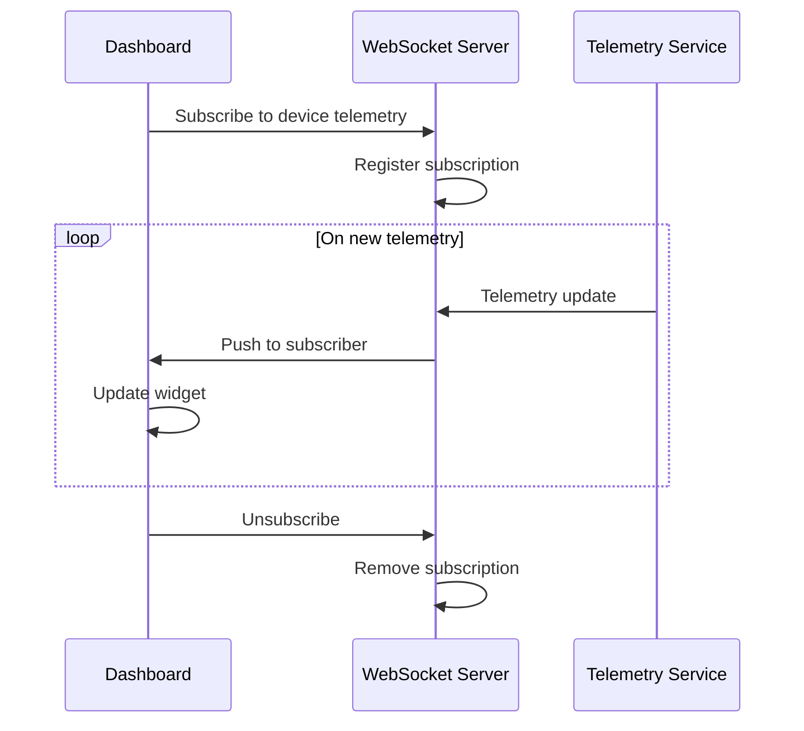

# Telemetry Data Model

## Overview

Telemetry is time-series data sent from devices to the platform. Each telemetry entry consists of a timestamp, a key (metric name), and a typed value. Telemetry is optimized for high-volume writes and efficient range queries, making it ideal for sensor data, measurements, and device metrics.

## Key Behaviors

1. **Time-Series Storage**: Telemetry is stored with millisecond timestamps, enabling historical queries and trend analysis.

2. **Multi-Key Support**: A single telemetry post can contain multiple key-value pairs, all sharing the same timestamp.

3. **Latest Value Tracking**: The platform maintains a separate "latest" cache for each key, enabling fast current-value lookups without scanning history.

4. **Aggregation Support**: Range queries can aggregate data (MIN, MAX, AVG, SUM, COUNT) over time intervals.

5. **TTL (Time-to-Live)**: Telemetry can be automatically deleted after a configurable retention period.

6. **Entity-Agnostic**: Telemetry can be associated with any entity type (Device, Asset, Customer, etc.), not just devices.

## Data Structure

### Telemetry Entry (TsKvEntry)

| Field | Type | Description |
|-------|------|-------------|
| ts | long | Unix timestamp in milliseconds |
| key | string | Metric name (e.g., "temperature", "humidity") |
| value | varies | Typed value (see Data Types below) |
| version | long | Optimistic locking version (optional) |

### Data Types

| Type | Description | Example Values |
|------|-------------|----------------|
| BOOLEAN | True/false | `true`, `false` |
| LONG | 64-bit integer | `42`, `-1000`, `9223372036854775807` |
| DOUBLE | 64-bit floating point | `25.5`, `-40.123`, `3.14159` |
| STRING | Text up to 10KB | `"active"`, `"error: timeout"` |
| JSON | Structured JSON object | `{"lat": 40.7, "lon": -74.0}` |

### Example Telemetry Payload

**Device posting multiple metrics:**

```json
{
  "ts": 1634567890123,
  "values": {
    "temperature": 25.5,
    "humidity": 60,
    "pressure": 1013.25,
    "status": "normal",
    "location": {
      "lat": 40.7128,
      "lon": -74.0060
    }
  }
}
```

**Posting without explicit timestamp (server assigns current time):**

```json
{
  "temperature": 25.5,
  "humidity": 60
}
```

**Posting multiple timestamps in one request:**

```json
[
  {
    "ts": 1634567890000,
    "values": {
      "temperature": 25.5
    }
  },
  {
    "ts": 1634567891000,
    "values": {
      "temperature": 25.7
    }
  }
]
```

## Ingestion Flow



## Storage Architecture

### Dual Storage Pattern

The platform stores telemetry in two places:



**Historical Storage**:
- Stores all telemetry entries with timestamps
- Partitioned by entity and time
- Supports range queries and aggregations
- Subject to TTL cleanup

**Latest Storage**:
- Stores only the most recent value per key per entity
- Fast O(1) lookups for current state
- Used by dashboards showing real-time values
- Updated on every telemetry write

### Storage Options

| Option | Best For | Trade-offs |
|--------|----------|------------|
| PostgreSQL only | Small deployments | Simpler setup, limited scale |
| TimescaleDB | Medium-large deployments | Native time-series optimizations, hypertables |
| Cassandra only | Large time-series | Complex setup, fast writes |
| Hybrid (PostgreSQL + Cassandra) | Production | Entity data in SQL, telemetry in Cassandra |

### Storage Backend Implementations

**Cassandra Backend** (`CassandraBaseTimeseriesDao`):
- Configurable partition strategy via `cassandra.query.ts_key_value_partitioning`:
  - `MINUTES` (pattern: `yyyy-MM-dd-HH-mm`)
  - `HOURS` (pattern: `yyyy-MM-dd-HH`)
  - `DAYS` (pattern: `yyyy-MM-dd`)
  - `MONTHS` (pattern: `yyyy-MM`)
  - `INDEFINITE` (no partitioning)
- Partition cache (`CassandraTsPartitionsCache`) prevents redundant writes
- Native TTL support per entry
- Async writes via `executeAsyncWrite()`

**TimescaleDB Backend** (`TimescaleTimeseriesDao`):
- Automatic hypertable chunking by time
- Native time-bucketing functions for aggregation
- No manual partition management required
- Key dictionary maps string keys to integer IDs for storage efficiency

**PostgreSQL/MySQL Backend** (`AbstractChunkedAggregationTimeseriesDao`):
- Manual table partitioning by time
- Explicit partition existence check before insert
- Comparator-based sort optimization for batch inserts

### TsKvEntry Implementation Hierarchy

```
TsKvEntry (interface)
├── BasicTsKvEntry
│   ├── kv: KvEntry (wraps actual value)
│   ├── ts: long (timestamp)
│   └── version: Long (optimistic locking)
│
└── AggTsKvEntry (extends BasicTsKvEntry)
    └── count: long (record count for aggregations)
```

### Batch Processing Configuration

| Property | Default | Description |
|----------|---------|-------------|
| `sql.ts.batch_size` | 1000 | Max entries per batch |
| `sql.ts.batch_max_delay` | 100ms | Max wait before flush |
| `sql.ts.batch_threads` | 4 | Parallel processing threads |
| `sql.batch_sort` | true | Sort by entity/key/ts to prevent deadlocks |

### Latest Value Caching

When Redis caching is enabled (`cache.type=redis`), `CachedRedisSqlTimeseriesLatestDao` provides:



**Cache Configuration**:
- Key: `TsLatestCacheKey(entityId, key)`
- TTL: `cache.specs.tsLatest.timeToLiveInMinutes` (default: 1440)
- Max size: `cache.specs.tsLatest.maxSize` (default: 100,000)
- Versioned cache prevents stale updates

## Query Operations

### Query Types

| Operation | Description | Use Case |
|-----------|-------------|----------|
| findLatest | Get most recent value for key(s) | Dashboard current values |
| findAllLatest | Get all latest values for entity | Device state overview |
| findAll | Range query with optional aggregation | Historical charts |
| findAllByQueries | Multiple range queries in batch | Multi-metric dashboards |

### Range Query Parameters

| Parameter | Type | Description |
|-----------|------|-------------|
| key | string | Telemetry key to query |
| startTs | long | Start of time range (inclusive) |
| endTs | long | End of time range (inclusive) |
| interval | long | Aggregation bucket size in ms |
| aggregation | enum | MIN, MAX, AVG, SUM, COUNT, NONE |
| limit | int | Maximum results to return |
| order | string | "ASC" or "DESC" by timestamp |

### Aggregation Types

| Type | Description | Returns |
|------|-------------|---------|
| NONE | Raw data points | All values in range |
| MIN | Minimum per interval | Lowest value per bucket |
| MAX | Maximum per interval | Highest value per bucket |
| AVG | Average per interval | Mean value per bucket |
| SUM | Sum per interval | Total per bucket |
| COUNT | Count per interval | Number of data points per bucket |

### Aggregation Query Implementation

**AggregationParams Structure**:
- Aggregation type: `MIN, MAX, AVG, SUM, COUNT, NONE`
- Interval type: `MILLISECONDS, SECONDS, MINUTES, HOURS, DAYS, WEEKS, MONTHS, QUARTERS, YEARS`
- Timezone support (maps EST→America/New_York, etc.)

**Query Execution Flow** (`AbstractChunkedAggregationTimeseriesDao`):
```
findAllAsync(ReadTsKvQuery):
  If AGGREGATION.NONE:
    findAllAsyncWithLimit()  // Direct query with limit
  Else:
    Split query into intervals based on interval type
    For each interval:
      switchAggregation() → Repository query (findAvg/findMax/findMin/findSum/findCount)
      Create aggregated TsKvEntity with ts = intervalMidpoint
    Return aggregated results
```

**Query Validation**:
- Max intervals enforced: `database.ts_max_intervals` (default: 700)
- Prevents runaway aggregation queries
- Rejection if `intervalCounts > maxTsIntervals`

### Query Example

**Request: Get hourly average temperature for last 24 hours**

```json
{
  "keys": ["temperature"],
  "startTs": 1634481490123,
  "endTs": 1634567890123,
  "interval": 3600000,
  "aggregation": "AVG",
  "limit": 24,
  "order": "ASC"
}
```

**Response:**

```json
[
  {"ts": 1634482800000, "key": "temperature", "value": 23.5},
  {"ts": 1634486400000, "key": "temperature", "value": 24.1},
  {"ts": 1634490000000, "key": "temperature", "value": 25.8},
  ...
]
```

## Protocol-Specific Formats

### MQTT

**Topic:** `v1/devices/me/telemetry`

**Payload (JSON):**
```json
{"temperature": 25.5, "humidity": 60}
```

**With timestamp:**
```json
{"ts": 1634567890123, "values": {"temperature": 25.5}}
```

### HTTP

**Endpoint:** `POST /api/v1/{accessToken}/telemetry`

**Body:** Same JSON format as MQTT

### CoAP

**Path:** `/api/v1/{accessToken}/telemetry`

**Method:** POST

**Payload:** JSON or CBOR encoded

### Gateway Protocol

**Topic:** `v1/gateway/telemetry`

**Payload (multiple devices):**
```json
{
  "Device A": [
    {"ts": 1634567890123, "values": {"temperature": 25.5}}
  ],
  "Device B": [
    {"ts": 1634567890456, "values": {"humidity": 60}}
  ]
}
```

## Rule Engine Processing

Telemetry triggers rule chain processing:



### TbMsg for Telemetry

| Field | Value |
|-------|-------|
| type | POST_TELEMETRY_REQUEST |
| originator | Device/Asset entity ID |
| data | JSON telemetry payload |
| metadata | deviceName, deviceType, ts |

### Common Rule Node Actions

| Node | Purpose |
|------|---------|
| Save Telemetry | Persist to time-series storage |
| Save Attributes | Convert telemetry to attributes |
| Create Alarm | Alert based on thresholds |
| Send Email/SMS | Notify on conditions |
| Push to External | Forward to Kafka, REST, etc. |

## Data Points and Billing

Telemetry usage is measured in "data points":

| Value Type | Data Points |
|------------|-------------|
| Boolean | 1 |
| Long | 1 |
| Double | 1 |
| String | 1 per 512 characters |
| JSON | 1 per 512 characters |

**Example:**
- `{"temperature": 25.5}` = 1 data point
- `{"message": "This is a 600 character string..."}` = 2 data points
- `{"location": {"lat": 40.7, "lon": -74.0, "accuracy": 10}}` = 1 data point (JSON < 512 chars)

### Data Points Calculation Implementation

The `BasicTsKvEntry.getDataPoints()` method calculates data points:

```
MAX_CHARS_PER_DATA_POINT = 512

For STRING/JSON values:
  dataPoints = ceil(length / 512), minimum 1

For BOOLEAN/LONG/DOUBLE:
  dataPoints = 1

With TTL factoring:
  dataPointDays = dataPoints × max(1, ttl / SECONDS_IN_DAY)
```

This calculation is used by `BaseTimeseriesService` for:
- API usage tracking per tenant
- Write operation cost estimation (INSERTS_PER_ENTRY = 3: partition + data + latest)

## Retention and TTL

### TTL Configuration

TTL can be set at multiple levels:

| Level | Scope | Default |
|-------|-------|---------|
| System | All tenants | 0 (no expiration) |
| Tenant Profile | Per tenant | Inherits system |
| Device Profile | Per device type | Inherits tenant |
| Write-time | Per write operation | Inherits profile |

### TTL Behavior



### Cleanup Process

- Background job runs periodically
- Deletes entries older than TTL
- Does not affect "latest" values (only historical)
- Configurable cleanup interval

## WebSocket Subscriptions

Real-time telemetry updates via WebSocket:



### Subscription Command

```json
{
  "tsSubCmds": [
    {
      "entityType": "DEVICE",
      "entityId": "784f3940-2f04-11ec-8f2e-4d7a8c12df56",
      "scope": "LATEST_TELEMETRY",
      "cmdId": 1
    }
  ]
}
```

### Update Message

```json
{
  "subscriptionId": 1,
  "data": {
    "temperature": [[1634567890123, "25.5"]],
    "humidity": [[1634567890123, "60"]]
  }
}
```

## Performance Considerations

### Write Optimization

- Batch multiple telemetry keys in single request
- Use consistent timestamps when possible
- Avoid very high cardinality keys

### Query Optimization

- Use aggregation for large time ranges
- Limit results when possible
- Query specific keys instead of all keys
- Use latest queries for current state

### Storage Sizing

| Factor | Impact |
|--------|--------|
| Data rate | Writes per second affects throughput |
| Retention | Longer TTL = more storage |
| Key cardinality | More unique keys = larger indexes |
| Value size | Large JSON/strings use more space |

## Interactions

### With Attributes
- Telemetry is time-series; attributes are current state
- Rule nodes can convert telemetry to attributes
- Latest telemetry behaves similar to attributes

### With Alarms
- Alarm rules evaluate telemetry values
- Thresholds trigger alarm creation
- Telemetry changes can clear alarms

### With Dashboards
- Widgets subscribe to telemetry via WebSocket
- Charts display historical telemetry
- Gauges show latest values

### With Calculated Fields
- Calculated fields can derive new telemetry
- Example: `efficiency = output / input * 100`
- Computed values stored as new telemetry keys

## Edge Cases

### Out-of-Order Timestamps
- Platform accepts telemetry with past timestamps
- Does not update "latest" if older than current latest
- Historical storage accepts all timestamps

### Duplicate Timestamps
- Same key + same timestamp = overwrite
- Version field enables optimistic locking
- Last write wins without versioning

### Type Mismatches
- Changing type for same key is allowed
- Example: "status" can be string, then number
- Query returns mixed types; client handles

### Missing Timestamps
- Server assigns current time if ts not provided
- Millisecond precision
- Clock skew can affect ordering

## Common Pitfalls

### Write Pitfalls

| Pitfall | Impact | Solution |
|---------|--------|----------|
| **Timestamps in the future** | Data appears in wrong time windows; latest value incorrect | Validate timestamps before submission; use server time for unreliable clocks |
| **Inconsistent timestamps in batch** | Data scattered across partitions inefficiently | Batch data with same or similar timestamps together |
| **High-cardinality keys** | Index bloat, slow queries, storage overhead | Limit unique key names; use structured JSON for variable data |
| **Type changes for same key** | Mixed types returned in queries; client must handle | Stick to consistent types per key; document type contracts |
| **Missing timestamp in payload** | Server assigns current time; clock drift issues | Explicitly set timestamps when device time is accurate |

### Query Pitfalls

| Pitfall | Impact | Solution |
|---------|--------|----------|
| **Unbounded time range queries** | Slow response, high memory usage, possible timeout | Always set reasonable startTs/endTs; use pagination |
| **Aggregation without limit** | Returns all buckets; may exceed maxTsIntervals (700) | Set appropriate limit; adjust interval size |
| **Querying raw data for long periods** | Millions of rows returned | Use aggregation (AVG, MAX, MIN) for periods > 1 day |
| **Wrong aggregation type** | Meaningless results (e.g., SUM of temperatures) | Match aggregation to metric semantics |
| **Ignoring timezone in aggregation** | Buckets misaligned with business hours | Specify timezone in IntervalType for calendar-aligned buckets |

### Storage Pitfalls

| Pitfall | Impact | Solution |
|---------|--------|----------|
| **TTL too short** | Data lost before analysis period ends | Align TTL with reporting requirements |
| **TTL not set (infinite retention)** | Storage grows unbounded | Configure appropriate TTL at profile or system level |
| **Cassandra partition too wide** | Query performance degradation | Use shorter partition interval (HOURS instead of DAYS) |
| **Large JSON/STRING values** | Increased data points billing; storage overhead | Keep string values under 512 characters; compress large payloads |

### Latest Value Pitfalls

| Pitfall | Impact | Solution |
|---------|--------|----------|
| **Out-of-order updates** | Latest cache shows older value than historical data | Latest updates only if timestamp > current latest timestamp |
| **Expecting historical update to change latest** | Backfilled data doesn't appear in dashboard | Latest is separate from historical; design dashboards accordingly |
| **Stale latest after long offline period** | Dashboard shows outdated values without indication | Show "last updated" timestamp alongside values |

### Rule Engine Pitfalls

| Pitfall | Impact | Solution |
|---------|--------|----------|
| **Save telemetry before filtering** | Invalid data persisted | Place Save Telemetry node AFTER filter nodes |
| **High-frequency telemetry overwhelming rule chain** | Message queue backlog, processing delays | Use sampling or pre-aggregation at device level |
| **Telemetry and attribute confusion** | Wrong message type processed | Check message type (POST_TELEMETRY_REQUEST vs POST_ATTRIBUTES_REQUEST) |

## See Also

- [Attributes](./attributes.md) - Device configuration data
- [Device Entity](../entities/device.md) - Telemetry source
- [Rule Engine](../../04-rule-engine/) - Telemetry processing
- [WebSocket API](../../06-api-layer/websocket/) - Real-time subscriptions
