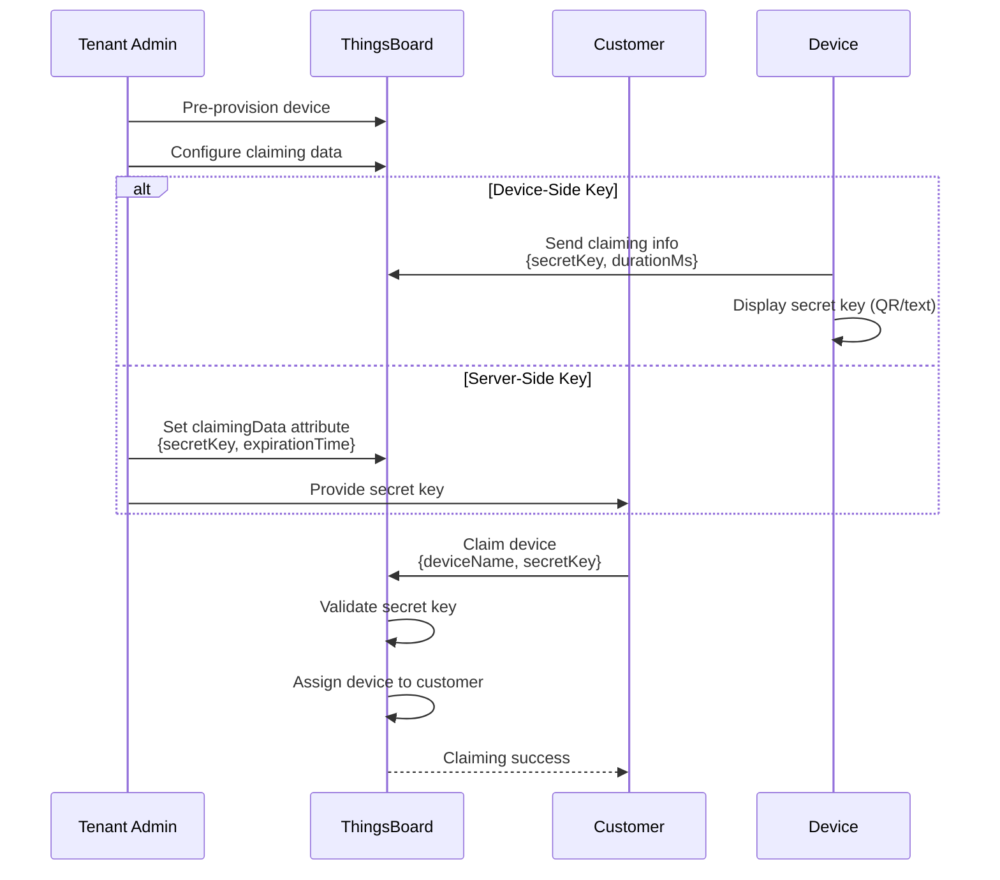
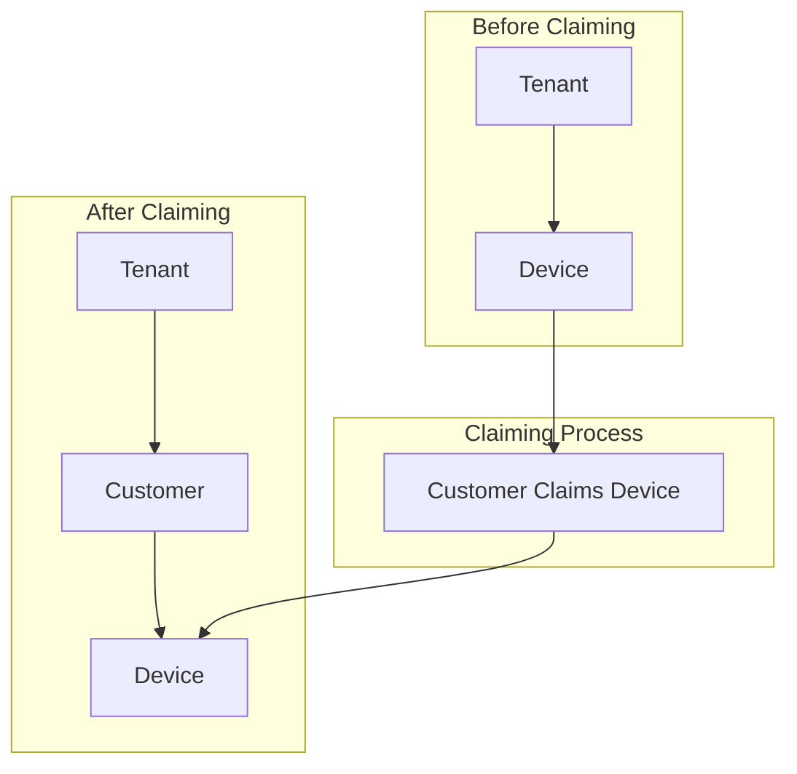
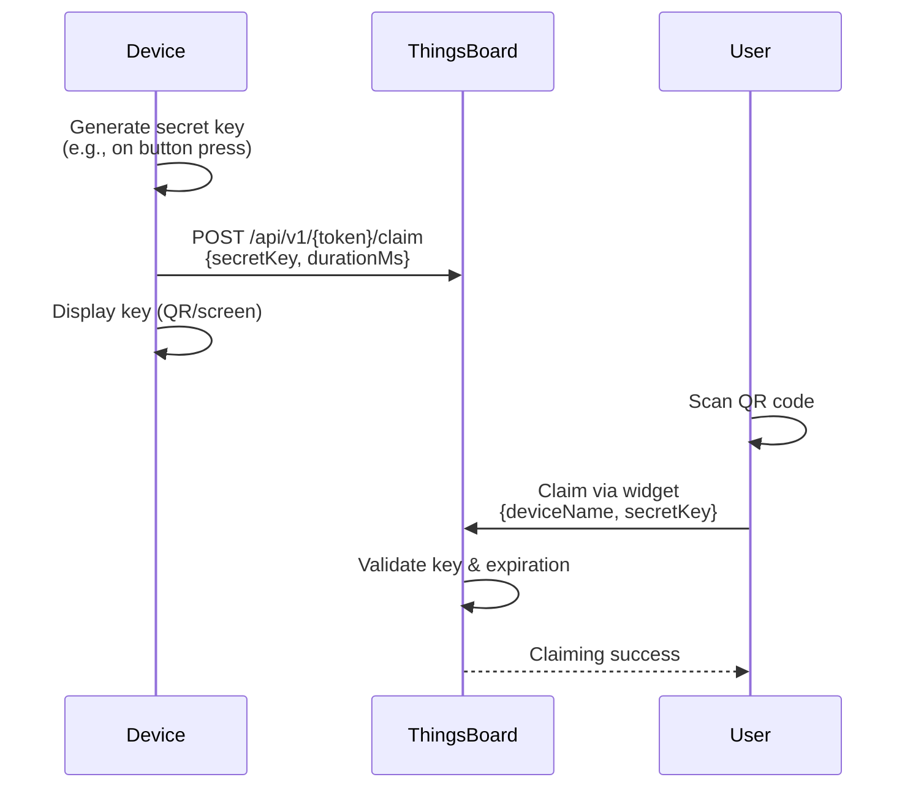
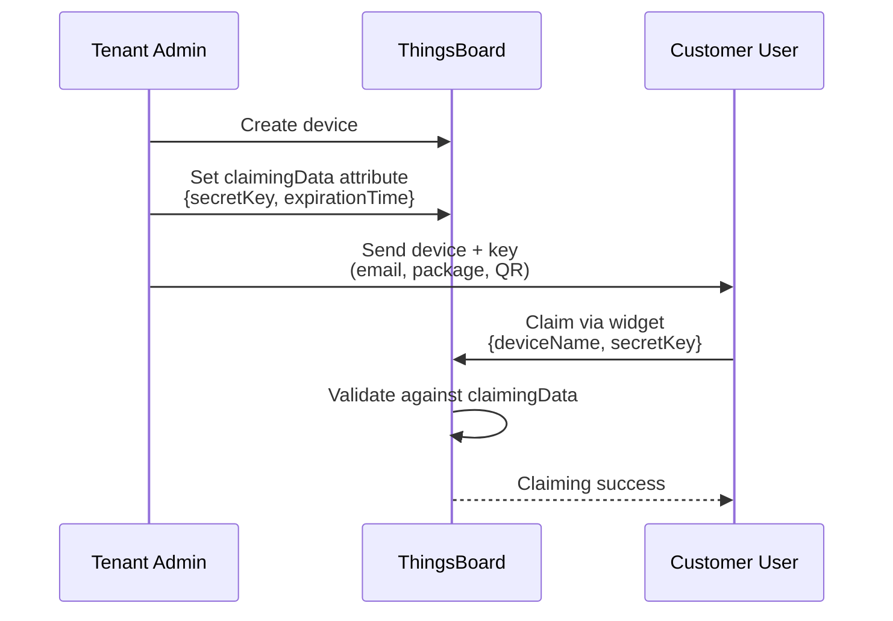
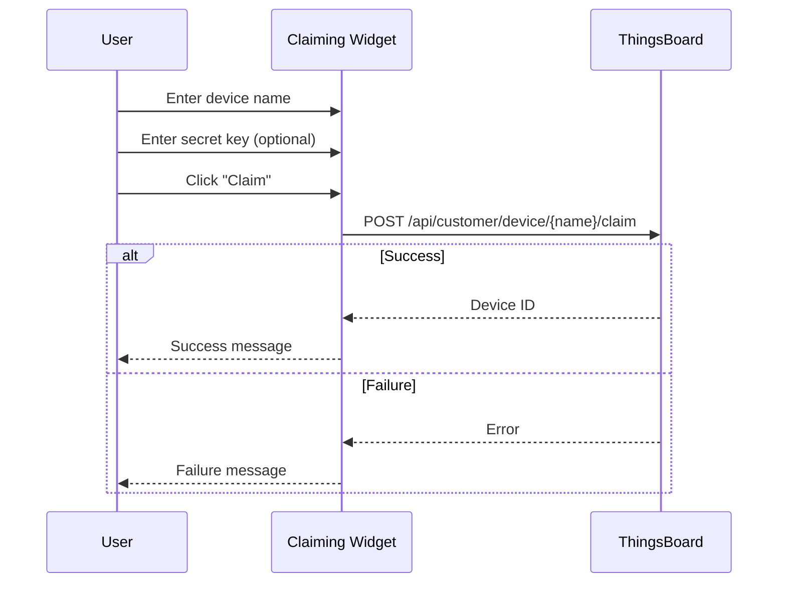
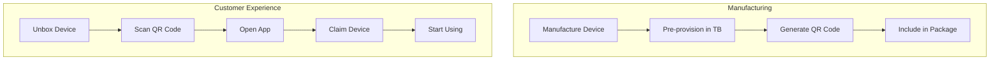
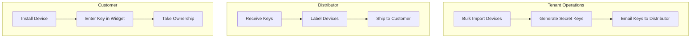

# Device Claiming

## Overview

Device claiming enables customers to take ownership of pre-provisioned devices. Tenants pre-provision devices and provide customers with device names and optional secret keys (via QR codes, documentation, or device displays). Customers then claim devices using the Device Claiming Widget, which transfers ownership and grants access to device data and controls.

## Key Behaviors

1. **Ownership Transfer**: Claiming assigns a device from tenant to customer ownership.

2. **Secret Key Validation**: Optional secret key provides secure claiming authentication.

3. **Time-Limited Claims**: Secret keys have expiration times for security.

4. **Two Scenarios**: Device-side key (device generates) or server-side key (admin provisions).

5. **Widget-Based UX**: Device Claiming Widget provides user-friendly claiming interface.

6. **Reclaiming**: Devices can be reclaimed (unassigned) back to tenant.

## Claiming Architecture

### Claiming Flow



### Ownership Transfer



## Claiming Scenarios

### Device-Side Key Scenario

The device generates a secret key and sends it to ThingsBoard. Useful when devices have displays or physical interfaces.



**Characteristics:**

| Aspect | Description |
|--------|-------------|
| Key Generation | Device generates dynamically |
| Key Display | QR code, LCD, LED pattern |
| Trigger | Button press, boot, timer |
| Duration | Configurable (default: 30s) |
| Use Case | Consumer devices with displays |

**Claiming Request from Device:**

```json
{
  "secretKey": "ABC123",
  "durationMs": 30000
}
```

**Parameters:**
- `secretKey` - Optional secret key (empty string if not provided)
- `durationMs` - Key validity duration in milliseconds

### Server-Side Key Scenario

Tenant admin pre-configures the secret key as a server attribute. Useful for bulk provisioning.



**Characteristics:**

| Aspect | Description |
|--------|-------------|
| Key Generation | Admin generates in advance |
| Key Distribution | Email, printed QR, packaging |
| Storage | Server-side attribute |
| Duration | Admin sets expiration time |
| Use Case | Bulk device distribution |

**claimingData Attribute:**

```json
{
  "secretKey": "YOUR_SECRET_KEY",
  "expirationTime": 1735689600000
}
```

**Parameters:**
- `secretKey` - Secret key for claiming validation
- `expirationTime` - Unix timestamp (milliseconds) for expiration

## Configuration

### System Settings

| Parameter | Default | Description |
|-----------|---------|-------------|
| `security.claim.allowClaimingByDefault` | false | Allow claiming without explicit attribute |
| `device.claim.duration` | 86400000 | Default claim duration (ms) |
| `caffeine.specs.claimDevices.timeToLiveInMinutes` | 1440 | Max cache time for claim info |

### Device Attributes

| Attribute | Type | Description |
|-----------|------|-------------|
| `claimingAllowed` | Server | Boolean - enables claiming (required if `allowClaimingByDefault` is false) |
| `claimingData` | Server | JSON - server-side key scenario data |
| `expirationTime` | Server | Timestamp - device-side key expiration |

### Enable Claiming for Device

If `allowClaimingByDefault` is `false`, set the `claimingAllowed` attribute:

```bash
curl -X POST \
  -H "Authorization: Bearer $JWT_TOKEN" \
  -H "Content-Type: application/json" \
  -d '{"claimingAllowed": true}' \
  "https://thingsboard.example.com/api/plugins/telemetry/DEVICE/$DEVICE_ID/SERVER_SCOPE"
```

## Protocol-Specific APIs

### MQTT Claiming

**Topic:** `v1/devices/me/claim`

**Payload:**
```json
{
  "secretKey": "ABC123",
  "durationMs": 30000
}
```

**Example:**
```python
import paho.mqtt.client as mqtt
import json

client = mqtt.Client()
client.username_pw_set("DEVICE_ACCESS_TOKEN")
client.connect("thingsboard.example.com", 1883)

claim_data = {
    "secretKey": "ABC123",
    "durationMs": 30000
}
client.publish("v1/devices/me/claim", json.dumps(claim_data))
```

### HTTP Claiming

**Endpoint:** `POST /api/v1/{token}/claim`

**Request:**
```bash
curl -X POST \
  -H "Content-Type: application/json" \
  -d '{"secretKey": "ABC123", "durationMs": 30000}' \
  "http://thingsboard.example.com:8080/api/v1/{token}/claim"
```

### CoAP Claiming

**Endpoint:** `POST coap://host:5683/api/v1/{token}/claim`

**Payload:** Same JSON format as HTTP

### Gateway MQTT Claiming

Gateways can initiate claiming for connected devices.

**Topic:** `v1/gateway/claim`

**Payload:**
```json
{
  "Device-001": {
    "secretKey": "ABC123",
    "durationMs": 30000
  },
  "Device-002": {
    "secretKey": "XYZ789",
    "durationMs": 60000
  }
}
```

## Customer Claiming API

### Claim Device Request

Customers claim devices via the REST API.

**Endpoint:** `POST /api/customer/device/{deviceName}/claim`

**Request:**
```json
{
  "secretKey": "ABC123"
}
```

**Response (Success):**
```json
{
  "id": {
    "entityType": "DEVICE",
    "id": "784f394c-42b6-435a-983c-b7beff2784f9"
  },
  "createdTime": 1609459200000,
  "name": "My Device",
  "type": "default",
  "customerId": {
    "entityType": "CUSTOMER",
    "id": "13814000-1dd2-11b2-8080-808080808080"
  }
}
```

**Example:**
```bash
curl -X POST \
  -H "Authorization: Bearer $CUSTOMER_JWT_TOKEN" \
  -H "Content-Type: application/json" \
  -d '{"secretKey": "ABC123"}' \
  "https://thingsboard.example.com/api/customer/device/My-Device-001/claim"
```

### Reclaim Device Request

Return device to tenant ownership.

**Endpoint:** `DELETE /api/customer/device/{deviceName}/claim`

**Response:**
```json
{
  "result": {},
  "setOrExpired": true
}
```

**Example:**
```bash
curl -X DELETE \
  -H "Authorization: Bearer $JWT_TOKEN" \
  "https://thingsboard.example.com/api/customer/device/My-Device-001/claim"
```

## Device Claiming Widget

### Widget Location

The Device Claiming Widget is found in:
- **Widget Bundle:** Input widgets
- **Section:** Static widget
- **Widget:** Device Claiming

### Widget Configuration

| Setting | Description |
|---------|-------------|
| Device Name Input | Field for entering device name |
| Secret Key Input | Optional field for secret key |
| Hide Secret Key | Option to hide key input field |
| Labels | Customizable input labels |
| Messages | Success/failure message configuration |

### Widget Settings

**General Settings:**
- Hide Secret Key input (for empty key scenarios)
- Custom label text
- Input field placeholders

**Message Settings:**
- Success message text
- Failure message text
- Claiming in progress message

**Relation Settings:**
- Relate claimed device to dashboard entity
- Useful for asset-device relationships

### Widget Flow



## Implementation Examples

### Python Device-Side Claiming

```python
from tb_device_mqtt import TBDeviceMqttClient
import secrets

# Configuration
THINGSBOARD_HOST = "thingsboard.example.com"
ACCESS_TOKEN = "DEVICE_ACCESS_TOKEN"

# Generate secret key
secret_key = secrets.token_hex(8)  # 16-character hex string
duration_ms = 60000  # 1 minute

# Connect and send claiming info
client = TBDeviceMqttClient(THINGSBOARD_HOST, username=ACCESS_TOKEN)
client.connect()

# Send claiming request
result = client.claim(secret_key=secret_key, duration=duration_ms).get()
if result == 0:
    print(f"Claiming enabled. Secret key: {secret_key}")
    print(f"Valid for {duration_ms/1000} seconds")
    # Display QR code or show on screen
else:
    print("Failed to send claiming info")

client.disconnect()
```

### Python Server-Side Key Setup

```python
import requests
import time
import json

THINGSBOARD_HOST = "https://thingsboard.example.com"
JWT_TOKEN = "YOUR_ADMIN_JWT_TOKEN"
DEVICE_ID = "YOUR_DEVICE_ID"

# Generate claiming data
claiming_data = {
    "secretKey": "MY_SECRET_KEY_123",
    "expirationTime": int(time.time() * 1000) + (7 * 24 * 60 * 60 * 1000)  # 7 days
}

# Set server attribute
response = requests.post(
    f"{THINGSBOARD_HOST}/api/plugins/telemetry/DEVICE/{DEVICE_ID}/SERVER_SCOPE",
    headers={
        "Authorization": f"Bearer {JWT_TOKEN}",
        "Content-Type": "application/json"
    },
    json={"claimingData": json.dumps(claiming_data)}
)

if response.status_code == 200:
    print("Claiming data configured successfully")
else:
    print(f"Failed: {response.text}")
```

### Python Customer Claiming

```python
import requests

THINGSBOARD_HOST = "https://thingsboard.example.com"
CUSTOMER_JWT_TOKEN = "CUSTOMER_JWT_TOKEN"
DEVICE_NAME = "My-Device-001"
SECRET_KEY = "MY_SECRET_KEY_123"

# Claim device
response = requests.post(
    f"{THINGSBOARD_HOST}/api/customer/device/{DEVICE_NAME}/claim",
    headers={
        "Authorization": f"Bearer {CUSTOMER_JWT_TOKEN}",
        "Content-Type": "application/json"
    },
    json={"secretKey": SECRET_KEY}
)

if response.status_code == 200:
    device = response.json()
    print(f"Successfully claimed device: {device['id']['id']}")
else:
    print(f"Claiming failed: {response.text}")
```

## Use Cases

### Consumer Electronics



### Industrial IoT Distribution



### Smart Home Devices

| Step | Action | Actor |
|------|--------|-------|
| 1 | Provision device in factory | Manufacturer |
| 2 | Set claiming data (server-side) | Manufacturer |
| 3 | Print QR code on device | Manufacturer |
| 4 | Customer purchases device | Customer |
| 5 | Scan QR with mobile app | Customer |
| 6 | Device appears in customer dashboard | Customer |

## Permissions (PE)

In ThingsBoard Professional Edition, users require specific permissions to claim devices.

### Required Permission

| Resource | Operation |
|----------|-----------|
| Device | Claim devices |

### Configure Permission

1. Create a generic role with "Claim devices" permission
2. Assign role to customer user group
3. Users in group can now claim devices

## Best Practices

### Security

| Practice | Benefit |
|----------|---------|
| Use unique secret keys | Prevent unauthorized claiming |
| Set short expiration times | Limit claim window |
| Use HTTPS for API calls | Protect key in transit |
| Rotate unclaimed keys | Reduce exposure time |

### Operations

| Practice | Benefit |
|----------|---------|
| Use server-side for bulk | Scalable distribution |
| Use device-side for consumers | Better UX with QR |
| Log claiming events | Audit trail |
| Automate key generation | Reduce manual errors |

### Device Implementation

| Practice | Benefit |
|----------|---------|
| Display key prominently | Easy scanning |
| Use QR codes | Quick data entry |
| Handle claim success | Update device state |
| Implement timeout display | Clear UX |

## Troubleshooting

### Common Issues

| Issue | Cause | Solution |
|-------|-------|----------|
| Claiming fails | Invalid secret key | Verify key matches |
| Key expired | Duration exceeded | Generate new key |
| Device not found | Wrong device name | Check exact name |
| Permission denied | Missing claim permission | Add permission (PE) |
| Already claimed | Device has owner | Reclaim first |

### Debug Steps

1. Verify `claimingAllowed` attribute is `true`
2. Check secret key matches exactly
3. Verify expiration time hasn't passed
4. Confirm device name is correct
5. Check user has claiming permission (PE)
6. Review server logs for errors

### State After Claiming

Once a device is claimed:
- Device is assigned to customer
- `claimingAllowed` attribute is removed (if `allowClaimingByDefault` is false)
- Customer users can access device data
- Customer users can control device

### State After Reclaiming

Once a device is reclaimed:
- Device is unassigned from customer
- `claimingAllowed` attribute is restored (if `allowClaimingByDefault` is false)
- Device returns to tenant ownership
- Claim process can be repeated

## Common Pitfalls

### Claiming Strategy Pitfalls

| Pitfall | Impact | Solution |
|---------|--------|----------|
| **allowClaimingByDefault=true without authentication** | Any user can claim any unclaimed device | Require authentication or use secret key claiming |
| **Device-side key without secure storage** | Key exposed in firmware or QR code | Consider server-side key for higher security needs |
| **Server-side key generation not random** | Predictable keys enable unauthorized claiming | Use cryptographically secure random key generation |
| **Secret key too short** | Brute-force vulnerability | Use minimum 8 character keys with alphanumeric characters |

### Timing Pitfalls

| Pitfall | Impact | Solution |
|---------|--------|----------|
| **Claim duration too short** | Users cannot complete claiming in time | Set reasonable duration (hours/days, not minutes) |
| **Claim duration infinite (0)** | Devices claimable forever | Set expiration for temporary claiming scenarios |
| **Not handling claim expiration** | User experience confusion | Provide clear expiration feedback in UI |

### Secret Key Pitfalls

| Pitfall | Impact | Solution |
|---------|--------|----------|
| **Secret key logged** | Key exposed in logs | Mask secretKey in all logging |
| **Secret key transmitted unencrypted** | Key captured in transit | Always use HTTPS/TLS for claiming APIs |
| **Same secret key for multiple devices** | One key claims multiple devices | Use unique keys per device |
| **Secret key not cleared after claiming** | Key remains usable | Configure to clear claimingData after successful claim |

### Device-Side Key Pitfalls

| Pitfall | Impact | Solution |
|---------|--------|----------|
| **claimingAllowed attribute not set** | Claiming fails with "not allowed" | Ensure attribute exists or use allowClaimingByDefault |
| **claimingData format incorrect** | Claiming fails with parse error | Validate JSON format: `{"secretKey": "...", "expirationTime": ...}` |
| **Device offline during claiming** | Customer cannot claim | Design for claim registration that works when device connects |

### Server-Side Key Pitfalls

| Pitfall | Impact | Solution |
|---------|--------|----------|
| **Not distributing key to customer** | Customer cannot complete claiming | Implement key distribution workflow (email, print, etc.) |
| **Key visible in UI to non-admins** | Unauthorized key access | Control key visibility based on user role |
| **Regenerating key destroys previous** | Previous key becomes invalid | Consider supporting multiple active keys |

### Widget Integration Pitfalls

| Pitfall | Impact | Solution |
|---------|--------|----------|
| **Dashboard not assigned to customer** | Widget not visible to customer user | Assign claiming dashboard before claiming flow |
| **Widget configured for wrong claim type** | Incorrect claiming API called | Match widget type (claimDevice vs claimDeviceWithKey) to strategy |
| **Missing customer context** | Claiming creates device without customer assignment | Verify customer user context in claiming flow |

### Re-claiming Pitfalls

| Pitfall | Impact | Solution |
|---------|--------|----------|
| **Expecting automatic reclaim after unclaim** | Device not auto-claimable after release | Must reset claimingAllowed attribute |
| **Reclaim without new secret** | Old secret key works | Generate new secret on re-claim scenarios |
| **Customer data remains after unclaim** | Privacy concern | Clear customer-specific data on unclaim |

## See Also

- [Device Entity](./entities/device.md) - Device data model
- [Device Provisioning](./device-provisioning.md) - Automatic device registration
- [MQTT Protocol](../05-transport-layer/mqtt.md) - MQTT claiming topic
- [HTTP Protocol](../05-transport-layer/http.md) - HTTP claiming API
- [Gateway MQTT](../05-transport-layer/gateway-mqtt.md) - Gateway claiming API
- [Attributes Data Model](./data-model/attributes.md) - Server attributes
