# Device Profiles

## Overview

Device profiles enable centralized management of common settings for multiple devices. Rather than configuring each device individually, administrators define profiles that specify transport configuration, alarm rules, default rule chains, firmware versions, and provisioning strategies. When devices are assigned to a profile, they inherit these settings automatically, simplifying fleet management at scale.

## Key Behaviors

1. **Centralized Configuration**: Define settings once, apply to many devices.

2. **Transport Configuration**: Protocol-specific settings (MQTT topics, payload formats, CoAP modes).

3. **Alarm Rules**: Profile-level alarm conditions with severity and propagation.

4. **Provisioning Strategy**: Control how new devices register via the profile.

5. **OTA Management**: Assign firmware/software versions to profile for fleet updates.

6. **Queue Assignment**: Route device messages to specific processing queues.

## Profile Architecture

### Profile Hierarchy

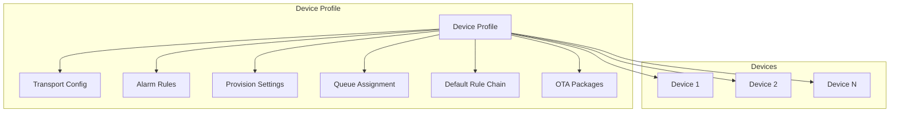

### Configuration Inheritance

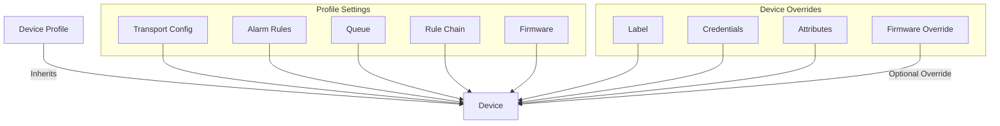

## Profile Settings

### Basic Configuration

| Setting | Required | Description |
|---------|----------|-------------|
| Name | Yes | Unique profile name |
| Description | No | Profile description |
| Default Rule Chain | No | Rule chain for processing messages |
| Default Queue | No | Message queue (default: "Main") |
| Default Dashboard | No | Dashboard for device details |
| Image | No | Profile icon/image |

### Default Rule Chain

Assign a specific rule chain to process all messages from devices using this profile:

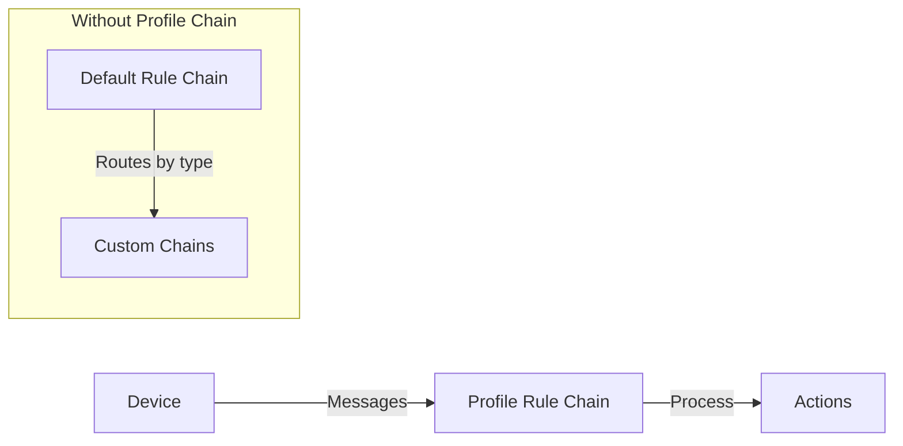

**Benefits:**
- Simplifies root rule chain
- Isolates processing logic per device type
- Easier maintenance and debugging

### Queue Assignment

Route messages to specific queues for processing isolation:

| Queue | Use Case |
|-------|----------|
| Main | Default queue for general devices |
| HighPriority | Critical alerts (fire alarms, safety) |
| Batch | High-volume, delay-tolerant data |

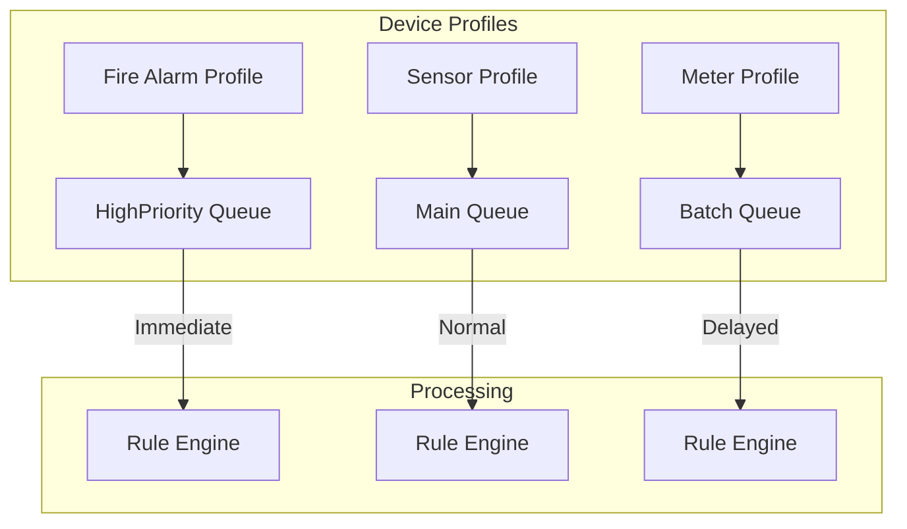

## Transport Configuration

### Transport Types

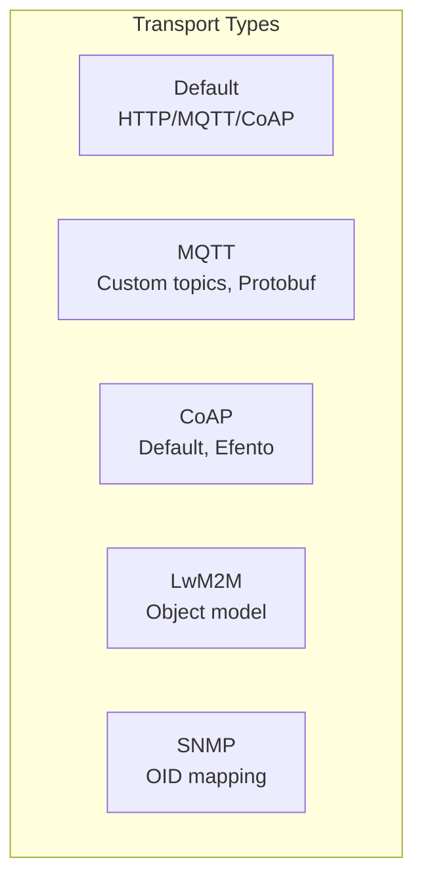

### Default Transport

Basic transport supporting standard HTTP, MQTT, and CoAP APIs with JSON payloads.

| Setting | Description |
|---------|-------------|
| Type | Default |
| Payload | JSON |

### MQTT Transport

Custom MQTT topic filters and payload formats:

| Setting | Description | Example |
|---------|-------------|---------|
| Telemetry Topic Filter | Custom topic for telemetry | `/sensors/+/telemetry` |
| Attributes Topic Filter | Custom topic for attributes | `/sensors/+/attributes` |
| Payload Type | JSON or Protobuf | Protobuf |

**Topic Wildcards:**
- `+` - Single level wildcard
- `#` - Multi-level wildcard

**Example Configuration:**
```
Telemetry Topic: /devices/${deviceName}/data
Attributes Topic: /devices/${deviceName}/attrs
```

### MQTT Payload Formats

| Format | Description | Use Case |
|--------|-------------|----------|
| JSON | Human-readable, larger | Development, debugging |
| Protobuf | Binary, compact | Production, bandwidth-limited |

**Protobuf Schema Definition:**

```protobuf
syntax = "proto3";

message TelemetryData {
  double temperature = 1;
  double humidity = 2;
  int64 timestamp = 3;
}
```

**Compatibility Mode:**
- Tries Protobuf first, falls back to JSON
- Useful during firmware migration
- Slight performance overhead

### CoAP Transport

| Device Type | Description |
|-------------|-------------|
| Default | Standard CoAP with JSON/Protobuf |
| Efento NB-IoT | Specialized for Efento sensors |

**Power Saving Modes:**

| Mode | Description |
|------|-------------|
| PSM | Power Saving Mode - extended sleep |
| DRX | Discontinuous Reception |
| eDRX | Extended DRX |

### LwM2M Transport

Standardized object model configuration:

| Setting | Description |
|---------|-------------|
| Object Model | LwM2M object definitions |
| Observe Strategy | SINGLE, COMPOSITE_ALL, COMPOSITE_BY_OBJECT |
| Bootstrap | Bootstrap server settings |

See [LwM2M Protocol](../05-transport-layer/lwm2m.md) for detailed configuration.

### SNMP Transport

OID mapping and polling configuration:

| Setting | Description |
|---------|-------------|
| Timeout | Request timeout (ms) |
| Retries | Retry attempts |
| Communication Configs | OID mappings and polling frequency |

See [SNMP Protocol](../05-transport-layer/snmp.md) for detailed configuration.

## Alarm Rules

### Alarm Rule Structure

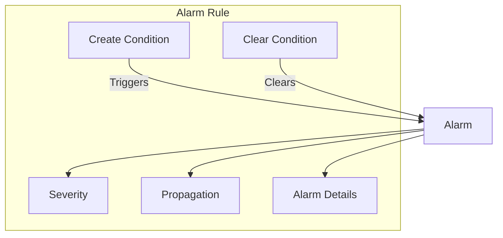

### Alarm Configuration

| Setting | Description |
|---------|-------------|
| Alarm Type | Unique alarm identifier |
| Create Condition | Condition that triggers alarm |
| Clear Condition | Condition that clears alarm |
| Severity | CRITICAL, MAJOR, MINOR, WARNING, INDETERMINATE |
| Propagate | Propagate to related entities |
| Details | Dynamic alarm details function |

### Condition Types

| Type | Description | Example |
|------|-------------|---------|
| Simple | Single key comparison | `temperature > 100` |
| Duration | Condition over time | `temperature > 100 for 5 minutes` |
| Repeating | Multiple occurrences | `temperature > 100, 3 times in 5 minutes` |

### Condition Keys

| Key Source | Description |
|------------|-------------|
| Telemetry | Time-series values |
| Attribute | Device attributes |
| Constant | Fixed values |
| Entity Count | Alarm entity count |

### Condition Operations

| Category | Operations |
|----------|------------|
| Numeric | `>`, `<`, `>=`, `<=`, `==`, `!=` |
| String | `EQUAL`, `NOT_EQUAL`, `STARTS_WITH`, `ENDS_WITH`, `CONTAINS` |
| Boolean | `==`, `!=` |
| Complex | `AND`, `OR` |

### Alarm Details Function

Dynamic alarm details using TBEL:

```javascript
var details = {};
details.temperature = $root.temperature;
details.threshold = 100;
details.message = 'Temperature exceeded threshold: ' + $root.temperature;
return details;
```

### Example: Temperature Alarm

```json
{
  "alarmType": "High Temperature",
  "createRules": {
    "CRITICAL": {
      "condition": {
        "spec": {
          "type": "SIMPLE"
        },
        "condition": [{
          "key": {
            "type": "TIME_SERIES",
            "key": "temperature"
          },
          "predicate": {
            "type": "NUMERIC",
            "operation": "GREATER",
            "value": {
              "defaultValue": 100
            }
          }
        }]
      }
    }
  },
  "clearRule": {
    "condition": {
      "spec": {
        "type": "SIMPLE"
      },
      "condition": [{
        "key": {
          "type": "TIME_SERIES",
          "key": "temperature"
        },
        "predicate": {
          "type": "NUMERIC",
          "operation": "LESS_OR_EQUAL",
          "value": {
            "defaultValue": 100
          }
        }
      }]
    }
  },
  "propagate": true,
  "propagateToOwner": true
}
```

## Device Provisioning

### Provisioning Settings

| Setting | Description |
|---------|-------------|
| Provision Strategy | Allow new / Check pre-provisioned |
| Provision Device Key | Unique profile key |
| Provision Device Secret | Authentication secret |

See [Device Provisioning](./device-provisioning.md) for detailed configuration.

## OTA Updates

### Firmware Assignment

Assign firmware packages to the profile for fleet-wide updates:

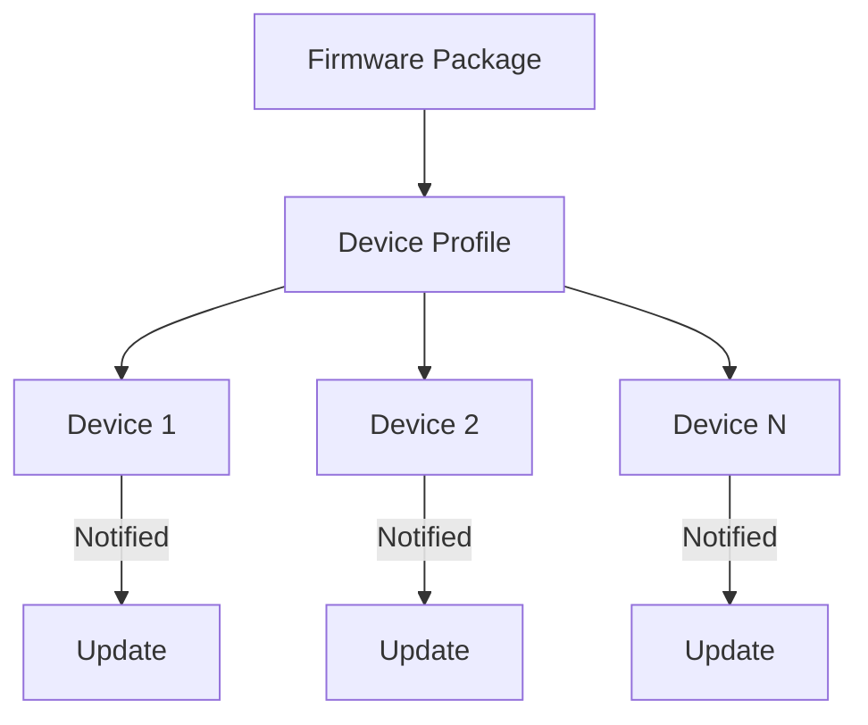

### Software Assignment

Same as firmware but for software packages (Object 9 in LwM2M).

See [OTA Updates](./ota-updates.md) for detailed configuration.

## Profile Management

### Create Profile

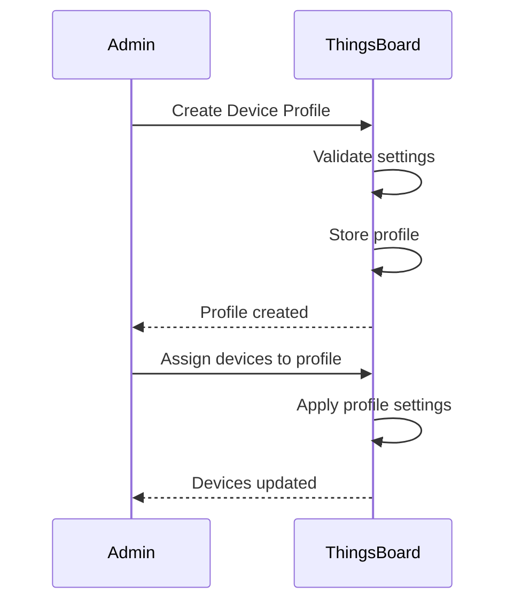

### REST API

**Create Profile:**
```bash
curl -X POST \
  -H "Authorization: Bearer $JWT_TOKEN" \
  -H "Content-Type: application/json" \
  -d '{
    "name": "Temperature Sensors",
    "description": "Profile for temperature monitoring devices",
    "type": "DEFAULT",
    "transportType": "MQTT",
    "defaultQueueName": "Main"
  }' \
  "https://thingsboard.example.com/api/deviceProfile"
```

**Get Profile:**
```bash
curl -X GET \
  -H "Authorization: Bearer $JWT_TOKEN" \
  "https://thingsboard.example.com/api/deviceProfile/$PROFILE_ID"
```

**List Profiles:**
```bash
curl -X GET \
  -H "Authorization: Bearer $JWT_TOKEN" \
  "https://thingsboard.example.com/api/deviceProfiles?pageSize=10&page=0"
```

### Default Profile

Every tenant has a "default" device profile that cannot be deleted. New devices without an explicit profile assignment use this default.

## Profile Data Model

### Entity Structure

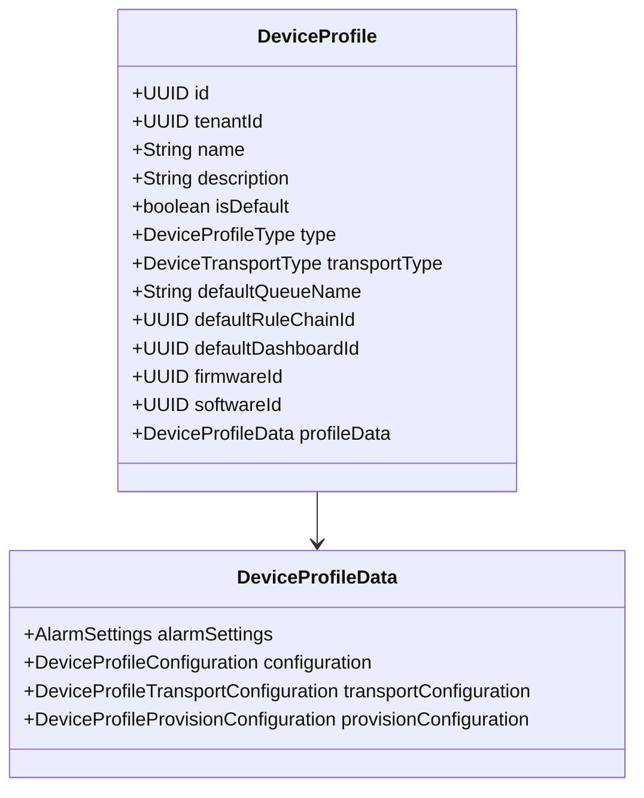

### Database Schema

| Column | Type | Description |
|--------|------|-------------|
| id | uuid | Primary key |
| tenant_id | uuid | Owning tenant |
| name | varchar | Profile name |
| type | varchar | Profile type |
| transport_type | varchar | Transport protocol |
| provision_device_key | varchar | Provisioning key |
| default_rule_chain_id | uuid | FK to rule chain |
| default_queue_name | varchar | Queue name |
| firmware_id | uuid | FK to OTA package |
| software_id | uuid | FK to OTA package |
| profile_data | jsonb | Configuration data |

## Use Cases

### Industrial Sensors

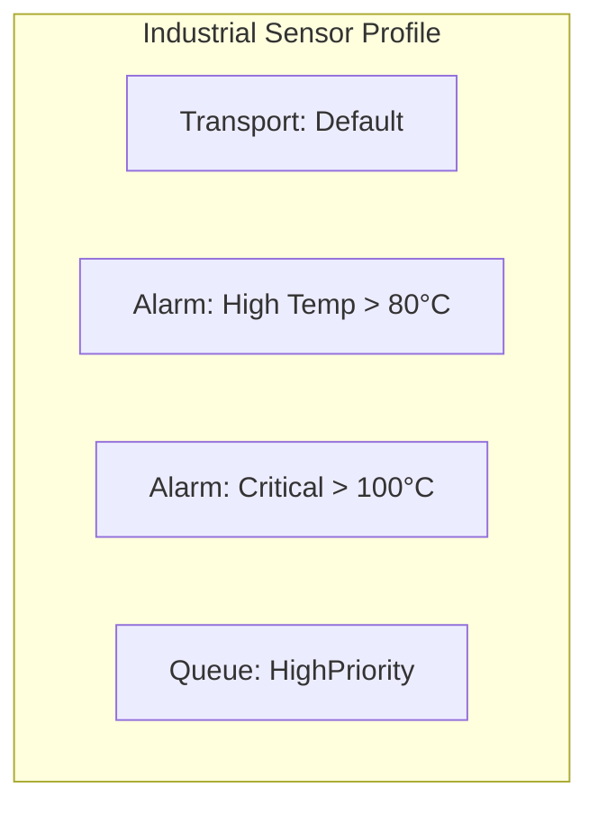

**Configuration:**
- Transport: Default (JSON)
- Alarms: Temperature thresholds
- Queue: HighPriority for immediate processing
- Rule Chain: Industrial processing chain

### Smart Meters

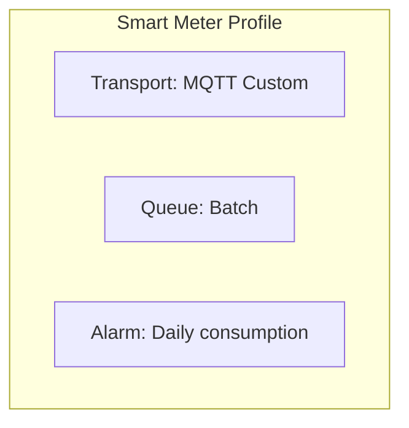

**Configuration:**
- Transport: MQTT with custom topics
- Queue: Batch for high-volume data
- Alarms: Consumption anomalies
- Firmware: Smart meter firmware

### LwM2M Devices

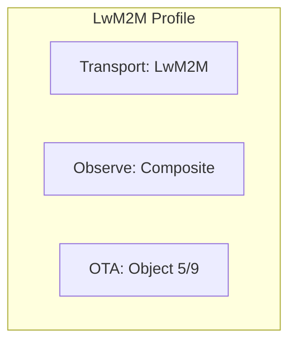

**Configuration:**
- Transport: LwM2M with object model
- Observe Strategy: Composite for efficiency
- Bootstrap: Enabled for provisioning
- Security: PSK or X.509

## Best Practices

### Profile Organization

| Practice | Benefit |
|----------|---------|
| One profile per device type | Clear separation |
| Descriptive names | Easy identification |
| Document alarm rules | Maintainability |
| Test before deployment | Prevent errors |

### Transport Configuration

| Practice | Benefit |
|----------|---------|
| Use Protobuf for production | Bandwidth efficiency |
| Custom topics per device type | Clean topic structure |
| Enable compatibility during migration | Smooth transitions |

### Alarm Configuration

| Practice | Benefit |
|----------|---------|
| Use duration conditions | Reduce false positives |
| Set appropriate severities | Proper prioritization |
| Configure propagation | Related entity visibility |
| Include details function | Rich alarm context |

## Troubleshooting

### Common Issues

| Issue | Cause | Solution |
|-------|-------|----------|
| Device not using profile | Wrong profile assigned | Verify device profile assignment |
| Alarms not triggering | Condition not met | Check telemetry values and conditions |
| Custom topics not working | Topic filter mismatch | Verify wildcard patterns |
| Protobuf parsing fails | Schema mismatch | Validate proto schema |

### Debug Steps

1. Verify device profile assignment
2. Check transport configuration matches device
3. Review alarm rule conditions
4. Test with debug logging enabled
5. Validate message format (JSON/Protobuf)

## See Also

- [Device Entity](./entities/device.md) - Device configuration
- [Device Provisioning](./device-provisioning.md) - Automatic device registration
- [OTA Updates](./ota-updates.md) - Firmware/software distribution
- [Alarm Entity](./entities/alarm.md) - Alarm data model
- [Rule Engine](../04-rule-engine/README.md) - Message processing
- [Transport Layer](../05-transport-layer/README.md) - Protocol details
