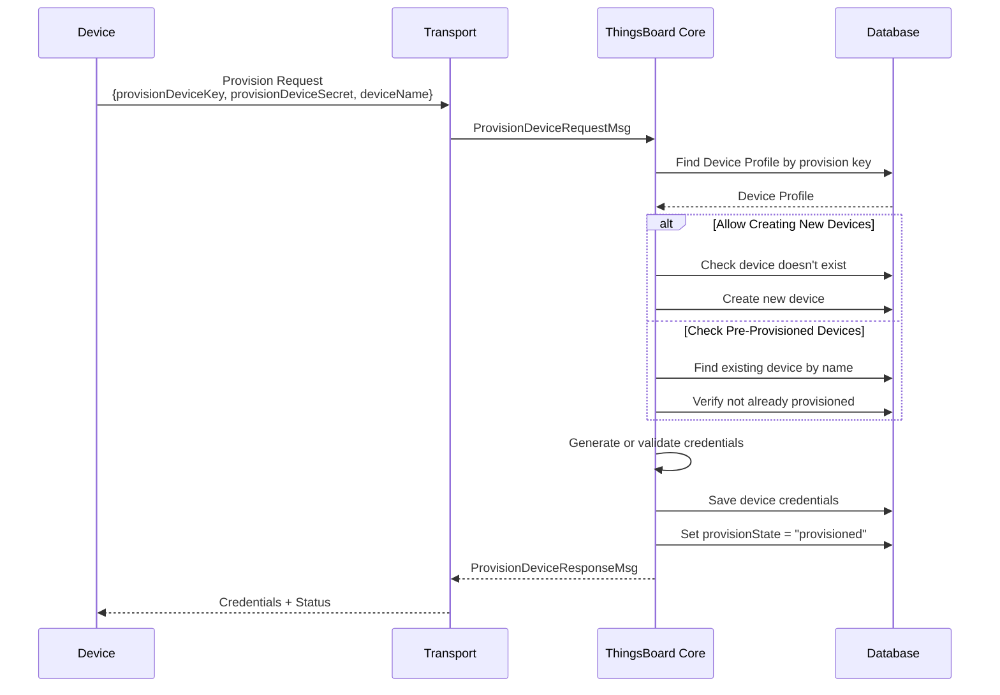
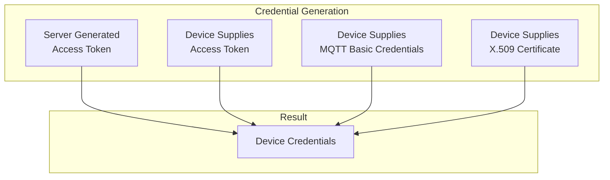
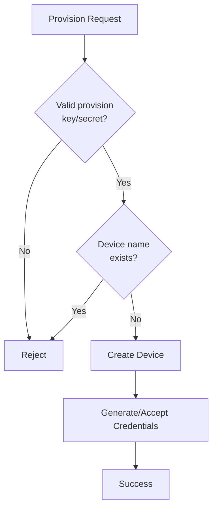
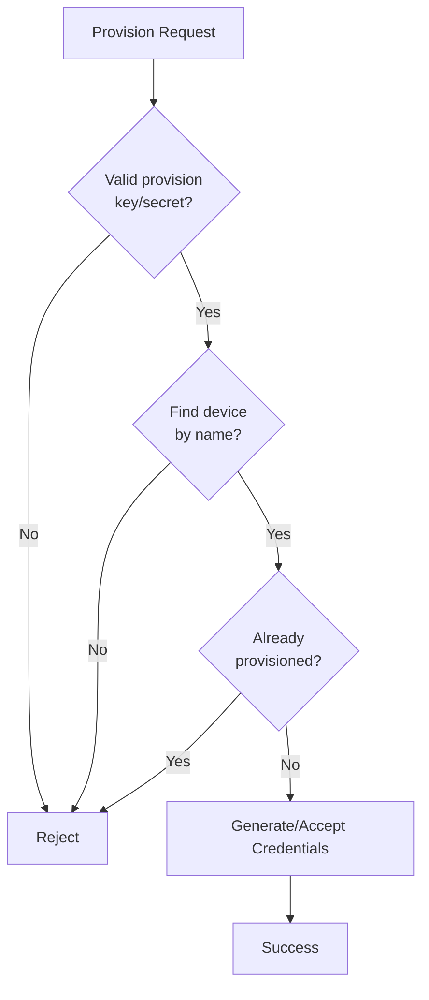
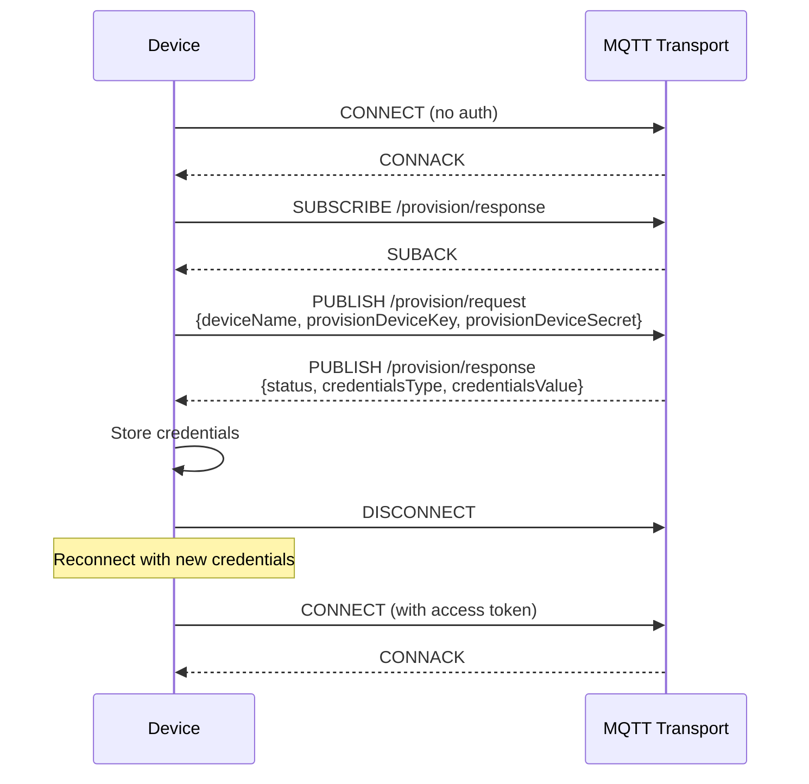
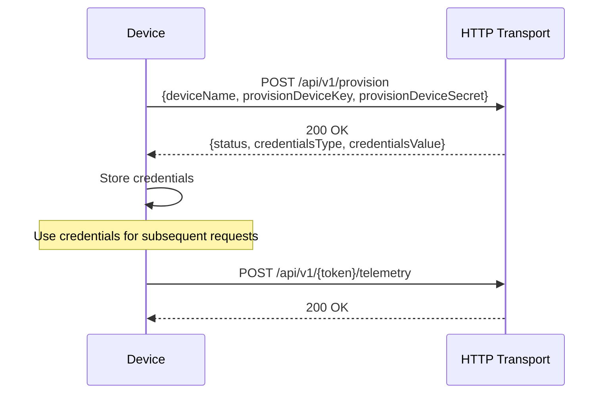
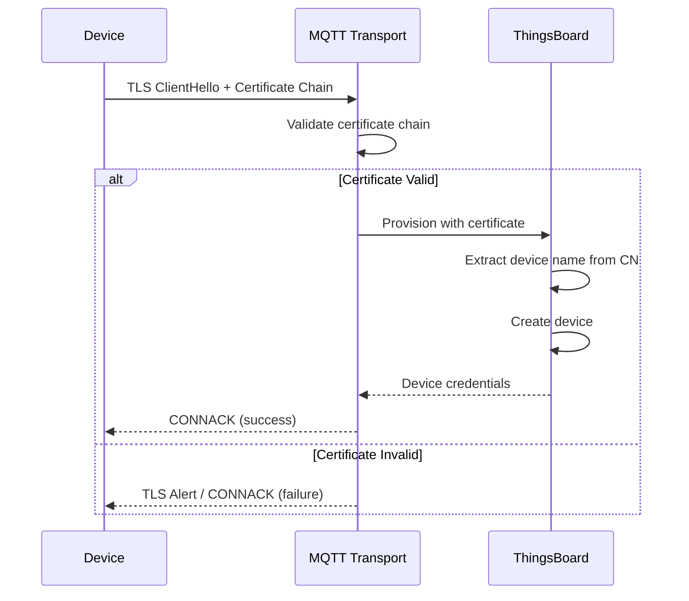
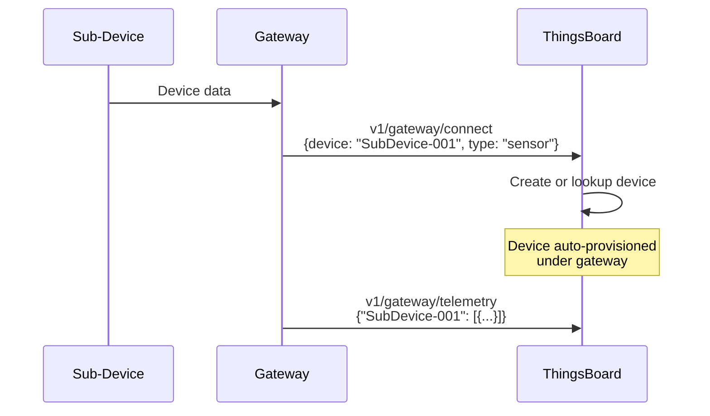

# Device Provisioning

## Overview

Device provisioning enables devices to automatically register themselves with ThingsBoard without pre-configuration. During provisioning, a device presents credentials (provision key/secret) that identify its device profile, and ThingsBoard either generates unique credentials for the device or accepts device-supplied credentials. This eliminates manual device registration and enables scalable device deployment.

## Key Behaviors

1. **Self-Registration**: Devices register themselves using provision credentials from their device profile.

2. **Credential Generation**: ThingsBoard can auto-generate access tokens, or devices can supply their own credentials.

3. **Profile-Based Validation**: Provision requests are validated against device profile settings.

4. **Two Strategies**: Either allow new device creation or require pre-provisioned devices.

5. **Multi-Protocol Support**: Works with MQTT, HTTP, and CoAP transports.

## Provisioning Architecture

### Provisioning Flow



### Credential Options



## Provision Strategies

### Allow Creating New Devices

Permits any device with valid provision credentials to register.



| Aspect | Description |
|--------|-------------|
| Use Case | Unknown device identities at manufacturing |
| Security | Less secure - any device can register |
| Device Name | Must be unique (e.g., MAC address) |
| Pre-work | None required |

### Check Pre-Provisioned Devices

Only allows provisioning for devices already created in ThingsBoard.



| Aspect | Description |
|--------|-------------|
| Use Case | Known device list from manufacturing |
| Security | More secure - whitelist approach |
| Device Name | Must match pre-created device |
| Pre-work | Bulk import device list |

## Device Profile Configuration

### Enable Provisioning

Configure the device profile to enable device provisioning:

| Setting | Description |
|---------|-------------|
| Provision Strategy | Allow new devices / Check pre-provisioned |
| Provision Device Key | Unique key identifying this profile |
| Provision Device Secret | Secret for authentication |

### Provision Credentials

The provision key and secret are auto-generated and displayed in the device profile:

```
Provision Device Key: abc123xyz789
Provision Device Secret: secret456def
```

These credentials are embedded in device firmware during manufacturing.

## Protocol-Specific APIs

### MQTT Provisioning

**Topic:** `/provision/request`
**Response Topic:** `/provision/response`

**Request:**
```json
{
  "deviceName": "SN-001234",
  "provisionDeviceKey": "abc123xyz789",
  "provisionDeviceSecret": "secret456def"
}
```

**Response (Success):**
```json
{
  "status": "SUCCESS",
  "credentialsType": "ACCESS_TOKEN",
  "credentialsValue": "generatedAccessToken123"
}
```

**Response (Failure):**
```json
{
  "status": "FAILURE",
  "errorMsg": "Device with this name already exists"
}
```

### MQTT Provisioning Flow



### HTTP Provisioning

**Endpoint:** `POST /api/v1/provision`

**Request:**
```json
{
  "deviceName": "SN-001234",
  "provisionDeviceKey": "abc123xyz789",
  "provisionDeviceSecret": "secret456def"
}
```

**Response:**
```json
{
  "status": "SUCCESS",
  "credentialsType": "ACCESS_TOKEN",
  "credentialsValue": "generatedAccessToken123"
}
```

### HTTP Provisioning Flow



### CoAP Provisioning

**Endpoint:** `POST coap://host:5683/api/v1/provision`

**Request:** Same JSON format as HTTP

**Response:** Same JSON format as HTTP

## Credential Types

### Server-Generated Access Token

ThingsBoard generates a unique access token for the device.

**Request:**
```json
{
  "deviceName": "SN-001234",
  "provisionDeviceKey": "abc123xyz789",
  "provisionDeviceSecret": "secret456def"
}
```

**Response:**
```json
{
  "status": "SUCCESS",
  "credentialsType": "ACCESS_TOKEN",
  "credentialsValue": "A1B2C3D4E5F6"
}
```

### Device-Supplied Access Token

Device provides its own access token during provisioning.

**Request:**
```json
{
  "deviceName": "SN-001234",
  "provisionDeviceKey": "abc123xyz789",
  "provisionDeviceSecret": "secret456def",
  "credentialsType": "ACCESS_TOKEN",
  "token": "MY_CUSTOM_TOKEN_123"
}
```

**Response:**
```json
{
  "status": "SUCCESS",
  "credentialsType": "ACCESS_TOKEN",
  "credentialsValue": "MY_CUSTOM_TOKEN_123"
}
```

### Device-Supplied MQTT Basic Credentials

Device provides MQTT username/password credentials.

**Request:**
```json
{
  "deviceName": "SN-001234",
  "provisionDeviceKey": "abc123xyz789",
  "provisionDeviceSecret": "secret456def",
  "credentialsType": "MQTT_BASIC",
  "clientId": "device_client_id",
  "username": "device_username",
  "password": "device_password"
}
```

### Device-Supplied X.509 Certificate

Device provides its X.509 certificate hash.

**Request:**
```json
{
  "deviceName": "SN-001234",
  "provisionDeviceKey": "abc123xyz789",
  "provisionDeviceSecret": "secret456def",
  "credentialsType": "X509_CERTIFICATE",
  "hash": "certificate_sha256_hash"
}
```

## X.509 Certificate Chain Provisioning

ThingsBoard 3.5+ supports automatic device provisioning using X.509 certificate chains.

### Certificate Chain Flow



### Configuration

| Setting | Description |
|---------|-------------|
| CA Certificate | Root/intermediate CA for chain validation |
| Device Name Pattern | Extract name from certificate CN |
| Auto-provision | Enable automatic provisioning on valid cert |

## Provision State Tracking

### State Attribute

ThingsBoard tracks provisioning status via the `provisionState` server attribute:

| State | Description |
|-------|-------------|
| (not set) | Device not yet provisioned |
| `provisioned` | Device successfully provisioned |

### Preventing Re-Provisioning

Once a device is provisioned:
- The `provisionState` attribute is set to `provisioned`
- Subsequent provision requests for the same device name are rejected
- This prevents credential overwrites and duplicate registrations

## Bulk Provisioning

For the "Check Pre-Provisioned Devices" strategy, pre-create devices via:

### REST API

```bash
curl -X POST \
  -H "Authorization: Bearer $JWT_TOKEN" \
  -H "Content-Type: application/json" \
  -d '{"name": "SN-001234", "type": "default"}' \
  "https://thingsboard.example.com/api/device"
```

### CSV Import

1. Navigate to **Devices** in ThingsBoard UI
2. Click **Import** button
3. Upload CSV with device names:

```csv
name,type,label
SN-001234,sensor,Sensor 1
SN-001235,sensor,Sensor 2
SN-001236,sensor,Sensor 3
```

### Bulk Provisioning API

Use the bulk provisioning endpoint for large batches:

```bash
curl -X POST \
  -H "Authorization: Bearer $JWT_TOKEN" \
  -H "Content-Type: application/json" \
  -d '[
    {"name": "SN-001234", "type": "sensor"},
    {"name": "SN-001235", "type": "sensor"},
    {"name": "SN-001236", "type": "sensor"}
  ]' \
  "https://thingsboard.example.com/api/devices"
```

## Gateway Device Provisioning

Gateways can provision devices on behalf of connected sub-devices.

### Gateway Provisioning Flow



### Gateway vs Direct Provisioning

| Aspect | Direct Provisioning | Gateway Provisioning |
|--------|---------------------|----------------------|
| Connection | Device connects directly | Gateway connects |
| Credentials | Per-device credentials | Gateway credentials only |
| Device Creation | Via provision request | Via gateway connect |
| Use Case | IP-capable devices | Protocol translation |

## Implementation Examples

### Python MQTT Example

```python
import paho.mqtt.client as mqtt
import json
import time

THINGSBOARD_HOST = "localhost"
PROVISION_KEY = "abc123xyz789"
PROVISION_SECRET = "secret456def"
DEVICE_NAME = "SN-001234"

credentials = None

def on_connect(client, userdata, flags, rc):
    client.subscribe("/provision/response")
    provision_request = {
        "deviceName": DEVICE_NAME,
        "provisionDeviceKey": PROVISION_KEY,
        "provisionDeviceSecret": PROVISION_SECRET
    }
    client.publish("/provision/request", json.dumps(provision_request))

def on_message(client, userdata, msg):
    global credentials
    response = json.loads(msg.payload)
    if response.get("status") == "SUCCESS":
        credentials = response.get("credentialsValue")
        print(f"Provisioned! Token: {credentials}")
    else:
        print(f"Provisioning failed: {response.get('errorMsg')}")
    client.disconnect()

# Provision
client = mqtt.Client()
client.on_connect = on_connect
client.on_message = on_message
client.connect(THINGSBOARD_HOST, 1883)
client.loop_forever()

# Use credentials
if credentials:
    client = mqtt.Client()
    client.username_pw_set(credentials)
    client.connect(THINGSBOARD_HOST, 1883)
    client.publish("v1/devices/me/telemetry", json.dumps({"temperature": 25}))
```

### Python HTTP Example

```python
import requests
import json

THINGSBOARD_HOST = "http://localhost:8080"
PROVISION_KEY = "abc123xyz789"
PROVISION_SECRET = "secret456def"
DEVICE_NAME = "SN-001234"

# Provision
response = requests.post(
    f"{THINGSBOARD_HOST}/api/v1/provision",
    json={
        "deviceName": DEVICE_NAME,
        "provisionDeviceKey": PROVISION_KEY,
        "provisionDeviceSecret": PROVISION_SECRET
    }
)

result = response.json()
if result.get("status") == "SUCCESS":
    token = result.get("credentialsValue")
    print(f"Provisioned! Token: {token}")

    # Send telemetry
    requests.post(
        f"{THINGSBOARD_HOST}/api/v1/{token}/telemetry",
        json={"temperature": 25}
    )
else:
    print(f"Provisioning failed: {result.get('errorMsg')}")
```

## Security Considerations

### Provision Credential Protection

| Practice | Description |
|----------|-------------|
| Secure storage | Store provision credentials in secure element or encrypted storage |
| Unique per profile | Use different credentials for different device types |
| Rotate periodically | Change provision secrets if compromised |
| Network security | Use TLS for provision requests |

### Strategy Selection

| Scenario | Recommended Strategy |
|----------|----------------------|
| Unknown device IDs | Allow creating new devices |
| Known device whitelist | Check pre-provisioned devices |
| High security requirements | Check pre-provisioned + X.509 |
| Mass production | Bulk import + check pre-provisioned |

## Troubleshooting

### Common Issues

| Issue | Cause | Solution |
|-------|-------|----------|
| FAILURE status | Invalid provision key/secret | Verify credentials from device profile |
| Device already exists | Duplicate device name | Use unique names (MAC, serial) |
| Device not found | Pre-provisioned strategy | Create device first or change strategy |
| Already provisioned | Re-provisioning attempt | Device already registered |

### Debug Steps

1. Verify provision key/secret in device profile
2. Check device name uniqueness
3. Verify provision strategy matches use case
4. Check `provisionState` attribute on existing devices
5. Enable debug logging on transport service

## See Also

- [Device Entity](./entities/device.md) - Device data model
- [MQTT Protocol](../05-transport-layer/mqtt.md) - MQTT provisioning topics
- [HTTP Protocol](../05-transport-layer/http.md) - HTTP provisioning API
- [CoAP Protocol](../05-transport-layer/coap.md) - CoAP provisioning API
- [SSL/TLS Configuration](../05-transport-layer/ssl-configuration.md) - X.509 certificate setup
- [Gateway MQTT](../05-transport-layer/gateway-mqtt.md) - Gateway device provisioning
