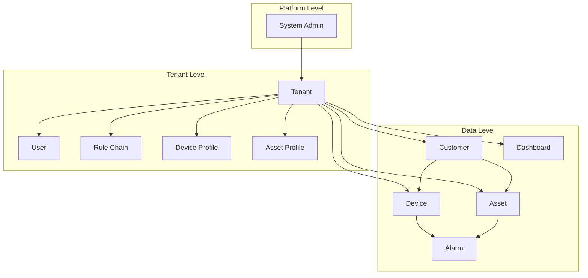

# Entities

## Overview

Entities are the primary objects in ThingsBoard. Everything from devices and assets to dashboards and users is represented as an entity with a unique identifier, lifecycle, and associated data.

## Contents

| Document | Description |
|----------|-------------|
| [Entity Types Overview](./entity-types-overview.md) | Complete catalog of all entity types and their purposes |
| [Device](./device.md) | IoT devices: provisioning, credentials, sessions, and state management |
| [Asset](./asset.md) | Logical groupings: buildings, zones, equipment hierarchies |
| [Tenant](./tenant.md) | Top-level organizational unit with full data isolation |
| [Customer](./customer.md) | Sub-tenant grouping for end-user segmentation |
| [Dashboard](./dashboard.md) | Visualization containers with widgets and state management |
| [Alarm](./alarm.md) | Alert lifecycle: creation, acknowledgment, and clearance |
| [Relations](./relations.md) | Entity-to-entity connections with typed relationships |

## Key Concepts

- **Entity ID**: Every entity has a UUID-based identifier combining type and ID
- **Ownership**: Entities belong to tenants; some can be assigned to customers
- **Lifecycle**: Entities have create, update, delete operations with audit trails
- **Relations**: Flexible connections between any entity types
- **Alarms**: State-machine based alerts attached to entities

## Entity Type Hierarchy

## See Also

- [Identity](../identity/) - How entities are identified
- [Data Model](../data-model/) - Data attached to entities
- [Actor System](../../03-actor-system/README.md) - Runtime representation of entities
