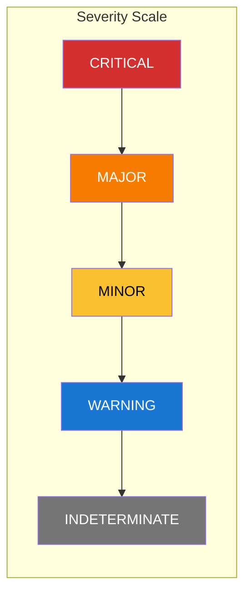
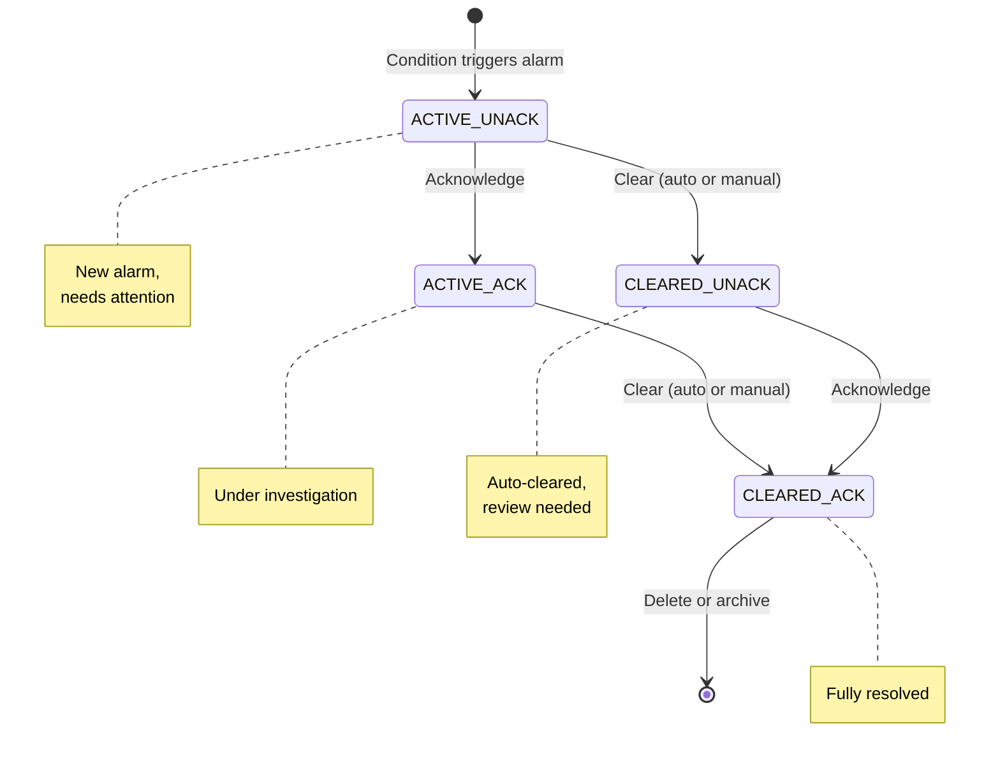
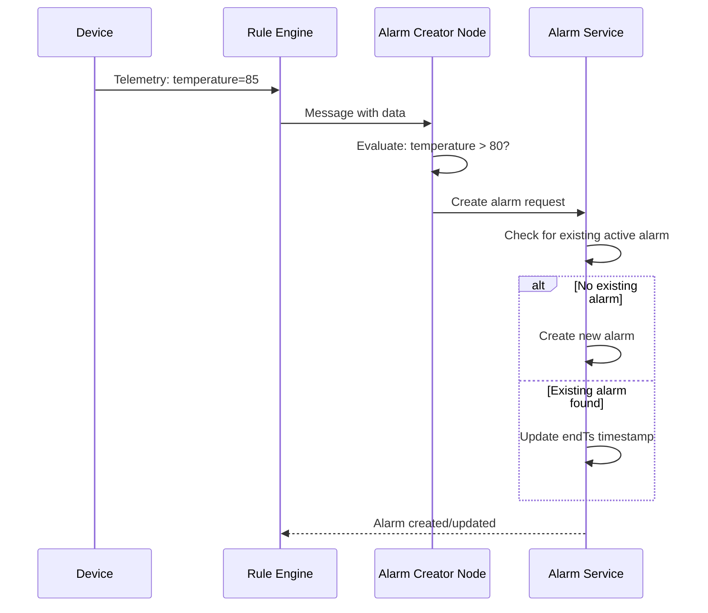
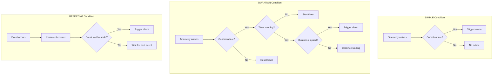
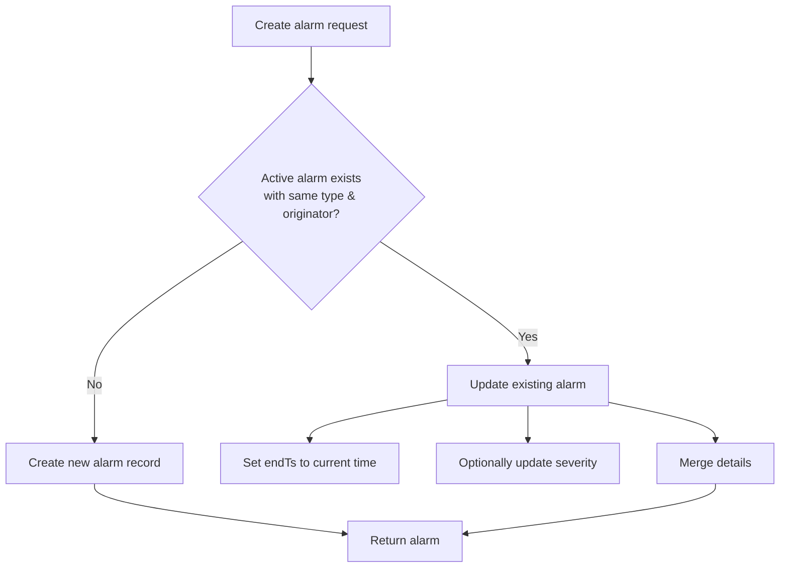
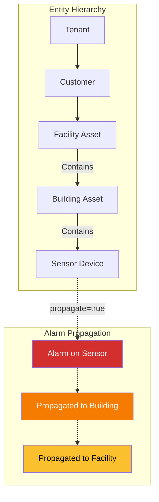
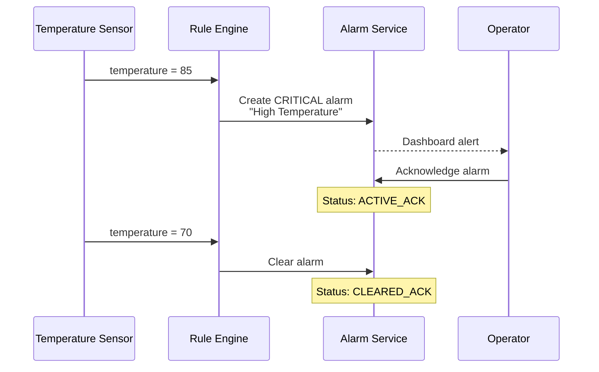
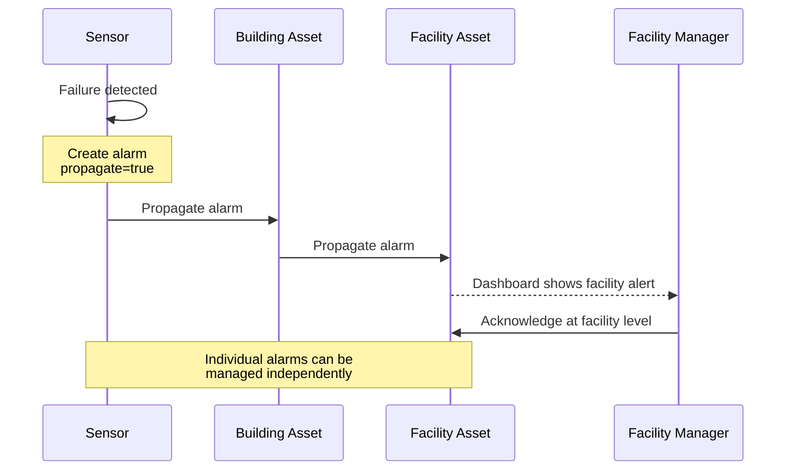
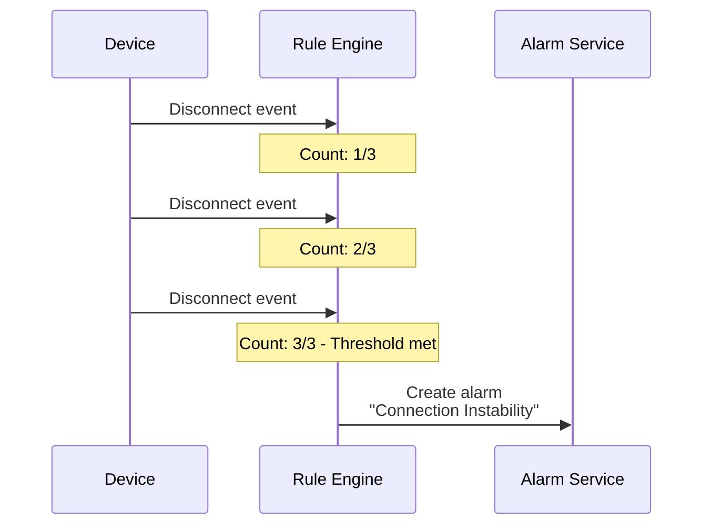

# Alarm Entity

## Overview

An Alarm represents an operational issue or noteworthy condition that requires attention. Alarms are generated when telemetry data meets specific conditions, alerting operators to device malfunctions, threshold violations, or system issues. Alarms support acknowledgement, assignment, comments, and can propagate up entity hierarchies to ensure visibility.

## Key Behaviors

1. **Deduplication**: Only one active alarm can exist per combination of originator entity and alarm type. Creating a duplicate updates the existing alarm instead.

2. **Dual-Flag Lifecycle**: Alarms track two independent states - acknowledged and cleared - producing four possible status combinations.

3. **Propagation**: Alarms can automatically cascade to parent entities in the hierarchy, ensuring managers and operators at higher levels see critical issues.

4. **Assignment**: Alarms can be assigned to specific users for accountability and workload management.

5. **Audit Trail**: The platform automatically generates system comments for key events (acknowledgement, assignment, clearing), creating a complete history.

## Data Structure

### Alarm Entity

| Field | Type | Description | Constraints |
|-------|------|-------------|-------------|
| id | UUID | Unique identifier | Auto-generated |
| tenantId | UUID | Owning tenant | Required, immutable |
| customerId | UUID | Associated customer | Optional, derived from originator |
| type | string | Alarm category name | Required (e.g., "High Temperature") |
| originator | EntityId | Entity that triggered the alarm | Required |
| severity | enum | Severity level | Required |
| status | enum | Computed lifecycle status | Read-only |
| acknowledged | boolean | Whether someone has seen this | Default: false |
| cleared | boolean | Whether the condition resolved | Default: false |
| assigneeId | UUID | User responsible for handling | Optional |
| startTs | timestamp | When condition first occurred | Auto-set |
| endTs | timestamp | Last update timestamp | Auto-set |
| ackTs | timestamp | When acknowledged | Set on acknowledgement |
| clearTs | timestamp | When cleared | Set on clear |
| assignTs | timestamp | When assigned/unassigned | Set on assignment change |
| details | object | Alarm-specific context | Free-form JSON |
| propagate | boolean | Propagate to parent entities | Default: false |
| propagateToOwner | boolean | Propagate to entity owner | Default: false |
| propagateToTenant | boolean | Propagate to tenant level | Default: false |
| propagateRelationTypes | array | Relation types for propagation | Optional filter |

### Example Alarm JSON

```json
{
  "id": {
    "entityType": "ALARM",
    "id": "93f2a1b0-5c7d-11ed-9b6a-0242ac120002"
  },
  "tenantId": {
    "entityType": "TENANT",
    "id": "13814000-1dd2-11b2-8080-808080808080"
  },
  "customerId": {
    "entityType": "CUSTOMER",
    "id": "23a14000-1dd2-11b2-8080-808080808080"
  },
  "type": "High Temperature",
  "originator": {
    "entityType": "DEVICE",
    "id": "784f3940-2f04-11ec-8f2e-4d7a8c12df56"
  },
  "severity": "CRITICAL",
  "status": "ACTIVE_UNACK",
  "acknowledged": false,
  "cleared": false,
  "startTs": 1634567890123,
  "endTs": 1634567890123,
  "details": {
    "temperature": 85.5,
    "threshold": 80.0,
    "unit": "celsius"
  },
  "propagate": true,
  "propagateToOwner": false,
  "propagateToTenant": false
}
```

## Severity Levels

Alarms use five discrete severity levels, ordered from most to least severe:

| Severity | Description | Typical Use |
|----------|-------------|-------------|
| CRITICAL | System malfunction requiring immediate action | Equipment failure, safety hazards |
| MAJOR | Significant issue affecting operations | Service degradation, data loss risk |
| MINOR | Non-critical issue with reduced functionality | Performance warnings, minor errors |
| WARNING | Potential issue that should be monitored | Approaching thresholds, unusual patterns |
| INDETERMINATE | Severity unknown or cannot be determined | External system alarms, parsing errors |



## Alarm Lifecycle

Alarms have two independent boolean flags (`acknowledged` and `cleared`) that combine to form four status values.

### Status Values

| Status | acknowledged | cleared | Meaning |
|--------|--------------|---------|---------|
| ACTIVE_UNACK | false | false | New alarm, not yet seen |
| ACTIVE_ACK | true | false | Seen but issue persists |
| CLEARED_UNACK | false | true | Issue resolved, not yet seen |
| CLEARED_ACK | true | true | Resolved and acknowledged |

### State Transitions



### Search Status Filters

For querying, the platform provides convenience filters:

| Search Status | Matches |
|---------------|---------|
| ANY | All alarms |
| ACTIVE | ACTIVE_UNACK, ACTIVE_ACK |
| CLEARED | CLEARED_UNACK, CLEARED_ACK |
| ACK | ACTIVE_ACK, CLEARED_ACK |
| UNACK | ACTIVE_UNACK, CLEARED_UNACK |

## Alarm Triggers

Alarms are generated through three mechanisms:

### Rule Chain Triggers (Primary)

Most alarms are created automatically by rule chain nodes that evaluate telemetry against conditions:



### Condition Types

Alarm rules support three condition evaluation modes:

| Type | Behavior | Example |
|------|----------|---------|
| SIMPLE | Triggers immediately when condition is true | `temperature > 80` |
| DURATION | Must be true for specified period | `temperature > 80 for 5 minutes` |
| REPEATING | Must occur N times in succession | `disconnect event 3 times` |



### Manual Creation via API

Alarms can be created programmatically through the REST API for external integrations:

```json
POST /api/alarm
{
  "type": "External System Alert",
  "originator": {
    "entityType": "DEVICE",
    "id": "784f3940-2f04-11ec-8f2e-4d7a8c12df56"
  },
  "severity": "MAJOR",
  "details": {
    "source": "Monitoring System",
    "alertId": "EXT-12345"
  }
}
```

### Deduplication Behavior

The platform enforces a **one-active-alarm-per-type-per-originator** constraint:



## Comment System

Alarms maintain an audit trail through comments.

### Comment Types

| Type | Source | Example |
|------|--------|---------|
| SYSTEM | Auto-generated by platform | "Alarm was acknowledged by Jane Doe" |
| OTHER | User-written notes | "Waiting for replacement sensor" |

### System Comment Events

The platform automatically creates comments for:
- Alarm acknowledgement
- Alarm clearing
- User assignment/reassignment
- User unassignment
- Severity changes

### Comment Structure

```json
{
  "id": {
    "id": "67c4e2f0-3d8a-11ed-b878-0242ac120002"
  },
  "alarmId": {
    "id": "93f2a1b0-5c7d-11ed-9b6a-0242ac120002"
  },
  "userId": {
    "id": "a1b2c3d4-5678-90ab-cdef-1234567890ab"
  },
  "type": "OTHER",
  "comment": {
    "text": "Scheduled maintenance for tomorrow morning"
  },
  "createdTime": 1634567890123
}
```

## Propagation

Alarms can cascade to parent entities for visibility at higher organizational levels.

### Propagation Configuration

| Flag | Behavior |
|------|----------|
| propagate | Follow entity relations to parent entities |
| propagateToOwner | Reach the entity's owner (tenant or customer) |
| propagateToTenant | Reach the tenant level regardless of path |
| propagateRelationTypes | Limit which relation types trigger propagation |

### Propagation Flow



### Propagation Rules

- Each propagated alarm is a separate record
- All propagated alarms share the same originator
- Propagated alarms can be acknowledged/cleared independently
- Clearing the original may or may not clear propagated alarms (configuration dependent)

## Operations

### Acknowledge

Marks an alarm as seen by an operator:

```
POST /api/alarm/{alarmId}/ack
```

- Sets `acknowledged = true`
- Records `ackTs` timestamp
- Generates system comment: "Alarm was acknowledged by [user]"
- Triggers `ALARM_ACK` rule chain event

### Clear

Marks an alarm condition as resolved:

```
POST /api/alarm/{alarmId}/clear
```

- Sets `cleared = true`
- Records `clearTs` timestamp
- Generates system comment: "Alarm was cleared by [user]"
- Triggers `ALARM_CLEAR` rule chain event
- Allows new alarm with same type/originator to be created

### Assign

Assigns responsibility to a specific user:

```
POST /api/alarm/{alarmId}/assign/{assigneeId}
```

- Sets `assigneeId` to specified user
- Records `assignTs` timestamp
- Generates system comment: "Alarm was assigned by [admin] to [user]"
- Triggers `ALARM_ASSIGNED` or `ALARM_REASSIGNED` event

### Unassign

Removes the current assignment:

```
DELETE /api/alarm/{alarmId}/assign
```

- Clears `assigneeId`
- Records `assignTs` timestamp
- Generates system comment about unassignment
- Triggers `ALARM_UNASSIGNED` event

## REST API Endpoints

### Retrieval

| Endpoint | Description |
|----------|-------------|
| `GET /api/alarm/{alarmId}` | Get alarm by ID |
| `GET /api/alarm/info/{alarmId}` | Get alarm with extended info |
| `GET /api/alarm/{entityType}/{entityId}` | Get alarms for an entity |
| `GET /api/alarms` | Get all alarms for tenant/customer |
| `GET /api/v2/alarm/{entityType}/{entityId}` | Advanced filtering (v2) |
| `GET /api/v2/alarms` | Advanced filtering for all alarms (v2) |

### Query Parameters

| Parameter | Description |
|-----------|-------------|
| status | Filter by status (ACTIVE_UNACK, etc.) |
| searchStatus | Convenience filter (ACTIVE, CLEARED, ACK, UNACK) |
| severity | Filter by severity level |
| type | Filter by alarm type |
| assigneeId | Filter by assigned user |
| textSearch | Search across type, severity, status |
| startTime, endTime | Time range filter |
| sortProperty | Sort field (createdTime, severity, etc.) |
| sortOrder | ASC or DESC |
| pageSize, page | Pagination |

### Modification

| Endpoint | Method | Description |
|----------|--------|-------------|
| `/api/alarm` | POST | Create or update alarm |
| `/api/alarm/{alarmId}/ack` | POST | Acknowledge alarm |
| `/api/alarm/{alarmId}/clear` | POST | Clear alarm |
| `/api/alarm/{alarmId}/assign/{assigneeId}` | POST | Assign to user |
| `/api/alarm/{alarmId}/assign` | DELETE | Unassign |
| `/api/alarm/{alarmId}` | DELETE | Delete alarm record |

### Utilities

| Endpoint | Description |
|----------|-------------|
| `GET /api/alarm/types` | List all alarm types in tenant |
| `GET /api/alarm/highestSeverity/{entityType}/{entityId}` | Get most severe alarm for entity |

## Extended Alarm Information

The `AlarmInfo` structure provides enhanced alarm details for UI display:

| Field | Description |
|-------|-------------|
| originatorName | Name of the originating entity |
| originatorLabel | Label of the originating entity |
| originatorDisplayName | Best display name (prefers display name, then label, then name) |
| assignee | Details about assigned user (name, email) |

## Common Patterns

### Temperature Monitoring



### Cascading Equipment Failure



### Intermittent Connection Issues



## Edge Cases

### Duplicate Alarm Handling

When creating an alarm that matches an existing active alarm:
- No new alarm record is created
- Existing alarm's `endTs` is updated to current time
- Severity can be upgraded (but not downgraded by default)
- Details are merged or replaced (depending on configuration)

### Alarm After Clear

Once an alarm is cleared:
- A new alarm with the same type and originator can be created
- The cleared alarm remains in history for audit purposes
- Both alarms are visible in queries without time filters

### Assignment of Deleted Users

If an assigned user is deleted:
- System automatically generates unassignment comment
- `assigneeId` is cleared
- Historical assignment information preserved in comments

### Propagation Depth

- Propagation follows relation chains until no more parent entities exist
- Each propagated alarm is independent
- Clearing propagated alarms does not affect the original (by default)

## Access Control

| User Type | Can View | Can Modify |
|-----------|----------|------------|
| Tenant Admin | All tenant alarms | All tenant alarms |
| Customer User | Customer's alarms only | Customer's alarms only |
| System Admin | All alarms across tenants | All alarms |

## Implementation Details

### Alarm Service Architecture

**BaseAlarmService** handles core alarm operations:
- Deduplication via composite key: `{originatorId, alarmType}`
- Severity upgrade logic (can upgrade but not downgrade by default)
- Alarm count aggregation per entity and severity level

### Alarm Lifecycle State Machine

Internal status transitions follow strict rules:
```
ACTIVE_UNACK (0b00) → acknowledge → ACTIVE_ACK (0b01)
ACTIVE_UNACK (0b00) → clear → CLEARED_UNACK (0b10)
ACTIVE_ACK (0b01) → clear → CLEARED_ACK (0b11)
CLEARED_UNACK (0b10) → acknowledge → CLEARED_ACK (0b11)
```

Status stored as two boolean columns: `acknowledged`, `cleared`.

### Alarm Propagation Implementation

`AlarmPropagationService` handles hierarchy traversal:
- Queries relations with `direction=TO` to find parent entities
- Respects `propagateRelationTypes` filter (defaults to all types)
- Creates separate `AlarmInfo` record for each propagation target
- Propagation depth limited by relation query `maxLevel`

### WebSocket Alarm Subscriptions

`TbAlarmDataSubCtx` manages real-time alarm updates:
- Clients subscribe via entity filter (device, asset, or alarm query)
- Server pushes `ALARM_DATA_UPDATE` on alarm create/update/delete
- Subscription includes severity and status filters
- Supports pagination for initial alarm list load

### Alarm Count Caching

Per-entity alarm counts cached for dashboard widgets:
- Cache key: `{entityId, alarmStatus, alarmSeverity}`
- Invalidated on alarm create, update, acknowledge, clear, delete
- Used by `getHighestAlarmSeverity` API endpoint

### Comment System Implementation

`AlarmCommentService` manages audit trail:
- System comments auto-generated with `type=SYSTEM`
- User comments stored with `type=OTHER`
- Comments linked to alarm via `alarmId` foreign key
- Paginated retrieval: `GET /api/alarm/{alarmId}/comment`

### Configuration Properties

```yaml
sql.ttl.alarms:
  enabled: true
  checking_interval: 7200000  # 2 hours
  removal_batch_size: 3000

alarm:
  max_type_length: 255
  max_details_length: 50000
```

## See Also

- [Device Entity](./device.md) - Primary alarm originators
- [Asset Entity](./asset.md) - Asset alarms and propagation targets
- [Entity Relations](./relations.md) - Propagation paths
- [Rule Engine](../../04-rule-engine/README.md) - Alarm creation nodes
- [Telemetry](../data-model/telemetry.md) - Data that triggers alarms
