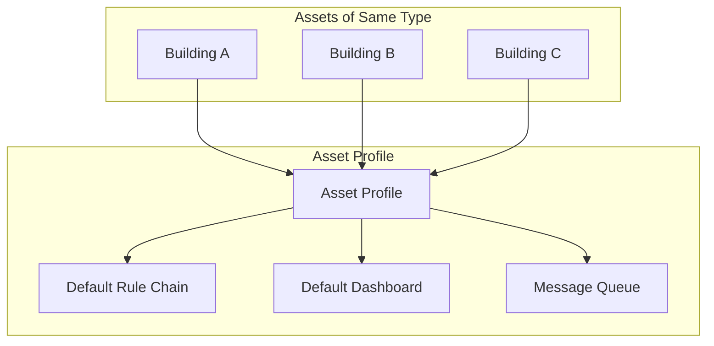
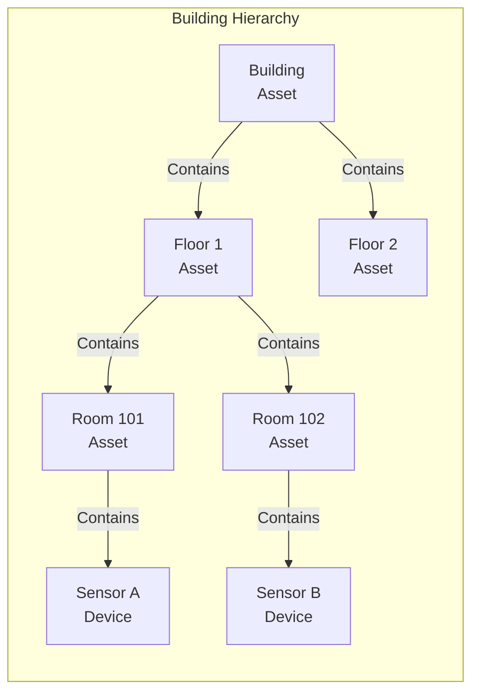
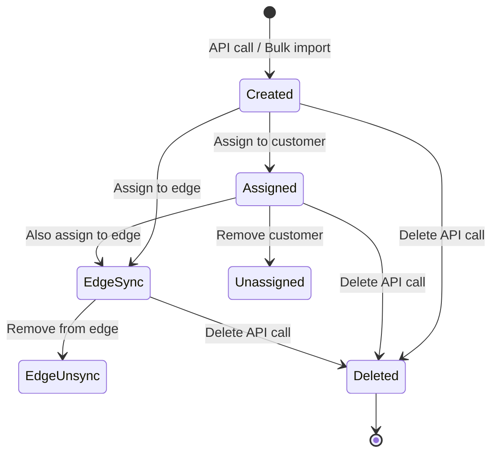
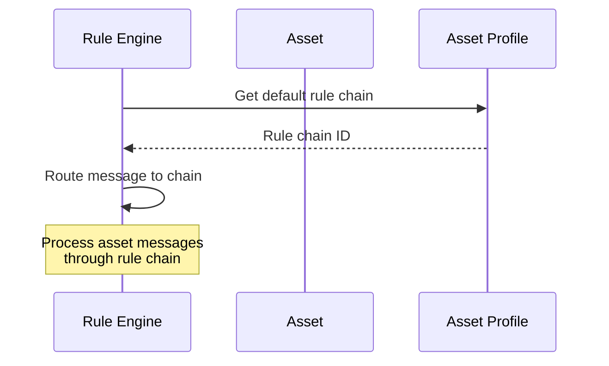
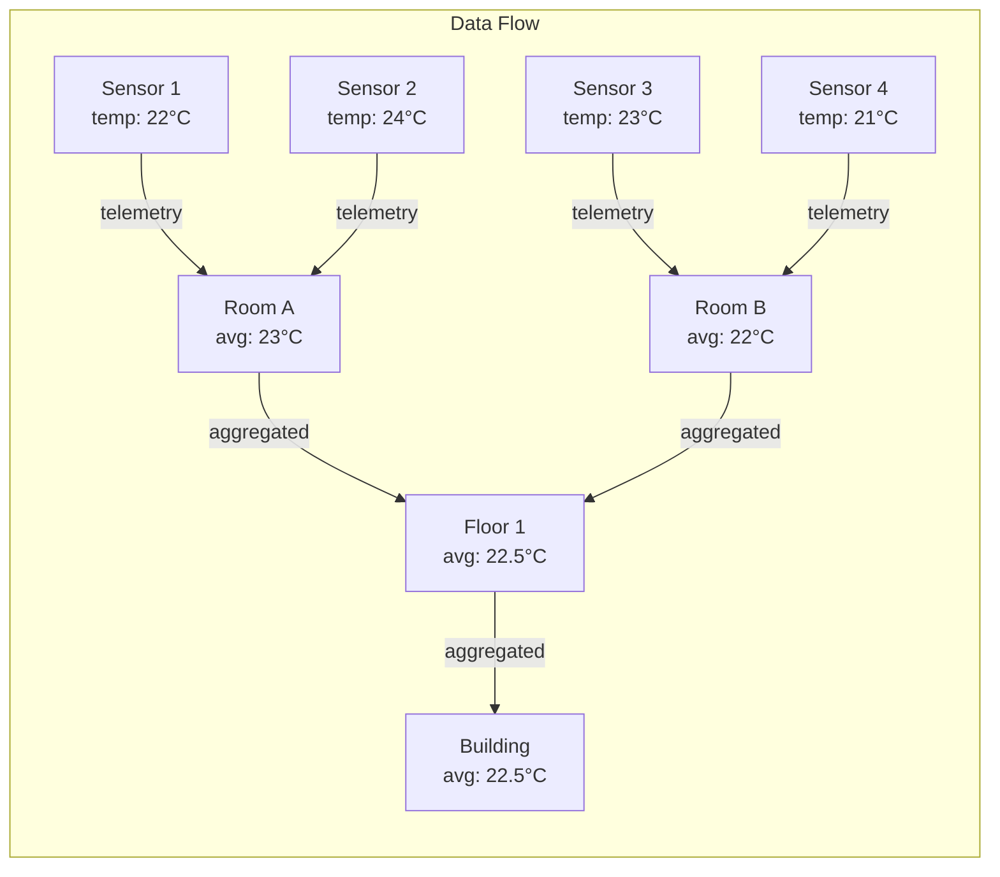

# Asset Entity

## Overview

An Asset is a logical entity that represents physical or virtual objects in your IoT environment that don't directly connect to the platform. Unlike devices, assets don't send telemetry or receive commands directly. Instead, they serve as organizational units for grouping devices, building hierarchies, and aggregating data.

Common asset examples include:
- **Physical locations**: Buildings, floors, rooms, zones
- **Equipment**: Machines, vehicles, production lines
- **Business units**: Departments, regions, facilities
- **Abstract concepts**: Projects, batches, shipments

## Key Behaviors

1. **Tenant Scoping**: Every asset belongs to exactly one tenant. Asset names must be unique within a tenant.

2. **Customer Assignment**: Assets can optionally be assigned to a customer for delegated access control.

3. **Profile-Driven Configuration**: Each asset references an Asset Profile that defines its default rule chain and queue routing.

4. **Relationship-Based Hierarchy**: Assets connect to other entities (devices, assets, customers) through relations, enabling flexible hierarchies.

5. **No Direct Connectivity**: Assets don't have credentials or transport configurations. They receive data through relations with devices or rule engine processing.

6. **Edge Synchronization**: Assets can be assigned to edge instances for local processing.

## Data Structure

### Asset Entity

| Field | Type | Description | Constraints |
|-------|------|-------------|-------------|
| id | UUID | Unique identifier | Auto-generated |
| tenantId | UUID | Owning tenant | Required, immutable after creation |
| customerId | UUID | Assigned customer | Optional |
| name | string | Asset name | Required, unique per tenant, max 255 chars |
| type | string | Asset type (e.g., "Building") | Maps to asset profile |
| label | string | Human-readable label | Optional, used in UI widgets |
| assetProfileId | UUID | Reference to profile | Required |
| externalId | UUID | Third-party system identifier | Optional |
| additionalInfo | object | Custom metadata | Free-form JSON |
| createdTime | timestamp | Creation time | Auto-set |
| version | integer | Optimistic locking | Auto-incremented on update |

### Example Asset JSON

```json
{
  "id": {
    "entityType": "ASSET",
    "id": "784f3940-2f04-11ec-8f2e-4d7a8c12df56"
  },
  "tenantId": {
    "entityType": "TENANT",
    "id": "13814000-1dd2-11b2-8080-808080808080"
  },
  "customerId": {
    "entityType": "CUSTOMER",
    "id": "23a14000-1dd2-11b2-8080-808080808080"
  },
  "name": "Building A",
  "type": "Building",
  "label": "Main Headquarters",
  "assetProfileId": {
    "entityType": "ASSET_PROFILE",
    "id": "5f8c3940-2f04-11ec-8f2e-4d7a8c12df56"
  },
  "additionalInfo": {
    "description": "Corporate headquarters building",
    "address": "123 Main Street"
  },
  "createdTime": 1634567890123
}
```

## Asset Profile

Asset profiles define behavior templates for assets of the same type.

### Profile Structure

| Field | Type | Description |
|-------|------|-------------|
| id | UUID | Unique identifier |
| tenantId | UUID | Owning tenant |
| name | string | Profile name (e.g., "Building") |
| description | string | Human-readable description |
| image | string | Icon as URL or Base64 data |
| isDefault | boolean | Used when profile not specified |
| defaultRuleChainId | UUID | Rule chain for processing asset messages |
| defaultDashboardId | UUID | Mobile app default dashboard |
| defaultQueueName | string | Message queue name (default: "Main") |
| defaultEdgeRuleChainId | UUID | Edge-specific rule chain |

### Profile Purpose

Asset profiles serve several key functions:



- **Groups assets by type**: All assets of the same type share configuration
- **Defines message processing**: Specifies which rule chain handles asset-related messages
- **Sets display defaults**: Dashboard and icon configuration for UI
- **Configures queue routing**: Determines message queue for edge vs cloud processing

### Profile Assignment

When creating an asset:
1. If `type` is provided, the system looks up or creates a matching profile
2. The `assetProfileId` is automatically set from the profile
3. The asset inherits the profile's default rule chain and queue settings

## Asset vs Device

Understanding when to use assets vs devices:

| Aspect | Asset | Device |
|--------|-------|--------|
| **Connectivity** | No direct connection | Connects via MQTT, HTTP, etc. |
| **Credentials** | None | Access token, certificate, etc. |
| **Telemetry** | Receives via relations/aggregation | Sends directly |
| **Commands (RPC)** | Not directly addressable | Can receive commands |
| **Purpose** | Organization, grouping, hierarchy | Data collection, control |
| **Examples** | Buildings, zones, equipment groups | Sensors, actuators, gateways |

## Entity Relations

Assets connect to other entities through relations, enabling flexible hierarchies.

### Relation Structure



### Relation Types

| Type | Description | Example |
|------|-------------|---------|
| Contains | Parent-child hierarchy | Building Contains Floor |
| Manages | Management relationship | Manager Manages Equipment |
| Uses | Usage relationship | Production Line Uses Machine |

### Relation Structure

```json
{
  "from": {
    "entityType": "ASSET",
    "id": "building-uuid"
  },
  "to": {
    "entityType": "ASSET",
    "id": "floor-uuid"
  },
  "type": "Contains",
  "typeGroup": "COMMON",
  "additionalInfo": {
    "description": "Physical containment"
  }
}
```

### Querying Related Entities

The Asset Search Query finds assets connected through relations:

```json
{
  "parameters": {
    "entityId": {
      "entityType": "ASSET",
      "id": "building-uuid"
    },
    "maxLevels": 10
  },
  "relationType": "Contains",
  "assetTypes": ["Floor", "Room"]
}
```

This query traverses the relation graph from the starting entity, following specified relation types and filtering by asset types.

## Asset Lifecycle



### Lifecycle Events

| Event | Trigger | Result |
|-------|---------|--------|
| Created | POST `/api/asset` | Asset persisted, audit logged |
| Updated | POST `/api/asset` with ID | Fields updated, version incremented |
| Assigned | POST `/api/customer/{id}/asset/{id}` | Customer can access asset |
| Unassigned | DELETE `/api/customer/asset/{id}` | Customer loses access |
| Edge Assigned | POST `/api/edge/{id}/asset/{id}` | Asset synced to edge |
| Edge Unassigned | DELETE `/api/edge/{id}/asset/{id}` | Asset removed from edge |
| Deleted | DELETE `/api/asset/{id}` | Asset and relations removed |

## REST API Endpoints

### Core CRUD Operations

| Endpoint | Method | Auth | Purpose |
|----------|--------|------|---------|
| `/api/asset/{assetId}` | GET | Tenant/Customer | Get asset by ID |
| `/api/asset/info/{assetId}` | GET | Tenant/Customer | Get asset with enriched info |
| `/api/asset` | POST | Tenant/Customer | Create or update asset |
| `/api/asset/{assetId}` | DELETE | Tenant Admin | Delete asset |

### Search and List

| Endpoint | Method | Query Params |
|----------|--------|--------------|
| `/api/tenant/assets` | GET | pageSize, page, type, textSearch, sortProperty, sortOrder |
| `/api/tenant/assetInfos` | GET | + assetProfileId filter |
| `/api/tenant/assets?assetName={name}` | GET | Lookup by exact name |
| `/api/customer/{customerId}/assets` | GET | Customer's assigned assets |
| `/api/assets?assetIds={ids}` | GET | Batch retrieve by IDs |

### Customer Assignment

| Endpoint | Method | Purpose |
|----------|--------|---------|
| `/api/customer/{customerId}/asset/{assetId}` | POST | Assign to customer |
| `/api/customer/asset/{assetId}` | DELETE | Unassign from customer |
| `/api/customer/public/asset/{assetId}` | POST | Make publicly accessible |

### Edge Integration

| Endpoint | Method | Purpose |
|----------|--------|---------|
| `/api/edge/{edgeId}/asset/{assetId}` | POST | Assign to edge |
| `/api/edge/{edgeId}/asset/{assetId}` | DELETE | Unassign from edge |
| `/api/edge/{edgeId}/assets` | GET | List edge assets |

### Relation-Based Search

| Endpoint | Method | Purpose |
|----------|--------|---------|
| `/api/assets` | POST | Find related assets via relation query |

## Bulk Import

Assets can be provisioned in bulk via CSV import.

### Import Request

```
POST /api/asset/bulk_import
Content-Type: multipart/form-data
```

### CSV Format

```csv
name,type,label,description
Building A,Building,Main Office,Corporate headquarters
Building B,Building,Warehouse,Distribution center
Floor 1,Floor,Ground Floor,Reception and lobby
```

### Supported Columns

| Column | Description | Required |
|--------|-------------|----------|
| name | Asset name | Yes |
| type | Asset type (maps to profile) | No |
| label | Display label | No |
| description | Stored in additionalInfo | No |

### Import Behavior

1. For each row, system validates and creates/updates asset
2. If type provided, looks up or creates matching profile
3. If type missing, uses tenant's default asset profile
4. Returns import summary with success/error counts

## Name Conflict Handling

When creating assets with duplicate names:

| Strategy | Behavior |
|----------|----------|
| FAIL | Returns error (default) |
| CREATE_NEW_ENTITY | Appends unique suffix (e.g., "MyAsset_a1b2c3") |
| REPLACE | Updates existing asset with same name |

## Interactions

### With Rule Engine



- Asset messages routed through profile's rule chain
- Rule nodes can query asset attributes
- Assets can be originators for alarms

### With Dashboards

- Assets visualized in dashboard widgets
- Widgets subscribe to asset attributes via WebSocket
- Asset profile specifies default mobile dashboard
- Asset relations enable hierarchical visualizations

### With Alarms

- Assets can be alarm originators
- Alarms propagate through relation hierarchy
- Rule chains can create alarms on asset state changes

### With Calculated Fields

- Calculated fields can aggregate data from related devices
- Assets serve as aggregation points in hierarchies
- Example: Building asset aggregates temperature from all room sensors

## Data Aggregation Pattern

Assets enable hierarchical data aggregation:



Rule chains or calculated fields can:
1. Listen for device telemetry
2. Find related asset via relation query
3. Calculate aggregates (avg, sum, min, max)
4. Store as asset attributes

## Edge Cases

### Asset Name Conflicts
- Names must be unique per tenant
- API returns error if name already exists
- Use `NameConflictStrategy` for automated handling

### Profile Changes
- Changing asset profile updates rule chain routing
- Does not affect existing attributes or relations
- New messages use new profile's configuration

### Customer Unassignment
- Unassigning from customer removes customer's access
- Does not delete asset or its data
- Asset remains accessible to tenant admins

### Relation Deletion
- Deleting an asset removes all its relations
- Does not cascade-delete related entities
- Child entities remain but become orphaned

### Concurrent Updates
- Version field enables optimistic locking
- Concurrent updates fail with conflict error
- Client should retry with fresh data

## Caching

Assets are cached for performance:

- **Cache Keys**: By asset ID and by tenant+name
- **Dual Layer**: Local (Caffeine) + distributed (Redis)
- **Invalidation**: Event-driven on create/update/delete
- **Benefits**: Fast lookups, reduced database load

## See Also

- [Device Entity](./device.md) - Connected entities that send telemetry
- [Entity Types Overview](./entity-types-overview.md) - All entity types
- [Relations](./relations.md) - Entity relationship system
- [Rule Engine](../../04-rule-engine/README.md) - Message processing
- [Multi-Tenancy](../../01-architecture/multi-tenancy.md) - Tenant isolation
