# Customer Entity

## Overview

A Customer represents a sub-organization within a tenant. Customers enable tenants to delegate access to devices, assets, and dashboards to end users without giving them full tenant-level permissions. This creates a three-tier hierarchy: Tenant > Customer > User.

Common customer use cases:
- **End customers**: Companies that purchase IoT services from the tenant
- **Departments**: Internal divisions within an organization
- **Locations**: Branches, facilities, or regional offices
- **Projects**: Time-limited initiatives with specific resource access

## Key Behaviors

1. **Tenant Scoping**: Every customer belongs to exactly one tenant. Customer titles must be unique within a tenant.

2. **Resource Assignment**: Devices, assets, and dashboards can be assigned to customers, limiting visibility to customer users.

3. **User Management**: Customers can have multiple users (CUSTOMER_USER role) who can only access resources assigned to their customer.

4. **Public Customer**: A special auto-generated customer per tenant enables unauthenticated access to public dashboards.

5. **Cascade Cleanup**: Deleting a customer unassigns all resources and deletes all customer users.

## Data Structure

### Customer Entity

| Field | Type | Description | Constraints |
|-------|------|-------------|-------------|
| id | UUID | Unique identifier | Auto-generated |
| tenantId | UUID | Owning tenant | Required, immutable |
| title | string | Customer name | Required, unique per tenant, max 255 chars |
| country | string | Country | Optional |
| state | string | State/Province | Optional |
| city | string | City | Optional |
| address | string | Street address | Optional |
| address2 | string | Additional address | Optional |
| zip | string | Postal code | Optional |
| phone | string | Phone number | Optional |
| email | string | Contact email | Required for regular customers |
| externalId | UUID | Third-party system ID | Optional, globally unique |
| additionalInfo | object | Custom metadata | Free-form JSON |
| createdTime | timestamp | Creation time | Auto-set |
| version | integer | Optimistic locking | Auto-incremented on update |

### Example Customer JSON

```json
{
  "id": {
    "entityType": "CUSTOMER",
    "id": "23a14000-1dd2-11b2-8080-808080808080"
  },
  "tenantId": {
    "entityType": "TENANT",
    "id": "13814000-1dd2-11b2-8080-808080808080"
  },
  "title": "Acme Industries",
  "country": "USA",
  "state": "California",
  "city": "San Francisco",
  "address": "456 Oak Street",
  "zip": "94102",
  "phone": "+1-555-987-6543",
  "email": "contact@acme-industries.com",
  "additionalInfo": {
    "description": "Premium customer since 2022",
    "contractId": "C-2022-001"
  },
  "createdTime": 1634567890123
}
```

## Entity Hierarchy


## Resource Assignment

Customers access resources through assignment. Devices, assets, and dashboards can be assigned to one customer at a time.

### Assignment Model


### Assignment Patterns

| Resource | Assign Endpoint | Unassign Endpoint |
|----------|-----------------|-------------------|
| Device | `POST /customer/{id}/device/{id}` | `DELETE /customer/device/{id}` |
| Asset | `POST /customer/{id}/asset/{id}` | `DELETE /customer/asset/{id}` |
| Dashboard | `POST /customer/{id}/dashboard/{id}` | `DELETE /customer/dashboard/{id}` |
| Edge | `POST /customer/{id}/edge/{id}` | `DELETE /customer/edge/{id}` |

### Ownership Model

Resources have an owner - either the tenant directly or an assigned customer:


- **Unassigned**: `customerId = null`, owner is tenant
- **Assigned**: `customerId = customer`, owner is customer
- **Visibility**: Customer users can only see resources owned by their customer

## Customer Users

Users with the CUSTOMER_USER authority belong to a specific customer and can only access that customer's resources.

### User Types


### User-Customer Relationship

| User Type | customerId | Access Scope |
|-----------|------------|--------------|
| TENANT_ADMIN | null | All tenant resources |
| CUSTOMER_USER | customer UUID | Only assigned customer's resources |

### Managing Customer Users

| Endpoint | Method | Purpose |
|----------|--------|---------|
| `/api/user` | POST | Create user (set customerId for customer user) |
| `/api/customer/{customerId}/users` | GET | List customer's users |
| `/api/customer/{customerId}/user/{email}/activate` | POST | Send activation email |

## Public Customer

Each tenant has a special "Public" customer for enabling unauthenticated dashboard access.

### Public Customer Characteristics

| Aspect | Regular Customer | Public Customer |
|--------|------------------|-----------------|
| Title | User-defined | "Public" (fixed) |
| Creation | Manual | Auto-created on first use |
| Deletion | Allowed | Protected |
| isPublic Flag | false | true |
| Dashboard Access | Authenticated users | Anyone with link |
| Email Required | Yes | No |

### Public Dashboard Flow


### Public Customer Usage

```json
{
  "id": {
    "entityType": "CUSTOMER",
    "id": "public-customer-uuid"
  },
  "title": "Public",
  "additionalInfo": {
    "isPublic": true
  }
}
```

Dashboards assigned to the Public customer can be embedded in websites without authentication.

## Customer Lifecycle


### Creation

1. Tenant admin sends POST `/api/customer` with customer data
2. System validates uniqueness of title within tenant
3. Customer ID generated
4. Event published for audit trail

### Deletion Cascade

When a customer is deleted:


Devices and assets are **unassigned** (customerId set to null), not deleted. They become tenant-level resources again.

## REST API Endpoints

### Customer CRUD

| Endpoint | Method | Auth | Purpose |
|----------|--------|------|---------|
| `/api/customer/{customerId}` | GET | TENANT_ADMIN, CUSTOMER_USER | Get customer by ID |
| `/api/customer/{customerId}/shortInfo` | GET | TENANT_ADMIN, CUSTOMER_USER | Get title and isPublic only |
| `/api/customer/{customerId}/title` | GET | TENANT_ADMIN, CUSTOMER_USER | Get title as plain text |
| `/api/customer` | POST | TENANT_ADMIN | Create or update customer |
| `/api/customer/{customerId}` | DELETE | TENANT_ADMIN | Delete customer |
| `/api/customers` | GET | TENANT_ADMIN | List tenant's customers (paginated) |
| `/api/customers?customerIds={ids}` | GET | TENANT_ADMIN | Batch retrieve by IDs |
| `/api/tenant/customers?customerTitle={title}` | GET | TENANT_ADMIN | Find by exact title |

### Query Parameters

| Parameter | Description |
|-----------|-------------|
| pageSize | Items per page (default 10) |
| page | Page number (0-indexed) |
| textSearch | Filter by title |
| sortProperty | Sort field (createdTime, title, email, etc.) |
| sortOrder | ASC or DESC |

### Name Conflict Handling

When creating customers with duplicate titles:

| Parameter | Values | Description |
|-----------|--------|-------------|
| nameConflictPolicy | FAIL, UNIQUIFY | How to handle duplicate titles |
| uniquifySeparator | string | Suffix separator (default "_") |
| uniquifyStrategy | RANDOM, SEQUENTIAL | Suffix generation method |

Example: "Acme" with UNIQUIFY becomes "Acme_1" or "Acme_abc123"

## Access Control

### Permission Matrix

| Operation | SYS_ADMIN | TENANT_ADMIN | CUSTOMER_USER |
|-----------|-----------|--------------|---------------|
| Create Customer | - | Yes | No |
| View Customer | - | Yes | Own only |
| Update Customer | - | Yes | No |
| Delete Customer | - | Yes | No |
| Assign Resources | - | Yes | No |
| View Assigned Resources | - | Yes | Own only |

### Security Checks

All customer endpoints validate:
1. **Tenant Match**: Customer belongs to user's tenant
2. **Customer Match**: For CUSTOMER_USER, customer matches user's customer
3. **Resource Ownership**: Resources belong to same tenant

## Data Validation

### Required Fields

| Field | Required | Validation |
|-------|----------|------------|
| title | Yes | Non-empty, max 255 chars, XSS-protected |
| email | Yes (regular), No (public) | Valid email format |
| tenantId | Yes | Must exist, immutable |

### Uniqueness Constraints

| Constraint | Scope | Description |
|------------|-------|-------------|
| title | Per tenant | No two customers with same title in tenant |
| externalId | Global | No two customers with same external ID |

## Caching

Customers are cached for performance:

- **Cache Key**: (tenantId, title) pair
- **Eviction**: On create, update, delete
- **Benefit**: Fast title-based lookups

## Common Patterns

### Pattern 1: Create Customer with Devices


### Pattern 2: Enable Public Dashboard


### Pattern 3: Migrate Devices Between Customers

```mermaid
sequenceDiagram
    participant TA as Tenant Admin
    participant API as REST API

    TA->>API: DELETE /customer/device/{deviceId}
    API-->>TA: Unassigned from Customer A

    TA->>API: POST /customer/{customerBId}/device/{deviceId}
    API-->>TA: Assigned to Customer B

    Note over API: Device moved<br/>Customer A → Customer B
```



## Integration with Other Entities

### Dashboards

- Dashboards shared with customers appear in customer user's dashboard list
- A dashboard can be assigned to multiple customers
- Public customer dashboards accessible without authentication

### Alarms

- Alarms on customer-assigned devices visible to customer users
- Alarm propagation respects customer boundaries

### Rule Chains

- Rule chains are tenant-level (not customer-specific)
- Rule nodes can filter by customer for conditional processing

### Entity Views

- Entity views can be assigned to customers
- Provide limited attribute/telemetry access

## See Also

- [Tenant Entity](./tenant.md) - Parent organization
- [Device Entity](./device.md) - Assignable IoT devices
- [Asset Entity](./asset.md) - Assignable logical entities
- [Entity Types Overview](./entity-types-overview.md) - All entity types
- [Authentication](../../06-api-layer/authentication.md) - User authentication
