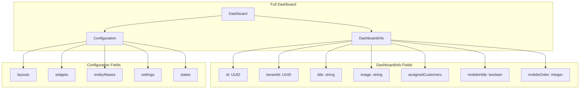
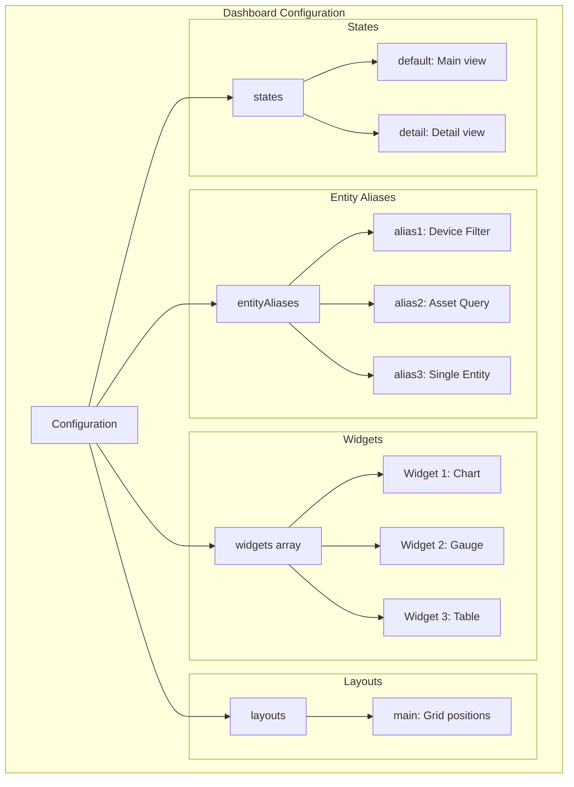
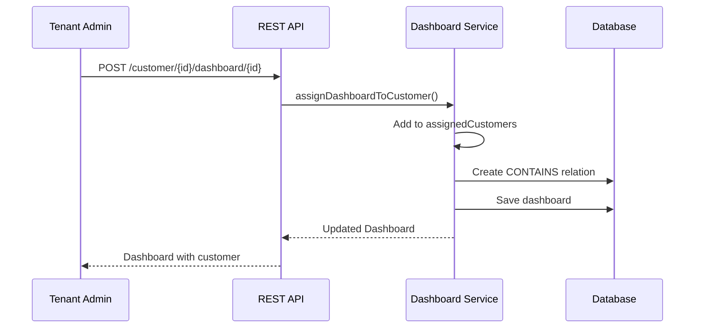
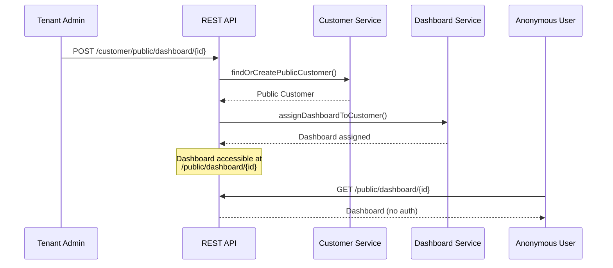
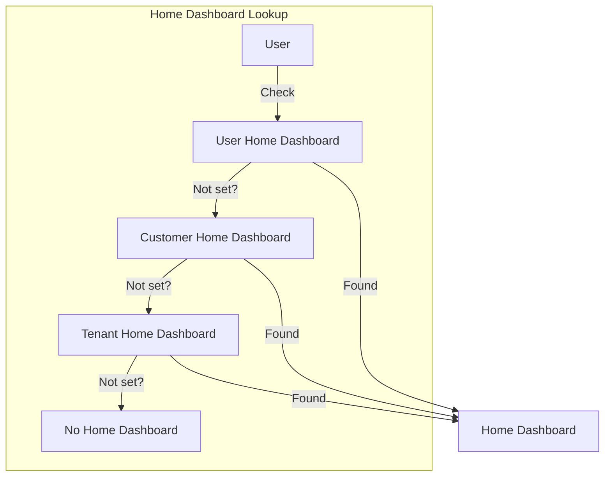
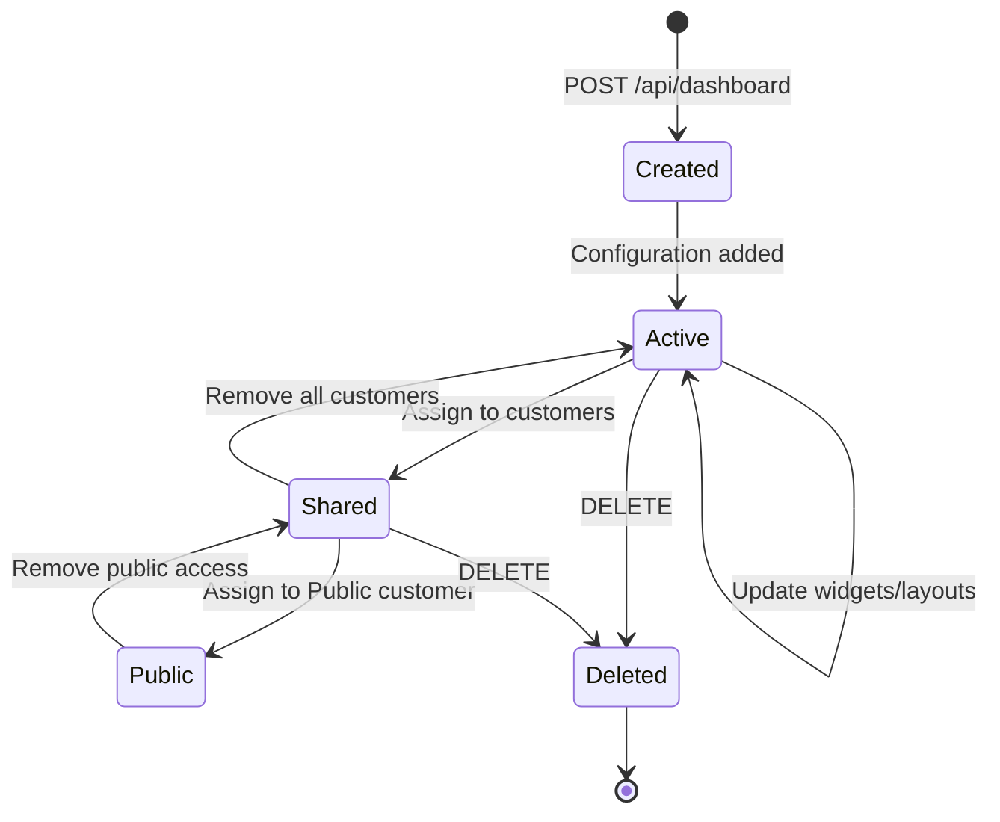
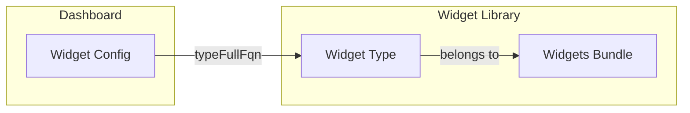

# Dashboard Entity

## Overview

A Dashboard is a configurable visualization interface that displays data from devices, assets, and other entities. Dashboards contain widgets arranged in layouts, use entity aliases to bind data sources, and can be shared with customers or made public for unauthenticated access.

Key capabilities:
- **Real-time Visualization**: Display telemetry and attributes with automatic updates
- **Interactive Controls**: Send commands to devices, update attributes
- **Flexible Layouts**: Responsive grid-based widget positioning
- **Multi-state Navigation**: Switch between different dashboard views
- **Customer Sharing**: Assign dashboards to one or more customers
- **Public Access**: Enable unauthenticated access for embedded dashboards

## Data Structure

### Dashboard Entity Hierarchy

ThingsBoard uses a two-tier structure for performance optimization:



### DashboardInfo (Lightweight Summary)

| Field | Type | Description | Constraints |
|-------|------|-------------|-------------|
| id | UUID | Unique identifier | Auto-generated |
| tenantId | UUID | Owning tenant | Required, immutable |
| title | string | Dashboard title | Required, max 255 chars |
| image | string | Thumbnail for mobile view | Optional, URL or Base64 |
| assignedCustomers | Set | Customers with access | Auto-managed |
| mobileHide | boolean | Hide from mobile devices | Default false |
| mobileOrder | integer | Sort order on mobile | Lower = higher priority |
| version | integer | Optimistic locking | Auto-incremented |
| createdTime | timestamp | Creation time | Auto-set |

### Dashboard (Full Entity)

Extends DashboardInfo with:

| Field | Type | Description |
|-------|------|-------------|
| configuration | object | Widgets, layouts, aliases, states |
| externalId | UUID | Third-party system reference |
| resources | array | Exported resources (images) |

### Example Dashboard JSON

```json
{
  "id": {
    "entityType": "DASHBOARD",
    "id": "784f3940-2f04-11ec-8f2e-4d7a8c12df56"
  },
  "tenantId": {
    "entityType": "TENANT",
    "id": "13814000-1dd2-11b2-8080-808080808080"
  },
  "title": "Building Monitoring",
  "image": "data:image/png;base64,...",
  "mobileHide": false,
  "mobileOrder": 1,
  "assignedCustomers": [
    {
      "customerId": {
        "entityType": "CUSTOMER",
        "id": "23a14000-1dd2-11b2-8080-808080808080"
      },
      "title": "Acme Industries",
      "isPublic": false
    }
  ],
  "configuration": {
    "widgets": [...],
    "entityAliases": {...},
    "layouts": {...},
    "states": {...},
    "settings": {...}
  },
  "createdTime": 1634567890123
}
```

## Configuration Structure

The `configuration` field contains all dashboard visualization settings.



### Entity Aliases

Entity aliases define data sources for widgets without hardcoding entity IDs.

```json
{
  "entityAliases": {
    "temperatureSensors": {
      "id": "alias-uuid-1",
      "alias": "temperatureSensors",
      "filter": {
        "type": "entityList",
        "entityType": "DEVICE",
        "entityList": ["device-uuid-1", "device-uuid-2"]
      }
    },
    "allBuildingAssets": {
      "id": "alias-uuid-2",
      "alias": "allBuildingAssets",
      "filter": {
        "type": "entityType",
        "entityType": "ASSET",
        "entityFilter": {
          "type": "assetType",
          "assetType": "Building"
        }
      }
    }
  }
}
```

### Widgets

Widgets are the visual components displaying data.

```json
{
  "widgets": [
    {
      "typeFullFqn": "charts.basic_timeseries",
      "config": {
        "title": "Temperature Over Time",
        "datasources": [
          {
            "entityAliasId": "alias-uuid-1",
            "dataKeys": [
              {"name": "temperature", "type": "timeseries"}
            ]
          }
        ],
        "settings": {
          "showLegend": true
        }
      },
      "row": 0,
      "col": 0,
      "sizeX": 6,
      "sizeY": 4
    }
  ]
}
```

### Layouts

Layouts define widget positioning in a responsive grid.

```json
{
  "layouts": {
    "main": {
      "widgets": {
        "widget-uuid-1": {"sizeX": 6, "sizeY": 4, "row": 0, "col": 0},
        "widget-uuid-2": {"sizeX": 6, "sizeY": 4, "row": 0, "col": 6}
      },
      "gridSettings": {
        "columns": 24,
        "margin": 10
      }
    }
  }
}
```

### States

States enable multi-view dashboards with navigation between views.

```json
{
  "states": {
    "default": {
      "name": "Overview",
      "widgets": ["widget-uuid-1", "widget-uuid-2"]
    },
    "detail": {
      "name": "Device Details",
      "widgets": ["widget-uuid-3"]
    }
  }
}
```

## Customer Assignment

Dashboards can be shared with multiple customers, enabling customer users to view them.

### Assignment Model



### ShortCustomerInfo

Each assigned customer is stored as a lightweight reference:

```json
{
  "customerId": {
    "entityType": "CUSTOMER",
    "id": "customer-uuid"
  },
  "title": "Customer Name",
  "isPublic": false
}
```

### Assignment Operations

| Operation | Effect |
|-----------|--------|
| Assign | Customer added to assignedCustomers, relation created |
| Unassign | Customer removed, relation deleted |
| Update All | Replace all assignments with new set |
| Add Multiple | Add customers without removing existing |
| Remove Multiple | Remove specific customers |

## Public Dashboard

Dashboards can be made publicly accessible without authentication by assigning them to a special "Public" customer.

### Public Access Flow



### Public vs Private

| Aspect | Private Dashboard | Public Dashboard |
|--------|-------------------|------------------|
| Authentication | Required | Not required |
| Access URL | /api/dashboard/{id} | /public/dashboard/{id} |
| Customer Assignment | Regular customers | "Public" customer |
| Embedded Access | Token required | Direct link |

### Public Customer Behavior

- Auto-created per tenant on first public dashboard assignment
- Title is always "Public"
- `isPublic: true` in assignedCustomers entry
- Cannot be deleted

## Home Dashboard

A default dashboard can be configured at multiple levels.

### Resolution Hierarchy



1. **User Level**: `user.additionalInfo.homeDashboardId`
2. **Customer Level**: `customer.additionalInfo.homeDashboardId`
3. **Tenant Level**: `tenant.additionalInfo.homeDashboardId`

### Home Dashboard Settings

```json
{
  "additionalInfo": {
    "homeDashboardId": "dashboard-uuid",
    "homeDashboardHideToolbar": true
  }
}
```

| Setting | Description |
|---------|-------------|
| homeDashboardId | Dashboard to display as home |
| homeDashboardHideToolbar | Hide dashboard controls |

## Mobile Features

Dashboards have mobile-specific settings for the ThingsBoard mobile app.

### Mobile Fields

| Field | Description |
|-------|-------------|
| mobileHide | Hide dashboard from mobile device list |
| mobileOrder | Sort order (lower = higher priority) |
| image | Thumbnail displayed in mobile grid |

### Mobile Queries

- `findMobileDashboardsByTenantId()` - Excludes `mobileHide = true`
- `findMobileDashboardsByTenantIdAndCustomerId()` - Same with customer filter
- REST API: Add `?mobile=true` to filter

## REST API Endpoints

### Dashboard CRUD

| Endpoint | Method | Auth | Purpose |
|----------|--------|------|---------|
| `/api/dashboard/{id}` | GET | TENANT/CUSTOMER | Get full dashboard |
| `/api/dashboard/info/{id}` | GET | SYS/TENANT/CUSTOMER | Get dashboard info |
| `/api/dashboard` | POST | TENANT_ADMIN | Create/update dashboard |
| `/api/dashboard/{id}` | DELETE | TENANT_ADMIN | Delete dashboard |

### Customer Assignment

| Endpoint | Method | Auth | Purpose |
|----------|--------|------|---------|
| `/api/customer/{id}/dashboard/{id}` | POST | TENANT_ADMIN | Assign to customer |
| `/api/customer/{id}/dashboard/{id}` | DELETE | TENANT_ADMIN | Unassign from customer |
| `/api/dashboard/{id}/customers` | POST | TENANT_ADMIN | Replace all assignments |
| `/api/dashboard/{id}/customers/add` | POST | TENANT_ADMIN | Add customers |
| `/api/dashboard/{id}/customers/remove` | POST | TENANT_ADMIN | Remove customers |
| `/api/customer/public/dashboard/{id}` | POST | TENANT_ADMIN | Make public |
| `/api/customer/public/dashboard/{id}` | DELETE | TENANT_ADMIN | Remove public access |

### Listing

| Endpoint | Method | Auth | Purpose |
|----------|--------|------|---------|
| `/api/tenant/dashboards` | GET | TENANT_ADMIN | List tenant dashboards |
| `/api/customer/{id}/dashboards` | GET | TENANT/CUSTOMER | List customer dashboards |
| `/api/dashboards?dashboardIds={ids}` | GET | TENANT/CUSTOMER | Batch retrieve |

### Home Dashboard

| Endpoint | Method | Auth | Purpose |
|----------|--------|------|---------|
| `/api/dashboard/home` | GET | Any | Get user's home dashboard |
| `/api/dashboard/home/info` | GET | Any | Get home dashboard info |
| `/api/tenant/dashboard/home/info` | GET | TENANT_ADMIN | Get tenant home setting |
| `/api/tenant/dashboard/home/info` | POST | TENANT_ADMIN | Set tenant home setting |

### Edge Integration

| Endpoint | Method | Auth | Purpose |
|----------|--------|------|---------|
| `/api/edge/{id}/dashboard/{id}` | POST | TENANT_ADMIN | Assign to edge |
| `/api/edge/{id}/dashboard/{id}` | DELETE | TENANT_ADMIN | Unassign from edge |
| `/api/edge/{id}/dashboards` | GET | TENANT/CUSTOMER | List edge dashboards |

### System

| Endpoint | Method | Purpose |
|----------|--------|---------|
| `/api/dashboard/serverTime` | GET | Get server timestamp |
| `/api/dashboard/maxDatapointsLimit` | GET | Get telemetry query limit |

## Query Parameters

| Parameter | Description |
|-----------|-------------|
| pageSize | Items per page (default 10) |
| page | Page number (0-indexed) |
| textSearch | Filter by title |
| sortProperty | Sort field (createdTime, title) |
| sortOrder | ASC or DESC |
| mobile | true to exclude mobileHide dashboards |
| includeResources | Include exported resources |

## Dashboard Lifecycle



### Delete Constraints

Dashboards cannot be deleted if referenced by:
- Device profiles (default dashboard)
- Asset profiles (default dashboard)

Unassign from profiles before deleting.

## Widget Integration

Widgets are configured within dashboards but defined separately as WidgetTypes.

### Widget Reference



### Widget Configuration

| Field | Description |
|-------|-------------|
| typeFullFqn | Widget type identifier |
| config.datasources | Data source bindings |
| config.settings | Widget-specific settings |
| row, col | Grid position |
| sizeX, sizeY | Grid dimensions |

## Access Control

### Permission Matrix

| Operation | SYS_ADMIN | TENANT_ADMIN | CUSTOMER_USER |
|-----------|-----------|--------------|---------------|
| View Info | Yes | Yes | Assigned only |
| View Full | No | Yes | Assigned only |
| Create | No | Yes | No |
| Update | No | Yes | No |
| Delete | No | Yes | No |
| Assign to Customer | No | Yes | No |
| Make Public | No | Yes | No |

### Visibility Rules

1. **Tenant Admin**: All tenant dashboards
2. **Customer User**: Only dashboards assigned to their customer
3. **Public Access**: Dashboards assigned to Public customer

## Caching

Dashboard titles are cached for performance:

- **Cache Key**: DashboardId
- **Eviction**: On save, delete
- **Method**: `findDashboardTitleById()` uses cache

## See Also

- [Widget System](../../10-frontend/widget-system.md) - Widget types and bundles
- [Angular Architecture](../../10-frontend/angular-architecture.md) - Frontend framework
- [WebSocket Overview](../../06-api-layer/websocket-overview.md) - Real-time updates
- [Customer Entity](./customer.md) - Customer assignment
- [Entity Types Overview](./entity-types-overview.md) - All entity types
