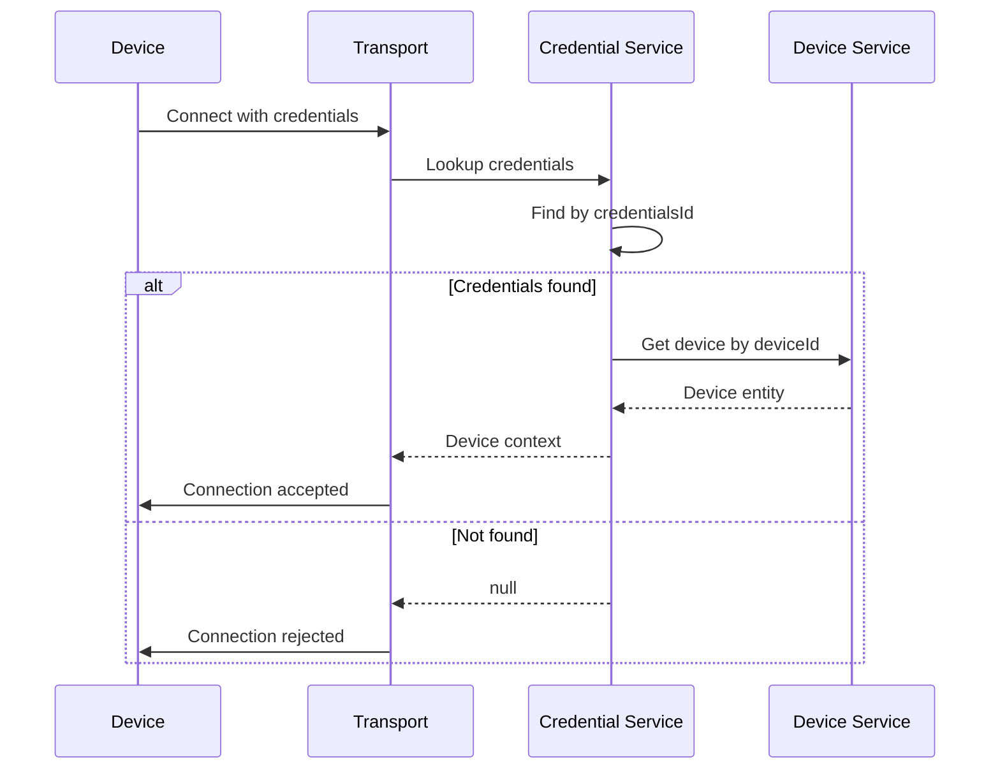
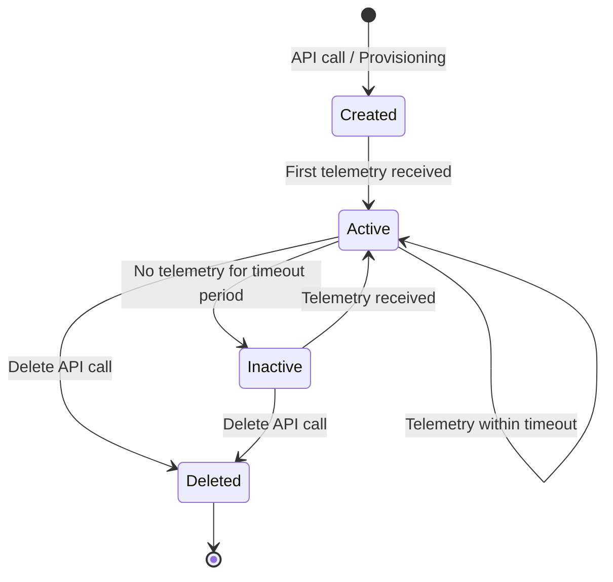
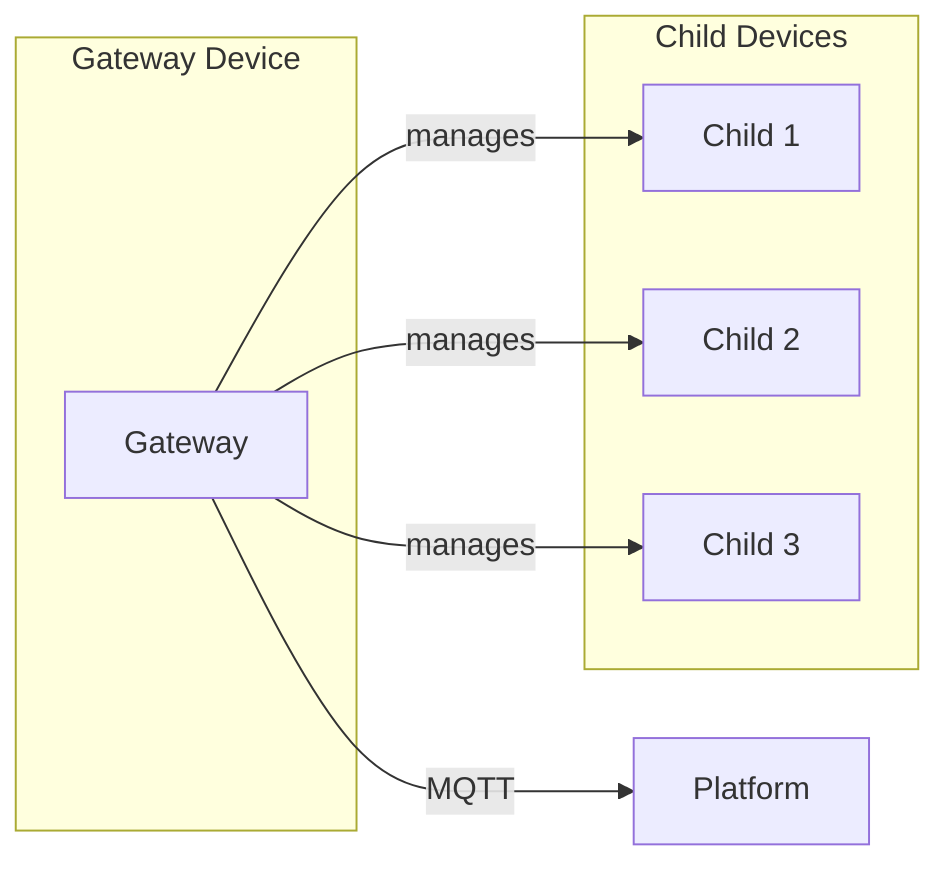
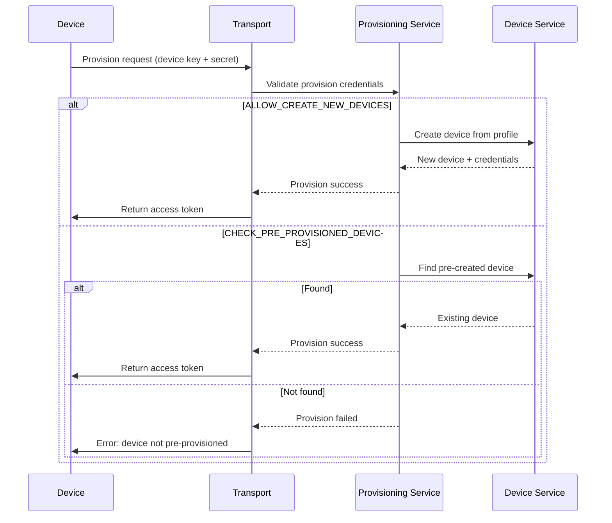

# Device Entity

## Overview

A Device is the fundamental entity in the IoT platform, representing a physical or virtual thing that sends telemetry data and receives commands. Devices belong to a tenant, can be assigned to customers, and follow behavior defined by their device profile.

## Key Behaviors

1. **Tenant Scoping**: Every device belongs to exactly one tenant. Device names must be unique within a tenant.

2. **Customer Assignment**: Devices can optionally be assigned to a customer for delegated access control.

3. **Profile-Driven Behavior**: Each device references a Device Profile that defines its transport type, alarm rules, and default rule chain.

4. **Credential-Based Authentication**: Devices authenticate using credentials (access token, X.509 certificate, or MQTT basic auth) before sending data.

5. **Lifecycle Tracking**: The platform tracks device activity state (active/inactive) based on telemetry timestamps.

6. **OTA Updates**: Devices can have firmware and software packages assigned for over-the-air updates.

## Data Structure

### Device Entity

| Field | Type | Description | Constraints |
|-------|------|-------------|-------------|
| id | UUID | Unique identifier | Auto-generated |
| tenantId | UUID | Owning tenant | Required, immutable after creation |
| customerId | UUID | Assigned customer | Optional |
| name | string | Device name | Required, unique per tenant, max 255 chars |
| type | string | Profile type name | Derived from profile |
| label | string | Human-readable label | Optional, used in UI widgets |
| deviceProfileId | UUID | Reference to profile | Required |
| firmwareId | UUID | Assigned firmware | Optional |
| softwareId | UUID | Assigned software | Optional |
| deviceData | object | Transport-specific config | JSON, varies by transport type |
| additionalInfo | object | Custom metadata | Free-form JSON |
| createdTime | timestamp | Creation time | Auto-set |
| version | integer | Optimistic locking | Auto-incremented on update |

### Example Device JSON

```json
{
  "id": {
    "entityType": "DEVICE",
    "id": "784f3940-2f04-11ec-8f2e-4d7a8c12df56"
  },
  "tenantId": {
    "entityType": "TENANT",
    "id": "13814000-1dd2-11b2-8080-808080808080"
  },
  "customerId": {
    "entityType": "CUSTOMER",
    "id": "23a14000-1dd2-11b2-8080-808080808080"
  },
  "name": "Temperature Sensor A1",
  "type": "temperature-sensor",
  "label": "Building 3 - Floor 2",
  "deviceProfileId": {
    "entityType": "DEVICE_PROFILE",
    "id": "5f8c3940-2f04-11ec-8f2e-4d7a8c12df56"
  },
  "additionalInfo": {
    "description": "Installed on 2023-01-15",
    "location": "Room 204"
  },
  "createdTime": 1634567890123
}
```

## Device Profile

Device profiles define the template for device behavior.

### Profile Structure

| Field | Type | Description |
|-------|------|-------------|
| id | UUID | Unique identifier |
| tenantId | UUID | Owning tenant |
| name | string | Profile name (e.g., "Temperature Sensor") |
| description | string | Human-readable description |
| type | enum | Always "DEFAULT" |
| transportType | enum | DEFAULT, MQTT, COAP, LWM2M, SNMP |
| provisionType | enum | DISABLED, ALLOW_CREATE_NEW_DEVICES, CHECK_PRE_PROVISIONED_DEVICES |
| defaultRuleChainId | UUID | Rule chain for message processing |
| defaultDashboardId | UUID | Mobile app default dashboard |
| defaultQueueName | string | Message queue override |
| profileData | object | Alarm rules, transport config |
| firmwareId | UUID | Default firmware package |
| softwareId | UUID | Default software package |
| isDefault | boolean | Used when profile not specified |

### Transport Types

| Type | Description | Use Case |
|------|-------------|----------|
| DEFAULT | HTTP, MQTT, CoAP via default handlers | General purpose |
| MQTT | MQTT-specific configuration | Custom MQTT topics |
| COAP | CoAP-specific configuration | Constrained devices |
| LWM2M | LwM2M object model | Device management protocol |
| SNMP | SNMP OID mapping | Network equipment |

### Profile Data Contents

```json
{
  "configuration": {
    "type": "DEFAULT"
  },
  "transportConfiguration": {
    "type": "DEFAULT"
  },
  "provisionConfiguration": {
    "type": "DISABLED"
  },
  "alarms": [
    {
      "alarmType": "High Temperature",
      "createRules": {
        "CRITICAL": {
          "condition": {
            "spec": { "type": "SIMPLE" },
            "condition": [
              {
                "key": { "key": "temperature", "type": "TIME_SERIES" },
                "valueType": "NUMERIC",
                "predicate": {
                  "type": "NUMERIC",
                  "operation": "GREATER",
                  "value": { "defaultValue": 100 }
                }
              }
            ]
          }
        }
      },
      "clearRule": {
        "condition": {
          "condition": [
            {
              "key": { "key": "temperature", "type": "TIME_SERIES" },
              "valueType": "NUMERIC",
              "predicate": {
                "type": "NUMERIC",
                "operation": "LESS",
                "value": { "defaultValue": 90 }
              }
            }
          ]
        }
      }
    }
  ]
}
```

## Device Credentials

Devices authenticate using one of four credential types.

### Credential Types

| Type | Description | Protocol Support |
|------|-------------|------------------|
| ACCESS_TOKEN | Simple string token | MQTT, HTTP, CoAP |
| X509_CERTIFICATE | X.509 certificate fingerprint | MQTT with TLS |
| MQTT_BASIC | Username/password pair | MQTT only |
| LWM2M_CREDENTIALS | LwM2M-specific credentials | LwM2M only |

### Credential Structure

| Field | Type | Description |
|-------|------|-------------|
| id | UUID | Credential identifier |
| deviceId | UUID | Associated device |
| credentialsType | enum | One of the four types |
| credentialsId | string | The actual credential value |
| credentialsValue | string | Additional credential data (e.g., certificate) |

### Example: Access Token Credential

```json
{
  "deviceId": {
    "id": "784f3940-2f04-11ec-8f2e-4d7a8c12df56"
  },
  "credentialsType": "ACCESS_TOKEN",
  "credentialsId": "sensorA1_token_xyz123"
}
```

### Authentication Flow



## Device Lifecycle



### Activity Tracking

The platform tracks device activity based on telemetry timestamps:
- **Inactivity Timeout**: Configured per device profile (e.g., 300 seconds)
- **Active**: Last telemetry timestamp within timeout
- **Inactive**: No telemetry for longer than timeout
- **Activity Events**: Generated when state changes, trigger rule chain processing

### Activity Event Example

```json
{
  "type": "INACTIVITY_EVENT",
  "originator": {
    "entityType": "DEVICE",
    "id": "784f3940-2f04-11ec-8f2e-4d7a8c12df56"
  },
  "metadata": {
    "deviceName": "Temperature Sensor A1",
    "deviceType": "temperature-sensor"
  },
  "data": {
    "active": false,
    "lastActivityTime": 1634567890123
  }
}
```

## Gateway Devices

Gateways act as intermediaries for devices that cannot connect directly.

### Gateway Behavior



### Gateway Message Format

Gateways use special MQTT topics to send telemetry for multiple devices:

**Topic**: `v1/gateway/telemetry`

**Payload**:
```json
{
  "Device A": [
    {"ts": 1634567890123, "values": {"temperature": 25.5}}
  ],
  "Device B": [
    {"ts": 1634567890456, "values": {"humidity": 60}}
  ]
}
```

### Gateway Device Creation

When a gateway sends telemetry for an unknown device name:
1. Platform checks if device exists in tenant
2. If not found and gateway profile allows, creates new device automatically
3. New device uses same profile as gateway (unless overridden)
4. Creates "Contains" relation from gateway to child device

## Device Provisioning

Three provisioning strategies are available.

### Provisioning Types

| Type | Behavior |
|------|----------|
| DISABLED | Manual device creation only |
| ALLOW_CREATE_NEW_DEVICES | Auto-create on first connect with valid provision key |
| CHECK_PRE_PROVISIONED_DEVICES | Only activate pre-created devices |

### Provisioning Flow



## Interactions

### With Rule Engine
- All device messages flow through the assigned rule chain
- Default: tenant's root rule chain
- Override: device profile's `defaultRuleChainId`

### With Dashboards
- Devices can be visualized in dashboard widgets
- Widgets subscribe to device telemetry via WebSocket
- Device profile specifies default mobile dashboard

### With Alarms
- Device profile defines alarm rules
- Rules evaluate telemetry against conditions
- Alarms are created/cleared automatically

### With Assets
- Devices can have relations to assets
- Common pattern: Asset "Contains" Device
- Enables hierarchical data aggregation

## Edge Cases

### Device Name Conflicts
- Names must be unique per tenant
- API returns error if name already exists
- Rename requires checking uniqueness first

### Credential Changes
- Changing credentials disconnects active sessions
- Devices must reconnect with new credentials
- Rate limiting prevents credential brute-forcing

### Profile Changes
- Changing device profile applies new alarm rules
- Transport type change may require device reconfiguration
- Does not affect historical telemetry

### Customer Unassignment
- Unassigning from customer removes customer's access
- Does not delete device or its data
- Device remains accessible to tenant admins

## Implementation Details

### Device Service Architecture

**BaseDeviceService** provides core device management:
- CRUD operations with tenant-scoped uniqueness validation
- Device profile resolution and validation
- Credential lifecycle management
- Customer assignment with access control checks

### Device State Service

`DefaultDeviceStateService` tracks device activity:
- Maintains in-memory state via `ConcurrentMap<DeviceId, DeviceStateData>`
- Monitors `lastActivityTime`, `lastConnectTime`, `lastDisconnectTime`
- Generates `ACTIVITY_EVENT` and `INACTIVITY_EVENT` messages to rule engine
- Configurable inactivity timeout per device profile (default: 600 seconds)

### Device Credentials Caching

Credentials are cached for authentication performance:
- Cache key: `credentialsId` (token, certificate hash, or username)
- Cache: Caffeine with configurable size and TTL
- Invalidation: On credential update or device deletion
- Lookup flow: Cache → Database → Return null if not found

### Device Profile Processing

`TbDeviceProfileCache` provides fast profile access:
- Loaded on first access, cached by `deviceProfileId`
- Contains alarm rules, transport config, provision settings
- Profile changes trigger cache invalidation via cluster notifications
- Default profile cached separately for quick lookup

### OTA Update Tracking

Firmware/software updates tracked via server-side attributes:
- `fw_checksum`, `fw_checksum_algorithm`, `fw_size`, `fw_title`, `fw_version`
- `sw_checksum`, `sw_checksum_algorithm`, `sw_size`, `sw_title`, `sw_version`
- `fw_state` / `sw_state`: `QUEUED`, `INITIATED`, `DOWNLOADING`, `DOWNLOADED`, `VERIFIED`, `UPDATING`, `UPDATED`, `FAILED`

### Gateway Device Processing

`GatewayDeviceSessionCtx` handles gateway-connected devices:
- Maps device names to `DeviceId` via `ConcurrentMap<String, GatewayDeviceSessionCtx>`
- Auto-creates child devices if `allowCreateDevicesOrAssets` enabled on gateway profile
- Creates `Contains` relation from gateway to child device automatically
- Supports `overwriteActivityTime` to use gateway's timestamp for child devices

### Configuration Properties

```yaml
state:
  defaultInactivityTimeoutInSec: 600
  defaultStateCheckIntervalInSec: 60
  persistToTelemetry: false  # Store state changes as telemetry

cache:
  deviceCredentials:
    timeToLiveInMinutes: 1440  # 24 hours
    maxSize: 100000
```

## Common Pitfalls

### Device Management Pitfalls

| Pitfall | Impact | Solution |
|---------|--------|----------|
| **Duplicate device names** | Creation fails with conflict error | Check name uniqueness before creation or use bulk import with UNIQUIFY strategy |
| **Changing device profile transport type** | Device may lose connectivity if reconfigured incorrectly | Plan transport migration carefully; device firmware may need updating |
| **Credential rotation without coordination** | Active sessions disconnected immediately | Coordinate credential changes with device reconnection strategy |
| **Assuming device activity = connectivity** | Inactivity timeout is configurable per profile, not connection-based | Use actual connection status from transport layer for real-time connectivity |
| **Deleting device with active alarms** | Orphaned alarms may persist | Clear or acknowledge alarms before device deletion |
| **Gateway device limit exhaustion** | Child devices rejected after limit reached | Monitor child device count; increase limits in gateway profile if needed |

### Provisioning Pitfalls

| Pitfall | Impact | Solution |
|---------|--------|----------|
| **Provision key reuse** | Multiple devices share identity | Use unique provision keys per device or per batch |
| **CHECK_PRE_PROVISIONED without device pre-creation** | Provisioning fails with "device not found" | Pre-create device entries before deployment |
| **ALLOW_CREATE without rate limiting** | Malicious provisioning floods tenant | Configure device count limits in tenant profile |
| **X.509 certificate expiration** | Devices lose connectivity silently | Monitor certificate expiration; implement rotation |

### OTA Update Pitfalls

| Pitfall | Impact | Solution |
|---------|--------|----------|
| **Assigning firmware without checksum validation** | Corrupted updates brick devices | Always configure checksum verification |
| **Large firmware packages without chunking** | Network timeouts during download | Use chunked transfer for large packages |
| **Missing fw_state telemetry handling** | Unable to track update progress | Implement full state machine in device firmware |
| **Updating during low battery** | Device bricks mid-update | Check battery level before initiating OTA |

### Data Handling Pitfalls

| Pitfall | Impact | Solution |
|---------|--------|----------|
| **Posting telemetry with future timestamps** | Data appears in wrong time windows | Validate timestamps before submission; use server time |
| **Using server-scope attributes for device config** | Device cannot read server attributes | Use SHARED_SCOPE for device-readable configuration |
| **High-cardinality telemetry keys** | Index bloat, slow queries | Limit unique key names; use structured JSON for variable data |

## See Also

- [Telemetry](../data-model/telemetry.md) - Device data model
- [Attributes](../data-model/attributes.md) - Device configuration
- [Transport Layer](../../05-transport-layer/) - Communication protocols
- [Actor System](../../03-actor-system/README.md) - DeviceActor behavior
