# Entity Types Overview

## Overview

ThingsBoard uses a comprehensive entity type system to model all platform objects. Each entity type has a unique identifier format, database representation, and associated behaviors. As of ThingsBoard 4.3.0, there are 27+ distinct entity types.

This document helps you understand:
- What entity types exist
- How they relate to each other
- How they're organized and identified

---

## Entity Categories at a Glance

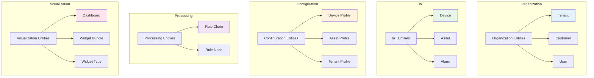

---

## Entity Type Catalog

### Core Entities

The fundamental entities you'll work with most often.

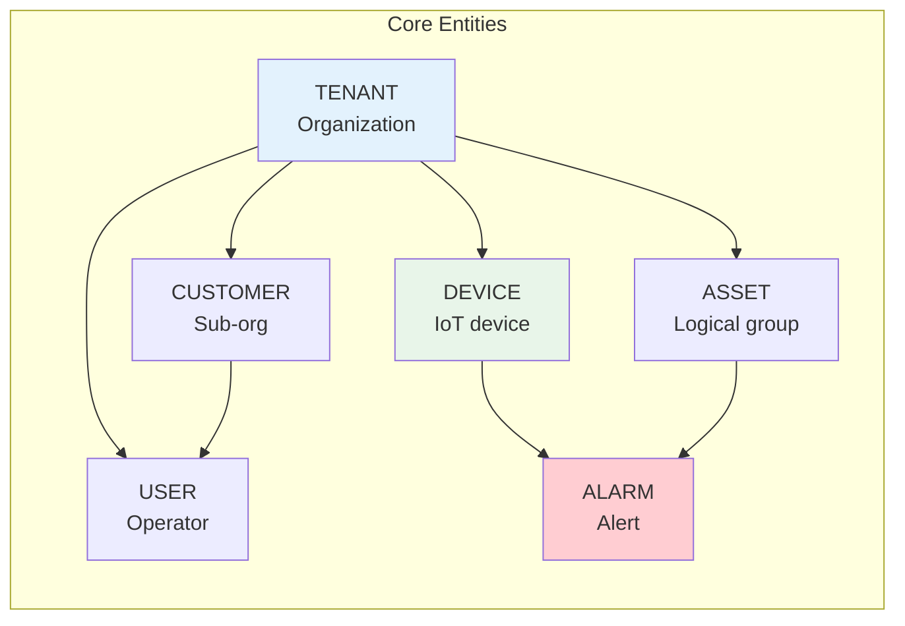

| Entity Type | Proto # | Table Name | Description |
|-------------|---------|------------|-------------|
| TENANT | 1 | tenant | Multi-tenant organization |
| CUSTOMER | 2 | customer | Sub-organization within tenant |
| USER | 3 | tb_user | Platform user account |
| DEVICE | 6 | device | IoT device or sensor |
| ASSET | 5 | asset | Logical grouping or physical asset |
| DASHBOARD | 4 | dashboard | Visualization dashboard |
| ALARM | 7 | alarm | Alert or notification trigger |

### Rule Engine Entities

Entities that define message processing logic.

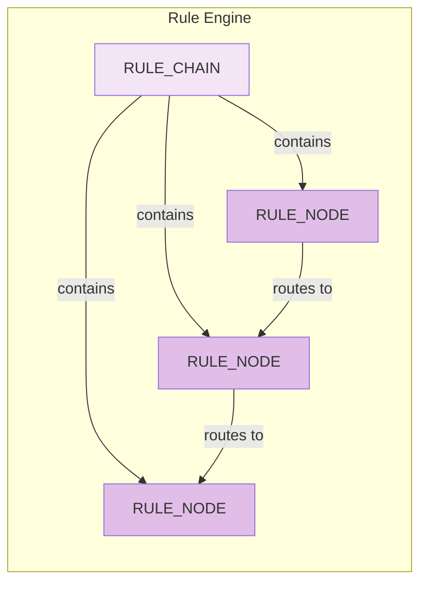

| Entity Type | Proto # | Table Name | Description |
|-------------|---------|------------|-------------|
| RULE_CHAIN | 11 | rule_chain | Message processing pipeline |
| RULE_NODE | 12 | rule_node | Individual processing step |

### Profile Entities

Templates that define behavior for other entities.

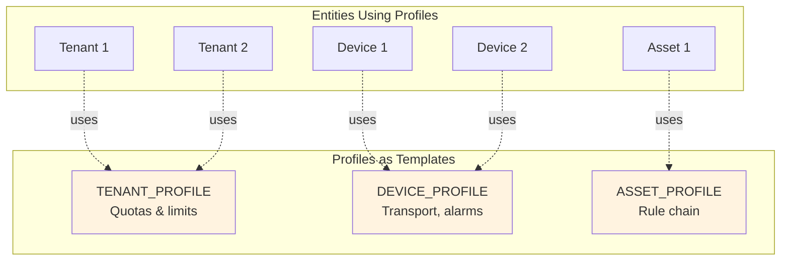

| Entity Type | Proto # | Table Name | Description |
|-------------|---------|------------|-------------|
| TENANT_PROFILE | 20 | tenant_profile | Tenant limits and configuration |
| DEVICE_PROFILE | 21 | device_profile | Device behavior template |
| ASSET_PROFILE | 22 | asset_profile | Asset behavior template |

### UI Entities

Entities for visualization and presentation.

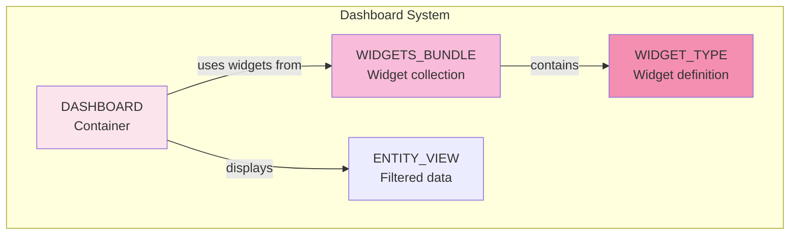

| Entity Type | Proto # | Table Name | Description |
|-------------|---------|------------|-------------|
| ENTITY_VIEW | 15 | entity_view | Filtered view of entity data |
| WIDGETS_BUNDLE | 16 | widgets_bundle | Collection of widget types |
| WIDGET_TYPE | 17 | widget_type | Reusable dashboard widget |

### System Entities

Platform configuration and management.

| Entity Type | Proto # | Table Name | Description |
|-------------|---------|------------|-------------|
| API_USAGE_STATE | 23 | api_usage_state | Usage tracking per tenant |
| TB_RESOURCE | 24 | resource | Uploaded files and resources |
| OTA_PACKAGE | 25 | ota_package | Firmware/software packages |
| QUEUE | 28 | queue | Message queue configuration |
| QUEUE_STATS | 34 | queue_stats | Queue statistics |
| ADMIN_SETTINGS | 42 | admin_settings | System configuration |

### Edge Computing

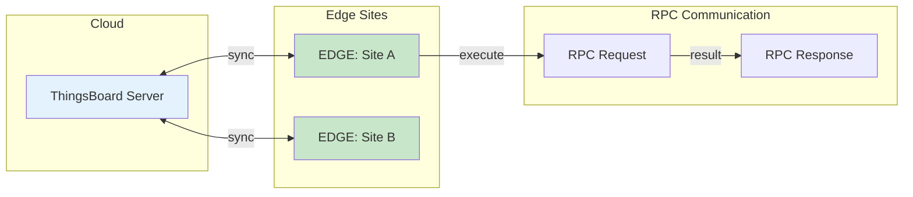

| Entity Type | Proto # | Table Name | Description |
|-------------|---------|------------|-------------|
| EDGE | 26 | edge | Edge gateway instance |
| RPC | 27 | rpc | Remote procedure call record |

### Notification System

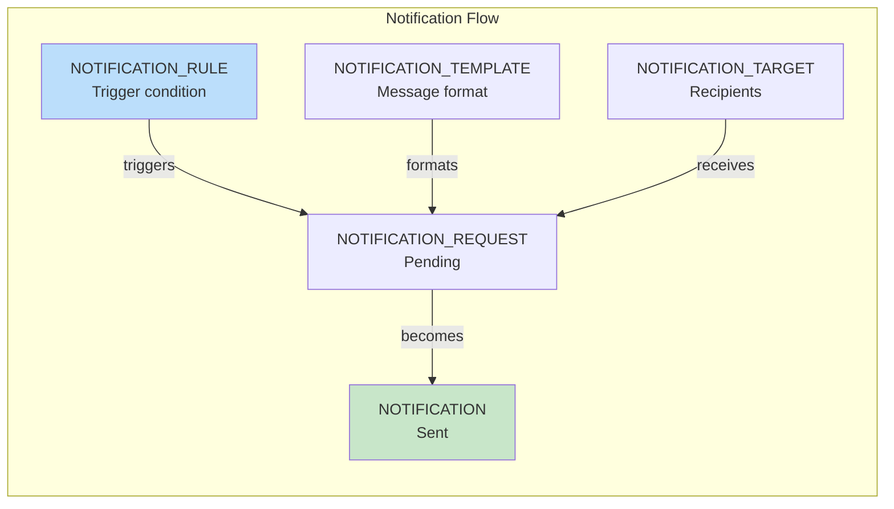

| Entity Type | Proto # | Table Name | Description |
|-------------|---------|------------|-------------|
| NOTIFICATION_TARGET | 29 | notification_target | Notification recipients |
| NOTIFICATION_TEMPLATE | 30 | notification_template | Message template |
| NOTIFICATION_REQUEST | 31 | notification_request | Pending notification |
| NOTIFICATION | 32 | notification | Sent notification |
| NOTIFICATION_RULE | 33 | notification_rule | Automation rules |

### OAuth & Security

| Entity Type | Proto # | Table Name | Description |
|-------------|---------|------------|-------------|
| OAUTH2_CLIENT | 35 | oauth2_client | OAuth2 provider configuration |
| DOMAIN | 36 | domain | Custom domain mapping |
| API_KEY | 44 | api_key | API access credentials |

### Mobile Applications

| Entity Type | Proto # | Table Name | Description |
|-------------|---------|------------|-------------|
| MOBILE_APP | 37 | mobile_app | Mobile application config |
| MOBILE_APP_BUNDLE | 38 | mobile_app_bundle | Mobile app package |

### Advanced Features (v4.x)

| Entity Type | Proto # | Table Name | Description |
|-------------|---------|------------|-------------|
| CALCULATED_FIELD | 39 | calculated_field | Computed/derived values |
| JOB | 41 | job | Background job execution |
| AI_MODEL | 43 | ai_model | AI/ML model configuration |

---

## Entity Hierarchy

Understanding how entities are organized is crucial for working with ThingsBoard.

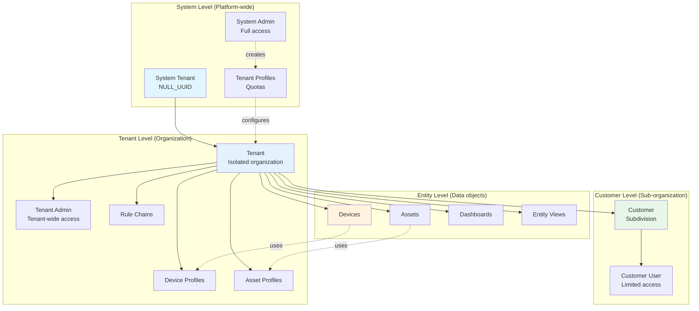

### Access Control by Level

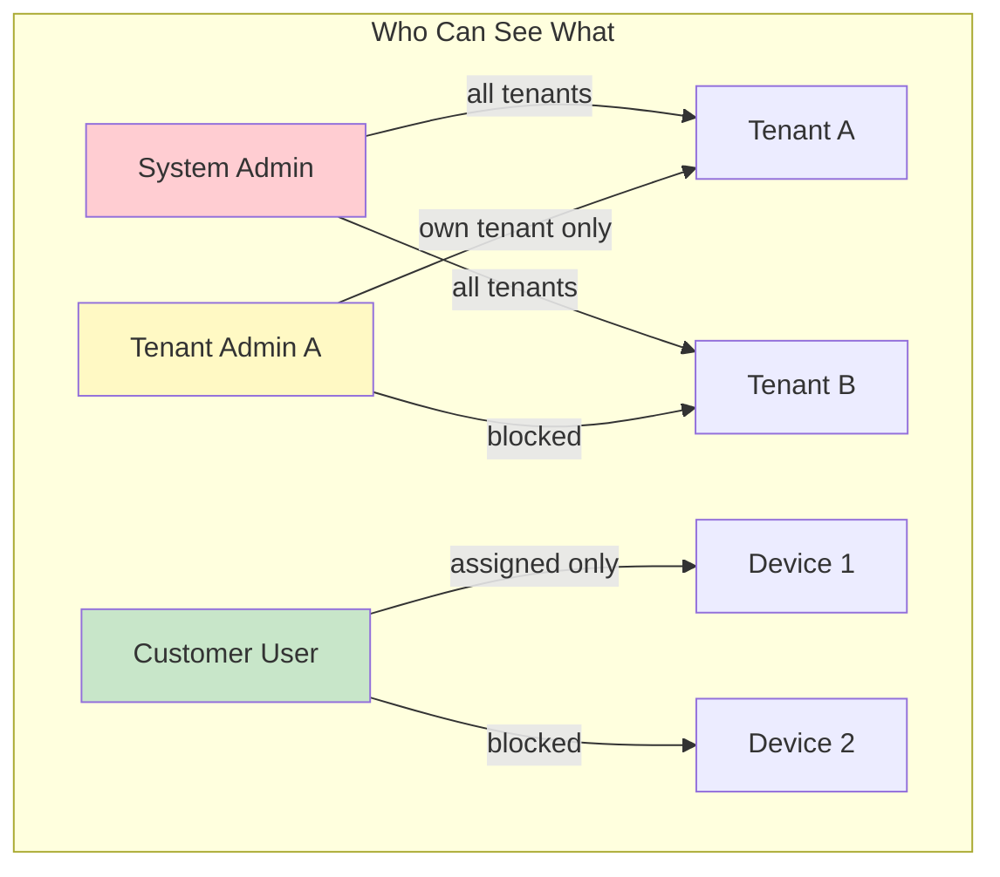

---

## Entity Identification

### How Entity IDs Work

Every entity in ThingsBoard has a unique identifier composed of two parts:

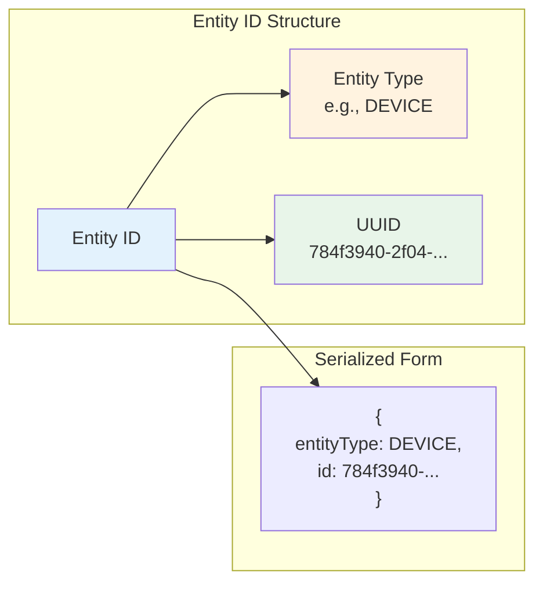

### ID Structure Examples

```json
// Device ID
{
  "entityType": "DEVICE",
  "id": "784f3940-2f04-11ec-8f2e-4d7a8c12df56"
}

// Tenant ID
{
  "entityType": "TENANT",
  "id": "a1b2c3d4-5678-90ab-cdef-1234567890ab"
}

// Alarm ID
{
  "entityType": "ALARM",
  "id": "deadbeef-cafe-babe-face-123456789012"
}
```

### Special IDs

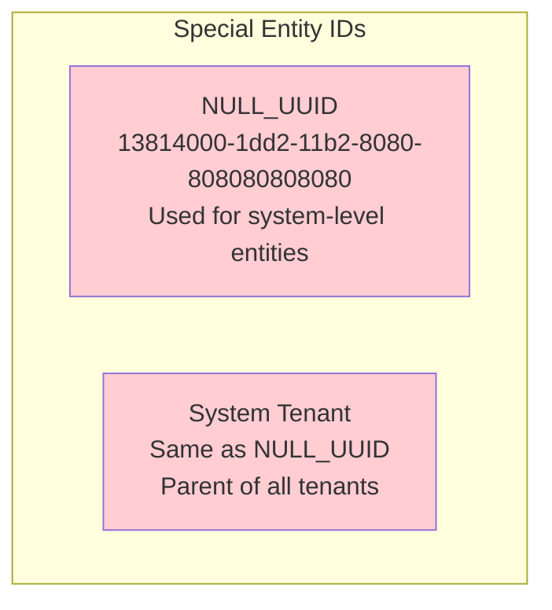

### Type-Safe ID Classes

Each entity type has its own ID class for compile-time safety:

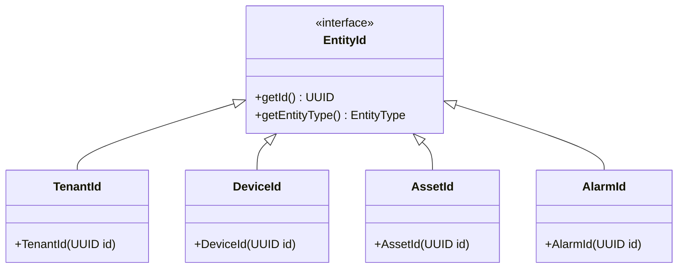

---

## Common Entity Interfaces

Entities share common behaviors through interfaces.

### Interface Hierarchy

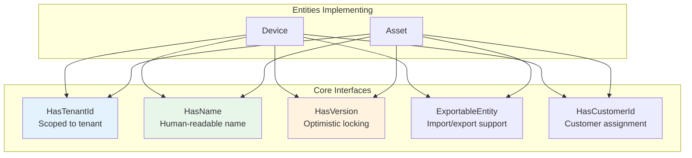

### HasTenantId

All tenant-scoped entities implement this interface:

```
Behavior:
- Returns the tenant that owns this entity
- Used for access control checks
- Ensures tenant isolation in queries

Entities: Device, Asset, Customer, Dashboard, RuleChain, and most others
```

### HasName

Entities with human-readable names:

```
Behavior:
- Provides a display name for the entity
- Usually unique within a scope (tenant + type)
- Used in search and filtering

Entities: Device, Asset, Customer, Tenant, RuleChain
```

### HasVersion

Entities with optimistic locking:

```
Behavior:
- Version number increments on each update
- Prevents concurrent modification conflicts
- If versions don't match, update is rejected

Entities: Almost all entities
```

### ExportableEntity

Entities that can be exported/imported:

```
Behavior:
- Supports externalId for cross-system identification
- Enables backup and migration
- Preserves references during import

Entities: Device, Asset, Dashboard, RuleChain
```

---

## Entity Relationships

Entities connect through the relation system, forming a graph structure.

### Relation Basics

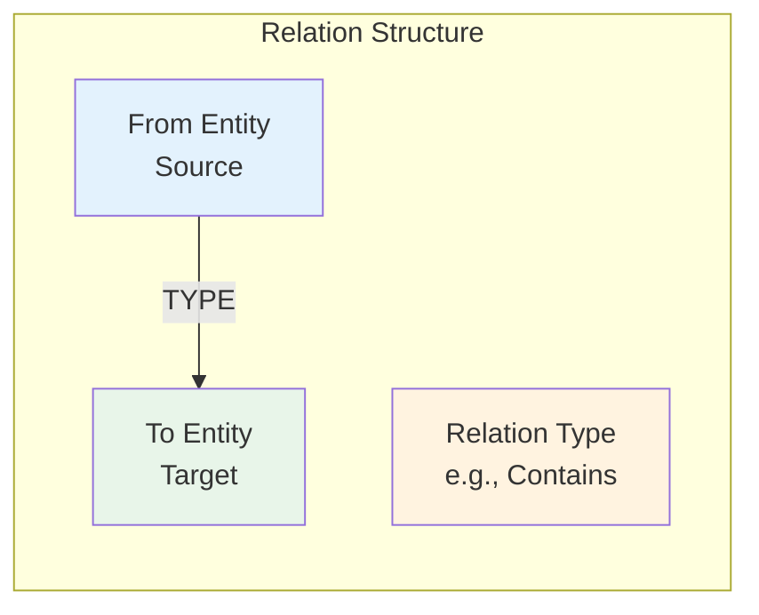

### Common Relation Patterns

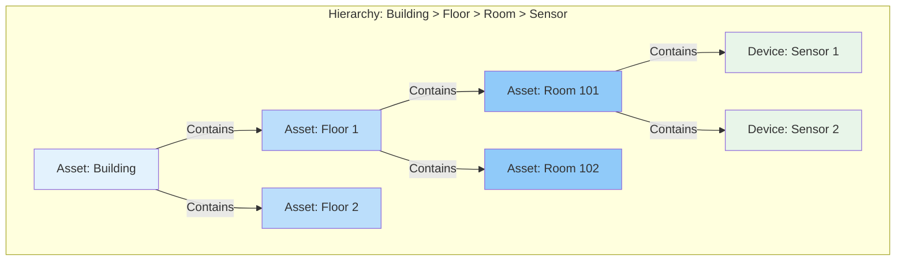

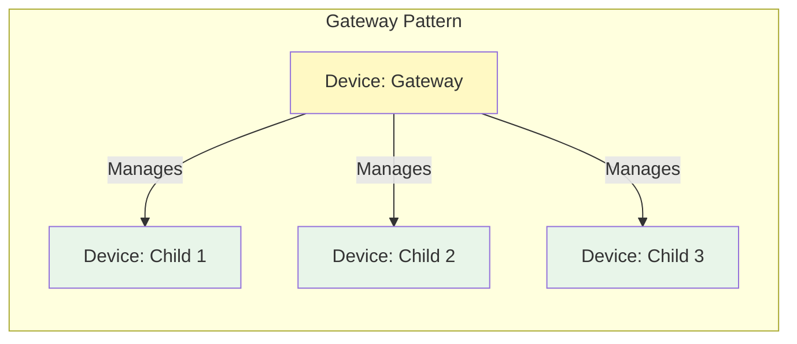

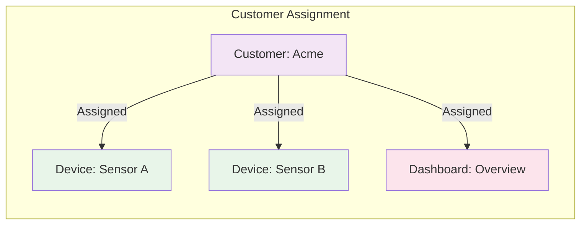

### Relation Types Reference

| Type | Direction | Use Case |
|------|-----------|----------|
| Contains | FROM → TO | Parent contains child (building → floor) |
| Manages | FROM → TO | Gateway manages child device |
| Uses | FROM → TO | Entity uses another entity |
| ManagedByEdge | TO ← FROM | Edge manages entity |

### Relation Type Groups

| Group | Purpose |
|-------|---------|
| COMMON | General-purpose relations |
| ALARM | Alarm propagation relations |
| DASHBOARD | Dashboard-specific relations |
| RULE_CHAIN | Rule chain connections |

---

## Proto Number Mapping

Entity types have stable proto numbers for efficient serialization in gRPC communication between services.

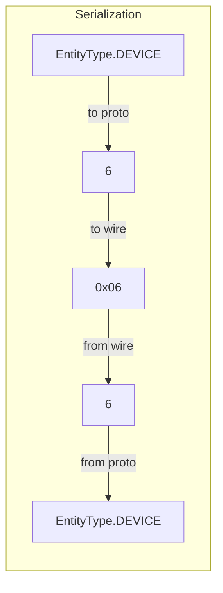

### Why Proto Numbers?

1. **Compact**: Integer is smaller than string "DEVICE"
2. **Fast**: Integer comparison is faster
3. **Stable**: Numbers don't change between versions
4. **Compatible**: New types get new numbers, old ones preserved

---

## Entity Lifecycle

All entities follow a similar lifecycle pattern:

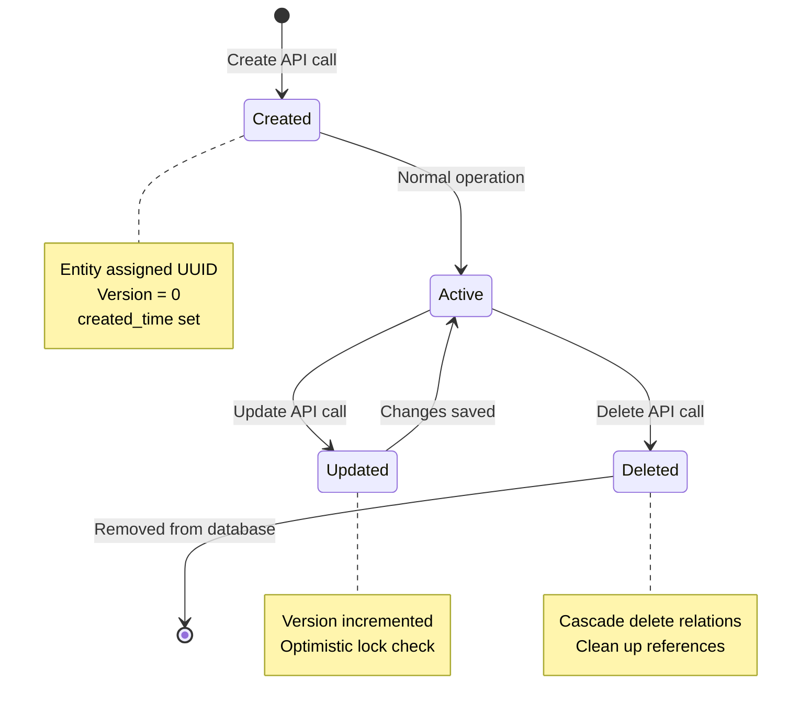

---

## Quick Reference

### Entity Types by Count

| Category | Count | Examples |
|----------|-------|----------|
| Core | 7 | Tenant, Device, Asset, Alarm |
| Profiles | 3 | TenantProfile, DeviceProfile, AssetProfile |
| Rule Engine | 2 | RuleChain, RuleNode |
| UI | 3 | Dashboard, WidgetsBundle, WidgetType |
| Notifications | 5 | NotificationRule, Notification, etc. |
| System | 6 | Queue, OtaPackage, Resource, etc. |
| Edge | 2 | Edge, RPC |
| Security | 3 | OAuth2Client, Domain, ApiKey |
| Mobile | 2 | MobileApp, MobileAppBundle |
| Advanced | 3 | CalculatedField, Job, AIModel |

### Most Common Operations by Entity

| Entity | Common Operations |
|--------|-------------------|
| Device | Create, getCredentials, postTelemetry, getRpc |
| Asset | Create, getRelations, getTelemetry |
| Alarm | Create, acknowledge, clear, assign |
| Dashboard | Create, assign to customer, getWidgets |
| RuleChain | Create, setRoot, getNodes |

---

## See Also

- [Device Entity](./device.md) - Device-specific documentation
- [Asset Entity](./asset.md) - Asset-specific documentation
- [Alarm Entity](./alarm.md) - Alarm-specific documentation
- [Entity Relations](./relations.md) - Relation system details
- [Entity IDs](../identity/entity-ids.md) - ID system deep dive
- [Multi-Tenancy](../../01-architecture/multi-tenancy.md) - Tenant isolation
- [Database Schema](../../07-data-persistence/database-schema.md) - Storage details
