# Entity Relations

## Overview

Entity Relations are directed links between any two entities in the platform. They enable hierarchical structures, dependency tracking, and graph-based queries. Relations power critical features including asset hierarchies, alarm propagation, dashboard entity aliases, and rule chain routing.

## Key Behaviors

1. **Directed Links**: Relations have a source (from) and destination (to) entity, creating a directed graph.

2. **Type Categorization**: Each relation has a type (e.g., "Contains") and type group (e.g., COMMON) allowing domain-specific isolation.

3. **Unique Keys**: A relation is uniquely identified by (from, to, type, typeGroup). The same two entities can have multiple relations with different types.

4. **Graph Traversal**: Relations support recursive queries to traverse hierarchies at configurable depths.

5. **Access Controlled**: Users can only see relations where they have read access to both endpoints.

## Data Structure

### Entity Relation

| Field | Type | Description | Constraints |
|-------|------|-------------|-------------|
| from | EntityId | Source entity | Required |
| to | EntityId | Destination entity | Required |
| type | string | Relation type name | Required, max 255 chars |
| typeGroup | enum | Domain category | Required |
| additionalInfo | object | Custom metadata | Optional JSON |
| version | integer | Optimistic locking | Auto-managed |

### Example Relation JSON

```json
{
  "from": {
    "entityType": "ASSET",
    "id": "784f3940-2f04-11ec-8f2e-4d7a8c12df56"
  },
  "to": {
    "entityType": "DEVICE",
    "id": "93a2b1c0-3d5e-11ec-9f8a-1234567890ab"
  },
  "type": "Contains",
  "typeGroup": "COMMON",
  "additionalInfo": {
    "installedDate": "2024-01-15",
    "location": "Floor 2"
  }
}
```

## Direction Semantics

Relations are directional. The direction you query determines what you find:

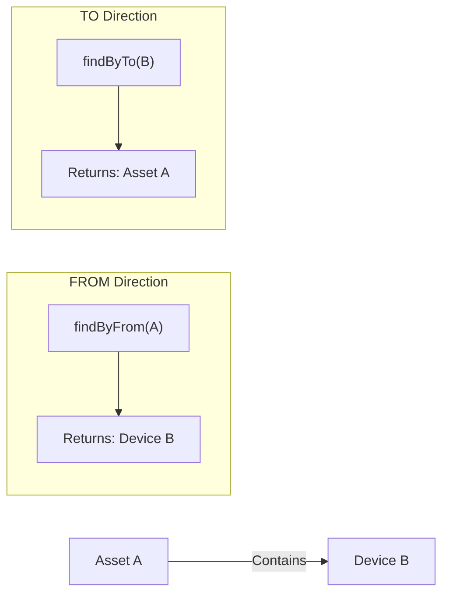

| Direction | Query Meaning | Example |
|-----------|---------------|---------|
| FROM | What does this entity point to? | Find all devices an asset contains |
| TO | What points to this entity? | Find which asset contains a device |

### Direction Example

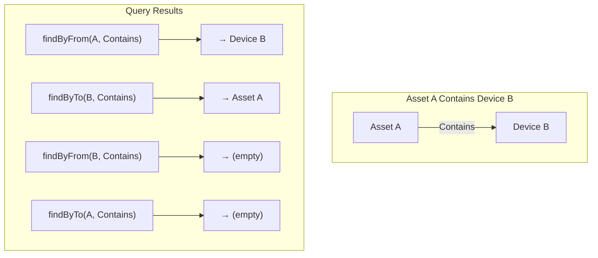

## Relation Types

### Built-in Types

| Type | Constant | Purpose |
|------|----------|---------|
| Contains | `CONTAINS_TYPE` | Hierarchical containment |
| Manages | `MANAGES_TYPE` | Management relationship |
| Uses | `USES_TYPE` | Dependency relationship |
| ManagedByEdge | `EDGE_TYPE` | Edge gateway management |

### Custom Types

Any string can be used as a relation type for domain-specific needs:

```
"IsControlledBy"     - Control system relationships
"ProducesDataFor"    - Data flow relationships
"RequiresMaintenance" - Maintenance tracking
"BacksUp"            - Redundancy relationships
"MonitorsHealth"     - Monitoring relationships
```

## Type Groups

Type groups isolate relations by domain, allowing independent operations on different subsystems:

| Group | Purpose | Example Use |
|-------|---------|-------------|
| COMMON | General hierarchies and dependencies | Asset → Device containment |
| DASHBOARD | Dashboard to entity links | Dashboard entity aliases |
| RULE_CHAIN | Rule chain organization | Rule chain to node relations |
| RULE_NODE | Rule node connections | Node success/failure routing |
| EDGE | Edge device management | Edge gateway assignments |
| EDGE_AUTO_ASSIGN_RULE_CHAIN | Auto-assignment rules | Edge rule chain bindings |

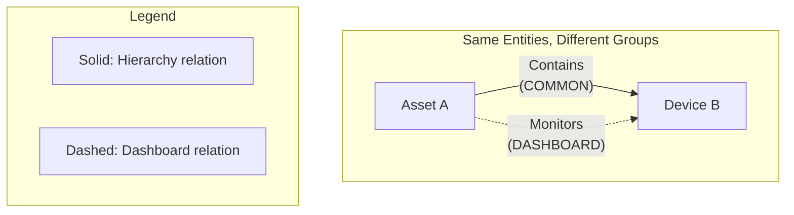

Relations with the same from/to/type but different type groups are independent and coexist.

## Common Patterns

### Asset/Device Hierarchies

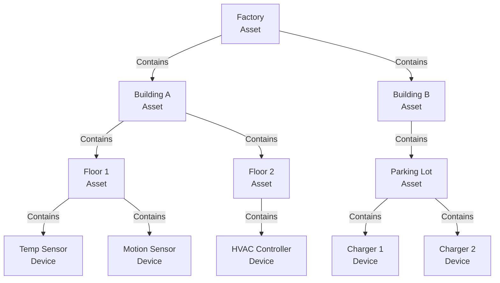

Query all devices in Building A:
```
findByQuery(
  root: Building A,
  direction: FROM,
  type: "Contains",
  maxLevel: 3,
  entityTypes: [DEVICE]
)
```

### Alarm Propagation

Relations define how alarms escalate through hierarchies:

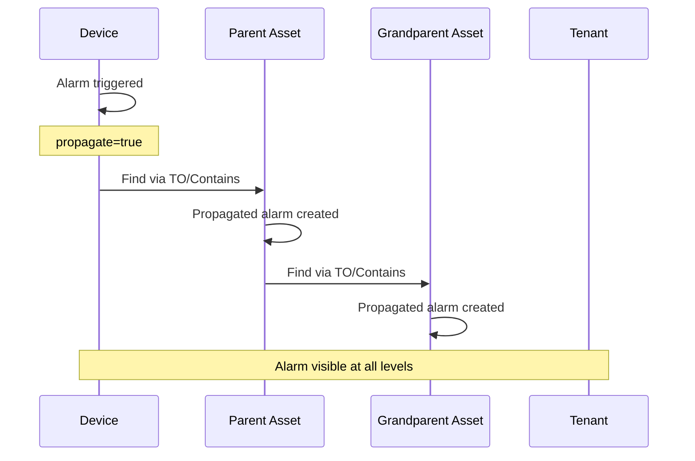

### Dashboard Entity Aliases

Relations link dashboards to data sources:

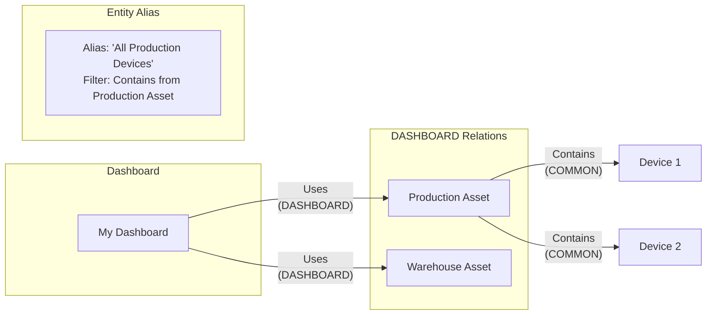

### Rule Chain Routing

Relations determine execution paths between rule nodes:

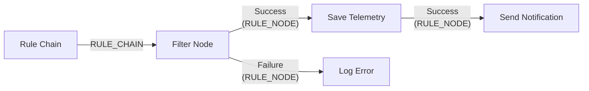

## Query Capabilities

### Simple Queries

| Query | Description |
|-------|-------------|
| `findByFrom(entity, typeGroup)` | All relations FROM entity |
| `findByFromAndType(entity, type, typeGroup)` | Relations FROM entity with specific type |
| `findByTo(entity, typeGroup)` | All relations TO entity |
| `findByToAndType(entity, type, typeGroup)` | Relations TO entity with specific type |

### Complex Queries

Use `EntityRelationsQuery` for multi-level graph traversal:

```json
{
  "parameters": {
    "rootId": "asset-uuid",
    "rootType": "ASSET",
    "direction": "FROM",
    "relationTypeGroup": "COMMON",
    "maxLevel": 3,
    "fetchLastLevelOnly": false
  },
  "filters": [
    {
      "relationType": "Contains",
      "entityTypes": ["DEVICE", "ASSET"],
      "negate": false
    }
  ]
}
```

### Query Parameters

| Parameter | Description |
|-----------|-------------|
| rootId / rootType | Starting entity for the search |
| direction | FROM (outgoing) or TO (incoming) |
| relationTypeGroup | Which domain's relations to search |
| maxLevel | Search depth (1 = direct relations only) |
| fetchLastLevelOnly | Return only entities at maxLevel depth |

### Filters

Narrow results by entity type:

```json
{
  "relationType": "Contains",
  "entityTypes": ["DEVICE", "ASSET"],
  "negate": false
}
```

- `negate: false` - Include only these types
- `negate: true` - Exclude these types

### Query Flow

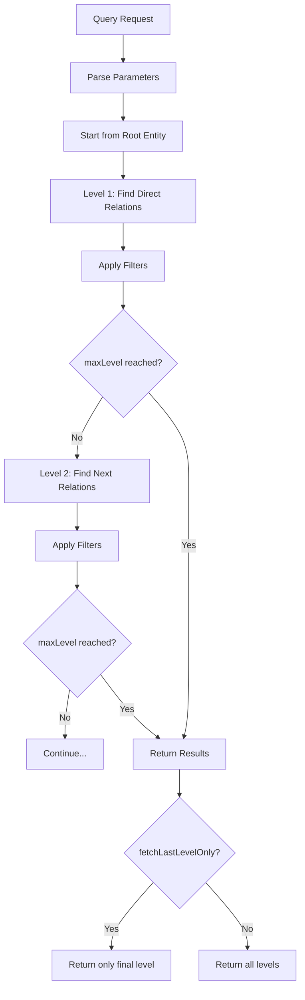

## REST API Endpoints

### Create/Update

| Endpoint | Method | Description |
|----------|--------|-------------|
| `/api/relation` | POST | Create or update relation |
| `/api/v2/relation` | POST | Create or update (v2 API) |

Request body:
```json
{
  "from": { "entityType": "ASSET", "id": "..." },
  "to": { "entityType": "DEVICE", "id": "..." },
  "type": "Contains",
  "typeGroup": "COMMON",
  "additionalInfo": { "custom": "data" }
}
```

### Delete

| Endpoint | Method | Description |
|----------|--------|-------------|
| `/api/relation` | DELETE | Delete specific relation |
| `/api/relations` | DELETE | Delete all COMMON relations for entity |

Query parameters for specific deletion:
```
fromId, fromType, toId, toType, relationType, relationTypeGroup
```

### Check Existence

```
GET /api/relation?fromId=...&fromType=...&toId=...&toType=...&relationType=...
```

Returns the relation if it exists, 404 if not.

### Find Relations

| Endpoint | Parameters | Description |
|----------|------------|-------------|
| `GET /api/relations` | fromId, fromType, relationTypeGroup | All FROM entity |
| `GET /api/relations` | fromId, fromType, relationType, relationTypeGroup | FROM with type |
| `GET /api/relations` | toId, toType, relationTypeGroup | All TO entity |
| `GET /api/relations` | toId, toType, relationType, relationTypeGroup | TO with type |

### Complex Queries

```
POST /api/relations
Body: EntityRelationsQuery

POST /api/relations/info
Body: EntityRelationsQuery
Returns: EntityRelationInfo (includes entity names)
```

## EntityRelationInfo

Enhanced response that includes human-readable entity names:

| Field | Description |
|-------|-------------|
| from | Source entity ID |
| to | Destination entity ID |
| type | Relation type |
| typeGroup | Type group |
| fromName | Name of source entity |
| toName | Name of destination entity |
| additionalInfo | Custom metadata |

## Operations

### Create Relation

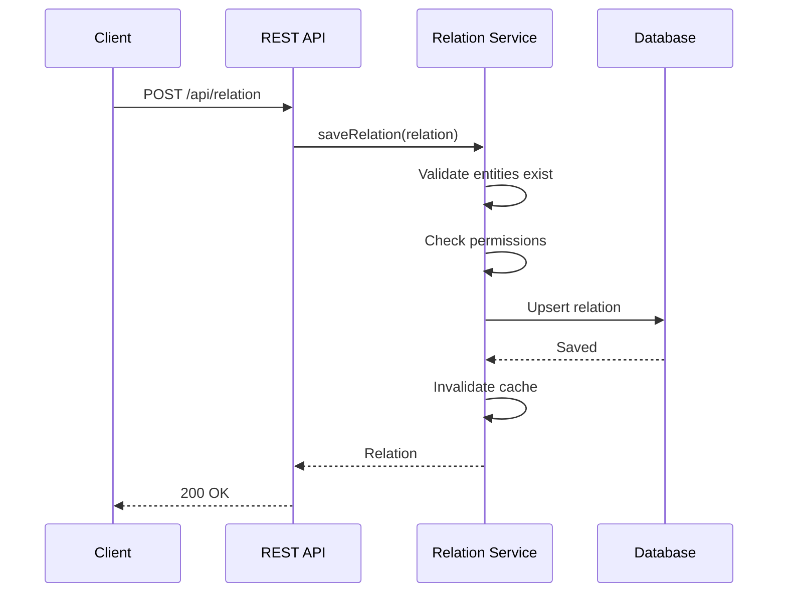

### Delete Patterns

| Operation | Scope |
|-----------|-------|
| `deleteRelation(from, to, type, typeGroup)` | Single relation |
| `deleteEntityRelations(entity)` | ALL relations (both directions, all groups) |
| `deleteEntityCommonRelations(entity)` | Only COMMON group relations |

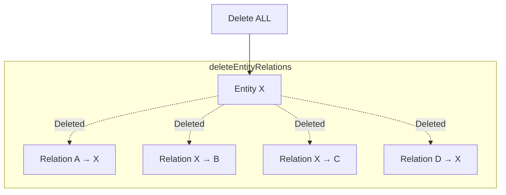

## Access Control

| User Type | Can View | Can Modify |
|-----------|----------|------------|
| Tenant Admin | Relations within tenant | Relations within tenant |
| Customer User | Relations for assigned entities | Relations for assigned entities |
| System Admin | All relations | All relations |

Both entities in a relation must be accessible to the user:
- READ permission on both entities to view
- WRITE permission on both entities to create/delete

## Implementation Patterns

### Building a Hierarchy

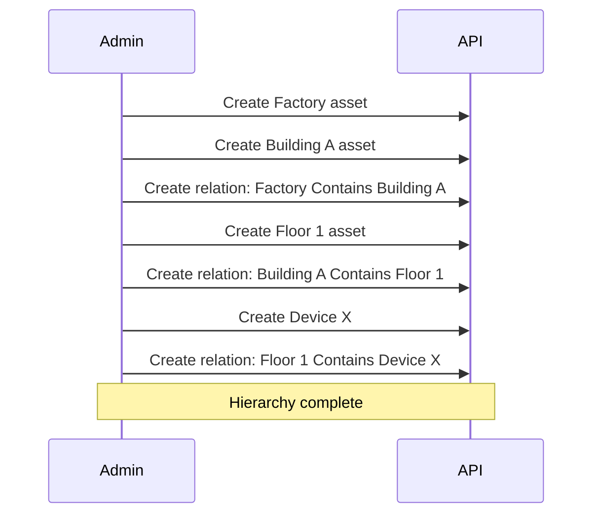

### Finding All Ancestors

Walk up the hierarchy from any entity:

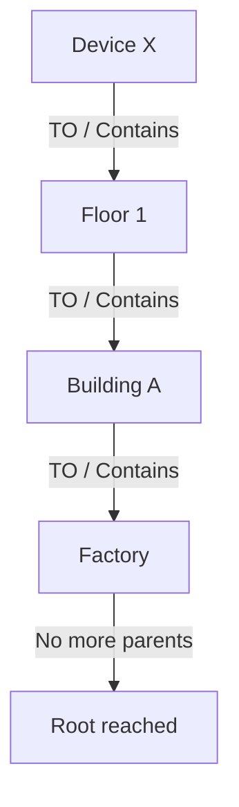

Query: `direction=TO, type=Contains, maxLevel=10`

### Finding All Descendants

Walk down the hierarchy from any entity:

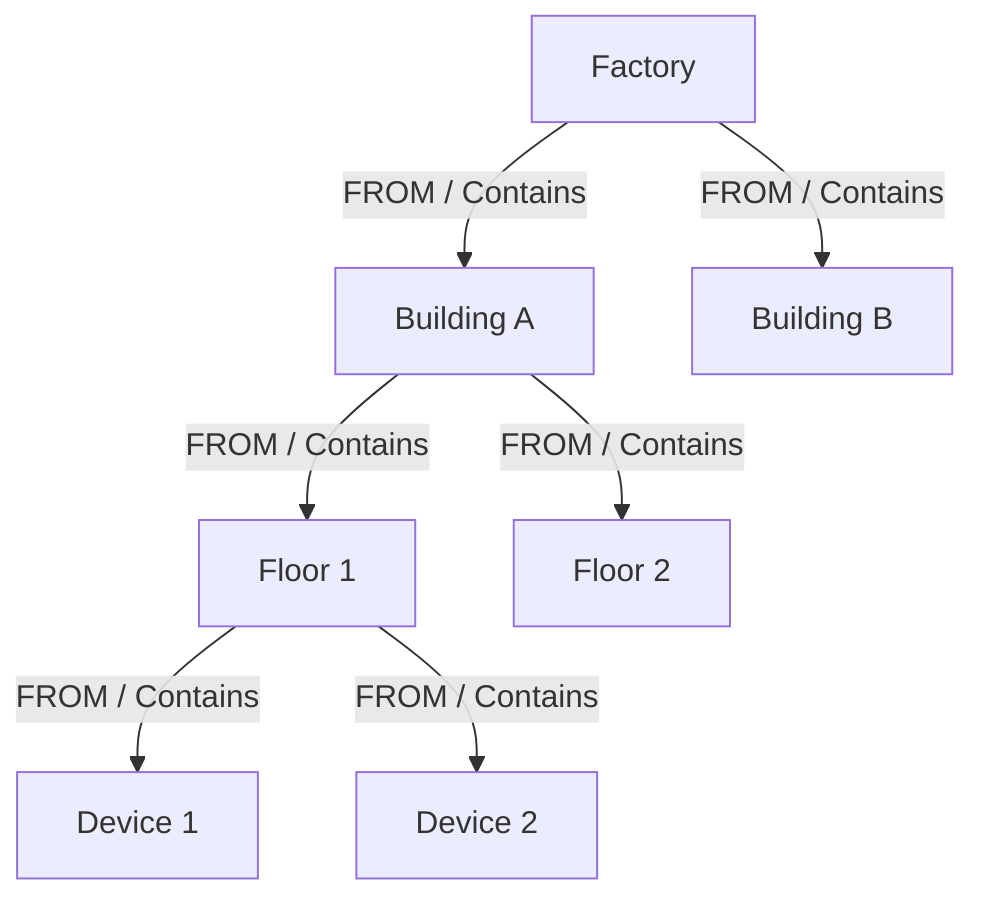

Query: `direction=FROM, type=Contains, maxLevel=10`

### Impact Analysis

Find all entities that depend on a given entity:

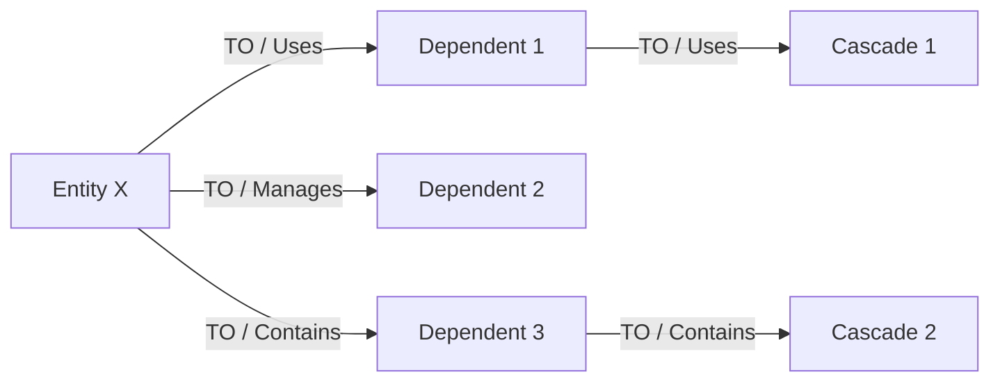

Use TO direction to find what depends on an entity before modifying or deleting it.

## Performance Considerations

### Query Depth

- Use `maxLevel` appropriately - don't set unnecessarily high
- Recursive queries have a configurable timeout (default 20 seconds)
- `fetchLastLevelOnly=true` reduces memory for large hierarchies

### Caching

- Relations are cached automatically
- Cache invalidation occurs on relation changes
- Large hierarchies benefit from caching on repeated queries

### Type Groups

- Use appropriate type groups to isolate domain-specific relations
- Improves query performance (doesn't search irrelevant relations)
- Enables independent operations (delete dashboard relations without affecting hierarchy)

## Edge Cases

### Circular Relations

The platform allows circular relations but queries have depth limits:
- `maxLevel` prevents infinite loops
- Query timeout provides additional protection
- Design hierarchies to avoid unnecessary cycles

### Orphaned Relations

When an entity is deleted:
- Relations are NOT automatically deleted
- Use `deleteEntityRelations()` before entity deletion
- Or implement cleanup logic in your application

### Concurrent Modifications

- Optimistic locking via `version` field prevents lost updates
- Retry logic may be needed for high-contention scenarios

## Implementation Details

### Relation Type Groups

`RelationTypeGroup` enum defines isolation domains:

| Enum Value | Ordinal | Purpose |
|------------|---------|---------|
| `COMMON` | 0 | General entity hierarchies |
| `DASHBOARD` | 1 | Dashboard to entity bindings |
| `RULE_CHAIN` | 2 | Rule chain organization |
| `RULE_NODE` | 3 | Rule node connections |
| `EDGE` | 4 | Edge device management |
| `EDGE_AUTO_ASSIGN_RULE_CHAIN` | 5 | Edge auto-assignment rules |

### Relation Service Architecture

**BaseRelationService** provides core operations:
- Bidirectional index maintenance (from-index and to-index)
- Recursive query with configurable depth and timeout
- Cache invalidation on relation changes
- Bulk operations for entity deletion cleanup

### Caching Strategy

Relations cached at multiple levels:
- **Single relation cache**: Key = `{fromId, toId, type, typeGroup}`
- **From-direction cache**: Key = `{fromId, typeGroup}` → List of relations
- **To-direction cache**: Key = `{toId, typeGroup}` → List of relations
- Cache invalidation broadcasts via cluster notifications

### Recursive Query Implementation

`findByQuery` uses breadth-first traversal:
```
1. Start from root entity
2. For each level (1 to maxLevel):
   a. Query relations in specified direction
   b. Apply entity type filters
   c. Collect results (or just final level if fetchLastLevelOnly)
   d. Use found entities as roots for next level
3. Return accumulated results
```

Timeout protection: `relationsFetchTimeoutInSec` (default: 20 seconds)

### Database Schema

Relations stored in `relation` table:
- Composite primary key: `(from_id, from_type, to_id, to_type, relation_type_group, relation_type)`
- Indexes on both `from_id` and `to_id` for bidirectional queries
- `additional_info` stored as JSONB for custom metadata

### Bulk Operations

**deleteEntityRelations** removes all relations for an entity:
- Queries both FROM and TO directions
- Deletes in batches to avoid lock contention
- Used during entity deletion to prevent orphaned relations

### Configuration Properties

```yaml
sql:
  relations:
    max_level: 50  # Maximum recursion depth
    fetch_timeout_in_sec: 20  # Query timeout

cache:
  relations:
    timeToLiveInMinutes: 1440
    maxSize: 100000
```

## See Also

- [Asset Entity](./asset.md) - Common relation source
- [Device Entity](./device.md) - Common relation target
- [Alarm Entity](./alarm.md) - Alarm propagation via relations
- [Rule Engine](../../04-rule-engine/README.md) - Rule node relations
- [Multi-Tenancy](../../01-architecture/multi-tenancy.md) - Tenant isolation
