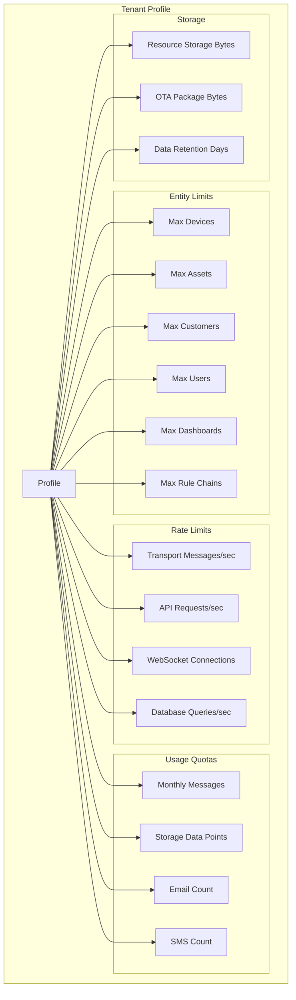
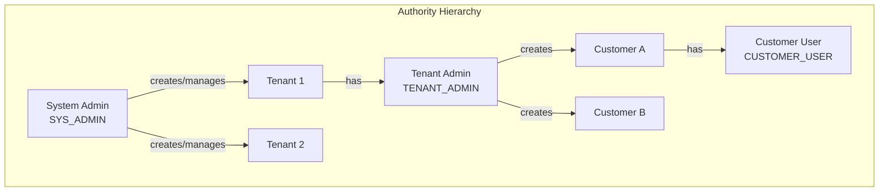
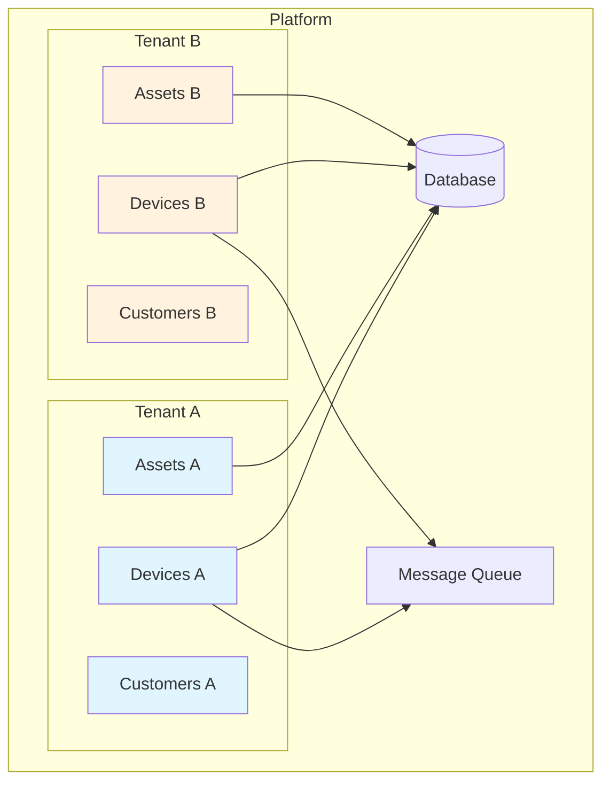
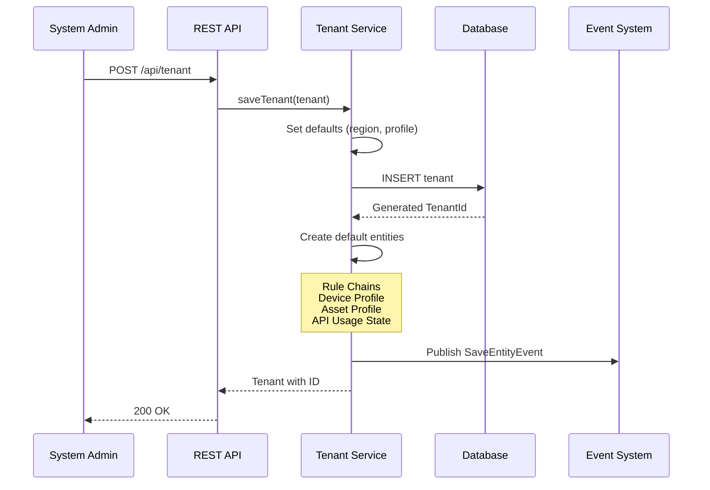
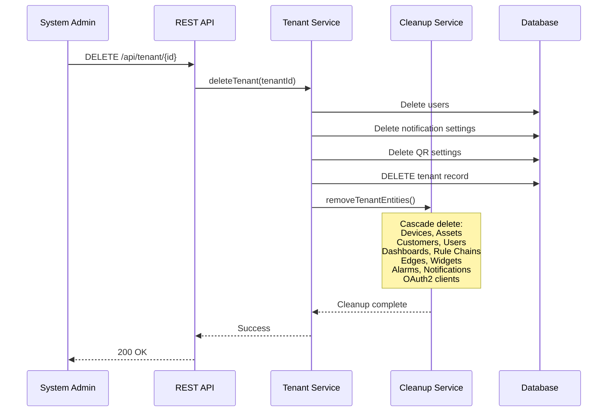
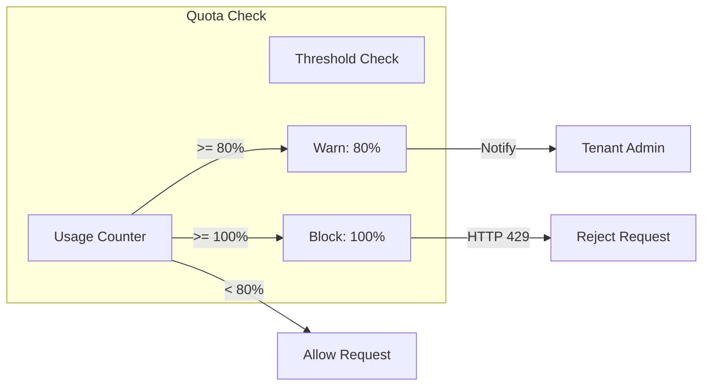
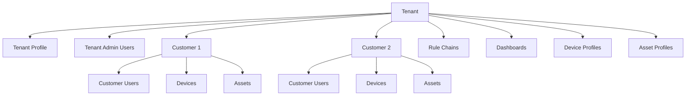

# Tenant Entity

## Overview

A Tenant is the fundamental organizational unit in ThingsBoard's multi-tenancy architecture. Each tenant represents a complete, isolated workspace - think of it as a separate SaaS customer account. All entities (devices, assets, customers, users, dashboards, rule chains) belong to exactly one tenant and are completely isolated from other tenants.

Tenants enable:
- **Complete Data Isolation**: Each tenant's data is invisible to other tenants
- **Resource Management**: Quotas and rate limits per tenant
- **Delegated Administration**: Tenant admins manage their own resources
- **Scalability**: Thousands of tenants on a single platform

## Key Behaviors

1. **Root Ownership**: Every entity in the system belongs to exactly one tenant. The tenant ID is the primary isolation boundary.

2. **Profile-Driven Limits**: Each tenant references a Tenant Profile that defines quotas, rate limits, and feature availability.

3. **Hierarchical Access**: Tenants can have multiple customers, and customers can have multiple users, creating a three-tier hierarchy.

4. **Cascade Deletion**: Deleting a tenant removes all entities belonging to it (devices, assets, customers, users, dashboards, etc.).

5. **Default Entity Creation**: New tenants automatically receive default rule chains, device profiles, and asset profiles.

## Data Structure

### Tenant Entity

| Field | Type | Description | Constraints |
|-------|------|-------------|-------------|
| id | UUID | Unique identifier | Auto-generated |
| title | string | Organization name | Required, max 255 chars |
| region | string | Geographic region | Defaults to "Global" |
| tenantProfileId | UUID | Reference to profile | Auto-assigned if not set |
| country | string | Country | Optional |
| state | string | State/Province | Optional |
| city | string | City | Optional |
| address | string | Street address | Optional |
| address2 | string | Additional address | Optional |
| zip | string | Postal code | Optional |
| phone | string | Phone number | Optional |
| email | string | Contact email | Optional |
| additionalInfo | object | Custom metadata | Free-form JSON |
| createdTime | timestamp | Creation time | Auto-set |
| version | integer | Optimistic locking | Auto-incremented on update |

### Example Tenant JSON

```json
{
  "id": {
    "entityType": "TENANT",
    "id": "13814000-1dd2-11b2-8080-808080808080"
  },
  "title": "Acme Corporation",
  "region": "North America",
  "tenantProfileId": {
    "entityType": "TENANT_PROFILE",
    "id": "784f3940-2f04-11ec-8f2e-4d7a8c12df56"
  },
  "country": "USA",
  "state": "California",
  "city": "San Francisco",
  "address": "123 Main Street",
  "zip": "94102",
  "phone": "+1-555-123-4567",
  "email": "admin@acme.com",
  "additionalInfo": {
    "description": "Primary corporate tenant",
    "homeDashboardId": "dashboard-uuid"
  },
  "createdTime": 1634567890123
}
```

## Tenant Profile

Tenant profiles define resource limits, rate limits, and behavioral configuration for tenants.

### Profile Structure

| Field | Type | Description |
|-------|------|-------------|
| id | UUID | Unique identifier |
| name | string | Profile name (e.g., "Premium", "Standard") |
| description | string | Human-readable description |
| isDefault | boolean | Used for new tenants without explicit profile |
| isolatedTbRuleEngine | boolean | Dedicated queue for rule engine (high-throughput tenants) |
| profileData | object | Configuration with all limits and quotas |

### Profile Configuration Categories



### Key Profile Settings

#### Entity Count Limits

| Setting | Description | Default |
|---------|-------------|---------|
| maxDevices | Maximum device entities | Unlimited |
| maxAssets | Maximum asset entities | Unlimited |
| maxCustomers | Maximum customer entities | Unlimited |
| maxUsers | Maximum user accounts | Unlimited |
| maxDashboards | Maximum dashboards | Unlimited |
| maxRuleChains | Maximum rule chains | Unlimited |
| maxEdges | Maximum edge gateways | Unlimited |

#### Rate Limits

Rate limits use the format `"limit1:window1,limit2:window2"` (e.g., `"1000:1,20000:60"` = 1000/sec or 20000/min).

| Setting | Description | Example |
|---------|-------------|---------|
| transportTenantMsgRateLimit | Tenant-wide message rate | "1000:1,20000:60" |
| transportDeviceMsgRateLimit | Per-device message rate | "10:1,600:60" |
| tenantServerRestLimitsConfiguration | REST API rate limit | "100:1,3000:60" |

#### Usage Quotas (Billing Period)

| Setting | Description |
|---------|-------------|
| maxTransportMessages | Total uplink messages |
| maxTransportDataPoints | Total telemetry data points |
| maxREExecutions | Rule engine executions |
| maxJSExecutions | JavaScript function calls |
| maxEmails | Email notifications |
| maxSms | SMS notifications |
| maxCreatedAlarms | Alarms generated |

#### Storage Limits

| Setting | Description |
|---------|-------------|
| maxResourcesInBytes | Total file storage |
| maxOtaPackagesInBytes | OTA package storage |
| defaultStorageTtlDays | Time-series retention |
| alarmsTtlDays | Alarm retention |

## Authority Model

ThingsBoard uses a three-tier authority model for access control.



### System Admin (SYS_ADMIN)

| Capability | Description |
|------------|-------------|
| Manage Tenants | Create, modify, delete any tenant |
| Manage Profiles | Create and assign tenant profiles |
| System Settings | Configure platform-wide settings |
| View All Data | Access any tenant's data for auditing |
| Quota Management | Set limits via profiles |

### Tenant Admin (TENANT_ADMIN)

| Capability | Description |
|------------|-------------|
| Manage Own Tenant | Modify title, region, contact info |
| Manage Customers | Create customers within tenant |
| Manage Users | Create tenant and customer users |
| Manage Entities | Full control of devices, assets, dashboards |
| View Usage | Monitor quota consumption |
| **Cannot** | Change assigned profile, access other tenants |

### Customer User (CUSTOMER_USER)

| Capability | Description |
|------------|-------------|
| View Assigned Resources | Devices, assets assigned to their customer |
| View Dashboards | Dashboards shared with their customer |
| **Cannot** | View tenant-level resources, manage customers |

## Multi-Tenancy Isolation



### Isolation Mechanisms

| Layer | Mechanism |
|-------|-----------|
| **Database** | All queries filtered by `tenant_id` column |
| **API** | Requests scoped to authenticated user's tenant |
| **Message Queue** | Tenant ID in message headers for routing |
| **WebSocket** | Subscriptions limited to user's tenant |
| **Cache** | Tenant-specific cache keys |

### Query-Level Isolation

Every database query includes tenant filtering:

```sql
SELECT * FROM device
WHERE tenant_id = ? AND name = ?
```

This prevents any cross-tenant data access at the database level.

### Queue Isolation

For high-throughput tenants, the `isolatedTbRuleEngine` profile setting enables a dedicated message queue:

- **Standard**: All tenants share the main rule engine queue
- **Isolated**: Tenant gets dedicated queue partition
- **Use Case**: Prevents one tenant from starving others

## Tenant Lifecycle



### Creation Phase

When a tenant is created:
1. System assigns default region ("Global") if not specified
2. Auto-assigns default tenant profile if none specified
3. Validates entity fields
4. Generates unique TenantId
5. Creates default entities:
   - Root rule chain
   - Edge rule chain (if edge enabled)
   - Default device profile
   - Default asset profile
   - API usage state for quota tracking
6. Publishes creation event for audit trail

### Update Phase

- Tenant title, region, contact info can be modified
- Changing profile may trigger queue reconfiguration
- Version field prevents concurrent update conflicts
- Update event published for audit trail

### Deletion Phase



All related entities are deleted in the correct order to respect foreign key constraints.

## REST API Endpoints

### Tenant Management

| Endpoint | Method | Auth | Purpose |
|----------|--------|------|---------|
| `/api/tenant/{tenantId}` | GET | SYS/TENANT_ADMIN | Get tenant by ID |
| `/api/tenant/info/{tenantId}` | GET | SYS/TENANT_ADMIN | Get tenant with profile name |
| `/api/tenant` | POST | SYS_ADMIN | Create or update tenant |
| `/api/tenant/{tenantId}` | DELETE | SYS/TENANT_ADMIN | Delete tenant |
| `/api/tenants` | GET | SYS_ADMIN | List all tenants (paginated) |
| `/api/tenantInfos` | GET | SYS_ADMIN | List tenants with profiles |
| `/api/tenants?tenantIds={ids}` | GET | SYS_ADMIN | Batch retrieve by IDs |

### Query Parameters

| Parameter | Description |
|-----------|-------------|
| pageSize | Items per page (default 10) |
| page | Page number (0-indexed) |
| textSearch | Filter by title |
| sortProperty | Sort field (createdTime, title, email, etc.) |
| sortOrder | ASC or DESC |

## Quota Tracking

### Usage Categories

| Category | Description | Unit |
|----------|-------------|------|
| Transport Messages | Device uplink messages | Count |
| Data Points | Telemetry data points | Count |
| Rule Engine Executions | Rule node invocations | Count |
| JS Executions | JavaScript function calls | Count |
| TBEL Executions | Expression evaluations | Count |
| Emails | Notification emails | Count |
| SMS | Text messages | Count |
| Created Alarms | Alarms generated | Count |
| Storage | Data retention | Days |

### Quota Enforcement



- **Warning Threshold**: At 80% of quota, system notifies tenant admin
- **Hard Limit**: At 100%, requests are throttled (HTTP 429)
- **Reset**: Quotas reset at billing period boundary

## Entity Hierarchy



### Entity Ownership

| Entity Type | Ownership | Notes |
|-------------|-----------|-------|
| Customer | Direct | Belongs to tenant |
| User | Via Role | TENANT_ADMIN or via Customer |
| Device | Via Customer | Or directly to tenant |
| Asset | Via Customer | Or directly to tenant |
| Dashboard | Direct | Can be shared with customers |
| Rule Chain | Direct | Tenant-specific processing |
| Device Profile | Direct | Templates for devices |
| Asset Profile | Direct | Templates for assets |
| Widget Bundle | Direct | Custom widgets |
| Edge | Direct | Edge gateways |

## Best Practices

### Tenant Organization

1. **Meaningful Names**: Use descriptive titles that identify the organization
2. **Regional Assignment**: Set region for geographic compliance requirements
3. **Profile Selection**: Choose profiles based on expected usage patterns
4. **Contact Info**: Maintain accurate contact information for billing/support

### Profile Design

1. **Tiered Profiles**: Create profiles for different service tiers (Free, Standard, Premium)
2. **Conservative Defaults**: Start with lower limits, increase based on usage
3. **Warning Thresholds**: Monitor usage at 80% to prevent service disruption
4. **Isolated Queues**: Enable for high-throughput tenants to prevent starvation

### Security Considerations

1. **Least Privilege**: Assign minimum required authority level
2. **Admin Accounts**: Limit TENANT_ADMIN accounts per tenant
3. **Customer Isolation**: Use customers to segment end-user access
4. **Audit Trail**: Review entity events for suspicious activity

## See Also

- [Customer Entity](./customer.md) - Tenant's sub-organizations
- [Multi-Tenancy Architecture](../../01-architecture/multi-tenancy.md) - Isolation patterns
- [Authentication](../../06-api-layer/authentication.md) - JWT and security
- [Authorization](../../09-security/authorization.md) - Permission model
- [Entity Types Overview](./entity-types-overview.md) - All entity types
