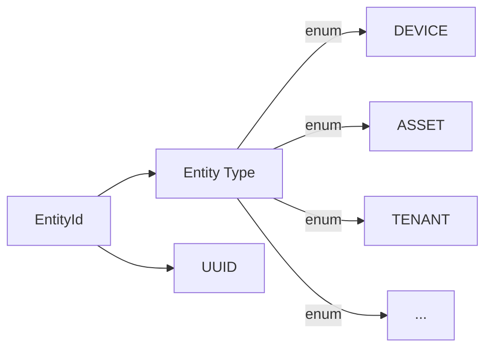

# Identity

## Overview

The identity system provides unique identification for all entities in the platform. Every object is addressable via a composite identifier that includes both the entity type and a UUID.

## Contents

| Document | Description |
|----------|-------------|
| [Entity IDs](./entity-ids.md) | UUID-based identification, type discrimination, and ID generation |

## Key Concepts

- **Entity ID Structure**: Composite of entity type enum + UUID
- **Type Safety**: IDs are type-discriminated (DeviceId vs AssetId)
- **UUID Generation**: Time-based UUIDs for ordering, random UUIDs for security
- **Cross-Reference**: Any entity can reference any other via EntityId
- **Serialization**: Consistent JSON/String representation across APIs

## ID Structure

## See Also

- [Entities](../entities/) - What IDs identify
- [API Layer](../../06-api-layer/) - How IDs appear in APIs
- [Data Persistence](../../07-data-persistence/) - How IDs are stored
