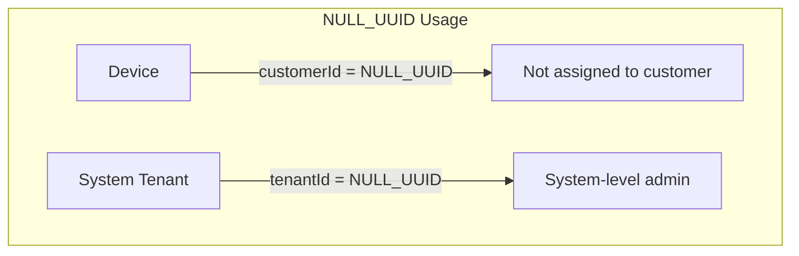
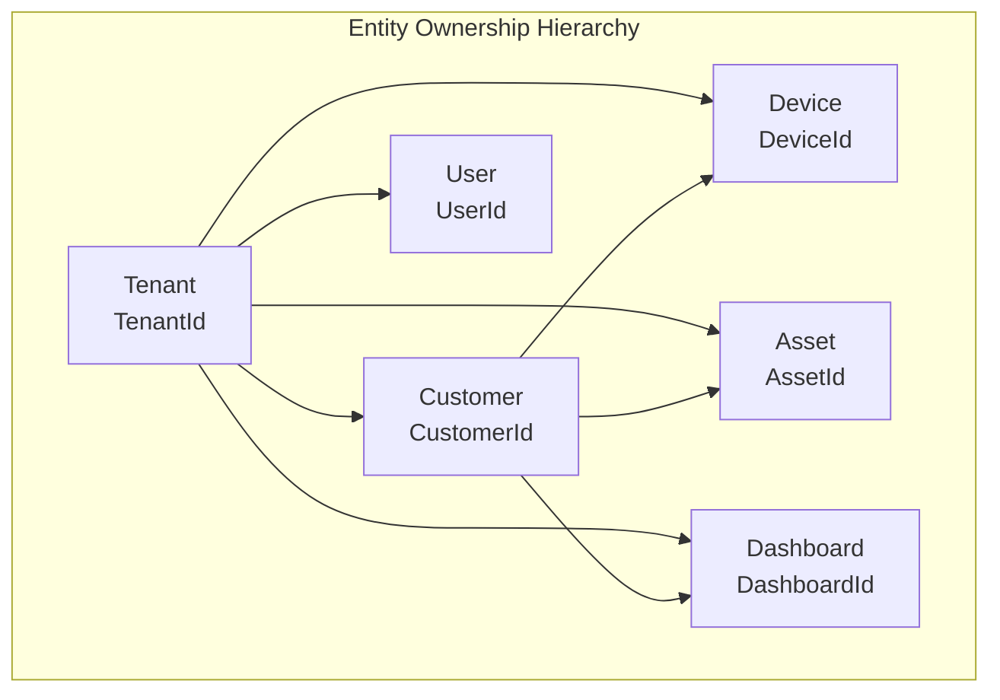
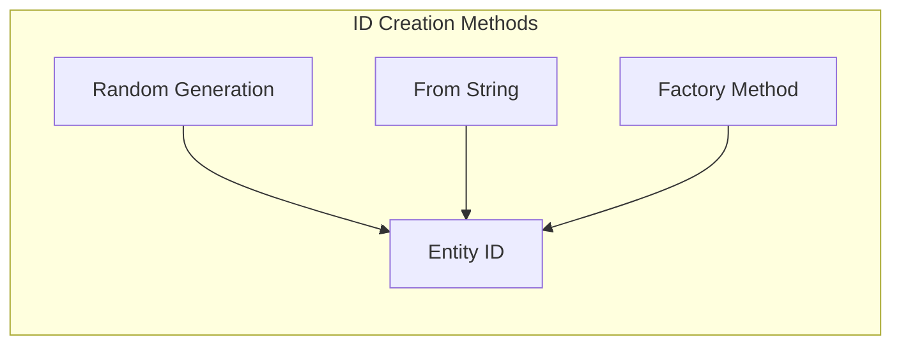
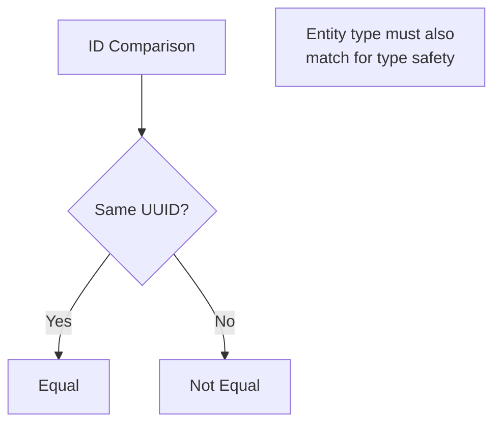
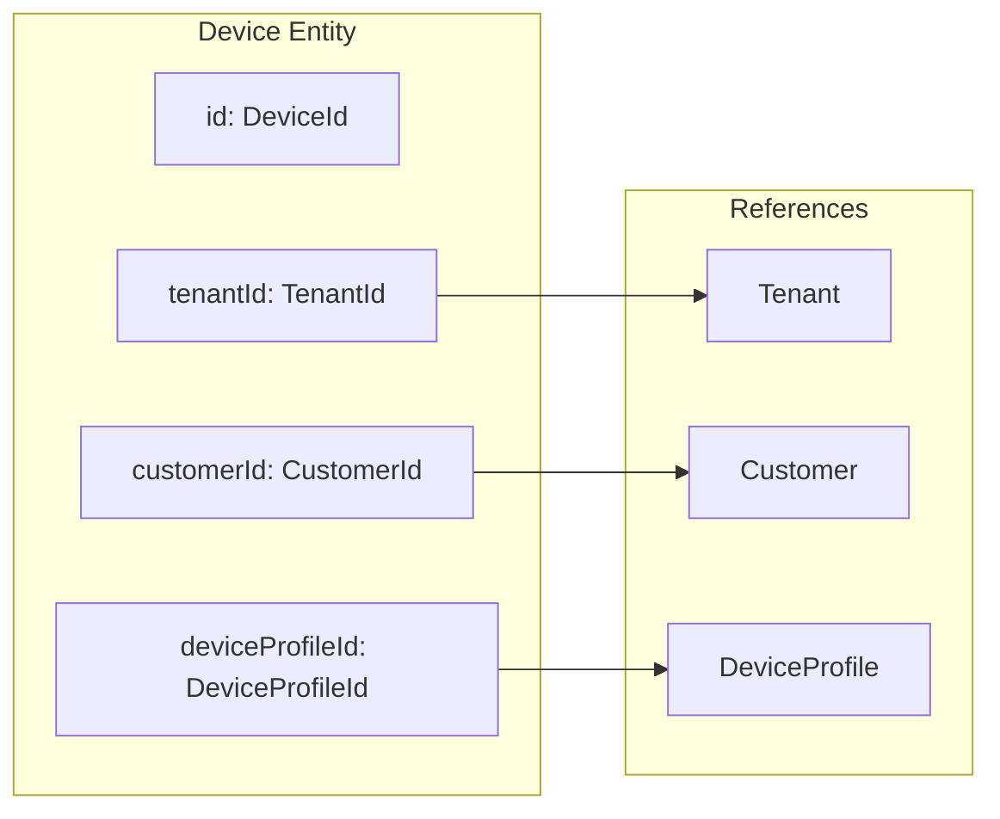
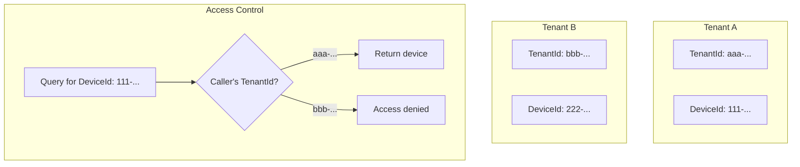
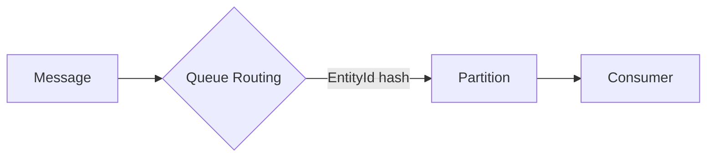
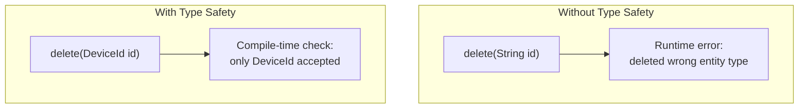

# Entity IDs

## Overview

Every entity in ThingsBoard has a unique identifier composed of two parts: an entity type and a UUID. This type-safe ID system enables the platform to distinguish between different kinds of entities while ensuring global uniqueness across distributed deployments.

## Key Behaviors

1. **Type-Safe**: Each entity type has its own ID class (DeviceId, AssetId, TenantId), preventing accidental mixing of different entity references.

2. **UUID-Based**: All IDs use UUID v4 format, guaranteeing uniqueness without central coordination.

3. **Immutable**: Once created, an ID cannot be changed.

4. **Two-Part Structure**: IDs always combine entityType + UUID, both required for complete identification.

5. **JSON Serializable**: IDs convert to/from JSON with a standard format used throughout APIs.

## ID Structure

### Anatomy of an Entity ID

```mermaid
graph LR
    subgraph "Entity ID"
        ET[entityType<br/>"DEVICE"] --- UUID[id<br/>"784f394c-42b6-435a-983c-b7beff2784f9"]
    end
```

| Component | Format | Example |
|-----------|--------|---------|
| entityType | Uppercase string | `DEVICE`, `ASSET`, `TENANT` |
| id | UUID v4 (36 chars) | `784f394c-42b6-435a-983c-b7beff2784f9` |

### UUID Format

```
784f394c-42b6-435a-983c-b7beff2784f9
├──────┤ ├──┤ ├──┤ ├──┤ ├──────────┤
   8      4    4    4       12       = 36 characters
```

- Standard UUID v4 format
- Hexadecimal digits with hyphens
- 128-bit value ensuring global uniqueness

## JSON Representation

### Standard Format

```json
{
  "entityType": "DEVICE",
  "id": "784f394c-42b6-435a-983c-b7beff2784f9"
}
```

### In Entity Context

```json
{
  "id": {
    "entityType": "DEVICE",
    "id": "784f394c-42b6-435a-983c-b7beff2784f9"
  },
  "tenantId": {
    "entityType": "TENANT",
    "id": "3db30ac6-db03-4788-98fe-6e024b422a15"
  },
  "customerId": {
    "entityType": "CUSTOMER",
    "id": "13814000-1dd2-11b2-8080-808080808080"
  },
  "name": "Temperature Sensor",
  "type": "sensor",
  "createdTime": 1627268171906
}
```

### String Representation

When converted to string (e.g., in URLs), only the UUID is used:
```
784f394c-42b6-435a-983c-b7beff2784f9
```

The entity type is determined from context (API path, parameter name).

## Entity Types

ThingsBoard supports 44 entity types:

### Core Entities

| Entity Type | Purpose |
|-------------|---------|
| TENANT | Top-level organization/account |
| CUSTOMER | End-user organization within tenant |
| USER | System user account |
| DEVICE | IoT device |
| ASSET | Physical or logical asset |
| DASHBOARD | Data visualization |
| ALARM | Alert condition |

### Configuration Entities

| Entity Type | Purpose |
|-------------|---------|
| DEVICE_PROFILE | Device configuration template |
| ASSET_PROFILE | Asset configuration template |
| TENANT_PROFILE | Tenant configuration template |
| RULE_CHAIN | Processing rule sequence |
| RULE_NODE | Individual rule step |
| WIDGETS_BUNDLE | Widget collection |
| WIDGET_TYPE | Widget definition |

### Data & Communication

| Entity Type | Purpose |
|-------------|---------|
| ENTITY_VIEW | Filtered entity view |
| RPC | Remote procedure call |
| QUEUE | Message queue |
| OTA_PACKAGE | Firmware/software package |
| TB_RESOURCE | System resource (file, image) |

### Notifications

| Entity Type | Purpose |
|-------------|---------|
| NOTIFICATION | Individual notification |
| NOTIFICATION_TARGET | Delivery endpoint |
| NOTIFICATION_REQUEST | Dispatch request |
| NOTIFICATION_RULE | Trigger condition |
| NOTIFICATION_TEMPLATE | Message template |

### Infrastructure

| Entity Type | Purpose |
|-------------|---------|
| EDGE | Edge computing gateway |
| QUEUE_STATS | Queue metrics |
| API_USAGE_STATE | API consumption tracking |
| ADMIN_SETTINGS | System configuration |

### Security & Integration

| Entity Type | Purpose |
|-------------|---------|
| API_KEY | API authentication credential |
| OAUTH2_CLIENT | OAuth2 application |
| DOMAIN | Multi-tenancy domain |

### Advanced Features

| Entity Type | Purpose |
|-------------|---------|
| CALCULATED_FIELD | Computed data field |
| JOB | Scheduled/batch job |
| AI_MODEL | Machine learning model |
| MOBILE_APP | Mobile app configuration |
| MOBILE_APP_BUNDLE | Mobile app collection |

## Special ID Values

### NULL_UUID

```
13814000-1dd2-11b2-8080-808080808080
```

| Purpose | Example |
|---------|---------|
| Unassigned customer | Device not assigned to any customer |
| System tenant | Built-in administrative tenant |
| Deleted reference | Entity was deleted but reference remains |



### System Tenant ID (SYS_TENANT_ID)

- Uses NULL_UUID value
- Represents the system itself
- Owns system-level resources
- Used for administrative operations

## ID Hierarchy



Most entities reference their parent via ID fields:
- `tenantId` - Owner tenant
- `customerId` - Assigned customer (optional)
- Other references (deviceProfileId, ruleChainId, etc.)

## REST API Patterns

### Path Parameters

```
GET    /api/device/{deviceId}
GET    /api/asset/{assetId}
DELETE /api/device/{deviceId}
POST   /api/customer/{customerId}/device/{deviceId}
```

### Query Parameters

```
GET /api/devices?deviceIds=id1,id2,id3
GET /api/relations?fromId={entityId}&fromType=DEVICE
```

### Request Body

```json
POST /api/device
{
  "name": "New Device",
  "deviceProfileId": {
    "entityType": "DEVICE_PROFILE",
    "id": "b99fde7a-33dd-4d5d-a325-d0637f6acbe5"
  }
}
```

### Response Body

```json
{
  "id": {
    "entityType": "DEVICE",
    "id": "784f394c-42b6-435a-983c-b7beff2784f9"
  },
  "createdTime": 1627268171906,
  "tenantId": {
    "entityType": "TENANT",
    "id": "3db30ac6-db03-4788-98fe-6e024b422a15"
  },
  "name": "New Device"
}
```

## ID Operations

### Creation



| Method | Input | Use Case |
|--------|-------|----------|
| Random | None | New entity creation |
| From String | UUID string | API requests, deserialization |
| Factory | Type + UUID | Dynamic type resolution |

### Validation

| Check | Purpose |
|-------|---------|
| UUID format | Valid 36-character UUID |
| Entity type | Known entity type string |
| Null check | Not NULL_UUID for required fields |

### Comparison

IDs are equal if their UUIDs match:



## Cross-Entity References

### Foreign Key Pattern



### Common Reference Fields

| Field | Type | Required | Purpose |
|-------|------|----------|---------|
| tenantId | TenantId | Yes | Owner tenant |
| customerId | CustomerId | No | Assigned customer |
| deviceProfileId | DeviceProfileId | Yes* | Device template |
| assetProfileId | AssetProfileId | Yes* | Asset template |
| defaultRuleChainId | RuleChainId | No | Processing rules |
| defaultDashboardId | DashboardId | No | Default view |

*Required for that entity type

## Multi-Tenancy

IDs enable tenant isolation:



- IDs themselves don't contain tenant information
- Tenant isolation enforced at data access layer
- Every query filtered by caller's tenant context

## ID Usage Across System

### In Database

- Primary keys for entity tables
- Foreign keys for relationships
- Indexed for fast lookups

### In Message Queue



- EntityId determines message routing
- Consistent hashing for partition assignment
- Ensures ordered processing per entity

### In Rule Engine

- Messages tagged with originator EntityId
- Rules filter and route by entity type
- Actions reference target EntityIds

### In Caching

- EntityId as cache key
- Fast lookups for frequently accessed entities
- Cache invalidation by EntityId

## Type Safety Benefits



| Benefit | Description |
|---------|-------------|
| Compile-time checks | Wrong ID type caught before runtime |
| Self-documenting | Method signatures show expected types |
| Refactoring safety | IDE can find all usages of specific ID type |
| Reduced bugs | Cannot accidentally mix device and asset IDs |

## Common Patterns

### Checking for Unassigned

```
if (device.getCustomerId().isNullUid()) {
    // Device not assigned to any customer
}
```

### Creating References

```json
// Assign device to customer
{
  "customerId": {
    "entityType": "CUSTOMER",
    "id": "23a14000-1dd2-11b2-8080-808080808080"
  }
}
```

### Unassigning

```json
// Unassign device from customer
{
  "customerId": {
    "entityType": "CUSTOMER",
    "id": "13814000-1dd2-11b2-8080-808080808080"
  }
}
```
(Using NULL_UUID)

## Edge Cases

### Invalid UUID Format

- Parsing fails with error
- API returns 400 Bad Request
- Must be exactly 36 characters with proper format

### Unknown Entity Type

- Factory method throws error
- API returns 400 Bad Request
- Must match known EntityType enum value

### Deleted Entity Reference

- ID remains valid syntactically
- Lookup returns "not found"
- Cascade deletes may leave orphan references

### Concurrent Creation

- UUID generation is thread-safe
- No central coordination required
- Collision probability negligible (1 in 2^122)

## Implementation Details

### EntityId Interface Hierarchy

The `EntityId` interface defines the contract for all entity identifiers:

```
EntityId (interface)
├── UUIDBased (abstract)
│   ├── TenantId
│   ├── CustomerId
│   ├── UserId
│   ├── DeviceId
│   ├── AssetId
│   └── ... (45+ implementations)
```

Each ID class provides:
- `getEntityType()` - Returns the `EntityType` enum value
- `getId()` - Returns the UUID
- Type-safe construction and comparison

### EntityIdFactory

`EntityIdFactory` provides dynamic ID creation from type and UUID:

```
EntityIdFactory.getByTypeAndId(EntityType type, String uuid)
EntityIdFactory.getByTypeAndUuid(EntityType type, UUID uuid)
```

Used for:
- JSON deserialization
- Dynamic entity resolution
- Generic entity handling in rule engine

### Serialization Support

**JSON Serialization** (via Jackson):
- `EntityIdSerializer` writes `{"entityType": "...", "id": "..."}`
- `EntityIdDeserializer` reconstructs type-safe ID from JSON
- Handles nested ID fields in entities

**Protobuf Serialization**:
- Used for inter-service communication via Kafka
- More compact binary format
- `EntityIdProto` message type in transport protocol

### ID Caching Pattern

`TenantId` and `EdgeId` use soft reference caching for memory efficiency:

```
private static final ReferenceQueue<TenantId> REFS = new ReferenceQueue<>();
private static final ConcurrentMap<UUID, SoftReference<TenantId>> CACHE = new ConcurrentHashMap<>();

public static TenantId fromUUID(UUID uuid) {
    // Check cache first, create and cache if missing
    // SoftReference allows GC under memory pressure
}
```

Benefits:
- Same `TenantId` instance reused across system
- Reduces object allocation for hot paths
- Automatic cleanup when memory pressure increases

### NULL_UUID Implementation

The NULL_UUID constant is defined in `EntityId` interface:
```
UUID NULL_UUID = UUID.fromString("13814000-1dd2-11b2-8080-808080808080");
```

Each ID type provides a `isNullUid()` method:
- Returns `true` if ID equals NULL_UUID
- Used to check for unassigned optional references

## Performance Considerations

### ID Caching

Some frequently-used ID types are cached:
- TenantId - cached with soft references
- EdgeId - cached with soft references

Benefits:
- Reduced memory for repeated IDs
- Faster equality checks (same object)
- Automatic cleanup when memory needed

### Database Indexing

- All ID columns are indexed
- Composite indexes for tenant + entity ID
- UUID comparison is efficient (binary comparison)

## Common Pitfalls

### ID Format Pitfalls

| Pitfall | Impact | Solution |
|---------|--------|----------|
| **Invalid UUID format** | 400 Bad Request | Validate 36-character format with proper hyphens |
| **Uppercase UUID** | Usually accepted but inconsistent | Use lowercase for consistency |
| **Missing entity type** | Cannot determine ID class | Always include entityType in JSON representation |
| **Wrong entity type** | Type-safe cast fails at runtime | Verify entityType matches expected entity |

### NULL_UUID Pitfalls

| Pitfall | Impact | Solution |
|---------|--------|----------|
| **Comparing to null instead of NULL_UUID** | Logic errors; unassigned not detected | Use `isNullUid()` method instead of null check |
| **Treating NULL_UUID as "no entity"** | NULL_UUID is valid for system tenant | Check isNullUid() explicitly for optional references |
| **Hardcoding NULL_UUID string** | Typo-prone; maintenance burden | Use EntityId.NULL_UUID constant |

### Reference Pitfalls

| Pitfall | Impact | Solution |
|---------|--------|----------|
| **Storing ID as string without type** | Cannot reconstruct type-safe ID | Store both entityType and UUID |
| **Deleted entity reference** | "Not found" on lookup; orphaned references | Handle deletion cascades; validate references on access |
| **Cross-tenant ID usage** | Security violation; access denied | IDs don't encode tenant; validate tenant context |
| **ID reuse after deletion** | UUIDs are unique; old ID never reused | Design for immutable ID references |

### API Integration Pitfalls

| Pitfall | Impact | Solution |
|---------|--------|----------|
| **Using wrong ID in path** | 404 or wrong entity modified | Double-check ID extraction from correct entity |
| **ID type mismatch in request body** | Validation error | Ensure nested IDs have correct entityType |
| **Batch operations with mixed types** | Some operations fail | Validate all IDs in batch before execution |

### Serialization Pitfalls

| Pitfall | Impact | Solution |
|---------|--------|----------|
| **JSON deserialization without type** | Cannot instantiate correct ID class | Use EntityIdFactory for dynamic deserialization |
| **Proto serialization losing type** | Type must be sent separately | Include EntityType in proto message |
| **String parsing without validation** | Invalid UUID causes runtime exception | Validate UUID format before parsing |

### Performance Pitfalls

| Pitfall | Impact | Solution |
|---------|--------|----------|
| **Creating new ID instances in hot paths** | Object allocation overhead | TenantId and EdgeId use caching; leverage it |
| **ID comparison via string conversion** | Slower than UUID comparison | Use equals() method on ID objects |
| **Logging full IDs** | Verbose logs; storage overhead | Log abbreviated IDs in high-volume scenarios |

## See Also

- [Entity Types Overview](../entities/entity-types-overview.md) - All entity types
- [Multi-Tenancy](../../01-architecture/multi-tenancy.md) - Tenant isolation
- [REST API Overview](../../06-api-layer/rest-api-overview.md) - API patterns
- [Database Schema](../../07-data-persistence/database-schema.md) - ID storage
