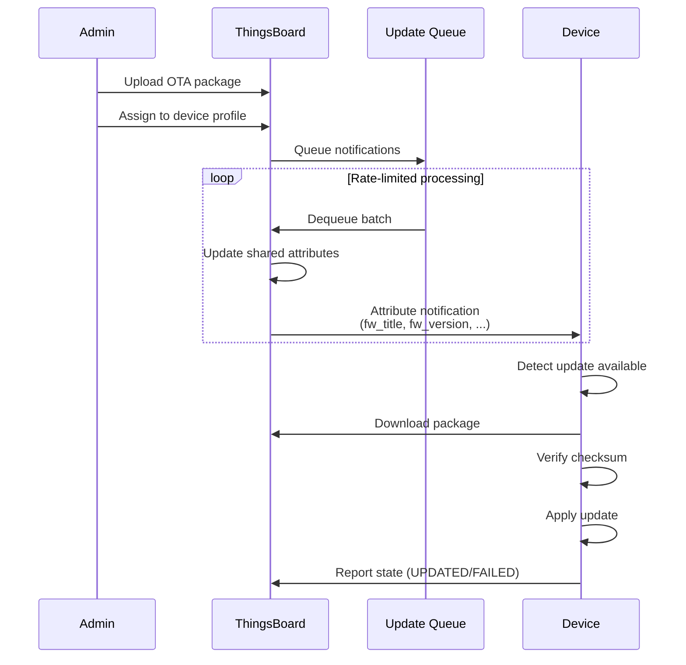
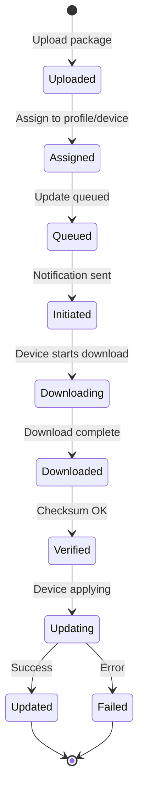
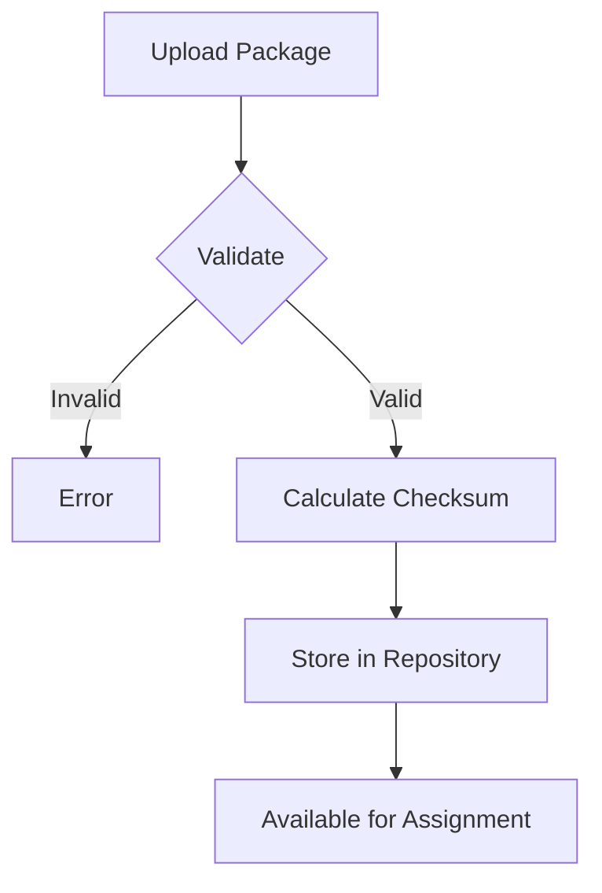
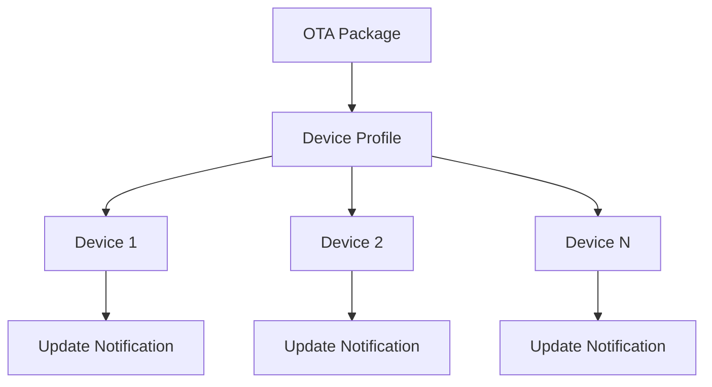
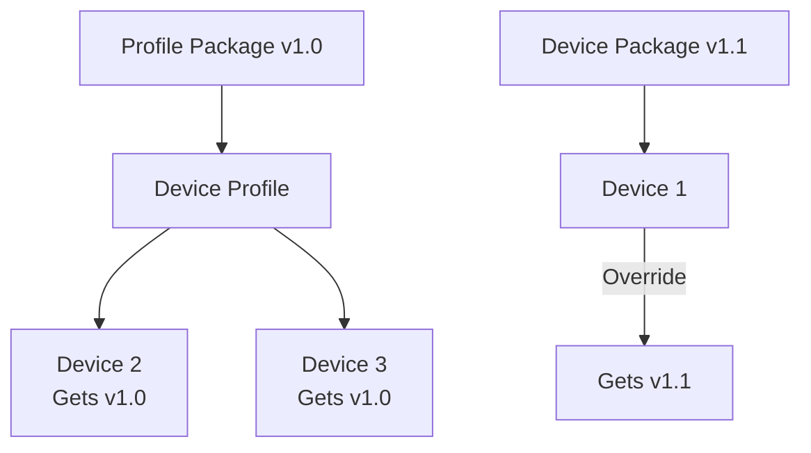
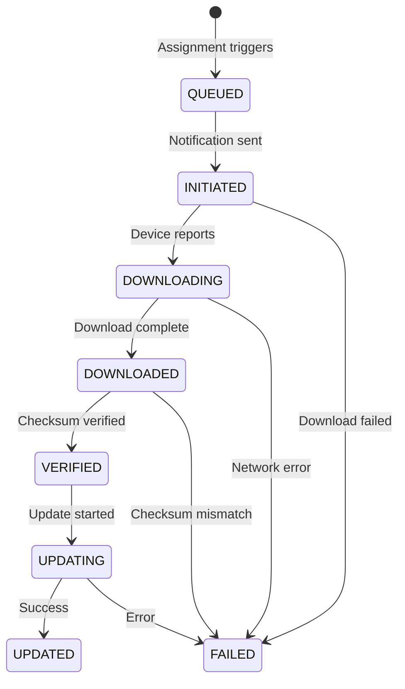
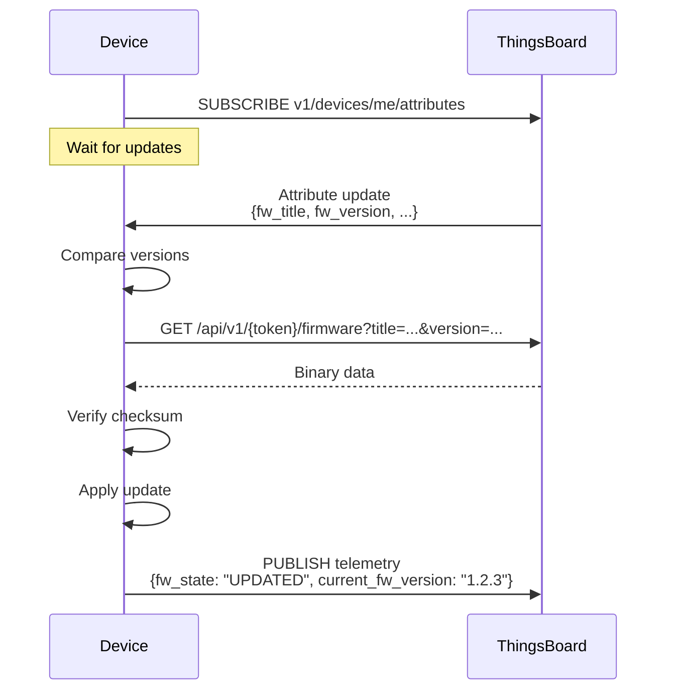
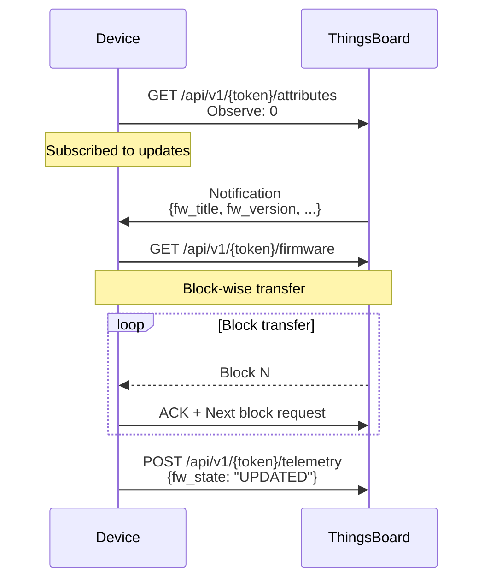
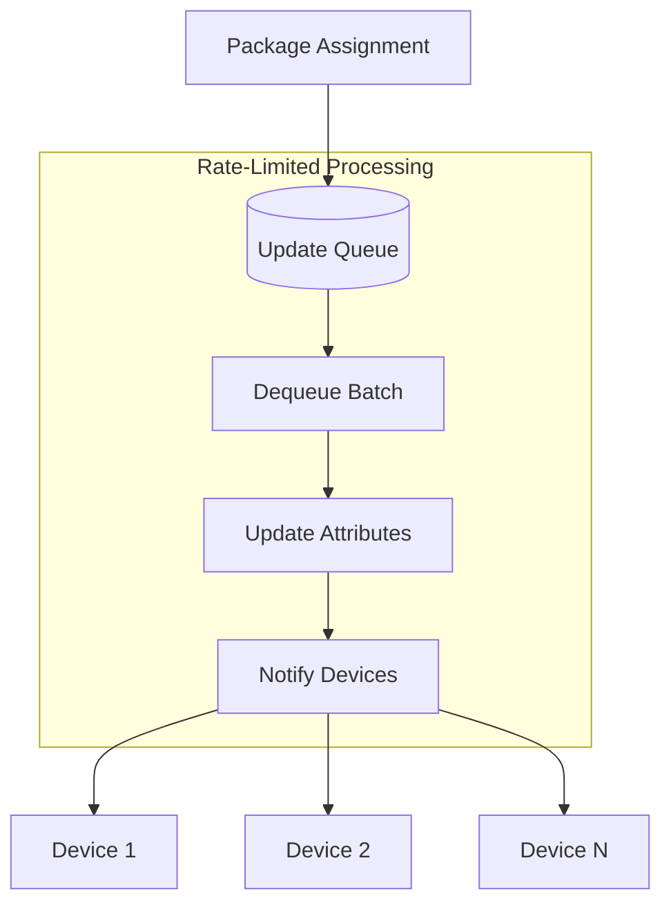

# OTA Updates

## Overview

ThingsBoard provides Over-the-Air (OTA) update capabilities for distributing firmware and software packages to devices. Administrators upload packages to the OTA repository, assign them to device profiles or individual devices, and ThingsBoard notifies devices about available updates. The platform tracks update progress and provides monitoring dashboards for fleet-wide visibility.

## Key Behaviors

1. **Package Repository**: Central storage for firmware and software packages with versioning.

2. **Profile-Level Assignment**: Distribute updates to all devices sharing a device profile.

3. **Device-Level Override**: Assign specific package versions to individual devices.

4. **Progress Tracking**: Monitor update states via device attributes and dashboards.

5. **Protocol Support**: Works with MQTT, HTTP, CoAP, and LwM2M transports.

## OTA Architecture

### Update Flow



### Package Lifecycle



## Package Management

### Package Properties

| Property | Required | Description |
|----------|----------|-------------|
| Title | Yes | Package name (e.g., "Sensor Firmware") |
| Version | Yes | Semantic version (e.g., "1.2.3") |
| Device Profile | Yes | Compatible device profile |
| Type | Yes | Firmware or Software |
| Checksum Algorithm | No | MD5, SHA-256, SHA-384, SHA-512 (default: SHA-256) |
| Checksum | No | Package checksum (auto-calculated if omitted) |
| Description | No | Package description |

### Package Constraints

- Title + Version must be unique per tenant
- Package size limit: 2 GB
- Cannot delete packages assigned to devices or profiles

### Upload Package



### REST API

**Upload Package:**
```bash
curl -X POST \
  -H "Authorization: Bearer $JWT_TOKEN" \
  -F "file=@firmware-v1.2.3.bin" \
  -F "title=Sensor Firmware" \
  -F "version=1.2.3" \
  -F "deviceProfileId=$PROFILE_ID" \
  -F "type=FIRMWARE" \
  "https://thingsboard.example.com/api/otaPackage"
```

**List Packages:**
```bash
curl -X GET \
  -H "Authorization: Bearer $JWT_TOKEN" \
  "https://thingsboard.example.com/api/otaPackages?pageSize=10&page=0"
```

## Firmware vs Software

### Comparison

| Aspect | Firmware (FOTA) | Software (SOTA) |
|--------|-----------------|-----------------|
| Object ID (LwM2M) | Object 5 | Object 9 |
| Attribute Prefix | `fw_` | `sw_` |
| Typical Use | Device OS, bootloader | Application, agents |
| Update Mechanism | Flash, reboot | Service restart |

### Attribute Naming

| Firmware Attribute | Software Attribute | Description |
|--------------------|--------------------| ------------|
| `fw_title` | `sw_title` | Package name |
| `fw_version` | `sw_version` | Package version |
| `fw_size` | `sw_size` | File size (bytes) |
| `fw_checksum` | `sw_checksum` | Checksum value |
| `fw_checksum_algorithm` | `sw_checksum_algorithm` | Algorithm used |
| `fw_state` | `sw_state` | Update state |
| `current_fw_title` | `current_sw_title` | Installed title |
| `current_fw_version` | `current_sw_version` | Installed version |

## Assignment

### Profile-Level Assignment

Assign a package to a device profile to update all devices using that profile.



**Assignment via REST API:**
```bash
curl -X POST \
  -H "Authorization: Bearer $JWT_TOKEN" \
  -H "Content-Type: application/json" \
  -d '{"firmwareId": {"id": "$PACKAGE_ID", "entityType": "OTA_PACKAGE"}}' \
  "https://thingsboard.example.com/api/deviceProfile/$PROFILE_ID"
```

### Device-Level Assignment

Override profile assignment for specific devices.



**Assignment Priority:**
1. Device-level assignment (highest)
2. Profile-level assignment (fallback)

## Update States

### State Machine



### State Descriptions

| State | Description | Set By |
|-------|-------------|--------|
| QUEUED | Update queued, notification pending | Server |
| INITIATED | Notification sent to device | Server |
| DOWNLOADING | Device downloading package | Device |
| DOWNLOADED | Download complete | Device |
| VERIFIED | Checksum verified | Device |
| UPDATING | Update in progress | Device |
| UPDATED | Update successful | Device |
| FAILED | Update failed | Device |

### State Telemetry

Devices report state changes via telemetry:

**Progress Update:**
```json
{
  "fw_state": "DOWNLOADING"
}
```

**Success:**
```json
{
  "current_fw_title": "Sensor Firmware",
  "current_fw_version": "1.2.3",
  "fw_state": "UPDATED"
}
```

**Failure:**
```json
{
  "fw_state": "FAILED",
  "fw_error": "Checksum verification failed"
}
```

## Protocol Implementation

### Shared Attribute Notification

When an update is assigned, ThingsBoard sets these shared attributes:

```json
{
  "fw_title": "Sensor Firmware",
  "fw_version": "1.2.3",
  "fw_size": 1048576,
  "fw_checksum": "abc123...",
  "fw_checksum_algorithm": "SHA256"
}
```

### MQTT Implementation



### HTTP Implementation

**Attribute Subscription (Long Polling):**
```bash
curl -X GET \
  "http://localhost:8080/api/v1/{token}/attributes/updates?timeout=60000"
```

**Package Download:**
```bash
curl -X GET \
  "http://localhost:8080/api/v1/{token}/firmware?title=Sensor%20Firmware&version=1.2.3" \
  -o firmware.bin
```

**Chunked Download:**
```bash
# Download in 4KB chunks
curl -X GET \
  "http://localhost:8080/api/v1/{token}/firmware?title=...&version=...&size=4096&chunk=0" \
  -o chunk0.bin

curl -X GET \
  "http://localhost:8080/api/v1/{token}/firmware?title=...&version=...&size=4096&chunk=1" \
  -o chunk1.bin
```

### CoAP Implementation



### LwM2M Implementation

LwM2M uses standardized objects for firmware/software updates:

**Object 5: Firmware Update**
| Resource | ID | Description |
|----------|------|-------------|
| Package | 0 | Binary data |
| Package URI | 1 | Download URL |
| Update | 2 | Execute update |
| State | 3 | Current state |
| Update Result | 5 | Result code |

**Object 9: Software Management**
| Resource | ID | Description |
|----------|------|-------------|
| Package | 2 | Binary data |
| Package URI | 3 | Download URL |
| Install | 4 | Execute install |
| State | 7 | Current state |
| Update Result | 9 | Result code |

## Queue Processing

### Rate Limiting

OTA notifications are queued to prevent system overload:

| Configuration | Default | Description |
|---------------|---------|-------------|
| `TB_QUEUE_CORE_FW_PACK_INTERVAL_MS` | 60000 | Processing interval (ms) |
| `TB_QUEUE_CORE_FW_PACK_SIZE` | 100 | Devices per interval |

**Default Behavior:** Up to 100 devices notified per minute.

### Queue Flow



## Monitoring Dashboard

### Firmware Dashboard

ThingsBoard provides a built-in firmware monitoring dashboard:

| Panel | Description |
|-------|-------------|
| Device List | All devices with firmware info |
| Update Status | Current state per device |
| History | Update history timeline |
| Failed Devices | Devices with failed updates |

### Key Metrics

| Metric | Description |
|--------|-------------|
| Pending updates | Devices in QUEUED/INITIATED state |
| In progress | Devices in DOWNLOADING/UPDATING state |
| Updated | Devices successfully updated |
| Failed | Devices with update failures |
| Coverage | Percentage of fleet on target version |

## Implementation Examples

### Python MQTT Example

```python
import paho.mqtt.client as mqtt
import json
import requests
import hashlib

THINGSBOARD_HOST = "localhost"
ACCESS_TOKEN = "DEVICE_ACCESS_TOKEN"

current_fw_version = "1.0.0"
target_fw = None

def on_connect(client, userdata, flags, rc):
    # Subscribe to attribute updates
    client.subscribe("v1/devices/me/attributes")
    # Request current shared attributes
    client.publish("v1/devices/me/attributes/request/1",
                   json.dumps({"sharedKeys": "fw_title,fw_version,fw_checksum,fw_size"}))

def on_message(client, userdata, msg):
    global target_fw, current_fw_version

    data = json.loads(msg.payload)

    # Check for firmware update
    if "fw_version" in data.get("shared", data):
        fw_data = data.get("shared", data)
        if fw_data["fw_version"] != current_fw_version:
            target_fw = fw_data
            print(f"Update available: {fw_data['fw_version']}")
            start_update(client)

def start_update(client):
    global target_fw, current_fw_version

    # Report downloading
    client.publish("v1/devices/me/telemetry",
                   json.dumps({"fw_state": "DOWNLOADING"}))

    # Download firmware via HTTP
    url = f"http://{THINGSBOARD_HOST}:8080/api/v1/{ACCESS_TOKEN}/firmware"
    params = {"title": target_fw["fw_title"], "version": target_fw["fw_version"]}
    response = requests.get(url, params=params)

    # Report downloaded
    client.publish("v1/devices/me/telemetry",
                   json.dumps({"fw_state": "DOWNLOADED"}))

    # Verify checksum
    checksum = hashlib.sha256(response.content).hexdigest()
    if checksum != target_fw["fw_checksum"]:
        client.publish("v1/devices/me/telemetry",
                       json.dumps({"fw_state": "FAILED", "fw_error": "Checksum mismatch"}))
        return

    # Report verified
    client.publish("v1/devices/me/telemetry",
                   json.dumps({"fw_state": "VERIFIED"}))

    # Apply update (simulated)
    client.publish("v1/devices/me/telemetry",
                   json.dumps({"fw_state": "UPDATING"}))

    # Simulate update
    # In real firmware: flash, reboot, etc.

    # Report success
    current_fw_version = target_fw["fw_version"]
    client.publish("v1/devices/me/telemetry", json.dumps({
        "fw_state": "UPDATED",
        "current_fw_title": target_fw["fw_title"],
        "current_fw_version": current_fw_version
    }))

# Connect and run
client = mqtt.Client()
client.username_pw_set(ACCESS_TOKEN)
client.on_connect = on_connect
client.on_message = on_message
client.connect(THINGSBOARD_HOST, 1883)
client.loop_forever()
```

## Best Practices

### Package Management

| Practice | Benefit |
|----------|---------|
| Semantic versioning | Clear version progression |
| Unique title per product | Easy identification |
| Include checksums | Integrity verification |
| Test before deployment | Reduce failures |

### Deployment Strategy

| Practice | Benefit |
|----------|---------|
| Staged rollout | Limit blast radius |
| Device-level testing | Validate before fleet |
| Monitor failures | Quick response |
| Rollback plan | Recovery path |

### Device Implementation

| Practice | Benefit |
|----------|---------|
| Verify checksum | Prevent corruption |
| Report all states | Full visibility |
| Handle failures | Graceful recovery |
| Dual partition | Safe rollback |

## Troubleshooting

### Common Issues

| Issue | Cause | Solution |
|-------|-------|----------|
| Update stuck in QUEUED | Rate limiting | Wait or increase pack size |
| Device not receiving | Not subscribed | Check attribute subscription |
| Checksum mismatch | Corrupted download | Retry download |
| Update fails | Incompatible package | Verify device profile match |

### Debug Steps

1. Check device profile assignment
2. Verify shared attributes on device
3. Check device subscription to attributes
4. Review device telemetry for state updates
5. Check device logs for errors

## See Also

- [Device Provisioning](./device-provisioning.md) - Device registration
- [Device Entity](./entities/device.md) - Device data model
- [MQTT Protocol](../05-transport-layer/mqtt.md) - MQTT attribute subscription
- [LwM2M Protocol](../05-transport-layer/lwm2m.md) - LwM2M OTA objects
- [Attributes Data Model](./data-model/attributes.md) - Shared attributes
