# Actor System

## Overview

The actor system is the concurrency foundation of the platform. Each device, tenant, and rule chain has a dedicated actor that processes messages sequentially in its own mailbox. This eliminates race conditions, enables massive concurrency, and provides fault isolation without complex locking.

## Why Actors?

### The Problem
An IoT platform must handle millions of concurrent devices, each potentially sending data simultaneously. Traditional approaches face challenges:

- **Thread-per-device**: Exhausts OS thread limits
- **Shared state with locks**: Complex, deadlock-prone, limits parallelism
- **Thread pools with shared queues**: Race conditions when multiple threads access same device state

### The Actor Solution
Actors provide:

1. **Sequential Processing**: Each actor processes one message at a time - no concurrent access to its state
2. **Isolation**: Actor failures don't crash other actors
3. **Scalability**: Millions of lightweight actors can exist concurrently
4. **Location Transparency**: Actors can be distributed across cluster nodes

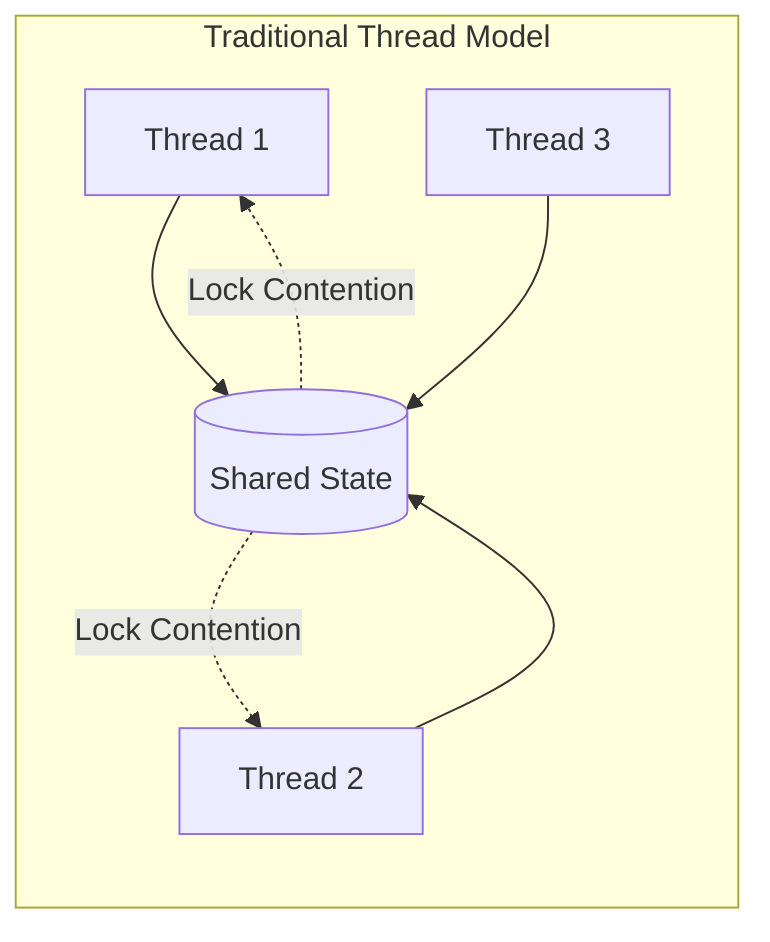

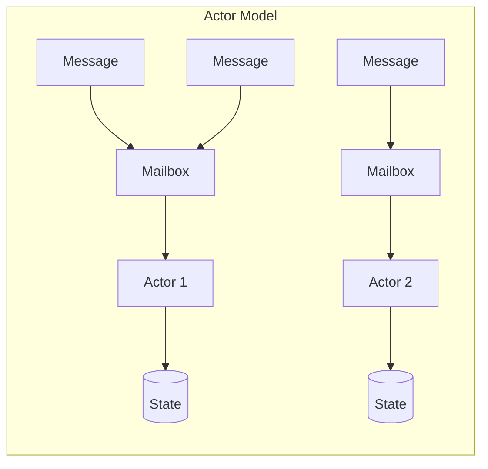

## Actor Hierarchy

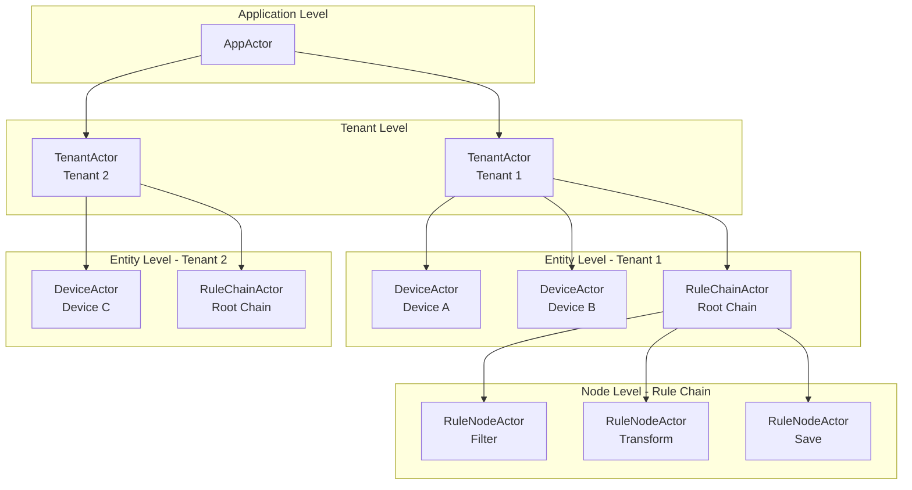

### Actor Types

| Actor | Parent | Responsibility |
|-------|--------|----------------|
| AppActor | System | Top-level orchestration, tenant lifecycle |
| TenantActor | AppActor | Tenant isolation, routes to devices/rule chains |
| DeviceActor | TenantActor | Device sessions, RPC handling, credential updates |
| RuleChainActor | TenantActor | Rule chain lifecycle, routes to rule nodes |
| RuleChainManagerActor | TenantActor | Manages multiple rule chains |
| RuleNodeActor | RuleChainActor | Individual node processing logic |
| RuleEngineComponentActor | RuleChainActor | Base for rule engine components |
| CalculatedFieldManagerActor | TenantActor | Manages calculated field actors |
| CalculatedFieldEntityActor | CalculatedFieldManagerActor | Per-entity calculated fields |
| StatsActor | System | Platform statistics collection |
| RuleChainErrorActor | System | Error handling for failed rule chains |

## Message Flow

### Telemetry Ingestion

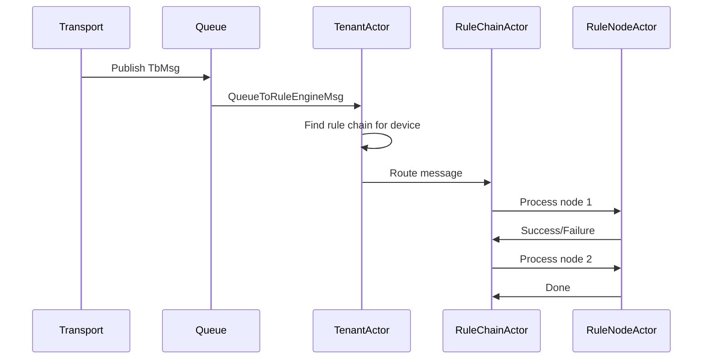

### Device Actor Processing

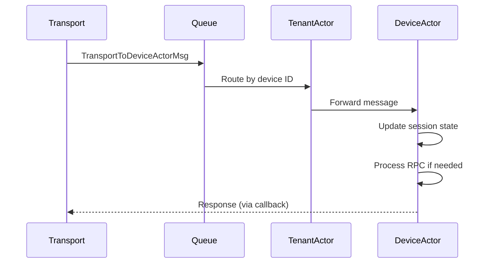

## Actor Lifecycle

### Creation

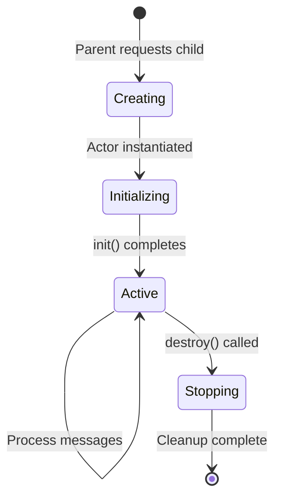

Actors are created lazily:
1. Parent actor receives message for child
2. Parent checks if child actor exists
3. If not, creates child actor via factory
4. Child actor `init()` method runs
5. Messages are delivered to child's mailbox

### Destruction

Actors stop when:
- Parent explicitly stops them
- Parent is destroyed (cascading)
- Entity is deleted (e.g., device removed)
- System shutdown

During destruction:
1. `destroy()` method called
2. Child actors are stopped
3. Resources are released
4. Pending messages are discarded

## Key Actors in Detail

### AppActor

**Responsibility**: Root actor that coordinates all tenant actors and system-wide operations.

**Identity**: Created with `TbEntityActorId(TenantId.SYS_TENANT_ID)` - uses the system tenant ID.

**Dispatcher**: `app-dispatcher` (single-threaded by default)

**Initialization Sequence**:
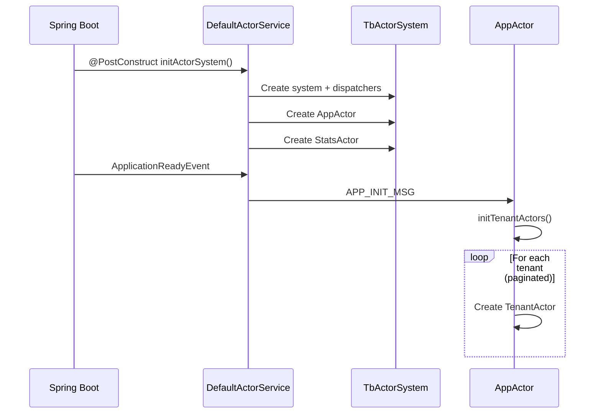

**Key Implementation Details**:
- Delays tenant loading until `APP_INIT_MSG` arrives (allows Spring to fully boot)
- Uses paginated loading (batch size: 1024) for scalability
- Maintains `deletedTenants` cache to prevent recreation of deleted tenants
- Broadcasts partition changes to all tenant actors

**Message Types Handled**:
| Message | Action |
|---------|--------|
| APP_INIT_MSG | Initialize all tenant actors |
| PARTITION_CHANGE_MSG | Broadcast to all tenants |
| COMPONENT_LIFECYCLE_MSG | Handle tenant profile changes |
| SESSION_TIMEOUT_MSG | Broadcast to tenants by type |

### TenantActor

**Responsibility**: Manages all actors for a single tenant.

**Message Types Handled**:
| Message | Action |
|---------|--------|
| QUEUE_TO_RULE_ENGINE_MSG | Route to rule chain |
| TRANSPORT_TO_DEVICE_ACTOR_MSG | Route to device actor |
| COMPONENT_LIFECYCLE_MSG | Create/update/delete rule chains |
| PARTITION_CHANGE_MSG | Rebalance after cluster changes |

**Child Actor Management**:
- Creates DeviceActor on first message for device
- Creates RuleChainActor for each rule chain
- Creates CalculatedFieldManagerActor for computed fields

**Initialization**:
```
1. Load tenant from database
2. Check API usage limits
3. If rule engine service:
   - Initialize calculated field actor
   - Load and start rule chains
```

### DeviceActor

**Responsibility**: Manages state and sessions for a single device.

**Message Types Handled**:
| Message | Action |
|---------|--------|
| TRANSPORT_TO_DEVICE_ACTOR_MSG | Process device session data |
| DEVICE_ATTRIBUTES_UPDATE_TO_DEVICE_ACTOR_MSG | Handle attribute changes |
| DEVICE_RPC_REQUEST_TO_DEVICE_ACTOR_MSG | Deliver RPC to device |
| DEVICE_CREDENTIALS_UPDATE_TO_DEVICE_ACTOR_MSG | Invalidate sessions |
| SESSION_TIMEOUT_MSG | Check for stale sessions |
| DEVICE_DELETE_TO_DEVICE_ACTOR_MSG | Stop actor |

**Internal State**:
- Active device sessions (by session ID)
- Pending RPC requests (with timeouts)
- Device metadata (name, type, credentials hash)

**Session Management**:
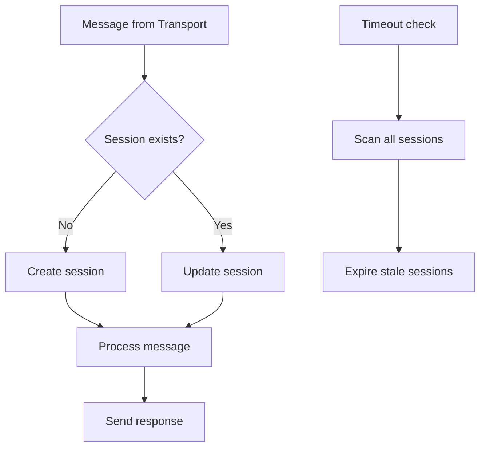

### RuleChainActor

**Responsibility**: Orchestrates message flow through rule nodes.

**Message Types Handled**:
| Message | Action |
|---------|--------|
| QUEUE_TO_RULE_ENGINE_MSG | Start processing at first node |
| RULE_TO_RULE_MSG | Route between nodes |
| RULE_CHAIN_TO_RULE_CHAIN_MSG | Route to sub-chains |

**Child Actor Management**:
- Creates RuleNodeActor for each node in chain
- Maintains node connection graph
- Routes based on relation types (Success, Failure, etc.)

### RuleNodeActor

**Responsibility**: Executes a single rule node's logic.

**Behavior**:
1. Receive TbMsg from parent chain
2. Execute node-specific logic (filter, transform, action)
3. Return result with relation type (Success/Failure/custom)
4. Parent routes to next node based on relation

## Message Types

Messages in the actor system implement `TbActorMsg`. Key categories:

### Transport Messages
- `TransportToDeviceActorMsgWrapper` - Device data from transport layer

### Rule Engine Messages
- `QueueToRuleEngineMsg` - Message entering rule processing
- `RuleToRuleMsg` - Routing between rule nodes

### Lifecycle Messages
- `ComponentLifecycleMsg` - Entity created/updated/deleted

### System Messages
- `PartitionChangeMsg` - Cluster rebalancing notification

## Error Handling

### Actor Failure Strategies

| Strategy | Behavior |
|----------|----------|
| STOP | Stop the failed actor |
| RESTART | Restart the actor, losing state |
| RESUME | Ignore failure, continue processing |
| ESCALATE | Propagate to parent actor |

### Message Failure Handling

When a message fails processing:
1. Error is logged with context
2. Callback (if present) receives error
3. Actor continues with next message
4. Debug events recorded if enabled

### Supervision

Parent actors supervise children:
- TenantActor supervises DeviceActors
- RuleChainActor supervises RuleNodeActors
- Failure in child doesn't crash parent

## Concurrency Guarantees

### Single-Threaded Processing
Each actor processes exactly one message at a time. Within an actor, code is single-threaded and requires no synchronization.

### Mailbox Ordering
Messages from the same sender to the same actor are processed in send order. Messages from different senders have no ordering guarantee.

### At-Most-Once Delivery
Messages are delivered at most once. If an actor fails mid-processing, the message is lost (callbacks can detect this).

## TbActorSystem Implementation

ThingsBoard uses a custom actor system implementation (`TbActorSystem`) rather than relying on frameworks like Akka. This provides full control over actor behavior and resource management.

### Actor System Architecture

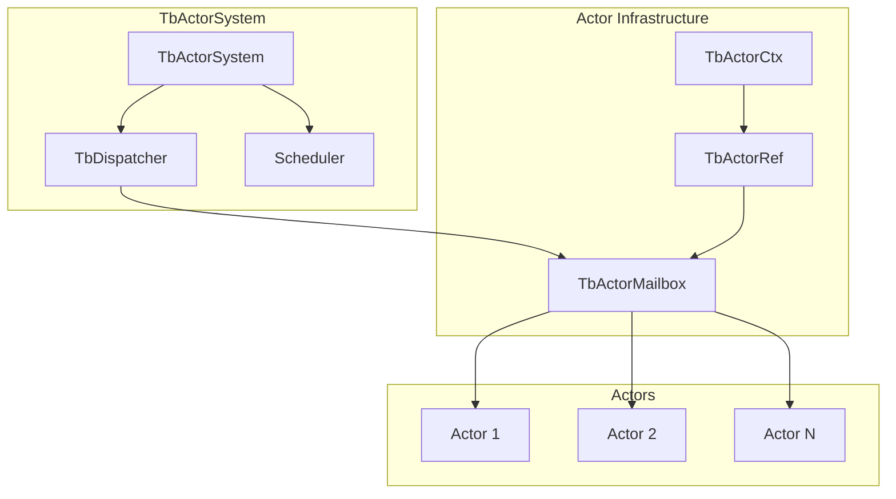

### Core Components

| Component | Class | Purpose |
|-----------|-------|---------|
| Actor System | TbActorSystem | Central orchestrator, manages all actors |
| Dispatcher | TbDispatcher | Thread pool for actor message processing |
| Mailbox | TbActorMailbox | Dual-priority message queue per actor |
| Actor Reference | TbActorRef | Address for sending messages to actors |
| Actor Context | TbActorCtx | Actor's view of the system (parent, children) |

### DefaultTbActorSystem Implementation

The `DefaultTbActorSystem` maintains several critical data structures:

```
ConcurrentMap<String, Dispatcher> dispatchers      - Thread pool registry
ConcurrentMap<TbActorId, TbActorMailbox> actors   - Actor registry
ConcurrentMap<TbActorId, ReentrantLock> actorCreationLocks  - Race condition prevention
ConcurrentMap<TbActorId, Set<TbActorId>> parentChildMap    - Hierarchy tracking
```

**Thread-Safe Actor Creation**: Uses a double-checked locking pattern with per-actor `ReentrantLock` to prevent duplicate actor creation during concurrent creation attempts. This ensures `createActor()` is called exactly once even under high concurrency.

### TbActorMailbox Implementation

The mailbox is the core message processing component with dual-priority queues:

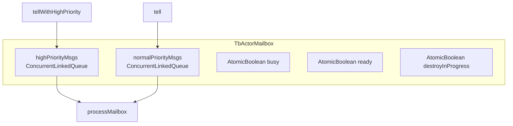

**Key Implementation Details**:

1. **Dual-Priority Queue System**:
   - High-priority messages checked first in `processMailbox()`
   - High-priority messages can preempt normal messages
   - Used for lifecycle events, RPC, credential updates

2. **Throughput Batching**:
   - Processes up to `throughput` messages (default: 5) per batch
   - After processing N messages, actor yields to allow other actors CPU time
   - Prevents single actor starvation while maintaining fairness

3. **Lock-Free Synchronization**:
   - Uses `compareAndSet(FREE, BUSY)` for non-blocking state management
   - `ConcurrentLinkedQueue` provides thread-safe enqueue without locking
   - `AtomicBoolean` flags for `busy`, `ready`, `destroyInProgress`

4. **Unbounded Queues**:
   - No bounded queue limits; relies on producer-side flow control
   - Design choice for maximum throughput; backpressure applied at queue layer

### Specialized Dispatchers

The system uses 6 specialized dispatchers for different actor types:

| Dispatcher | Default Threads | Actor Types | Purpose |
|------------|-----------------|-------------|---------|
| app-dispatcher | 1 | AppActor | Single-threaded root actor |
| tenant-dispatcher | 2 | TenantActor, StatsActor | Tenant coordination |
| device-dispatcher | 4 | DeviceActor | Device message processing |
| rule-dispatcher | 8 | RuleChainActor, RuleNodeActor | Rule engine execution |
| cf-manager-dispatcher | 2 | CalculatedFieldManagerActor | CF coordination |
| cf-entity-dispatcher | 8 | CalculatedFieldEntityActor | CF per-entity processing |

This segregation prevents high-volume device actors from starving rule engine processing and provides workload isolation.

### TbActor Interface

Every actor implements the `TbActor` interface:

| Method | Purpose |
|--------|---------|
| `init(TbActorCtx ctx)` | Initialize actor with context |
| `process(TbActorMsg msg)` | Handle a single message |
| `destroy(TbActorStopReason, Throwable)` | Cleanup when actor stops |
| `getActorRef()` | Get this actor's reference |
| `onInitFailure(attempt, Throwable)` | Handle initialization failure |
| `onProcessFailure(msg, Throwable)` | Handle message processing failure |

### TbActorCtx Interface

The actor context provides full system access:

| Method | Purpose |
|--------|---------|
| `getSelf()` | Actor's own ID |
| `getParentRef()` | Parent actor reference |
| `tell(TbActorId, TbActorMsg)` | Send message to any actor |
| `stop(TbActorId)` | Stop any actor |
| `getOrCreateChildActor(...)` | Lazy child creation |
| `broadcastToChildren(TbActorMsg)` | Send to all children |
| `broadcastToChildrenByType(msg, EntityType)` | Send to children of specific type |
| `broadcastToChildren(msg, Predicate)` | Send to filtered children |
| `filterChildren(Predicate)` | Get list of child IDs matching predicate |

### Initialization Failure Strategies

When actor initialization fails, `onInitFailure()` returns an `InitFailureStrategy`:

| Strategy | Behavior |
|----------|----------|
| `retryImmediately()` | Retry initialization with no delay |
| `retryWithDelay(ms)` | Retry after specified milliseconds |
| `stop()` | Terminate initialization attempts |

**Default behavior**: Exponential backoff with `5000ms * attempt` (5s, 10s, 15s, etc.)

**Special Recovery**: If an actor is in `INIT_FAILED` state and receives a `RuleNodeUpdatedMsg` with HIGH_PRIORITY, the actor automatically restarts initialization. This enables recovery from transient failures.

### Process Failure Strategies

When message processing fails, `onProcessFailure()` returns a `ProcessFailureStrategy`:

| Strategy | Behavior |
|----------|----------|
| `stop()` | Terminate the actor |
| `resume()` | Continue processing next message |

**Default behavior**:
- `Error` (JVM-level) → STOP actor (indicates severe problem)
- `Exception` (application-level) → RESUME processing

### Actor Stop Reasons

| Reason | Description |
|--------|-------------|
| `INIT_FAILED` | Actor initialization failed and exhausted retries |
| `STOPPED` | Normal stop requested |

Pending messages in the queue receive `onTbActorStopped(stopReason)` callback during actor termination.

### Actor ID Structure

The system uses multiple actor ID types:

| Type | Format | Usage |
|------|--------|-------|
| `TbEntityActorId` | `ENTITY_TYPE\|UUID` | Devices, tenants, rule chains, etc. |
| `TbStringActorId` | Simple string | System actors (StatsActor, CF managers) |
| `TbCalculatedFieldEntityActorId` | Specialized | Calculated field entities |

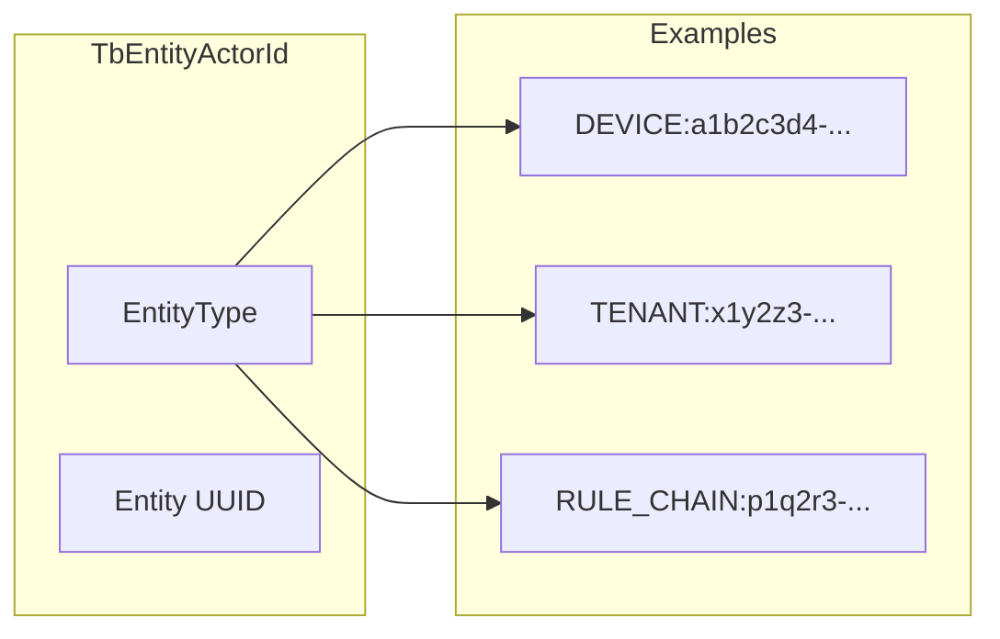

**Entity Type Filtering**: `TbEntityActorId.getEntityType()` enables type-based filtering for broadcast operations (e.g., broadcasting only to DeviceActors).

### Dispatcher Configuration

| Property | Default | Description |
|----------|---------|-------------|
| `actors.system.throughput` | 5 | Messages processed per dispatch cycle |
| `actors.system.max_actor_init_attempts` | 10 | Retry attempts for actor initialization |
| `actors.system.scheduler_pool_size` | 1 | Scheduled task thread pool |

### Message Processing Flow

```mermaid
sequenceDiagram
    participant Sender
    participant Mailbox as TbActorMailbox
    participant Dispatcher as TbDispatcher
    participant Actor as TbActor

    Sender->>Mailbox: tell(msg)
    Mailbox->>Mailbox: enqueue(msg)
    Mailbox->>Dispatcher: scheduleForProcessing()
    Dispatcher->>Mailbox: process()
    Mailbox->>Actor: process(msg)
    Actor-->>Mailbox: done
    Mailbox->>Dispatcher: checkForMoreMessages()
```

## Performance Considerations

### Actor Pooling
Actors are lightweight but not free. The system:
- Creates actors lazily on first message
- Stops idle actors after timeout
- Limits total actors per tenant

### Mailbox Sizing
Each actor has a bounded mailbox. When full:
- New messages are rejected
- Sender receives backpressure
- Prevents memory exhaustion

### Dispatcher Configuration
Actors share thread pools (dispatchers):
- Rule engine dispatcher for rule processing
- Device dispatcher for device actors
- Separate pools prevent one actor type from starving others

## Common Pitfalls and Gotchas

### Unbounded Message Queues

Actor mailboxes use unbounded queues. If message production exceeds processing capacity, memory will grow without limit.

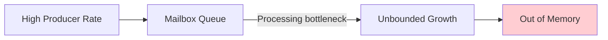

**Mitigation:**
- Apply backpressure at the source (queue layer, rate limiting)
- Monitor mailbox sizes in production
- Scale horizontally by adding processing nodes

### Message Loss During Actor Shutdown

Messages enqueued during actor destruction may be lost unless they implement the stop callback.

```mermaid
sequenceDiagram
    participant Sender
    participant Mailbox as Actor Mailbox
    participant Actor

    Sender->>Mailbox: enqueue(msg1)
    Note over Mailbox: Actor begins destruction
    Mailbox->>Actor: destroy()
    Sender->>Mailbox: enqueue(msg2)
    Note over Mailbox: msg2 lost without callback!
```

**Impact:** Fire-and-forget messages sent during actor teardown are silently dropped.

**Mitigation:** Critical messages should use callbacks to detect delivery failure.

### Throughput Starvation

The configurable `throughput` limit (default: 5 messages per cycle) prevents single actors from monopolizing threads. However, this can cause latency issues for high-volume actors.

| Scenario | Problem |
|----------|---------|
| Single high-volume actor | Must yield after 5 messages, waits for rescheduling |
| Many low-volume actors | Each gets fair share, but high-volume actor delayed |

**Mitigation:** Assign high-volume actors to dedicated dispatchers with more threads.

### Parent Reference Staleness

The parent actor reference is stored at actor creation time. If the parent actor is replaced (stopped and recreated), child actors retain the stale reference.

**Impact:** Messages sent to parent may fail or reach wrong actor.

**Mitigation:** Design hierarchies to avoid runtime parent replacement.

### Broadcast Silent Failures

When broadcasting to children, actors removed between the snapshot and actual send are silently ignored. No error is reported for messages not delivered.

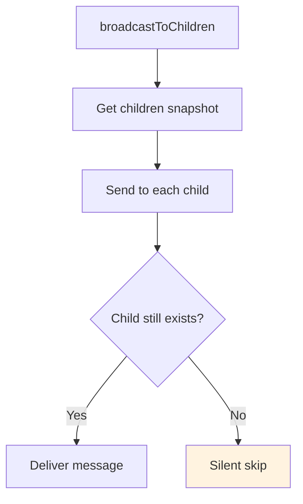

**Impact:** Some children may not receive broadcast messages.

### No Graceful Dispatcher Shutdown

Dispatcher shutdown immediately cancels in-flight tasks. Messages being processed when shutdown occurs are terminated without completion.

**Mitigation:** Implement application-level draining before shutdown.

### Init Retry Without Wall-Clock Timeout

Actor initialization retries continue until max attempts or success—there's no wall-clock timeout. A slow-responding dependency can cause retries to span hours.

```
Retry 1: 5 seconds
Retry 2: 10 seconds
Retry 3: 15 seconds
...
Retry 10: 50 seconds
Total: Minutes to hours with slow dependencies
```

**Mitigation:** Configure reasonable max attempts; monitor init failures.

### Single-Threaded Processing Assumption

All state mutations within an actor are safe without synchronization. However, if actor code spawns separate threads or uses async callbacks, race conditions can occur.

| Pattern | Safety |
|---------|--------|
| Direct state access in `process()` | Safe - single-threaded |
| State access in external callback | **Unsafe** - different thread |
| State access after `await` | **Unsafe** - may be different thread |

**Best Practice:** Keep all state access within the actor's message processing flow.

### Message Ordering Between Actors

Messages from a single sender to a single receiver are ordered. Messages between different sender-receiver pairs have no ordering guarantee.

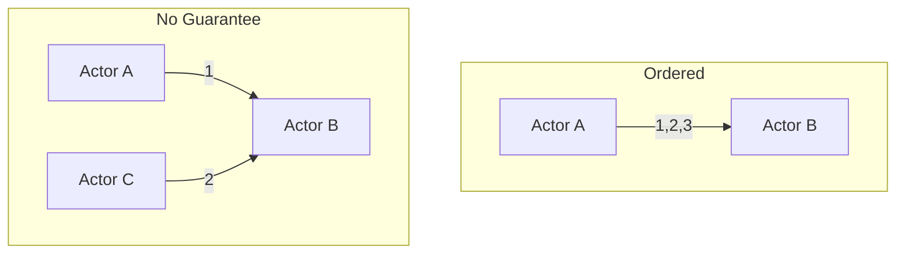

| Scenario | Ordering |
|----------|----------|
| Same sender → Same receiver | Guaranteed |
| Different senders → Same receiver | No guarantee |
| Same sender → Different receivers | No guarantee |

## See Also

- [System Overview](../01-architecture/system-overview.md) - How actors fit in overall architecture
- [Rule Engine](../04-rule-engine/) - Rule chain and node actors
- [Device Entity](../02-core-concepts/entities/device.md) - DeviceActor's managed entity
