# Device Actor

## Overview

The Device Actor is the central hub managing all communication and state for a single device. Each device in the system has its own dedicated actor instance that handles sessions, RPC requests, attribute subscriptions, and activity tracking. The device actor bridges the transport layer (MQTT, CoAP, HTTP) with the rule engine and other system components.

## Key Responsibilities

1. **Session Management**: Track active device connections and subscriptions
2. **RPC Handling**: Queue, send, and track remote procedure calls to devices
3. **Attribute Distribution**: Push shared attribute updates to subscribed sessions
4. **Activity Tracking**: Monitor device activity and report state changes
5. **Message Routing**: Direct incoming messages to appropriate handlers

## Actor Lifecycle

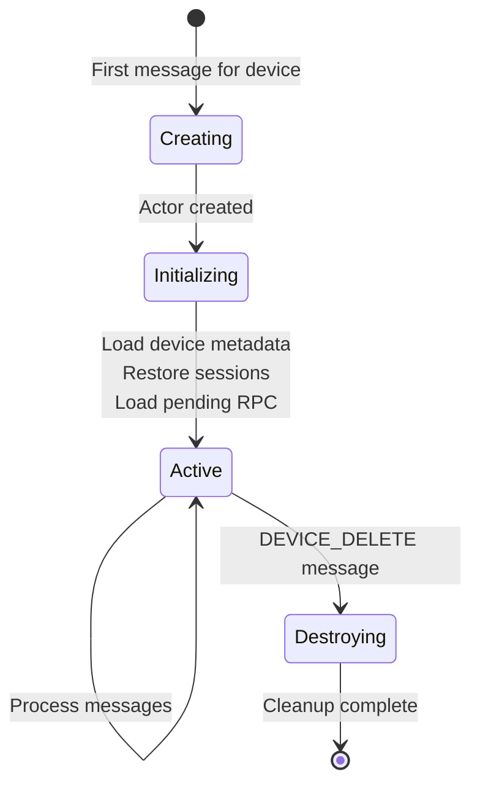

### Creation

Device actors are created by the Tenant Actor when:
- First connection from a device arrives
- First message targeting the device is received
- Device management operation requires the actor

**Initialization steps:**
1. Load device name, type, and metadata from database
2. Restore sessions from distributed cache (cluster mode)
3. Load pending persistent RPC requests
4. Register for session timeout notifications

### Destruction

Triggered by `DEVICE_DELETE` message:
1. Close all active sessions
2. Clear all subscriptions
3. Abandon pending RPC requests
4. Release actor resources

## Message Types Handled

```mermaid
graph TB
    subgraph "Transport Messages"
        TM[TRANSPORT_TO_DEVICE_ACTOR_MSG]
    end

    subgraph "Session Messages"
        ST[SESSION_TIMEOUT_MSG]
    end

    subgraph "Update Messages"
        AU[DEVICE_ATTRIBUTES_UPDATE]
        NU[DEVICE_NAME_OR_TYPE_UPDATE]
        CU[DEVICE_CREDENTIALS_UPDATE]
        EU[DEVICE_EDGE_UPDATE]
    end

    subgraph "RPC Messages"
        RR[DEVICE_RPC_REQUEST]
        RRS[DEVICE_RPC_RESPONSE]
        RTO[DEVICE_RPC_TIMEOUT]
        RRM[REMOVE_RPC]
    end

    subgraph "Lifecycle"
        DD[DEVICE_DELETE]
    end

    DA[Device Actor]

    TM --> DA
    ST --> DA
    AU --> DA
    NU --> DA
    CU --> DA
    EU --> DA
    RR --> DA
    RRS --> DA
    RTO --> DA
    RRM --> DA
    DD --> DA
```

### Transport Messages

| Message | Content | Action |
|---------|---------|--------|
| TRANSPORT_TO_DEVICE_ACTOR_MSG | Session events, subscriptions, attribute requests, RPC responses | Route to appropriate handler |

### Session Messages

| Message | Trigger | Action |
|---------|---------|--------|
| SESSION_TIMEOUT_MSG | Periodic timer | Check and close inactive sessions |

### Update Messages

| Message | Trigger | Action |
|---------|---------|--------|
| DEVICE_ATTRIBUTES_UPDATE | Shared attributes changed | Push to subscribed sessions |
| DEVICE_NAME_OR_TYPE_UPDATE | Device metadata changed | Update local cache |
| DEVICE_CREDENTIALS_UPDATE | Credentials changed | Close all sessions (force reconnect) |
| DEVICE_EDGE_UPDATE | Edge association changed | Update edge reference |

### RPC Messages

| Message | Trigger | Action |
|---------|---------|--------|
| DEVICE_RPC_REQUEST | Rule engine/API initiates RPC | Queue and send to device |
| DEVICE_RPC_RESPONSE | Device responds to RPC | Complete pending request |
| DEVICE_RPC_TIMEOUT | No response in time | Mark as timeout, cleanup |
| REMOVE_RPC | Cancel request | Remove from pending queue |

## Session Management

### Session State

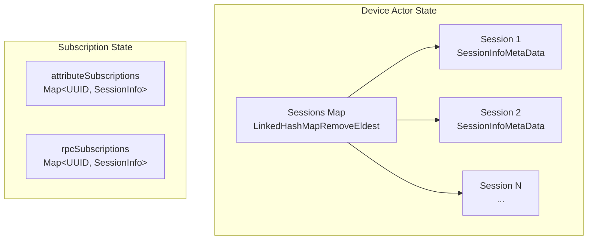

### Implementation Details

The `DeviceActorMessageProcessor` uses specialized data structures for efficient session management:

**Sessions Map**: `LinkedHashMapRemoveEldest<UUID, SessionInfoMetaData>`
- Custom `LinkedHashMap` extension with automatic LRU eviction
- When `size() > maxConcurrentSessionsPerDevice`, eldest entry is automatically removed
- Eviction triggers `notifyTransportAboutClosedSessionMaxSessionsLimit()` callback
- Maintains insertion order for predictable eviction behavior

**SessionInfoMetaData Structure**:
| Field | Type | Description |
|-------|------|-------------|
| sessionType | SYNC/ASYNC | One-shot vs persistent |
| nodeId | String | Cluster node hosting connection |
| subscribedToAttributes | boolean | Attribute subscription flag |
| subscribedToRPC | boolean | RPC subscription flag |
| lastActivityTime | long | Milliseconds timestamp |

**Subscription Maps**: Two separate maps track subscriptions independently:
- `attributeSubscriptions<UUID, SessionInfo>` - Sessions subscribing to attribute updates
- `rpcSubscriptions<UUID, SessionInfo>` - Sessions subscribing to RPC commands

### Concurrency Model

All state mutations are serialized through the actor message queue:
- Single-threaded processing via `DeviceActor.doProcess()`
- No explicit locks required - actor framework guarantees message ordering
- `LinkedHashMapRemoveEldest` removal callback executes atomically within actor thread

Each session tracks:
- **Session ID**: Unique identifier (UUID)
- **Session Type**: SYNC (one-shot) or ASYNC (persistent)
- **Node ID**: Cluster node hosting the connection
- **Last Activity**: Timestamp of last message
- **Subscriptions**: Attribute and RPC subscription flags

### Session Types

| Type | Behavior | Use Case |
|------|----------|----------|
| SYNC | Waits for response, then closes | HTTP request-response |
| ASYNC | Maintains persistent connection | MQTT, WebSocket |

### Session Lifecycle

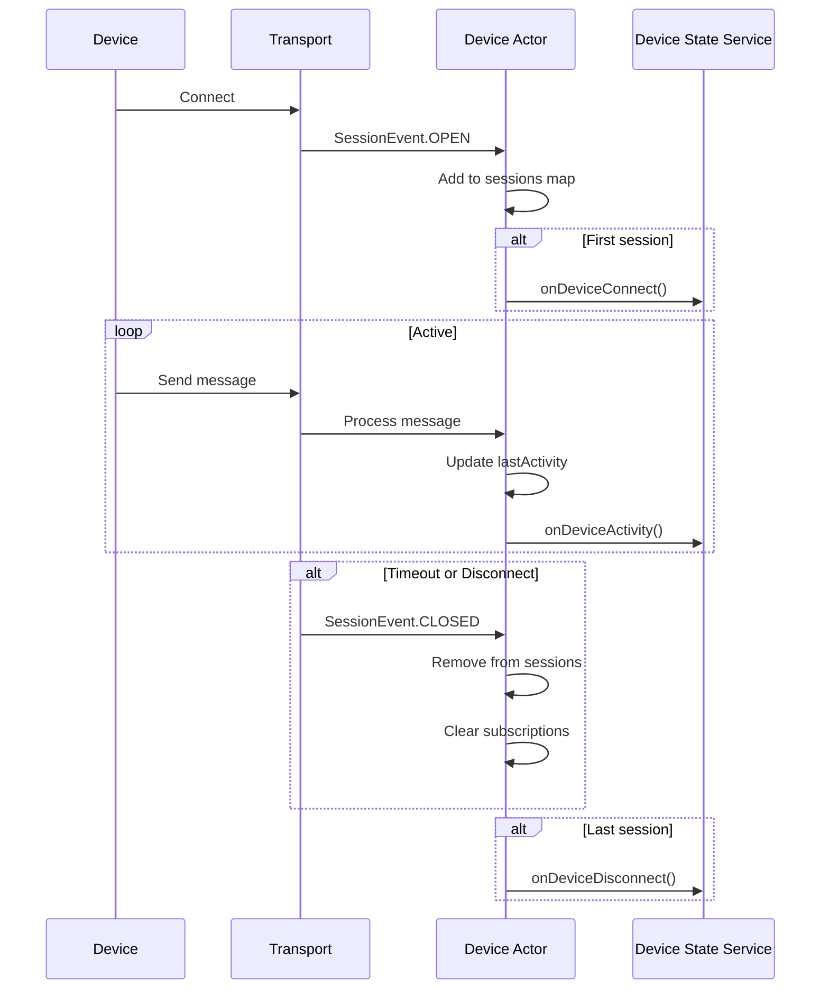

### Session Limits

- **Max Concurrent Sessions**: 100 per device (configurable via `maxConcurrentSessionsPerDevice`)
- **Eviction Policy**: Oldest session removed when limit exceeded (LRU via LinkedHashMap)
- **Inactivity Timeout**: Sessions closed after configured period without activity

### Session Eviction Policies

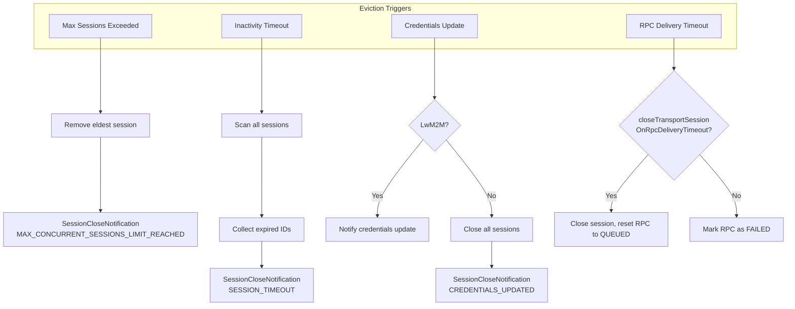

| Eviction Type | Trigger | Session Close Reason |
|---------------|---------|---------------------|
| Max Sessions | `sessions.size() > maxConcurrentSessionsPerDevice` | `MAX_CONCURRENT_SESSIONS_LIMIT_REACHED` |
| Inactivity | `lastActivityTime < (now - sessionInactivityTimeout)` | `SESSION_TIMEOUT` |
| Credentials Update | `DeviceCredentialsUpdateNotificationMsg` received | `CREDENTIALS_UPDATED` |
| RPC Timeout | Delivery timeout with `closeTransportSessionOnRpcDeliveryTimeout=true` | Session closed, RPC reset |

**Session Cache Persistence** (Cluster Mode):
- Sessions persisted via `dumpSessions()` to distributed cache
- Only ASYNC sessions are persisted (SYNC sessions are transient)
- Restored via `restoreSessions()` during actor initialization
- Enables session survival across node failures

## RPC Handling

### RPC State

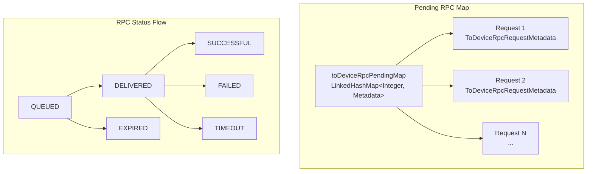

**ToDeviceRpcRequestMetadata Structure**:
| Field | Type | Description |
|-------|------|-------------|
| msg | ToDeviceRpcRequestActorMsg | Full RPC request details |
| sent | boolean | Whether transmitted to any session |
| retries | int | Current retry count |
| delivered | boolean | Whether device acknowledged receipt |

Each pending RPC tracks:
- **Request ID**: Sequential identifier (via `rpcSeq++` counter)
- **Original Request**: RPC details (method, params, timeout)
- **Sent Flag**: Whether transmitted to device
- **Acked Flag**: Whether device acknowledged receipt
- **Retry Count**: Number of retry attempts
- **Timeout Handle**: Scheduled timeout callback

### RPC Persistence and Recovery

**Status Lifecycle**:
```
QUEUED → DELIVERED → SUCCESSFUL
                  → FAILED
                  → TIMEOUT
QUEUED → EXPIRED (if past expiration before send)
```

**Initialization Recovery**:
During actor initialization, pending RPCs are restored from database:

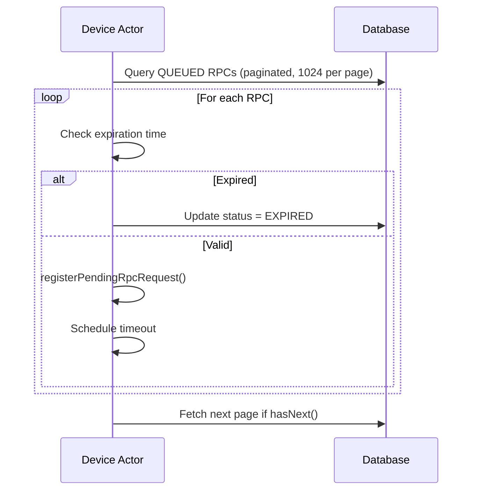

**Retry Logic**:
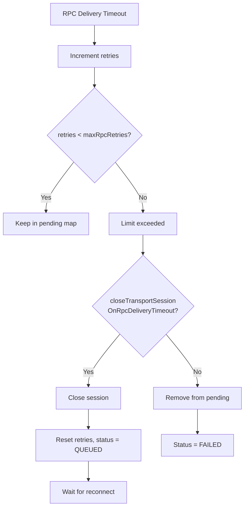

### Submission Strategies

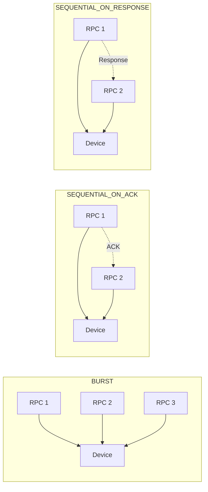

| Strategy | Behavior | Use Case |
|----------|----------|----------|
| BURST | Send all immediately | High-throughput devices |
| SEQUENTIAL_ON_ACK | Wait for ACK before next | Ordered delivery needed |
| SEQUENTIAL_ON_RESPONSE | Wait for response before next | Strict sequencing |

### Outbound RPC Flow

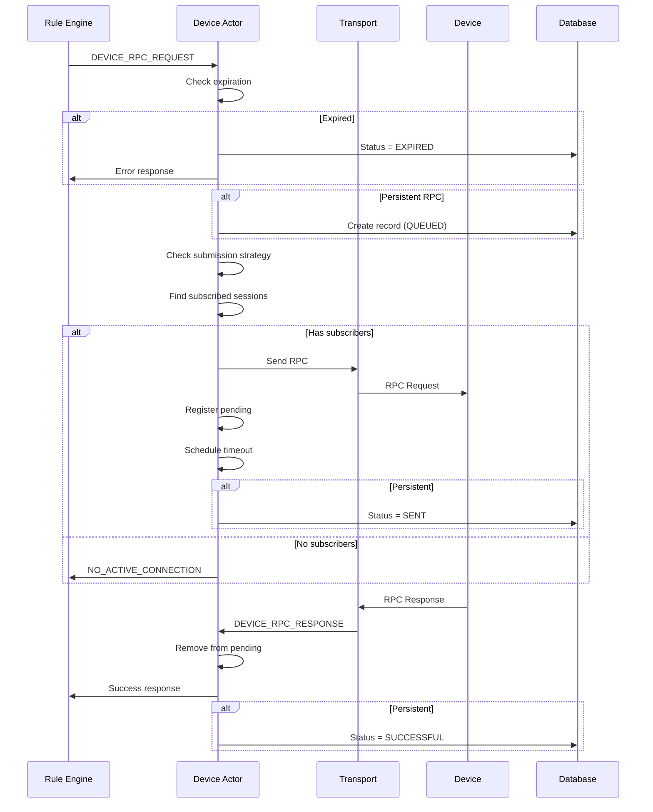

### RPC Timeout Handling

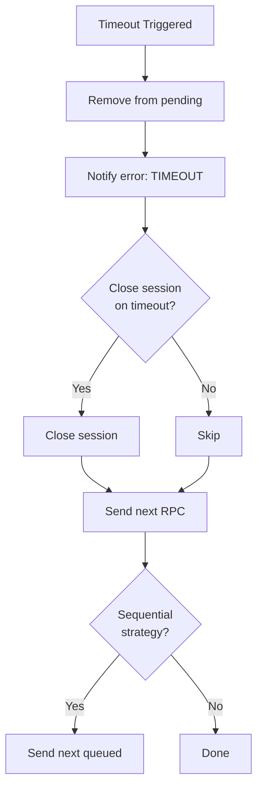

### One-Way vs Two-Way RPC

| Aspect | One-Way | Two-Way |
|--------|---------|---------|
| Response expected | No | Yes |
| Timeout registered | No | Yes |
| Success criteria | Sent to device | Response received |
| Use case | Commands, logging | Queries, confirmations |

## Edge Device Handling

Devices associated with Edge instances have special RPC routing behavior.

### Edge Detection

During device actor initialization:
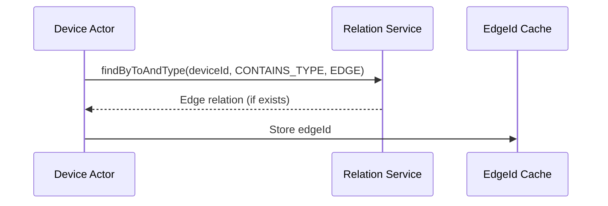

The `edgeId` is cached and only queried once during actor initialization.

### RPC Routing for Edge Devices

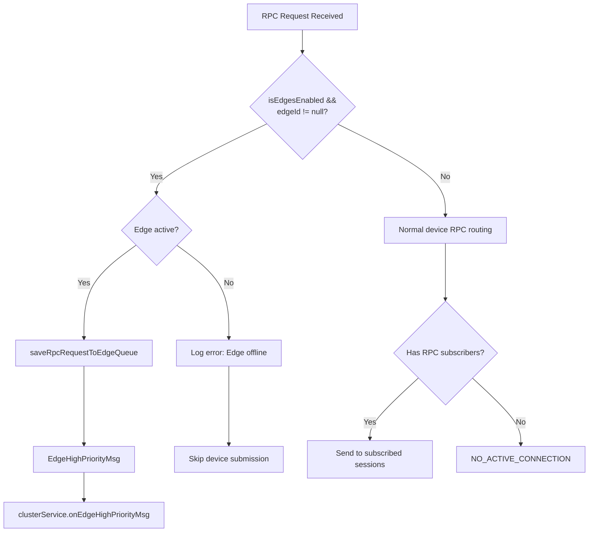

**Edge RPC Queue Persistence**:
| Field | Description |
|-------|-------------|
| EdgeEvent Type | `DEVICE` |
| EdgeEvent Action | `RPC_CALL` |
| Payload | requestId, requestUUID, method, params |

### Edge Device Updates

When edge association changes (`DeviceEdgeUpdateMsg`):
- The `edgeId` field is updated dynamically
- Supports device migration between edges
- Future RPCs route to new edge

## Attribute Handling

### Shared Attribute Updates

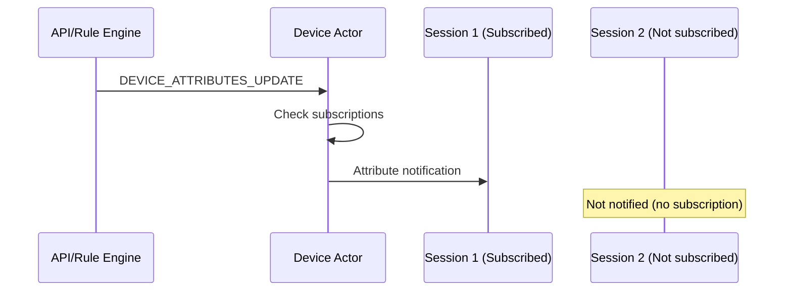

### Attribute Requests

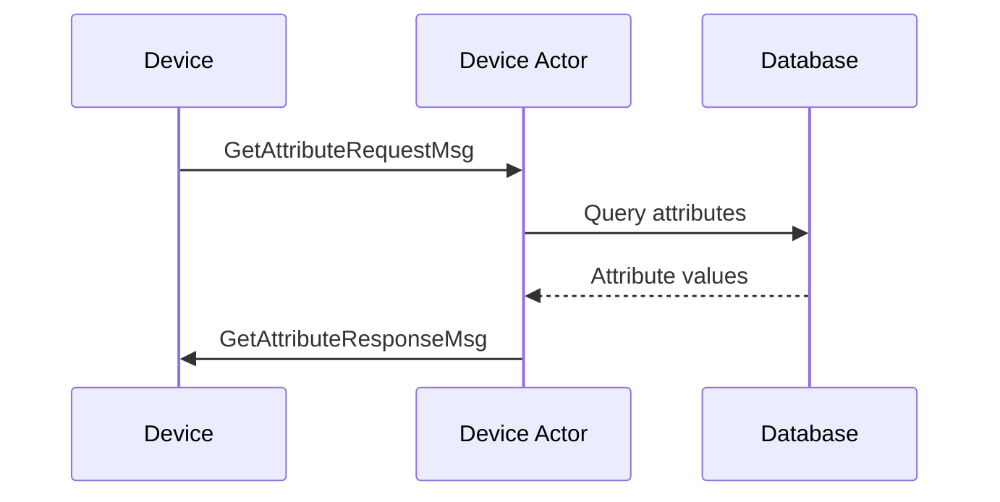

## Activity Tracking

### Activity Events

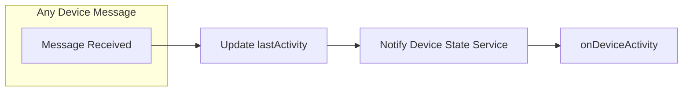

### State Service Integration

| Event | Trigger | Service Method |
|-------|---------|----------------|
| Device Online | First session opens | onDeviceConnect() |
| Device Offline | Last session closes | onDeviceDisconnect() |
| Device Active | Any message received | onDeviceActivity() |

The Device State Service (separate component) handles:
- Maintaining device activity status across cluster
- Generating INACTIVITY_EVENT messages
- Publishing activity telemetry
- Triggering notifications

## Actor Interactions

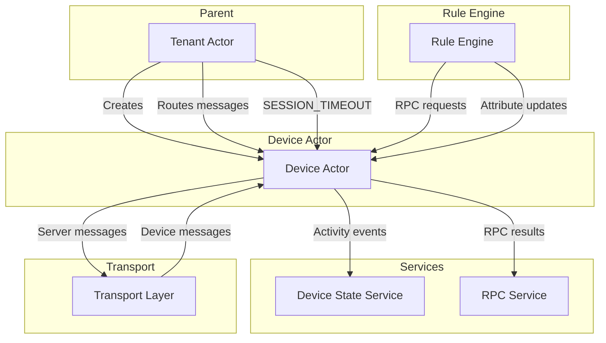

### Tenant Actor (Parent)

- Creates device actor instances
- Routes messages to appropriate device actors
- Broadcasts session timeout notifications
- Handles device creation/deletion events

### Transport Layer

- Sends device-originated messages to actor
- Receives server-to-device messages from actor
- Manages physical connections

### Device State Service

- Receives lifecycle notifications
- Tracks activity across cluster
- Generates inactivity events

### RPC Service

- Persists RPC records
- Updates RPC status
- Provides query interface

## Error Handling

### Session Errors

| Error | Cause | Recovery |
|-------|-------|----------|
| Session limit exceeded | Too many connections | Evict oldest session |
| Session timeout | No activity | Close session, cleanup |
| Connection lost | Network issue | Transport notifies CLOSED |

### RPC Errors

| Error | Cause | Recovery |
|-------|-------|----------|
| RPC_EXPIRED | Past expiration time | Mark expired, notify caller |
| NO_ACTIVE_CONNECTION | No subscribed sessions | Return error immediately |
| TIMEOUT | No response in time | Mark timeout, optionally close session |
| DELIVERY_FAILURE | Transport error | Retry if configured |

### Recovery Mechanisms

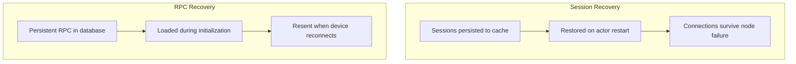

## Configuration

| Parameter | Default | Description |
|-----------|---------|-------------|
| maxConcurrentSessionsPerDevice | 100 | Max sessions before eviction |
| sessionInactivityTimeout | 10 min | Time before inactive session closes |
| rpcResponseTimeout | 10 sec | Timeout waiting for RPC response |
| rpcSubmitStrategy | BURST | How RPC requests are queued |
| closeTransportSessionOnRpcDeliveryTimeout | false | Close session on RPC timeout |
| maxRpcRetries | 2 | Max retry attempts for RPC |

## Common Patterns

### Device Coming Online

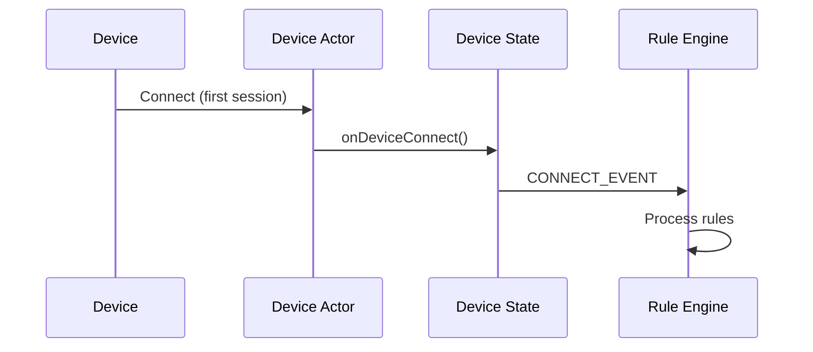

### Pushing Configuration to Device

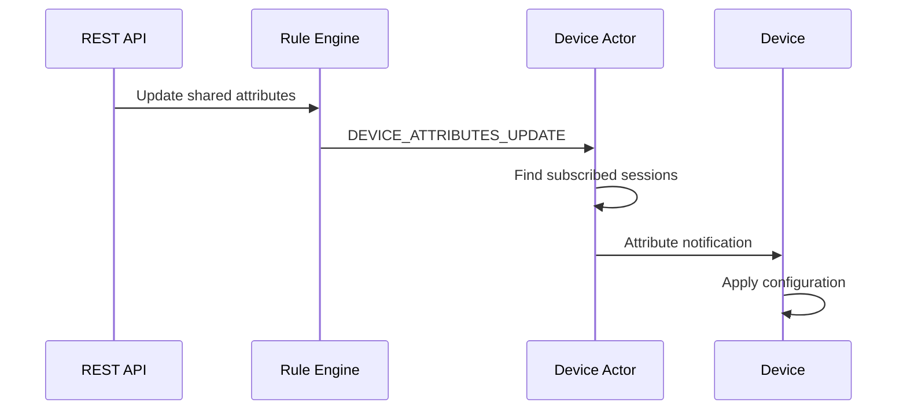

### Device Executing Command

```mermaid
sequenceDiagram
    participant UI as Dashboard
    participant RE as Rule Engine
    participant DA as Device Actor
    participant D as Device

    UI->>RE: RPC: setGpio(pin=7, value=1)
    RE->>DA: DEVICE_RPC_REQUEST
    DA->>D: RPC Request
    D->>D: Execute command
    D->>DA: RPC Response (success)
    DA->>RE: Success notification
    RE->>UI: Command completed
```

## Best Practices

### For Device Developers

- Subscribe to RPC to receive commands
- Subscribe to attributes to receive configuration
- Send periodic messages to maintain activity
- Handle reconnection gracefully

### For Rule Chain Designers

- Use appropriate RPC timeout for device response time
- Consider persistent RPC for critical commands
- Handle NO_ACTIVE_CONNECTION for offline devices
- Use attribute updates for non-critical configuration

### For System Administrators

- Monitor session counts per device
- Adjust timeout values based on network conditions
- Configure submission strategy based on device capabilities
- Enable persistent RPC for reliable command delivery

## Common Pitfalls and Gotchas

### Session Limit Silent Eviction

When a device exceeds the maximum concurrent sessions limit (default: 100), the oldest session is silently evicted without warning to the device.

```mermaid
sequenceDiagram
    participant D as Device
    participant DA as Device Actor
    participant Old as Oldest Session

    D->>DA: Open session 101
    DA->>DA: Check limit (100)
    DA->>Old: Close (evicted)
    Note over Old: No warning sent!
    DA->>D: Session accepted
```

**Impact:** Legitimate connections may be dropped without explicit error.

**Mitigation:** Monitor session counts; increase limit for multi-gateway deployments.

### RPC Delivery Without Subscription

Sending RPC commands to a device that hasn't subscribed to RPC results in immediate `NO_ACTIVE_CONNECTION` error, even if the device has an active session.

| Session State | RPC Subscription | Result |
|---------------|------------------|--------|
| Connected | Subscribed | Delivered |
| Connected | Not subscribed | `NO_ACTIVE_CONNECTION` |
| Disconnected | N/A | `NO_ACTIVE_CONNECTION` |

**Mitigation:** Ensure devices subscribe to RPC topic on connect.

### Persistent RPC Retry Amplification

Persistent RPC retries on failure. If the device repeatedly fails to process commands, the retry count accumulates and may exhaust the retry limit for legitimate requests.

```mermaid
flowchart TD
    FAIL[Device fails RPC] --> RETRY[Retry queued]
    RETRY --> FAIL
    FAIL --> EXHAUST[Max retries reached]
    EXHAUST --> LOST[Subsequent RPCs rejected]

    style LOST fill:#ffcdd2
```

**Mitigation:** Fix device-side issues; monitor RPC failure rates.

### Edge Device RPC Routing Bypass

For devices associated with an Edge instance, RPC commands are routed to the Edge queue rather than directly to the device. If the Edge is offline, commands accumulate in the queue but don't fail immediately.

**Impact:** No immediate feedback that device is unreachable via Edge.

**Mitigation:** Monitor Edge connectivity; set appropriate RPC timeouts.

### Credential Update Session Cascade

Updating device credentials triggers closure of ALL active sessions. In deployments with multiple gateways, this causes a reconnection storm.

```mermaid
graph TB
    CREDS[Credentials Updated] --> CLOSE[Close all sessions]
    CLOSE --> S1[Session 1 disconnected]
    CLOSE --> S2[Session 2 disconnected]
    CLOSE --> SN[Session N disconnected]

    S1 --> RECON[Reconnection storm]
    S2 --> RECON
    SN --> RECON

    style RECON fill:#fff3e0
```

**Mitigation:** Schedule credential updates during low-activity periods.

### Activity Timeout vs Inactivity Event

The session inactivity timeout and the rule engine INACTIVITY_EVENT are separate mechanisms. A device may have active sessions but still receive an INACTIVITY_EVENT if no messages are processed.

| Mechanism | Trigger | Scope |
|-----------|---------|-------|
| Session timeout | No transport activity | Single session |
| INACTIVITY_EVENT | No telemetry/attributes | Entire device |

**Impact:** Session remains open but device appears "inactive" in dashboards.

### Sequential RPC Strategy Blocking

When using `SEQUENTIAL_ON_ACK` or `SEQUENTIAL_ON_RESPONSE` submission strategies, a single unresponsive RPC blocks all subsequent commands to that device.

```mermaid
sequenceDiagram
    participant API as API
    participant DA as Device Actor
    participant D as Device

    API->>DA: RPC 1
    DA->>D: Send RPC 1
    Note over D: Device unresponsive

    API->>DA: RPC 2
    Note over DA: Blocked waiting for RPC 1

    API->>DA: RPC 3
    Note over DA: Also blocked
```

**Mitigation:** Use `BURST` strategy for non-critical commands; set appropriate timeouts.

### LwM2M Special Handling

LwM2M devices receive credential update notifications differently—sessions are NOT closed. This exception can cause confusion when mixing LwM2M and other protocol devices.

| Protocol | On Credential Update |
|----------|---------------------|
| MQTT, HTTP, CoAP | All sessions closed |
| LwM2M | Notification only |

## See Also

- [Actor System Overview](./README.md) - Actor hierarchy
- [Message Types Reference](./message-types.md) - All message types
- [Rule Chain Actor](./rule-chain-actor.md) - Rule processing
- [RPC](../02-core-concepts/data-model/rpc.md) - RPC details
- [Transport Contract](../05-transport-layer/transport-contract.md) - Transport abstraction
