# Message Types Reference

## Overview

Messages are the fundamental unit of communication in ThingsBoard's actor system. Every piece of data flowing through the platform—telemetry from devices, configuration changes, alarms, RPC calls—is wrapped in a message with a specific type. The message type determines how the rule engine routes and processes the message.

## Message Structure

### TbMsg Fields

| Field | Type | Description |
|-------|------|-------------|
| type | string | Message type identifier |
| id | UUID | Unique message identifier |
| ts | timestamp | When message was created |
| originator | EntityId | Entity that triggered this message |
| customerId | CustomerId | Associated customer (optional) |
| data | string | Payload (JSON, text, or binary) |
| dataType | enum | JSON, TEXT, or BINARY |
| metaData | map | Key-value metadata pairs |
| ruleChainId | RuleChainId | Current rule chain |
| ruleNodeId | RuleNodeId | Current rule node |
| correlationId | UUID | Links related messages |
| partition | integer | Queue partition |

### Example Message

```json
{
  "type": "POST_TELEMETRY_REQUEST",
  "id": "a1b2c3d4-5678-90ab-cdef-1234567890ab",
  "ts": 1634567890123,
  "originator": {
    "entityType": "DEVICE",
    "id": "784f394c-42b6-435a-983c-b7beff2784f9"
  },
  "data": "{\"temperature\": 25.5, \"humidity\": 60}",
  "dataType": "JSON",
  "metaData": {
    "deviceName": "Sensor-001",
    "deviceType": "temperature-sensor",
    "ts": "1634567890123"
  }
}
```

## Message Flow

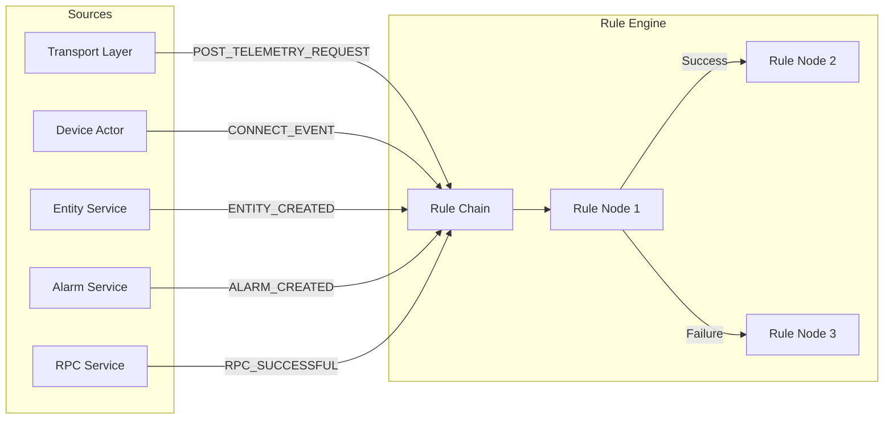

## Message Type Categories

### Device Data Messages

Messages carrying telemetry and attribute data from devices.

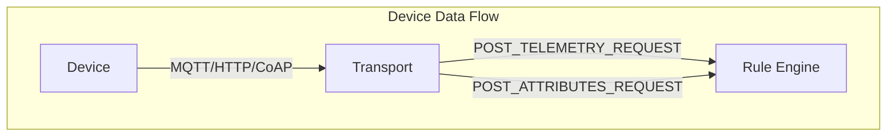

| Type | Trigger | Originator | Rule Node Connection |
|------|---------|------------|---------------------|
| POST_TELEMETRY_REQUEST | Device sends time-series data | Device | "Post telemetry" |
| POST_ATTRIBUTES_REQUEST | Device sends attributes | Device | "Post attributes" |

**POST_TELEMETRY_REQUEST Example:**
```json
{
  "type": "POST_TELEMETRY_REQUEST",
  "data": "{\"temperature\": 25.5, \"humidity\": 60}",
  "metaData": {
    "deviceName": "Sensor-001",
    "deviceType": "temperature-sensor"
  }
}
```

**POST_ATTRIBUTES_REQUEST Example:**
```json
{
  "type": "POST_ATTRIBUTES_REQUEST",
  "data": "{\"firmwareVersion\": \"2.1.0\", \"location\": \"Building A\"}",
  "metaData": {
    "deviceName": "Sensor-001",
    "deviceType": "temperature-sensor"
  }
}
```

### Lifecycle Events

Messages tracking device connection state changes.

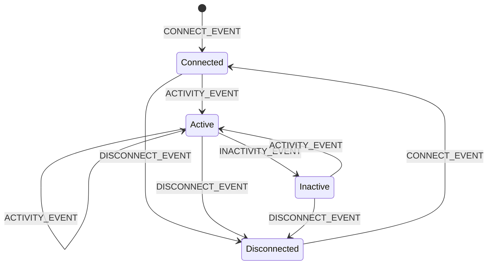

| Type | Trigger | Originator | Rule Node Connection |
|------|---------|------------|---------------------|
| CONNECT_EVENT | Device session starts | Device | "Connect Event" |
| DISCONNECT_EVENT | Device session ends | Device | "Disconnect Event" |
| ACTIVITY_EVENT | Device sends/receives data | Device | "Activity Event" |
| INACTIVITY_EVENT | No activity for timeout period | Device | "Inactivity Event" |

**Use Cases:**
- Track device online/offline status
- Trigger alerts on disconnect
- Initialize device on first connect
- Clean up resources on disconnect

### RPC Messages

Messages for remote procedure calls between platform and devices.

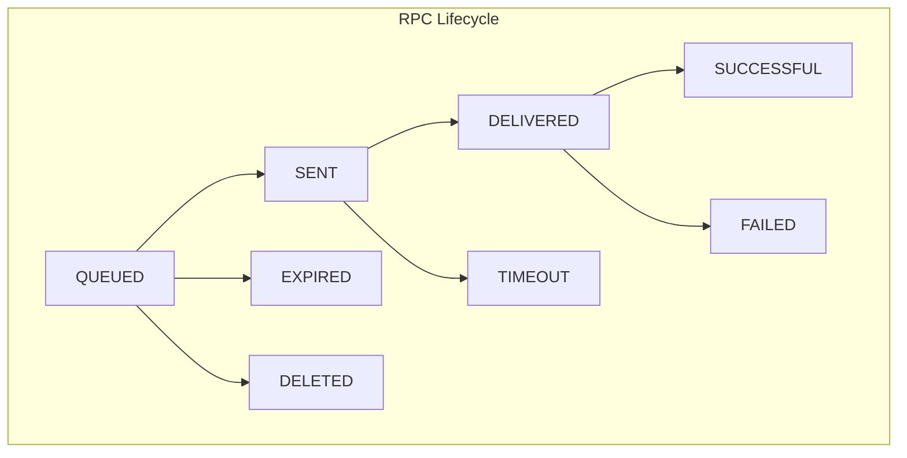

| Type | Trigger | Description |
|------|---------|-------------|
| TO_SERVER_RPC_REQUEST | Device initiates RPC | Device calls platform method |
| RPC_CALL_FROM_SERVER_TO_DEVICE | Platform initiates RPC | Platform calls device method |
| RPC_QUEUED | RPC added to queue | Persistent RPC stored |
| RPC_SENT | RPC delivered to transport | Message transmitted |
| RPC_DELIVERED | Device acknowledged | Receipt confirmed |
| RPC_SUCCESSFUL | Device responded | Execution completed |
| RPC_FAILED | Device reported error | Execution failed |
| RPC_TIMEOUT | No response in time | Wait period exceeded |
| RPC_EXPIRED | Validity passed | Never delivered |
| RPC_DELETED | RPC removed | User cancelled |

**TO_SERVER_RPC_REQUEST Example:**
```json
{
  "type": "TO_SERVER_RPC_REQUEST",
  "data": "{\"method\": \"getConfig\", \"params\": {}}",
  "metaData": {
    "deviceName": "Sensor-001",
    "requestId": "123"
  }
}
```

### Entity Lifecycle Messages

Messages for entity creation, modification, and deletion.

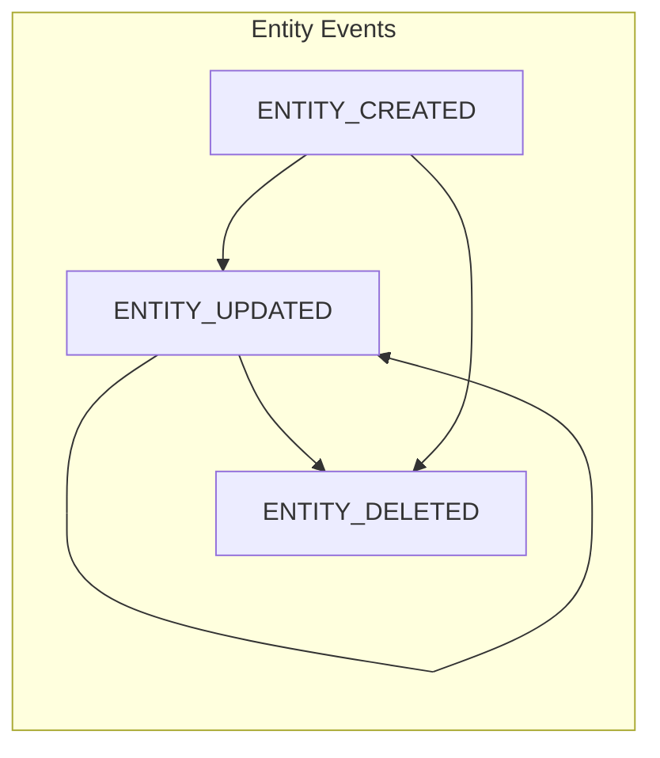

| Type | Trigger | Originator | Rule Node Connection |
|------|---------|------------|---------------------|
| ENTITY_CREATED | New entity created | Created entity | "Entity Created" |
| ENTITY_UPDATED | Entity modified | Updated entity | "Entity Updated" |
| ENTITY_DELETED | Entity removed | Deleted entity | "Entity Deleted" |

**ENTITY_CREATED Example:**
```json
{
  "type": "ENTITY_CREATED",
  "originator": {
    "entityType": "DEVICE",
    "id": "784f394c-42b6-435a-983c-b7beff2784f9"
  },
  "data": "{\"name\": \"New Sensor\", \"type\": \"temperature-sensor\"}"
}
```

### Assignment Messages

Messages for entity ownership and assignment changes.

| Type | Trigger | Rule Node Connection |
|------|---------|---------------------|
| ENTITY_ASSIGNED | Entity assigned | "Entity Assigned" |
| ENTITY_UNASSIGNED | Entity unassigned | "Entity Unassigned" |
| ENTITY_ASSIGNED_FROM_TENANT | Assigned to customer | "Entity Assigned From Tenant" |
| ENTITY_ASSIGNED_TO_TENANT | Assigned to tenant | "Entity Assigned To Tenant" |
| ENTITY_ASSIGNED_TO_EDGE | Assigned to edge | OTHER |
| ENTITY_UNASSIGNED_FROM_EDGE | Unassigned from edge | OTHER |

### Attribute Change Messages

Messages for attribute and time-series data changes.

| Type | Trigger | Rule Node Connection |
|------|---------|---------------------|
| ATTRIBUTES_UPDATED | Attributes modified | "Attributes Updated" |
| ATTRIBUTES_DELETED | Attributes removed | "Attributes Deleted" |
| TIMESERIES_UPDATED | Time-series added | "Timeseries Updated" |
| TIMESERIES_DELETED | Time-series removed | "Timeseries Deleted" |

**ATTRIBUTES_UPDATED Example:**
```json
{
  "type": "ATTRIBUTES_UPDATED",
  "data": "{\"location\": \"Building B\", \"floor\": 3}",
  "metaData": {
    "scope": "SERVER_SCOPE",
    "deviceName": "Sensor-001"
  }
}
```

### Alarm Messages

Messages for alarm lifecycle events.

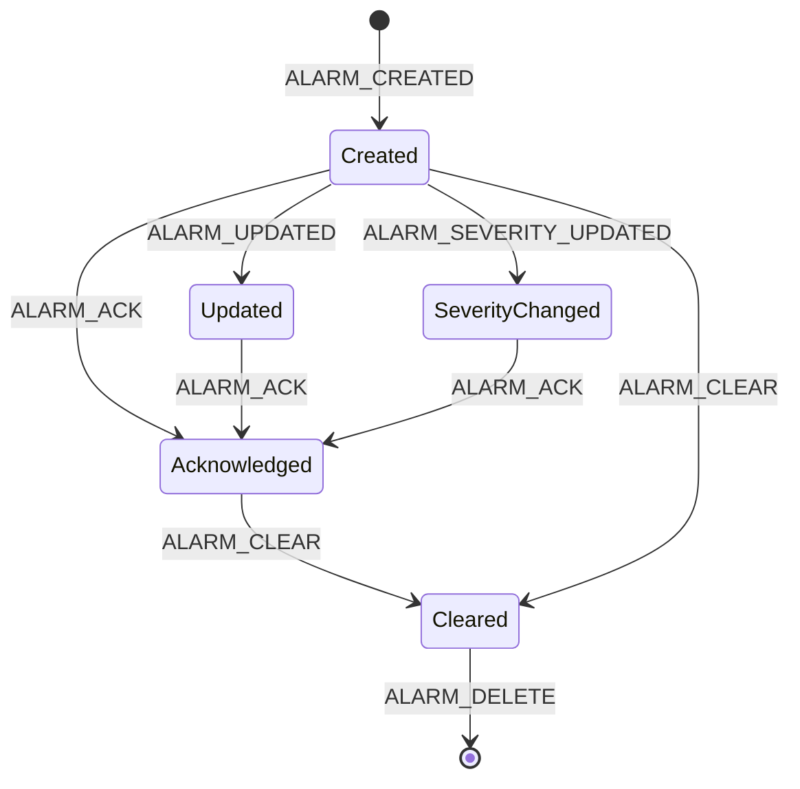

| Type | Trigger | Rule Node Connection | Key Metadata |
|------|---------|---------------------|--------------|
| ALARM | Generic alarm event | "Alarm" | - |
| ALARM_CREATED | New alarm generated | "Alarm Created" | `isNewAlarm=true` |
| ALARM_UPDATED | Alarm details modified | "Alarm Updated" | - |
| ALARM_SEVERITY_UPDATED | Severity changed | "Alarm Severity Updated" | `isSeverityUpdated=true` |
| ALARM_ACK | Alarm acknowledged | "Alarm Acknowledged" | - |
| ALARM_CLEAR | Alarm condition resolved | "Alarm Cleared" | `isClearedAlarm=true` |
| ALARM_ASSIGNED | Alarm assigned to user | "Alarm Assigned" | - |
| ALARM_UNASSIGNED | Alarm unassigned | "Alarm Unassigned" | - |
| ALARM_DELETE | Alarm removed | OTHER | - |

**ALARM_CREATED Example:**
```json
{
  "type": "ALARM_CREATED",
  "originator": {
    "entityType": "DEVICE",
    "id": "784f394c-42b6-435a-983c-b7beff2784f9"
  },
  "data": "{\"type\": \"High Temperature\", \"severity\": \"CRITICAL\"}",
  "metaData": {
    "isNewAlarm": "true",
    "deviceName": "Sensor-001"
  }
}
```

### Comment Messages

Messages for alarm comments.

| Type | Trigger | Rule Node Connection |
|------|---------|---------------------|
| COMMENT_CREATED | Comment added to alarm | "Comment Created" |
| COMMENT_UPDATED | Comment modified | "Comment Updated" |

### Relation Messages

Messages for entity relationship changes.

| Type | Trigger | Rule Node Connection |
|------|---------|---------------------|
| RELATION_ADD_OR_UPDATE | Relation created/modified | "Relation Added or Updated" |
| RELATION_DELETED | Single relation removed | "Relation Deleted" |
| RELATIONS_DELETED | All relations removed | "All Relations Deleted" |

**RELATION_ADD_OR_UPDATE Example:**
```json
{
  "type": "RELATION_ADD_OR_UPDATE",
  "originator": {
    "entityType": "ASSET",
    "id": "abc123..."
  },
  "data": "{\"to\": {\"entityType\": \"DEVICE\", \"id\": \"def456...\"}, \"type\": \"Contains\"}"
}
```

### Provisioning Messages

Messages for device provisioning.

| Type | Trigger | Rule Node Connection |
|------|---------|---------------------|
| PROVISION_SUCCESS | Device provisioned successfully | OTHER |
| PROVISION_FAILURE | Provisioning failed | OTHER |

### Other Messages

| Type | Trigger | Rule Node Connection |
|------|---------|---------------------|
| REST_API_REQUEST | REST API injected into rule engine | "REST API request" |
| SEND_EMAIL | Internal email action | OTHER |
| NA | Unknown/unrecognized type | OTHER |

### Calculated Field Messages (v4.3.0)

Messages for calculated field processing in the CF actor subsystem:

| Type | Purpose |
|------|---------|
| CF_ENTITY_TELEMETRY_MSG | Entity telemetry for calculated field processing |
| CF_ENTITY_INIT_CF_MSG | Initialize calculated fields for entity |
| CF_ENTITY_DELETE_MSG | Delete entity calculated field data |
| CF_RELATION_ACTION_MSG | Handle relation changes for calculated fields |
| CF_ENTITY_ACTION_EVENT_MSG | Entity lifecycle events for CF processing |
| CF_ALARM_ACTION_MSG | Alarm events trigger CF reevaluation |
| CF_ARGUMENT_RESET_MSG | Reset calculated field arguments |
| CF_CACHE_INIT_MSG | Initialize CF actor cache |
| CF_STATE_PARTITION_RESTORE_MSG | Restore CF state for partition |
| CF_REEVALUATE_MSG | Trigger recalculation of computed fields |

### Edge Session Messages

Messages for edge gateway communication:

| Type | Purpose |
|------|---------|
| EDGE_EVENT_UPDATE_TO_EDGE_SESSION_MSG | Edge events sent to edge session |
| EDGE_HIGH_PRIORITY_TO_EDGE_SESSION_MSG | High-priority edge messages |
| EDGE_SYNC_REQUEST_TO_EDGE_SESSION_MSG | Edge sync request initiation |
| EDGE_SYNC_RESPONSE_FROM_EDGE_SESSION_MSG | Edge sync response |
| DEVICE_EDGE_UPDATE_TO_DEVICE_ACTOR_MSG | Edge device update to device actor |

### Internal Rule Node Messages

| Type | Purpose |
|------|---------|
| REMOTE_TO_RULE_CHAIN_TELL_NEXT_MSG | Cross-cluster rule chain routing |
| RULE_NODE_UPDATED_MSG | Rule node configuration update |

### Self-Messages (Internal Only)

These messages are processed only by the originating actor and are not routed through the rule engine:

| Type | Purpose |
|------|---------|
| GENERATOR_NODE_SELF_MSG | Message generator timing |
| DEVICE_PROFILE_PERIODIC_SELF_MSG | Profile scheduled evaluation |
| DEVICE_PROFILE_UPDATE_SELF_MSG | Profile change notification |
| DEVICE_UPDATE_SELF_MSG | Device config change |
| DEDUPLICATION_TIMEOUT_SELF_MSG | Deduplication timeout |
| DELAY_TIMEOUT_SELF_MSG | Delay node timeout |
| MSG_COUNT_SELF_MSG | Message counting |
| STATS_PERSIST_TICK_MSG | Statistics persistence trigger |

## Rule Engine Routing

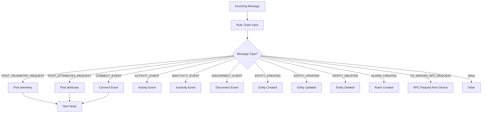

### Rule Node Connection Mapping

| Connection Type | Message Types |
|-----------------|---------------|
| "Post telemetry" | POST_TELEMETRY_REQUEST |
| "Post attributes" | POST_ATTRIBUTES_REQUEST |
| "Connect Event" | CONNECT_EVENT |
| "Disconnect Event" | DISCONNECT_EVENT |
| "Activity Event" | ACTIVITY_EVENT |
| "Inactivity Event" | INACTIVITY_EVENT |
| "Entity Created" | ENTITY_CREATED |
| "Entity Updated" | ENTITY_UPDATED |
| "Entity Deleted" | ENTITY_DELETED |
| "Alarm Created" | ALARM_CREATED |
| "Alarm Acknowledged" | ALARM_ACK |
| "Alarm Cleared" | ALARM_CLEAR |
| "RPC Request from Device" | TO_SERVER_RPC_REQUEST |
| "REST API request" | REST_API_REQUEST |
| "Other" | Self-messages, provisioning, internal |

## Metadata Patterns

### Device Messages

```json
{
  "deviceName": "Sensor-001",
  "deviceType": "temperature-sensor",
  "ts": "1634567890123"
}
```

### Alarm Messages

```json
{
  "isNewAlarm": "true",
  "isExistingAlarm": "false",
  "isClearedAlarm": "false",
  "isSeverityUpdated": "true",
  "PREV_ALARM_DETAILS": "{...previous alarm JSON...}"
}
```

### Rule Engine Processing

```json
{
  "STATUS": "OK",
  "STATUS_CODE": "200",
  "STATUS_REASON": "OK",
  "ERROR": "Exception message"
}
```

### Queue Processing

```json
{
  "OFFSET": "12345",
  "PARTITION": "0"
}
```

## Message Sources

```mermaid
graph TB
    subgraph "Transport Layer"
        MQTT[MQTT Transport]
        HTTP[HTTP Transport]
        CoAP[CoAP Transport]
    end

    subgraph "Generated Messages"
        T1[POST_TELEMETRY_REQUEST]
        T2[POST_ATTRIBUTES_REQUEST]
    end

    MQTT --> T1
    MQTT --> T2
    HTTP --> T1
    HTTP --> T2
    CoAP --> T1
    CoAP --> T2

    subgraph "Device Actor"
        DA[Device Actor]
    end

    subgraph "Lifecycle Messages"
        L1[CONNECT_EVENT]
        L2[DISCONNECT_EVENT]
        L3[ACTIVITY_EVENT]
        L4[INACTIVITY_EVENT]
    end

    DA --> L1
    DA --> L2
    DA --> L3
    DA --> L4

    subgraph "Entity Service"
        ES[Entity Service]
    end

    subgraph "Entity Messages"
        E1[ENTITY_CREATED]
        E2[ENTITY_UPDATED]
        E3[ENTITY_DELETED]
    end

    ES --> E1
    ES --> E2
    ES --> E3

    subgraph "Alarm Service"
        AS[Alarm Service]
    end

    subgraph "Alarm Messages"
        A1[ALARM_CREATED]
        A2[ALARM_ACK]
        A3[ALARM_CLEAR]
    end

    AS --> A1
    AS --> A2
    AS --> A3
```

## Common Patterns

### Processing Telemetry

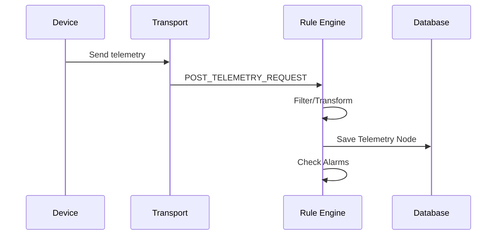

### Handling Device Offline

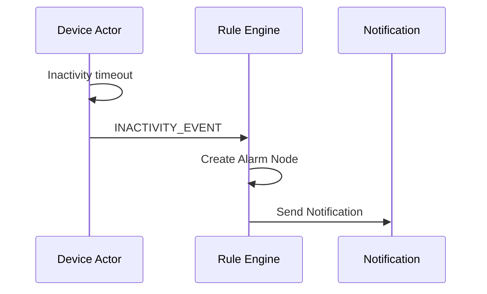

### Entity Lifecycle Automation

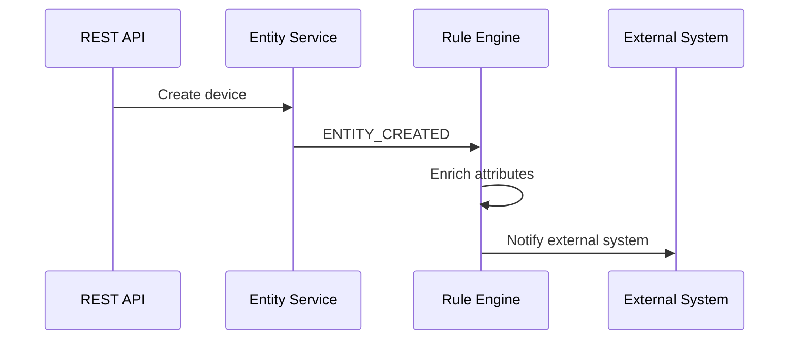

## Best Practices

### Creating Messages

- Always set the correct originator
- Include relevant metadata for downstream processing
- Use appropriate message type for routing
- Populate data with valid JSON/text

### Processing Messages

- Check message type before processing
- Read metadata for context
- Preserve or enhance metadata for downstream nodes
- Call success/failure callbacks

### Rule Chain Design

- Use message type filters at chain input
- Route different types to appropriate processing
- Handle "Other" connection for unexpected types
- Log unhandled message types

## See Also

- [Actor System Overview](./README.md) - Actor hierarchy
- [Message Flow](../04-rule-engine/message-flow.md) - TbMsg details
- [Rule Chain Structure](../04-rule-engine/rule-chain-structure.md) - Routing
- [Node Categories](../04-rule-engine/node-categories.md) - Processing nodes
