# Rule Chain Actor

## Overview

The Rule Chain Actor is the core message processing engine that orchestrates message flow through a configurable chain of rule nodes. Each rule chain has its own actor instance that manages node actors, maintains routing tables, and handles message delivery between nodes. Messages flow through connected nodes based on relation types (success, failure, custom), enabling complex business logic automation.

## Key Responsibilities

1. **Node Management**: Create, update, and destroy rule node actors
2. **Message Routing**: Direct messages between nodes based on relations
3. **Sub-Chain Invocation**: Handle calls to and returns from other rule chains
4. **Error Handling**: Route failures to error handlers or report errors
5. **Hot Reload**: Update configuration without service interruption

## Actor Lifecycle

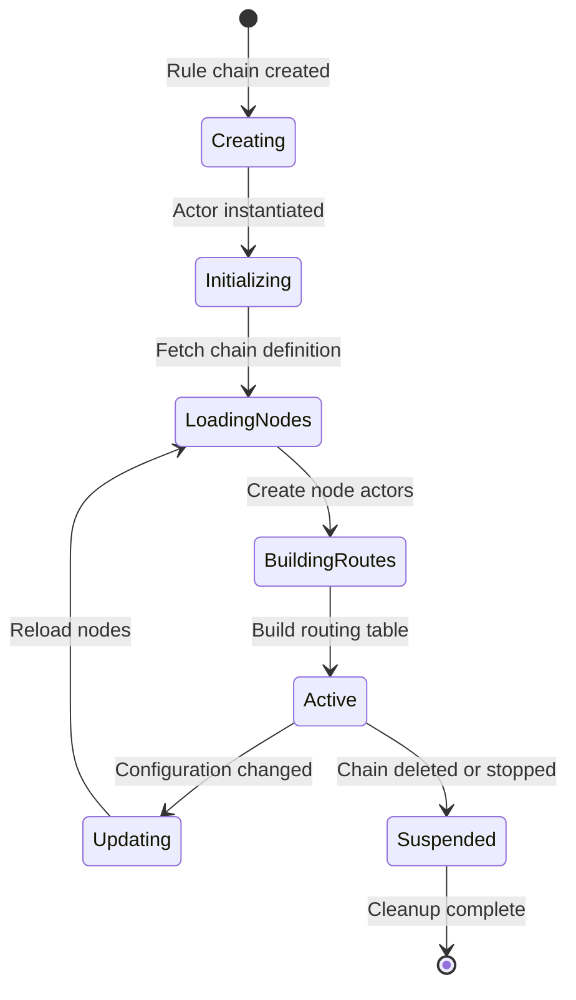
```mermaid
stateDiagram-v2
    [*] --> Creating: Rule chain created

    Creating --> Initializing: Actor instantiated
    Initializing --> LoadingNodes: Fetch chain definition
    LoadingNodes --> BuildingRoutes: Create node actors
    BuildingRoutes --> Active: Build routing table

    Active --> Updating: Configuration changed
    Updating --> LoadingNodes: Reload nodes

    Active --> Suspended: Chain deleted or stopped
    Suspended --> [*]: Cleanup complete
```

### Initialization Steps

1. Fetch rule chain definition from database
2. Validate chain type (CORE chains only)
3. Load all rule nodes for this chain
4. Create child actor for each rule node
5. Build routing table (node connections)
6. Set first node reference (entry point)
7. Transition to ACTIVE state

### Shutdown

1. Stop all child node actors
2. Clear routing tables
3. Release resources
4. Transition to SUSPENDED state

## Architecture

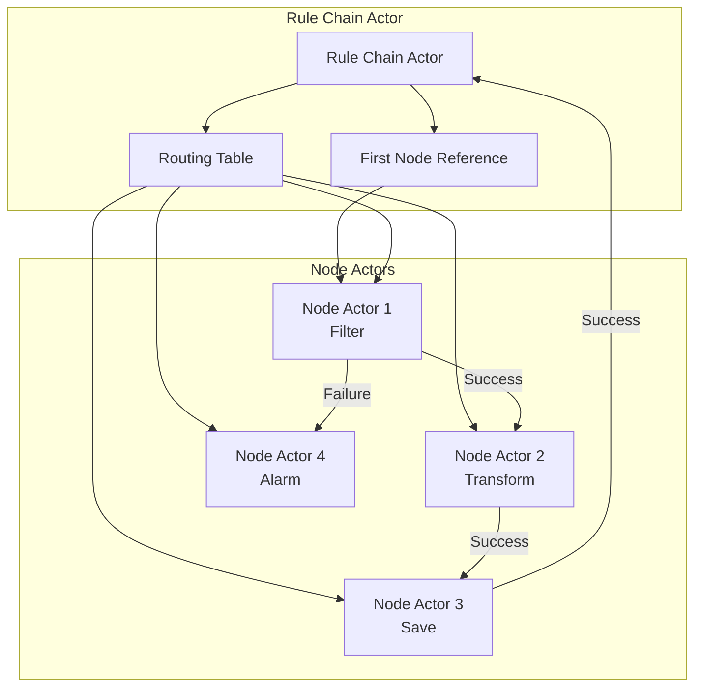
```mermaid
graph TB
    subgraph "Rule Chain Actor"
        RCA[Rule Chain Actor]
        RT[Routing Table]
        FN[First Node Reference]
    end

    subgraph "Node Actors"
        N1[Node Actor 1<br/>Filter]
        N2[Node Actor 2<br/>Transform]
        N3[Node Actor 3<br/>Save]
        N4[Node Actor 4<br/>Alarm]
    end

    RCA --> RT
    RCA --> FN
    FN --> N1
    RT --> N1
    RT --> N2
    RT --> N3
    RT --> N4

    N1 -->|Success| N2
    N1 -->|Failure| N4
    N2 -->|Success| N3
    N3 -->|Success| RCA
```

## Message Entry Points

Messages enter a rule chain through multiple paths:

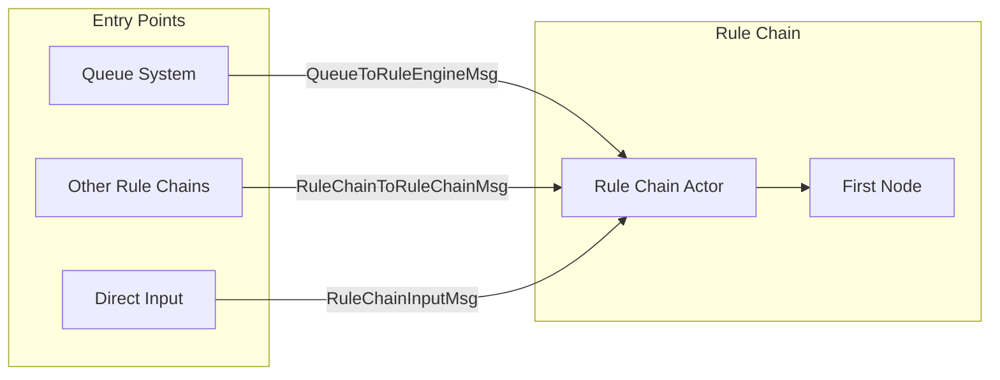
```mermaid
flowchart LR
    subgraph "Entry Points"
        Q[Queue System]
        OC[Other Rule Chains]
        DI[Direct Input]
    end

    subgraph "Rule Chain"
        RCA[Rule Chain Actor]
        FN[First Node]
    end

    Q -->|QueueToRuleEngineMsg| RCA
    OC -->|RuleChainToRuleChainMsg| RCA
    DI -->|RuleChainInputMsg| RCA
    RCA --> FN
```

### From Queue

| Message Type | Description |
|--------------|-------------|
| QueueToRuleEngineMsg | Standard queue delivery |

- Messages arrive from the message queue system
- May include explicit relation types (bypass normal routing)
- May specify target node ID (resume processing)
- Default: sent to first node

### From Other Rule Chains

| Message Type | Description |
|--------------|-------------|
| RuleChainToRuleChainMsg | Sub-chain invocation |

- One rule chain invokes another
- Contains source chain ID and relation type
- Routed to first node with specified relation

### Direct Input

| Message Type | Description |
|--------------|-------------|
| RuleChainInputMsg | External direct input |

- Explicit invocation from external source
- Routed to first node

## Message Flow Through Nodes

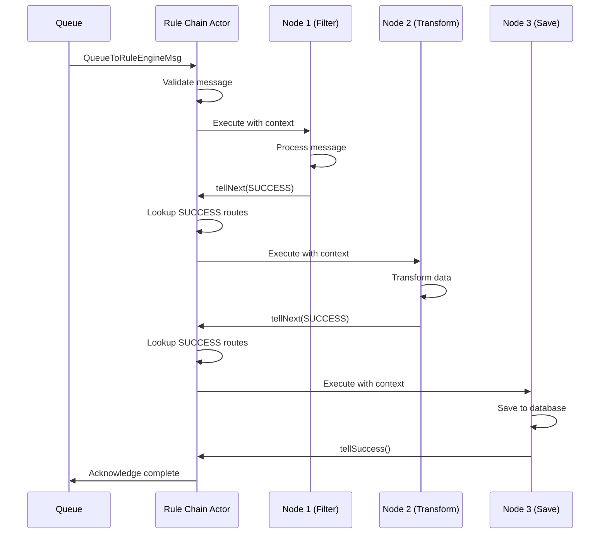
```mermaid
sequenceDiagram
    participant Q as Queue
    participant RC as Rule Chain Actor
    participant N1 as Node 1 (Filter)
    participant N2 as Node 2 (Transform)
    participant N3 as Node 3 (Save)

    Q->>RC: QueueToRuleEngineMsg
    RC->>RC: Validate message
    RC->>N1: Execute with context

    N1->>N1: Process message
    N1->>RC: tellNext(SUCCESS)

    RC->>RC: Lookup SUCCESS routes
    RC->>N2: Execute with context

    N2->>N2: Transform data
    N2->>RC: tellNext(SUCCESS)

    RC->>RC: Lookup SUCCESS routes
    RC->>N3: Execute with context

    N3->>N3: Save to database
    N3->>RC: tellSuccess()

    RC->>Q: Acknowledge complete
```

### Processing Sequence

1. **Chain Receives Message**: Rule chain actor receives message
2. **Validation**: Check message hasn't expired
3. **Routing Decision**: Determine target node
4. **Node Delivery**: Send to node actor with context
5. **Node Processing**: Node executes business logic
6. **Result Handling**: Node outputs with relation type
7. **Chain Routing**: Route to next nodes based on relation

## Node Actor Management

### Node Context

Each node has associated context:

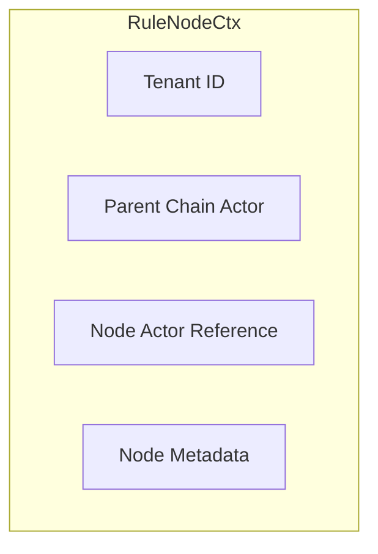
```mermaid
graph TB
    subgraph "RuleNodeCtx"
        TID[Tenant ID]
        PCA[Parent Chain Actor]
        NA[Node Actor Reference]
        NM[Node Metadata]
    end
```

| Field | Description |
|-------|-------------|
| Tenant ID | Owning tenant |
| Parent Chain Actor | Reference back to chain |
| Node Actor | The node actor itself |
| Node Metadata | Configuration and type info |

### Node Lifecycle

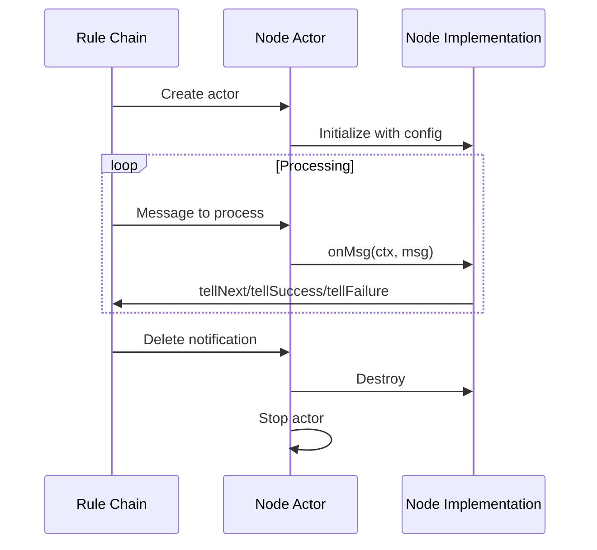
```mermaid
sequenceDiagram
    participant RC as Rule Chain
    participant NA as Node Actor
    participant N as Node Implementation

    RC->>NA: Create actor
    NA->>N: Initialize with config

    loop Processing
        RC->>NA: Message to process
        NA->>N: onMsg(ctx, msg)
        N->>RC: tellNext/tellSuccess/tellFailure
    end

    RC->>NA: Delete notification
    NA->>N: Destroy
    NA->>NA: Stop actor
```

### Hot Reload

When rule chain configuration updates:

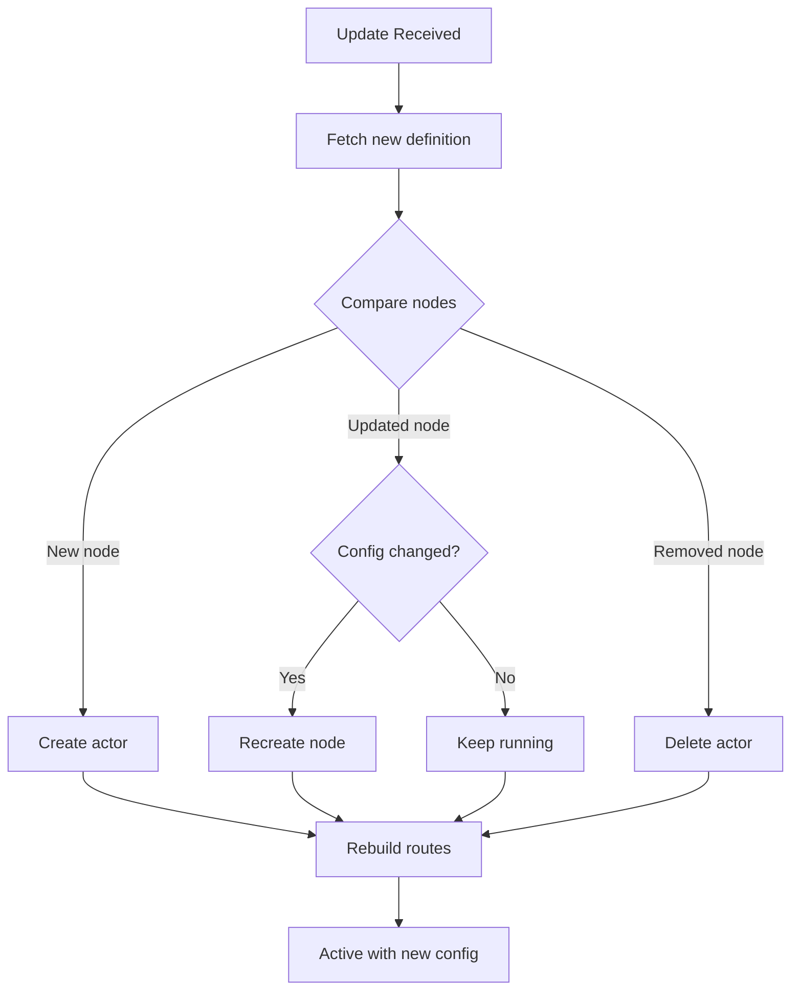
```mermaid
flowchart TD
    U[Update Received] --> F[Fetch new definition]
    F --> C{Compare nodes}

    C -->|New node| CN[Create actor]
    C -->|Updated node| UN{Config changed?}
    C -->|Removed node| DN[Delete actor]

    UN -->|Yes| RN[Recreate node]
    UN -->|No| SK[Keep running]

    CN --> RB[Rebuild routes]
    RN --> RB
    DN --> RB
    SK --> RB

    RB --> A[Active with new config]
```

## Connection Routing

### Relation Types

| Type | Meaning | Use Case |
|------|---------|----------|
| Success | Normal completion | Continue processing |
| Failure | Error occurred | Error handling path |
| True/False | Boolean result | Filter nodes |
| Custom | Node-specific | Domain routing |

### Routing Table Structure

The `RuleChainActorMessageProcessor` maintains two critical data structures:

```
Map<RuleNodeId, RuleNodeCtx> nodeActors     - All rule node instances
Map<RuleNodeId, List<RuleNodeRelation>> nodeRoutes  - Pre-computed routing table
```

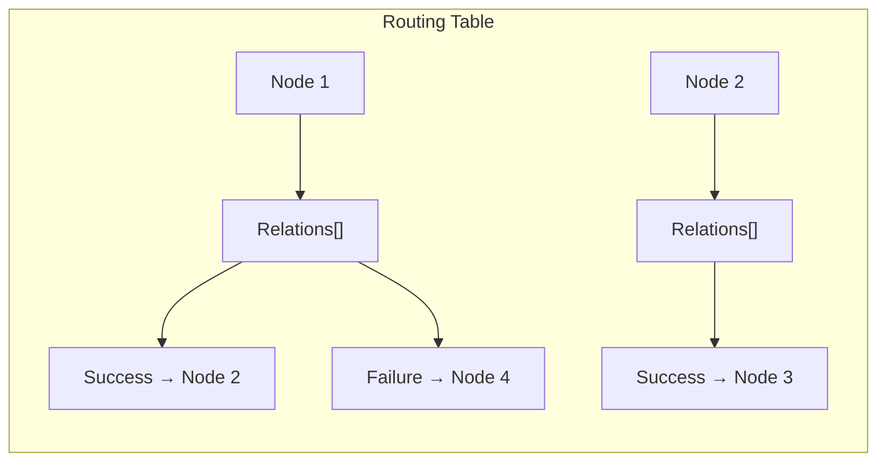
```mermaid
graph LR
    subgraph "Routing Table"
        N1[Node 1] --> R1["Relations[]"]
        R1 --> T1["Success → Node 2"]
        R1 --> T2["Failure → Node 4"]

        N2[Node 2] --> R2["Relations[]"]
        R2 --> T3["Success → Node 3"]
    end
```

**RuleNodeRelation Structure**:
| Field | Type | Description |
|-------|------|-------------|
| in | EntityId | Source node ID |
| out | EntityId | Target (RULE_NODE or RULE_CHAIN) |
| type | String | Connection type (SUCCESS, FAILURE, etc.) |

**Route Lookup**: O(1) via `nodeRoutes.get(originatorNodeId)` with case-insensitive relation type matching.

### Single vs Multiple Targets

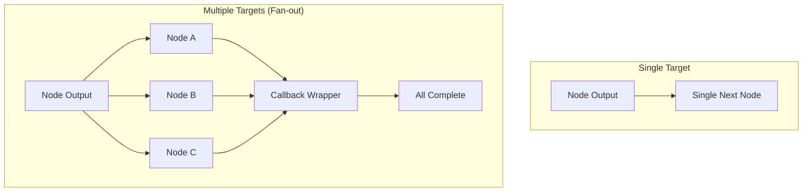
```mermaid
flowchart TD
    subgraph "Single Target"
        S1[Node Output] --> S2[Single Next Node]
    end

    subgraph "Multiple Targets (Fan-out)"
        M1[Node Output] --> M2[Node A]
        M1 --> M3[Node B]
        M1 --> M4[Node C]

        M2 --> MW[Callback Wrapper]
        M3 --> MW
        M4 --> MW
        MW --> MC[All Complete]
    end
```

| Pattern | Behavior |
|---------|----------|
| Single Target | Direct send to next node |
| Multiple Targets | Message copied for each, callback wrapper tracks completion |

### Multi-Target Callback Aggregation

For fan-out scenarios, `MultipleTbQueueTbMsgCallbackWrapper` aggregates completions:

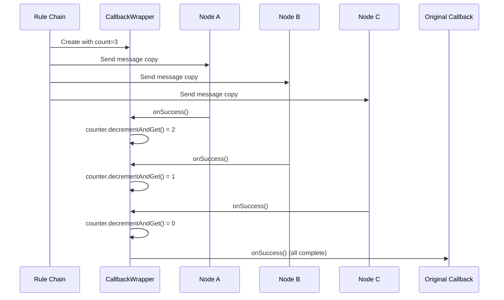
```mermaid
sequenceDiagram
    participant RC as Rule Chain
    participant W as CallbackWrapper
    participant N1 as Node A
    participant N2 as Node B
    participant N3 as Node C
    participant CB as Original Callback

    RC->>W: Create with count=3
    RC->>N1: Send message copy
    RC->>N2: Send message copy
    RC->>N3: Send message copy

    N1->>W: onSuccess()
    W->>W: counter.decrementAndGet() = 2
    N2->>W: onSuccess()
    W->>W: counter.decrementAndGet() = 1
    N3->>W: onSuccess()
    W->>W: counter.decrementAndGet() = 0
    W->>CB: onSuccess() (all complete)
```

**Behavior**:
- Uses `AtomicInteger` to count pending completions
- `onSuccess()`: Calls original callback only when counter reaches 0
- `onFailure()`: Immediately propagates failure to original callback

### Local vs Remote Routing

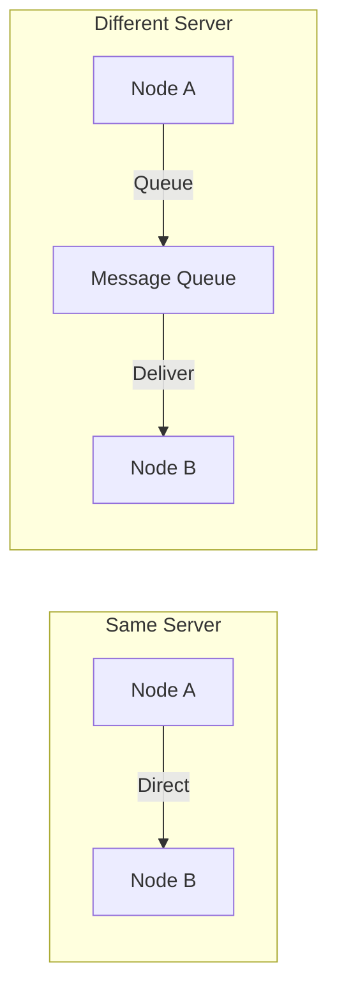
```mermaid
flowchart LR
    subgraph "Same Server"
        L1[Node A] -->|Direct| L2[Node B]
    end

    subgraph "Different Server"
        R1[Node A] -->|Queue| Q[Message Queue]
        Q -->|Deliver| R2[Node B]
    end
```

| Location | Mechanism |
|----------|-----------|
| Local | Direct actor message |
| Remote | Re-queue with routing metadata |

### Partition-Aware Routing

The `pushToTarget()` method determines routing based on partition ownership:

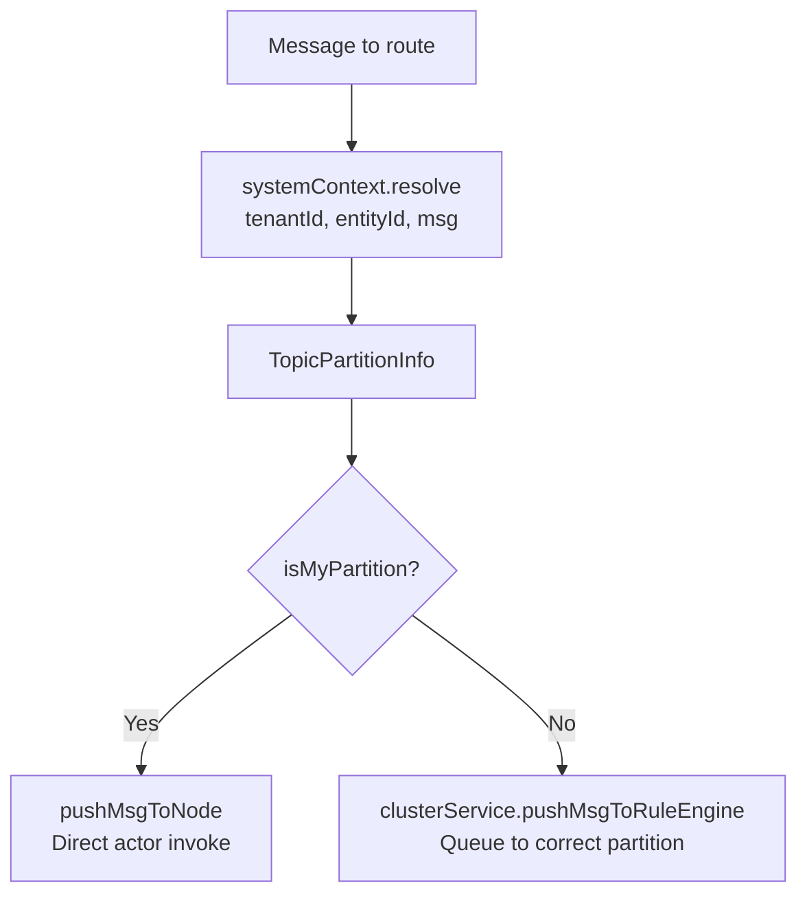
```mermaid
flowchart TD
    MSG[Message to route] --> RESOLVE[systemContext.resolve<br/>tenantId, entityId, msg]
    RESOLVE --> PARTITION[TopicPartitionInfo]

    PARTITION --> CHECK{isMyPartition?}
    CHECK -->|Yes| LOCAL[pushMsgToNode<br/>Direct actor invoke]
    CHECK -->|No| REMOTE[clusterService.pushMsgToRuleEngine<br/>Queue to correct partition]
```

**Key Implementation Details**:
- `TopicPartitionInfo` cached and reused across targets in same `tellNext()` call
- Prevents redundant partition lookups for performance
- Enables horizontal scaling across cluster nodes
- Messages carry routing metadata for correct partition delivery

## Sub-Rule Chain Invocation

### Calling a Sub-Chain

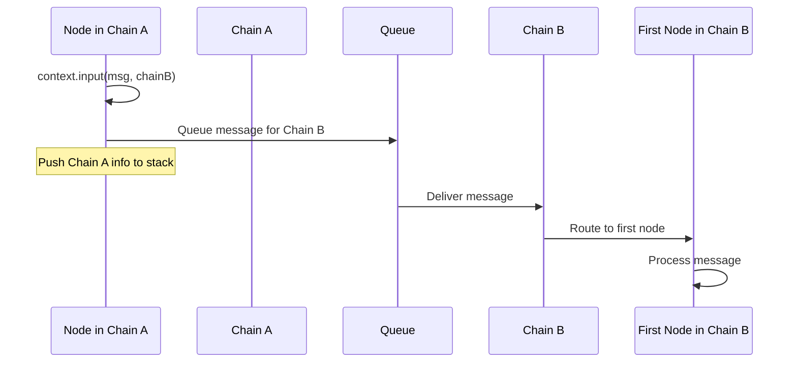
```mermaid
sequenceDiagram
    participant N1 as Node in Chain A
    participant CA as Chain A
    participant Q as Queue
    participant CB as Chain B
    participant N2 as First Node in Chain B

    N1->>N1: context.input(msg, chainB)
    N1->>Q: Queue message for Chain B
    Note over N1: Push Chain A info to stack

    Q->>CB: Deliver message
    CB->>N2: Route to first node
    N2->>N2: Process message
```

### Returning from Sub-Chain

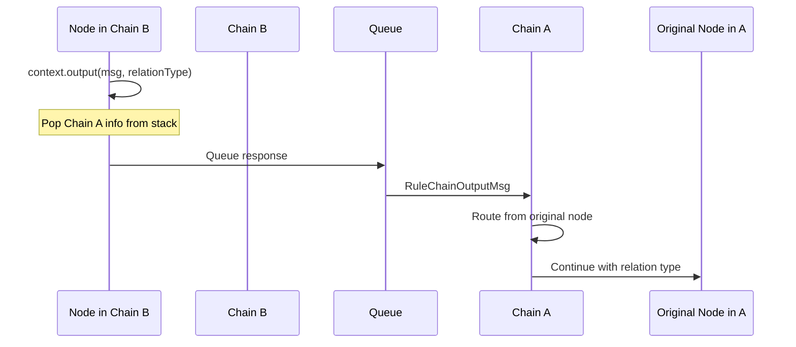
```mermaid
sequenceDiagram
    participant N2 as Node in Chain B
    participant CB as Chain B
    participant Q as Queue
    participant CA as Chain A
    participant N1 as Original Node in A

    N2->>N2: context.output(msg, relationType)
    Note over N2: Pop Chain A info from stack
    N2->>Q: Queue response

    Q->>CA: RuleChainOutputMsg
    CA->>CA: Route from original node
    CA->>N1: Continue with relation type
```

### Call Stack Management

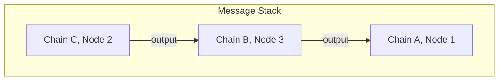
```mermaid
graph TB
    subgraph "Message Stack"
        S1[Chain A, Node 1]
        S2[Chain B, Node 3]
        S3[Chain C, Node 2]
    end

    S3 -->|output| S2
    S2 -->|output| S1
```

The message carries a stack of calling contexts via `TbMsgProcessingCtx`:

**Stack Operations**:
```
input() call:
  tbMsg.pushToStack(ruleChainId, ruleNodeId)
  → Lazy LinkedList initialization (only when needed)

output() call:
  item = msg.popFromStack()
  → Returns TbMsgProcessingStackItem with parent chain/node IDs
  → If null: End of chain, acknowledge message
  → Else: Route RuleChainOutputMsg back to parent
```

**TbMsgProcessingStackItem Structure**:
| Field | Description |
|-------|-------------|
| ruleChainId | Parent rule chain that called input() |
| ruleNodeId | Node in parent chain that initiated call |

This enables:
- Proper callback routing in nested scenarios (A → B → C → B → A)
- Stack unwinding as sub-chains complete
- Arbitrarily deep chain composition

## Error Handling

### Error Flow

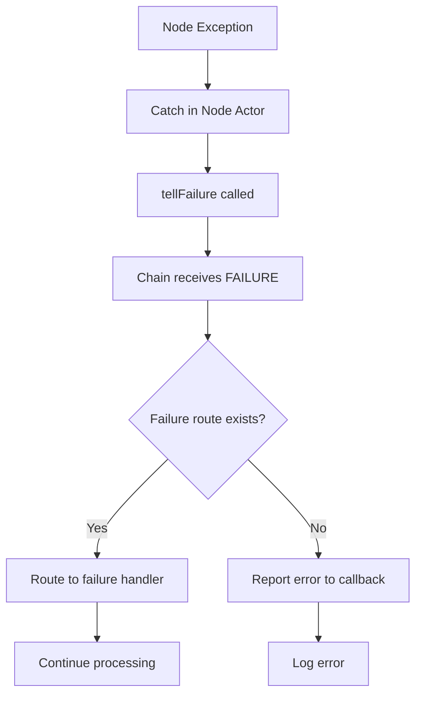
```mermaid
flowchart TD
    E[Node Exception] --> C[Catch in Node Actor]
    C --> TF[tellFailure called]
    TF --> RC[Chain receives FAILURE]

    RC --> LF{Failure route exists?}
    LF -->|Yes| FH[Route to failure handler]
    LF -->|No| RE[Report error to callback]

    FH --> P[Continue processing]
    RE --> L[Log error]
```

### Error Types

| Error | Description | Handling |
|-------|-------------|----------|
| RuleNodeException | Node execution failure | Route to failure handler |
| RuleEngineException | System-level error | Report and log |
| Message Expired | TTL exceeded | Skip processing, acknowledge |

### Error Context

Errors include full context for debugging:
- Chain name and ID
- Node name and ID
- Execution path (stack)
- Error message and details

## Queue Integration

### Outbound Flow

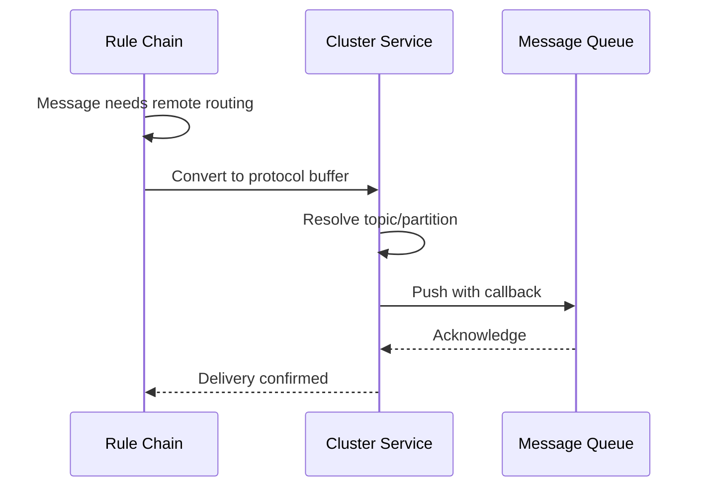
```mermaid
sequenceDiagram
    participant RC as Rule Chain
    participant CS as Cluster Service
    participant Q as Message Queue

    RC->>RC: Message needs remote routing
    RC->>CS: Convert to protocol buffer
    CS->>CS: Resolve topic/partition
    CS->>Q: Push with callback
    Q-->>CS: Acknowledge
    CS-->>RC: Delivery confirmed
```

### Inbound Flow

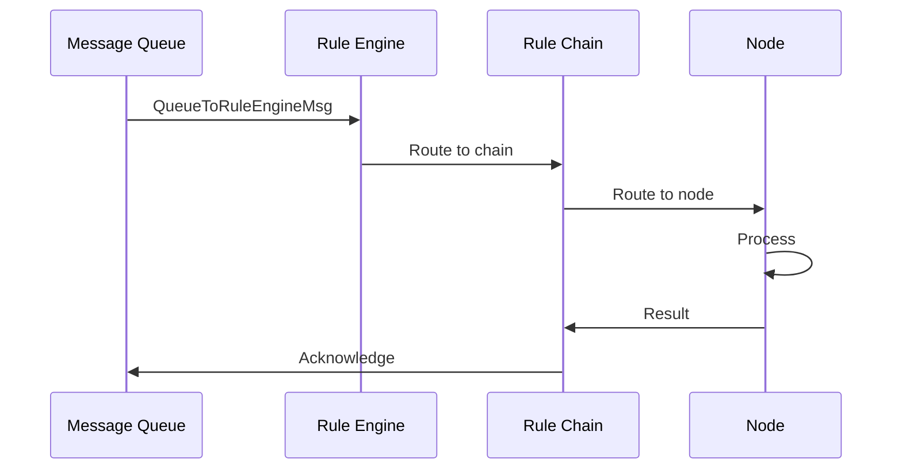
```mermaid
sequenceDiagram
    participant Q as Message Queue
    participant RE as Rule Engine
    participant RC as Rule Chain
    participant N as Node

    Q->>RE: QueueToRuleEngineMsg
    RE->>RC: Route to chain
    RC->>N: Route to node
    N->>N: Process
    N->>RC: Result
    RC->>Q: Acknowledge
```

### Callback Mechanisms

| Type | Purpose |
|------|---------|
| Simple Callback | Report single result |
| Multi-Target Callback | Track multiple branches, complete when all finish |

## Configuration Hot Reload

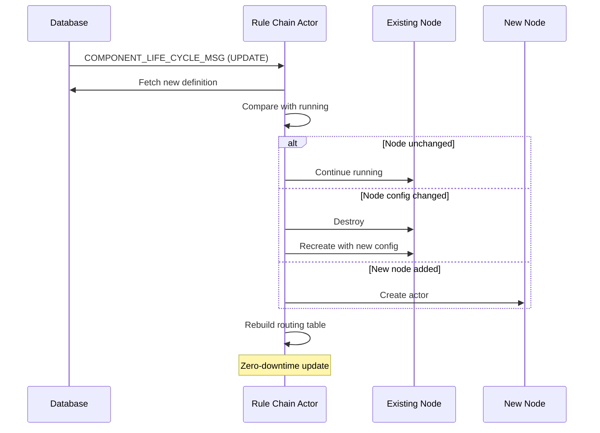
```mermaid
sequenceDiagram
    participant DB as Database
    participant RC as Rule Chain Actor
    participant N1 as Existing Node
    participant N2 as New Node

    DB->>RC: COMPONENT_LIFE_CYCLE_MSG (UPDATE)
    RC->>DB: Fetch new definition
    RC->>RC: Compare with running

    alt Node unchanged
        RC->>N1: Continue running
    else Node config changed
        RC->>N1: Destroy
        RC->>N1: Recreate with new config
    else New node added
        RC->>N2: Create actor
    end

    RC->>RC: Rebuild routing table
    Note over RC: Zero-downtime update
```

### Update Process

1. Receive update notification
2. Fetch updated chain definition
3. Compare with running instance
4. For each node:
   - **New**: Create actor
   - **Updated (config changed)**: Destroy and recreate
   - **Updated (no change)**: Continue running
   - **Removed**: Send delete notification
5. Rebuild routing table
6. Update first node reference

## Performance Considerations

### Design Optimizations

| Optimization | Benefit |
|--------------|---------|
| Asynchronous Processing | Non-blocking execution |
| Partitioning | Distributed load |
| Message TTL | Prevents infinite loops |
| Execution Limits | Bounds processing depth |
| Callback Batching | Efficient multi-target handling |

### Execution Limits

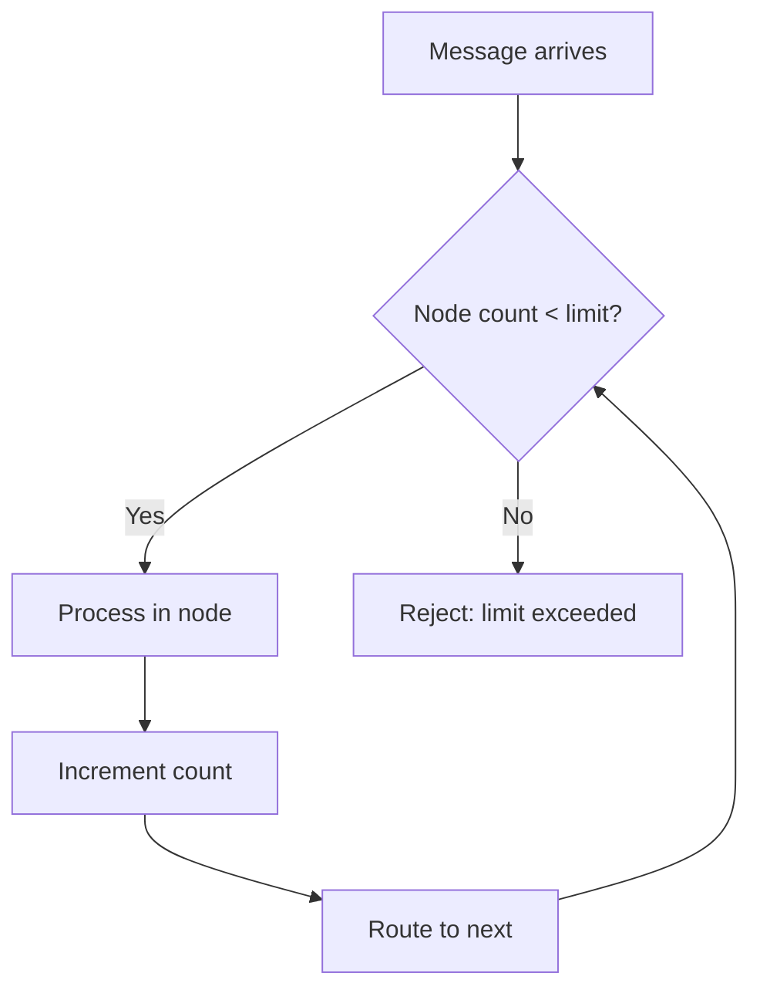
```mermaid
flowchart TD
    M[Message arrives] --> C{Node count < limit?}
    C -->|Yes| P[Process in node]
    P --> I[Increment count]
    I --> N[Route to next]
    N --> C

    C -->|No| R[Reject: limit exceeded]
```

| Limit | Purpose |
|-------|---------|
| Max Rule Nodes | Prevents runaway processing |
| Message TTL | Expires old messages |
| Queue Depth | Bounds memory usage |

### Potential Bottlenecks

- Overloaded node actor
- Fan-out to many targets
- Large message payloads
- Slow external integrations

## Node Actor Details

### Message Processing

```mermaid
sequenceDiagram
    participant RC as Rule Chain
    participant NA as Node Actor
    participant NI as Node Implementation

    RC->>NA: Message with context
    NA->>NA: Check partition ownership

    alt Not local partition
        NA->>RC: Re-queue to correct partition
    else Local partition
        NA->>NA: Validate message
        NA->>NA: Check execution limits
        NA->>NI: onMsg(ctx, msg)
        NI->>NI: Execute logic
        NI->>RC: tellNext/tellSuccess/tellFailure
    end
```

### Execution Context

The context provided to nodes enables:

| Method | Purpose |
|--------|---------|
| tellNext(relationType) | Route to connected nodes |
| tellSuccess() | Signal successful completion |
| tellFailure(error) | Signal failure |
| input(chainId) | Call sub-chain |
| output(relationType) | Return from sub-chain |
| enqueue(msg, queue) | Send to specific queue |

### DefaultTbContext Implementation

The `DefaultTbContext` is instantiated for each rule node and provides comprehensive platform access:

```
new DefaultTbContext(systemContext, ruleChainName, nodeCtx)
```

**Service Proxy Architecture**:
- Delegates to 80+ platform services (DeviceService, AssetService, AlarmService, etc.)
- Lazy access pattern - services retrieved on-demand via `systemContext` getters
- Enables dependency injection into rule node implementations without tight coupling

**Key Service Categories**:
| Category | Services |
|----------|----------|
| Entity Management | DeviceService, AssetService, CustomerService, TenantService |
| Data Access | AttributesService, TimeseriesService, RelationService |
| Messaging | RuleEngineRpcService, TbClusterService, NotificationCenter |
| Security | AccessValidator, TenantProfileService |
| State | AlarmService, RuleEngineDeviceStateManager |

**State Management Methods**:
| Method | Purpose |
|--------|---------|
| getRuleNodeStates() | Paginated query of node state persistence |
| saveRuleNodeState() | Per-entity state storage for stateful nodes |
| clearRuleNodeState() | Remove persisted state |
| checkTenantEntity() | Cross-tenant boundary validation |

**Message Copy Strategy**:
- Reference passes within same partition
- Shallow copies (`UUID.randomUUID()`, new TbMsg) for queue transit
- Deep copies (`msg.copy().build()`) only for cross-partition messages

## Common Patterns

### Filter and Route

```mermaid
graph LR
    I[Input] --> F[Filter Node]
    F -->|True| T[Transform]
    F -->|False| L[Log]
    T --> S[Save]
```

### Error Handling Chain

```mermaid
graph LR
    I[Input] --> P[Process]
    P -->|Success| S[Save]
    P -->|Failure| E[Error Handler]
    E --> N[Notify]
    E --> L[Log Error]
```

### Sub-Chain Composition

```mermaid
graph TB
    subgraph "Main Chain"
        M1[Receive] --> M2[Validate]
        M2 -->|Valid| SC[Sub-Chain: Process]
        M2 -->|Invalid| M3[Reject]
        SC --> M4[Complete]
    end

    subgraph "Sub-Chain: Process"
        S1[Transform] --> S2[Enrich]
        S2 --> S3[Save]
    end

    SC -.->|input| S1
    S3 -.->|output| M4
```

### Fan-Out Processing

```mermaid
graph TB
    I[Input] --> F[Fan-Out Node]
    F --> A[Analytics]
    F --> S[Storage]
    F --> N[Notification]

    A --> C[Callback Wrapper]
    S --> C
    N --> C
    C --> D[Done]
```

## Best Practices

### For Rule Chain Design

- Keep chains focused on single responsibility
- Use sub-chains for reusable logic
- Always include failure handlers
- Set appropriate timeouts for external calls
- Monitor execution depth

### For Node Implementation

- Make nodes idempotent when possible
- Handle failures gracefully
- Validate inputs early
- Use async operations for I/O
- Report accurate relation types

### For System Administration

- Monitor queue depths
- Set execution limits per tenant
- Review chain complexity
- Enable debug mode for troubleshooting
- Archive old messages

## Common Pitfalls and Gotchas

### Node Execution Limit Exceeded

Messages have a maximum rule node execution count. Exceeding this limit causes immediate message rejection, even if processing was valid.

```mermaid
flowchart TD
    MSG[Message] --> N1[Node 1]
    N1 --> N2[Node 2]
    N2 --> N3[...]
    N3 --> LIMIT[Node N]
    LIMIT --> CHECK{Count < Max?}
    CHECK -->|No| REJECT[Message rejected]

    style REJECT fill:#ffcdd2
```

**Impact:** Complex chains with many nodes may hit this limit.

**Mitigation:** Simplify chains; use sub-chains to reset count; increase limit if necessary.

### Fan-Out Callback Failure Propagation

When routing to multiple targets, a single failure immediately propagates to the original callback, even if other branches succeed.

```mermaid
sequenceDiagram
    participant RC as Rule Chain
    participant A as Node A
    participant B as Node B
    participant C as Node C
    participant CB as Callback

    RC->>A: Send copy
    RC->>B: Send copy
    RC->>C: Send copy

    A-->>RC: Success
    B-->>RC: FAILURE
    RC->>CB: onFailure() immediately
    Note over C: Still processing...
```

**Impact:** One failing branch causes entire fan-out to report failure.

**Mitigation:** Use separate error handling for critical branches.

### Sub-Chain Stack Overflow

Deeply nested sub-chain calls accumulate on the message's processing stack. Very deep nesting can exhaust stack memory.

| Nesting Depth | Risk |
|---------------|------|
| 1-10 | Safe |
| 10-50 | Monitor |
| 50+ | Potential issues |

**Mitigation:** Flatten chain hierarchies; avoid recursive sub-chain patterns.

### Hot Reload Node State Loss

When a rule node's configuration changes, the node actor is destroyed and recreated. Any in-memory state accumulated by the node is lost.

```mermaid
sequenceDiagram
    participant Admin as Admin UI
    participant RC as Rule Chain
    participant Node as Node Actor

    Node->>Node: Accumulate state
    Admin->>RC: Update node config
    RC->>Node: Destroy
    Note over Node: State lost!
    RC->>RC: Create new node
```

**Impact:** Stateful nodes (counters, buffers) lose data on configuration changes.

**Mitigation:** Use external state storage for critical state; design nodes to be stateless.

### Message TTL During Sub-Chain Processing

Message TTL continues expiring during sub-chain processing. Long sub-chain execution can cause messages to expire mid-processing.

```mermaid
flowchart LR
    START[Message TTL: 10s] --> SC1[Sub-chain 1: 4s]
    SC1 --> SC2[Sub-chain 2: 4s]
    SC2 --> SC3[Sub-chain 3: 3s]
    SC3 --> EXPIRED[TTL Exceeded!]

    style EXPIRED fill:#ffcdd2
```

**Mitigation:** Set TTL appropriate for total expected processing time.

### Partition Routing Latency

When a message needs to be routed to a different cluster node (different partition owner), it goes through the message queue, adding latency.

| Routing Type | Latency |
|--------------|---------|
| Local (same partition) | Microseconds |
| Remote (queue) | Milliseconds |

**Impact:** Chains spanning multiple partitions have higher latency.

**Mitigation:** Design chains to minimize cross-partition routing.

### First Node Assumption

Messages entering a rule chain always start at the "first node" unless explicitly directed elsewhere. If the first node is incorrectly configured or removed, all messages fail.

**Impact:** Deleting or misconfiguring the first node breaks the entire chain.

**Mitigation:** Validate first node configuration; test changes before production.

### Output Without Stack Returns to Queue

Calling `output()` when the message stack is empty doesn't fail—it simply acknowledges the message and processing ends. This can silently complete chains that expected to continue.

```mermaid
flowchart TD
    CALL[context.output] --> CHECK{Stack empty?}
    CHECK -->|Yes| ACK[Acknowledge message]
    CHECK -->|No| ROUTE[Route to parent]

    style ACK fill:#e8f5e9
```

**Mitigation:** Design chains with clear termination points; avoid unnecessary `output()` calls.

### Relation Type Case Insensitivity Surprise

Relation type matching is case-insensitive. `Success`, `SUCCESS`, and `success` all match the same routes. This can cause unexpected routing if different cases are used inconsistently.

| Configured Route | Message Relation | Match? |
|------------------|------------------|--------|
| SUCCESS | Success | Yes |
| Success | SUCCESS | Yes |
| success | SUCCESS | Yes |

**Best Practice:** Use consistent casing for relation types (conventionally uppercase).

## See Also

- [Actor System Overview](./README.md) - Actor hierarchy
- [Device Actor](./device-actor.md) - Device message handling
- [Message Types Reference](./message-types.md) - All message types
- [Rule Engine Overview](../04-rule-engine/README.md) - Rule engine concepts
- [Rule Chain Structure](../04-rule-engine/rule-chain-structure.md) - Chain configuration
- [Node Categories](../04-rule-engine/node-categories.md) - Available nodes
