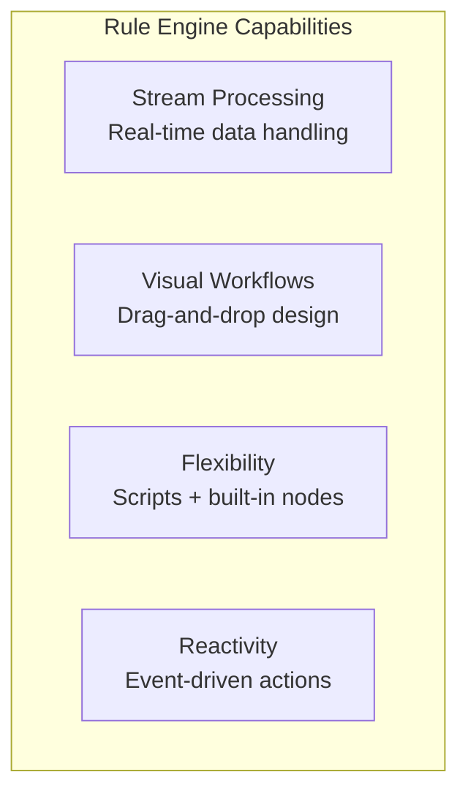
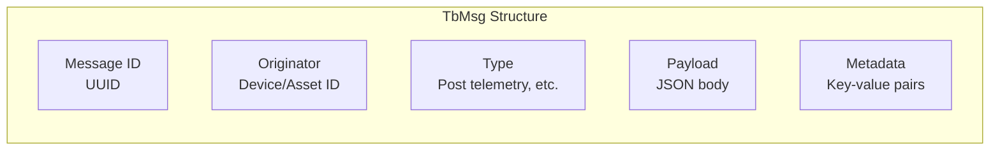
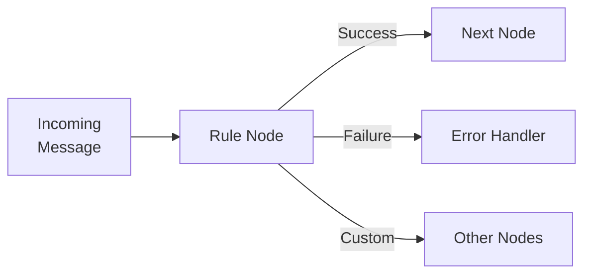
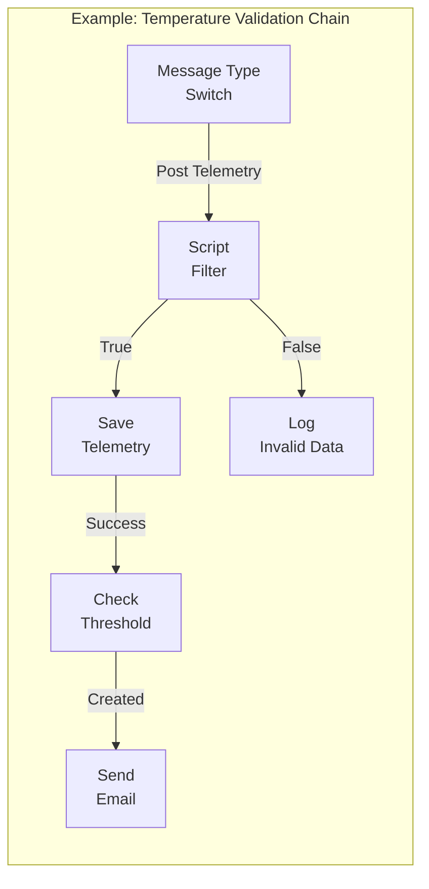
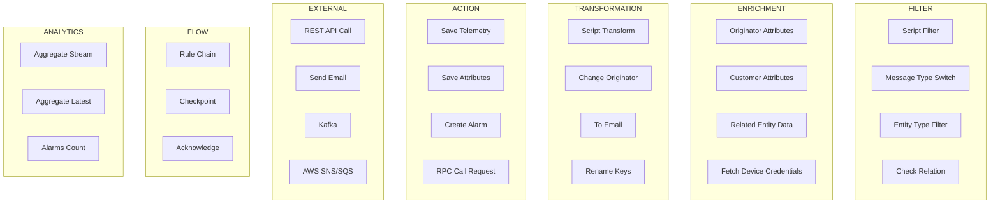
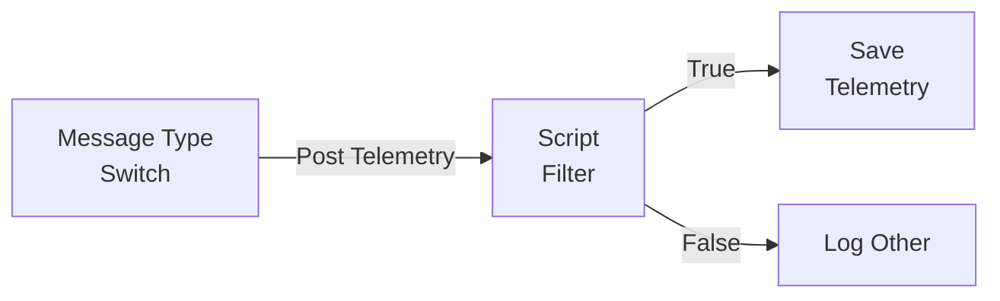
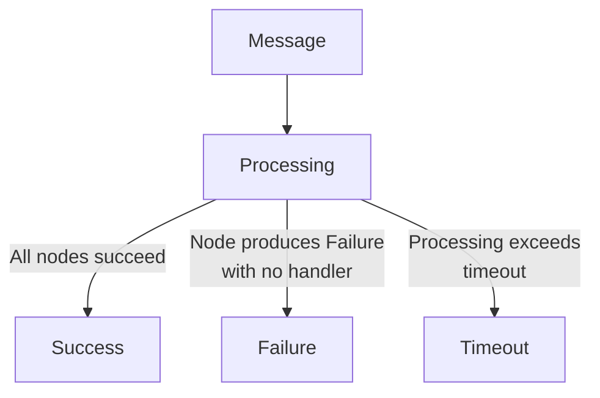
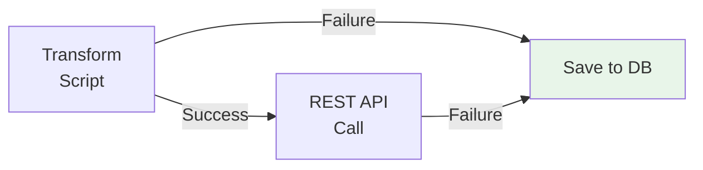
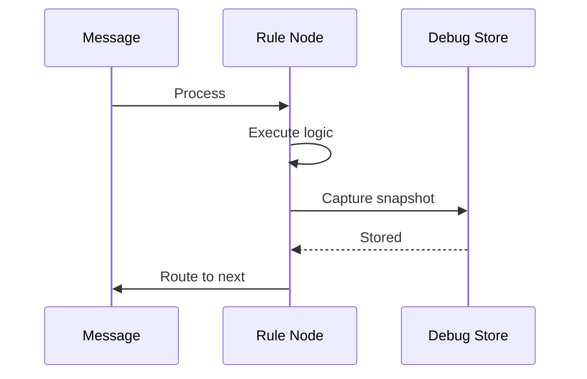
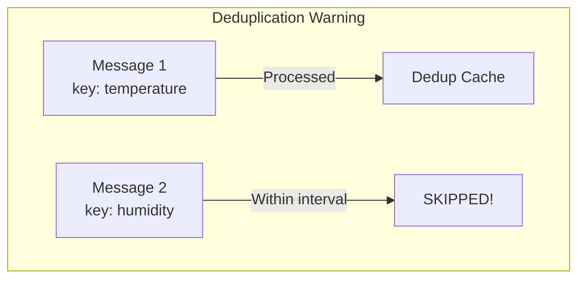

# Rule Engine Overview

## Overview

The Rule Engine is the core data processing mechanism in ThingsBoard. It receives, transforms, routes, and reacts to events and telemetry from devices and other sources. Processing is organized into **rule chains** - visual workflows composed of **rule nodes** that each perform a specific action.

## Key Characteristics



| Characteristic | Description |
|----------------|-------------|
| **Stream Processing** | Incoming data (telemetry, attributes, RPC, events) is immediately processed |
| **Rule Chain Workflows** | Data processing organized into visual chains of connected nodes |
| **Flexibility** | Supports built-in nodes AND custom logic via JavaScript/TBEL scripts |
| **External Integration** | Connect to external systems (HTTP, Kafka, MQTT, cloud services) |

## Typical Use Cases

| Use Case | Description | Key Nodes |
|----------|-------------|-----------|
| **Data Validation** | Validate and filter incoming telemetry before storage | Script Filter, Check Fields Presence |
| **Telemetry Aggregation** | Copy data from devices to related assets for summary analytics | Change Originator, Save Telemetry |
| **Alarm Management** | Create, update, or clear alarms based on conditions | Create Alarm, Clear Alarm |
| **Device Lifecycle Monitoring** | Trigger actions when device state changes (online/offline) | Message Type Switch, Create Alarm |
| **Data Enrichment** | Load additional context (thresholds, customer info) for processing | Originator Attributes, Customer Attributes |
| **External Integration** | Call REST APIs, send to Kafka, push to cloud services | REST API Call, Kafka, AWS SNS/SQS |
| **Notifications** | Send email/SMS alerts when complex events occur | Send Email, Send SMS, Send Notification |
| **Remote Control** | Execute RPC calls to devices based on conditions | RPC Call Request |

## Core Components

### Rule Engine Message (TbMsg)

Every piece of data flows through the rule engine as an immutable message:



| Field | Description | Example |
|-------|-------------|---------|
| **id** | Time-based UUID | `550e8400-e29b-41d4-a716-446655440000` |
| **originator** | Source entity ID | `Device: sensor-001` |
| **type** | Message type | `Post telemetry`, `Inactivity Event` |
| **data** | JSON payload | `{"temperature": 22.5}` |
| **metadata** | Additional context | `deviceName: "DHT22", deviceType: "sensor"` |

### Rule Node

A rule node processes one message at a time and produces one or more outgoing messages:



### Rule Node Connection

Nodes connect via typed relations that determine message routing:

| Relation Type | Meaning |
|---------------|---------|
| **Success** | Node completed successfully |
| **Failure** | Node encountered an error |
| **True** | Filter condition passed |
| **False** | Filter condition failed |
| **Custom** | Node-specific outputs (e.g., "High Temperature", "Created") |

**Important:** Connection names are **case-sensitive**.

### Rule Chain

A rule chain is a visual workflow connecting multiple nodes:



**Key Concepts:**
- Each tenant has one **Root Rule Chain** that receives all device messages
- Rule chains can invoke other rule chains for modular design
- Debug mode enables message inspection at any node

## Message Types

### Device Messages

| Type | Display Name | Trigger | Payload |
|------|--------------|---------|---------|
| `POST_TELEMETRY_REQUEST` | Post telemetry | Device sends telemetry | `{"temperature": 22.7}` |
| `POST_ATTRIBUTES_REQUEST` | Post attributes | Device sends attributes | `{"currentState": "IDLE"}` |
| `TO_SERVER_RPC_REQUEST` | RPC Request from Device | Device initiates RPC | `{"method": "getTime", "params": {}}` |
| `ACTIVITY_EVENT` | Activity Event | Device becomes active | Activity info JSON |
| `INACTIVITY_EVENT` | Inactivity Event | Device becomes inactive | Activity info JSON |
| `CONNECT_EVENT` | Connect Event | Device connects | Activity info JSON |
| `DISCONNECT_EVENT` | Disconnect Event | Device disconnects | Activity info JSON |

### Entity Lifecycle Messages

| Type | Display Name | Trigger | Metadata |
|------|--------------|---------|----------|
| `ENTITY_CREATED` | Entity Created | New entity created | `userName`, `userId` |
| `ENTITY_UPDATED` | Entity Updated | Entity modified | `userName`, `userId` |
| `ENTITY_DELETED` | Entity Deleted | Entity removed | `userName`, `userId` |
| `ENTITY_ASSIGNED` | Entity Assigned | Assigned to customer | `assignedCustomerName`, `assignedCustomerId` |
| `ENTITY_UNASSIGNED` | Entity Unassigned | Unassigned from customer | `unassignedCustomerName`, `unassignedCustomerId` |

### Attribute Messages

| Type | Display Name | Trigger | Metadata |
|------|--------------|---------|----------|
| `ATTRIBUTES_UPDATED` | Attributes Updated | Attributes changed | `scope` (SERVER_SCOPE or SHARED_SCOPE) |
| `ATTRIBUTES_DELETED` | Attributes Deleted | Attributes removed | `scope`, deleted keys list |

### Alarm Messages

| Type | Display Name | Trigger | Metadata |
|------|--------------|---------|----------|
| `ALARM` | Alarm Event | Alarm created/updated/deleted | `isNewAlarm`, `isExistingAlarm`, `isClearedAlarm` |
| `ALARM_ASSIGNED` | Alarm Assigned | Alarm assigned to user | `userEmail`, `userName` |
| `ALARM_UNASSIGNED` | Alarm Unassigned | Alarm unassigned | `userEmail`, `userName` |
| `COMMENT_CREATED` | Comment Created | Alarm comment added | `comment` JSON |
| `COMMENT_UPDATED` | Comment Updated | Alarm comment modified | `comment` JSON |

### RPC Messages

| Type | Display Name | Trigger |
|------|--------------|---------|
| `RPC_CALL_FROM_SERVER_TO_DEVICE` | RPC Request to Device | Server initiates RPC |
| `RPC_QUEUED` | RPC Queued | Persistent RPC queued |
| `RPC_DELIVERED` | RPC Delivered | Device received RPC |
| `RPC_SUCCESSFUL` | RPC Successful | Device responded |
| `RPC_TIMEOUT` | RPC Timeout | RPC timed out |
| `RPC_FAILED` | RPC Failed | RPC failed |

## Node Categories



| Category | Count | Purpose |
|----------|-------|---------|
| [Filter](./nodes/filter-nodes.md) | 13 | Route messages based on conditions |
| [Enrichment](./nodes/enrichment-nodes.md) | 12 | Add data from database to messages |
| [Transformation](./nodes/transformation-nodes.md) | 13 | Modify message content |
| [Action](./nodes/action-nodes.md) | 32 | Execute operations (save, alarm, RPC) |
| [External](./nodes/external-nodes.md) | 17 | Integrate with external systems |
| [Flow](./nodes/flow-nodes.md) | 5 | Control rule chain flow |
| [Analytics](./nodes/analytics-nodes.md) | 5 | Aggregate and analyze data (PE) |

## Getting Started Example

### Temperature Validation

Let's create a rule chain that validates temperature readings from a DHT22 sensor (valid range: -40°C to 80°C):



**Step 1: Add Script Filter Node**

```javascript
// TBEL Script (Recommended)
return msg.temperature == null ||
       (msg.temperature >= -40 && msg.temperature <= 80);
```

**Step 2: Connect Nodes**
1. Remove existing "Post Telemetry" connection from Message Type Switch to Save Telemetry
2. Connect Message Type Switch → Script Filter (relation: "Post Telemetry")
3. Connect Script Filter → Save Telemetry (relation: "True")
4. Connect Script Filter → Log Other (relation: "False")

**Step 3: Test**
```bash
# Invalid temperature (99°C) - will NOT be saved
curl -X POST -d '{"temperature":99}' \
  http://localhost:8080/api/v1/$ACCESS_TOKEN/telemetry \
  -H "Content-Type:application/json"

# Valid temperature (24°C) - will be saved
curl -X POST -d '{"temperature":24}' \
  http://localhost:8080/api/v1/$ACCESS_TOKEN/telemetry \
  -H "Content-Type:application/json"
```

## Message Processing Result

Every message processing attempt has one of three outcomes:



**Important:** A message is NOT marked as "Failed" if a Failure relation is connected to another node that processes successfully.



In this example, if Transform fails but Save to DB succeeds, the overall processing is **Success**.

## Debugging

### Enable Debug Mode

1. Double-click a node to open configuration
2. Check "Debug mode" checkbox
3. Save the rule chain

### View Debug Information

Debug mode captures:
- Input message (type, data, metadata)
- Output message (if modified)
- Relation type used for routing
- Processing time
- Error details (if failed)



**Tip:** Disable debug mode in production - it impacts performance.

## Contents

| Document | Description |
|----------|-------------|
| [Rule Chain Structure](./rule-chain-structure.md) | Chain composition, root chains, nested chains |
| [Message Flow](./message-flow.md) | Message routing, relation types, flow control |
| [Node Categories](./node-categories.md) | Overview of all node types |
| [TBEL Language](./tbel.md) | ThingsBoard Expression Language for scripts |
| [Queues](./queues.md) | Queue configuration and processing strategies |
| [Node Development](./node-development-contract.md) | Creating custom rule nodes |

### Node Reference

| Document | Description |
|----------|-------------|
| [Filter Nodes](./nodes/filter-nodes.md) | Routing and conditional logic |
| [Enrichment Nodes](./nodes/enrichment-nodes.md) | Loading additional data |
| [Transformation Nodes](./nodes/transformation-nodes.md) | Modifying messages |
| [Action Nodes](./nodes/action-nodes.md) | Saving data, alarms, RPC |
| [External Nodes](./nodes/external-nodes.md) | External system integration |
| [Flow Nodes](./nodes/flow-nodes.md) | Rule chain flow control |
| [Analytics Nodes](./nodes/analytics-nodes.md) | Data aggregation (PE) |

## Common Pitfalls and Gotchas

### Script Errors

| Pitfall | Impact | Solution |
|---------|--------|----------|
| Syntax error in script | Message routes to Failure | Use "Test Script" button before saving |
| Missing null check | Runtime exception | Always check `msg.field != null` |
| Infinite loop in script | Processing timeout | Avoid while loops in scripts |

### Message Routing

| Pitfall | Impact | Solution |
|---------|--------|----------|
| No Failure handler | Message marked as failed | Always connect Failure relations |
| Case-sensitive relations | Messages not routed | Check exact case of relation names |
| Orphaned nodes | Nodes never execute | Ensure all nodes are connected |

### Data Consistency

| Pitfall | Impact | Solution |
|---------|--------|----------|
| Skipping database storage | Historical queries fail | Keep Save Telemetry for persistence |
| Disabling WebSocket updates | Dashboards don't refresh | Enable WS for real-time dashboards |
| Different deduplication intervals | Inconsistent data | Use same interval across actions |

### Deduplication Gotchas



**Critical:** Deduplication applies to the **entire message**, not individual keys. If Message 1 with `temperature` is processed, Message 2 with `humidity` arriving within the interval will be **skipped** - even though it has a different key.

**Solution:** Ensure messages have consistent structure with all required keys.

### Queue Processing

| Pitfall | Impact | Solution |
|---------|--------|----------|
| RETRY_ALL on external failure | Infinite retries | Use `failurePercentage` threshold |
| BURST with slow consumers | Growing latency | Use SEQUENTIAL_BY_ORIGINATOR |
| No timeout handling | Stuck messages | Configure processing timeout |

## Troubleshooting

### Rule Engine Statistics

Access via **Api Usage → View statistics** to see:
- Message processing rate
- Error counts and types
- Processing latency

### Kafka Consumer Lag

If using Kafka, monitor consumer lag in logs:

```
[re-Main-consumer] Topic partitions with lag:
  [[topic=[tb_rule_engine.main.0], partition=[0],
    committedOffset=[5413], endOffset=[5418], lag=[5]]]
```

**Meaning:** 5 messages queued but not yet processed (potential bottleneck).

### Common Issues

| Issue | Possible Cause | Solution |
|-------|----------------|----------|
| Messages not processed | Root chain not set | Mark rule chain as "Root" |
| High processing latency | Complex scripts | Optimize or use built-in nodes |
| Memory issues | Large message payloads | Filter unnecessary data early |
| Timeout errors | External system slow | Increase timeout, add retry logic |

## Performance Considerations

### Message Processing Limits

| Limit | Purpose | Configurable |
|-------|---------|--------------|
| Max rule node executions per message | Prevent infinite loops | Yes |
| Message queue timeout | Prevent stuck messages | Yes |
| Debug event retention | Limit storage | Yes |

### Best Practices

1. **Filter early** - Discard irrelevant messages at the start of the chain
2. **Keep chains simple** - Break complex logic into nested chains
3. **Use TBEL over JavaScript** - TBEL is faster and more secure
4. **Batch external calls** - Reduce network overhead
5. **Monitor statistics** - Catch bottlenecks early
6. **Test with load** - Validate before production

## See Also

- [Actor System](../03-actor-system/README.md) - Underlying concurrency model
- [Data Model: Telemetry](../02-core-concepts/data-model/telemetry.md) - Telemetry data structure
- [Device Profiles](../02-core-concepts/device-profiles.md) - Alarm rules configuration
- [Notifications](../06-api-layer/notifications.md) - Notification delivery
