# Rule Engine Overview

## Overview

The Rule Engine is the configurable business logic layer of the platform. It processes messages from devices and other sources through user-defined processing pipelines called rule chains. Each rule chain is a directed graph of rule nodes that filter, transform, enrich, and act on messages. The rule engine enables complex IoT workflows without writing custom code.

## Key Behaviors

1. **Message-Driven Processing**: All data flows through the rule engine as TbMsg messages, triggered by device telemetry, attributes, events, or API calls.

2. **Visual Programming Model**: Rule chains are designed in a drag-and-drop UI, connecting nodes with relation types (Success, Failure, True, False, etc.).

3. **Actor-Based Execution**: Each rule chain and rule node runs as an actor, providing isolation, concurrency, and fault tolerance.

4. **Pluggable Node Architecture**: Over 60 built-in node types across 6 categories, with support for custom node development.

5. **Nested Rule Chains**: Rule chains can invoke other rule chains, enabling modular, reusable processing logic.

6. **Multi-Tenant Isolation**: Each tenant has independent rule chains with configurable queue isolation.

## Architecture

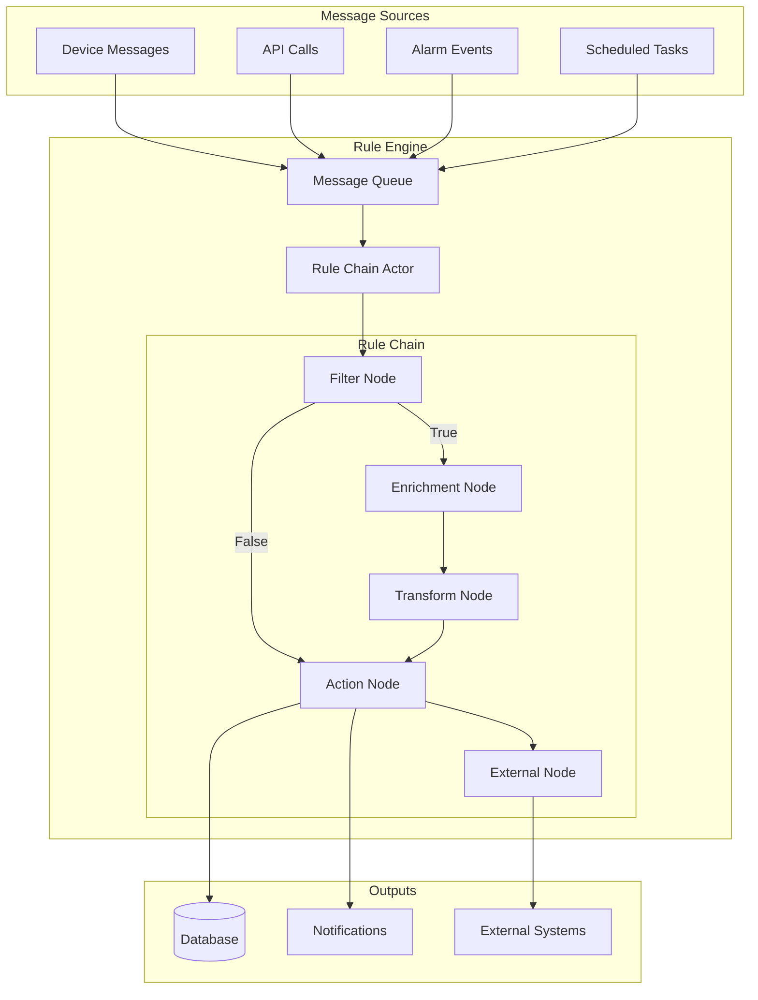

## Core Concepts

### Rule Chain

A rule chain is a container for rule nodes and their connections. It defines a message processing pipeline.

| Property | Type | Description |
|----------|------|-------------|
| id | RuleChainId | Unique identifier |
| tenantId | TenantId | Owning tenant |
| name | String | User-defined name |
| type | RuleChainType | CORE or EDGE |
| firstRuleNodeId | RuleNodeId | Entry point node |
| root | Boolean | Default chain for tenant |
| debugMode | Boolean | Enable debug logging |

### Rule Node

A rule node is a single processing step within a rule chain.

| Property | Type | Description |
|----------|------|-------------|
| id | RuleNodeId | Unique identifier |
| ruleChainId | RuleChainId | Parent chain |
| type | String | Fully qualified class name |
| name | String | User-defined name |
| configuration | JsonNode | Node-specific settings |
| debugMode | Boolean | Debug this node |

### TbMsg (Message)

TbMsg is the immutable message that flows through rule chains.

| Field | Type | Description |
|-------|------|-------------|
| id | UUID | Unique message ID |
| ts | long | Timestamp (milliseconds) |
| type | String | Message type (e.g., "Post telemetry") |
| originator | EntityId | Source entity (device, asset, etc.) |
| customerId | CustomerId | Associated customer |
| metaData | TbMsgMetaData | Key-value metadata |
| data | String | JSON payload |
| ruleChainId | RuleChainId | Current processing chain |
| ruleNodeId | RuleNodeId | Current processing node |

### Node Connections

Nodes connect via typed relations that determine message routing:

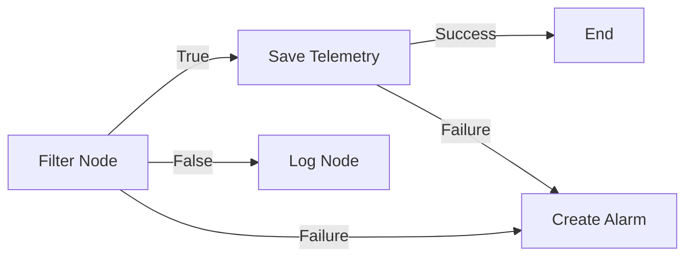

## Message Types

Messages entering the rule engine have specific types:

### Device Messages

| Type | Trigger | Data Content |
|------|---------|--------------|
| POST_TELEMETRY_REQUEST | Device sends telemetry | Telemetry key-values |
| POST_ATTRIBUTES_REQUEST | Device sends attributes | Attribute key-values |
| TO_SERVER_RPC_REQUEST | Device initiates RPC | Method and params |
| ACTIVITY_EVENT | Device becomes active | Activity metadata |
| INACTIVITY_EVENT | Device becomes inactive | Inactivity metadata |
| CONNECT_EVENT | Device connects | Connection info |
| DISCONNECT_EVENT | Device disconnects | Disconnection info |

### Entity Lifecycle Messages

| Type | Trigger | Data Content |
|------|---------|--------------|
| ENTITY_CREATED | Entity created | Entity data |
| ENTITY_UPDATED | Entity modified | Updated entity |
| ENTITY_DELETED | Entity removed | Deleted entity ID |
| ENTITY_ASSIGNED | Entity assigned to customer | Assignment info |
| ENTITY_UNASSIGNED | Entity unassigned | Unassignment info |

### Attribute Messages

| Type | Trigger | Data Content |
|------|---------|--------------|
| ATTRIBUTES_UPDATED | Attributes changed | Updated attributes |
| ATTRIBUTES_DELETED | Attributes removed | Deleted keys |

### Alarm Messages

| Type | Trigger | Data Content |
|------|---------|--------------|
| ALARM_CREATED | New alarm | Alarm data |
| ALARM_UPDATED | Alarm modified | Updated alarm |
| ALARM_SEVERITY_UPDATED | Severity changed | New severity |
| ALARM_ACK | Alarm acknowledged | Ack info |
| ALARM_CLEAR | Alarm cleared | Clear info |

### RPC Messages

| Type | Trigger | Data Content |
|------|---------|--------------|
| RPC_CALL_FROM_SERVER_TO_DEVICE | Server sends RPC | RPC request |
| RPC_QUEUED | RPC queued | Queue info |
| RPC_DELIVERED | RPC delivered | Delivery confirmation |
| RPC_SUCCESSFUL | RPC completed | Response data |
| RPC_TIMEOUT | RPC timed out | Timeout info |
| RPC_FAILED | RPC failed | Error details |

## Node Categories

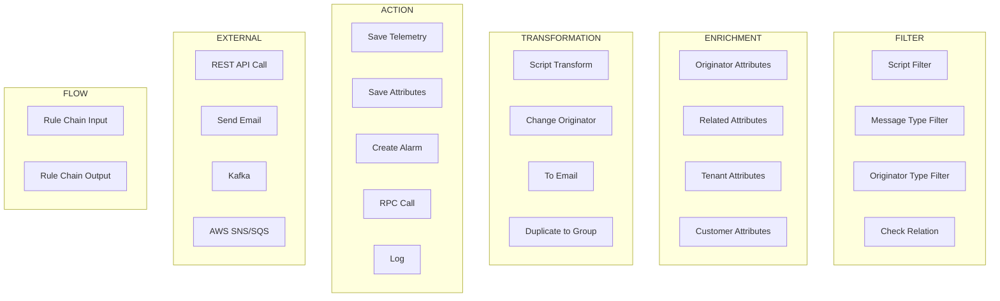

### Category Summary

| Category | Purpose | Example Nodes |
|----------|---------|---------------|
| FILTER | Route based on conditions | Script Filter, Message Type Switch |
| ENRICHMENT | Add data to messages | Originator Attributes, Customer Attributes |
| TRANSFORMATION | Modify message content | Script Transform, Change Originator |
| ACTION | Perform operations | Save Telemetry, Create Alarm, RPC Call |
| EXTERNAL | Integrate external systems | REST API, Kafka, AWS, Email |
| FLOW | Control rule chain flow | Rule Chain Input, Rule Chain Output |

## Message Flow

### Basic Flow

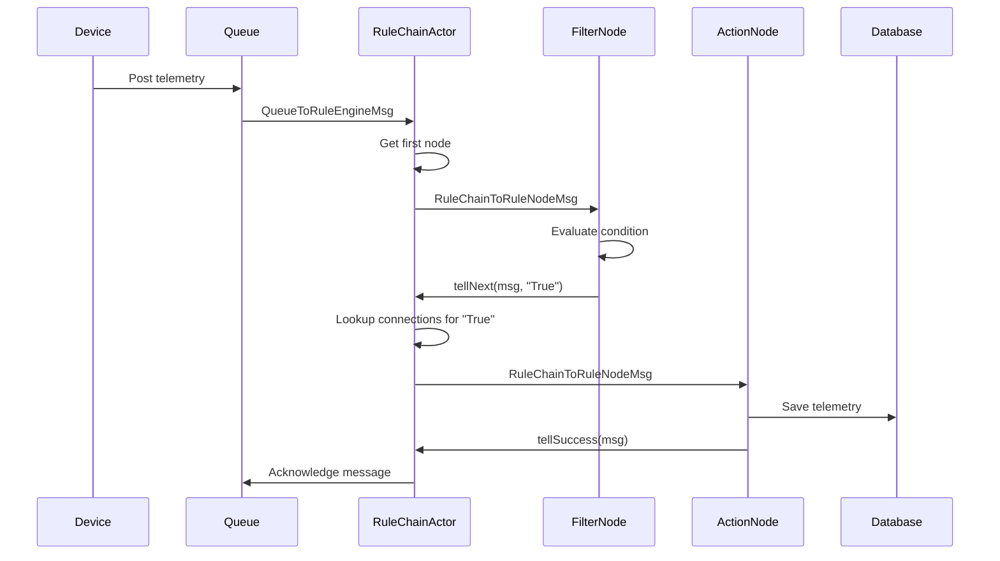

### Nested Rule Chain Flow

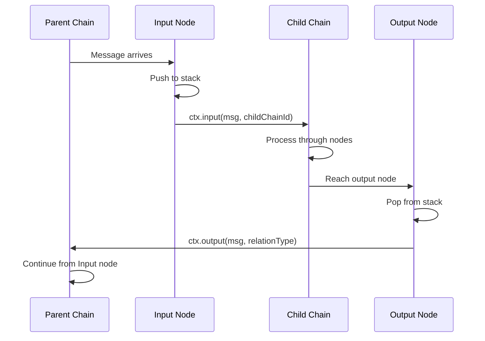

## Actor Model

### Actor Hierarchy

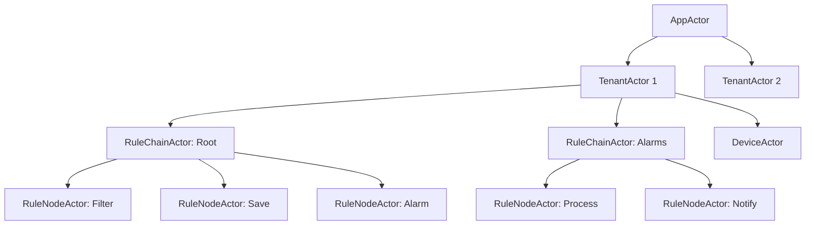

### Rule Chain Actor

The RuleChainActor manages a single rule chain:

**Responsibilities:**
- Create and manage child RuleNodeActors
- Route messages between nodes based on relation types
- Handle nested rule chain invocations
- Process lifecycle events (create, update, delete)

**Message Types Handled:**
- QUEUE_TO_RULE_ENGINE_MSG - External messages entering the chain
- RULE_TO_RULE_CHAIN_TELL_NEXT_MSG - Node completed, route to next
- RULE_CHAIN_INPUT_MSG - Message from nested chain
- RULE_CHAIN_OUTPUT_MSG - Return to parent chain
- COMPONENT_LIFE_CYCLE_MSG - Chain updated/deleted

### Rule Node Actor

The RuleNodeActor wraps a single TbNode implementation:

**Responsibilities:**
- Instantiate TbNode via reflection
- Initialize node with configuration
- Route messages to node's `onMsg()` method
- Track execution count to prevent infinite loops
- Handle node errors gracefully

## Node Lifecycle

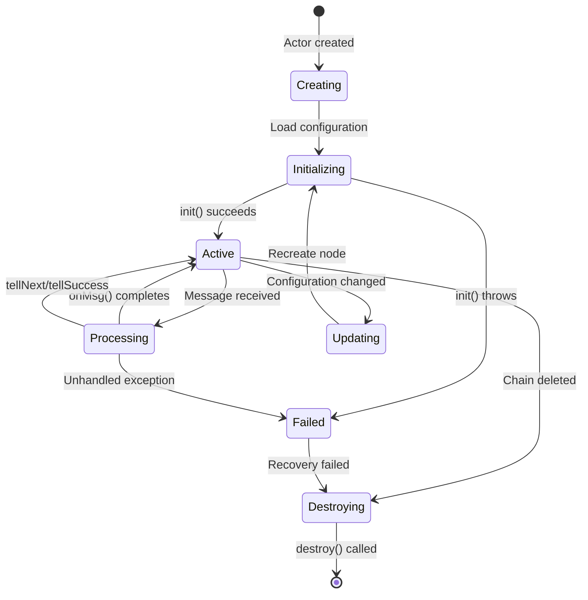

### TbNode Interface

```
interface TbNode {
    // Called once when node is created
    init(ctx: TbContext, config: TbNodeConfiguration): void

    // Called for each message
    onMsg(ctx: TbContext, msg: TbMsg): void

    // Called when node is removed
    destroy(): void

    // Called on cluster partition changes
    onPartitionChangeMsg(ctx: TbContext, msg: PartitionChangeMsg): void

    // Called during node version upgrades
    upgrade(fromVersion: int, oldConfig: JsonNode): Pair<Boolean, JsonNode>
}
```

## TbContext

The TbContext provides services and routing methods to rule nodes:

### Message Routing

| Method | Description |
|--------|-------------|
| `tellSuccess(msg)` | Route to SUCCESS connections |
| `tellNext(msg, relationType)` | Route to specific relation type |
| `tellNext(msg, relationTypes)` | Route to multiple relation types |
| `tellFailure(msg, exception)` | Route to FAILURE connections |
| `tellSelf(msg, delayMs)` | Schedule self-message |
| `ack(msg)` | Acknowledge without routing |

### Nested Chains

| Method | Description |
|--------|-------------|
| `input(msg, ruleChainId)` | Enter nested rule chain |
| `output(msg, relationType)` | Return to parent chain |

### Message Creation

| Method | Description |
|--------|-------------|
| `newMsg(...)` | Create new message |
| `transformMsg(...)` | Transform with new data |
| `transformMsgOriginator(...)` | Change originator |

### Service Access

TbContext provides access to 60+ platform services:
- Device, Asset, Customer services
- Telemetry and Attribute services
- Alarm service
- Notification services
- Relation service
- Cache services

## Connection Types

### Standard Connections

| Type | Usage |
|------|-------|
| Success | Default successful completion |
| Failure | Error or exception occurred |
| True | Filter condition passed |
| False | Filter condition failed |

### Node-Specific Connections

| Node | Custom Relations |
|------|------------------|
| Message Type Switch | One per message type |
| Originator Type Switch | One per entity type |
| Create Alarm | Created, Updated, Cleared |
| Device Profile | Alarm, RPC Response, etc. |

## @RuleNode Annotation

Rule nodes are declared using the `@RuleNode` annotation:

```
@RuleNode(
    type = ComponentType.FILTER,
    name = "script",
    nodeDescription = "Filter messages using JavaScript",
    nodeDetails = "Evaluates JS returning true/false",
    configClazz = TbJsFilterNodeConfiguration.class,
    relationTypes = {"True", "False"},
    clusteringMode = ComponentClusteringMode.ENABLED
)
```

| Attribute | Description |
|-----------|-------------|
| type | Category (FILTER, ACTION, etc.) |
| name | Display name |
| nodeDescription | Short description |
| nodeDetails | Detailed documentation |
| configClazz | Configuration class |
| relationTypes | Output connection types |
| clusteringMode | Singleton or per-partition |
| inEnabled | Can receive messages |
| outEnabled | Can send messages |
| ruleChainNode | Is a flow control node |

## Debug Mode

Debug mode captures message snapshots for troubleshooting:

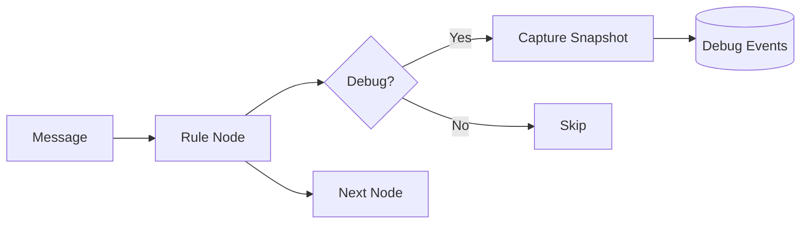

**Captured Information:**
- Input message (type, data, metadata)
- Output message (if modified)
- Relation type used
- Processing time
- Error details (if failed)

## Configuration Example

### Simple Telemetry Processing Chain

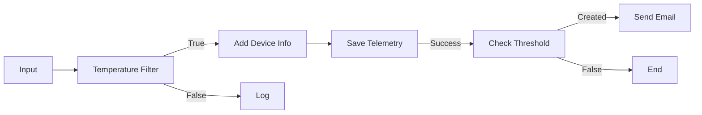

**Filter Node Configuration:**
```json
{
  "scriptLang": "TBEL",
  "script": "return msg.temperature > 0;"
}
```

**Alarm Node Configuration:**
```json
{
  "alarmType": "High Temperature",
  "severity": "WARNING",
  "condition": {
    "condition": [{
      "key": {"type": "TIME_SERIES", "key": "temperature"},
      "predicate": {"type": "NUMERIC", "operation": "GREATER", "value": 30}
    }]
  }
}
```

## Root Rule Chain

Each tenant has a root rule chain that processes all incoming device messages:

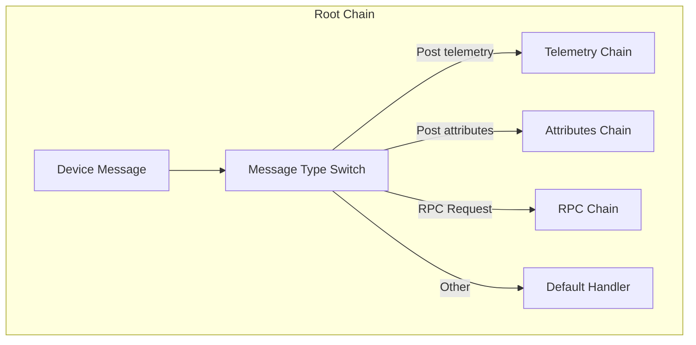

**Root chain receives:**
- All device telemetry
- All device attributes
- Device connectivity events
- RPC requests

## Queue Processing Strategies

Rule engine queues support different submit and processing strategies for handling message flow.

### Submit Strategies

| Strategy | Behavior | Use Case |
|----------|----------|----------|
| BURST | Submit all messages immediately | High throughput, best effort |
| BATCH | Group messages into batches | Balanced throughput/latency |
| SEQUENTIAL_BY_ORIGINATOR | Order by entity | Per-device ordering required |
| SEQUENTIAL_BY_TENANT | Order by tenant | Tenant-level ordering |
| SEQUENTIAL | Strict global order | Strict ordering (low throughput) |

### Processing Strategies

| Strategy | On Failure | Use Case |
|----------|------------|----------|
| SKIP_ALL_FAILURES | Log and continue | Non-critical data |
| SKIP_ALL_FAILURES_AND_TIMED_OUT | Skip failed and timed out | Best effort processing |
| RETRY_ALL | Retry all messages | Critical data requiring reprocessing |
| RETRY_FAILED | Retry only failures | Mixed criticality |
| RETRY_TIMED_OUT | Retry only timeouts | Network-sensitive |
| RETRY_FAILED_AND_TIMED_OUT | Retry both | Reliable delivery |

### Retry Mechanism

When retry is enabled, the strategy applies exponential backoff:

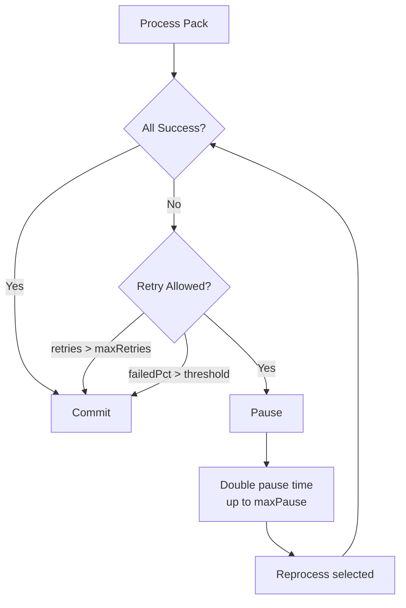

**Retry Parameters:**

| Parameter | Description | Default |
|-----------|-------------|---------|
| `retries` | Maximum retry attempts | 3 |
| `failurePercentage` | Abort if failures exceed this % | 0 (disabled) |
| `pauseBetweenRetries` | Initial pause (seconds) | 3 |
| `maxPauseBetweenRetries` | Maximum pause after backoff | 3 |

The `failurePercentage` threshold prevents infinite retries when a large portion of messages fail (e.g., database down).

### Queue Configuration Example

```yaml
queue:
  rule-engine:
    queues:
      - name: Main
        topic: tb_rule_engine.main
        partitions: 10
        consumer-per-partition: true
        submit-strategy:
          type: BURST
          batch-size: 1000
        processing-strategy:
          type: SKIP_ALL_FAILURES
          retries: 3
          failure-percentage: 0
          pause-between-retries: 3
          max-pause-between-retries: 3

      - name: HighPriority
        topic: tb_rule_engine.hp
        partitions: 4
        submit-strategy:
          type: SEQUENTIAL_BY_ORIGINATOR
        processing-strategy:
          type: RETRY_FAILED_AND_TIMED_OUT
          retries: 5
```

### Strategy Selection Guide

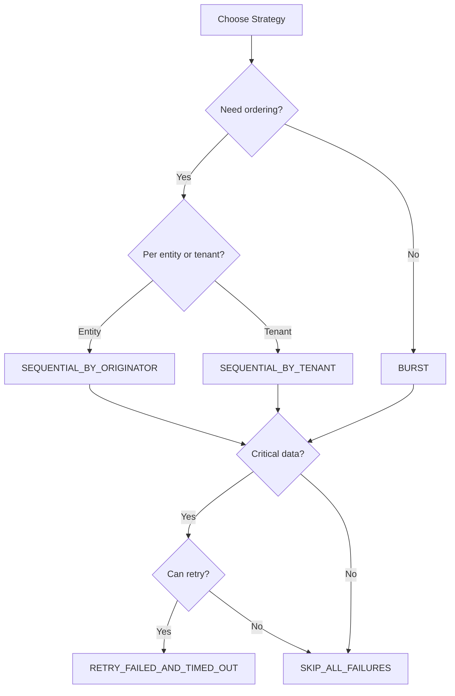

## Performance Considerations

### Message Processing Limits

| Limit | Purpose | Configurable |
|-------|---------|--------------|
| Max rule node executions per message | Prevent infinite loops | Yes |
| Message queue timeout | Prevent stuck messages | Yes |
| Debug event retention | Limit storage | Yes |

### Best Practices

1. **Keep chains simple** - Break complex logic into nested chains
2. **Use filters early** - Discard irrelevant messages quickly
3. **Batch external calls** - Use batch nodes for external systems
4. **Monitor debug carefully** - Debug mode impacts performance
5. **Test with representative load** - Validate before production

## See Also

- [Rule Chain Structure](./rule-chain-structure.md) - Detailed chain composition
- [Message Flow (TbMsg)](./message-flow.md) - Message routing details
- [Node Categories](./node-categories.md) - All built-in nodes
- [Node Development Contract](./node-development-contract.md) - Custom node development
- [Actor System](../03-actor-system/README.md) - Underlying actor model
