# Message Flow (TbMsg)

## Overview

TbMsg is the immutable message object that flows through rule chains. It encapsulates the payload, metadata, originator, and routing information needed for rule engine processing. Messages are created from device telemetry, API calls, or system events, then routed through nodes based on connection types. The message design supports transformation, nesting into child chains, and serialization for queue transport.

## Key Behaviors

1. **Immutability**: TbMsg is final and immutable. All modifications create new message instances via builder pattern.

2. **Builder/Transformer Pattern**: `copy()` creates exact copies, `transform()` creates modified copies with automatic context handling.

3. **Stack-Based Nesting**: Messages track their rule chain call stack for proper return routing from nested chains.

4. **Execution Counter**: Each message tracks how many nodes have processed it to prevent infinite loops.

5. **Callback Integration**: Messages carry callbacks for acknowledgment and failure reporting to the queue.

6. **Protocol Buffer Serialization**: Messages serialize to protobuf for efficient queue transport.

## TbMsg Structure

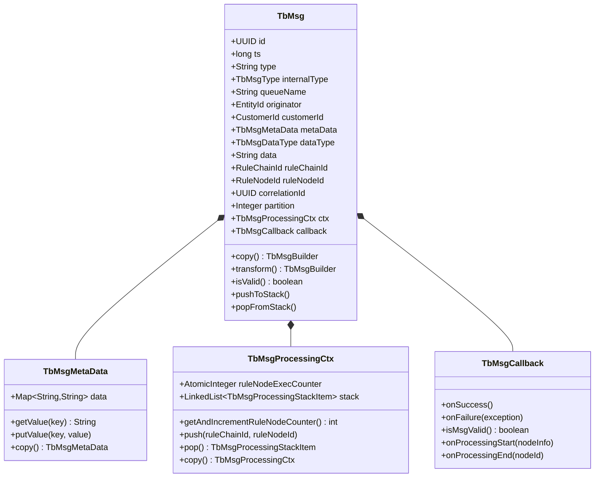
```mermaid
classDiagram
    class TbMsg {
        +UUID id
        +long ts
        +String type
        +TbMsgType internalType
        +String queueName
        +EntityId originator
        +CustomerId customerId
        +TbMsgMetaData metaData
        +TbMsgDataType dataType
        +String data
        +RuleChainId ruleChainId
        +RuleNodeId ruleNodeId
        +UUID correlationId
        +Integer partition
        +TbMsgProcessingCtx ctx
        +TbMsgCallback callback
        +copy() TbMsgBuilder
        +transform() TbMsgBuilder
        +isValid() boolean
        +pushToStack()
        +popFromStack()
    }

    class TbMsgMetaData {
        +Map~String,String~ data
        +getValue(key) String
        +putValue(key, value)
        +copy() TbMsgMetaData
    }

    class TbMsgProcessingCtx {
        +AtomicInteger ruleNodeExecCounter
        +LinkedList~TbMsgProcessingStackItem~ stack
        +getAndIncrementRuleNodeCounter() int
        +push(ruleChainId, ruleNodeId)
        +pop() TbMsgProcessingStackItem
        +copy() TbMsgProcessingCtx
    }

    class TbMsgCallback {
        +onSuccess()
        +onFailure(exception)
        +isMsgValid() boolean
        +onProcessingStart(nodeInfo)
        +onProcessingEnd(nodeId)
    }

    TbMsg *-- TbMsgMetaData
    TbMsg *-- TbMsgProcessingCtx
    TbMsg *-- TbMsgCallback
```

### Core Fields

| Field | Type | Description |
|-------|------|-------------|
| id | UUID | Unique message identifier (auto-generated if not set) |
| ts | long | Timestamp in milliseconds (defaults to current time) |
| type | String | Message type name (e.g., "POST_TELEMETRY_REQUEST") |
| internalType | TbMsgType | Enumerated message type for efficient comparison |
| queueName | String | Target processing queue name |
| originator | EntityId | Source entity (Device, Asset, Customer, etc.) |
| customerId | CustomerId | Associated customer (derived from originator if not set) |
| metaData | TbMsgMetaData | Key-value metadata (device name, type, etc.) |
| dataType | TbMsgDataType | Payload format (JSON, TEXT, BINARY) |
| data | String | Message payload (usually JSON) |

### Routing Fields

| Field | Type | Description |
|-------|------|-------------|
| ruleChainId | RuleChainId | Current rule chain being processed |
| ruleNodeId | RuleNodeId | Current rule node being processed |
| correlationId | UUID | For request-response correlation |
| partition | Integer | Queue partition assignment |

### Internal Fields (Not Serialized)

| Field | Type | Description |
|-------|------|-------------|
| ctx | TbMsgProcessingCtx | Execution counter and call stack |
| callback | TbMsgCallback | Queue acknowledgment callback |

## Data Types

### TbMsgDataType

| Type | Ordinal | Description |
|------|---------|-------------|
| JSON | 0 | JSON object or array (default) |
| TEXT | 1 | Plain text string |
| BINARY | 2 | Base64-encoded binary data |

### Default Data Values

| Constant | Value | Usage |
|----------|-------|-------|
| EMPTY_JSON_OBJECT | `"{}"` | Empty JSON object |
| EMPTY_JSON_ARRAY | `"[]"` | Empty JSON array |
| EMPTY_STRING | `""` | Empty string |

## Metadata Structure

### TbMsgMetaData

Thread-safe key-value store for message context:

```
TbMsgMetaData {
    data: ConcurrentHashMap<String, String>

    getValue(key): String
    putValue(key, value): void
    values(): Map<String, String>
    copy(): TbMsgMetaData
    isEmpty(): boolean
}
```

### Standard Metadata Keys

| Key | Source | Description |
|-----|--------|-------------|
| deviceName | Transport | Name of the source device |
| deviceType | Transport | Device type from profile |
| ts | Transport | Original timestamp (if different from msg.ts) |
| ss_* | Shared attribute | Server-side shared attributes |
| cs_* | Client attribute | Client-side attributes |

### Example Metadata

```json
{
  "deviceName": "Temperature Sensor 01",
  "deviceType": "temperature-sensor",
  "ts": "1634567890123"
}
```

## Message Creation

### Builder Pattern

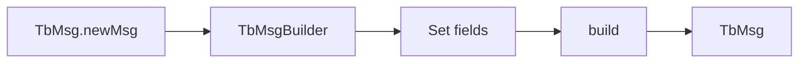
```mermaid
graph LR
    NEW[TbMsg.newMsg] --> BUILDER[TbMsgBuilder]
    BUILDER --> SET[Set fields]
    SET --> BUILD[build]
    BUILD --> MSG[TbMsg]
```

### Creating a New Message

```
TbMsg msg = TbMsg.newMsg()
    .type(TbMsgType.POST_TELEMETRY_REQUEST)
    .originator(deviceId)
    .metaData(metaData)
    .data(jsonPayload)
    .build();
```

### Copy vs Transform

| Method | Behavior | Use Case |
|--------|----------|----------|
| `copy()` | Exact copy, shares context | Creating parallel messages |
| `transform()` | Copy with new context, clears ruleNodeId on chain change | Modifying for next processing stage |
| `copyWithNewCtx()` | Copy with fresh callback | External node async processing |

### Transform Behavior

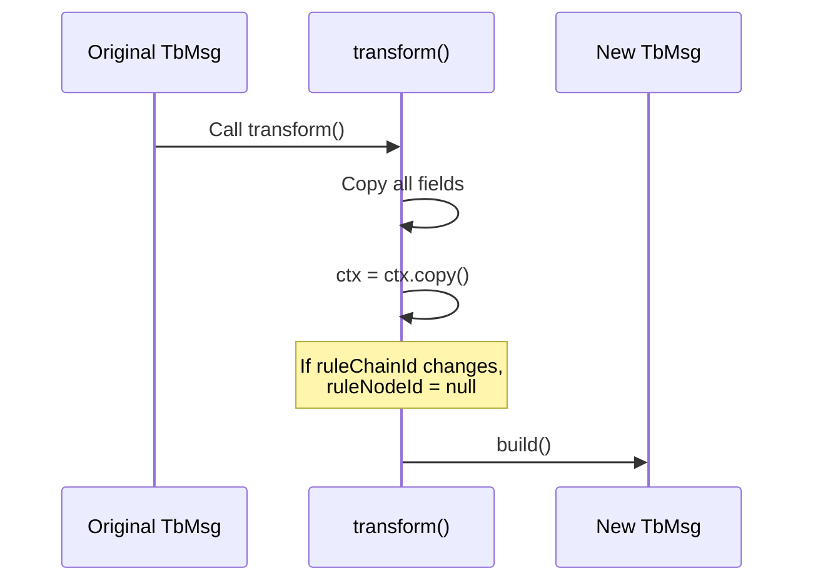
```mermaid
sequenceDiagram
    participant ORIG as Original TbMsg
    participant TRANS as transform()
    participant NEW as New TbMsg

    ORIG->>TRANS: Call transform()
    TRANS->>TRANS: Copy all fields
    TRANS->>TRANS: ctx = ctx.copy()
    Note over TRANS: If ruleChainId changes,<br/>ruleNodeId = null
    TRANS->>NEW: build()
```

## Message Routing

### Routing Methods

| Method | Relation Type | Description |
|--------|---------------|-------------|
| `tellSuccess(msg)` | Success | Route to Success connections |
| `tellNext(msg, type)` | Specified | Route to single relation type |
| `tellNext(msg, types)` | Multiple | Route to multiple relation types |
| `tellFailure(msg, ex)` | Failure | Route to Failure connections |
| `ack(msg)` | ACK | Acknowledge without routing |

### Routing Flow

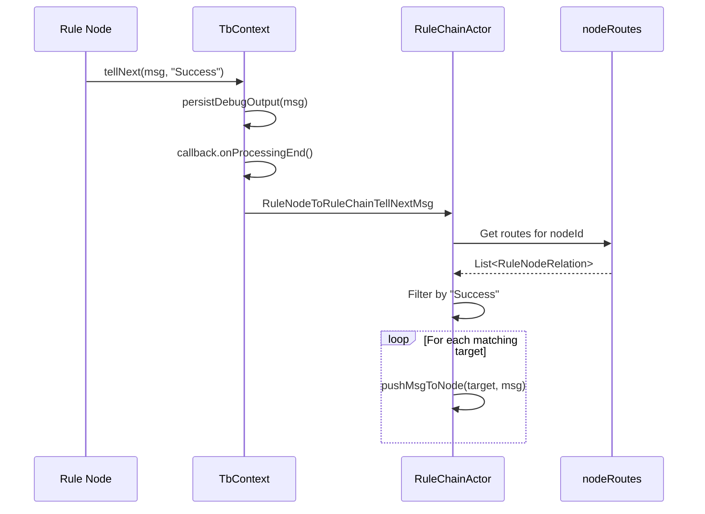
```mermaid
sequenceDiagram
    participant NODE as Rule Node
    participant CTX as TbContext
    participant CHAIN as RuleChainActor
    participant ROUTES as nodeRoutes

    NODE->>CTX: tellNext(msg, "Success")
    CTX->>CTX: persistDebugOutput(msg)
    CTX->>CTX: callback.onProcessingEnd()
    CTX->>CHAIN: RuleNodeToRuleChainTellNextMsg

    CHAIN->>ROUTES: Get routes for nodeId
    ROUTES-->>CHAIN: List<RuleNodeRelation>

    CHAIN->>CHAIN: Filter by "Success"

    loop For each matching target
        CHAIN->>CHAIN: pushMsgToNode(target, msg)
    end
```

### tellSuccess Implementation

```
tellSuccess(msg):
    tellNext(msg, {"Success"})
```

### tellNext Implementation

```
tellNext(msg, relationTypes):
    persistDebugOutput(msg, relationTypes)
    msg.callback.onProcessingEnd(ruleNode.id)
    chainActor.tell(RuleNodeToRuleChainTellNextMsg(
        ruleChainId, ruleNodeId, relationTypes, msg))
```

### tellFailure Implementation

```
tellFailure(msg, throwable):
    persistDebugOutput(msg, {"Failure"}, throwable)
    failureMessage = extractMessage(throwable)
    chainActor.tell(RuleNodeToRuleChainTellNextMsg(
        ruleChainId, ruleNodeId, {"Failure"}, msg, failureMessage))
```

## Nested Rule Chains

### Stack-Based Tracking

Messages maintain a call stack for nested chain invocations:

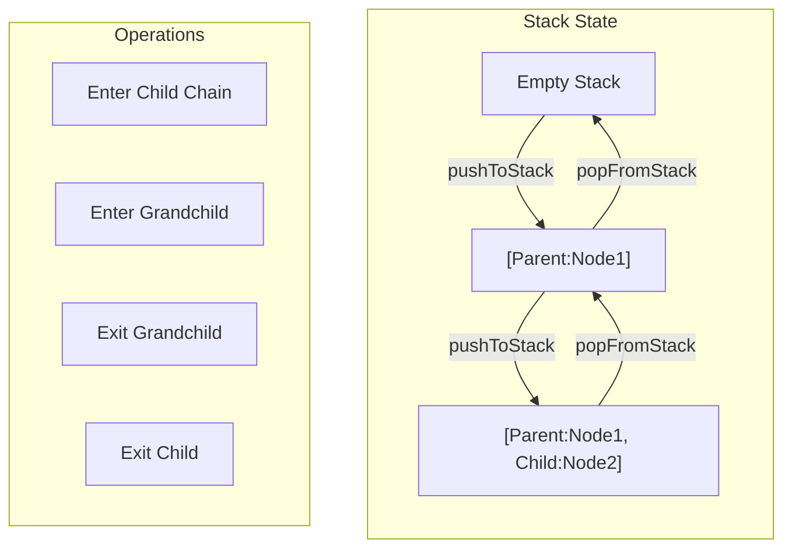
```mermaid
graph TB
    subgraph "Stack State"
        direction TB
        S1[Empty Stack]
        S2["[Parent:Node1]"]
        S3["[Parent:Node1, Child:Node2]"]
    end

    subgraph "Operations"
        PUSH1[Enter Child Chain]
        PUSH2[Enter Grandchild]
        POP1[Exit Grandchild]
        POP2[Exit Child]
    end

    S1 -->|pushToStack| S2
    S2 -->|pushToStack| S3
    S3 -->|popFromStack| S2
    S2 -->|popFromStack| S1
```

### TbMsgProcessingStackItem

```
TbMsgProcessingStackItem {
    ruleChainId: RuleChainId  // Chain to return to
    ruleNodeId: RuleNodeId    // Node to continue from
}
```

### Input (Enter Nested Chain)

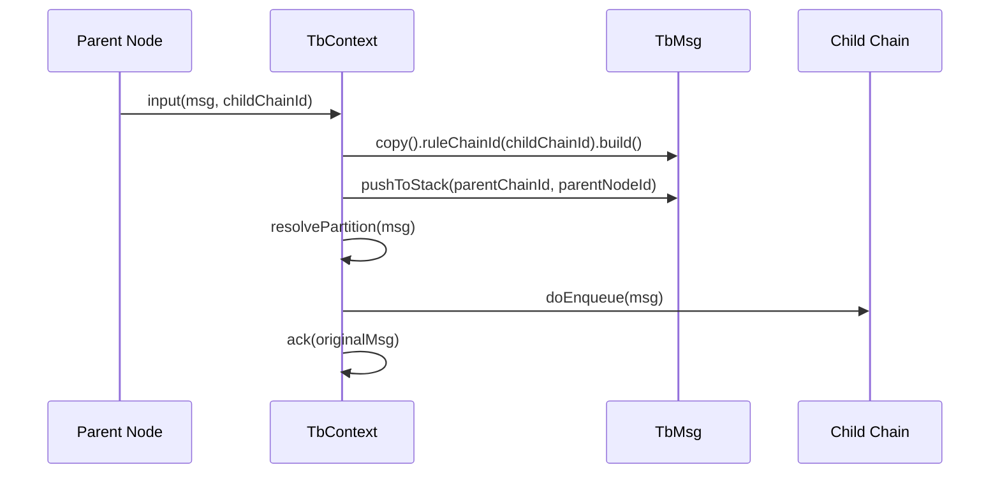
```mermaid
sequenceDiagram
    participant NODE as Parent Node
    participant CTX as TbContext
    participant MSG as TbMsg
    participant CHILD as Child Chain

    NODE->>CTX: input(msg, childChainId)
    CTX->>MSG: copy().ruleChainId(childChainId).build()
    CTX->>MSG: pushToStack(parentChainId, parentNodeId)
    CTX->>CTX: resolvePartition(msg)
    CTX->>CHILD: doEnqueue(msg)
    CTX->>CTX: ack(originalMsg)
```

### Output (Return to Parent Chain)

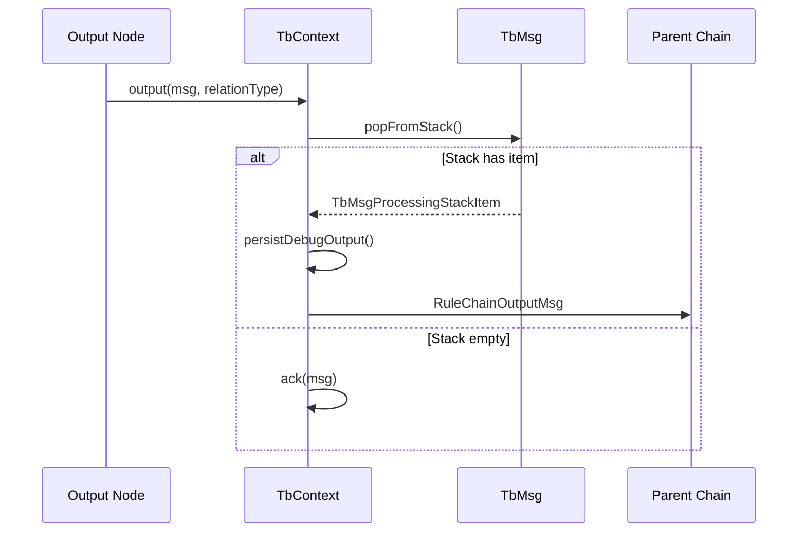
```mermaid
sequenceDiagram
    participant OUTPUT as Output Node
    participant CTX as TbContext
    participant MSG as TbMsg
    participant PARENT as Parent Chain

    OUTPUT->>CTX: output(msg, relationType)
    CTX->>MSG: popFromStack()

    alt Stack has item
        MSG-->>CTX: TbMsgProcessingStackItem
        CTX->>CTX: persistDebugOutput()
        CTX->>PARENT: RuleChainOutputMsg
    else Stack empty
        CTX->>CTX: ack(msg)
    end
```

## Processing Context

### TbMsgProcessingCtx

Tracks execution state during message processing:

| Field | Type | Purpose |
|-------|------|---------|
| ruleNodeExecCounter | AtomicInteger | Count of node executions |
| stack | LinkedList | Nested chain call stack |

### Execution Counter

Prevents infinite loops by tracking node executions. The counter is configured per tenant profile:

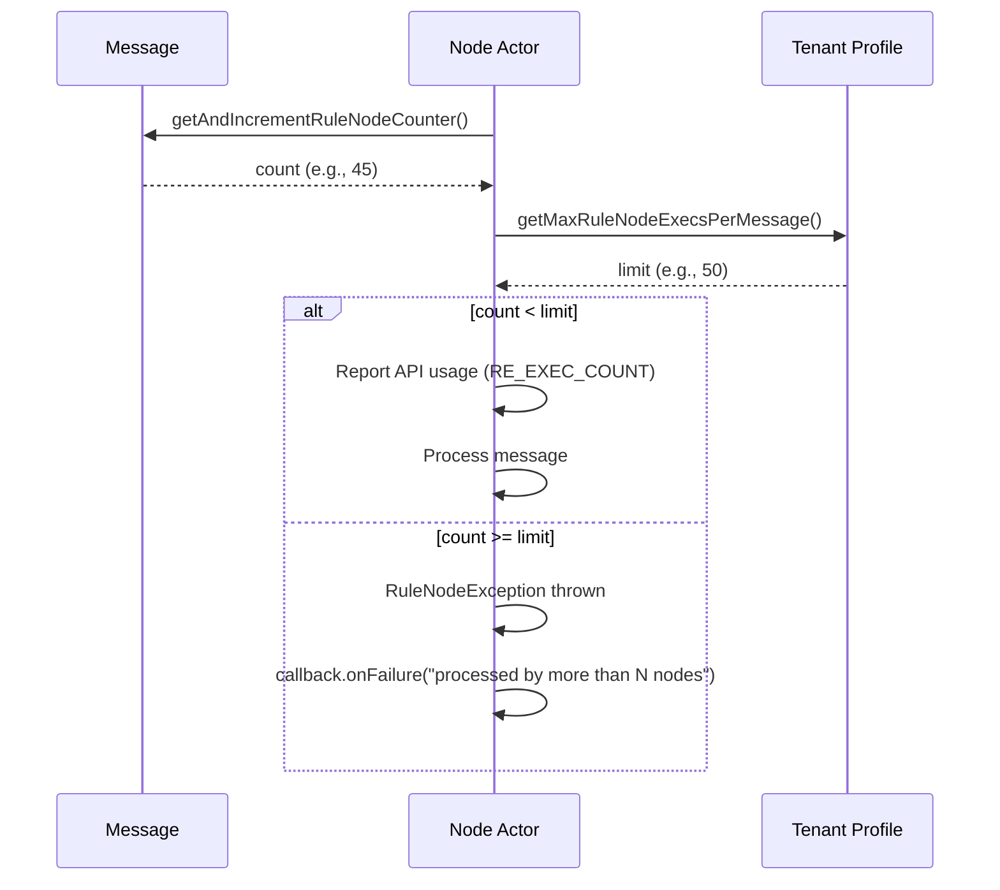
```mermaid
sequenceDiagram
    participant MSG as Message
    participant NODE as Node Actor
    participant PROFILE as Tenant Profile

    NODE->>MSG: getAndIncrementRuleNodeCounter()
    MSG-->>NODE: count (e.g., 45)

    NODE->>PROFILE: getMaxRuleNodeExecsPerMessage()
    PROFILE-->>NODE: limit (e.g., 50)

    alt count < limit
        NODE->>NODE: Report API usage (RE_EXEC_COUNT)
        NODE->>NODE: Process message
    else count >= limit
        NODE->>NODE: RuleNodeException thrown
        NODE->>NODE: callback.onFailure("processed by more than N nodes")
    end
```

The execution counter is tracked per message across all nodes (not per chain). This prevents:
- Infinite routing loops (A → B → A)
- Excessive processing from complex chain designs
- Resource exhaustion from runaway messages

### Context Copy Behavior

| Operation | Counter | Stack |
|-----------|---------|-------|
| `ctx.copy()` | Preserves current value | Deep copy |
| New message | Starts at 0 | Empty |

## Actor Message Flow

### RuleChainActor Message Types

The RuleChainActor handles 7 message types:

| Message Type | Source | Purpose |
|--------------|--------|---------|
| COMPONENT_LIFE_CYCLE_MSG | Service | Start/update/delete lifecycle events |
| QUEUE_TO_RULE_ENGINE_MSG | Queue | Primary message entry point |
| RULE_TO_RULE_CHAIN_TELL_NEXT_MSG | RuleNodeActor | Route to next node(s) |
| RULE_CHAIN_TO_RULE_CHAIN_MSG | RuleChainActor | Chain-to-chain forwarding |
| RULE_CHAIN_INPUT_MSG | External | Explicit nested chain input |
| RULE_CHAIN_OUTPUT_MSG | Child chain | Return from nested chain |
| PARTITION_CHANGE_MSG | Cluster | Partition rebalancing |

### RuleNodeActor Message Types

The RuleNodeActor handles 4 message types:

| Message Type | Source | Purpose |
|--------------|--------|---------|
| COMPONENT_LIFE_CYCLE_MSG | Service | Component lifecycle management |
| RULE_CHAIN_TO_RULE_MSG | RuleChainActor | Message to process |
| RULE_TO_SELF_MSG | TbContext.tellSelf | Delayed self-messaging |
| PARTITION_CHANGE_MSG | Cluster | Partition changes |

### Partition-Aware Routing

Messages are routed based on partition ownership:

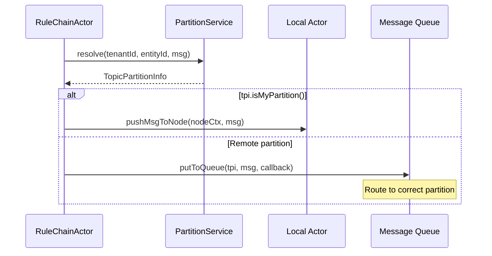
```mermaid
sequenceDiagram
    participant CHAIN as RuleChainActor
    participant PART as PartitionService
    participant LOCAL as Local Actor
    participant QUEUE as Message Queue

    CHAIN->>PART: resolve(tenantId, entityId, msg)
    PART-->>CHAIN: TopicPartitionInfo

    alt tpi.isMyPartition()
        CHAIN->>LOCAL: pushMsgToNode(nodeCtx, msg)
    else Remote partition
        CHAIN->>QUEUE: putToQueue(tpi, msg, callback)
        Note over QUEUE: Route to correct partition
    end
```

### Fan-Out Routing

When a node routes to multiple destinations, the callback wraps to track all completions:

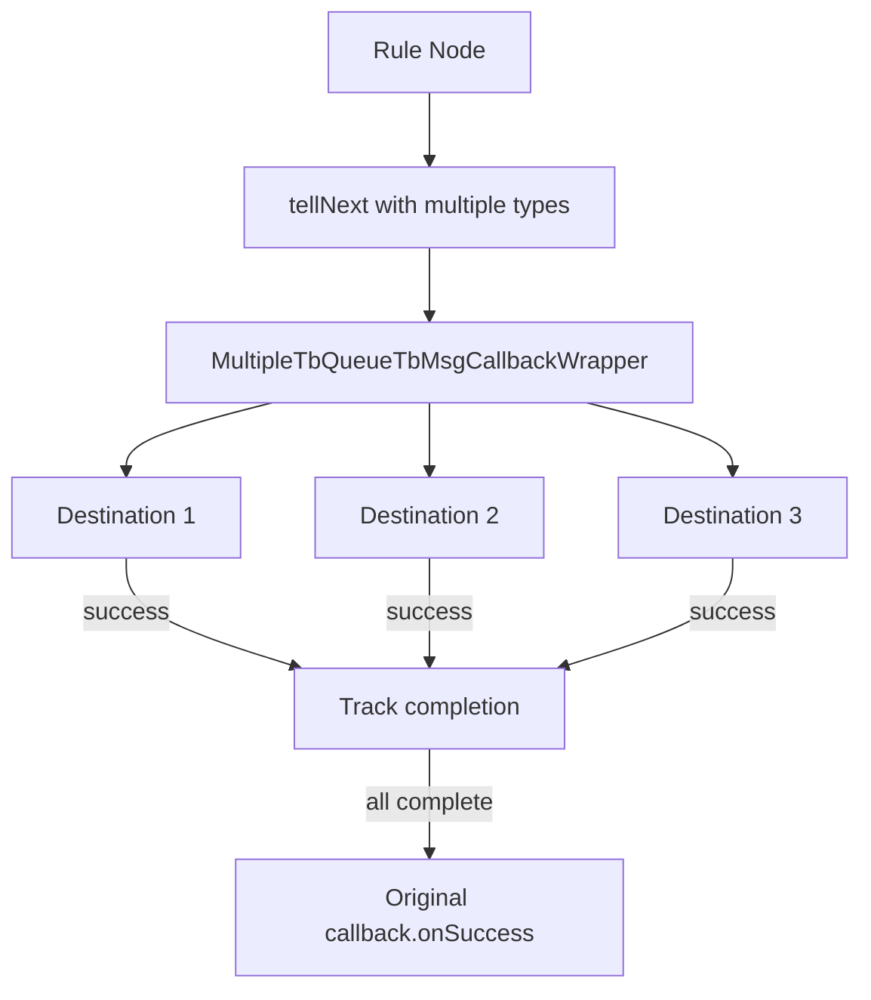
```mermaid
graph TB
    NODE[Rule Node] --> TELLNEXT[tellNext with multiple types]
    TELLNEXT --> WRAP[MultipleTbQueueTbMsgCallbackWrapper]

    WRAP --> DEST1[Destination 1]
    WRAP --> DEST2[Destination 2]
    WRAP --> DEST3[Destination 3]

    DEST1 --> |success| TRACK[Track completion]
    DEST2 --> |success| TRACK
    DEST3 --> |success| TRACK

    TRACK --> |all complete| ORIGINAL[Original callback.onSuccess]
```

The wrapper:
- Creates a copy of the message for each destination
- Tracks completions using CountDownLatch
- Calls original callback only when ALL destinations complete
- First failure triggers original callback.onFailure

### Relation Type Matching

Relation types are matched **case-insensitively**:

```
// "Success", "success", "SUCCESS" all match
private boolean contains(Set<String> relationTypes, String type) {
    for (String relationType : relationTypes) {
        if (relationType.equalsIgnoreCase(type)) return true;
    }
    return false;
}
```

## Callback Interface

### TbMsgCallback

```
interface TbMsgCallback {
    onSuccess()                      // Processing completed successfully
    onFailure(RuleEngineException)   // Processing failed
    onRateLimit(RuleEngineException) // Rate limited (defaults to onFailure)
    isMsgValid(): boolean            // Check if still valid
    onProcessingStart(RuleNodeInfo)  // Node started processing
    onProcessingEnd(RuleNodeId)      // Node finished processing
}
```

### Callback Flow

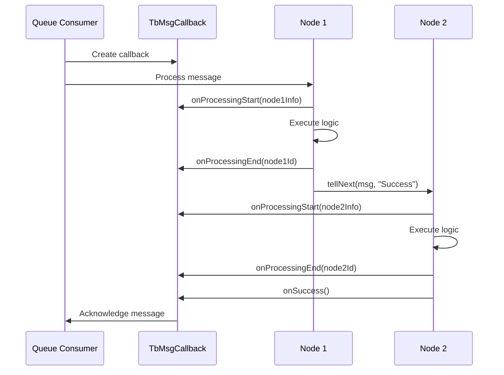
```mermaid
sequenceDiagram
    participant Q as Queue Consumer
    participant CB as TbMsgCallback
    participant NODE1 as Node 1
    participant NODE2 as Node 2

    Q->>CB: Create callback
    Q->>NODE1: Process message

    NODE1->>CB: onProcessingStart(node1Info)
    NODE1->>NODE1: Execute logic
    NODE1->>CB: onProcessingEnd(node1Id)
    NODE1->>NODE2: tellNext(msg, "Success")

    NODE2->>CB: onProcessingStart(node2Info)
    NODE2->>NODE2: Execute logic
    NODE2->>CB: onProcessingEnd(node2Id)
    NODE2->>CB: onSuccess()

    CB->>Q: Acknowledge message
```

### Message Validity

Messages can become invalid if:
- Message pack timeout expired
- Processing was canceled
- Parent message failed

```
if (!msg.isValid()) {
    return;  // Skip processing
}
```

## Queue Processing Context

### TbMsgPackProcessingContext

When messages are consumed from the queue, they're grouped into processing packs with tracked state:

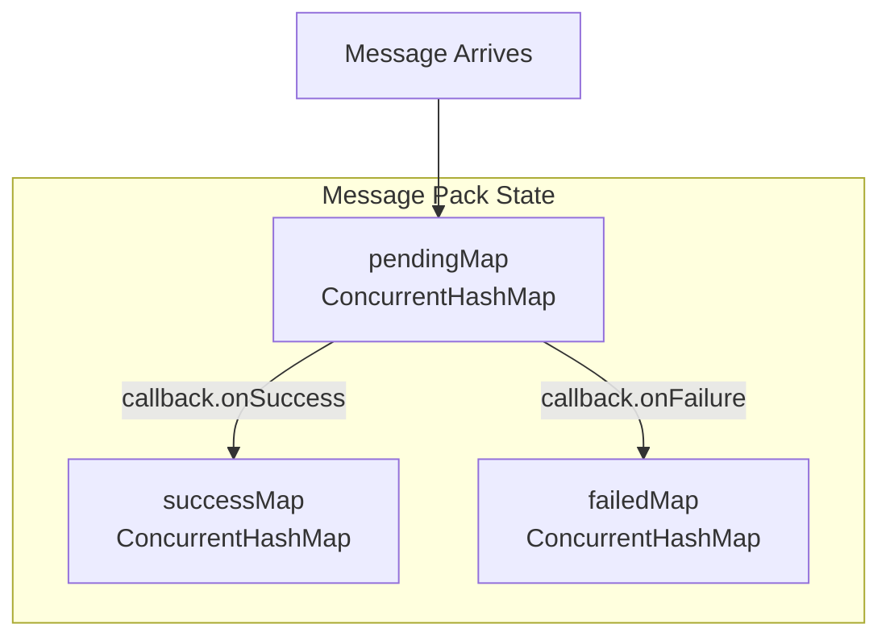
```mermaid
graph TB
    subgraph "Message Pack State"
        PENDING[pendingMap<br/>ConcurrentHashMap]
        SUCCESS[successMap<br/>ConcurrentHashMap]
        FAILED[failedMap<br/>ConcurrentHashMap]
    end

    MSG[Message Arrives] --> PENDING
    PENDING -->|callback.onSuccess| SUCCESS
    PENDING -->|callback.onFailure| FAILED
```

| State | When | Outcome |
|-------|------|---------|
| Pending | Message submitted, awaiting completion | Timeout if not completed |
| Success | callback.onSuccess() called | Ready for commit |
| Failed | callback.onFailure() called | May retry based on strategy |

### TbMsgPackCallback

Each message gets a callback that tracks state transitions:

```
TbMsgPackCallback {
    onSuccess():
        remove from pendingMap
        add to successMap
        latch.countDown()

    onFailure(exception):
        remove from pendingMap
        add to failedMap with exception
        latch.countDown()

    onRateLimit(exception):
        // Treat as success (rate limited messages don't block)
        onSuccess()
}
```

### Pack Processing Timeout

The `packProcessingTimeout` (configured per queue) determines how long to wait for all messages:

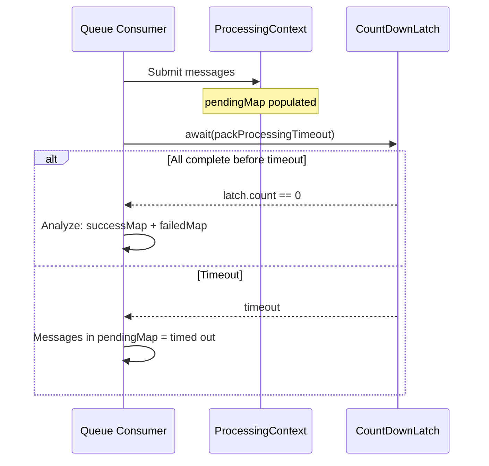
```mermaid
sequenceDiagram
    participant Q as Queue Consumer
    participant PACK as ProcessingContext
    participant LATCH as CountDownLatch

    Q->>PACK: Submit messages
    Note over PACK: pendingMap populated

    Q->>LATCH: await(packProcessingTimeout)

    alt All complete before timeout
        LATCH-->>Q: latch.count == 0
        Q->>Q: Analyze: successMap + failedMap
    else Timeout
        LATCH-->>Q: timeout
        Q->>Q: Messages in pendingMap = timed out
    end
```

### Debug Event Persistence

Debug events are captured at two points:

| Event | Location | Condition |
|-------|----------|-----------|
| Debug Input | Before node.onMsg() | DebugModeUtil.isDebugAllAvailable(ruleNode) |
| Debug Output | After tellNext/tellSuccess/tellFailure | isDebugAllAvailable OR isDebugFailuresAvailable |

Debug events capture:
- Input/output relation type
- Full message content
- Timestamp
- Error details (for failures)

## Serialization

### Protocol Buffer Format

Messages serialize to protobuf for queue transport:

```
TbMsgProto {
    id: string
    ts: int64
    type: string
    entityType: string
    entityIdMSB: int64
    entityIdLSB: int64
    customerIdMSB: int64
    customerIdLSB: int64
    ruleChainIdMSB: int64
    ruleChainIdLSB: int64
    ruleNodeIdMSB: int64
    ruleNodeIdLSB: int64
    metaData: TbMsgMetaDataProto
    dataType: int32
    data: string
    correlationIdMSB: int64
    correlationIdLSB: int64
    partition: int32
    ctx: TbMsgProcessingCtxProto
}
```

### Serialization Flow

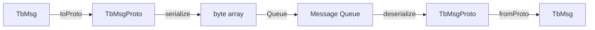
```mermaid
graph LR
    MSG[TbMsg] -->|toProto| PROTO[TbMsgProto]
    PROTO -->|serialize| BYTES[byte array]
    BYTES -->|Queue| TRANSPORT[Message Queue]
    TRANSPORT -->|deserialize| PROTO2[TbMsgProto]
    PROTO2 -->|fromProto| MSG2[TbMsg]
```

### Non-Serialized Fields

| Field | Reason |
|-------|--------|
| callback | Recreated on deserialization |
| ctx (partial) | Counter serialized, callback not |

## Message Lifecycle

### Complete Flow

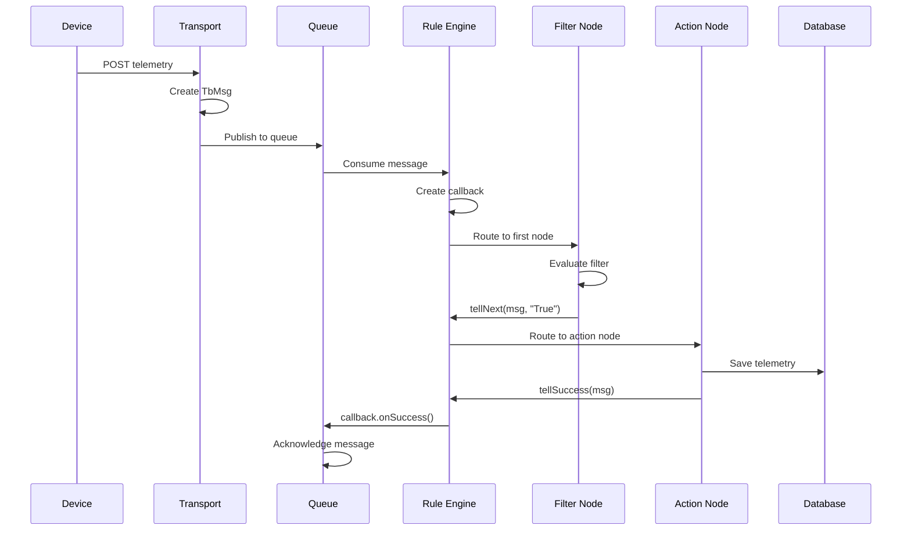
```mermaid
sequenceDiagram
    participant DEV as Device
    participant TRANS as Transport
    participant Q as Queue
    participant RE as Rule Engine
    participant N1 as Filter Node
    participant N2 as Action Node
    participant DB as Database

    DEV->>TRANS: POST telemetry
    TRANS->>TRANS: Create TbMsg
    TRANS->>Q: Publish to queue

    Q->>RE: Consume message
    RE->>RE: Create callback
    RE->>N1: Route to first node

    N1->>N1: Evaluate filter
    N1->>RE: tellNext(msg, "True")
    RE->>N2: Route to action node

    N2->>DB: Save telemetry
    N2->>RE: tellSuccess(msg)

    RE->>Q: callback.onSuccess()
    Q->>Q: Acknowledge message
```

### Message States

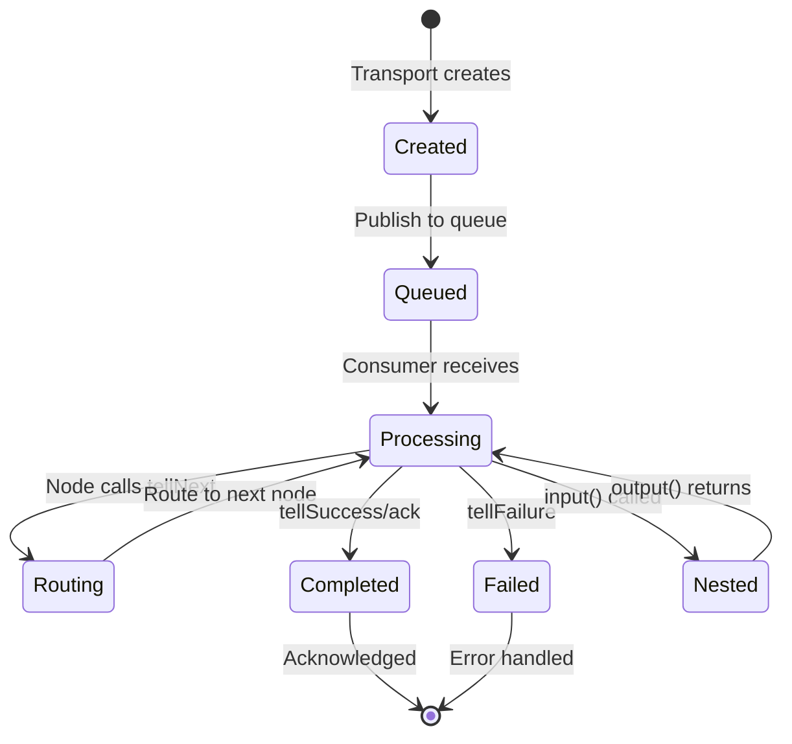
```mermaid
stateDiagram-v2
    [*] --> Created: Transport creates
    Created --> Queued: Publish to queue
    Queued --> Processing: Consumer receives
    Processing --> Routing: Node calls tellNext
    Routing --> Processing: Route to next node

    Processing --> Completed: tellSuccess/ack
    Processing --> Failed: tellFailure
    Processing --> Nested: input() called

    Nested --> Processing: output() returns

    Completed --> [*]: Acknowledged
    Failed --> [*]: Error handled
```

## Message Transformation Examples

### Change Originator

```
TbMsg newMsg = msg.transform()
    .originator(newEntityId)
    .build();
```

### Update Data

```
TbMsg newMsg = msg.transform()
    .data(newJsonData)
    .build();
```

### Add Metadata

```
TbMsgMetaData newMeta = msg.getMetaData().copy();
newMeta.putValue("enriched", "true");

TbMsg newMsg = msg.transform()
    .metaData(newMeta)
    .build();
```

### Route to Different Queue

```
TbMsg newMsg = msg.transform()
    .queueName("HighPriority")
    .build();
```

## Error Handling

### Exception Flow

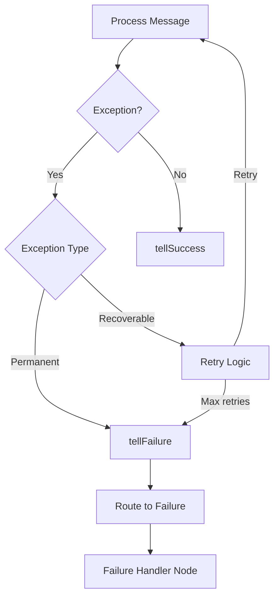
```mermaid
graph TB
    PROCESS[Process Message] --> ERROR{Exception?}
    ERROR -->|Yes| TYPE{Exception Type}
    ERROR -->|No| SUCCESS[tellSuccess]

    TYPE -->|Recoverable| RETRY[Retry Logic]
    TYPE -->|Permanent| FAILURE[tellFailure]

    RETRY -->|Max retries| FAILURE
    RETRY -->|Retry| PROCESS

    FAILURE --> ROUTE[Route to Failure]
    ROUTE --> HANDLER[Failure Handler Node]
```

### Failure Message

When `tellFailure` is called, the failure message is included:

```
RuleNodeToRuleChainTellNextMsg {
    ruleChainId
    ruleNodeId
    relationTypes: {"Failure"}
    msg
    failureMessage: "Error details..."
}
```

## Best Practices

### Message Creation

1. **Use TbMsgType enum** instead of string types for better type safety
2. **Always set originator** - required for proper routing
3. **Include timestamp** if source has its own timestamp

### Message Transformation

1. **Use transform()** for modifications to get proper context handling
2. **Copy metadata explicitly** when enriching - transform() auto-copies
3. **Don't modify original** - always create new instances

### Routing

1. **Call exactly one routing method** per node execution
2. **Use tellSuccess** for simple success cases
3. **Use tellFailure with exception** for proper error tracking
4. **Check msg.isValid()** before expensive operations

### Performance

1. **Avoid large payloads** - consider storing data and passing references
2. **Minimize metadata size** - string-only, no nested structures
3. **Use appropriate data type** - JSON for structured, TEXT for simple

## Common Pitfalls

### Message Transformation

| Pitfall | Impact | Solution |
|---------|--------|----------|
| Forgetting message immutability | Unexpected behavior when modifying messages | Always use `copy()` or `transform()` to create new messages |
| Sharing metadata between messages | Data corruption in parallel processing | Use `metadata.copy()` for independent messages |
| Modifying originator without intent | Messages route to wrong entity, data saved to wrong place | Verify Change Originator node placement; save original in metadata |
| Not incrementing execution counter | Infinite loop detection fails | Use `transform()` which handles counter automatically |

### Context and Callbacks

| Pitfall | Impact | Solution |
|---------|--------|----------|
| Losing callback reference | Messages never acknowledged, queue backup | Use `copyWithNewCtx()` for async operations; preserve callback chain |
| Multiple callbacks for same message | Double acknowledgment errors | Only call one routing method (`tellSuccess`/`tellFailure`/`tellNext`) per execution |
| Not calling callback | Message stuck, queue consumer blocked | Always call routing method, even on error |
| Callback without error on failure | Errors not tracked properly | Use `tellFailure(msg, throwable)` to include exception details |

### Message Stack and Depth

| Pitfall | Impact | Solution |
|---------|--------|----------|
| Deep call stack without limit | Stack overflow after many nested chains | Monitor `ctx.stack` depth; limit nested chain calls to 5 levels |
| Not checking stack depth | Infinite recursion undetected | Validate stack size before invoking nested chains |
| Circular chain references | Stack overflow, infinite processing | Maintain chain dependency diagram; validate no cycles |

### Metadata Management

| Pitfall | Impact | Solution |
|---------|--------|----------|
| Storing complex objects in metadata | Serialization errors | Metadata values must be strings only |
| Missing correlation ID | Cannot trace request-response flows | Set `correlationId` for RPC and integration calls |
| Overwriting system metadata | Breaking message processing | Avoid keys: `ts`, `ruleChainId`, `ruleNodeId` |
| Large metadata maps | Memory pressure, serialization overhead | Limit metadata size; use < 50 keys per message |

### Message Types

| Pitfall | Impact | Solution |
|---------|--------|----------|
| Wrong message type for node | Node doesn't process message | Use Message Type Switch to route correctly |
| Custom type without handler | Messages not routed | Add custom type handlers in root chain |
| Type case sensitivity | Routing failures | Use exact type constants (POST_TELEMETRY_REQUEST, not post_telemetry) |

### Originator Handling

| Pitfall | Impact | Solution |
|---------|--------|----------|
| Null originator | Processing errors | Validate originator exists before attribute/relation operations |
| Wrong originator type | Type-specific operations fail | Check entity type before device/asset-specific operations |
| Changing originator mid-chain | Data saved to unintended entity | Change originator only when intentional; document clearly |

### Data and Payload

| Pitfall | Impact | Solution |
|---------|--------|----------|
| Large payloads (>100KB) | Memory pressure, serialization overhead | Store large data separately; pass references in message |
| Invalid JSON payload | Parsing errors downstream | Validate JSON before Save Telemetry nodes |
| Payload data type mismatch | Node expects JSON, receives TEXT | Set `dataType` correctly when creating messages |
| Nested data too deep | JSON parsing performance | Flatten data structures where possible |

### Routing and Relations

| Pitfall | Impact | Solution |
|---------|--------|----------|
| Case-sensitive relation names | Messages route to Failure | Use exact relation names: "Success" not "success" |
| No Failure relation handler | Failed messages marked as processed | Always connect Failure relations to error handlers |
| Multiple Success connections | Ambiguous routing | Use Switch node with distinct labels instead |
| Custom relation not connected | Messages dropped | Ensure all custom relations have downstream connections |

### Partition and Distribution

| Pitfall | Impact | Solution |
|---------|--------|----------|
| Missing partition key | Random distribution, no ordering | Set partition key for ordered processing |
| Partition key changes | Message reordering during processing | Use stable partition keys (device ID, tenant ID) |
| High-cardinality partition | Partition imbalance | Choose keys with reasonable cardinality |

### Async Processing

| Pitfall | Impact | Solution |
|---------|--------|----------|
| Not handling async node completion | Parent chain doesn't wait | Understand async node behavior; use proper callback handling |
| Blocking operations in node code | Thread pool exhaustion | Use async APIs; avoid blocking I/O |
| No timeout on async operations | Messages stuck indefinitely | Set reasonable timeouts for external calls |

### Serialization and Transfer

| Pitfall | Impact | Solution |
|---------|--------|----------|
| Non-serializable objects in metadata | Queue transport fails | Keep metadata simple: strings only |
| Message size exceeds Kafka limit | Message rejected | Limit message size to < 1MB; use external storage for large data |
| Binary data in JSON payload | Encoding issues | Base64 encode binary data or use separate storage |

## See Also

- [Rule Engine Overview](./README.md) - Introduction to rule engine
- [Rule Chain Structure](./rule-chain-structure.md) - Chain composition
- [Node Categories](./node-categories.md) - Built-in node types
- [Node Development Contract](./node-development-contract.md) - Creating custom nodes
- [Message Queue](../08-message-queue/queue-architecture.md) - Queue transport
