# Node Categories

## Overview

The rule engine provides over 70 built-in rule nodes organized into six categories. Each node performs a specific function in message processing: filtering, enriching, transforming, acting, integrating with external systems, or controlling flow. Nodes are annotated with metadata that defines their behavior, connections, and configuration schema.

## Categories at a Glance

```mermaid
graph TB
    subgraph "FILTER"
        direction TB
        F1[Route by condition]
        F2[Script-based filtering]
        F3[Type/relation checks]
    end

    subgraph "ENRICHMENT"
        direction TB
        E1[Add attributes]
        E2[Add telemetry]
        E3[Add entity fields]
    end

    subgraph "TRANSFORMATION"
        direction TB
        T1[Modify payload]
        T2[Change originator]
        T3[Restructure data]
    end

    subgraph "ACTION"
        direction TB
        A1[Save to database]
        A2[Create alarms]
        A3[Send RPC]
    end

    subgraph "EXTERNAL"
        direction TB
        X1[REST/HTTP calls]
        X2[Message brokers]
        X3[Cloud services]
    end

    subgraph "FLOW"
        direction TB
        FL1[Chain routing]
        FL2[Queue control]
        FL3[Acknowledgment]
    end
```

| Category | Purpose | Count | Reference |
|----------|---------|-------|-----------|
| FILTER | Route messages based on conditions | 12 | [Filter Nodes](./nodes/filter-nodes.md) |
| ENRICHMENT | Add data from external sources to messages | 11 | [Enrichment Nodes](./nodes/enrichment-nodes.md) |
| TRANSFORMATION | Modify message payload, metadata, or originator | 9 | [Transformation Nodes](./nodes/transformation-nodes.md) |
| ACTION | Perform database operations and system actions | 20+ | [Action Nodes](./nodes/action-nodes.md) |
| EXTERNAL | Integrate with external systems and services | 14 | [External Nodes](./nodes/external-nodes.md) |
| FLOW | Control rule chain execution and message routing | 4 | [Flow Nodes](./nodes/flow-nodes.md) |
| ANALYTICS (PE) | Statistical aggregation and calculations | 4 | [Analytics Nodes](./nodes/analytics-nodes.md) |

## Filter Nodes

Filter nodes evaluate conditions and route messages to different output connections based on the result. Most filter nodes output to `True`/`False` connections, while switch nodes output to multiple dynamic connections.

### Node Summary

| Node | Name | Description | Output Relations |
|------|------|-------------|------------------|
| TbJsFilterNode | script | Filter using TBEL or JavaScript | True, False |
| TbMsgTypeSwitchNode | message type switch | Route by message type | Per message type |
| TbOriginatorTypeSwitchNode | entity type switch | Route by originator entity type | Per entity type |
| TbJsSwitchNode | switch | Custom routing using script | Custom |
| TbMsgTypeFilterNode | message type | Filter by specific message types | True, False |
| TbOriginatorTypeFilterNode | originator type | Filter by originator type | True, False |
| TbCheckRelationNode | check relation presence | Check if relation exists | True, False |
| TbCheckMessageNode | check existence fields | Check message fields exist | True, False |
| TbCheckAlarmStatusNode | check alarm status | Check alarm status | Per status |
| TbGpsGeofencingFilterNode | gps geofencing filter | GPS-based geofencing | True, False |
| TbDeviceTypeSwitchNode | device type switch | Route by device type | Per device type |
| TbAssetTypeSwitchNode | asset type switch | Route by asset type | Per asset type |

### Filter Flow Pattern

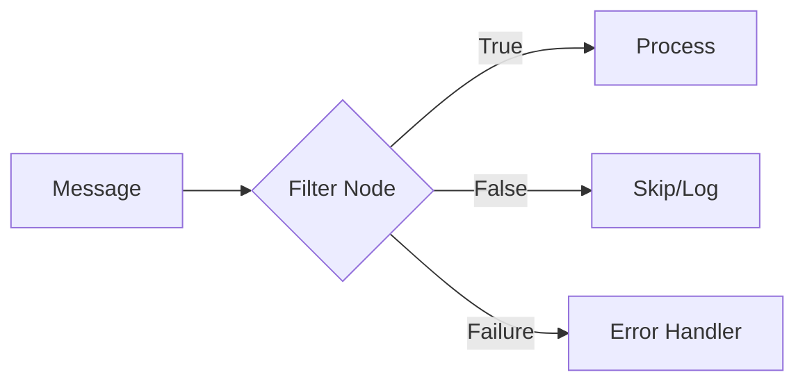

### Script Filter

Evaluates a user-defined script that returns true or false.

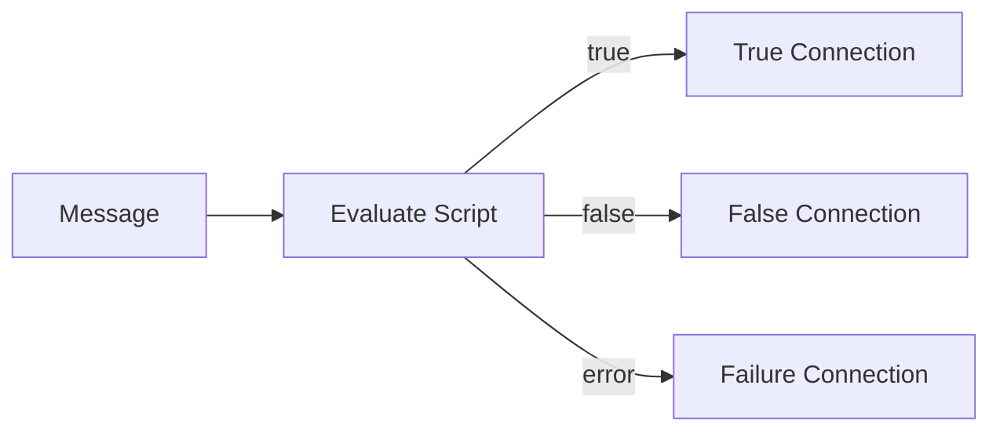

**Configuration:**
```json
{
  "scriptLang": "TBEL",
  "tbelScript": "return msg.temperature > 25;",
  "jsScript": ""
}
```

**Script Variables:**
- `msg` - Message payload (JSON object)
- `metadata` - Message metadata (key-value pairs)
- `msgType` - Message type string

### Message Type Switch

Routes messages to connections named after message types (e.g., "Post telemetry", "Post attributes").

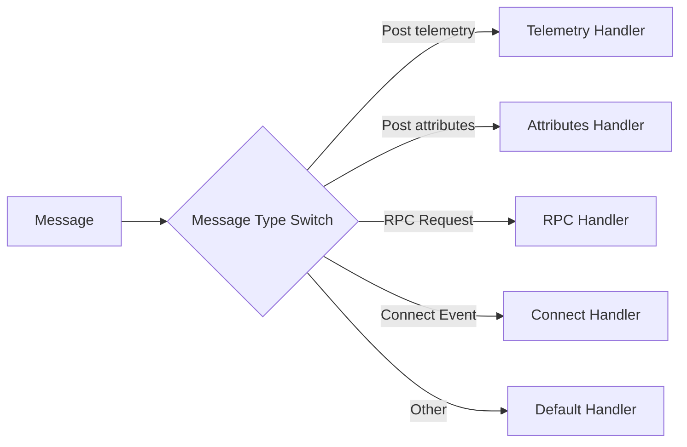

**Output Relations:** Dynamic based on TbMsgType enum values plus "Other" for custom types.

### Entity Type Switch

Routes messages based on the originator's entity type.

**Output Relations:** Device, Asset, Customer, Tenant, User, Dashboard, Alarm, EntityView, etc.

### Check Relation Presence

Verifies whether a relation exists between the message originator and another entity.

**Configuration:**
```json
{
  "checkForSingleEntity": true,
  "direction": "FROM",
  "relationType": "Contains",
  "entityType": "ASSET",
  "entityId": "asset-uuid-here"
}
```

**Direction:**
- `FROM` - Check if originator has outgoing relation
- `TO` - Check if originator has incoming relation

## Enrichment Nodes

Enrichment nodes fetch data from the platform and add it to the message payload or metadata. They retrieve attributes, telemetry, entity fields, or calculated values.

### Node Summary

| Node | Name | Description |
|------|------|-------------|
| TbGetAttributesNode | originator attributes | Get originator's attributes and/or latest telemetry |
| TbGetRelatedAttributeNode | related entity data | Get related entity attributes, telemetry, or fields |
| TbGetTenantAttributeNode | tenant attributes | Get tenant attributes or latest telemetry |
| TbGetCustomerAttributeNode | customer attributes | Get customer attributes or latest telemetry |
| TbGetCustomerDetailsNode | customer details | Get customer entity fields |
| TbGetTenantDetailsNode | tenant details | Get tenant entity fields |
| TbGetOriginatorFieldsNode | originator fields | Get originator entity fields (name, label, etc.) |
| TbGetDeviceAttrNode | related device attributes | Get attributes from related device |
| TbGetTelemetryNode | originator telemetry | Get historical telemetry data |
| TbFetchDeviceCredentialsNode | fetch device credentials | Get device credentials |
| CalculateDeltaNode | calculate delta | Calculate difference between readings |

### Enrichment Flow Pattern

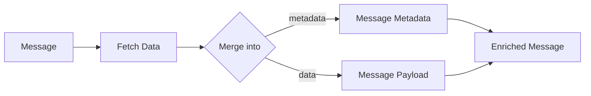

### Originator Attributes

Fetches attributes and/or latest telemetry from the message originator entity.

**Configuration:**
```json
{
  "clientAttributeNames": ["firmware"],
  "sharedAttributeNames": ["config"],
  "serverAttributeNames": ["threshold"],
  "latestTsKeyNames": ["temperature"],
  "fetchTo": "METADATA",
  "getLatestValueWithTs": false
}
```

**Fetch To Options:**
- `METADATA` - Add to message metadata
- `DATA` - Merge into message payload

### Related Entity Data

Fetches data from entities related to the message originator.

**Configuration:**
```json
{
  "direction": "FROM",
  "relationType": "Contains",
  "entityType": "ASSET",
  "attrMapping": {
    "location": "assetLocation"
  },
  "telemetryMapping": {
    "status": "assetStatus"
  }
}
```

### Calculate Delta

Computes the difference between consecutive telemetry readings.

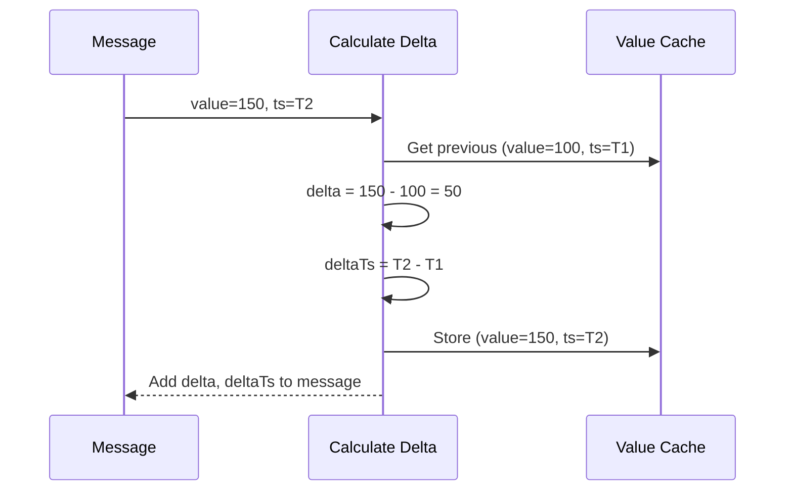

## Transformation Nodes

Transformation nodes modify the message structure, payload, metadata, or originator without fetching external data.

### Node Summary

| Node | Name | Description |
|------|------|-------------|
| TbTransformMsgNode | script | Transform using TBEL or JavaScript |
| TbChangeOriginatorNode | change originator | Change message originator entity |
| TbMsgToEmailNode | to email | Transform to email message format |
| TbDeleteKeysNode | delete key-value pairs | Remove keys from message or metadata |
| TbCopyKeysNode | copy key-value pairs | Copy between message and metadata |
| TbRenameKeysNode | rename keys | Rename message or metadata keys |
| TbJsonPathNode | json path | Extract data using JSONPath |
| TbSplitArrayMsgNode | split array msg | Split array into multiple messages |
| TbMsgDeduplicationNode | deduplication | Deduplicate messages by originator |

### Transformation Flow Pattern

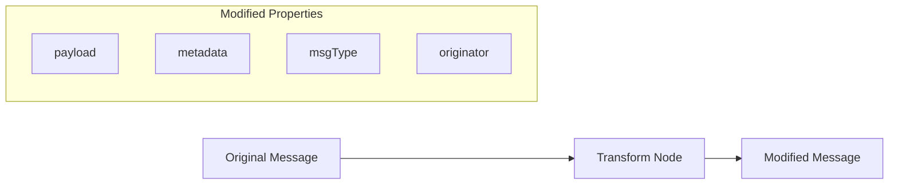

### Script Transform

Transforms messages using user-defined scripts. Can modify payload, metadata, and message type.

**Configuration:**
```json
{
  "scriptLang": "TBEL",
  "tbelScript": "var result = { msg: msg, metadata: metadata, msgType: msgType }; result.msg.processed = true; return result;"
}
```

**Script Return Structure:**
```javascript
{
  msg: { /* new payload */ },
  metadata: { /* new metadata */ },
  msgType: "NEW_TYPE"
}
```

### Change Originator

Changes the message originator to a different entity.

**Originator Sources:**
| Source | Description |
|--------|-------------|
| CUSTOMER | Originator's customer |
| TENANT | Current tenant |
| RELATED | Entity related to originator |
| ALARM_ORIGINATOR | Alarm's source entity |
| ENTITY_BY_NAME_PATTERN | Find by name pattern |

**Configuration:**
```json
{
  "originatorSource": "RELATED",
  "direction": "FROM",
  "relationType": "Contains",
  "entityType": "ASSET"
}
```

### Split Array Message

Splits a message containing an array into multiple individual messages.

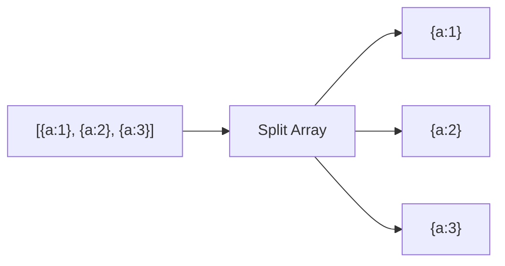

**Configuration:**
```json
{
  "keysToSplit": ["readings"],
  "splitArrayMsgMode": "SPLIT_ARRAY_TO_OBJECTS"
}
```

## Action Nodes

Action nodes perform operations that affect the platform state: saving data, creating alarms, managing relations, sending RPCs, and more.

### Node Summary - Data Persistence

| Node | Name | Description |
|------|------|-------------|
| TbMsgTimeseriesNode | save time series | Save telemetry to database |
| TbMsgAttributesNode | save attributes | Save attributes to database |
| TbMsgDeleteAttributesNode | delete attributes | Remove attributes from database |
| TbSaveToCustomCassandraTableNode | save to custom table | Save to custom Cassandra table |

### Node Summary - Alarm Management

| Node | Name | Description | Output Relations |
|------|------|-------------|------------------|
| TbCreateAlarmNode | create alarm | Create or update alarm | Created, Updated, False |
| TbClearAlarmNode | clear alarm | Clear existing alarm | Cleared, False |
| TbGpsGeofencingActionNode | gps geofencing events | Geofencing alarm events | Entered, Left, Inside, Outside |

### Node Summary - Entity Management

| Node | Name | Description |
|------|------|-------------|
| TbCreateRelationNode | create relation | Create entity relation |
| TbDeleteRelationNode | delete relation | Delete entity relation |
| TbAssignToCustomerNode | assign to customer | Assign entity to customer |
| TbUnassignFromCustomerNode | unassign from customer | Remove customer assignment |
| TbCopyAttributesToEntityViewNode | copy to view | Copy to entity view |

### Node Summary - RPC & Communication

| Node | Name | Description |
|------|------|-------------|
| TbSendRPCRequestNode | rpc call request | Send RPC to device |
| TbSendRPCReplyNode | rpc call reply | Reply to device RPC |
| TbSendRestApiCallReplyNode | rest call reply | Reply to REST API call |

### Node Summary - Utilities

| Node | Name | Description |
|------|------|-------------|
| TbLogNode | log | Log message to system log |
| TbMsgCountNode | message count | Count messages periodically |
| TbMsgGeneratorNode | generator | Generate test messages |
| TbDeviceStateNode | device state | Trigger connectivity events |
| TbMathNode | math function | Apply mathematical functions |
| TbCalculatedFieldsNode | calculated fields and alarm rules | Push to calculated fields service |

### Node Summary - Edge Computing (v4.3.0)

| Node | Name | Description | Deployment |
|------|------|-------------|------------|
| TbMsgPushToEdgeNode | push to edge | Route messages from cloud to edge | Cloud only |
| TbMsgPushToCloudNode | push to cloud | Route messages from edge to cloud | Edge only |

### Deprecated Nodes

| Node | Name | Deprecated Since | Replacement |
|------|------|------------------|-------------|
| TbMsgDelayNode | delay | 2.5 | Use queue with SEQUENTIAL_BY_ORIGINATOR strategy |
| TbSynchronizationBeginNode | synchronization begin | 2.5 | Use queue with SEQUENTIAL_BY_ORIGINATOR strategy |
| TbSynchronizationEndNode | synchronization end | 2.5 | Use queue with SEQUENTIAL_BY_ORIGINATOR strategy |
| TbDeviceProfileNode | device profile | 2.5 | Use device profile alarms configuration |

### Save Time Series

Saves telemetry data with configurable TTL and processing strategies.

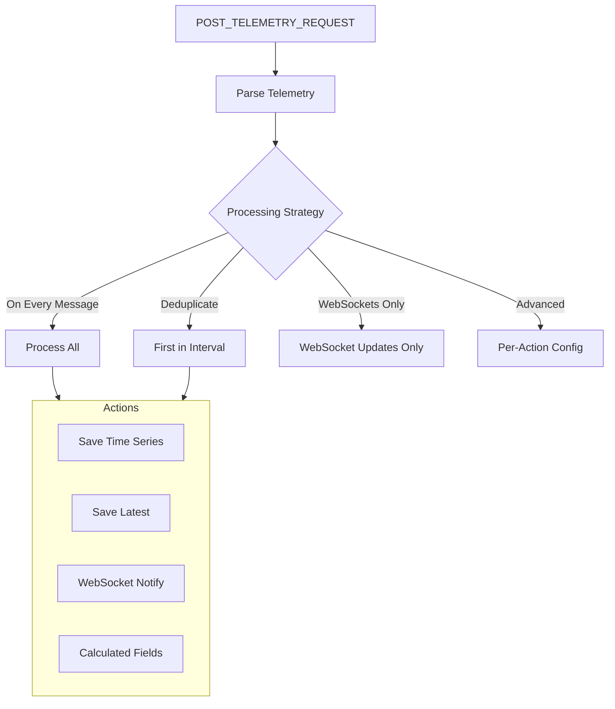

**Configuration:**
```json
{
  "defaultTTL": 0,
  "useServerTs": false,
  "processingSettings": {
    "type": "ON_EVERY_MESSAGE"
  }
}
```

**Processing Strategies:**
| Strategy | Behavior |
|----------|----------|
| ON_EVERY_MESSAGE | Process every message (save timeseries, latest, WebSocket, calculated fields) |
| DEDUPLICATE | Process first message per interval per originator |
| WEBSOCKETS_ONLY | Only notify WebSocket subscribers (skip persistence) |
| ADVANCED | Configure each action independently |

**Advanced Strategy Options:**
When using ADVANCED, each action can be enabled/disabled independently:
- `saveTimeseries` - Persist to time-series database
- `saveLatest` - Update latest values cache
- `sendWsUpdate` - Broadcast to WebSocket subscribers
- `processCalculatedFields` - Trigger calculated field updates

**TTL Resolution (priority order):**
1. `metadata.TTL` from message
2. Node configuration `defaultTTL`
3. Tenant profile default TTL

**Timestamp Sources:**
1. `metadata.ts` from message (if present)
2. Server time (if `useServerTs` enabled)
3. Current time (default)

### Save Attributes

Saves attributes to the database with configurable scope and processing options.

**Configuration:**
```json
{
  "scope": "SERVER_SCOPE",
  "notifyDevice": true,
  "sendAttributesUpdatedNotification": false,
  "updateAttributesOnlyOnValueChange": false,
  "processingSettings": {
    "type": "ON_EVERY_MESSAGE"
  }
}
```

**Attribute Scopes:**

| Scope | Description | Device Notification |
|-------|-------------|---------------------|
| CLIENT_SCOPE | Device-side only (read by server) | N/A |
| SHARED_SCOPE | Shared between device and server | Yes (if notifyDevice) |
| SERVER_SCOPE | Server-side only | N/A |

**Scope Override:**
The scope can be overridden per-message via `metadata.scope`.

**Change Detection:**
When `updateAttributesOnlyOnValueChange: true`:
1. Fetch current attribute values from database
2. Compare with incoming values
3. Save only changed attributes
4. Skip save entirely if no changes

**Device Notification:**
For SHARED_SCOPE attributes:
- `notifyDevice: true` - Push update to device via transport
- Override via `metadata.notifyDevice`

**Attributes Updated Event:**
When `sendAttributesUpdatedNotification: true` and scope is SHARED or SERVER:
- Emits ATTRIBUTES_UPDATED message to Main queue
- Can be processed by other rule chains

**Processing Strategies:**
Same as Save Time Series (ON_EVERY_MESSAGE, DEDUPLICATE, WEBSOCKETS_ONLY, ADVANCED)

### Create Alarm

Creates a new alarm or updates an existing one for the message originator.

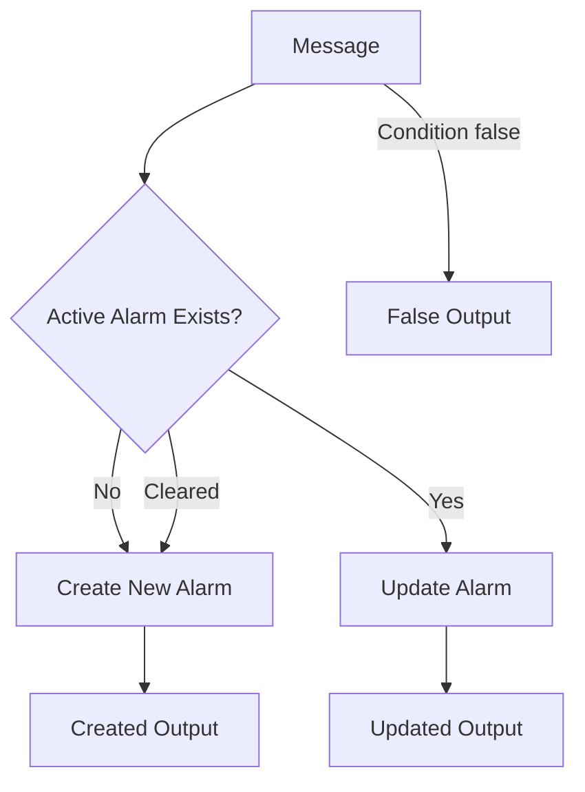

**Configuration:**
```json
{
  "alarmType": "High Temperature",
  "severity": "WARNING",
  "propagate": true,
  "propagateToOwner": false,
  "propagateToTenant": false,
  "dynamicSeverity": false,
  "useMessageAlarmData": false
}
```

**Output Relations:**
- `Created` - New alarm created
- `Updated` - Existing alarm updated (severity or details changed)
- `False` - No alarm action taken (condition evaluated to false)

**Atomic Create/Update Behavior:**
The alarm service maintains exactly ONE active alarm per `{originator, alarmType}` combination:
- If no active alarm exists → CREATE new alarm
- If active alarm exists → UPDATE severity and details
- If alarm was cleared → CREATE new alarm

**Dynamic Severity:**
When `dynamicSeverity: true`, severity is resolved from a pattern (e.g., `${severity}`) using message data or metadata.

**Alarm Details Script:**
Optional JavaScript/TBEL function to generate alarm details. Output is merged into the alarm's `details` field:
```javascript
// Script receives: msg, metadata, msgType
// Returns: object to merge into alarm details
return { temperature: msg.temperature, threshold: metadata.threshold };
```

**Message Output:**
The output message contains the alarm object in the payload with metadata flags:
- `isNewAlarm: true` - Alarm was created
- `isExistingAlarm: true` - Alarm was updated

### RPC Call Request

Sends an RPC request to a device.

**Expected Message Format:**
```json
{
  "method": "setValue",
  "params": {"value": 42}
}
```

**Optional Metadata:**
- `oneway` - Fire-and-forget (no response expected)
- `persistent` - Persist RPC until delivered
- `expirationTime` - Message expiration timestamp
- `retries` - Number of retry attempts

## External Nodes

External nodes integrate with third-party systems by sending HTTP requests, publishing to message brokers, or calling cloud services.

### Node Summary - HTTP/REST

| Node | Name | Description |
|------|------|-------------|
| TbRestApiCallNode | rest api call | Call external REST API |

### Node Summary - Message Brokers

| Node | Name | Description |
|------|------|-------------|
| TbKafkaNode | kafka | Publish to Apache Kafka |
| TbMqttNode | mqtt | Publish to MQTT broker |
| TbRabbitMqNode | rabbitmq | Publish to RabbitMQ |

### Node Summary - Cloud Services

| Node | Name | Description |
|------|------|-------------|
| TbSqsNode | aws sqs | Publish to AWS SQS |
| TbSnsNode | aws sns | Publish to AWS SNS |
| TbAwsLambdaNode | aws lambda | Invoke AWS Lambda |
| TbPubSubNode | gcp pubsub | Publish to GCP Pub/Sub |
| TbAzureIotHubNode | azure iot hub | Publish to Azure IoT Hub |

### Node Summary - Notifications

| Node | Name | Description |
|------|------|-------------|
| TbSendEmailNode | send email | Send email via SMTP |
| TbSendSmsNode | send sms | Send SMS via provider |
| TbNotificationNode | send notification | Send platform notification |
| TbSlackNode | send to slack | Send Slack message |
| TbAiNode | AI request | Send to AI model |

### External Node Flow Pattern

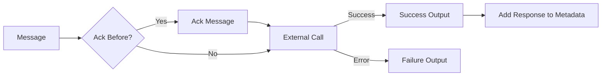

### REST API Call

Makes HTTP requests to external REST endpoints.

**Configuration:**
```json
{
  "restEndpointUrlPattern": "https://api.example.com/data/${deviceId}",
  "requestMethod": "POST",
  "useSimpleClientHttpFactory": false,
  "readTimeoutMs": 0,
  "maxParallelRequestsCount": 0,
  "headers": {
    "Content-Type": "application/json"
  },
  "useSystemProxyProperties": false,
  "parseToPlainText": false
}
```

**Response Metadata:**
| Key | Value |
|-----|-------|
| status | HTTP status description |
| statusCode | HTTP status code (200, 404, etc.) |
| statusReason | Status reason phrase |
| headers | Response headers (JSON) |

### Kafka Node

Publishes messages to Apache Kafka topics.

**Configuration:**
```json
{
  "topicPattern": "iot-telemetry-${deviceType}",
  "keyPattern": "${deviceId}",
  "bootstrapServers": "kafka:9092",
  "acks": "-1",
  "retries": 0,
  "batchSize": 16384,
  "linger": 0,
  "bufferMemory": 33554432,
  "addMetadataKeyValuesAsKafkaHeaders": false
}
```

**Response Metadata:**
| Key | Value |
|-----|-------|
| offset | Kafka message offset |
| partition | Kafka partition number |
| topic | Kafka topic name |
| error | Error message (on failure) |

**Kafka Headers:**
When `addMetadataKeyValuesAsKafkaHeaders: true`, message metadata is added as Kafka headers with prefix `tb_msg_md_`:
- `tb_msg_md_deviceName` → device name value
- `tb_msg_md_deviceType` → device type value

**SSL Certificate Handling:**
SSL certificates in `otherProperties` automatically have escaped newlines (`\\n`) converted to actual newlines for proper certificate parsing.

**Client ID:**
Generated as: `producer-tb-kafka-node-{nodeId}-{serviceId}`

### MQTT Node

Publishes messages to external MQTT brokers.

**Configuration:**
```json
{
  "topicPattern": "devices/${deviceId}/telemetry",
  "host": "mqtt.example.com",
  "port": 1883,
  "connectTimeoutSec": 10,
  "clientId": "tb-${nodeId}",
  "appendClientIdSuffix": true,
  "protocolVersion": "MQTT_3_1",
  "cleanSession": true,
  "ssl": false,
  "retainedMessage": false,
  "parseToPlainText": false,
  "credentials": {
    "type": "basic",
    "username": "user",
    "password": "pass"
  }
}
```

**Protocol Version:**
| Version | Max Client ID Length | Features |
|---------|---------------------|----------|
| MQTT_3_1 | 23 characters | Standard MQTT |
| MQTT_5 | 256 characters | Enhanced features |

**Client ID Suffix:**
When `appendClientIdSuffix: true`, the service instance ID is appended to ensure uniqueness across cluster nodes.

**Credentials Types:**
- `basic` - Username and password
- `certificate` - Mutual TLS with client certificate

**QoS Level:**
Fixed at AT_LEAST_ONCE (QoS 1) for delivery guarantee.

## Flow Nodes

Flow nodes control message routing between rule chains and manage message acknowledgment.

### Node Summary

| Node | Name | Description | Has Output |
|------|------|-------------|------------|
| TbRuleChainInputNode | rule chain | Transfer to another rule chain | Yes (custom) |
| TbRuleChainOutputNode | output | Return to parent rule chain | No |
| TbCheckpointNode | checkpoint | Transfer to another queue | Yes |
| TbAckNode | acknowledge | Acknowledge message | Yes |

### Rule Chain Input/Output Flow

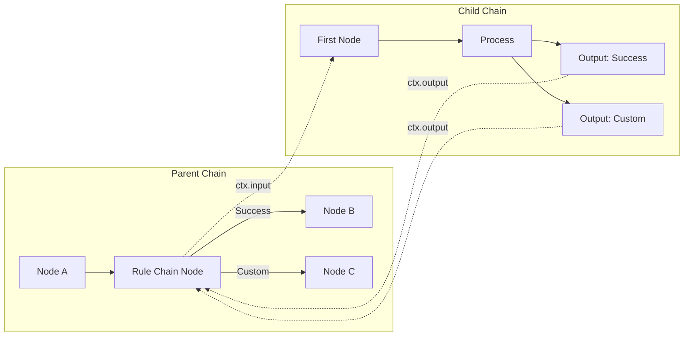

### Rule Chain Input Node

Transfers message processing to another rule chain.

**Configuration:**
```json
{
  "ruleChainId": "target-chain-uuid",
  "forwardMsgToDefaultRuleChain": false
}
```

**Dynamic Rule Chain Resolution:**
When `forwardMsgToDefaultRuleChain` is true, the target chain is resolved from the originator's profile (device profile or asset profile default rule chain).

### Rule Chain Output Node

Returns control to the parent rule chain. The node's name becomes the relation type for routing in the parent chain.

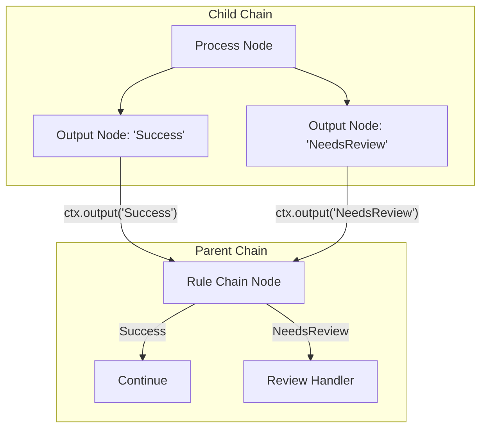

### Checkpoint Node

Transfers message processing to a different queue, enabling isolation and prioritization.

**Configuration:**
```json
{
  "queueName": "HighPriority"
}
```

**Use Cases:**
- Move CPU-intensive processing to dedicated queue
- Isolate external API calls from critical path
- Implement priority processing

### Acknowledge Node

Acknowledges message processing without routing to other nodes. Useful for fire-and-forget patterns.

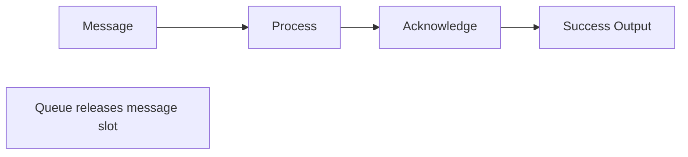

## Node Annotation Reference

All rule nodes are declared using the `@RuleNode` annotation with the following attributes:

| Attribute | Type | Description |
|-----------|------|-------------|
| type | ComponentType | Category (FILTER, ENRICHMENT, etc.) |
| name | String | Display name in UI |
| nodeDescription | String | Short description |
| nodeDetails | String | Detailed HTML documentation |
| configClazz | Class | Configuration schema class |
| relationTypes | String[] | Output connection types |
| customRelations | boolean | Allows custom relation types |
| inEnabled | boolean | Can receive messages |
| outEnabled | boolean | Can send messages |
| ruleChainNode | boolean | Is a flow control node |
| clusteringMode | ComponentClusteringMode | ENABLED or SINGLETON |
| hasQueueName | boolean | Supports custom queue assignment |
| version | int | Configuration version for upgrades |

### Example Annotation

```
@RuleNode(
    type = ComponentType.FILTER,
    name = "script",
    relationTypes = {"True", "False"},
    configClazz = TbJsFilterNodeConfiguration.class,
    nodeDescription = "Filter incoming messages using TBEL or JS script",
    nodeDetails = "Evaluates boolean function...",
    configDirective = "tbFilterNodeScriptConfig",
    docUrl = "https://thingsboard.io/docs/..."
)
```

## Common Patterns

### Filter-Enrich-Transform-Act

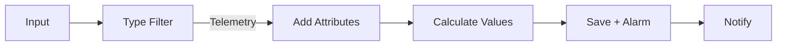

### Conditional Processing

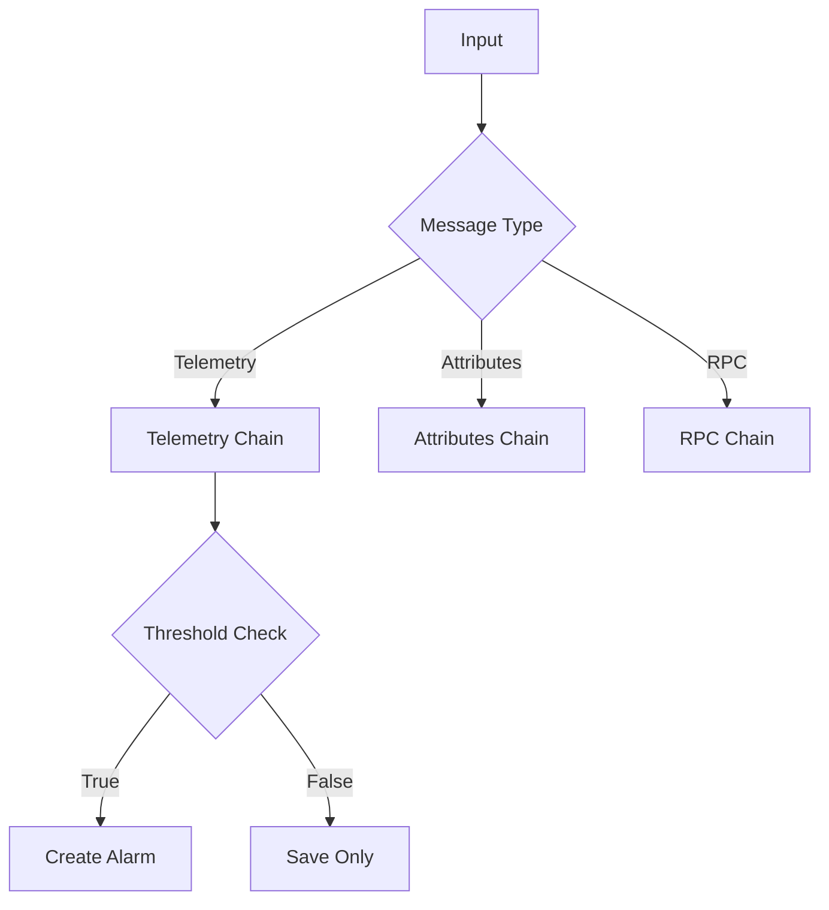

### External Integration with Retry

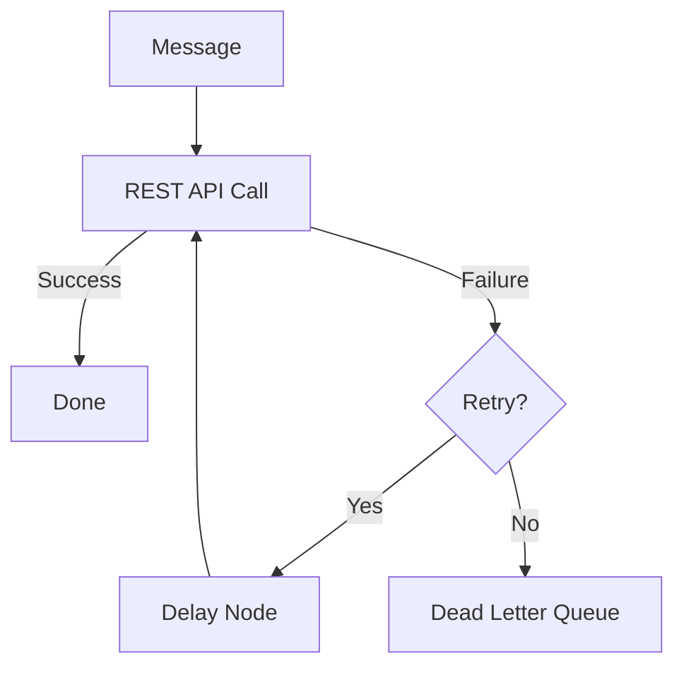

## See Also

- [Rule Engine Overview](./README.md) - Introduction to rule engine
- [Rule Chain Structure](./rule-chain-structure.md) - Chain composition
- [Message Flow (TbMsg)](./message-flow.md) - Message routing details
- [Node Development Contract](./node-development-contract.md) - Creating custom nodes
