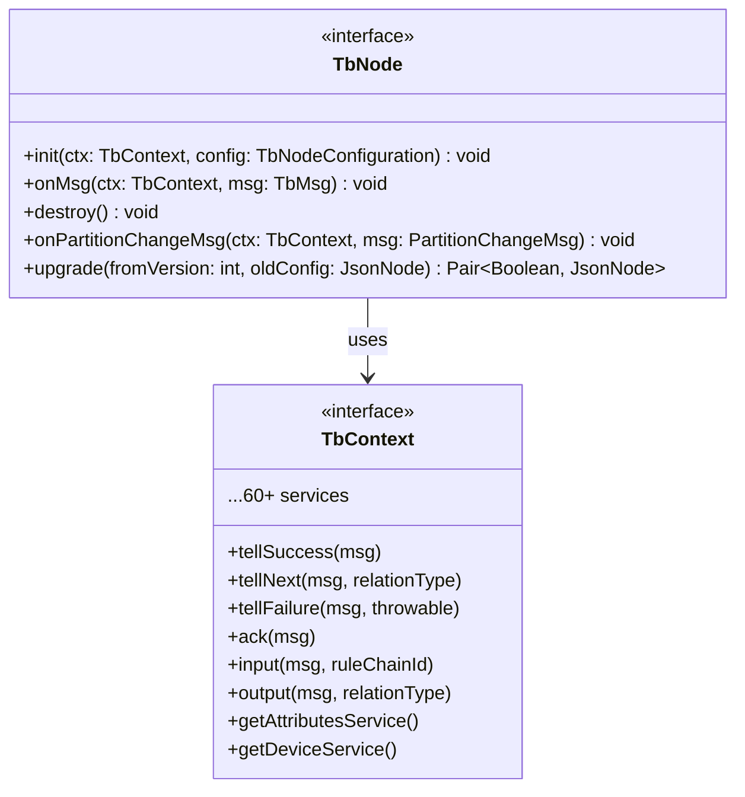
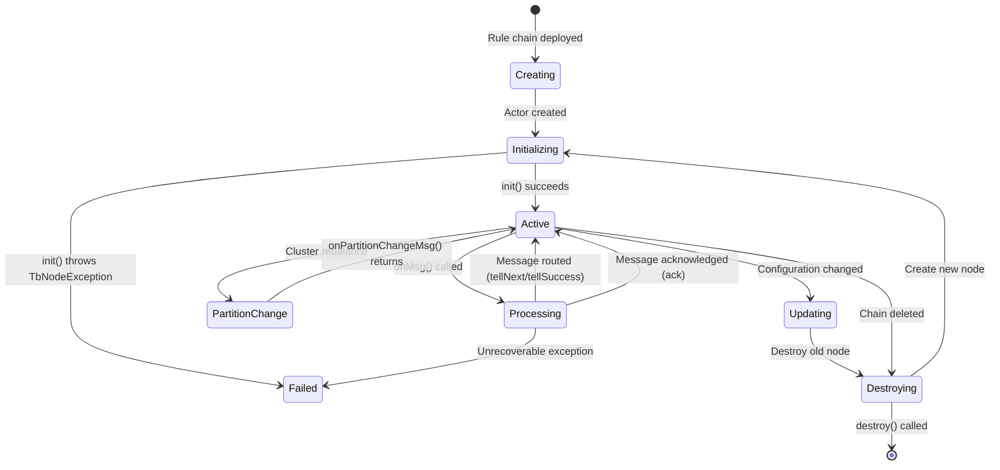
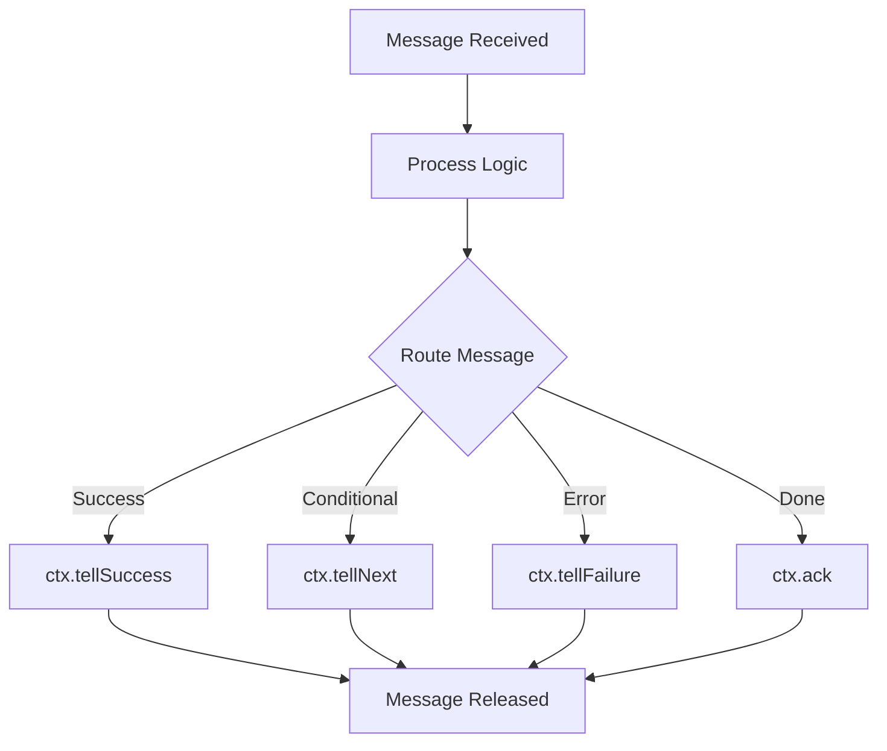
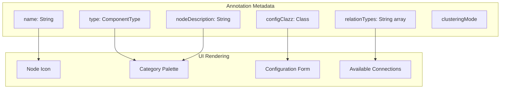
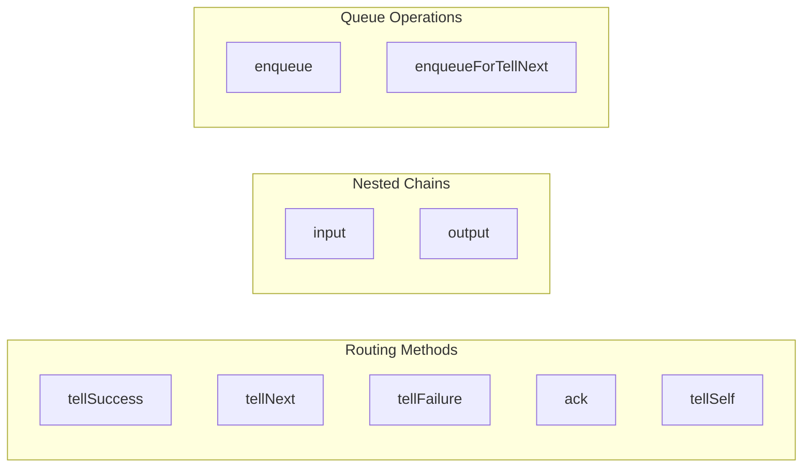
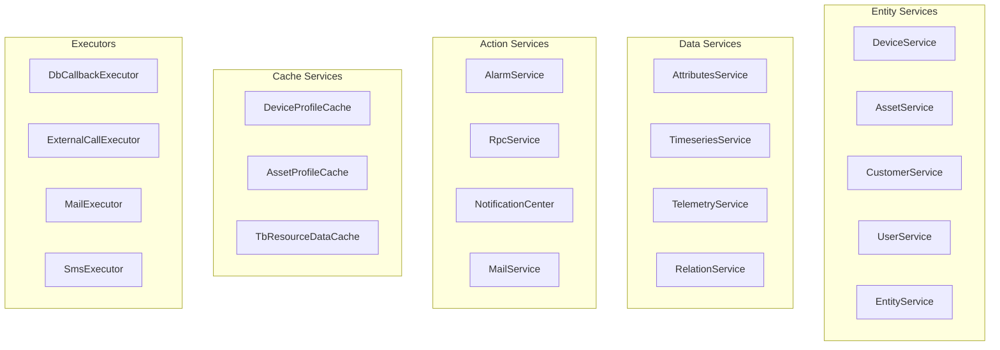
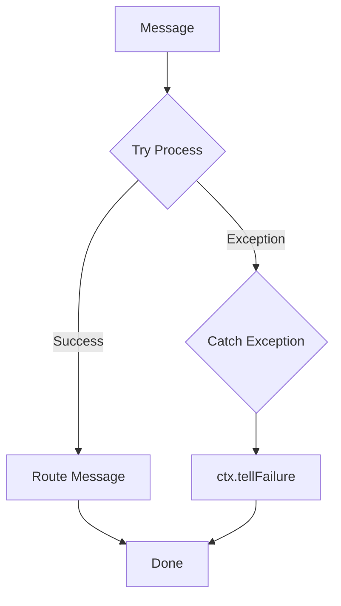
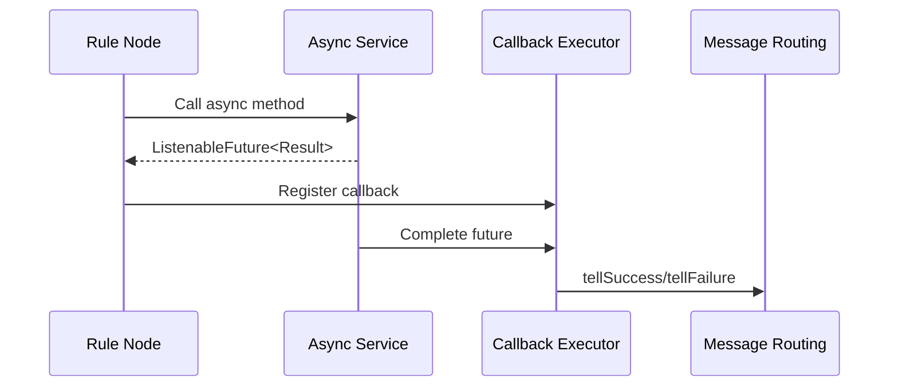
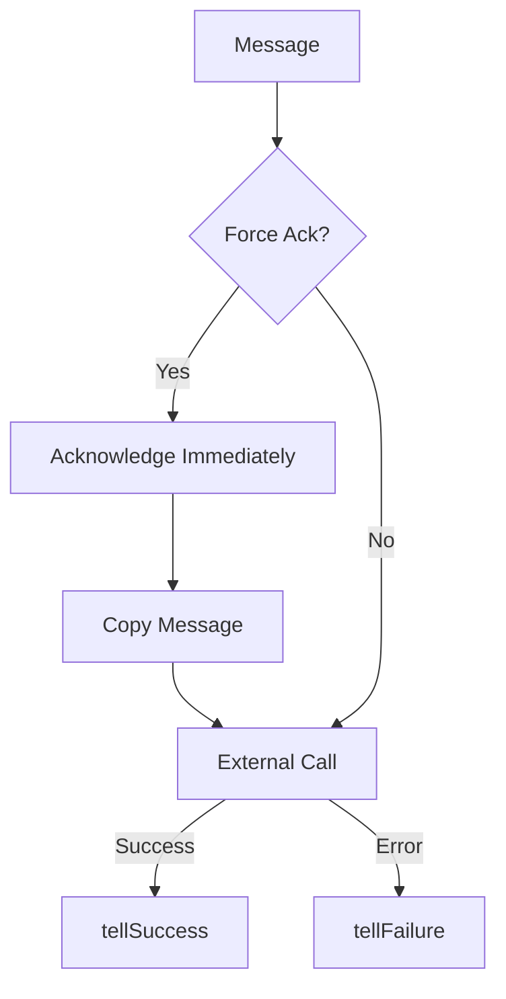

# Node Development Contract

## Overview

Custom rule nodes extend the rule engine's capabilities by implementing the `TbNode` interface and providing metadata via the `@RuleNode` annotation. This contract defines the lifecycle methods, message handling patterns, and service access available to node developers. Understanding this contract is essential for creating reliable, performant rule nodes that integrate correctly with the platform.

## TbNode Interface

The `TbNode` interface defines the contract all rule nodes must implement:



### Required Methods

| Method | Description | When Called |
|--------|-------------|-------------|
| `init()` | Initialize node with configuration | Once at node creation |
| `onMsg()` | Process incoming message | For each message |

### Optional Methods

| Method | Description | Default Behavior |
|--------|-------------|------------------|
| `destroy()` | Cleanup resources | No-op |
| `onPartitionChangeMsg()` | Handle partition reassignment | No-op |
| `upgrade()` | Migrate old configurations | Returns unchanged config |

## Node Lifecycle



### init() Method

Called once when the node is created. Parse configuration and initialize resources.

```
void init(TbContext ctx, TbNodeConfiguration configuration) throws TbNodeException
```

**Responsibilities:**
- Parse JSON configuration into typed object
- Validate configuration values
- Initialize connections, caches, or script engines
- Throw `TbNodeException` on failure

**Example:**
```
@Override
public void init(TbContext ctx, TbNodeConfiguration configuration) throws TbNodeException {
    this.config = TbNodeUtils.convert(configuration, MyNodeConfiguration.class);

    if (config.getThreshold() < 0) {
        throw new TbNodeException("Threshold must be non-negative", true);
    }

    this.scriptEngine = ctx.createScriptEngine(
        config.getScriptLang(),
        config.getScript()
    );
}
```

### onMsg() Method

Called for each message routed to the node. Process the message and route to next nodes.

```
void onMsg(TbContext ctx, TbMsg msg) throws ExecutionException, InterruptedException, TbNodeException
```

**Responsibilities:**
- Process message payload and metadata
- Route message using `ctx.tellNext()`, `ctx.tellSuccess()`, or `ctx.tellFailure()`
- Handle errors gracefully

**Critical Rule:** Every message MUST be routed or acknowledged. Failure to do so causes memory leaks and stuck messages.



### destroy() Method

Called when the node is removed or the rule chain is deleted. Release resources.

```
default void destroy() {}
```

**Responsibilities:**
- Close connections (HTTP clients, message brokers)
- Destroy script engines
- Cancel scheduled tasks
- Release memory caches

**Example:**
```
@Override
public void destroy() {
    if (scriptEngine != null) {
        scriptEngine.destroy();
    }
    if (httpClient != null) {
        httpClient.close();
    }
}
```

### onPartitionChangeMsg() Method

Called when cluster partitions are reassigned. Clean up state for entities no longer local.

```
default void onPartitionChangeMsg(TbContext ctx, PartitionChangeMsg msg) {}
```

**Use Cases:**
- Clear cached data for non-local entities
- Re-fetch state for newly assigned entities
- Update internal routing tables

### upgrade() Method

Called during configuration migration. Transform old configurations to new format.

```
default TbPair<Boolean, JsonNode> upgrade(int fromVersion, JsonNode oldConfiguration) throws TbNodeException
```

**Parameters:**
- `fromVersion` - Configuration version stored in database
- `oldConfiguration` - Current configuration JSON

**Returns:**
- `Boolean` - true if configuration was modified
- `JsonNode` - Updated configuration

**Example:**
```
@Override
public TbPair<Boolean, JsonNode> upgrade(int fromVersion, JsonNode oldConfig) throws TbNodeException {
    if (fromVersion == 0) {
        // Version 0 had "timeout" in seconds, version 1 uses milliseconds
        ObjectNode config = (ObjectNode) oldConfig;
        int timeoutSec = config.get("timeout").asInt();
        config.put("timeoutMs", timeoutSec * 1000);
        config.remove("timeout");
        return new TbPair<>(true, config);
    }
    return new TbPair<>(false, oldConfig);
}
```

## @RuleNode Annotation

The `@RuleNode` annotation provides metadata that defines how the node appears in the UI and behaves at runtime.



### Required Attributes

| Attribute | Type | Description |
|-----------|------|-------------|
| `type` | ComponentType | Category: FILTER, ENRICHMENT, TRANSFORMATION, ACTION, EXTERNAL, FLOW |
| `name` | String | Display name in UI |
| `configClazz` | Class | Configuration class for form generation |
| `nodeDescription` | String | Short description (shown in palette) |

### Optional Attributes

| Attribute | Type | Default | Description |
|-----------|------|---------|-------------|
| `nodeDetails` | String | "" | Detailed HTML documentation |
| `relationTypes` | String[] | {"Success", "Failure"} | Output connection types |
| `customRelations` | boolean | false | Allow user-defined relations |
| `inEnabled` | boolean | true | Can receive messages |
| `outEnabled` | boolean | true | Can send messages |
| `ruleChainNode` | boolean | false | Is a flow control node |
| `clusteringMode` | ComponentClusteringMode | ENABLED | Clustering behavior |
| `hasQueueName` | boolean | false | Supports custom queue |
| `version` | int | 0 | Configuration schema version |
| `configDirective` | String | "" | Angular directive for UI |
| `icon` | String | "" | Material icon name |
| `iconUrl` | String | "" | Custom icon URL |
| `docUrl` | String | "" | Documentation link |

### Example Annotation

```
@RuleNode(
    type = ComponentType.FILTER,
    name = "threshold filter",
    nodeDescription = "Filters messages by numeric threshold",
    nodeDetails = "Compares a message field against a configurable threshold value. " +
                  "Routes to <code>True</code> if above, <code>False</code> otherwise.",
    configClazz = ThresholdFilterConfiguration.class,
    relationTypes = {"True", "False"},
    clusteringMode = ComponentClusteringMode.ENABLED,
    version = 1,
    icon = "filter_alt",
    docUrl = "https://docs.example.com/nodes/threshold-filter"
)
public class ThresholdFilterNode implements TbNode {
    // ...
}
```

### ComponentClusteringMode

Controls how nodes behave in a clustered deployment.

| Mode | Behavior | Use Case |
|------|----------|----------|
| ENABLED | Node runs on all partitions | Most nodes |
| SINGLETON | Node runs on one partition only | Message generators, schedulers |
| USER_PREFERENCE | User chooses via configuration | Flexible nodes |

## TbContext Services

TbContext provides access to platform services for data operations. This is the primary API surface for rule nodes to interact with the ThingsBoard platform.

### Message Routing Methods



| Method | Description | Use When |
|--------|-------------|----------|
| `tellSuccess(msg)` | Route to "Success" connections | Processing succeeded |
| `tellNext(msg, type)` | Route to specific relation type | Conditional routing |
| `tellNext(msg, types)` | Route to multiple types | Fan-out |
| `tellFailure(msg, t)` | Route to "Failure" with error | Exception occurred |
| `ack(msg)` | Acknowledge without routing | Fire-and-forget |
| `tellSelf(msg, delay)` | Schedule self-delivery (in-memory, not persisted) | Delayed processing, retries |

### Nested Rule Chain Methods

| Method | Description |
|--------|-------------|
| `input(msg, chainId)` | Enter nested rule chain (pushes return address to stack) |
| `output(msg, relationType)` | Return to parent chain (pops stack), acknowledges if no caller |

### Queue Enqueue Methods

For distributed processing across rule engine partitions:

| Method | Description |
|--------|-------------|
| `enqueue(msg, onSuccess, onFailure)` | Enqueue to root rule chain with callbacks |
| `enqueue(msg, queueName, onSuccess, onFailure)` | Enqueue to custom named queue |
| `enqueueForTellNext(msg, relationType)` | Queue routing to specific relation |
| `enqueueForTellNext(msg, relationTypes)` | Queue routing to multiple relations |
| `enqueueForTellNext(msg, relationType, onSuccess, onFailure)` | Queue routing with callbacks |
| `enqueueForTellNext(msg, queueName, relationType, onSuccess, onFailure)` | Queue to custom queue with callbacks |
| `enqueueForTellFailure(msg, failureMessage)` | Queue failure routing with custom message |
| `enqueueForTellFailure(msg, throwable)` | Queue failure routing with exception |

### Message Creation Methods

| Method | Description |
|--------|-------------|
| `newMsg(queue, type, originator, metadata, data)` | Create new message |
| `newMsg(queue, type, originator, customerId, metadata, data)` | Create with explicit customer |
| `transformMsg(orig, type, originator, metadata, data)` | Full message transformation |
| `transformMsg(orig, metadata, data)` | Transform payload/metadata only |
| `transformMsgOriginator(orig, originator)` | Change originator only |

### Entity Action Message Factories

| Method | Description |
|--------|-------------|
| `customerCreatedMsg(customer, ruleNodeId)` | Create CUSTOMER_CREATED message |
| `deviceCreatedMsg(device, ruleNodeId)` | Create DEVICE_CREATED message |
| `assetCreatedMsg(asset, ruleNodeId)` | Create ASSET_CREATED message |
| `alarmActionMsg(alarm, ruleNodeId, actionMsgType)` | Create alarm action message |
| `attributesUpdatedActionMsg(originator, ruleNodeId, scope, attributes)` | Create ATTRIBUTES_UPDATED message |
| `attributesDeletedActionMsg(originator, ruleNodeId, scope, keys)` | Create ATTRIBUTES_DELETED message |

### Context Information Methods

| Method | Description |
|--------|-------------|
| `getSelfId()` | Get current rule node ID |
| `getSelf()` | Get current rule node configuration |
| `getRuleChainName()` | Get rule chain name |
| `getQueueName()` | Get message queue name |
| `getTenantId()` | Get tenant ID |
| `getServiceId()` | Get current service instance ID |
| `getTenantProfile()` | Get tenant's profile configuration |
| `isLocalEntity(entityId)` | Check if entity is on this service partition |
| `checkTenantEntity(entityId)` | Validate entity belongs to tenant (throws TbNodeException) |

### Available Services (60+)



### Executor Selection

Use appropriate executors for different operation types:

| Operation Type | Executor | Method |
|----------------|----------|--------|
| Database reads/writes | DbCallbackExecutor | `ctx.getDbCallbackExecutor()` |
| External HTTP calls | ExternalCallExecutor | `ctx.getExternalCallExecutor()` |
| Email sending | MailExecutor | `ctx.getMailExecutor()` |
| SMS sending | SmsExecutor | `ctx.getSmsExecutor()` |
| Notifications | NotificationExecutor | `ctx.getNotificationExecutor()` |
| PubSub operations | PubSubRuleNodeExecutorProvider | `ctx.getPubSubRuleNodeExecutorProvider()` |

### Telemetry Service Operations

The `RuleEngineTelemetryService` provides data persistence with advanced options:

#### TimeseriesSaveRequest Builder

```
TimeseriesSaveRequest.builder()
    .tenantId(tenantId)
    .entityId(entityId)
    .entries(tsKvEntries)       // List<TsKvEntry>
    .ttl(ttlSeconds)            // Time-to-live
    .strategy(Strategy.PROCESS_ALL)  // Processing strategy
    .callback(futureCallback)   // Async notification
    .build();
```

**Processing Strategies:**

| Strategy | Behavior |
|----------|----------|
| `PROCESS_ALL` | Save timeseries, latest values, WebSocket updates, calculated fields |
| `WS_ONLY` | Only broadcast to WebSocket clients |
| `LATEST_AND_WS` | Update latest values and WebSocket, skip timeseries storage |
| `SKIP_ALL` | Skip all processing (testing) |
| `CF_ONLY` | Only process calculated fields |

#### AttributesSaveRequest Builder

```
AttributesSaveRequest.builder()
    .tenantId(tenantId)
    .entityId(entityId)
    .scope(AttributeScope.SERVER_SCOPE)
    .entries(attributeEntries)  // List<AttributeKvEntry>
    .notifyDevice(true)         // Push to device for SHARED scope
    .callback(futureCallback)
    .build();
```

### Alarm Service Operations

The `RuleEngineAlarmService` provides alarm management:

| Method | Description |
|--------|-------------|
| `createAlarm(AlarmCreateOrUpdateActiveRequest)` | Atomic create/update (one active per originator+type) |
| `updateAlarm(AlarmUpdateRequest)` | Update existing alarm with partial fields |
| `acknowledgeAlarm(tenantId, alarmId, ackTs)` | Mark alarm acknowledged |
| `clearAlarm(tenantId, alarmId, clearTs, details)` | Clear active alarm |
| `assignAlarm(tenantId, alarmId, userId, assignTs)` | Assign to user |
| `unassignAlarm(tenantId, alarmId, assignTs)` | Remove assignment |
| `findLatestActiveByOriginatorAndType(...)` | Find active alarm |
| `findAlarmById(tenantId, alarmId)` | Lookup by ID |

### RPC Service Operations

The `RuleEngineRpcService` provides device communication:

```
RuleEngineDeviceRpcRequest request = RuleEngineDeviceRpcRequest.builder()
    .tenantId(tenantId)
    .deviceId(deviceId)
    .method("setValue")
    .body("{\"value\": 42}")
    .oneway(false)              // true = fire-and-forget
    .persisted(true)            // Survive restarts
    .expirationTime(System.currentTimeMillis() + 30000)
    .build();

ctx.getRpcService().sendRpcRequestToDevice(request, response -> {
    if (response.getError().isEmpty()) {
        // Success: response.getResponse().get()
    } else {
        // Error: response.getError().get()
    }
});
```

### Device Profile Cache

The `RuleEngineDeviceProfileCache` provides cached profile access with change listeners:

```
// Get profile by device ID (cached)
DeviceProfile profile = ctx.getDeviceProfileCache().get(tenantId, deviceId);

// Listen for profile changes
ctx.addDeviceProfileListeners(
    profileListener,       // Consumer<DeviceProfile>
    deviceListener         // BiConsumer<DeviceId, DeviceProfile>
);

// Remember to remove listeners in destroy()
ctx.removeListeners();
```

### Rule Node State Persistence

For stateful nodes that need to persist data per entity:

| Method | Description |
|--------|-------------|
| `findRuleNodeStates(pageLink)` | Paginated state retrieval |
| `findRuleNodeStateForEntity(entityId)` | State for specific entity |
| `saveRuleNodeState(state)` | Persist state |
| `removeRuleNodeStateForEntity(entityId)` | Clear state for entity |
| `clearRuleNodeStates()` | Clear all states for this node |

### Notification Services

| Service | Access Method | Purpose |
|---------|---------------|---------|
| NotificationCenter | `getNotificationCenter()` | Send notifications via multiple channels |
| MailService | `getMailService(isSystem)` | Send emails (system or tenant-scoped) |
| SmsService | `getSmsService()` | Send SMS messages |
| SlackService | `getSlackService()` | Send Slack notifications |

### AI/ML Services

| Service | Access Method | Purpose |
|---------|---------------|---------|
| AiChatModelService | `getAiChatModelService()` | Send AI chat requests |
| AiModelService | `getAiModelService()` | AI model management |

### Calculated Fields

| Service | Access Method | Purpose |
|---------|---------------|---------|
| CalculatedFieldService | `getCalculatedFieldService()` | Calculated field definitions |
| CalculatedFieldQueueService | `getCalculatedFieldQueueService()` | Push requests for CF processing |

### Infrastructure Services

| Service | Access Method | Purpose |
|---------|---------------|---------|
| ClusterService | `getClusterService()` | Cluster messaging |
| SharedEventLoop | `getSharedEventLoop()` | Netty event loop for async I/O |
| CassandraCluster | `getCassandraCluster()` | Direct Cassandra access |
| JobManager | `getJobManager()` | Background job scheduling |
| QueueService | `getQueueService()` | Queue configuration |
| QueueStatsService | `getQueueStatsService()` | Queue monitoring |

## Configuration Classes

### NodeConfiguration Interface

Configuration classes should implement `NodeConfiguration<T>`:

```
public interface NodeConfiguration<T extends NodeConfiguration> {
    T defaultConfiguration();
}
```

### Example Configuration

```
@Data
public class ThresholdFilterConfiguration implements NodeConfiguration<ThresholdFilterConfiguration> {

    private String fieldName;
    private double threshold;
    private ComparisonOperator operator;

    @Override
    public ThresholdFilterConfiguration defaultConfiguration() {
        ThresholdFilterConfiguration config = new ThresholdFilterConfiguration();
        config.setFieldName("temperature");
        config.setThreshold(25.0);
        config.setOperator(ComparisonOperator.GREATER_THAN);
        return config;
    }
}

public enum ComparisonOperator {
    GREATER_THAN,
    LESS_THAN,
    EQUALS
}
```

### Configuration Parsing

Use `TbNodeUtils.convert()` to parse configuration:

```
@Override
public void init(TbContext ctx, TbNodeConfiguration configuration) throws TbNodeException {
    this.config = TbNodeUtils.convert(configuration, ThresholdFilterConfiguration.class);
}
```

## Exception Handling

### TbNodeException

Throw `TbNodeException` for initialization failures:

```
public class TbNodeException extends Exception {
    private final boolean unrecoverable;

    public TbNodeException(String message, boolean unrecoverable) {
        super(message);
        this.unrecoverable = unrecoverable;
    }
}
```

| Parameter | Description |
|-----------|-------------|
| `unrecoverable` = true | Configuration error, don't retry |
| `unrecoverable` = false | Temporary error, may retry |

### Error Handling Pattern



**Example:**
```
@Override
public void onMsg(TbContext ctx, TbMsg msg) {
    try {
        JsonNode data = JacksonUtil.toJsonNode(msg.getData());
        double value = data.get(config.getFieldName()).asDouble();

        if (compare(value, config.getThreshold())) {
            ctx.tellNext(msg, "True");
        } else {
            ctx.tellNext(msg, "False");
        }
    } catch (Exception e) {
        ctx.tellFailure(msg, e);
    }
}
```

## Async Processing Pattern

For operations that involve I/O (database, HTTP, etc.), use async patterns with callbacks.

### Using ListenableFuture



### DonAsynchron Helper

Use `withCallback` for clean async handling:

```
import static org.thingsboard.common.util.DonAsynchron.withCallback;

@Override
public void onMsg(TbContext ctx, TbMsg msg) {
    ListenableFuture<List<AttributeKvEntry>> future =
        ctx.getAttributesService().find(
            ctx.getTenantId(),
            msg.getOriginator(),
            AttributeScope.SERVER_SCOPE,
            config.getAttributeKeys()
        );

    withCallback(future,
        attributes -> {
            // Success: enrich message and route
            TbMsgMetaData metaData = msg.getMetaData().copy();
            for (AttributeKvEntry attr : attributes) {
                metaData.putValue(attr.getKey(), attr.getValueAsString());
            }
            TbMsg enriched = ctx.transformMsg(msg, metaData, msg.getData());
            ctx.tellSuccess(enriched);
        },
        throwable -> {
            // Failure: route to failure
            ctx.tellFailure(msg, throwable);
        },
        ctx.getDbCallbackExecutor()  // Execute callback on DB executor
    );
}
```

## Abstract Base Classes

The platform provides abstract classes for common node patterns:

### TbAbstractExternalNode

For nodes that call external systems with "force ack" support:



**Key Features:**
- `ackIfNeeded()` - Acknowledge and copy message if force ack enabled
- `tellSuccess()` - Route success (enqueue if force ack)
- `tellFailure()` - Route failure (enqueue if force ack)

### TbAbstractTransformNode

For nodes that transform messages asynchronously:

```
public abstract class TbAbstractTransformNode<C> implements TbNode {
    protected C config;

    @Override
    public void onMsg(TbContext ctx, TbMsg msg) {
        withCallback(transform(ctx, msg),
            m -> transformSuccess(ctx, msg, m),
            t -> transformFailure(ctx, msg, t),
            MoreExecutors.directExecutor());
    }

    protected abstract ListenableFuture<List<TbMsg>> transform(TbContext ctx, TbMsg msg);
}
```

### TbAbstractAlarmNode

For nodes that create/update/clear alarms with script-based details:

```
public abstract class TbAbstractAlarmNode<C extends TbAbstractAlarmNodeConfiguration> implements TbNode {
    protected C config;
    private ScriptEngine scriptEngine;

    // Provides alarm result handling and alarm message creation
    protected abstract ListenableFuture<TbAlarmResult> processAlarm(TbContext ctx, TbMsg msg);
}
```

## Script Engine Integration

For nodes that execute user-defined scripts. ThingsBoard supports two script languages:
- **TBEL** (ThingsBoard Expression Language) - Recommended, sandboxed, memory-limited
- **JavaScript** - Sandboxed with restricted keywords

### Creating Script Engine

```
ScriptEngine scriptEngine = ctx.createScriptEngine(
    ScriptLanguage.TBEL,  // or ScriptLanguage.JS
    "return msg.temperature > 25;"
);
```

### Script Engine Methods

| Method | Return Type | Use Case |
|--------|-------------|----------|
| `executeFilterAsync(msg)` | `ListenableFuture<Boolean>` | Filter nodes |
| `executeSwitchAsync(msg)` | `ListenableFuture<Set<String>>` | Switch nodes |
| `executeUpdateAsync(msg)` | `ListenableFuture<List<TbMsg>>` | Transform nodes |
| `executeGenerateAsync(prevMsg)` | `ListenableFuture<TbMsg>` | Generator nodes |
| `executeJsonAsync(msg)` | `ListenableFuture<JsonNode>` | JSON generation |
| `executeToStringAsync(msg)` | `ListenableFuture<String>` | String generation |

### Script Variables

Scripts have access to:
- `msg` - Message payload (JSON object)
- `metadata` - Message metadata (key-value map)
- `msgType` - Message type string

### TBEL Built-in Functions

TBEL provides extensive built-in utilities:

#### String Operations

| Function | Description |
|----------|-------------|
| `btoa(string)` | Base64 encode |
| `atob(string)` | Base64 decode |
| `encodeURI(string)` | URL encode |
| `decodeURI(string)` | URL decode |
| `padStart(string, length, char)` | Pad string start |
| `padEnd(string, length, char)` | Pad string end |

#### Byte Conversion

| Function | Description |
|----------|-------------|
| `bytesToString(list)` | Convert bytes to string |
| `stringToBytes(string)` | Convert string to bytes |
| `bytesToBase64(bytes)` | Bytes to Base64 |
| `base64ToBytes(string)` | Base64 to bytes |
| `bytesToHex(bytes)` | Bytes to hex string |
| `hexToBytes(string)` | Hex string to bytes |
| `base64ToHex(string)` | Base64 to hex |
| `hexToBase64(string)` | Hex to Base64 |

#### Number Parsing

| Function | Description |
|----------|-------------|
| `parseInt(string)` | Parse integer (auto-detect radix) |
| `parseInt(string, radix)` | Parse with radix |
| `parseLong(string)` | Parse long |
| `parseFloat(string)` | Parse float |
| `parseDouble(string)` | Parse double |
| `parseHexToInt(hex)` | Hex to int |
| `parseBigEndianHexToInt(hex)` | Big-endian hex to int |
| `parseLittleEndianHexToInt(hex)` | Little-endian hex to int |

#### Byte Array Parsing

| Function | Description |
|----------|-------------|
| `parseBytesToInt(bytes)` | Bytes to int |
| `parseBytesToInt(bytes, offset, length, bigEndian)` | With options |
| `parseBytesToLong(bytes)` | Bytes to long |
| `parseBytesToFloat(bytes)` | Bytes to float |
| `parseBytesToDouble(bytes)` | Bytes to double |

#### Number Formatting

| Function | Description |
|----------|-------------|
| `toFixed(double, precision)` | Round to N decimals |
| `toInt(double)` | Convert to integer |
| `roundResult(double, precision)` | Round with precision |
| `isNaN(double)` | Check for NaN |

#### Hex Conversion

| Function | Description |
|----------|-------------|
| `intToHex(int)` | Int to hex |
| `intToHex(int, bigEndian, prefix, length)` | With options |
| `longToHex(long)` | Long to hex |
| `floatToHex(float)` | Float to hex |
| `doubleToHex(double)` | Double to hex |

#### Map/Array Operations

| Function | Description |
|----------|-------------|
| `toFlatMap(map)` | Flatten nested maps |
| `toFlatMap(map, pathInKey)` | Flatten with path as key |
| `isMap(object)` | Check if map |
| `isList(object)` | Check if list |
| `isArray(object)` | Check if array |
| `isSet(object)` | Check if set |
| `newSet()` | Create new set |
| `toSet(list)` | Convert list to set |

#### Geographic Functions

| Function | Description |
|----------|-------------|
| `isInsidePolygon(lat, lon, perimeter)` | Check point in GeoJSON polygon |
| `isInsideCircle(lat, lon, perimeter)` | Check point in circle (JSON with lat, lon, radius) |

#### JSON Functions

| Function | Description |
|----------|-------------|
| `JSON.stringify(object)` | Serialize to JSON string |
| `JSON.parse(string)` | Parse JSON string |
| `decodeToJson(string)` | Decode string to JSON |
| `decodeToJson(bytes)` | Decode bytes to JSON |

#### Date/Time (TbDate class)

```
new Date()                                    // Current time
new Date(milliseconds)                        // Epoch millis
new Date(string)                              // ISO format parsing
new Date(string, pattern)                     // Custom pattern
new Date(string, pattern, locale, zoneId)     // With timezone

// Methods
date.toDateString()
date.toTimeString()
date.getInstant()
date.getZonedDateTime(zoneId)
date.getLocalDateTime()
date.getUTCDateTime()
```

#### Error Handling

| Function | Description |
|----------|-------------|
| `raiseError(message)` | Throw runtime exception |

### JavaScript Restrictions

JavaScript scripts have the following forbidden keywords (validation enforced):
- `async` - Blocked
- `await` - Blocked
- `Promise` - Blocked
- `setTimeout` - Blocked

### Script Configuration Limits

| Property | Default | Description |
|----------|---------|-------------|
| `max_script_body_size` | 50,000 | Max script characters |
| `max_total_args_size` | 100,000 | Max argument bytes |
| `max_result_size` | 300,000 | Max result bytes |
| `max_errors` | 3 | Errors before blacklist |
| `max_black_list_duration_sec` | 60 | Blacklist duration |
| `max_memory_limit_mb` | 8 | Per-execution memory (TBEL) |
| `compiled_scripts_cache_size` | 1,000 | Cached compiled scripts (TBEL) |

### Cleanup

Always destroy script engines in `destroy()`:

```
@Override
public void destroy() {
    if (scriptEngine != null) {
        scriptEngine.destroy();
    }
}
```

## Pattern Templates

### Process Pattern

Use `${key}` for metadata values and `$[key]` for message data values:

```
String pattern = "Device ${deviceName} reported temperature $[temperature]";
String result = TbNodeUtils.processPattern(pattern, msg);
// Result: "Device Sensor-001 reported temperature 25.5"
```

### Complete Filter Node Example

```
@RuleNode(
    type = ComponentType.FILTER,
    name = "numeric threshold",
    nodeDescription = "Filter by numeric field comparison",
    configClazz = NumericThresholdConfig.class,
    relationTypes = {"True", "False"}
)
public class NumericThresholdNode implements TbNode {

    private NumericThresholdConfig config;

    @Override
    public void init(TbContext ctx, TbNodeConfiguration configuration) throws TbNodeException {
        this.config = TbNodeUtils.convert(configuration, NumericThresholdConfig.class);
        if (StringUtils.isEmpty(config.getFieldName())) {
            throw new TbNodeException("Field name is required", true);
        }
    }

    @Override
    public void onMsg(TbContext ctx, TbMsg msg) {
        try {
            JsonNode data = JacksonUtil.toJsonNode(msg.getData());
            JsonNode fieldNode = data.get(config.getFieldName());

            if (fieldNode == null || !fieldNode.isNumber()) {
                ctx.tellNext(msg, "False");
                return;
            }

            double value = fieldNode.asDouble();
            boolean result = switch (config.getOperator()) {
                case GT -> value > config.getThreshold();
                case GTE -> value >= config.getThreshold();
                case LT -> value < config.getThreshold();
                case LTE -> value <= config.getThreshold();
                case EQ -> value == config.getThreshold();
            };

            ctx.tellNext(msg, result ? "True" : "False");
        } catch (Exception e) {
            ctx.tellFailure(msg, e);
        }
    }

    @Override
    public void destroy() {
        // No resources to clean up
    }
}

@Data
public class NumericThresholdConfig implements NodeConfiguration<NumericThresholdConfig> {
    private String fieldName;
    private double threshold;
    private Operator operator;

    @Override
    public NumericThresholdConfig defaultConfiguration() {
        NumericThresholdConfig config = new NumericThresholdConfig();
        config.setFieldName("temperature");
        config.setThreshold(25.0);
        config.setOperator(Operator.GT);
        return config;
    }

    public enum Operator { GT, GTE, LT, LTE, EQ }
}
```

### Complete Enrichment Node Example

```
@RuleNode(
    type = ComponentType.ENRICHMENT,
    name = "add timestamp",
    nodeDescription = "Adds processing timestamp to message",
    configClazz = AddTimestampConfig.class
)
public class AddTimestampNode implements TbNode {

    private AddTimestampConfig config;

    @Override
    public void init(TbContext ctx, TbNodeConfiguration configuration) throws TbNodeException {
        this.config = TbNodeUtils.convert(configuration, AddTimestampConfig.class);
    }

    @Override
    public void onMsg(TbContext ctx, TbMsg msg) {
        try {
            String timestamp = Instant.now().toString();

            if (config.isAddToMetadata()) {
                TbMsgMetaData metaData = msg.getMetaData().copy();
                metaData.putValue(config.getFieldName(), timestamp);
                ctx.tellSuccess(ctx.transformMsg(msg, metaData, msg.getData()));
            } else {
                JsonNode data = JacksonUtil.toJsonNode(msg.getData());
                ((ObjectNode) data).put(config.getFieldName(), timestamp);
                ctx.tellSuccess(ctx.transformMsg(msg, msg.getMetaData(), JacksonUtil.toString(data)));
            }
        } catch (Exception e) {
            ctx.tellFailure(msg, e);
        }
    }
}
```

## Best Practices

### Do's

1. **Always route messages** - Every message must be routed via `tellSuccess`, `tellNext`, `tellFailure`, or `ack`
2. **Use async patterns** - Never block the actor thread with synchronous I/O
3. **Clean up resources** - Release connections and script engines in `destroy()`
4. **Validate configuration** - Fail fast in `init()` for invalid configs
5. **Use appropriate executors** - DB operations on DbCallbackExecutor, HTTP on ExternalCallExecutor
6. **Handle all exceptions** - Catch exceptions and route to failure

### Don'ts

1. **Don't block** - Never use `future.get()` without timeout on actor thread
2. **Don't leak messages** - Every code path must route the message
3. **Don't ignore errors** - Always have error handling in callbacks
4. **Don't store mutable state** - Node instances may be recreated
5. **Don't assume ordering** - Messages may arrive out of order
6. **Don't hold references** - Don't store TbContext or TbMsg across invocations

## See Also

- [Rule Engine Overview](./README.md) - Introduction to rule engine
- [Rule Chain Structure](./rule-chain-structure.md) - Chain composition
- [Message Flow (TbMsg)](./message-flow.md) - Message structure and routing
- [Node Categories](./node-categories.md) - Built-in node reference
- [Actor System](../03-actor-system/README.md) - Underlying execution model
