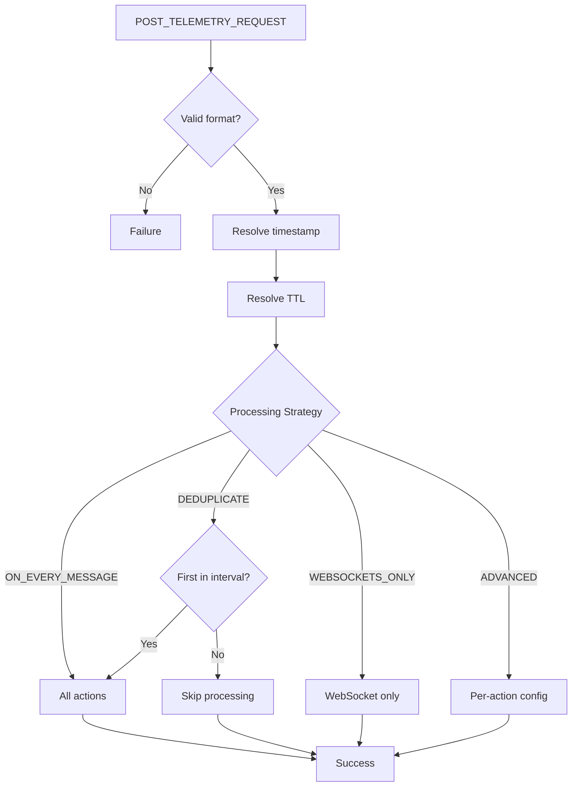
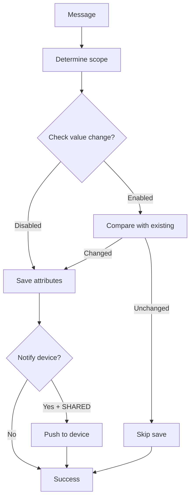
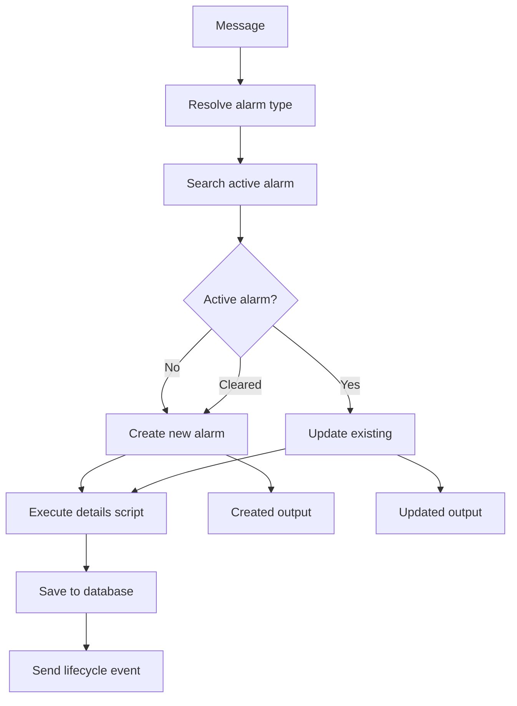
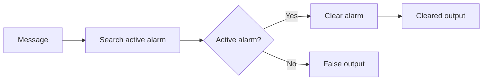
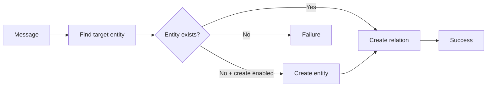
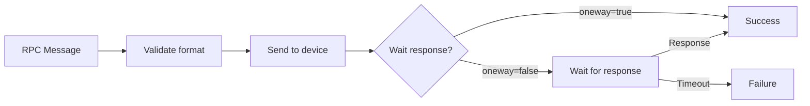
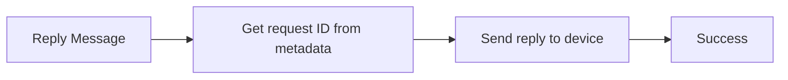
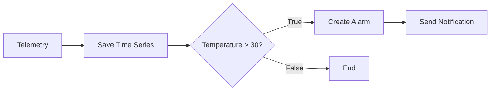
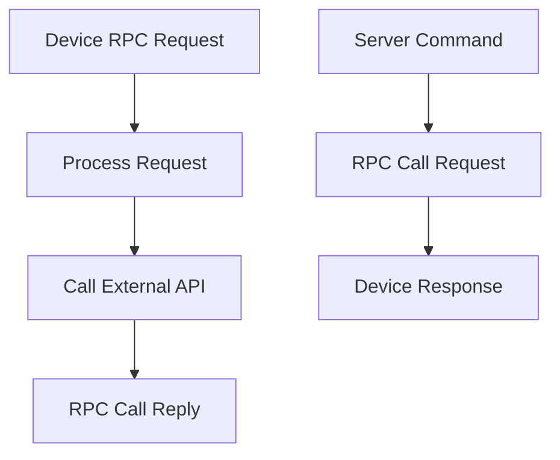
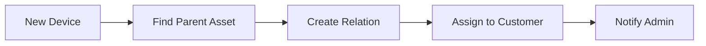

# Action Nodes Reference

## Overview

Action nodes perform operations that affect the platform state: saving telemetry and attributes, managing alarms, creating and deleting relations, sending RPC commands, and more. They are the "doers" of the rule engine, executing side effects based on incoming messages.

## Node Quick Reference

### Data Persistence

| Node | Class | Description |
|------|-------|-------------|
| Save Time Series | TbMsgTimeseriesNode | Save telemetry to database |
| Save Attributes | TbMsgAttributesNode | Save attributes to database |
| Delete Attributes | TbMsgDeleteAttributesNode | Remove attributes |
| Save to Custom Table | TbSaveToCustomCassandraTableNode | Custom Cassandra table |

### Alarm Management

| Node | Class | Description | Output Relations |
|------|-------|-------------|------------------|
| Create Alarm | TbCreateAlarmNode | Create/update alarm | Created, Updated, Failure |
| Clear Alarm | TbClearAlarmNode | Clear existing alarm | Cleared, False, Failure |
| GPS Geofencing Events | TbGpsGeofencingActionNode | Location-based alarms | Entered, Left, Inside, Outside |

### Entity Management

| Node | Class | Description |
|------|-------|-------------|
| Create Relation | TbCreateRelationNode | Create entity relation |
| Delete Relation | TbDeleteRelationNode | Delete entity relation |
| Assign to Customer | TbAssignToCustomerNode | Assign entity to customer |
| Unassign from Customer | TbUnassignFromCustomerNode | Remove customer assignment |
| Copy to Entity View | TbCopyAttributesToEntityViewNode | Copy to entity view |
| Add to Group | TbAddToEntityGroupNode | Add entity to group |
| Remove from Group | TbRemoveFromEntityGroupNode | Remove from group |
| Change Owner | TbChangeOriginatorOwnerNode | Change entity owner |

### RPC & Communication

| Node | Class | Description |
|------|-------|-------------|
| RPC Call Request | TbSendRPCRequestNode | Send RPC to device |
| RPC Call Reply | TbSendRPCReplyNode | Reply to device RPC |
| REST Call Reply | TbSendRestApiCallReplyNode | Reply to REST API |
| Integration Downlink | TbIntegrationDownlinkNode | Send to integration |

### Utilities

| Node | Class | Description |
|------|-------|-------------|
| Log | TbLogNode | Log to system log |
| Message Count | TbMsgCountNode | Count messages |
| Generator | TbMsgGeneratorNode | Generate test messages |
| Device State | TbDeviceStateNode | Trigger connectivity events |
| Math Function | TbMathNode | Mathematical operations |
| Delay | TbMsgDelayNode | Delay message (deprecated) |

### Edge Computing

| Node | Class | Description | Deployment |
|------|-------|-------------|------------|
| Push to Edge | TbMsgPushToEdgeNode | Route to edge | Cloud only |
| Push to Cloud | TbMsgPushToCloudNode | Route to cloud | Edge only |

---

## Save Time Series

Saves incoming message data as time series (telemetry) data for the message originator.

### Preconditions

- Message type must be `POST_TELEMETRY_REQUEST`
- Message data must be in one of three formats

### Data Formats

**Format 1: Simple key-value pairs**
```json
{
  "temperature": 25.5,
  "humidity": 60
}
```

**Format 2: Timestamped key-value pairs**
```json
{
  "ts": 1737963587742,
  "values": {
    "temperature": 25.5,
    "humidity": 60
  }
}
```

**Format 3: Multiple timestamped entries**
```json
[
  {"ts": 1737963587742, "values": {"temperature": 25.5}},
  {"ts": 1737963597742, "values": {"temperature": 26.0}}
]
```

### Configuration

| Field | Type | Description |
|-------|------|-------------|
| defaultTTL | integer | Time-to-live in seconds (0 = never expires) |
| useServerTs | boolean | Use server timestamp for data without explicit ts |
| processingSettings | object | Processing strategy configuration |

### Processing Strategies

| Strategy | Behavior |
|----------|----------|
| ON_EVERY_MESSAGE | Process all messages (default) |
| DEDUPLICATE | Process first message per interval |
| WEBSOCKETS_ONLY | Skip persistence, WebSocket only |
| ADVANCED | Configure each action independently |

### Advanced Processing Actions

| Action | Description |
|--------|-------------|
| timeseries | Save to ts_kv table |
| latest | Update ts_kv_latest table |
| webSockets | Notify WebSocket subscribers |
| calculatedFields | Trigger calculated fields |

### Timestamp Resolution (priority order)

1. Explicit `ts` in data (Format 2 or 3)
2. Server time (if `useServerTs` enabled)
3. `metadata.ts` property
4. Message creation timestamp

### TTL Resolution (priority order)

1. `metadata.TTL` from message
2. Node configuration `defaultTTL`
3. Tenant profile default TTL

### Processing Flow



### Example Configuration

```json
{
  "defaultTTL": 86400,
  "useServerTs": true,
  "processingSettings": {
    "type": "ON_EVERY_MESSAGE"
  }
}
```

### Example: Advanced with Deduplication

```json
{
  "defaultTTL": 604800,
  "useServerTs": false,
  "processingSettings": {
    "type": "ADVANCED",
    "timeseries": {
      "type": "DEDUPLICATE",
      "deduplicationIntervalSecs": 300
    },
    "latest": {
      "type": "ON_EVERY_MESSAGE"
    },
    "webSockets": {
      "type": "ON_EVERY_MESSAGE"
    },
    "calculatedFields": {
      "type": "SKIP"
    }
  }
}
```

---

## Save Attributes

Saves incoming message data as attributes for the message originator.

### Configuration

| Field | Type | Description |
|-------|------|-------------|
| scope | enum | CLIENT_SCOPE, SHARED_SCOPE, SERVER_SCOPE |
| notifyDevice | boolean | Push shared attributes to device |
| sendAttributesUpdatedNotification | boolean | Emit ATTRIBUTES_UPDATED event |
| updateAttributesOnlyOnValueChange | boolean | Skip save if values unchanged |
| processingSettings | object | Processing strategy |

### Attribute Scopes

| Scope | Description | Device Access |
|-------|-------------|---------------|
| CLIENT_SCOPE | Device-side attributes | Device writes, server reads |
| SHARED_SCOPE | Bidirectional attributes | Device reads, server writes |
| SERVER_SCOPE | Server-side only | Server only |

### Processing Flow



### Example Configuration

```json
{
  "scope": "SERVER_SCOPE",
  "notifyDevice": true,
  "sendAttributesUpdatedNotification": false,
  "updateAttributesOnlyOnValueChange": false,
  "processingSettings": {
    "type": "ON_EVERY_MESSAGE"
  }
}
```

---

## Create Alarm

Creates a new alarm or updates an existing active alarm for the message originator.

### Configuration

| Field | Type | Description |
|-------|------|-------------|
| alarmType | string | Alarm type (supports patterns) |
| severity | enum | CRITICAL, MAJOR, MINOR, WARNING, INDETERMINATE |
| dynamicSeverity | boolean | Resolve severity from pattern |
| severityPattern | string | Pattern for dynamic severity |
| propagate | boolean | Propagate to related entities |
| propagateToOwner | boolean | Propagate to entity owner |
| propagateToTenant | boolean | Propagate to tenant |
| propagateToOwnerHierarchy | boolean | Propagate up ownership chain |
| relationTypes | string[] | Relation types for propagation |
| useMessageAlarmData | boolean | Read alarm from message |
| overwriteAlarmDetails | boolean | Execute details script |
| scriptLang | enum | TBEL or JS |
| alarmDetailsBuildTbel | string | TBEL details script |
| alarmDetailsBuildJs | string | JS details script |

### Output Connections

| Connection | Condition | Metadata |
|------------|-----------|----------|
| Created | New alarm created | isNewAlarm: true |
| Updated | Existing alarm updated | isExistingAlarm: true |
| Failure | Error occurred | Error details |

### Processing Flow



### Details Script Variables

| Variable | Description |
|----------|-------------|
| msg | Message payload |
| metadata | Message metadata |
| msgType | Message type |
| metadata.prevAlarmDetails | Previous alarm details (JSON string, updates only) |

### Example Configuration

```json
{
  "alarmType": "High Temperature",
  "severity": "WARNING",
  "propagate": true,
  "propagateToOwner": false,
  "propagateToTenant": false,
  "scriptLang": "TBEL",
  "alarmDetailsBuildTbel": "return {\n  temperature: msg.temperature,\n  threshold: metadata.threshold\n};"
}
```

### Example: Dynamic Severity

```json
{
  "alarmType": "${alarmType}",
  "dynamicSeverity": true,
  "severityPattern": "${severity}",
  "propagate": true
}
```

---

## Clear Alarm

Clears an existing active alarm for the message originator.

### Configuration

| Field | Type | Description |
|-------|------|-------------|
| alarmType | string | Alarm type to clear (supports patterns) |
| scriptLang | enum | TBEL or JS |
| alarmDetailsBuildTbel | string | TBEL script for clearing details |
| alarmDetailsBuildJs | string | JS script for clearing details |

### Output Connections

| Connection | Condition |
|------------|-----------|
| Cleared | Alarm was cleared |
| False | No active alarm found |
| Failure | Error occurred |

### Processing Flow



---

## GPS Geofencing Events

Generates alarm events based on device location entering or leaving geofenced areas.

### Configuration

| Field | Type | Description |
|-------|------|-------------|
| latitudeKeyName | string | Latitude key in message |
| longitudeKeyName | string | Longitude key in message |
| perimeterType | enum | CIRCLE or POLYGON |
| centerLatitude | number | Circle center latitude |
| centerLongitude | number | Circle center longitude |
| range | number | Circle radius (meters) |
| polygonDefinition | string | GeoJSON polygon |

### Output Connections

| Connection | Condition |
|------------|-----------|
| Entered | Device entered geofence (was outside, now inside) |
| Left | Device left geofence (was inside, now outside) |
| Inside | Device is inside geofence |
| Outside | Device is outside geofence |

---

## Create Relation

Creates a relation between entities.

### Configuration

| Field | Type | Description |
|-------|------|-------------|
| direction | enum | FROM or TO |
| relationType | string | Relation type name |
| entityType | enum | Target entity type |
| entityNamePattern | string | Pattern to find target entity |
| createEntityIfNotExists | boolean | Create entity if not found |

### Processing Flow



---

## Delete Relation

Deletes a relation between entities.

### Configuration

| Field | Type | Description |
|-------|------|-------------|
| direction | enum | FROM or TO |
| relationType | string | Relation type name |
| entityType | enum | Target entity type |
| entityNamePattern | string | Pattern to find target entity |
| deleteForSingleEntity | boolean | Delete specific relation |

---

## RPC Call Request

Sends an RPC command to a device.

### Expected Message Format

```json
{
  "method": "setValue",
  "params": {"value": 42}
}
```

### Configuration

| Field | Type | Description |
|-------|------|-------------|
| timeout | integer | RPC timeout in seconds |

### Optional Metadata Fields

| Field | Description |
|-------|-------------|
| oneway | Fire-and-forget (no response expected) |
| persistent | Persist RPC until delivered |
| expirationTime | Message expiration timestamp |
| retries | Number of retry attempts |

### Processing Flow



---

## RPC Call Reply

Sends a reply to an RPC request from a device.

### Configuration

| Field | Type | Description |
|-------|------|-------------|
| requestIdMetaDataAttribute | string | Metadata key with request ID |

### Processing Flow



---

## Log

Logs message information to the system log.

### Configuration

| Field | Type | Description |
|-------|------|-------------|
| scriptLang | enum | TBEL or JS |
| jsScript | string | Script to format log message |
| tbelScript | string | TBEL script to format log message |

### Example Configuration

```json
{
  "scriptLang": "TBEL",
  "tbelScript": "return 'Device: ' + metadata.deviceName + ', Temperature: ' + msg.temperature;"
}
```

---

## Message Count

Periodically outputs a count of messages processed.

### Configuration

| Field | Type | Description |
|-------|------|-------------|
| interval | integer | Count interval in seconds |
| telemetryPrefix | string | Prefix for count telemetry key |

### Output Message

```json
{
  "messagesCount": 150
}
```

---

## Generator

Generates test messages at configurable intervals.

### Configuration

| Field | Type | Description |
|-------|------|-------------|
| originatorType | enum | Entity type for originator |
| originatorId | UUID | Specific originator entity |
| msgType | string | Generated message type |
| scriptLang | enum | TBEL or JS |
| jsScript | string | Script to generate message |
| tbelScript | string | TBEL script to generate message |
| periodInSeconds | integer | Generation interval |
| messageCount | integer | Number of messages (0 = infinite) |

---

## Math Function

Applies mathematical operations to message values.

### Supported Operations

| Operation | Description |
|-----------|-------------|
| ADD | Addition |
| SUB | Subtraction |
| MULT | Multiplication |
| DIV | Division |
| SIN | Sine |
| COS | Cosine |
| TAN | Tangent |
| ABS | Absolute value |
| SQRT | Square root |
| CEIL | Ceiling |
| FLOOR | Floor |
| ROUND | Round |
| EXP | Exponential |
| LOG | Natural logarithm |
| LOG10 | Base-10 logarithm |
| MIN | Minimum |
| MAX | Maximum |
| AVG | Average |
| SUM | Sum |
| COUNT | Count |

### Configuration

| Field | Type | Description |
|-------|------|-------------|
| operation | enum | Mathematical operation |
| arguments | object[] | Input arguments |
| result | object | Result configuration |

---

## Push to Edge

Routes messages from cloud to edge instances.

### Configuration

| Field | Type | Description |
|-------|------|-------------|
| scope | enum | Target edge scope |

### Deployment

This node is only available on **cloud** deployments. It sends messages to connected edge instances.

---

## Push to Cloud

Routes messages from edge to cloud.

### Deployment

This node is only available on **edge** deployments. It sends messages to the connected cloud instance.

---

## Common Patterns

### Save and Alert Pattern



### Bidirectional RPC Pattern



### Entity Relationship Pattern



## Best Practices

1. **Use appropriate TTL** - Set time-to-live based on data retention requirements
2. **Enable deduplication** - Reduce database load for high-frequency telemetry
3. **Propagate alarms wisely** - Only propagate when parent entities need visibility
4. **Handle RPC timeouts** - Always handle the Failure output for RPC nodes
5. **Log strategically** - Excessive logging impacts performance

## See Also

- [Filter Nodes](./filter-nodes.md) - Route messages conditionally
- [Enrichment Nodes](./enrichment-nodes.md) - Add data to messages
- [External Nodes](./external-nodes.md) - Integrate external systems
- [Node Categories](../node-categories.md) - All node categories
