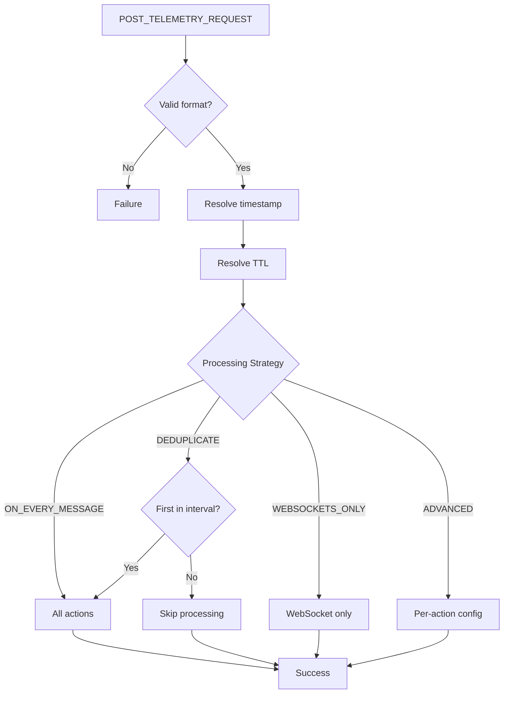
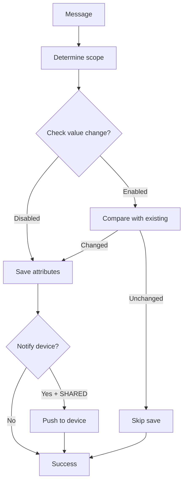
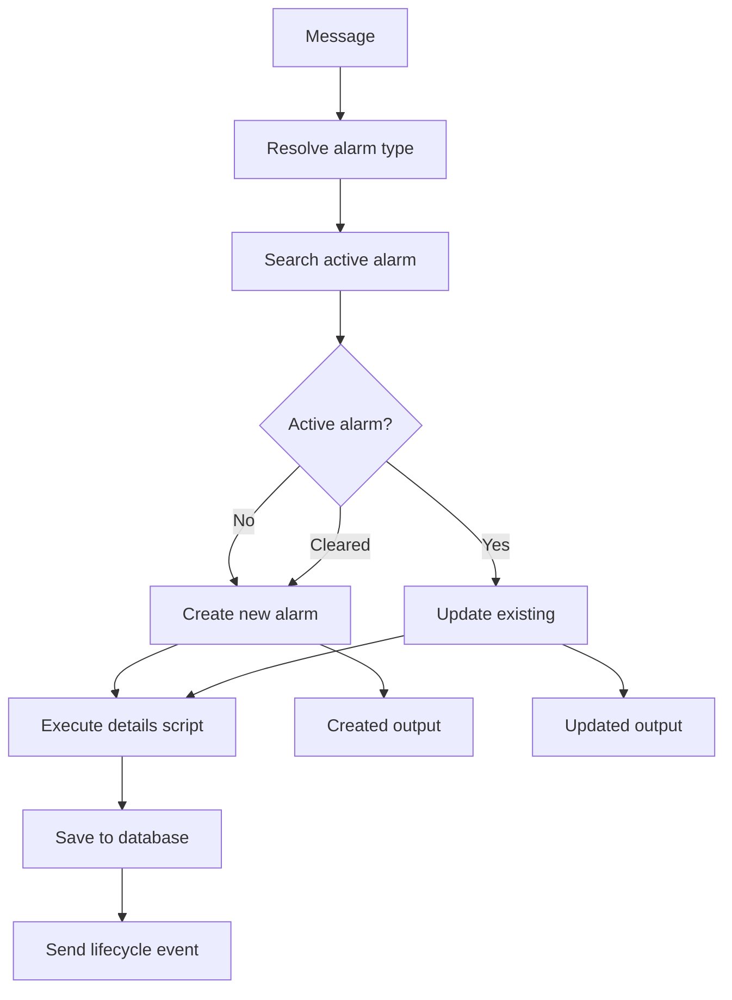
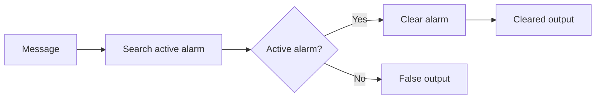
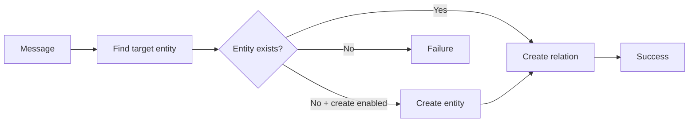
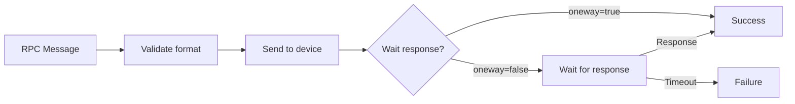
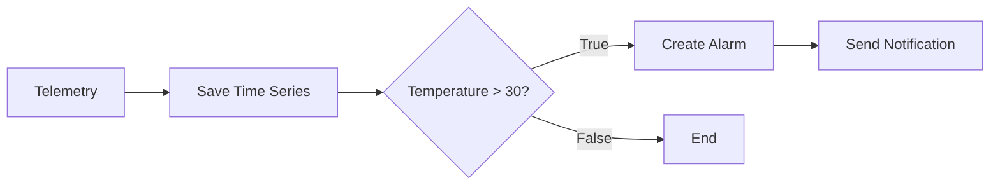
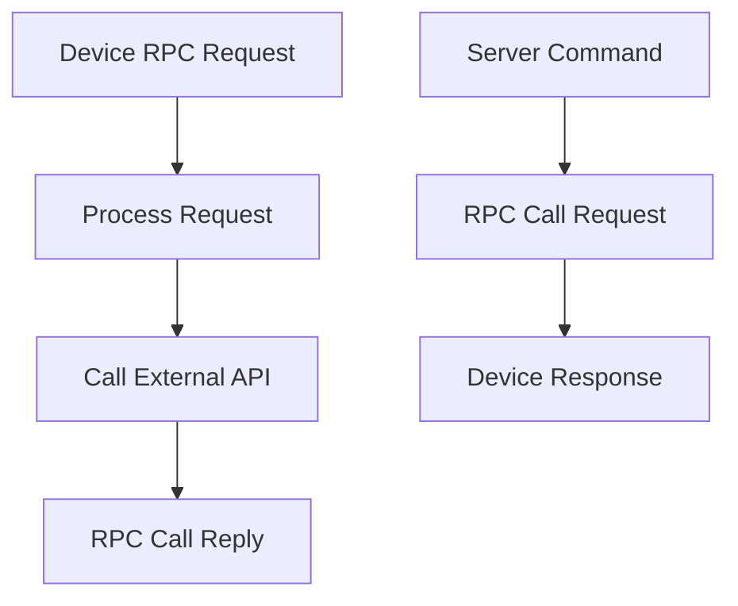

# Action Nodes Reference

## Overview

Action nodes perform operations that affect the platform state: saving telemetry and attributes, managing alarms, creating and deleting relations, sending RPC commands, and more. They are the "doers" of the rule engine, executing side effects based on incoming messages.

## Node Quick Reference

### Data Persistence

| Node | Class | Description |
|------|-------|-------------|
| Save Time Series | TbMsgTimeseriesNode | Save telemetry to database |
| Save Attributes | TbMsgAttributesNode | Save attributes to database |
| Delete Attributes | TbMsgDeleteAttributesNode | Remove attributes |
| Save to Custom Table | TbSaveToCustomCassandraTableNode | Custom Cassandra table |

### Alarm Management

| Node | Class | Description | Output Relations |
|------|-------|-------------|------------------|
| Create Alarm | TbCreateAlarmNode | Create/update alarm | Created, Updated, Failure |
| Clear Alarm | TbClearAlarmNode | Clear existing alarm | Cleared, False, Failure |
| GPS Geofencing Events | TbGpsGeofencingActionNode | Location-based alarms | Entered, Left, Inside, Outside |

### Entity Management

| Node | Class | Description |
|------|-------|-------------|
| Create Relation | TbCreateRelationNode | Create entity relation |
| Delete Relation | TbDeleteRelationNode | Delete entity relation |
| Assign to Customer | TbAssignToCustomerNode | Assign entity to customer |
| Unassign from Customer | TbUnassignFromCustomerNode | Remove customer assignment |
| Copy to Entity View | TbCopyAttributesToEntityViewNode | Copy to entity view |
| Add to Group | TbAddToEntityGroupNode | Add entity to group |
| Remove from Group | TbRemoveFromEntityGroupNode | Remove from group |
| Change Owner | TbChangeOriginatorOwnerNode | Change entity owner |

### RPC & Communication

| Node | Class | Description |
|------|-------|-------------|
| RPC Call Request | TbSendRPCRequestNode | Send RPC to device |
| RPC Call Reply | TbSendRPCReplyNode | Reply to device RPC |
| REST Call Reply | TbSendRestApiCallReplyNode | Reply to REST API |
| Integration Downlink | TbIntegrationDownlinkNode | Send to integration |

### Utilities

| Node | Class | Description |
|------|-------|-------------|
| Log | TbLogNode | Log to system log |
| Message Count | TbMsgCountNode | Count messages |
| Generator | TbMsgGeneratorNode | Generate test messages |
| Device State | TbDeviceStateNode | Trigger connectivity events |
| Math Function | TbMathNode | Mathematical operations |
| Delay | TbMsgDelayNode | Delay message (deprecated) |

### Edge Computing

| Node | Class | Description | Deployment |
|------|-------|-------------|------------|
| Push to Edge | TbMsgPushToEdgeNode | Route to edge | Cloud only |
| Push to Cloud | TbMsgPushToCloudNode | Route to cloud | Edge only |

---

## Save Time Series

Saves incoming message data as time series (telemetry) data for the message originator.

### When to Use

**Primary Use Cases:**
- **IoT telemetry ingestion** - Save sensor readings (temperature, humidity, pressure) from devices
- **Time-series analytics** - Store data for dashboards, alerts, and historical analysis
- **Device state tracking** - Record operational metrics (battery level, signal strength, connection status)
- **Event logging** - Persist timestamped events for audit trails

**Not Recommended For:**
- Configuration settings (use Save Attributes with SERVER_SCOPE instead)
- Static device information (use client/shared attributes)
- Rapidly changing values without business value (consider deduplication)
- Non-numeric data requiring full-text search (attributes are more suitable)

### Preconditions

- Message type must be `POST_TELEMETRY_REQUEST`
- Message data must be in one of three formats

### Data Formats

**Format 1: Simple key-value pairs**
```json
{
  "temperature": 25.5,
  "humidity": 60
}
```

**Format 2: Timestamped key-value pairs**
```json
{
  "ts": 1737963587742,
  "values": {
    "temperature": 25.5,
    "humidity": 60
  }
}
```

**Format 3: Multiple timestamped entries**
```json
[
  {"ts": 1737963587742, "values": {"temperature": 25.5}},
  {"ts": 1737963597742, "values": {"temperature": 26.0}}
]
```

### Configuration

| Field | Type | Description |
|-------|------|-------------|
| defaultTTL | integer | Time-to-live in seconds (0 = never expires) |
| useServerTs | boolean | Use server timestamp for data without explicit ts |
| processingSettings | object | Processing strategy configuration |

### Processing Strategies

| Strategy | Behavior |
|----------|----------|
| ON_EVERY_MESSAGE | Process all messages (default) |
| DEDUPLICATE | Process first message per interval |
| WEBSOCKETS_ONLY | Skip persistence, WebSocket only |
| ADVANCED | Configure each action independently |

### Advanced Processing Actions

| Action | Description |
|--------|-------------|
| timeseries | Save to ts_kv table |
| latest | Update ts_kv_latest table |
| webSockets | Notify WebSocket subscribers |
| calculatedFields | Trigger calculated fields |

### Timestamp Resolution (priority order)

1. Explicit `ts` in data (Format 2 or 3)
2. Server time (if `useServerTs` enabled)
3. `metadata.ts` property
4. Message creation timestamp

### TTL Resolution (priority order)

1. `metadata.TTL` from message
2. Node configuration `defaultTTL`
3. Tenant profile default TTL

### Processing Flow



### Example Configuration

```json
{
  "defaultTTL": 86400,
  "useServerTs": true,
  "processingSettings": {
    "type": "ON_EVERY_MESSAGE"
  }
}
```

### Example: Advanced with Deduplication

```json
{
  "defaultTTL": 604800,
  "useServerTs": false,
  "processingSettings": {
    "type": "ADVANCED",
    "timeseries": {
      "type": "DEDUPLICATE",
      "deduplicationIntervalSecs": 300
    },
    "latest": {
      "type": "ON_EVERY_MESSAGE"
    },
    "webSockets": {
      "type": "ON_EVERY_MESSAGE"
    },
    "calculatedFields": {
      "type": "SKIP"
    }
  }
}
```

### Complete Example: IoT Sensor Data Pipeline

**Use Case**: Industrial temperature sensor reporting every 5 seconds, save to database for dashboard display and historical analysis.

**Input Message** (from device):
```json
{
  "type": "POST_TELEMETRY_REQUEST",
  "originator": {
    "entityType": "DEVICE",
    "id": "d1b9e3a0-b5e2-11ee-8c90-0242ac120002"
  },
  "metadata": {
    "deviceName": "TempSensor-Floor1-A",
    "deviceType": "temperature-sensor",
    "ts": "1737963587742"
  },
  "data": {
    "temperature": 25.5,
    "humidity": 60,
    "battery": 87
  }
}
```

**Node Configuration**:
```json
{
  "defaultTTL": 2592000,
  "useServerTs": false,
  "processingSettings": {
    "type": "ON_EVERY_MESSAGE"
  }
}
```

**Output**: Message routes to **Success** relation. Data is persisted to database with timestamp 1737963587742.

**Result in Database** (queryable via REST API or Dashboard):
```
Key: temperature | Value: 25.5 | Timestamp: 2026-01-14 12:13:07.742
Key: humidity    | Value: 60   | Timestamp: 2026-01-14 12:13:07.742
Key: battery     | Value: 87   | Timestamp: 2026-01-14 12:13:07.742
```

**Why This Works**: The message type is POST_TELEMETRY_REQUEST, data format is valid key-value pairs, and timestamp is explicitly provided in metadata ensuring correct time ordering.

### Configuration Tips

| Scenario | Recommended Configuration | Rationale |
|----------|---------------------------|-----------|
| High-frequency data (< 5 sec) | DEDUPLICATE with 60-300 sec interval | Reduces database load while preserving trends |
| Low-frequency data (> 1 min) | ON_EVERY_MESSAGE | Don't miss any data points |
| Real-time dashboard only | WEBSOCKETS_ONLY | Skip persistence for transient data |
| Data with device timestamp | useServerTs: false | Preserve device-reported time |
| Data without timestamp | useServerTs: true | Server time more reliable than message creation time |
| Long-term storage | TTL: 0 or 31536000 (1 year) | Balance retention needs with storage costs |
| Short-term metrics | TTL: 86400-604800 (1-7 days) | Automatic cleanup of temporary data |

### Performance Considerations

| Practice | Impact | Recommendation |
|----------|--------|----------------|
| High cardinality keys | Increased storage, slower queries | Limit to 50-100 telemetry keys per device |
| Nested JSON in values | Parsing overhead | Flatten to top-level keys when possible |
| String values in telemetry | Cannot aggregate numerically | Use attributes for non-numeric data |
| Batch vs single messages | Network efficiency | Prefer Format 3 (array) for batching |
| Deduplication | 50-70% write reduction | Enable for high-frequency sensors |

---

## Save Attributes

Saves incoming message data as attributes for the message originator.

### Configuration

| Field | Type | Description |
|-------|------|-------------|
| scope | enum | CLIENT_SCOPE, SHARED_SCOPE, SERVER_SCOPE |
| notifyDevice | boolean | Push shared attributes to device |
| sendAttributesUpdatedNotification | boolean | Emit ATTRIBUTES_UPDATED event |
| updateAttributesOnlyOnValueChange | boolean | Skip save if values unchanged |
| processingSettings | object | Processing strategy |

### Attribute Scopes

| Scope | Description | Device Access |
|-------|-------------|---------------|
| CLIENT_SCOPE | Device-side attributes | Device writes, server reads |
| SHARED_SCOPE | Bidirectional attributes | Device reads, server writes |
| SERVER_SCOPE | Server-side only | Server only |

### Processing Flow



### Example Configuration

```json
{
  "scope": "SERVER_SCOPE",
  "notifyDevice": true,
  "sendAttributesUpdatedNotification": false,
  "updateAttributesOnlyOnValueChange": false,
  "processingSettings": {
    "type": "ON_EVERY_MESSAGE"
  }
}
```

---

## Create Alarm

Creates a new alarm or updates an existing active alarm for the message originator.

### When to Use

**Primary Use Cases:**
- **Threshold violations** - Alert when sensor values exceed safe operating ranges
- **Device connectivity issues** - Alarm on device disconnection or irregular heartbeats
- **Business rule violations** - Alert on SLA breaches, quota exceeded, unauthorized access
- **Predictive maintenance** - Raise alarms based on calculated health scores or wear indicators
- **Multi-level escalation** - Use dynamic severity to escalate based on violation duration or magnitude

**Not Recommended For:**
- Transient conditions (< 1 minute duration) - Use attributes or temporary flags instead
- Informational events without action required - Use Log node or notifications
- Every threshold exceedance - Add hysteresis or debouncing with filters first
- High-frequency events - Alarms persist until cleared; use counters for frequent events

### Configuration

| Field | Type | Description |
|-------|------|-------------|
| alarmType | string | Alarm type (supports patterns) |
| severity | enum | CRITICAL, MAJOR, MINOR, WARNING, INDETERMINATE |
| dynamicSeverity | boolean | Resolve severity from pattern |
| severityPattern | string | Pattern for dynamic severity |
| propagate | boolean | Propagate to related entities |
| propagateToOwner | boolean | Propagate to entity owner |
| propagateToTenant | boolean | Propagate to tenant |
| propagateToOwnerHierarchy | boolean | Propagate up ownership chain |
| relationTypes | string[] | Relation types for propagation |
| useMessageAlarmData | boolean | Read alarm from message |
| overwriteAlarmDetails | boolean | Execute details script |
| scriptLang | enum | TBEL or JS |
| alarmDetailsBuildTbel | string | TBEL details script |
| alarmDetailsBuildJs | string | JS details script |

### Output Connections

| Connection | Condition | Metadata |
|------------|-----------|----------|
| Created | New alarm created | isNewAlarm: true |
| Updated | Existing alarm updated | isExistingAlarm: true |
| Failure | Error occurred | Error details |

### Processing Flow



### Details Script Variables

| Variable | Description |
|----------|-------------|
| msg | Message payload |
| metadata | Message metadata |
| msgType | Message type |
| metadata.prevAlarmDetails | Previous alarm details (JSON string, updates only) |

### Example Configuration

```json
{
  "alarmType": "High Temperature",
  "severity": "WARNING",
  "propagate": true,
  "propagateToOwner": false,
  "propagateToTenant": false,
  "scriptLang": "TBEL",
  "alarmDetailsBuildTbel": "return {\n  temperature: msg.temperature,\n  threshold: metadata.threshold\n};"
}
```

### Example: Dynamic Severity

```json
{
  "alarmType": "${alarmType}",
  "dynamicSeverity": true,
  "severityPattern": "${severity}",
  "propagate": true
}
```

### Complete Example: Temperature Threshold Alarm

**Use Case**: Create alarm when industrial furnace temperature exceeds 800°C, with contextual details for operator response.

**Input Message** (after filter determines temp > 800):
```json
{
  "type": "POST_TELEMETRY_REQUEST",
  "originator": {
    "entityType": "DEVICE",
    "id": "furnace-12"
  },
  "metadata": {
    "deviceName": "Furnace-Line-A-12",
    "location": "Building 3, Floor 2",
    "ts": "1737963587742"
  },
  "data": {
    "temperature": 835,
    "pressure": 2.1,
    "lastMaintenance": "2026-01-10"
  }
}
```

**Node Configuration**:
```json
{
  "alarmType": "High Temperature",
  "severity": "WARNING",
  "propagate": false,
  "scriptLang": "TBEL",
  "alarmDetailsBuildTbel": "return {\n  currentTemp: msg.temperature,\n  threshold: 800,\n  location: metadata.location,\n  exceedBy: msg.temperature - 800,\n  deviceName: metadata.deviceName\n};"
}
```

**Output**: Message routes to **Created** (first occurrence) or **Updated** (subsequent while active).

**Created Alarm Entity**:
```json
{
  "id": "alarm-uuid",
  "type": "High Temperature",
  "severity": "WARNING",
  "status": "ACTIVE_UNACK",
  "originatorId": "furnace-12",
  "details": {
    "currentTemp": 835,
    "threshold": 800,
    "location": "Building 3, Floor 2",
    "exceedBy": 35,
    "deviceName": "Furnace-Line-A-12"
  },
  "startTs": 1737963587742
}
```

**Why This Works**: The alarm details script enriches the alarm with contextual data, making it immediately actionable for operators without additional lookups.

### Complete Example: Escalating Severity

**Use Case**: Start with WARNING at 800°C, escalate to CRITICAL at 850°C using dynamic severity.

**Input Message** (from script transform calculating severity):
```json
{
  "type": "POST_TELEMETRY_REQUEST",
  "originator": {
    "entityType": "DEVICE",
    "id": "furnace-12"
  },
  "metadata": {
    "deviceName": "Furnace-Line-A-12",
    "alarmSeverity": "CRITICAL",
    "ts": "1737963647742"
  },
  "data": {
    "temperature": 865,
    "duration": 60
  }
}
```

**Node Configuration**:
```json
{
  "alarmType": "High Temperature",
  "dynamicSeverity": true,
  "severityPattern": "${alarmSeverity}",
  "propagateToOwner": true,
  "scriptLang": "TBEL",
  "alarmDetailsBuildTbel": "var existing = metadata.prevAlarmDetails ? JSON.parse(metadata.prevAlarmDetails) : {};\nreturn {\n  currentTemp: msg.temperature,\n  peakTemp: existing.peakTemp ? Math.max(existing.peakTemp, msg.temperature) : msg.temperature,\n  duration: msg.duration,\n  escalated: true\n};"
}
```

**Output**: Routes to **Updated** relation (existing alarm escalated).

**Updated Alarm**:
- Severity changed: WARNING → CRITICAL
- Status: ACTIVE_UNACK (remains unacknowledged)
- Details: Preserved peak temp from previous details, added escalation flag

**Why This Works**: Dynamic severity allows a single alarm to escalate as conditions worsen. The details script preserves historical context (peak temp) while adding new information.

### Configuration Tips

| Scenario | Recommended Configuration | Rationale |
|----------|---------------------------|-----------|
| First occurrence matters | Use Created output for notifications | Avoid notification spam on updates |
| Every update needs attention | Use both Created and Updated outputs | Ensure all changes are communicated |
| Parent visibility required | propagateToOwner: true | Asset/customer sees device alarms |
| Tenant-wide critical alarms | propagateToTenant: true | Dashboard shows all critical alarms |
| Multi-level escalation | Dynamic severity with pattern | Single alarm escalates through levels |
| Stable alarm identity | Static alarmType (no patterns) | Same alarm updated across occurrences |
| Contextual alarm types | alarmType pattern: "${deviceType} Failure" | Device-specific alarm types |
| Historical context needed | Preserve prevAlarmDetails in script | Track alarm evolution over time |

### Alarm Lifecycle Best Practices

| Practice | Impact | Recommendation |
|----------|--------|----------------|
| No clear logic | Alarms accumulate indefinitely | Always pair Create Alarm with Clear Alarm node |
| Alarm type typo | Separate alarms instead of updates | Use constants or patterns for consistency |
| Complex details script | Increased alarm creation latency | Keep scripts simple; pre-compute in transform |
| Propagation to non-existent relation | Silent failure | Validate relations exist before enabling propagation |
| High-frequency alarm updates | Database load, notification storms | Add debouncing with filters or rate limiters |

---

## Clear Alarm

Clears an existing active alarm for the message originator.

### Configuration

| Field | Type | Description |
|-------|------|-------------|
| alarmType | string | Alarm type to clear (supports patterns) |
| scriptLang | enum | TBEL or JS |
| alarmDetailsBuildTbel | string | TBEL script for clearing details |
| alarmDetailsBuildJs | string | JS script for clearing details |

### Output Connections

| Connection | Condition |
|------------|-----------|
| Cleared | Alarm was cleared |
| False | No active alarm found |
| Failure | Error occurred |

### Processing Flow



---

## GPS Geofencing Events

Generates alarm events based on device location entering or leaving geofenced areas.

### Configuration

| Field | Type | Description |
|-------|------|-------------|
| latitudeKeyName | string | Latitude key in message |
| longitudeKeyName | string | Longitude key in message |
| perimeterType | enum | CIRCLE or POLYGON |
| centerLatitude | number | Circle center latitude |
| centerLongitude | number | Circle center longitude |
| range | number | Circle radius (meters) |
| polygonDefinition | string | GeoJSON polygon |

### Output Connections

| Connection | Condition |
|------------|-----------|
| Entered | Device entered geofence (was outside, now inside) |
| Left | Device left geofence (was inside, now outside) |
| Inside | Device is inside geofence |
| Outside | Device is outside geofence |

---

## Create Relation

Creates a relation between entities.

### Configuration

| Field | Type | Description |
|-------|------|-------------|
| direction | enum | FROM or TO |
| relationType | string | Relation type name |
| entityType | enum | Target entity type |
| entityNamePattern | string | Pattern to find target entity |
| createEntityIfNotExists | boolean | Create entity if not found |

### Processing Flow



---

## Delete Relation

Deletes a relation between entities.

### Configuration

| Field | Type | Description |
|-------|------|-------------|
| direction | enum | FROM or TO |
| relationType | string | Relation type name |
| entityType | enum | Target entity type |
| entityNamePattern | string | Pattern to find target entity |
| deleteForSingleEntity | boolean | Delete specific relation |

---

## RPC Call Request

Sends an RPC command to a device.

### When to Use

**Primary Use Cases:**
- **Device control** - Send commands to actuators (turn on/off, set parameters, trigger actions)
- **Configuration updates** - Push new settings to devices remotely
- **Firmware operations** - Trigger OTA updates, device reboots, diagnostics
- **Bidirectional workflows** - Request data on-demand rather than periodic polling
- **Emergency responses** - Immediate action on critical conditions (shutdown, safe mode)

**Not Recommended For:**
- Broadcasting to many devices simultaneously (use Device Profile RPC instead)
- Real-time control with < 100ms latency requirements (consider direct MQTT pub/sub)
- Large data transfers (> 8KB payload) - use file transfer mechanisms instead
- Devices that are frequently offline (consider queuing with Integration Downlink)

### Expected Message Format

```json
{
  "method": "setValue",
  "params": {"value": 42}
}
```

### Configuration

| Field | Type | Description |
|-------|------|-------------|
| timeout | integer | RPC timeout in seconds |

### Optional Metadata Fields

| Field | Description |
|-------|-------------|
| oneway | Fire-and-forget (no response expected) |
| persistent | Persist RPC until delivered |
| expirationTime | Message expiration timestamp |
| retries | Number of retry attempts |

### Processing Flow



### Complete Example: Two-Way RPC (Synchronous)

**Use Case**: Send command to smart thermostat to set target temperature and wait for confirmation.

**Input Message** (from dashboard or external trigger):
```json
{
  "type": "POST_ATTRIBUTES_REQUEST",
  "originator": {
    "entityType": "DEVICE",
    "id": "thermostat-42"
  },
  "metadata": {
    "deviceName": "Thermostat-Office-3A",
    "userId": "admin-user-id"
  },
  "data": {
    "method": "setTargetTemperature",
    "params": {
      "temperature": 22,
      "mode": "heat"
    }
  }
}
```

**Node Configuration**:
```json
{
  "timeout": 10
}
```

**Device Response** (received within timeout):
```json
{
  "success": true,
  "currentTemp": 19,
  "targetTemp": 22,
  "heatingActive": true
}
```

**Output**: Message routes to **Success** relation with device response in message data.

**Output Message**:
```json
{
  "type": "RPC_CALL_FROM_SERVER_TO_DEVICE",
  "originator": {
    "entityType": "DEVICE",
    "id": "thermostat-42"
  },
  "metadata": {
    "deviceName": "Thermostat-Office-3A",
    "requestId": "rpc-uuid-12345",
    "userId": "admin-user-id"
  },
  "data": {
    "success": true,
    "currentTemp": 19,
    "targetTemp": 22,
    "heatingActive": true
  }
}
```

**Why This Works**: The device responded within the 10-second timeout, so the Success relation receives the response payload for further processing (e.g., save as attribute, notify user).

### Complete Example: One-Way RPC (Fire-and-Forget)

**Use Case**: Trigger device reboot immediately without waiting for response (device will reconnect after reboot).

**Input Message**:
```json
{
  "type": "POST_ATTRIBUTES_REQUEST",
  "originator": {
    "entityType": "DEVICE",
    "id": "gateway-15"
  },
  "metadata": {
    "deviceName": "Gateway-Building-B",
    "oneway": "true"
  },
  "data": {
    "method": "reboot",
    "params": {}
  }
}
```

**Node Configuration**:
```json
{
  "timeout": 5
}
```

**Output**: Message routes immediately to **Success** relation (does not wait for response).

**Output Message** (same as input):
```json
{
  "type": "POST_ATTRIBUTES_REQUEST",
  "originator": {
    "entityType": "DEVICE",
    "id": "gateway-15"
  },
  "metadata": {
    "deviceName": "Gateway-Building-B",
    "oneway": "true",
    "requestId": "rpc-uuid-67890"
  },
  "data": {
    "method": "reboot",
    "params": {}
  }
}
```

**Why This Works**: The `oneway` metadata flag tells RPC node to not wait for a response. Command is sent to device and message proceeds immediately, allowing rule chain to continue (e.g., log the reboot request, notify admin).

### Complete Example: Persistent RPC (Offline Device)

**Use Case**: Send configuration update to device that is currently offline; deliver when it reconnects.

**Input Message**:
```json
{
  "type": "POST_ATTRIBUTES_REQUEST",
  "originator": {
    "entityType": "DEVICE",
    "id": "sensor-remote-87"
  },
  "metadata": {
    "deviceName": "Remote-Sensor-Field-87",
    "persistent": "true",
    "expirationTime": "1738050000000"
  },
  "data": {
    "method": "updateConfig",
    "params": {
      "reportingInterval": 600,
      "samplingRate": 10
    }
  }
}
```

**Node Configuration**:
```json
{
  "timeout": 5
}
```

**Device Status**: Currently offline (last seen 2 hours ago).

**Output**: Message routes to **Failure** relation (device offline, timeout exceeded).

**Behavior**: RPC is queued in database with expiration time of 2026-01-14 23:59:59. When device reconnects, it will receive the pending RPC command automatically. If device doesn't connect before expiration, RPC is discarded.

**Why This Works**: The `persistent` flag and `expirationTime` ensure critical configuration changes reach the device even if it's temporarily offline, with automatic expiration to prevent stale commands.

### Configuration Tips

| Scenario | Recommended Configuration | Rationale |
|----------|---------------------------|-----------|
| Online device control | timeout: 5-15 seconds | Balance responsiveness with transient network issues |
| Firmware update triggers | oneway: true, persistent: true | Don't wait for completion, ensure delivery |
| Interactive commands | timeout: 3-5 seconds | Quick feedback for user actions |
| Batch operations | oneway: true | Avoid waiting for hundreds of responses |
| Critical commands (offline devices) | persistent: true, expiration: 24-48 hours | Ensure delivery within reasonable time window |
| Diagnostic requests | timeout: 30-60 seconds | Allow time for device processing |
| Emergency shutdowns | oneway: true, retries: 3 | Send multiple times to ensure delivery |

### Metadata Fields Reference

| Field | Type | Effect |
|-------|------|--------|
| oneway | boolean | Skip waiting for response (fire-and-forget) |
| persistent | boolean | Queue RPC until delivered (survives device disconnect) |
| expirationTime | long | Unix timestamp when persistent RPC expires |
| retries | int | Number of retry attempts on failure |
| requestId | string | Unique request identifier (auto-generated if not provided) |

### Performance Considerations

| Practice | Impact | Recommendation |
|----------|--------|----------------|
| Low timeout (< 3 sec) | False timeouts on slow networks | Use 5+ seconds for production |
| High timeout (> 60 sec) | Blocked rule chain, resource usage | Use oneway for long operations |
| Many concurrent RPCs | Thread pool exhaustion | Batch operations, use dedicated queue |
| Persistent RPCs without expiration | Database bloat | Always set expiration time |
| Synchronous RPC in high-volume chain | Latency bottleneck | Use oneway or separate chain |

---

## RPC Call Reply

Sends a reply to an RPC request from a device.

### Configuration

| Field | Type | Description |
|-------|------|-------------|
| requestIdMetaDataAttribute | string | Metadata key with request ID |

### Processing Flow


---

## Log

Logs message information to the system log.

### Configuration

| Field | Type | Description |
|-------|------|-------------|
| scriptLang | enum | TBEL or JS |
| jsScript | string | Script to format log message |
| tbelScript | string | TBEL script to format log message |

### Example Configuration

```json
{
  "scriptLang": "TBEL",
  "tbelScript": "return 'Device: ' + metadata.deviceName + ', Temperature: ' + msg.temperature;"
}
```

---

## Message Count

Periodically outputs a count of messages processed.

### Configuration

| Field | Type | Description |
|-------|------|-------------|
| interval | integer | Count interval in seconds |
| telemetryPrefix | string | Prefix for count telemetry key |

### Output Message

```json
{
  "messagesCount": 150
}
```

---

## Generator

Generates test messages at configurable intervals.

### Configuration

| Field | Type | Description |
|-------|------|-------------|
| originatorType | enum | Entity type for originator |
| originatorId | UUID | Specific originator entity |
| msgType | string | Generated message type |
| scriptLang | enum | TBEL or JS |
| jsScript | string | Script to generate message |
| tbelScript | string | TBEL script to generate message |
| periodInSeconds | integer | Generation interval |
| messageCount | integer | Number of messages (0 = infinite) |

---

## Math Function

Applies mathematical operations to message values.

### Supported Operations

| Operation | Description |
|-----------|-------------|
| ADD | Addition |
| SUB | Subtraction |
| MULT | Multiplication |
| DIV | Division |
| SIN | Sine |
| COS | Cosine |
| TAN | Tangent |
| ABS | Absolute value |
| SQRT | Square root |
| CEIL | Ceiling |
| FLOOR | Floor |
| ROUND | Round |
| EXP | Exponential |
| LOG | Natural logarithm |
| LOG10 | Base-10 logarithm |
| MIN | Minimum |
| MAX | Maximum |
| AVG | Average |
| SUM | Sum |
| COUNT | Count |

### Configuration

| Field | Type | Description |
|-------|------|-------------|
| operation | enum | Mathematical operation |
| arguments | object[] | Input arguments |
| result | object | Result configuration |

---

## Push to Edge

Routes messages from cloud to edge instances.

### Configuration

| Field | Type | Description |
|-------|------|-------------|
| scope | enum | Target edge scope |

### Deployment

This node is only available on **cloud** deployments. It sends messages to connected edge instances.

---

## Push to Cloud

Routes messages from edge to cloud.

### Deployment

This node is only available on **edge** deployments. It sends messages to the connected cloud instance.

---

## Common Patterns

### Save and Alert Pattern



### Bidirectional RPC Pattern



### Entity Relationship Pattern


## Common Pitfalls

### Save Telemetry

| Pitfall | Impact | Solution |
|---------|--------|----------|
| Wrong message type | Data not saved; message routes to Failure | Ensure message type is POST_TELEMETRY_REQUEST |
| Deduplication enabled unknowingly | Missing data points in time-series | Check `timeseriesProcessingSettings`; use ON_EVERY_MESSAGE for all data |
| WEBSOCKETS_ONLY mode | No historical data persisted | Use ON_EVERY_MESSAGE to persist to database |
| TTL too short | Data expires prematurely | Set `defaultTTL` appropriate for query patterns (0 = never expire) |
| Invalid JSON payload | Parsing errors route to Failure | Validate JSON structure before Save Telemetry node |

### Save Attributes

| Pitfall | Impact | Solution |
|---------|--------|----------|
| Wrong scope selection | Attributes not visible to expected consumers | Use SHARED for device-to-server, CLIENT for server-to-device |
| Overwriting critical attributes | Loss of important configuration | Use specific attribute keys; avoid generic names |
| No error handling | Failed saves go unnoticed | Connect Failure relation to error handler |

### Create Alarm

| Pitfall | Impact | Solution |
|---------|--------|----------|
| Alarm type pattern error | Cannot find/update existing alarms | Test pattern with metadata substitution; ensure consistent naming |
| No clear alarm logic | Alarms accumulate forever | Add Clear Alarm node in rule chain for resolution conditions |
| Propagation without relation | Propagate fails silently | Verify relations exist before enabling `propagateToOwner`/`propagateToTenant` |
| Dynamic severity script error | Alarm created with wrong severity | Test script in Script Transform node first; handle null values |
| Overwriting alarm details | Lost alarm context on updates | Set `overwriteAlarmDetails` to false to preserve original details |

### Clear Alarm

| Pitfall | Impact | Solution |
|---------|--------|----------|
| Alarm type mismatch | Alarm not cleared | Use same alarm type pattern as Create Alarm node |
| Clearing non-existent alarm | Unnecessary processing | Use Check Alarm Status filter before Clear Alarm |
| Missing originator | Cannot identify which alarm to clear | Ensure originator is correct entity (not changed upstream) |

### RPC Call Request

| Pitfall | Impact | Solution |
|---------|--------|----------|
| No timeout configured | Waiting indefinitely for offline devices | Set reasonable `timeoutInSeconds` (5-30 seconds typical) |
| Persistent RPC for offline device | Queue fills with old commands | Set expiration time in configuration; monitor RPC queue depth |
| Missing response handler | Cannot process device reply | Add message type handler for RPC_CALL_FROM_SERVER_TO_DEVICE |
| Oneway with response expected | No response will arrive | Use persistent=false only for commands not needing confirmation |

### RPC Call Reply

| Pitfall | Impact | Solution |
|---------|--------|----------|
| Reply without original request | No context for reply | Ensure reply is in response to RPC request message |
| Wrong request ID | Reply doesn't reach original caller | Preserve `requestId` in metadata |
| Timeout before reply | Original request already failed | Process replies quickly; check timeout settings |

### Log Node

| Pitfall | Impact | Solution |
|---------|--------|----------|
| Excessive logging in production | Performance degradation, log bloat | Use INFO/WARN/ERROR levels; avoid DEBUG in production chains |
| Logging sensitive data | Security/compliance issues | Sanitize messages before logging; avoid PII in log output |
| Complex script in log node | Processing delay | Keep log scripts simple; move complex logic to transform nodes |

### Generator Node

| Pitfall | Impact | Solution |
|---------|--------|----------|
| High frequency generation | Resource exhaustion | Set appropriate `msgCount` and `periodInSeconds`; monitor system load |
| No message limit | Infinite message generation | Always set finite `msgCount` unless intended for continuous operation |
| Generator in wrong queue | Impacts critical message processing | Assign generator chains to dedicated queues |

### Delay Node

| Pitfall | Impact | Solution |
|---------|--------|----------|
| Long delays in main queue | Blocks other message processing | Use separate queue for delayed messages |
| Delay with state-dependent logic | State may change during delay | Validate state after delay; don't assume continuity |
| Excessive delayed messages | Memory pressure | Limit concurrent delayed messages; use reasonable delay periods |

### Entity Management Nodes

**Assign to Customer / Unassign from Customer:**

| Pitfall | Impact | Solution |
|---------|--------|----------|
| Customer doesn't exist | Assignment fails | Use Check Relation or enrichment node to verify customer exists |
| Wrong entity type | Cannot assign | Verify entity type supports customer assignment (devices, assets) |
| Unassigning without checking | Errors if not assigned | Check current customer before unassigning |

**Create Relation / Delete Relation:**

| Pitfall | Impact | Solution |
|---------|--------|----------|
| Relation type typo | Creates unwanted relation types | Use constants: "Contains", "Manages", etc. (case-sensitive) |
| Circular relations | Graph traversal issues | Validate relation doesn't create cycle if using traversal |
| Deleting non-existent relation | Unnecessary processing | Use Check Relation filter before Delete Relation |

**Add to Group / Remove from Group:**

| Pitfall | Impact | Solution |
|---------|--------|----------|
| Group pattern doesn't match | Entity not added | Test group name pattern with metadata variables |
| Creating many groups | Management overhead | Use existing groups; avoid creating groups per message |
| Entity type mismatch | Cannot add to group | Ensure entity type matches group type (device group for devices) |

### Integration and Edge Nodes

**Push to Edge / Push to Cloud:**

| Pitfall | Impact | Solution |
|---------|--------|----------|
| Edge not connected | Messages queued indefinitely | Check edge connection status; handle disconnected state |
| Large message payload | Sync delays | Limit message size for edge communication; batch when possible |
| No error handling | Failed pushes unnoticed | Connect Failure relation to alert or retry logic |

### Copy to View

| Pitfall | Impact | Solution |
|---------|--------|----------|
| View doesn't exist | Copy fails silently | Verify entity view exists before copying |
| Wrong attribute scope | Attributes not copied | Ensure source and target scopes match |
| High-frequency copying | Database load | Use appropriate processing strategy; consider deduplication |

## Best Practices

1. **Use appropriate TTL** - Set time-to-live based on data retention requirements
2. **Enable deduplication** - Reduce database load for high-frequency telemetry
3. **Propagate alarms wisely** - Only propagate when parent entities need visibility
4. **Handle RPC timeouts** - Always handle the Failure output for RPC nodes
5. **Log strategically** - Excessive logging impacts performance

## See Also

- [Filter Nodes](./filter-nodes.md) - Route messages conditionally
- [Enrichment Nodes](./enrichment-nodes.md) - Add data to messages
- [External Nodes](./external-nodes.md) - Integrate external systems
- [Node Categories](../node-categories.md) - All node categories
