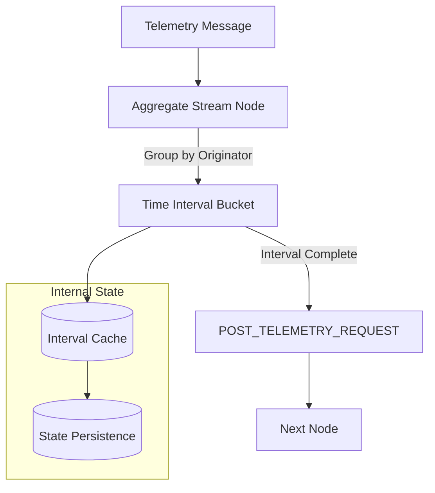
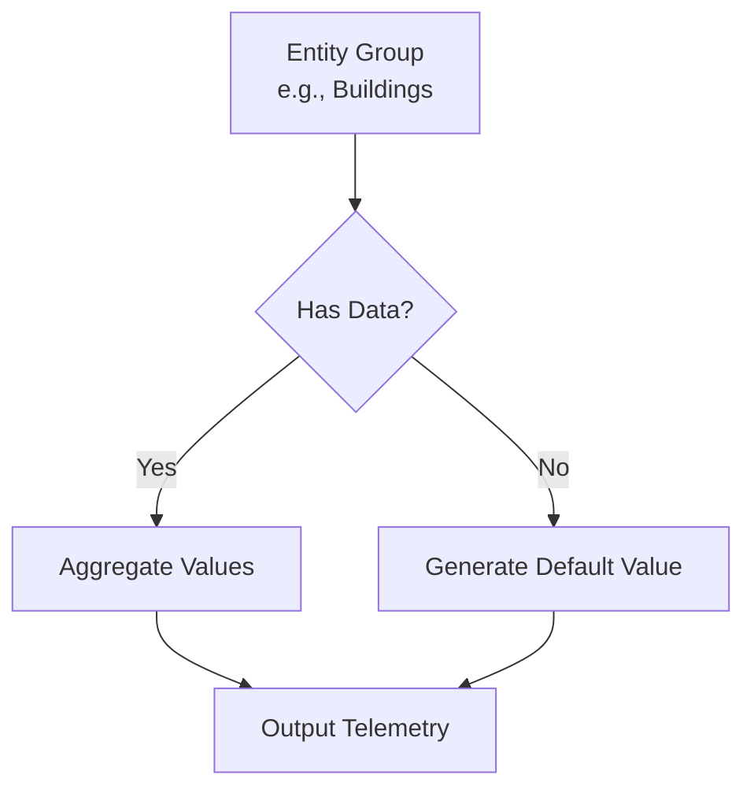
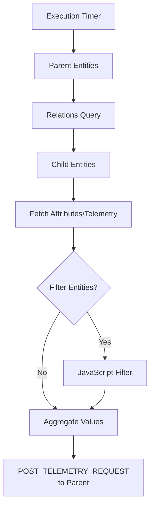
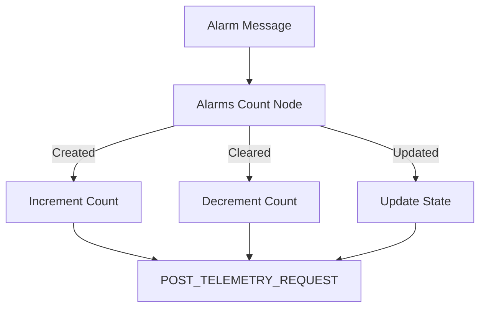
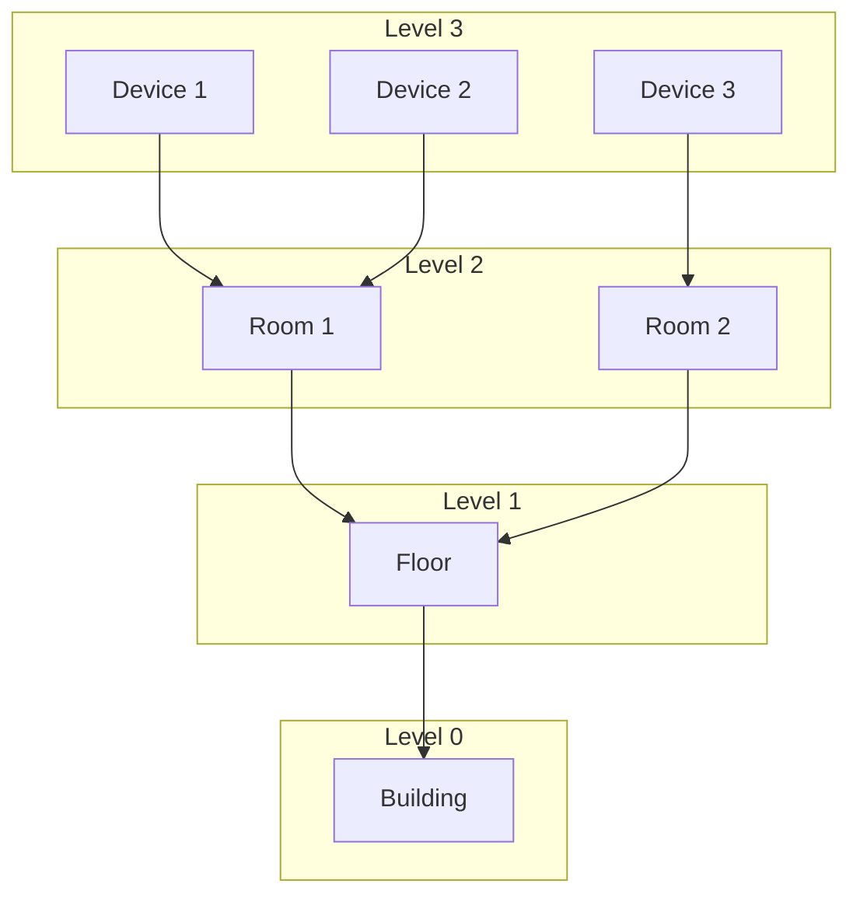
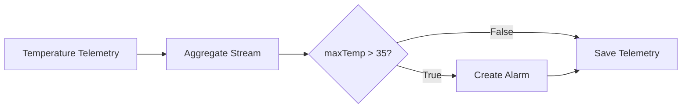

# Analytics Nodes (PE)

## Overview

Analytics nodes perform statistical calculations and aggregations on incoming data streams and across entity hierarchies. These Professional Edition (PE) nodes calculate metrics like minimum, maximum, sum, average, count, and unique counts. They support both real-time stream aggregation and periodic batch aggregation of child entity data.

## Node Summary

| Node | Name | Description |
|------|------|-------------|
| TbAggregateStreamNode | aggregate stream | Real-time aggregation of streaming data |
| TbAggregateLatestNode | aggregate latest | Periodic aggregation of child entity data |
| TbAlarmsCountNode | alarms count | Count alarms in real-time |
| TbAlarmsCountNodeOld | alarms count (deprecated) | Periodic alarm counting |

## Aggregate Stream Node

### Purpose

Calculates MIN/MAX/SUM/AVG/COUNT/UNIQUE from incoming telemetry streams. Groups data by originator, aggregation function, and time interval.

### Flow



### Configuration

| Setting | Description |
|---------|-------------|
| Aggregation function | MIN, MAX, SUM, AVG, COUNT, UNIQUE |
| Input key | Telemetry key to aggregate |
| Output key | Result telemetry key |
| Interval value | Aggregation period (e.g., 1 hour) |
| Interval time unit | MINUTES, HOURS, DAYS |

### Persistence Settings

| Setting | Description |
|---------|-------------|
| Interval persistence policy | When to save intervals (ON_INTERVAL_END, ON_EACH_MESSAGE) |
| Interval check value | How often to check for completed intervals |
| Interval TTL | How long to keep intervals in memory |
| State persistence policy | When to persist state |
| State persistence value | State persistence frequency |

### Auto-Create Intervals

Enable **Create intervals automatically** to generate default values for entities without data:



### Example: Hourly Temperature Average

**Configuration:**
- Aggregation function: AVG
- Input key: temperature
- Output key: hourlyAvgTemp
- Interval: 1 HOUR
- Persistence: ON_INTERVAL_END

**Output Message:**
```json
{
  "hourlyAvgTemp": 23.5,
  "ts": 1705320000000
}
```

## Aggregate Latest Node

### Purpose

Periodically aggregates attributes or latest telemetry from child entities and stores results in parent entities. Useful for hierarchical data rollup (e.g., building → floor → room).

### Flow



### Configuration

| Setting | Description |
|---------|-------------|
| Execution period | How often to run aggregation |
| Entities | Parent entities (Single, Group, or Relations Query) |
| Child entities | Relations query to find children |
| Aggregate mappings | Source → Target mappings with functions |

### Entity Selection

**Single Entity:**
- One specific entity as parent
- Uses Relations Query for children

**Group of Entities:**
- Entity group as parents
- Children are members of same group

**Relations Query:**
- Dynamic set of parents via relations
- Children found via separate query

### Aggregate Mappings

| Field | Description |
|-------|-------------|
| Latest telemetry | true = telemetry, false = attribute |
| Source key | Child attribute/telemetry key |
| Attribute scope | SHARED, CLIENT, SERVER (for attributes) |
| Default value | Value when child has no data |
| Aggregation function | MIN, MAX, SUM, AVG, COUNT, COUNT_UNIQUE |
| Target telemetry | Parent telemetry key for result |
| Filter entities | Enable JavaScript filtering |
| Entity filter | JS function returning boolean |

### Example: Building Energy Aggregation

**Scenario:** Calculate total energy consumption for a building from all floors.

**Configuration:**
- Entities: Buildings entity group
- Child entities: Related floors via "Contains" relation
- Mapping:
  - Source: energyConsumption (telemetry)
  - Function: SUM
  - Target: totalBuildingEnergy

**Filter Function:**
```javascript
// Only include active floors
return attributes.ss_active === true;
```

**Output:**
```json
{
  "totalBuildingEnergy": 15234.5,
  "ts": 1705320000000
}
```

## Alarms Count Node

### Purpose

Counts alarms in real-time when receiving alarm messages. Updates count on alarm creation, update, or clearing.

### Flow



### Configuration

| Setting | Description |
|---------|-------------|
| Count alarms for | Entity type (DEVICE, ASSET, etc.) |
| Alarm types | Filter by alarm types |
| Alarm severities | Filter by severities |
| Count scope | Per entity or global |
| Output key | Telemetry key for count |

### Example Output

```json
{
  "activeAlarmsCount": 5,
  "criticalAlarmsCount": 2,
  "warningAlarmsCount": 3,
  "ts": 1705320000000
}
```

## Alarms Count Node (Deprecated)

### Purpose

Periodically counts alarms for a set of entities. Replaced by the new Alarms Count node for better performance.

### Configuration

| Setting | Description |
|---------|-------------|
| Execution period | How often to count |
| Entities | Target entities |
| Alarm types | Filter by types |
| Severities | Filter by severities |
| Count cleared | Include cleared alarms |

## Common Patterns

### Hierarchical Aggregation



**Implementation:**
1. Aggregate Latest for Room → Device aggregation
2. Aggregate Latest for Floor → Room aggregation
3. Aggregate Latest for Building → Floor aggregation

### Real-Time vs Periodic

| Use Case | Node | Reason |
|----------|------|--------|
| Dashboard metrics | Aggregate Stream | Real-time updates |
| Daily reports | Aggregate Latest | Periodic batch |
| Alarm monitoring | Alarms Count | Event-driven |
| Historical analysis | Aggregate Latest | Scheduled queries |

## Best Practices

### Performance

| Practice | Benefit |
|----------|---------|
| Use appropriate intervals | Balance granularity vs storage |
| Enable caching | Reduce DB queries |
| Filter entities | Process only needed data |
| Set TTL appropriately | Manage memory usage |

### Data Quality

| Practice | Benefit |
|----------|---------|
| Set default values | Handle missing data |
| Use filters | Exclude invalid entities |
| Validate inputs | Ensure numeric data |

### Architecture

| Practice | Benefit |
|----------|---------|
| Layer aggregations | Build hierarchy step-by-step |
| Use separate rule chains | Isolate aggregation logic |
| Monitor performance | Track processing times |

## Advanced Configuration

### Aggregate Stream: Window Sizing Strategy

| Data Frequency | Recommended Interval | Rationale |
|----------------|---------------------|-----------|
| High (>1/sec) | 5-15 minutes | Balance granularity vs storage |
| Medium (1/min) | 1-4 hours | Reasonable aggregation period |
| Low (< 1/hour) | 12-24 hours | Avoid sparse intervals |

**Memory Considerations:**
- Each active interval consumes memory
- **Rule of thumb**: `(devices × intervals) < 100,000` for optimal performance
- Use TTL to expire old intervals

### Aggregate Stream: Persistence Strategies

| Strategy | When to Use | Trade-offs |
|----------|-------------|-----------|
| ON_INTERVAL_END | Normal operations | Minimal overhead, data saved once |
| ON_EACH_MESSAGE | Critical data | Higher overhead, no data loss on restart |

**State Persistence:**
- Persist state every N messages to survive restarts
- Default: Every 100 messages
- Tune based on data criticality vs performance

### Aggregate Latest: Execution Patterns

| Pattern | Configuration | Use Case |
|---------|---------------|----------|
| Scheduled rollup | Fixed period (e.g., hourly) | Regular reports, dashboards |
| Event-triggered | Low period with filter | Real-time aggregation on change |
| Batch processing | Long period (daily) | Historical analysis |

**Execution Period Guidelines:**
- **Real-time dashboards**: 1-5 minutes
- **Hourly reports**: 1 hour
- **Daily summaries**: 24 hours
- Balance freshness vs database load

## Additional Use Cases

### Use Case 1: Multi-Level Building Aggregation

**Scenario**: Calculate total power consumption from rooms → floors → building

**Chain 1 - Room to Floor Aggregation:**
```
Rule Chain: Floor Aggregation
- Trigger: Every 5 minutes
- Node: Aggregate Latest
  - Entities: All Floors (entity group)
  - Child entities: Rooms (relation: "Contains")
  - Mapping:
    - Source: powerConsumption (telemetry)
    - Function: SUM
    - Target: floorPowerTotal
```

**Chain 2 - Floor to Building Aggregation:**
```
Rule Chain: Building Aggregation
- Trigger: Every 5 minutes (offset by 1 minute)
- Node: Aggregate Latest
  - Entities: All Buildings (entity group)
  - Child entities: Floors (relation: "Contains")
  - Mapping:
    - Source: floorPowerTotal (telemetry)
    - Function: SUM
    - Target: buildingPowerTotal
```

**Result**: Building entity has `buildingPowerTotal` representing sum of all room consumption

### Use Case 2: Device Health Score Calculation

**Scenario**: Calculate average device health score per customer

**Configuration:**
```
Node: Aggregate Latest
- Entities: All Customers (entity group)
- Child entities: Devices assigned to customer (relation: "Manages")
- Mapping:
  - Source: healthScore (telemetry, 0-100)
  - Function: AVG
  - Target: avgDeviceHealth
- Filter Function:
  // Only include online devices
  return attributes.ss_active === true && telemetry.healthScore > 0;
```

**Output**: Each customer has `avgDeviceHealth` showing average of all active device scores

### Use Case 3: Real-Time Temperature Monitoring with Alerts

**Scenario**: Calculate max temperature per hour and trigger alarm if exceeded

**Chain Configuration:**


**Aggregate Stream Configuration:**
- Function: MAX
- Input key: temperature
- Output key: maxHourlyTemp
- Interval: 1 HOUR
- Persistence: ON_INTERVAL_END

**Script Filter:**
```javascript
return msg.maxHourlyTemp > 35;
```

### Use Case 4: Count Unique Devices Reporting Per Day

**Scenario**: Track daily active devices per tenant

**Configuration:**
```
Node: Aggregate Stream
- Entities: Tenant (from message originator)
- Aggregation function: COUNT_UNIQUE
- Input key: deviceId (from metadata)
- Output key: dailyActiveDevices
- Interval: 24 HOURS
- Auto-create intervals: true (to handle tenants with no data)
```

**Output**: Daily telemetry `dailyActiveDevices` showing unique device count

## Performance Optimization

### Aggregate Stream Optimization

| Technique | Impact | Implementation |
|-----------|--------|----------------|
| Increase interval size | Reduce aggregation frequency | Use longer intervals for less critical data |
| Limit entity count | Reduce memory usage | Use entity filters to process subset |
| Enable compression | Reduce storage | Use time-series compression in database |
| Batch processing | Reduce DB calls | Increase interval check period |

**Example - High-Volume Scenario:**
```
# Instead of 1-minute intervals for 10,000 devices:
Interval: 5 minutes (5x reduction in aggregations)
Interval check: 60 seconds (reduce check frequency)
State persistence: Every 500 messages (reduce I/O)
```

### Aggregate Latest Optimization

| Technique | Impact | Implementation |
|-----------|--------|----------------|
| Reduce execution frequency | Decrease database load | Run hourly instead of every minute |
| Use entity filters | Process fewer entities | Filter inactive or irrelevant entities |
| Limit relation depth | Faster queries | Keep maxLevel ≤ 2 |
| Cache attribute lookups | Reduce redundant queries | Use shared attributes for thresholds |

**Example - Large Hierarchy:**
```javascript
// Filter function to reduce processing
function filterEntities(entity, attributes, telemetry) {
    // Only include entities updated in last hour
    if (!telemetry.lastActivityTime) return false;
    var hourAgo = Date.now() - 3600000;
    return telemetry.lastActivityTime > hourAgo;
}
```

## Debugging and Monitoring

### Debug Mode Recommendations

**Enable debug mode to troubleshoot:**
1. Verify interval creation and completion
2. Check aggregation input values
3. Validate entity selection and filtering
4. Monitor state persistence

**Debug Output to Watch:**
- Input messages received
- Interval state (active, completed, expired)
- Aggregation calculations
- Output messages generated

### Metrics to Monitor

| Metric | What to Watch | Alert Threshold |
|--------|---------------|-----------------|
| Interval count | Active intervals per node | > 10,000 |
| Aggregation latency | Time to complete aggregation | > 5 seconds |
| Memory usage | Heap consumption | > 80% |
| Error rate | Failed aggregations | > 1% |

### Common Debug Scenarios

**Scenario 1: Missing Aggregations**
1. Check entity filter logic (debug with simple `return true` test)
2. Verify relations exist between entities
3. Confirm source telemetry keys exist
4. Check interval completion (might be waiting for more messages)

**Scenario 2: Incorrect Values**
1. Validate input data types (numbers vs strings)
2. Check aggregation function (SUM vs AVG vs MAX)
3. Verify default values for missing data
4. Test filter function with sample entities

**Scenario 3: Performance Issues**
1. Review interval size (too small = too many intervals)
2. Check entity count (too many = memory pressure)
3. Monitor database query performance
4. Reduce aggregation frequency if possible

## Troubleshooting

### Common Issues

| Issue | Cause | Solution |
|-------|-------|----------|
| Missing aggregations | Entity filter too strict | Review filter logic; test with `return true` |
| Stale data | TTL too short or interval not completing | Increase interval TTL; check message frequency |
| Memory issues | Too many active intervals | Reduce TTL, increase interval size, or limit entities |
| Wrong values | Non-numeric data or type coercion | Validate input types; ensure numeric telemetry |
| Aggregation not running | Execution period misconfigured | Verify cron expression or period setting |
| First interval always zero | No historical data | Handle first interval specially; set default value |
| Negative deltas | Counter reset | Add counter reset detection logic |

## Common Pitfalls

### Aggregate Stream

| Pitfall | Impact | Solution |
|---------|--------|----------|
| Window size too small | Excessive aggregations, memory pressure | Minimum 1 minute for high-frequency data; use 5-15 min for optimal performance |
| Missing timestamp in data | Aggregation uses message arrival time | Include explicit `ts` field in telemetry for accurate time-based aggregation |
| Aggregating on string values | Type conversion errors, invalid results | Filter non-numeric data before aggregation; validate data types |
| Interval TTL too short | Intervals expire before completion | Set TTL ≥ 2x interval duration; monitor completion rates |
| No state persistence | Data loss on restart | Enable state persistence with appropriate frequency |
| Large number of entities | Memory exhaustion | Limit to < 10,000 active intervals; use entity filters |

### Aggregate Latest

| Pitfall | Impact | Solution |
|---------|--------|----------|
| Execution period too short | Database overload | Balance freshness vs load; use ≥ 1 minute for most cases |
| Fetching all entities | Timeout on large installations | Use entity filters; limit scope to relevant entities |
| Deep relation traversal | Slow queries | Keep `maxLevel ≤ 2`; consider pre-computing for deep hierarchies |
| Stale data assumption | Latest != current if device offline | Check timestamp freshness in downstream logic; handle missing data |
| Filter function errors | Aggregation fails silently | Test filter functions thoroughly; handle null values |
| Circular relations | Infinite loops or errors | Validate relation structure; avoid circular references |

### Alarms Count

| Pitfall | Impact | Solution |
|---------|--------|----------|
| Count scope misconfigured | Counts don't match expectations | Clarify per-entity vs global scope |
| Missing alarm types | Incomplete counts | Specify all relevant alarm types or use empty filter for all |
| Cleared alarms not decremented | Incorrect counts | Ensure alarm lifecycle properly triggers count updates |

### General Performance

| Pitfall | Impact | Solution |
|---------|--------|----------|
| Running aggregations in main queue | Blocks other messages | Use dedicated queue for analytics chains |
| No monitoring | Issues go unnoticed | Monitor memory, latency, and error rates |
| Over-aggregation | Unnecessary computation | Aggregate only what's displayed or used |
| Mixing real-time and batch | Complexity | Use Aggregate Stream for real-time, Aggregate Latest for batch |

## See Also

- [Action Nodes](./action-nodes.md) - Save aggregated data
- [Enrichment Nodes](./enrichment-nodes.md) - Fetch entity data
- [TBEL Language](../tbel.md) - Script filters
- [Entity Relations](../../02-core-concepts/entities/relations.md) - Relations queries
- [Message Queue](../../08-message-queue/README.md) - Queue configuration for analytics
- [Data Model: Telemetry](../../02-core-concepts/data-model/telemetry.md) - Time-series data structure
