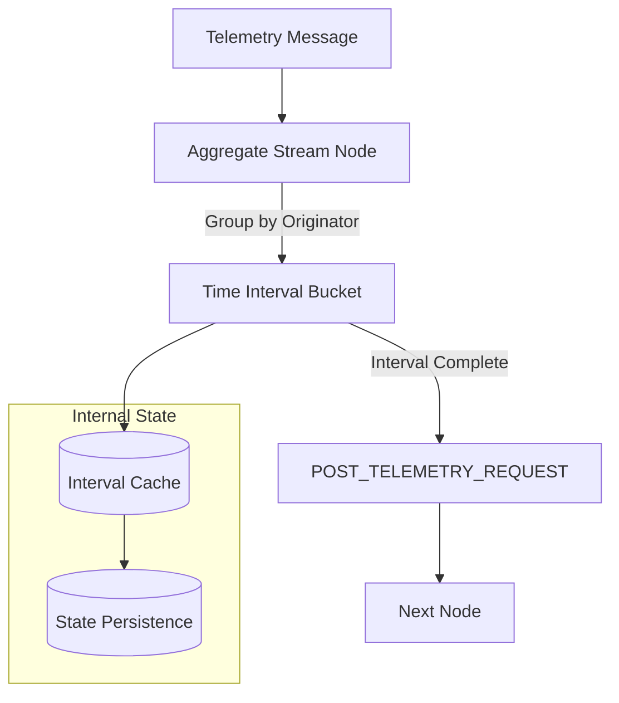
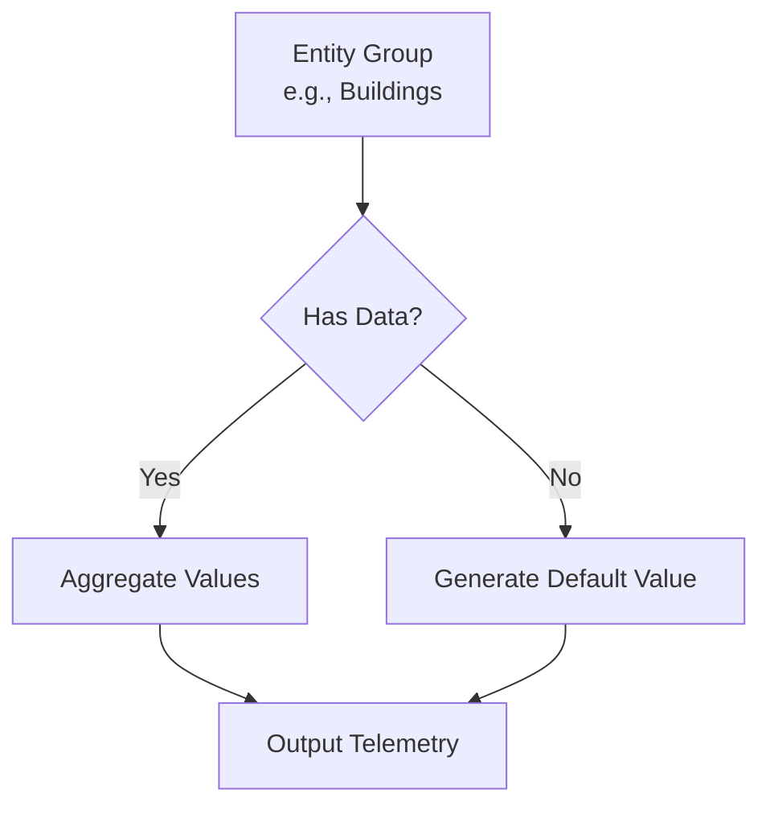
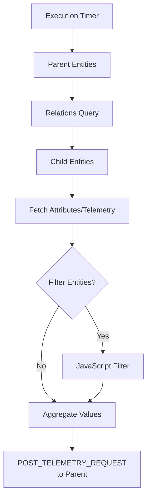
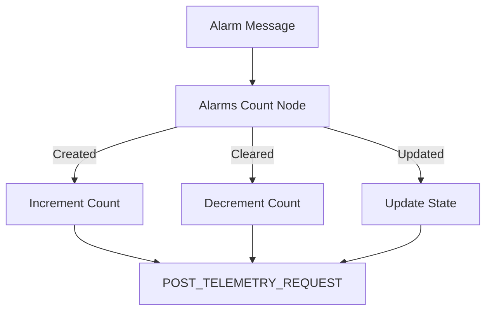
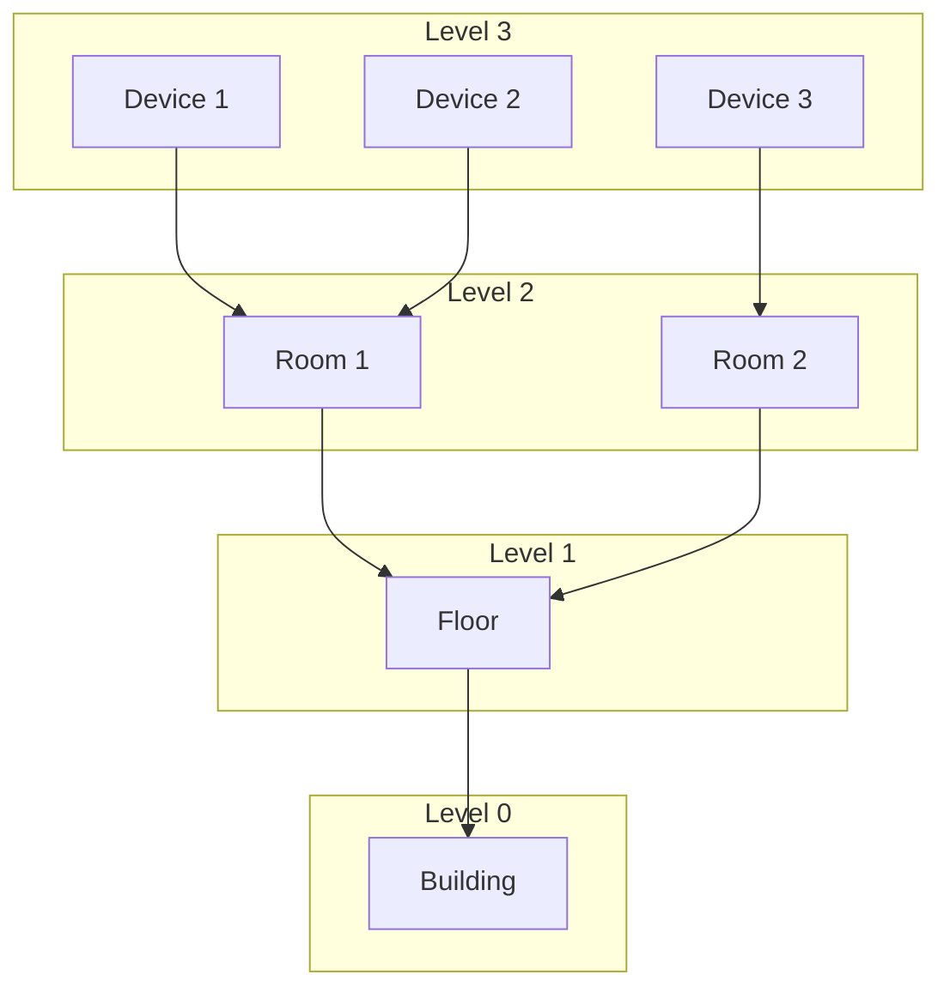

# Analytics Nodes (PE)

## Overview

Analytics nodes perform statistical calculations and aggregations on incoming data streams and across entity hierarchies. These Professional Edition (PE) nodes calculate metrics like minimum, maximum, sum, average, count, and unique counts. They support both real-time stream aggregation and periodic batch aggregation of child entity data.

## Node Summary

| Node | Name | Description |
|------|------|-------------|
| TbAggregateStreamNode | aggregate stream | Real-time aggregation of streaming data |
| TbAggregateLatestNode | aggregate latest | Periodic aggregation of child entity data |
| TbAlarmsCountNode | alarms count | Count alarms in real-time |
| TbAlarmsCountNodeOld | alarms count (deprecated) | Periodic alarm counting |

## Aggregate Stream Node

### Purpose

Calculates MIN/MAX/SUM/AVG/COUNT/UNIQUE from incoming telemetry streams. Groups data by originator, aggregation function, and time interval.

### Flow



### Configuration

| Setting | Description |
|---------|-------------|
| Aggregation function | MIN, MAX, SUM, AVG, COUNT, UNIQUE |
| Input key | Telemetry key to aggregate |
| Output key | Result telemetry key |
| Interval value | Aggregation period (e.g., 1 hour) |
| Interval time unit | MINUTES, HOURS, DAYS |

### Persistence Settings

| Setting | Description |
|---------|-------------|
| Interval persistence policy | When to save intervals (ON_INTERVAL_END, ON_EACH_MESSAGE) |
| Interval check value | How often to check for completed intervals |
| Interval TTL | How long to keep intervals in memory |
| State persistence policy | When to persist state |
| State persistence value | State persistence frequency |

### Auto-Create Intervals

Enable **Create intervals automatically** to generate default values for entities without data:



### Example: Hourly Temperature Average

**Configuration:**
- Aggregation function: AVG
- Input key: temperature
- Output key: hourlyAvgTemp
- Interval: 1 HOUR
- Persistence: ON_INTERVAL_END

**Output Message:**
```json
{
  "hourlyAvgTemp": 23.5,
  "ts": 1705320000000
}
```

## Aggregate Latest Node

### Purpose

Periodically aggregates attributes or latest telemetry from child entities and stores results in parent entities. Useful for hierarchical data rollup (e.g., building → floor → room).

### Flow



### Configuration

| Setting | Description |
|---------|-------------|
| Execution period | How often to run aggregation |
| Entities | Parent entities (Single, Group, or Relations Query) |
| Child entities | Relations query to find children |
| Aggregate mappings | Source → Target mappings with functions |

### Entity Selection

**Single Entity:**
- One specific entity as parent
- Uses Relations Query for children

**Group of Entities:**
- Entity group as parents
- Children are members of same group

**Relations Query:**
- Dynamic set of parents via relations
- Children found via separate query

### Aggregate Mappings

| Field | Description |
|-------|-------------|
| Latest telemetry | true = telemetry, false = attribute |
| Source key | Child attribute/telemetry key |
| Attribute scope | SHARED, CLIENT, SERVER (for attributes) |
| Default value | Value when child has no data |
| Aggregation function | MIN, MAX, SUM, AVG, COUNT, COUNT_UNIQUE |
| Target telemetry | Parent telemetry key for result |
| Filter entities | Enable JavaScript filtering |
| Entity filter | JS function returning boolean |

### Example: Building Energy Aggregation

**Scenario:** Calculate total energy consumption for a building from all floors.

**Configuration:**
- Entities: Buildings entity group
- Child entities: Related floors via "Contains" relation
- Mapping:
  - Source: energyConsumption (telemetry)
  - Function: SUM
  - Target: totalBuildingEnergy

**Filter Function:**
```javascript
// Only include active floors
return attributes.ss_active === true;
```

**Output:**
```json
{
  "totalBuildingEnergy": 15234.5,
  "ts": 1705320000000
}
```

## Alarms Count Node

### Purpose

Counts alarms in real-time when receiving alarm messages. Updates count on alarm creation, update, or clearing.

### Flow



### Configuration

| Setting | Description |
|---------|-------------|
| Count alarms for | Entity type (DEVICE, ASSET, etc.) |
| Alarm types | Filter by alarm types |
| Alarm severities | Filter by severities |
| Count scope | Per entity or global |
| Output key | Telemetry key for count |

### Example Output

```json
{
  "activeAlarmsCount": 5,
  "criticalAlarmsCount": 2,
  "warningAlarmsCount": 3,
  "ts": 1705320000000
}
```

## Alarms Count Node (Deprecated)

### Purpose

Periodically counts alarms for a set of entities. Replaced by the new Alarms Count node for better performance.

### Configuration

| Setting | Description |
|---------|-------------|
| Execution period | How often to count |
| Entities | Target entities |
| Alarm types | Filter by types |
| Severities | Filter by severities |
| Count cleared | Include cleared alarms |

## Common Patterns

### Hierarchical Aggregation



**Implementation:**
1. Aggregate Latest for Room → Device aggregation
2. Aggregate Latest for Floor → Room aggregation
3. Aggregate Latest for Building → Floor aggregation

### Real-Time vs Periodic

| Use Case | Node | Reason |
|----------|------|--------|
| Dashboard metrics | Aggregate Stream | Real-time updates |
| Daily reports | Aggregate Latest | Periodic batch |
| Alarm monitoring | Alarms Count | Event-driven |
| Historical analysis | Aggregate Latest | Scheduled queries |

## Best Practices

### Performance

| Practice | Benefit |
|----------|---------|
| Use appropriate intervals | Balance granularity vs storage |
| Enable caching | Reduce DB queries |
| Filter entities | Process only needed data |
| Set TTL appropriately | Manage memory usage |

### Data Quality

| Practice | Benefit |
|----------|---------|
| Set default values | Handle missing data |
| Use filters | Exclude invalid entities |
| Validate inputs | Ensure numeric data |

### Architecture

| Practice | Benefit |
|----------|---------|
| Layer aggregations | Build hierarchy step-by-step |
| Use separate rule chains | Isolate aggregation logic |
| Monitor performance | Track processing times |

## Troubleshooting

### Common Issues

| Issue | Cause | Solution |
|-------|-------|----------|
| Missing aggregations | Entity filter too strict | Review filter logic |
| Stale data | TTL too short | Increase interval TTL |
| Memory issues | Too many intervals | Reduce TTL or entities |
| Wrong values | Non-numeric data | Validate input types |

## See Also

- [Action Nodes](./action-nodes.md) - Save aggregated data
- [Enrichment Nodes](./enrichment-nodes.md) - Fetch entity data
- [TBEL Language](../tbel.md) - Script filters
- [Entity Relations](../../02-core-concepts/entities/relations.md) - Relations queries
