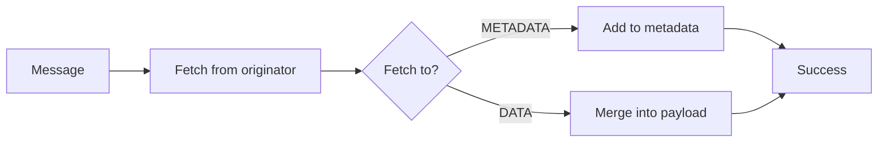
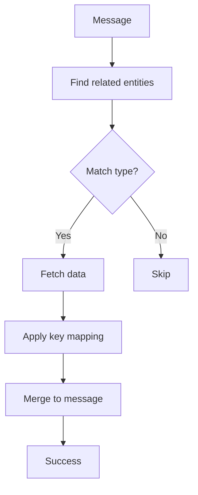
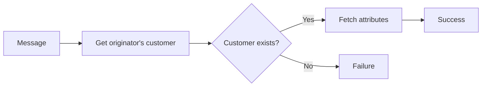
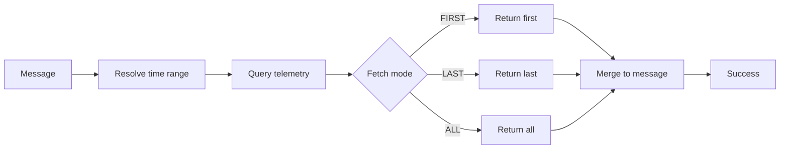
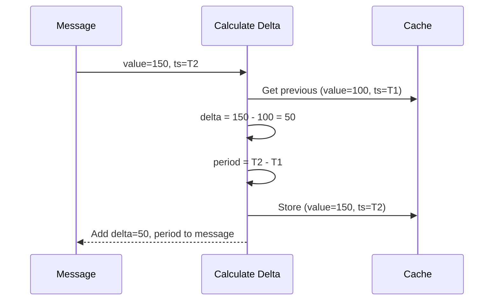
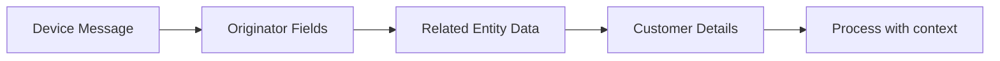
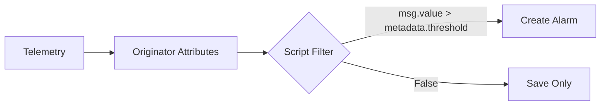
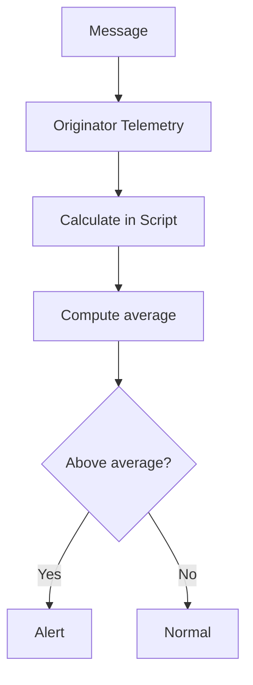
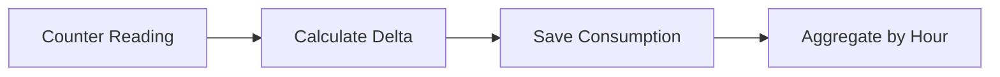

# Enrichment Nodes Reference

## Overview

Enrichment nodes fetch data from the platform and add it to the message payload or metadata. They retrieve attributes, telemetry, entity fields, or calculated values from various sources, enabling downstream nodes to make decisions based on enriched context. All enrichment nodes route to Success on completion or Failure on error.

## Node Quick Reference

| Node | Class | Description |
|------|-------|-------------|
| Originator Attributes | TbGetAttributesNode | Get originator's attributes/telemetry |
| Related Entity Data | TbGetRelatedAttributeNode | Get related entity data |
| Tenant Attributes | TbGetTenantAttributeNode | Get tenant attributes |
| Customer Attributes | TbGetCustomerAttributeNode | Get customer attributes |
| Tenant Details | TbGetTenantDetailsNode | Get tenant entity fields |
| Customer Details | TbGetCustomerDetailsNode | Get customer entity fields |
| Originator Fields | TbGetOriginatorFieldsNode | Get originator entity fields |
| Related Device Attributes | TbGetDeviceAttrNode | Get related device attributes |
| Originator Telemetry | TbGetTelemetryNode | Get historical telemetry |
| Fetch Device Credentials | TbFetchDeviceCredentialsNode | Get device credentials |
| Calculate Delta | CalculateDeltaNode | Calculate value differences |

---

## Originator Attributes

Fetches attributes and/or latest telemetry from the message originator entity.

### Configuration

| Field | Type | Description |
|-------|------|-------------|
| clientAttributeNames | string[] | Client scope attributes to fetch |
| sharedAttributeNames | string[] | Shared scope attributes to fetch |
| serverAttributeNames | string[] | Server scope attributes to fetch |
| latestTsKeyNames | string[] | Latest telemetry keys to fetch |
| fetchTo | enum | METADATA or DATA |
| getLatestValueWithTs | boolean | Include timestamp with latest values |

### Fetch Destinations

| Destination | Behavior |
|-------------|----------|
| METADATA | Add fetched values to message metadata |
| DATA | Merge fetched values into message payload |

### Key Naming in Output

| Source | Output Key Format |
|--------|-------------------|
| Client attributes | `cs_{attributeName}` or `{attributeName}` |
| Shared attributes | `ss_{attributeName}` or `{attributeName}` |
| Server attributes | `ss_{attributeName}` or `{attributeName}` |
| Latest telemetry | `{keyName}` |

### Processing Flow



### Example Configuration

```json
{
  "clientAttributeNames": ["firmware"],
  "sharedAttributeNames": ["config"],
  "serverAttributeNames": ["threshold", "location"],
  "latestTsKeyNames": ["temperature"],
  "fetchTo": "METADATA",
  "getLatestValueWithTs": false
}
```

### Example Output (METADATA)

**Before:**
```json
{
  "deviceName": "sensor-001",
  "deviceType": "temperature-sensor"
}
```

**After:**
```json
{
  "deviceName": "sensor-001",
  "deviceType": "temperature-sensor",
  "cs_firmware": "1.2.3",
  "ss_config": "{\"interval\":60}",
  "ss_threshold": "30",
  "ss_location": "Building A",
  "temperature": "25.5"
}
```

---

## Related Entity Data

Fetches attributes, telemetry, or fields from entities related to the message originator.

### Configuration

| Field | Type | Description |
|-------|------|-------------|
| direction | enum | FROM or TO |
| relationType | string | Relation type to follow |
| entityType | enum | Target entity type |
| maxLevel | integer | Maximum relation depth (default: 1) |
| attrMapping | object | Attribute key mappings |
| telemetryMapping | object | Telemetry key mappings |
| fetchTo | enum | METADATA or DATA |

### Relation Direction

| Direction | Description |
|-----------|-------------|
| FROM | Follow outgoing relations from originator |
| TO | Follow incoming relations to originator |

### Mapping Syntax

The mapping object uses `{sourceKey}: {targetKey}` format:

```json
{
  "attrMapping": {
    "location": "assetLocation",
    "owner": "assetOwner"
  },
  "telemetryMapping": {
    "status": "parentStatus"
  }
}
```

### Processing Flow



### Example: Get Parent Asset Location

**Configuration:**
```json
{
  "direction": "TO",
  "relationType": "Contains",
  "entityType": "ASSET",
  "maxLevel": 1,
  "attrMapping": {
    "location": "assetLocation",
    "name": "assetName"
  },
  "fetchTo": "METADATA"
}
```

This finds assets that have a "Contains" relation TO the device (the device is contained by the asset).

---

## Tenant Attributes

Fetches attributes and/or latest telemetry from the current tenant.

### Configuration

| Field | Type | Description |
|-------|------|-------------|
| clientAttributeNames | string[] | Client attributes (not applicable) |
| sharedAttributeNames | string[] | Shared attributes (not applicable) |
| serverAttributeNames | string[] | Server scope attributes |
| latestTsKeyNames | string[] | Latest telemetry keys |
| fetchTo | enum | METADATA or DATA |

### Example Configuration

```json
{
  "serverAttributeNames": ["maxDevices", "alertEmail"],
  "latestTsKeyNames": [],
  "fetchTo": "METADATA"
}
```

---

## Customer Attributes

Fetches attributes and/or latest telemetry from the originator's customer.

### Configuration

| Field | Type | Description |
|-------|------|-------------|
| clientAttributeNames | string[] | Client attributes |
| sharedAttributeNames | string[] | Shared attributes |
| serverAttributeNames | string[] | Server scope attributes |
| latestTsKeyNames | string[] | Latest telemetry keys |
| fetchTo | enum | METADATA or DATA |

### Processing Flow



---

## Tenant Details

Fetches entity fields from the current tenant.

### Available Fields

| Field | Description |
|-------|-------------|
| id | Tenant UUID |
| title | Tenant name |
| region | Tenant region |
| country | Tenant country |
| state | Tenant state |
| city | Tenant city |
| address | Tenant address |
| address2 | Additional address |
| zip | Postal code |
| phone | Phone number |
| email | Email address |

### Configuration

| Field | Type | Description |
|-------|------|-------------|
| detailsList | string[] | Fields to fetch |
| fetchTo | enum | METADATA or DATA |

### Example Configuration

```json
{
  "detailsList": ["title", "email", "country"],
  "fetchTo": "METADATA"
}
```

---

## Customer Details

Fetches entity fields from the originator's customer.

### Available Fields

| Field | Description |
|-------|-------------|
| id | Customer UUID |
| title | Customer name |
| country | Customer country |
| state | Customer state |
| city | Customer city |
| address | Customer address |
| address2 | Additional address |
| zip | Postal code |
| phone | Phone number |
| email | Email address |

### Configuration

| Field | Type | Description |
|-------|------|-------------|
| detailsList | string[] | Fields to fetch |
| fetchTo | enum | METADATA or DATA |

---

## Originator Fields

Fetches entity fields from the message originator.

### Available Fields (Device)

| Field | Description |
|-------|-------------|
| id | Device UUID |
| name | Device name |
| label | Device label |
| type | Device type |
| createdTime | Creation timestamp |

### Available Fields (Asset)

| Field | Description |
|-------|-------------|
| id | Asset UUID |
| name | Asset name |
| label | Asset label |
| type | Asset type |
| createdTime | Creation timestamp |

### Configuration

| Field | Type | Description |
|-------|------|-------------|
| fetchTo | enum | METADATA or DATA |
| dataMapping | object | Field to key mappings |

### Example Configuration

```json
{
  "fetchTo": "METADATA",
  "dataMapping": {
    "name": "originatorName",
    "type": "originatorType",
    "label": "originatorLabel"
  }
}
```

---

## Related Device Attributes

Fetches attributes from a device related to the message originator.

### Configuration

| Field | Type | Description |
|-------|------|-------------|
| direction | enum | FROM or TO |
| relationType | string | Relation type |
| clientAttributeNames | string[] | Client attributes |
| sharedAttributeNames | string[] | Shared attributes |
| serverAttributeNames | string[] | Server attributes |
| latestTsKeyNames | string[] | Latest telemetry |
| fetchTo | enum | METADATA or DATA |

### Use Case

Useful when processing messages from a gateway and needing attributes from an actual device, or when processing alarm messages and needing device context.

---

## Originator Telemetry

Fetches historical telemetry data from the message originator.

### Configuration

| Field | Type | Description |
|-------|------|-------------|
| latestTsKeyNames | string[] | Telemetry keys to fetch |
| fetchMode | enum | FIRST, LAST, ALL |
| startTs | long | Start timestamp (ms) |
| endTs | long | End timestamp (ms) |
| startTsPattern | string | Pattern for start timestamp |
| endTsPattern | string | Pattern for end timestamp |
| limit | integer | Maximum records per key |
| orderBy | enum | ASC or DESC |
| fetchTo | enum | METADATA or DATA |

### Fetch Modes

| Mode | Behavior |
|------|----------|
| FIRST | Get oldest value in range |
| LAST | Get newest value in range |
| ALL | Get all values in range (up to limit) |

### Time Range Patterns

Patterns support variables resolved from metadata:
- `${startTs}` - Use metadata value
- `${endTs}` - Use metadata value

### Processing Flow



### Example: Get Last 24 Hours

```json
{
  "latestTsKeyNames": ["temperature", "humidity"],
  "fetchMode": "ALL",
  "startTs": 0,
  "startTsPattern": "${startTime}",
  "endTs": 0,
  "endTsPattern": "${endTime}",
  "limit": 1000,
  "orderBy": "DESC",
  "fetchTo": "DATA"
}
```

---

## Fetch Device Credentials

Retrieves device credentials for the originator device.

### Credential Types

| Type | Fields Returned |
|------|-----------------|
| ACCESS_TOKEN | credentialsId (token) |
| X509_CERTIFICATE | credentialsId (certificate hash) |
| MQTT_BASIC | credentialsId, username, password |
| LWM2M_CREDENTIALS | credentialsId, client keys |

### Configuration

| Field | Type | Description |
|-------|------|-------------|
| fetchTo | enum | METADATA or DATA |

### Security Note

This node exposes sensitive credential information. Use with caution and ensure proper access controls in downstream processing.

---

## Calculate Delta

Computes the difference between consecutive telemetry readings for the same key.

### Configuration

| Field | Type | Description |
|-------|------|-------------|
| inputValueKey | string | Source telemetry key |
| outputValueKey | string | Output delta key |
| useCache | boolean | Use in-memory cache |
| addPeriodBetweenMsgs | boolean | Include time delta |
| periodValueKey | string | Time delta output key |
| round | integer | Decimal places to round |
| tellFailureIfDeltaIsNegative | boolean | Route to failure if negative |

### Processing Flow



### Example Configuration

```json
{
  "inputValueKey": "energyCounter",
  "outputValueKey": "energyDelta",
  "useCache": true,
  "addPeriodBetweenMsgs": true,
  "periodValueKey": "deltaTime",
  "round": 2,
  "tellFailureIfDeltaIsNegative": false
}
```

### Use Cases

- **Energy metering** - Calculate consumption from counter readings
- **Distance tracking** - Calculate distance traveled from odometer
- **Rate calculation** - Compute rates from cumulative counters

---

## Common Patterns

### Context Enrichment Pattern



### Threshold Comparison Pattern



### Historical Analysis Pattern



### Energy Consumption Pattern



## Best Practices

1. **Fetch only needed data** - Request only attributes/telemetry you'll use
2. **Use METADATA for context** - Keep original payload intact when enriching
3. **Cache when appropriate** - Calculate Delta uses caching for efficiency
4. **Handle missing data** - Check for null/missing values in downstream scripts
5. **Consider performance** - Historical telemetry queries can be expensive

## See Also

- [Filter Nodes](./filter-nodes.md) - Use enriched data for filtering
- [Transformation Nodes](./transformation-nodes.md) - Transform enriched messages
- [Action Nodes](./action-nodes.md) - Act on enriched data
- [Node Categories](../node-categories.md) - All node categories
