# Filter Nodes Reference

## Overview

Filter nodes evaluate conditions and route messages to different output connections based on the result. They form the decision-making layer in rule chains, enabling conditional processing based on message content, type, originator, relations, and custom logic. Most filter nodes output to `True`/`False` connections, while switch nodes support multiple dynamic outputs.

## Node Quick Reference

| Node | Class | Description | Output Relations |
|------|-------|-------------|------------------|
| Script | TbJsFilterNode | Filter using TBEL/JavaScript | True, False, Failure |
| Switch | TbJsSwitchNode | Custom routing script | Dynamic, Failure |
| Message Type Switch | TbMsgTypeSwitchNode | Route by message type | Per type + Other |
| Message Type Filter | TbMsgTypeFilterNode | Filter specific types | True, False, Failure |
| Entity Type Switch | TbOriginatorTypeSwitchNode | Route by originator type | Per entity type |
| Entity Type Filter | TbOriginatorTypeFilterNode | Filter by originator type | True, False, Failure |
| Check Relation | TbCheckRelationNode | Check relation exists | True, False, Failure |
| Check Fields | TbCheckMessageNode | Check fields exist | True, False, Failure |
| Check Alarm Status | TbCheckAlarmStatusNode | Check alarm status | Per status |
| GPS Geofencing | TbGpsGeofencingFilterNode | Geographic filtering | True, False, Failure |
| Device Profile Switch | TbDeviceTypeSwitchNode | Route by device profile | Per profile |
| Asset Profile Switch | TbAssetTypeSwitchNode | Route by asset profile | Per profile |

---

## Script Filter

Executes a user-defined function that returns a boolean value. Routes messages via `True` if the function returns `true`, or via `False` if it returns `false`.

### When to Use

**Primary Use Cases:**
- **Threshold validation** - Check if sensor values exceed acceptable ranges
- **Multi-field conditions** - Combine multiple field checks in complex boolean logic
- **Dynamic threshold comparison** - Compare values against thresholds stored in metadata
- **Data quality filtering** - Validate data completeness, format, or consistency
- **Business rule evaluation** - Implement custom domain logic (SLA checks, authorization rules)

**Not Recommended For:**
- Message type routing (use Message Type Switch instead - faster)
- Simple field presence checks (use Check Fields Presence instead)
- Entity type routing (use Entity Type Switch instead)
- Static conditions that never change (use built-in filters when available)
- Heavy computation (pre-calculate in transformation node, filter on result)

### Configuration

| Field | Type | Description |
|-------|------|-------------|
| scriptLang | enum | TBEL or JS |
| tbelScript | string | TBEL script body (when scriptLang=TBEL) |
| jsScript | string | JavaScript script body (when scriptLang=JS) |

### Script Variables

| Variable | Type | Description |
|----------|------|-------------|
| msg | object | Message payload (JSON object or array) |
| metadata | object/Map | Message metadata (all values are strings) |
| msgType | string | Message type (e.g., "POST_TELEMETRY_REQUEST") |

### Processing Flow

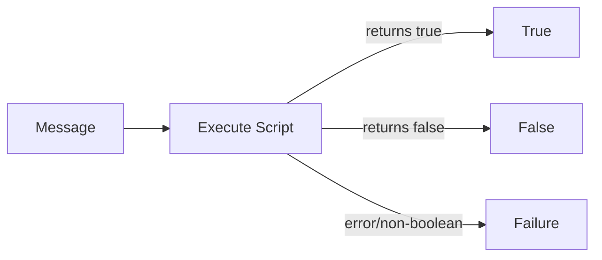

### Output Connections

| Connection | Condition |
|------------|-----------|
| True | Script returns `true` |
| False | Script returns `false` |
| Failure | Script returns non-boolean, throws error, or cannot be evaluated |

### Example: Temperature Threshold Check (TBEL)

**Configuration:**
```json
{
  "scriptLang": "TBEL",
  "tbelScript": "return msg.temperature > 25;"
}
```

**Input Message:**
```json
{
  "temperature": 30.5,
  "humidity": 65
}
```

**Result:** Routes via `True` (30.5 > 25)

### Example: Dynamic Threshold from Metadata (JavaScript)

**Configuration:**
```json
{
  "scriptLang": "JS",
  "jsScript": "if (msgType !== 'POST_TELEMETRY_REQUEST') return false;\nfor (var key in msg) {\n  var thresholdKey = key + 'Threshold';\n  if (typeof msg[key] === 'number' && metadata[thresholdKey]) {\n    if (msg[key] > Number(metadata[thresholdKey])) return true;\n  }\n}\nreturn false;"
}
```

**Input Message:**
```json
{"temperature": 45.2, "humidity": 80}
```

**Metadata:**
```json
{"temperatureThreshold": "45.0", "humidityThreshold": "85"}
```

**Result:** Routes via `True` (temperature 45.2 > threshold 45.0)

### Complete Example: Multi-Field Business Rule

**Use Case**: Validate industrial equipment telemetry before saving - reject messages with invalid combinations (e.g., high temperature with zero pressure indicates sensor failure).

**Input Message:**
```json
{
  "type": "POST_TELEMETRY_REQUEST",
  "originator": {
    "entityType": "DEVICE",
    "id": "compressor-8"
  },
  "metadata": {
    "deviceName": "Compressor-Line-C-8",
    "minPressure": "1.5",
    "maxTemperature": "85"
  },
  "data": {
    "temperature": 92,
    "pressure": 0.0,
    "vibration": 3.2,
    "runtime": 14500
  }
}
```

**Node Configuration:**
```json
{
  "scriptLang": "TBEL",
  "tbelScript": "// Validate data quality\nif (msg.temperature == null || msg.pressure == null) {\n  return false; // Missing critical fields\n}\n\n// Business rule: High temp with zero pressure = sensor fault\nvar maxTemp = parseFloat(metadata.maxTemperature);\nvar minPress = parseFloat(metadata.minPressure);\n\nif (msg.temperature > maxTemp && msg.pressure < minPress) {\n  return false; // Invalid combination\n}\n\nreturn true; // Valid data"
}
```

**Output**: Routes to **False** (invalid: temperature 92 > max 85, but pressure 0.0 < min 1.5)

**Downstream Handling**:
- **False** connection → Log error, Send notification to maintenance team
- **True** connection → Save Telemetry, Continue normal processing

**Why This Works**: The script implements domain knowledge (high temp + low pressure = sensor fault) that can't be expressed with simple threshold checks. Invalid data is rejected early in the chain, preventing false alarms and bad data storage.

### Complete Example: Data Quality Filter with Null Safety

**Use Case**: Ensure all required fields exist and have valid values before processing.

**Input Message:**
```json
{
  "type": "POST_TELEMETRY_REQUEST",
  "originator": {
    "entityType": "DEVICE",
    "id": "sensor-42"
  },
  "data": {
    "temperature": 25.5,
    "humidity": null,
    "location": ""
  }
}
```

**Node Configuration:**
```json
{
  "scriptLang": "TBEL",
  "tbelScript": "// Required fields\nvar required = ['temperature', 'humidity', 'location'];\n\nfor (var i = 0; i < required.length; i++) {\n  var field = required[i];\n  var value = msg[field];\n  \n  // Check field exists, is not null, and is not empty string\n  if (value == null || value === '') {\n    return false;\n  }\n  \n  // For numeric fields, check they're actual numbers\n  if ((field === 'temperature' || field === 'humidity') && typeof value !== 'number') {\n    return false;\n  }\n}\n\nreturn true;"
}
```

**Output**: Routes to **False** (humidity is null, location is empty string)

**Result**:
- Message rejected due to incomplete data
- Can route to error handler that logs the validation failure
- Prevents processing of partial/corrupt messages

**Why This Works**: Comprehensive null checking and type validation ensures only complete, valid messages proceed. The explicit checks prevent runtime errors in downstream nodes that expect specific data types.

### Configuration Tips

| Scenario | Recommended Approach | Rationale |
|----------|---------------------|-----------|
| Simple threshold (single field) | `return msg.temp > 30;` | Fastest, most readable |
| Multiple independent thresholds | Use Switch node with severity levels | Better routing visibility than nested if/else |
| Dynamic thresholds | Read from metadata: `parseFloat(metadata.threshold)` | Single script works for all devices |
| Null-safe comparisons | `msg.field != null && msg.field > X` | Always check null before comparison |
| Complex multi-field logic | Pre-calculate in transformation, filter on result | Separates computation from routing |
| Performance-critical path | Prefer TBEL over JavaScript | 10-100x faster execution |
| Development/debugging | Use JavaScript with console.log | Better tooling, then migrate to TBEL |

### Performance Considerations

| Practice | Impact | Recommendation |
|----------|--------|----------------|
| Null checking every field | Minimal (<1ms overhead) | Always check - prevents Failure routing |
| Complex regex matching | High (10-50ms per message) | Use enrichment to pre-validate, cache results |
| Metadata parsing on every message | Moderate (1-5ms) | Parse once if threshold doesn't change |
| Nested loops in filter | Very high (blocking) | Avoid; use enrichment for data aggregation |
| JavaScript vs TBEL | 10-100x slower for JS | Use TBEL unless need JS-specific features |
| Filter position in chain | Affects all downstream | Place filters early to discard early |

---

## Switch

Executes a user-defined function that returns connection labels for routing. Supports routing to multiple connections simultaneously.

### When to Use

**Primary Use Cases:**
- **Multi-level severity routing** - Route to different handlers based on severity levels (Normal, Warning, Critical)
- **Multi-target fanout** - Send single message to multiple downstream chains based on conditions
- **Dynamic routing** - Calculate routing destination at runtime based on message content
- **Complex classification** - Categorize messages into multiple buckets for parallel processing
- **Priority-based queuing** - Route to different queue strategies based on message priority

**Not Recommended For:**
- Simple true/false decisions (use Script Filter instead - clearer intent)
- Message type routing (use Message Type Switch - built-in and faster)
- Entity type routing (use Entity Type Switch - built-in)
- Single-target routing (use Script Filter - simpler)
- Fan-out to all connections (use multiple nodes from same parent - explicit)

### Configuration

| Field | Type | Description |
|-------|------|-------------|
| scriptLang | enum | TBEL or JS |
| tbelScript | string | TBEL script body |
| jsScript | string | JavaScript script body |

### Script Return Types

| Return Type | Behavior |
|-------------|----------|
| string | Routes to single connection with that name |
| string[] | Routes to multiple connections |
| other | Routes to Failure |

### Processing Flow

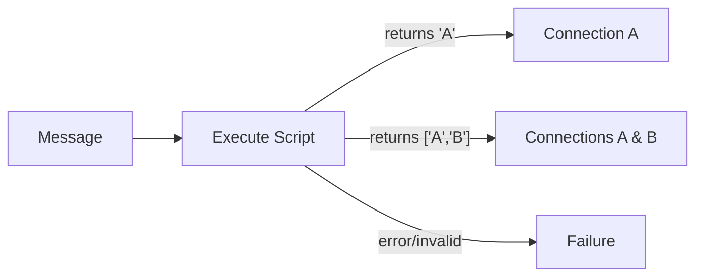

### Example: Severity-Based Routing

**Configuration:**
```json
{
  "scriptLang": "TBEL",
  "tbelScript": "var t = msg.temperature;\nif (t > 80) return 'Critical';\nif (t > 60) return 'Warning';\nreturn 'Normal';"
}
```

**Input Message:**
```json
{"temperature": 85}
```

**Result:** Routes via `Critical` connection

### Example: Multi-Target Routing

**Configuration:**
```json
{
  "scriptLang": "TBEL",
  "tbelScript": "var targets = [];\nif (msg.temperature > 30) targets.push('TempAlert');\nif (msg.humidity > 80) targets.push('HumidityAlert');\nreturn targets.length > 0 ? targets : ['Normal'];"
}
```

**Input Message:**
```json
{"temperature": 35, "humidity": 85}
```

**Result:** Routes via both `TempAlert` and `HumidityAlert` connections

### Complete Example: Priority-Based Routing with Fanout

**Use Case**: Route alarm messages to different notification channels based on severity, with critical alarms going to multiple channels simultaneously.

**Input Message:**
```json
{
  "type": "ALARM_CREATED",
  "originator": {
    "entityType": "DEVICE",
    "id": "reactor-3"
  },
  "metadata": {
    "alarmType": "Temperature Exceeded",
    "severity": "CRITICAL",
    "deviceName": "Nuclear-Reactor-3",
    "currentTemp": "950"
  },
  "data": {
    "alarmDetails": {
      "threshold": 800,
      "currentValue": 950,
      "duration": 120
    }
  }
}
```

**Node Configuration:**
```json
{
  "scriptLang": "TBEL",
  "tbelScript": "var severity = metadata.severity;\nvar targets = [];\n\nif (severity === 'CRITICAL') {\n  // Critical: notify all channels\n  targets.push('SMS');\n  targets.push('Email');\n  targets.push('PagerDuty');\n  targets.push('Dashboard');\n} else if (severity === 'MAJOR') {\n  // Major: email and dashboard\n  targets.push('Email');\n  targets.push('Dashboard');\n} else if (severity === 'WARNING') {\n  // Warning: dashboard only\n  targets.push('Dashboard');\n} else {\n  // Minor/Indeterminate: log only\n  targets.push('Log');\n}\n\nreturn targets;"
}
```

**Output**: Routes to **4 connections simultaneously**: SMS, Email, PagerDuty, Dashboard

**Downstream Chain Structure**:
- **SMS** → Send SMS notification node
- **Email** → Send Email node with template
- **PagerDuty** → REST API call to PagerDuty
- **Dashboard** → Save to alarm table, trigger WebSocket update

**Why This Works**: Single message fans out to multiple notification channels based on severity. The script ensures appropriate escalation - critical alarms wake up on-call engineers via SMS/pager while minor issues only appear in dashboards.

### Complete Example: Dynamic Customer Routing

**Use Case**: Route telemetry to different processing chains based on customer subscription tier (stored in metadata).

**Input Message:**
```json
{
  "type": "POST_TELEMETRY_REQUEST",
  "originator": {
    "entityType": "DEVICE",
    "id": "meter-4251"
  },
  "metadata": {
    "customerId": "cust-enterprise-42",
    "customerTier": "enterprise",
    "features": "analytics,alerts,export"
  },
  "data": {
    "energy": 125.5,
    "power": 4200,
    "voltage": 230
  }
}
```

**Node Configuration:**
```json
{
  "scriptLang": "TBEL",
  "tbelScript": "var tier = metadata.customerTier;\nvar features = metadata.features ? metadata.features.split(',') : [];\n\nvar targets = [];\n\n// All tiers get basic processing\ntargets.push('SaveTelemetry');\n\n// Enterprise tier gets advanced features\nif (tier === 'enterprise') {\n  if (features.indexOf('analytics') >= 0) {\n    targets.push('RealTimeAnalytics');\n  }\n  if (features.indexOf('alerts') >= 0) {\n    targets.push('AdvancedAlerts');\n  }\n  if (features.indexOf('export') >= 0) {\n    targets.push('DataExport');\n  }\n} else if (tier === 'professional') {\n  if (features.indexOf('alerts') >= 0) {\n    targets.push('BasicAlerts');\n  }\n} // Free tier: only SaveTelemetry\n\nreturn targets;"
}
```

**Output**: Routes to **4 connections**: SaveTelemetry, RealTimeAnalytics, AdvancedAlerts, DataExport

**Why This Works**: Single switch node implements feature gating based on customer subscription. Enterprise customers get additional processing (analytics, advanced alerts, export) while free users only get basic telemetry storage. Metadata-driven routing allows per-customer feature control without code changes.

### Configuration Tips

| Scenario | Recommended Approach | Rationale |
|----------|---------------------|-----------|
| 2-3 severity levels | Return single string per level | Simpler than filter chain |
| Fanout to multiple targets | Return array of connection names | Single message goes everywhere |
| All messages need default path | Include fallback: `return ['Default'];` | Prevents dropped messages |
| Dynamic connection names | Build strings: `return 'Priority_' + priority;` | Flexible routing |
| Conditional fanout | Build array conditionally: `if (x) arr.push('Y');` | Selective multi-target |
| Performance-critical | Minimize array operations | Array creation has overhead |
| Complex routing logic | Break into multiple smaller switches | Easier to debug and maintain |

### Performance Considerations

| Practice | Impact | Recommendation |
|----------|--------|----------------|
| Array creation for single target | Minimal overhead | Return string directly for single target |
| Large fanout (>5 targets) | Message cloning overhead | Consider if all targets really need message |
| String concatenation in loop | Moderate (1-5ms) | Pre-build connection name lookup |
| Complex nested if/else | Readability, not performance | Refactor to lookup table or map |
| Switch after expensive enrichment | Wasted computation if routed away | Place switches early when possible |

---

## Message Type Switch

Routes messages based on the message type. Provides one output connection per message type.

### Processing Flow

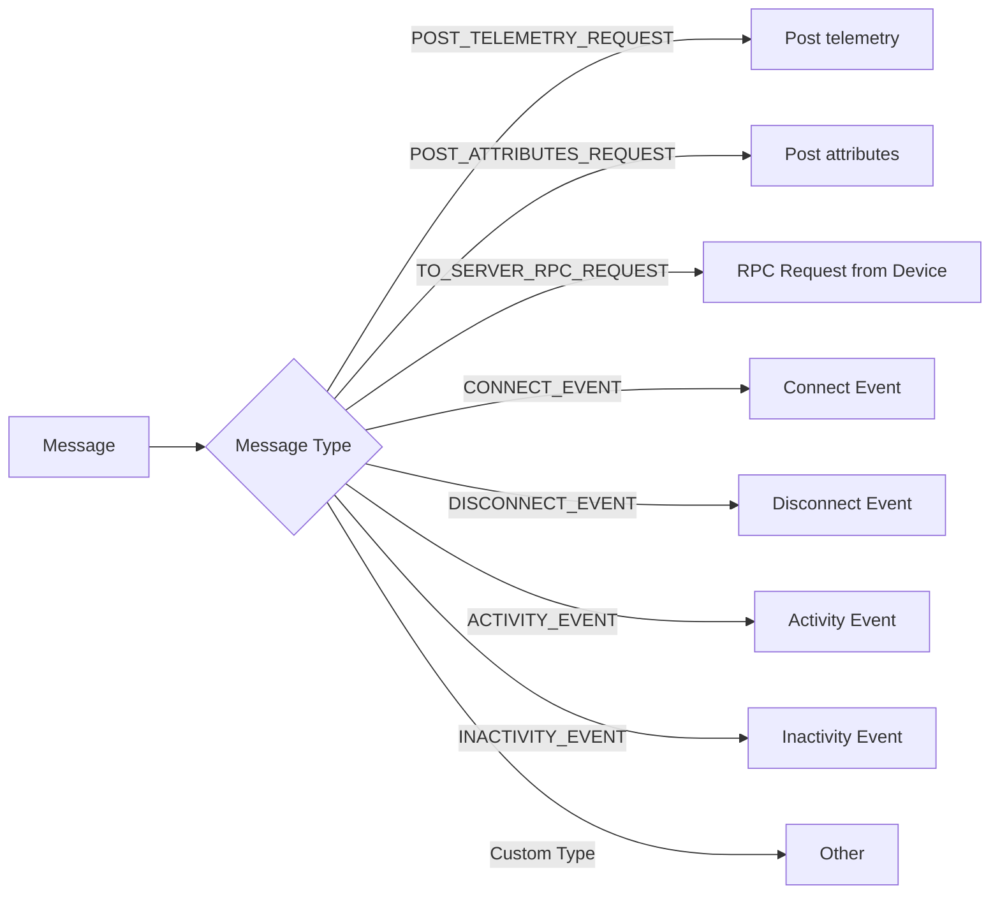

### Standard Output Connections

| Connection Name | Message Type |
|-----------------|--------------|
| Post telemetry | POST_TELEMETRY_REQUEST |
| Post attributes | POST_ATTRIBUTES_REQUEST |
| RPC Request from Device | TO_SERVER_RPC_REQUEST |
| RPC Request to Device | RPC_CALL_FROM_SERVER_TO_DEVICE |
| Connect Event | CONNECT_EVENT |
| Disconnect Event | DISCONNECT_EVENT |
| Activity Event | ACTIVITY_EVENT |
| Inactivity Event | INACTIVITY_EVENT |
| Entity Created | ENTITY_CREATED |
| Entity Updated | ENTITY_UPDATED |
| Entity Deleted | ENTITY_DELETED |
| Attributes Updated | ATTRIBUTES_UPDATED |
| Attributes Deleted | ATTRIBUTES_DELETED |
| Other | Any unmatched type |

### Configuration

No configuration required. Output connections are determined by message type.

---

## Message Type Filter

Filters messages by checking if the message type matches any of the specified types.

### Configuration

| Field | Type | Description |
|-------|------|-------------|
| messageTypes | string[] | List of message types to accept |

### Processing Flow

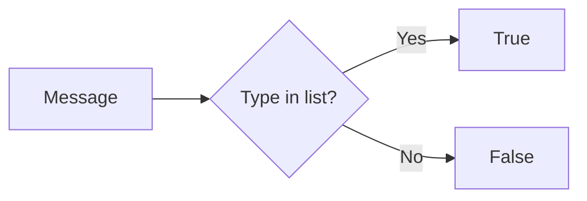

### Example Configuration

```json
{
  "messageTypes": [
    "POST_TELEMETRY_REQUEST",
    "POST_ATTRIBUTES_REQUEST"
  ]
}
```

---

## Entity Type Switch

Routes messages based on the originator entity type.

### Output Connections

| Connection | Entity Type |
|------------|-------------|
| Device | DEVICE |
| Asset | ASSET |
| Customer | CUSTOMER |
| Tenant | TENANT |
| User | USER |
| Dashboard | DASHBOARD |
| Alarm | ALARM |
| Entity View | ENTITY_VIEW |
| Edge | EDGE |

### Processing Flow

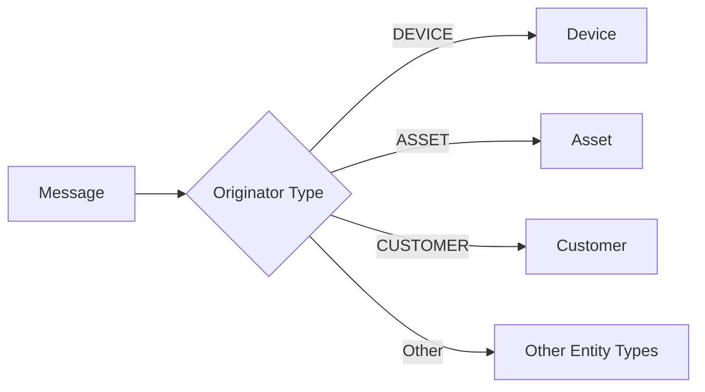

---

## Entity Type Filter

Filters messages by checking if the originator entity type matches the specified type.

### Configuration

| Field | Type | Description |
|-------|------|-------------|
| entityType | string | Entity type to match (DEVICE, ASSET, etc.) |

### Example Configuration

```json
{
  "entityType": "DEVICE"
}
```

---

## Check Relation Presence

Verifies whether a relation exists between the message originator and another entity.

### When to Use

**Primary Use Cases:**
- **Authorization checks** - Verify device belongs to correct customer before processing
- **Topology validation** - Ensure device is assigned to an asset before aggregating data
- **Conditional processing** - Route messages differently based on entity relationships
- **Hierarchical filtering** - Check if entity is part of specific group or zone
- **Access control** - Validate user has permission to access device (via relations)

**Not Recommended For:**
- Loading related entity data (use Enrichment nodes - Check Relation only validates existence)
- Creating relations (use Create Relation action node)
- Complex multi-hop traversals (high performance cost - pre-calculate if possible)
- Static relationships that never change (consider caching in attributes)

### Configuration

| Field | Type | Description |
|-------|------|-------------|
| direction | enum | FROM (outgoing) or TO (incoming) |
| relationType | string | Relation type to check (e.g., "Contains", "Manages") |
| checkForSingleEntity | boolean | Check specific entity vs. any entity |
| entityType | string | Target entity type (when checkForSingleEntity=true) |
| entityId | UUID | Target entity ID (when checkForSingleEntity=true) |

### Direction Semantics

| Direction | Meaning |
|-----------|---------|
| FROM | Check if originator has outgoing relation to target |
| TO | Check if originator has incoming relation from target |

### Processing Flow

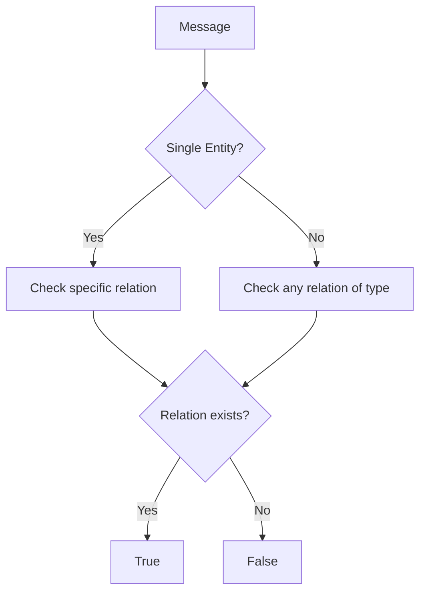

### Example: Check Device Belongs to Asset

**Configuration:**
```json
{
  "direction": "TO",
  "relationType": "Contains",
  "checkForSingleEntity": false,
  "entityType": "ASSET"
}
```

This checks if any Asset has a "Contains" relation TO the device (device is contained by some asset).

### Complete Example: Understanding FROM vs TO Direction

**Relationship Setup** (in platform):
- Asset "Building-A" (ID: `asset-building-a`)
- Device "TempSensor-42" (ID: `device-sensor-42`)
- Relation: `asset-building-a` --[Contains]--> `device-sensor-42`

In database terms:
- **FROM** entity: `asset-building-a`
- **TO** entity: `device-sensor-42`
- **Relation Type**: "Contains"

**Scenario 1: Check if Device belongs to any Asset (Incoming Check)**

**Input Message** (originator is Device):
```json
{
  "type": "POST_TELEMETRY_REQUEST",
  "originator": {
    "entityType": "DEVICE",
    "id": "device-sensor-42"
  },
  "data": {
    "temperature": 25.5
  }
}
```

**Node Configuration**:
```json
{
  "direction": "TO",
  "relationType": "Contains",
  "checkForSingleEntity": false,
  "entityType": "ASSET"
}
```

**Logical Question**: "Does any Asset have a Contains relation TO this device?"
**Translation**: "Is this device contained by any Asset?"
**Result**: Routes to **True** (Building-A contains this device)

**Why "TO" Direction**: The relation points **TO** the device (the originator). We're checking if something else (an Asset) has a relation pointing to our device.

**Scenario 2: Check if Asset contains any Devices (Outgoing Check)**

**Input Message** (originator is Asset):
```json
{
  "type": "ATTRIBUTES_UPDATED",
  "originator": {
    "entityType": "ASSET",
    "id": "asset-building-a"
  },
  "data": {
    "occupancy": "full"
  }
}
```

**Node Configuration**:
```json
{
  "direction": "FROM",
  "relationType": "Contains",
  "checkForSingleEntity": false,
  "entityType": "DEVICE"
}
```

**Logical Question**: "Does this Asset have a Contains relation FROM itself to any Device?"
**Translation**: "Does this Asset contain any Devices?"
**Result**: Routes to **True** (Building-A contains device-sensor-42)

**Why "FROM" Direction**: The relation points **FROM** the asset (the originator) to something else. We're checking if our asset has outgoing relations to devices.

### Direction Quick Reference

```
Originator: Device → Check if contained by Asset
┌────────────┐              ┌───────────┐
│   Asset    │──[Contains]──▶│  Device   │◄── Originator
└────────────┘              └───────────┘
                                 ▲
                                 │
                        Use direction: "TO"
                        (relation points TO originator)

Originator: Asset → Check if contains Devices
┌────────────┐              ┌───────────┐
│   Asset    │──[Contains]──▶│  Device   │
└────────────┘              └───────────┘
     ▲
     │
 Originator
 Use direction: "FROM"
 (relation points FROM originator)
```

### Configuration Tips

| Scenario | Direction | Rationale |
|----------|-----------|-----------|
| Check if device assigned to asset | TO | Asset → Device (relation points TO device) |
| Check if asset has devices | FROM | Asset → Device (relation points FROM asset) |
| Check if device managed by customer | TO | Customer → Device (relation points TO device) |
| Check if user has access to entity | FROM | User → Entity (relation points FROM user) |
| Multi-hop parent check | TO with maxLevel > 1 | Traverse up hierarchy |
| Multi-hop child check | FROM with maxLevel > 1 | Traverse down hierarchy |

### Common Direction Mistakes

| Mistake | Symptom | Fix |
|---------|---------|-----|
| Used FROM when checking parent | Always routes to False | Change to TO (parent relation points TO child) |
| Used TO when checking children | Always routes to False | Change to FROM (parent relation points FROM itself) |
| Confused relation name | Always routes to False | Use "Contains", not "Contained By" (one relation type) |
| Forgot relation case-sensitivity | Always routes to False | Use exact relation type: "Contains" not "contains" |

---

## Check Fields Presence

Checks if specified fields exist in the message payload or metadata.

### Configuration

| Field | Type | Description |
|-------|------|-------------|
| messageNames | string[] | Fields to check in message payload |
| metadataNames | string[] | Fields to check in metadata |
| checkAllKeys | boolean | All fields must exist (AND) vs. any field (OR) |

### Processing Flow

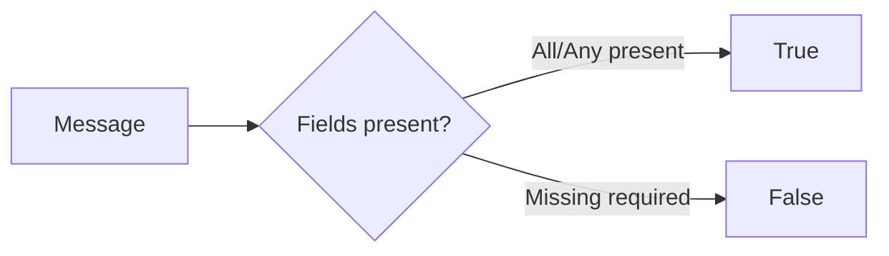

### Example: Require Temperature and Humidity

**Configuration:**
```json
{
  "messageNames": ["temperature", "humidity"],
  "metadataNames": [],
  "checkAllKeys": true
}
```

---

## Check Alarm Status

Routes alarm messages based on their status.

### Output Connections

| Connection | Alarm Status |
|------------|--------------|
| Active Acknowledged | ACTIVE_ACK |
| Active Unacknowledged | ACTIVE_UNACK |
| Cleared Acknowledged | CLEARED_ACK |
| Cleared Unacknowledged | CLEARED_UNACK |

### Processing Flow

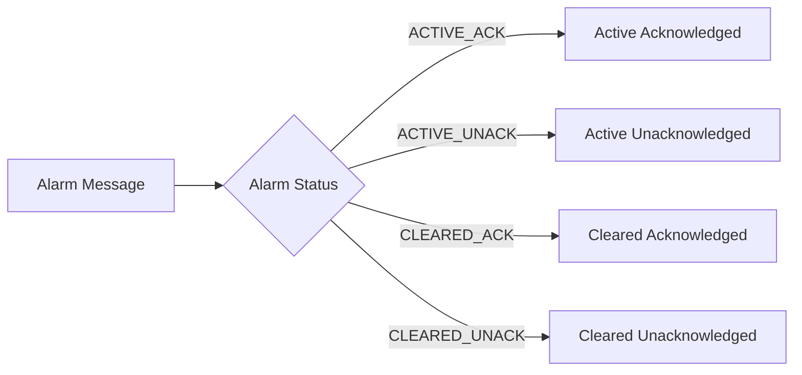

---

## GPS Geofencing Filter

Filters messages based on whether GPS coordinates fall within or outside defined geographic boundaries.

### Configuration

| Field | Type | Description |
|-------|------|-------------|
| latitudeKeyName | string | Message key containing latitude |
| longitudeKeyName | string | Message key containing longitude |
| perimeterType | enum | CIRCLE or POLYGON |
| centerLatitude | number | Circle center latitude (CIRCLE only) |
| centerLongitude | number | Circle center longitude (CIRCLE only) |
| range | number | Circle radius in meters (CIRCLE only) |
| polygonDefinition | string | GeoJSON polygon (POLYGON only) |
| fetchPerimeterInfoFromMessageMetadata | boolean | Get perimeter from metadata |

### Perimeter Types

| Type | Parameters |
|------|------------|
| CIRCLE | Center point (lat, lng) + radius |
| POLYGON | GeoJSON polygon coordinates |

### Processing Flow

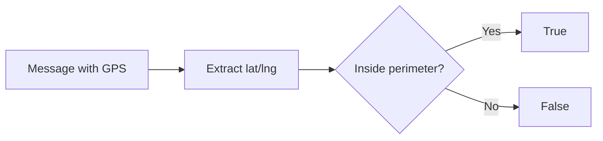

### Example: Circle Geofence

**Configuration:**
```json
{
  "latitudeKeyName": "latitude",
  "longitudeKeyName": "longitude",
  "perimeterType": "CIRCLE",
  "centerLatitude": 37.7749,
  "centerLongitude": -122.4194,
  "range": 1000,
  "fetchPerimeterInfoFromMessageMetadata": false
}
```

---

## Device Profile Switch

Routes messages based on the device profile of the originator device.

### Processing Flow

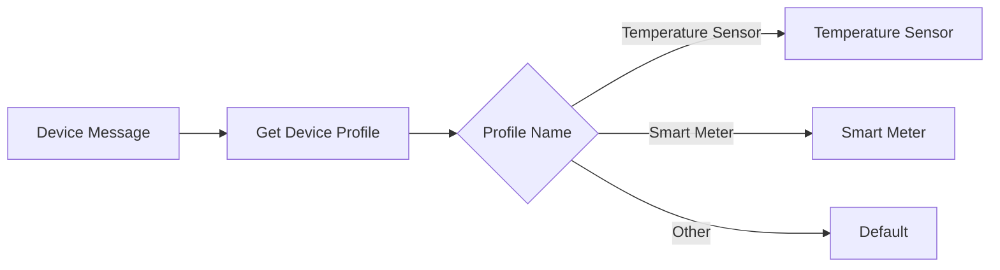

### Output Connections

Output connections are dynamically created based on device profile names in the system.

---

## Asset Profile Switch

Routes messages based on the asset profile of the originator asset.

### Processing Flow

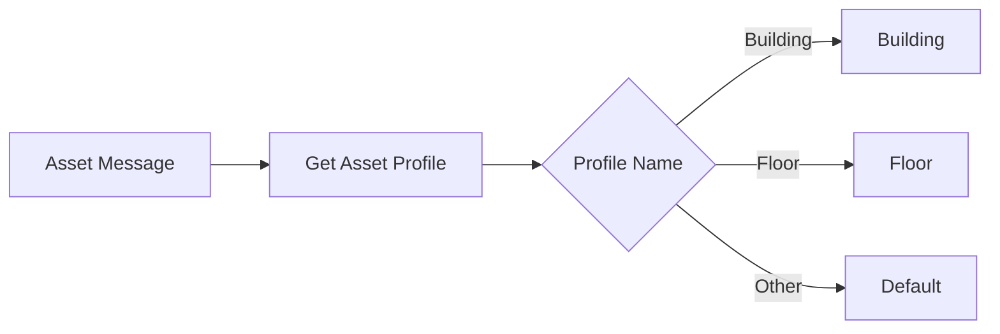

---

## Common Patterns

### Filter Chain Pattern

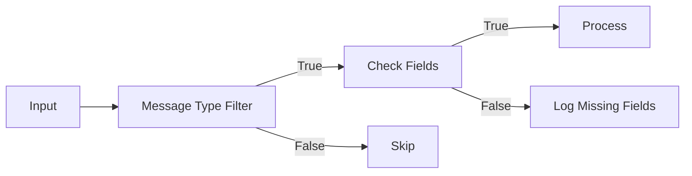

### Multi-Stage Routing

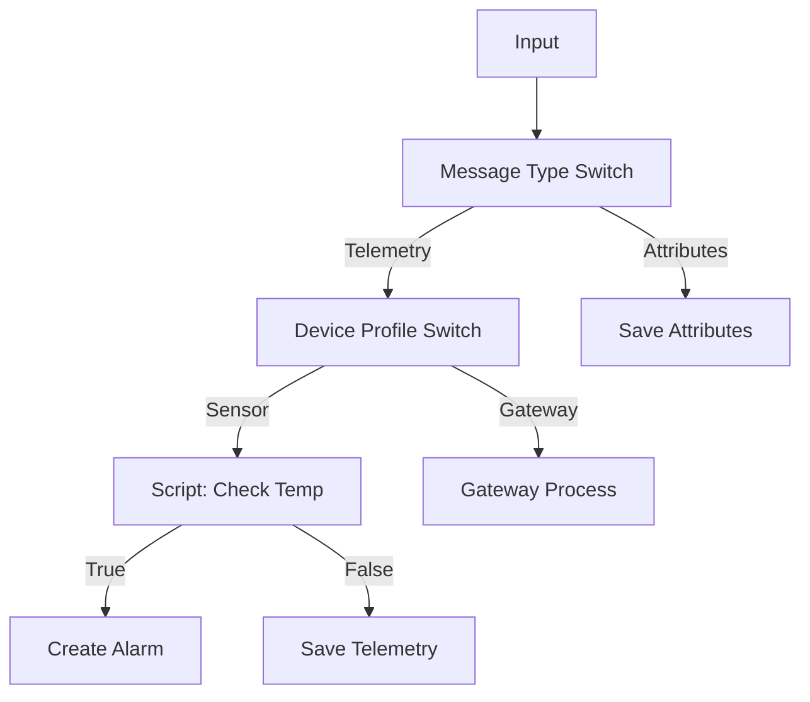

### Geofence Alert Pattern

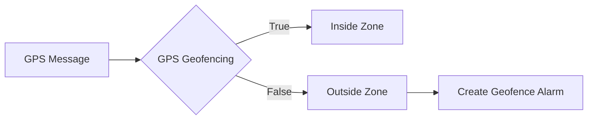

## Common Pitfalls

### Script Filter

| Pitfall | Impact | Solution |
|---------|--------|----------|
| Missing null checks | Runtime exceptions route to Failure | Always check `msg.field != null` before comparison |
| Returning non-boolean | Message routes to Failure | Ensure script returns explicit `true` or `false` |
| Complex calculations in filter | Performance degradation | Pre-calculate in enrichment or transformation node |
| Accessing missing metadata keys | NullPointerException | Use safe navigation: `metadata.?key` or check existence first |
| Using JavaScript instead of TBEL | 10-100x slower performance | Prefer TBEL for simple conditions; reserve JS for complex logic |

### Switch Node

| Pitfall | Impact | Solution |
|---------|--------|----------|
| Returning single string as array | Type error | Return string directly, not `['value']` |
| Invalid connection names | Messages route to Failure | Ensure returned strings match connected relation names |
| No matching connection | Message dropped | Connect all expected return values or add fallback logic |
| Dynamic routing without validation | Unexpected behavior | Test all possible return values |

### Message Type Switch / Filter

| Pitfall | Impact | Solution |
|---------|--------|----------|
| No "Other" handler | Unknown message types fail | Connect "Other" relation to log or generic handler |
| Case-sensitive type comparison | Messages not routed | Use exact message type constants (POST_TELEMETRY_REQUEST, not post_telemetry) |
| Filtering custom message types | Switch only handles standard types | Add Script Filter after switch for custom types |
| Multiple switches in series | Complexity and performance impact | Combine into single Switch node with routing logic |

### Entity Type Switch / Filter

| Pitfall | Impact | Solution |
|---------|--------|----------|
| Wrong entity type assumption | Messages misrouted | Verify originator type with enrichment before filtering |
| No default handler | Unexpected entity types fail | Connect default relation for unknown entity types |
| Type vs subtype confusion | Devices filtered incorrectly | Use Entity Type Switch for DEVICE/ASSET, Device Profile Switch for device types |

### Check Relation

| Pitfall | Impact | Solution |
|---------|--------|----------|
| Wrong relation direction | Cannot find existing relations | FROM means originator→related; TO means related→originator |
| Relation type typo | Always routes to False | Use relation type constants from system (case-sensitive) |
| Checking transitive relations | Only checks direct relations | Set `maxLevel > 1` for multi-hop checks; be aware of performance impact |
| Entity type mismatch | Relation check fails | Verify both entities support the relation type |

### Check Fields Presence

| Pitfall | Impact | Solution |
|---------|--------|----------|
| Checking nested fields | Node only checks top-level keys | Use Script Filter with path navigation for nested fields |
| Field exists but null/empty | Presence check passes but value unusable | Combine with Script Filter to validate values |
| Case-sensitive field names | Field not found | Ensure exact field name match including case |

### Check Alarm Status

| Pitfall | Impact | Solution |
|---------|--------|----------|
| Alarm type doesn't match | No alarm found | Use same alarm type pattern as in Create Alarm |
| Status changed during processing | Status check stale | Process quickly after status check |
| Multiple alarms same type | Only checks latest | Be specific with alarm type patterns |

### GPS Geofencing Filter

| Pitfall | Impact | Solution |
|---------|--------|----------|
| Missing latitude/longitude | Filter routes to Failure | Validate GPS coordinates exist in enrichment node |
| Coordinates in wrong format | Parsing errors | Ensure lat/lon are numeric values in decimal degrees |
| Invalid perimeter definition | Incorrect zone detection | Test perimeter with known coordinates |
| High-precision requirements | GPS accuracy limitations | Consider GPS accuracy in perimeter size |

### Device/Asset Profile Switch

| Pitfall | Impact | Solution |
|---------|--------|----------|
| Profile name changes | Routing breaks | Use profile ID patterns when possible |
| No default profile handler | Messages from new profiles fail | Connect default relation for unmatched profiles |
| Profile switch before enrichment | Profile information not available | Load profile data via enrichment if needed for routing |

## Best Practices

1. **Use filters early** - Discard irrelevant messages at the start of the chain
2. **Prefer built-in filters** - Message Type Switch is faster than script-based filtering
3. **Combine with enrichment** - Enrich messages before complex script filtering
4. **Handle failures** - Always connect Failure output to error handling
5. **Test script performance** - Complex scripts add latency to every message

## See Also

- [Action Nodes](./action-nodes.md) - Perform operations on messages
- [Enrichment Nodes](./enrichment-nodes.md) - Add data to messages
- [Node Categories](../node-categories.md) - All node categories
- [Rule Chain Structure](../rule-chain-structure.md) - Chain composition
