# Filter Nodes Reference

## Overview

Filter nodes evaluate conditions and route messages to different output connections based on the result. They form the decision-making layer in rule chains, enabling conditional processing based on message content, type, originator, relations, and custom logic. Most filter nodes output to `True`/`False` connections, while switch nodes support multiple dynamic outputs.

## Node Quick Reference

| Node | Class | Description | Output Relations |
|------|-------|-------------|------------------|
| Script | TbJsFilterNode | Filter using TBEL/JavaScript | True, False, Failure |
| Switch | TbJsSwitchNode | Custom routing script | Dynamic, Failure |
| Message Type Switch | TbMsgTypeSwitchNode | Route by message type | Per type + Other |
| Message Type Filter | TbMsgTypeFilterNode | Filter specific types | True, False, Failure |
| Entity Type Switch | TbOriginatorTypeSwitchNode | Route by originator type | Per entity type |
| Entity Type Filter | TbOriginatorTypeFilterNode | Filter by originator type | True, False, Failure |
| Check Relation | TbCheckRelationNode | Check relation exists | True, False, Failure |
| Check Fields | TbCheckMessageNode | Check fields exist | True, False, Failure |
| Check Alarm Status | TbCheckAlarmStatusNode | Check alarm status | Per status |
| GPS Geofencing | TbGpsGeofencingFilterNode | Geographic filtering | True, False, Failure |
| Device Profile Switch | TbDeviceTypeSwitchNode | Route by device profile | Per profile |
| Asset Profile Switch | TbAssetTypeSwitchNode | Route by asset profile | Per profile |

---

## Script Filter

Executes a user-defined function that returns a boolean value. Routes messages via `True` if the function returns `true`, or via `False` if it returns `false`.

### Configuration

| Field | Type | Description |
|-------|------|-------------|
| scriptLang | enum | TBEL or JS |
| tbelScript | string | TBEL script body (when scriptLang=TBEL) |
| jsScript | string | JavaScript script body (when scriptLang=JS) |

### Script Variables

| Variable | Type | Description |
|----------|------|-------------|
| msg | object | Message payload (JSON object or array) |
| metadata | object/Map | Message metadata (all values are strings) |
| msgType | string | Message type (e.g., "POST_TELEMETRY_REQUEST") |

### Processing Flow

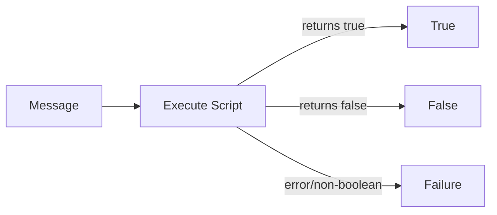

### Output Connections

| Connection | Condition |
|------------|-----------|
| True | Script returns `true` |
| False | Script returns `false` |
| Failure | Script returns non-boolean, throws error, or cannot be evaluated |

### Example: Temperature Threshold Check (TBEL)

**Configuration:**
```json
{
  "scriptLang": "TBEL",
  "tbelScript": "return msg.temperature > 25;"
}
```

**Input Message:**
```json
{
  "temperature": 30.5,
  "humidity": 65
}
```

**Result:** Routes via `True` (30.5 > 25)

### Example: Dynamic Threshold from Metadata (JavaScript)

**Configuration:**
```json
{
  "scriptLang": "JS",
  "jsScript": "if (msgType !== 'POST_TELEMETRY_REQUEST') return false;\nfor (var key in msg) {\n  var thresholdKey = key + 'Threshold';\n  if (typeof msg[key] === 'number' && metadata[thresholdKey]) {\n    if (msg[key] > Number(metadata[thresholdKey])) return true;\n  }\n}\nreturn false;"
}
```

**Input Message:**
```json
{"temperature": 45.2, "humidity": 80}
```

**Metadata:**
```json
{"temperatureThreshold": "45.0", "humidityThreshold": "85"}
```

**Result:** Routes via `True` (temperature 45.2 > threshold 45.0)

---

## Switch

Executes a user-defined function that returns connection labels for routing. Supports routing to multiple connections simultaneously.

### Configuration

| Field | Type | Description |
|-------|------|-------------|
| scriptLang | enum | TBEL or JS |
| tbelScript | string | TBEL script body |
| jsScript | string | JavaScript script body |

### Script Return Types

| Return Type | Behavior |
|-------------|----------|
| string | Routes to single connection with that name |
| string[] | Routes to multiple connections |
| other | Routes to Failure |

### Processing Flow

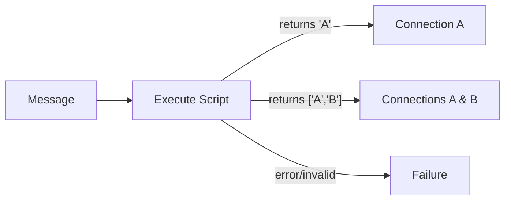

### Example: Severity-Based Routing

**Configuration:**
```json
{
  "scriptLang": "TBEL",
  "tbelScript": "var t = msg.temperature;\nif (t > 80) return 'Critical';\nif (t > 60) return 'Warning';\nreturn 'Normal';"
}
```

**Input Message:**
```json
{"temperature": 85}
```

**Result:** Routes via `Critical` connection

### Example: Multi-Target Routing

**Configuration:**
```json
{
  "scriptLang": "TBEL",
  "tbelScript": "var targets = [];\nif (msg.temperature > 30) targets.push('TempAlert');\nif (msg.humidity > 80) targets.push('HumidityAlert');\nreturn targets.length > 0 ? targets : ['Normal'];"
}
```

**Input Message:**
```json
{"temperature": 35, "humidity": 85}
```

**Result:** Routes via both `TempAlert` and `HumidityAlert` connections

---

## Message Type Switch

Routes messages based on the message type. Provides one output connection per message type.

### Processing Flow

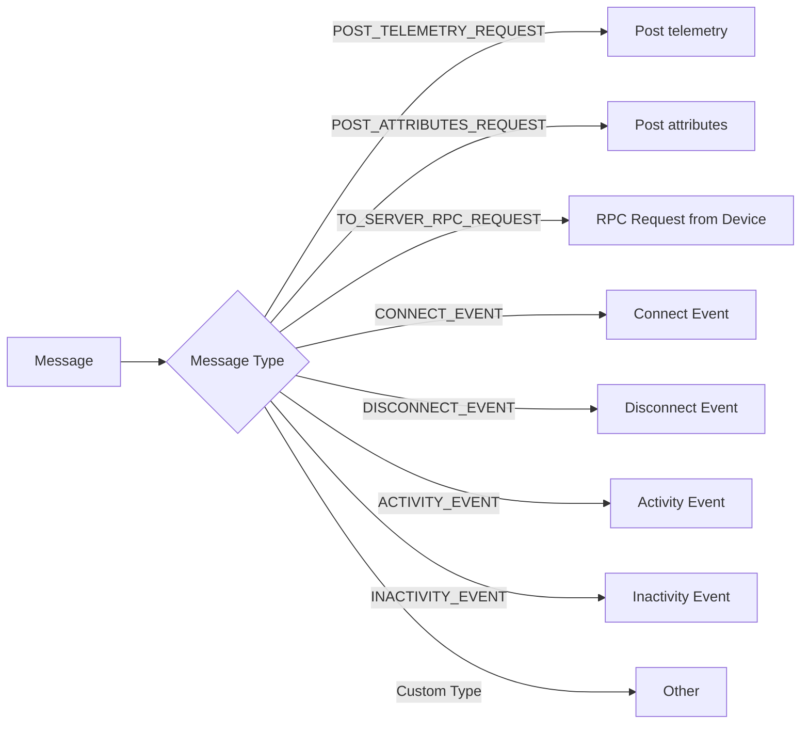

### Standard Output Connections

| Connection Name | Message Type |
|-----------------|--------------|
| Post telemetry | POST_TELEMETRY_REQUEST |
| Post attributes | POST_ATTRIBUTES_REQUEST |
| RPC Request from Device | TO_SERVER_RPC_REQUEST |
| RPC Request to Device | RPC_CALL_FROM_SERVER_TO_DEVICE |
| Connect Event | CONNECT_EVENT |
| Disconnect Event | DISCONNECT_EVENT |
| Activity Event | ACTIVITY_EVENT |
| Inactivity Event | INACTIVITY_EVENT |
| Entity Created | ENTITY_CREATED |
| Entity Updated | ENTITY_UPDATED |
| Entity Deleted | ENTITY_DELETED |
| Attributes Updated | ATTRIBUTES_UPDATED |
| Attributes Deleted | ATTRIBUTES_DELETED |
| Other | Any unmatched type |

### Configuration

No configuration required. Output connections are determined by message type.

---

## Message Type Filter

Filters messages by checking if the message type matches any of the specified types.

### Configuration

| Field | Type | Description |
|-------|------|-------------|
| messageTypes | string[] | List of message types to accept |

### Processing Flow

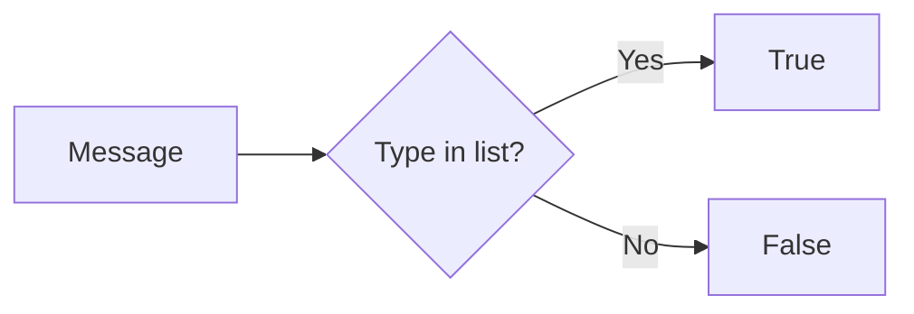

### Example Configuration

```json
{
  "messageTypes": [
    "POST_TELEMETRY_REQUEST",
    "POST_ATTRIBUTES_REQUEST"
  ]
}
```

---

## Entity Type Switch

Routes messages based on the originator entity type.

### Output Connections

| Connection | Entity Type |
|------------|-------------|
| Device | DEVICE |
| Asset | ASSET |
| Customer | CUSTOMER |
| Tenant | TENANT |
| User | USER |
| Dashboard | DASHBOARD |
| Alarm | ALARM |
| Entity View | ENTITY_VIEW |
| Edge | EDGE |

### Processing Flow

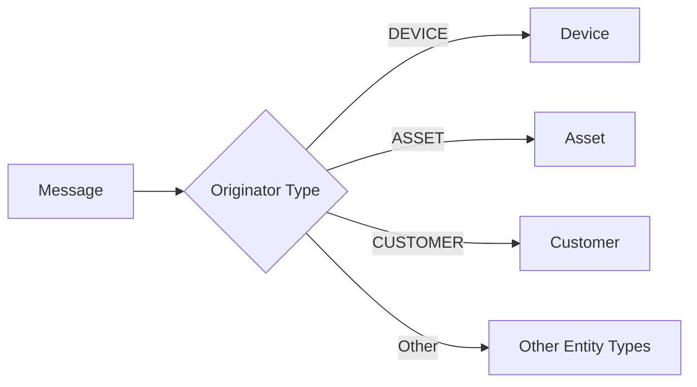

---

## Entity Type Filter

Filters messages by checking if the originator entity type matches the specified type.

### Configuration

| Field | Type | Description |
|-------|------|-------------|
| entityType | string | Entity type to match (DEVICE, ASSET, etc.) |

### Example Configuration

```json
{
  "entityType": "DEVICE"
}
```

---

## Check Relation Presence

Verifies whether a relation exists between the message originator and another entity.

### Configuration

| Field | Type | Description |
|-------|------|-------------|
| direction | enum | FROM (outgoing) or TO (incoming) |
| relationType | string | Relation type to check (e.g., "Contains", "Manages") |
| checkForSingleEntity | boolean | Check specific entity vs. any entity |
| entityType | string | Target entity type (when checkForSingleEntity=true) |
| entityId | UUID | Target entity ID (when checkForSingleEntity=true) |

### Direction Semantics

| Direction | Meaning |
|-----------|---------|
| FROM | Check if originator has outgoing relation to target |
| TO | Check if originator has incoming relation from target |

### Processing Flow

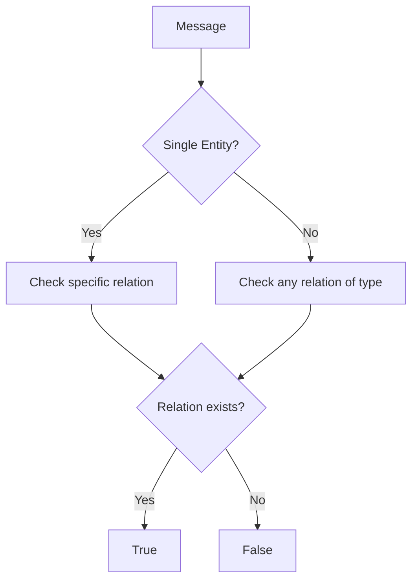

### Example: Check Device Belongs to Asset

**Configuration:**
```json
{
  "direction": "TO",
  "relationType": "Contains",
  "checkForSingleEntity": false,
  "entityType": "ASSET"
}
```

This checks if any Asset has a "Contains" relation TO the device (device is contained by some asset).

---

## Check Fields Presence

Checks if specified fields exist in the message payload or metadata.

### Configuration

| Field | Type | Description |
|-------|------|-------------|
| messageNames | string[] | Fields to check in message payload |
| metadataNames | string[] | Fields to check in metadata |
| checkAllKeys | boolean | All fields must exist (AND) vs. any field (OR) |

### Processing Flow

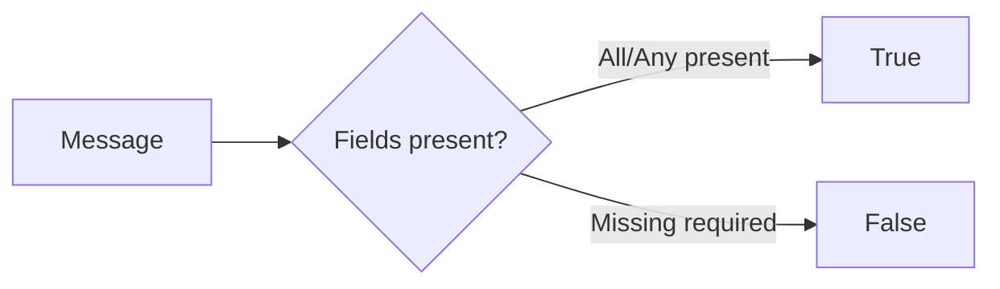

### Example: Require Temperature and Humidity

**Configuration:**
```json
{
  "messageNames": ["temperature", "humidity"],
  "metadataNames": [],
  "checkAllKeys": true
}
```

---

## Check Alarm Status

Routes alarm messages based on their status.

### Output Connections

| Connection | Alarm Status |
|------------|--------------|
| Active Acknowledged | ACTIVE_ACK |
| Active Unacknowledged | ACTIVE_UNACK |
| Cleared Acknowledged | CLEARED_ACK |
| Cleared Unacknowledged | CLEARED_UNACK |

### Processing Flow

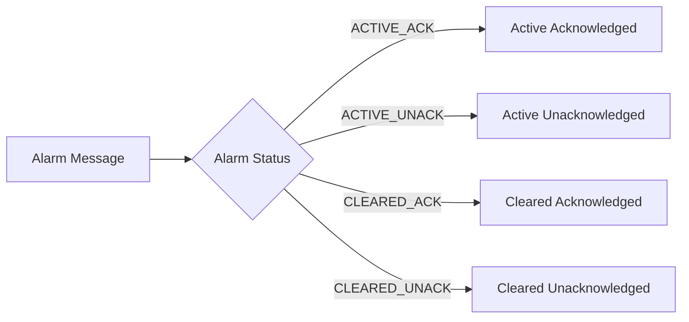

---

## GPS Geofencing Filter

Filters messages based on whether GPS coordinates fall within or outside defined geographic boundaries.

### Configuration

| Field | Type | Description |
|-------|------|-------------|
| latitudeKeyName | string | Message key containing latitude |
| longitudeKeyName | string | Message key containing longitude |
| perimeterType | enum | CIRCLE or POLYGON |
| centerLatitude | number | Circle center latitude (CIRCLE only) |
| centerLongitude | number | Circle center longitude (CIRCLE only) |
| range | number | Circle radius in meters (CIRCLE only) |
| polygonDefinition | string | GeoJSON polygon (POLYGON only) |
| fetchPerimeterInfoFromMessageMetadata | boolean | Get perimeter from metadata |

### Perimeter Types

| Type | Parameters |
|------|------------|
| CIRCLE | Center point (lat, lng) + radius |
| POLYGON | GeoJSON polygon coordinates |

### Processing Flow

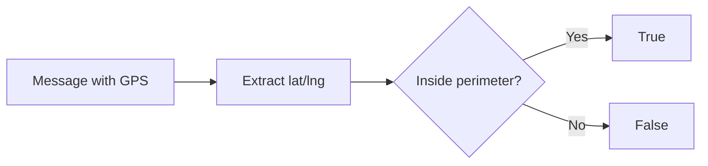

### Example: Circle Geofence

**Configuration:**
```json
{
  "latitudeKeyName": "latitude",
  "longitudeKeyName": "longitude",
  "perimeterType": "CIRCLE",
  "centerLatitude": 37.7749,
  "centerLongitude": -122.4194,
  "range": 1000,
  "fetchPerimeterInfoFromMessageMetadata": false
}
```

---

## Device Profile Switch

Routes messages based on the device profile of the originator device.

### Processing Flow

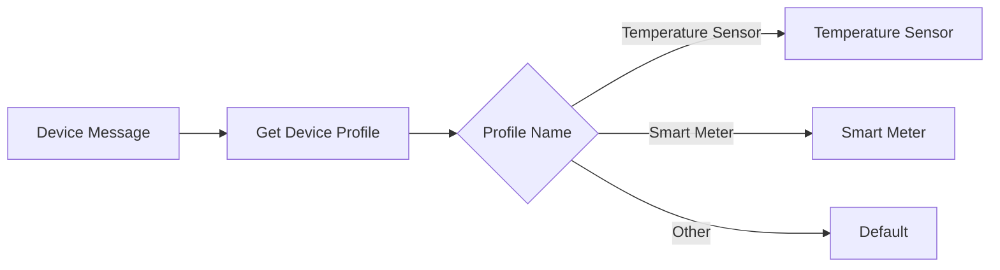

### Output Connections

Output connections are dynamically created based on device profile names in the system.

---

## Asset Profile Switch

Routes messages based on the asset profile of the originator asset.

### Processing Flow

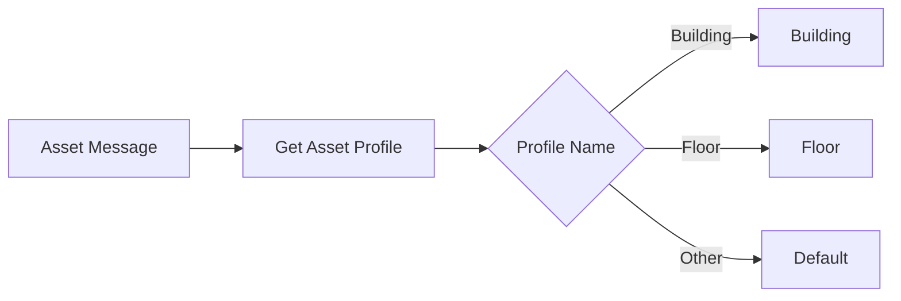

---

## Common Patterns

### Filter Chain Pattern

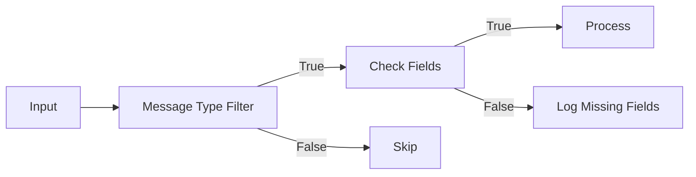

### Multi-Stage Routing

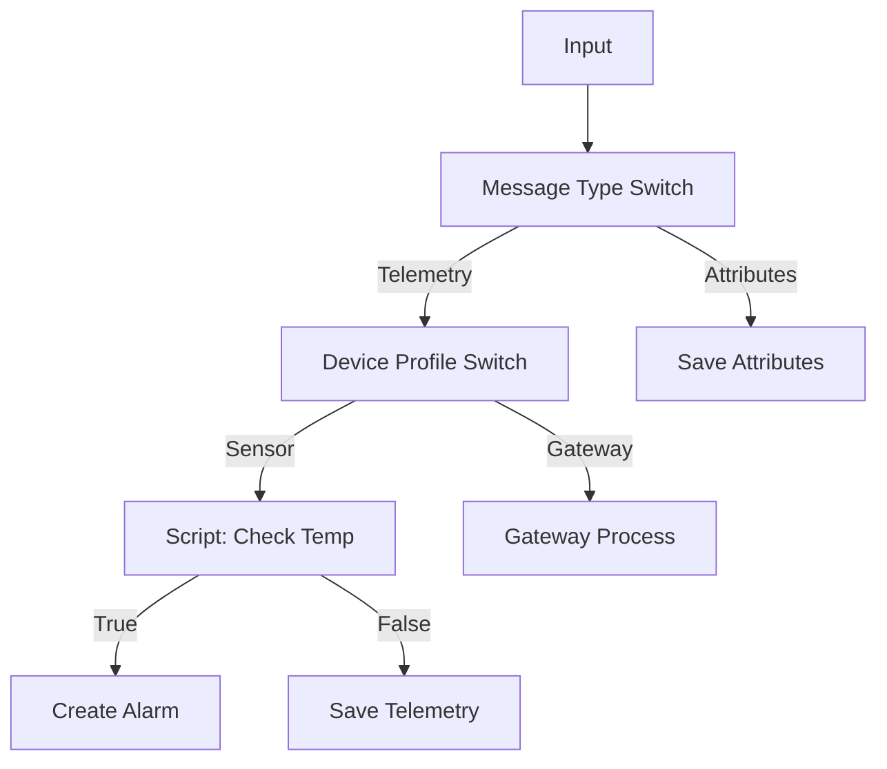

### Geofence Alert Pattern

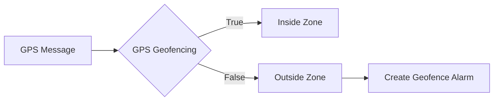

## Best Practices

1. **Use filters early** - Discard irrelevant messages at the start of the chain
2. **Prefer built-in filters** - Message Type Switch is faster than script-based filtering
3. **Combine with enrichment** - Enrich messages before complex script filtering
4. **Handle failures** - Always connect Failure output to error handling
5. **Test script performance** - Complex scripts add latency to every message

## See Also

- [Action Nodes](./action-nodes.md) - Perform operations on messages
- [Enrichment Nodes](./enrichment-nodes.md) - Add data to messages
- [Node Categories](../node-categories.md) - All node categories
- [Rule Chain Structure](../rule-chain-structure.md) - Chain composition
