# Flow Nodes Reference

## Overview

Flow nodes control message routing between rule chains and manage message acknowledgment. They enable modular rule chain design by allowing chains to invoke other chains, return results to parent chains, transfer processing to different queues, and acknowledge message completion.

## Node Quick Reference

| Node | Class | Description | Has Output |
|------|-------|-------------|------------|
| Rule Chain | TbRuleChainInputNode | Transfer to another rule chain | Yes (custom) |
| Output | TbRuleChainOutputNode | Return to parent rule chain | No |
| Checkpoint | TbCheckpointNode | Transfer to different queue | Yes |
| Acknowledge | TbAckNode | Acknowledge message processing | Yes |

---

## Rule Chain Input Node

Transfers message processing to another rule chain. When the target chain completes (via Output nodes), control returns to this node and routes based on the Output node's name.

### Configuration

| Field | Type | Description |
|-------|------|-------------|
| ruleChainId | UUID | Target rule chain ID |
| forwardMsgToDefaultRuleChain | boolean | Use originator's default chain |

### Dynamic Chain Resolution

When `forwardMsgToDefaultRuleChain` is true:
- For device originators: Uses device profile's default rule chain
- For asset originators: Uses asset profile's default rule chain
- Falls back to tenant root rule chain if not configured

### Processing Flow

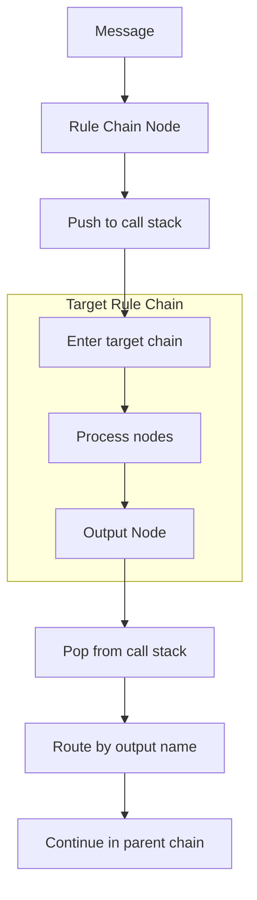

### Output Connections

Output connections are dynamic, determined by the names of Output nodes in the target chain:
- Each Output node name becomes a possible output connection
- If no matching connection exists, message is dropped

### Example Configuration

```json
{
  "ruleChainId": "a1b2c3d4-e5f6-7890-abcd-ef1234567890"
}
```

### Example: Dynamic Profile-Based Processing

```json
{
  "forwardMsgToDefaultRuleChain": true
}
```

This routes messages to the rule chain configured in the device/asset profile.

---

## Rule Chain Output Node

Returns control to the parent rule chain. The node's name becomes the relation type for routing in the parent chain's Rule Chain Input node.

### Configuration

This node has no configuration. Its behavior is determined solely by its **name**, which becomes the output relation type.

### Processing Flow

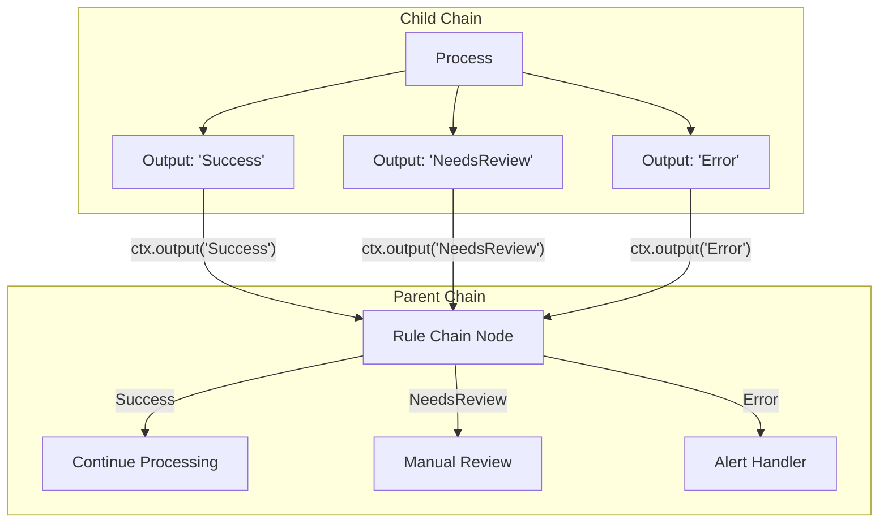

### Naming Convention

Use descriptive names that clearly indicate the processing result:
- `Success` - Processing completed successfully
- `Failure` - Processing failed
- `Timeout` - Operation timed out
- `NeedsReview` - Requires manual intervention
- Custom names for domain-specific outcomes

### Output Node Placement

A rule chain can have multiple Output nodes with different names, allowing fine-grained control flow back to the parent chain.

---

## Checkpoint Node

Transfers message processing to a different queue, enabling isolation and prioritization of different processing workflows.

### Configuration

| Field | Type | Description |
|-------|------|-------------|
| queueName | string | Target queue name |

### Queue Transfer Behavior

When a message reaches a Checkpoint node:
1. Message is re-submitted to the specified queue
2. Original queue slot is released (acknowledged)
3. Processing continues from the root rule chain on the new queue
4. Message retains originator, type, payload, and metadata

### Processing Flow

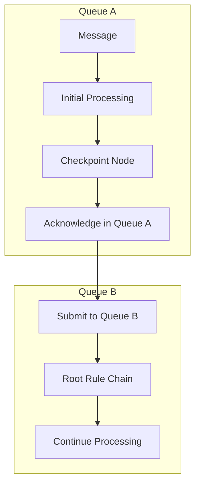

### Example Configuration

```json
{
  "queueName": "HighPriority"
}
```

### Use Cases

| Use Case | Description |
|----------|-------------|
| Priority escalation | Move urgent messages to high-priority queue |
| Isolation | Separate external API calls from critical path |
| Load distribution | Balance processing across queues |
| Sequential processing | Move to queue with SEQUENTIAL strategy |

### Example: Move External Calls to Separate Queue

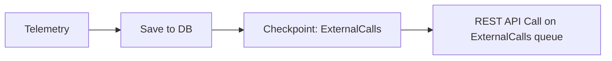

---

## Acknowledge Node

Acknowledges message processing without routing to subsequent nodes. Useful for fire-and-forget patterns where further processing is not needed.

### Configuration

This node has no configuration.

### Processing Flow

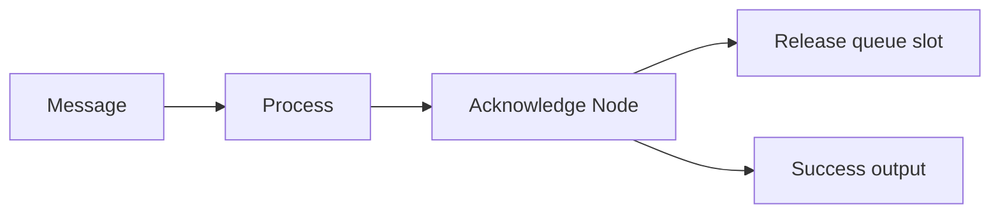

### Behavior

When a message reaches the Acknowledge node:
1. Message is acknowledged in the queue
2. Queue slot is released for new messages
3. Message routes to Success output (if connected)
4. No further queue-level retry on failure

### Use Cases

| Use Case | Description |
|----------|-------------|
| Fire-and-forget | Log and forget pattern |
| Early acknowledgment | Release queue before slow operations |
| Conditional completion | Acknowledge based on filter results |

### Example: Early Acknowledgment Before External Call

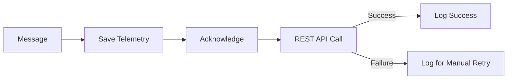

---

## Common Patterns

### Modular Processing Pattern

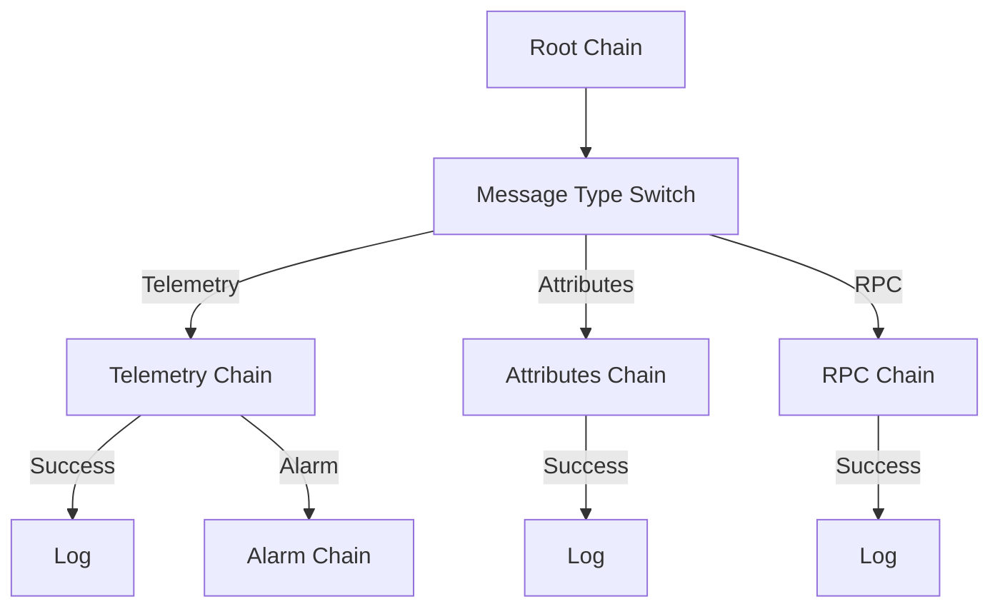

### Hierarchical Chain Pattern

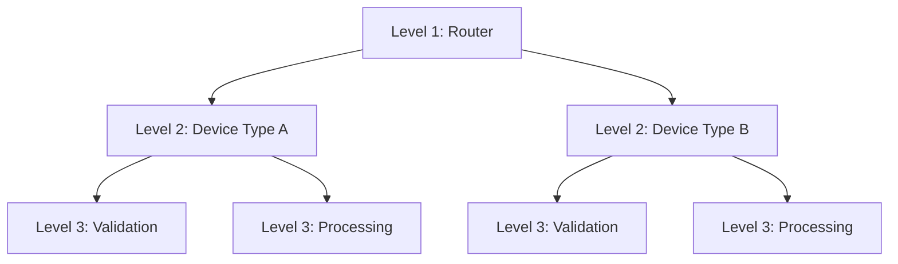

### Queue-Based Isolation Pattern

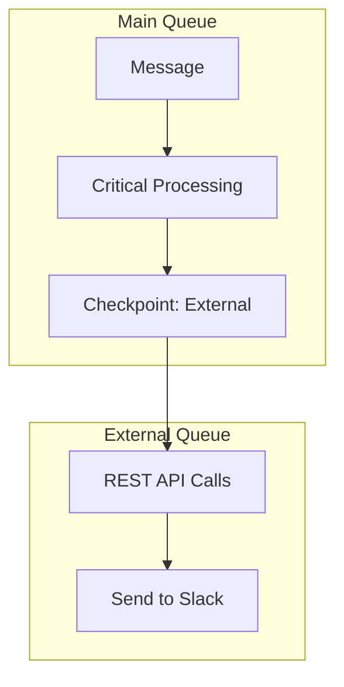

### Profile-Based Routing Pattern

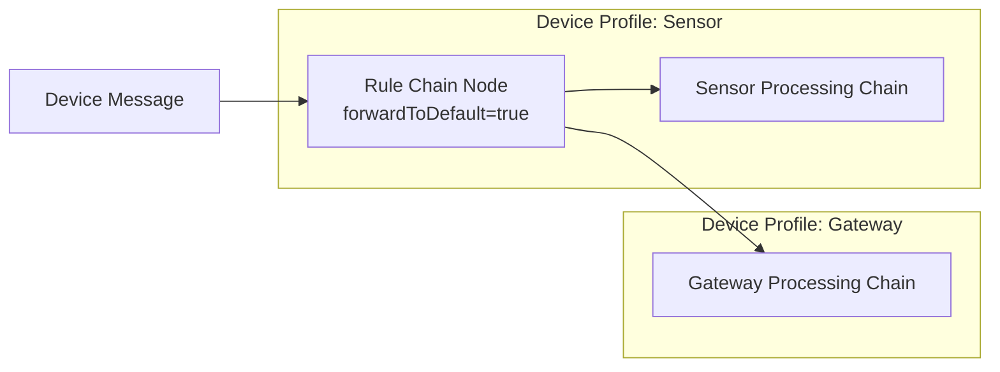

### Multi-Output Child Chain Pattern

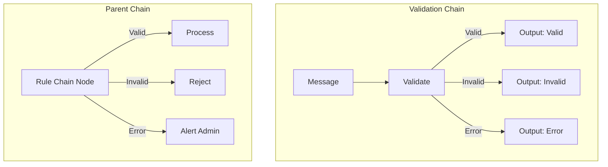

## Best Practices

1. **Name Output nodes clearly** - Use descriptive names that indicate the processing outcome
2. **Limit chain depth** - Deep nesting increases complexity and debugging difficulty
3. **Use Checkpoint wisely** - Queue transfers have overhead; use for meaningful isolation
4. **Document chain relationships** - Maintain documentation of which chains call which
5. **Test child chains independently** - Verify child chains work before integrating
6. **Consider queue resources** - Each queue consumes resources; don't over-partition

## Queue Processing Considerations

### When to Use Checkpoint

| Scenario | Recommendation |
|----------|----------------|
| External API calls | Move to separate queue to isolate failures |
| CPU-intensive processing | Dedicated queue to prevent blocking |
| Priority escalation | Move to high-priority queue |
| Sequential requirements | Move to queue with SEQUENTIAL strategy |

### When NOT to Use Checkpoint

| Scenario | Recommendation |
|----------|----------------|
| Simple processing | Keep in same queue |
| Tight coupling | Use Rule Chain node instead |
| Low latency requirements | Queue transfer adds latency |

## Common Pitfalls

### Rule Chain Input/Output Nodes

| Pitfall | Impact | Solution |
|---------|--------|----------|
| Circular chain references | Infinite loops, stack overflow | Maintain chain dependency diagram; validate no cycles |
| Deep nesting (>5 levels) | Stack overflow, debugging difficulty | Flatten chains; use shared chains instead of deep nesting |
| Different tenant chains | Security boundary violation | Validate target chain belongs to same tenant |
| No default chain configured | Fallback behavior missing | Configure default rule chain in node settings |
| Wrong relation type returned | Message routing fails | Verify Output node relation types match parent chain expectations |

### Checkpoint Node

| Pitfall | Impact | Solution |
|---------|--------|----------|
| Checkpoint to non-existent queue | Messages lost or processing fails | Validate queue exists and is started before checkpoint |
| Checkpoint for all messages | Original queue underutilized | Reserve checkpoint for priority/special processing only |
| Queue strategy mismatch | Ordering or performance issues | Align target queue strategy with message requirements (e.g., SEQUENTIAL for ordering) |
| Long delays in main queue | Blocks other message processing | Use separate queue for delayed or slow messages |
| No error handling after checkpoint | Failures in target queue not handled | Add error handling in target queue's rule chain |

### Acknowledge Node

| Pitfall | Impact | Solution |
|---------|--------|----------|
| Acknowledging before critical action | Data loss if action fails | Place ACK node AFTER save/alarm/RPC nodes, not before |
| No ACK in error path | Queue retry loop, duplicate processing | Add ACK to Failure handler to prevent infinite retries |
| Multiple ACKs for same message | Potential errors | Only acknowledge once per message path |
| ACK without processing | Message dropped without action | Ensure all message paths perform intended actions before ACK |

### General Flow Control

| Pitfall | Impact | Solution |
|---------|--------|----------|
| Missing return path from nested chain | Parent chain doesn't continue | Ensure Output node is used in nested chains |
| Async processing without callback | Parent doesn't wait for completion | Understand async node behavior; use proper relation handling |
| Error suppression in nested chains | Failures invisible to parent | Propagate errors via Output node Failure relation |
| Too many chain hops | Increased latency, complexity | Keep message paths short; combine logic where possible |

## See Also

- [Rule Chain Structure](../rule-chain-structure.md) - Chain composition
- [Message Flow](../message-flow.md) - Message routing details
- [Filter Nodes](./filter-nodes.md) - Route before chain transfer
- [Node Categories](../node-categories.md) - All node categories
- [Message Queue](../../08-message-queue/README.md) - Queue architecture
