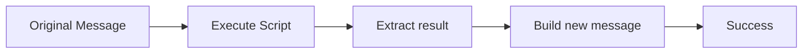
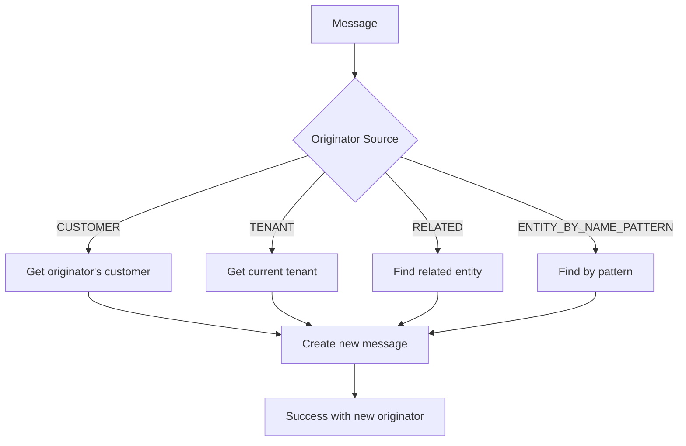
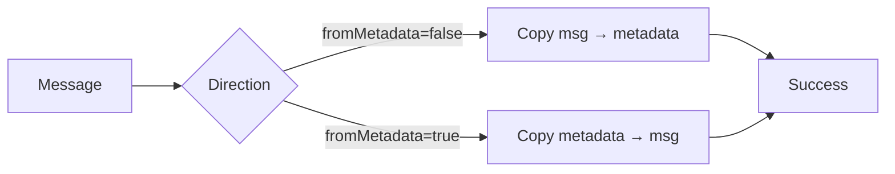
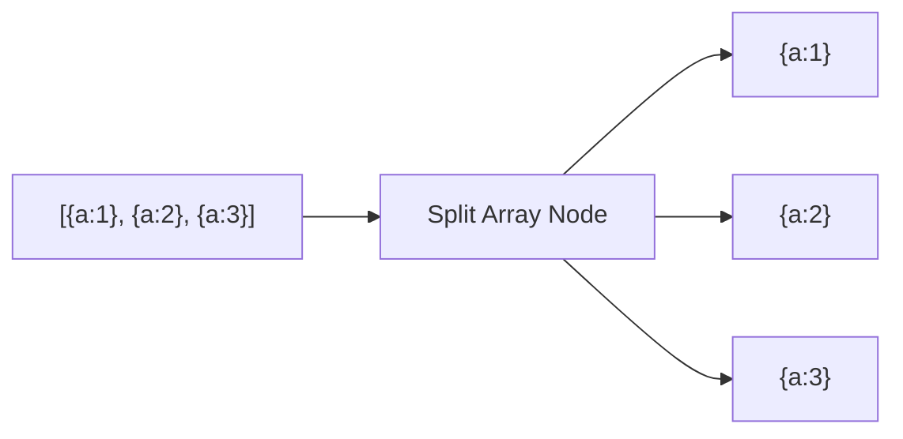
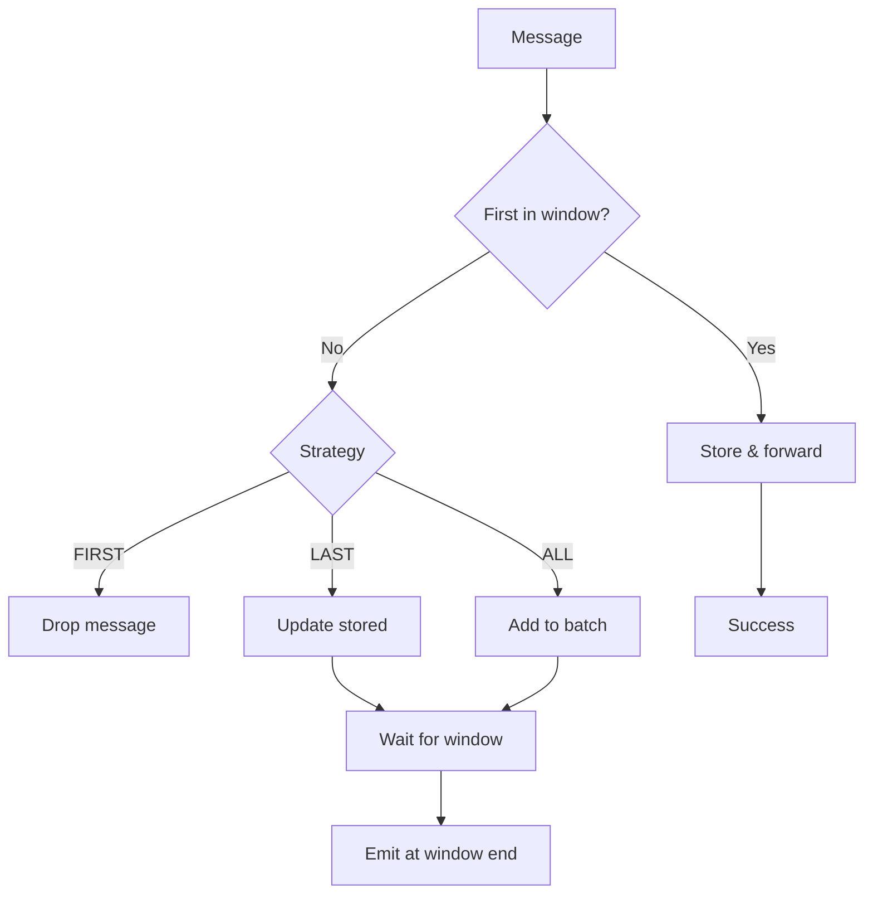
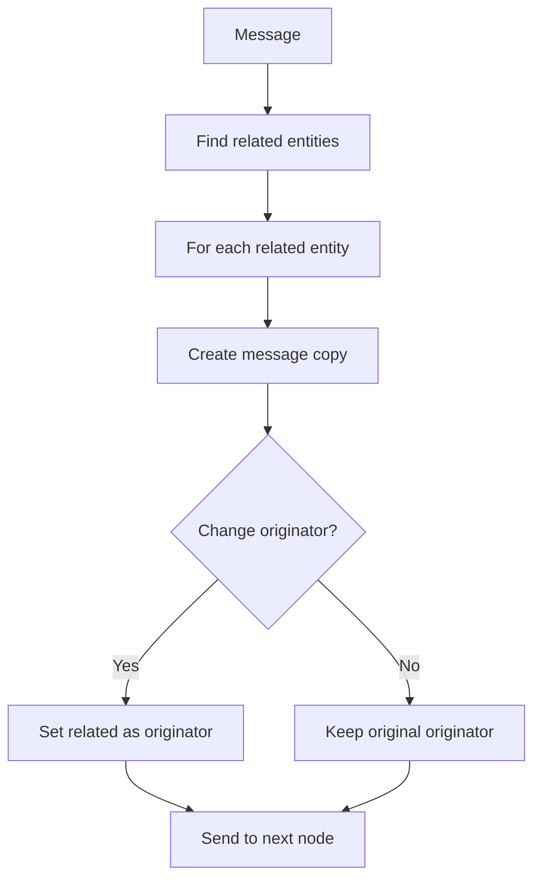
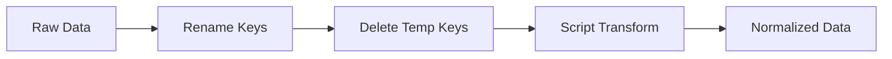
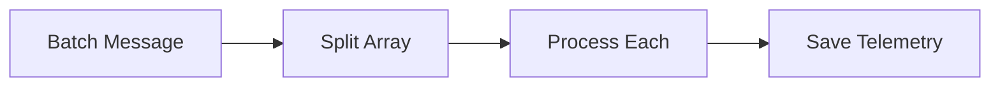
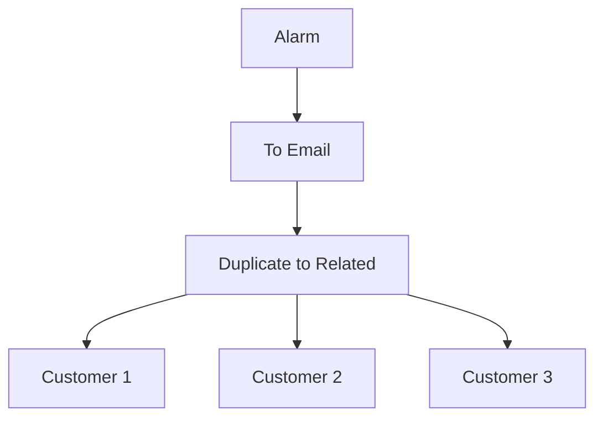
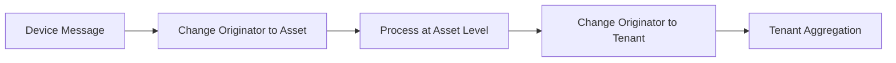

# Transformation Nodes Reference

## Overview

Transformation nodes modify the message structure, payload, metadata, or originator without fetching external data. They reshape messages for downstream processing, convert formats, split arrays, change message ownership, and perform deduplication.

## Node Quick Reference

| Node | Class | Description |
|------|-------|-------------|
| Script | TbTransformMsgNode | Transform using TBEL/JavaScript |
| Change Originator | TbChangeOriginatorNode | Change message originator |
| To Email | TbMsgToEmailNode | Convert to email format |
| Delete Keys | TbDeleteKeysNode | Remove keys from message |
| Copy Keys | TbCopyKeysNode | Copy between message/metadata |
| Rename Keys | TbRenameKeysNode | Rename message keys |
| JSON Path | TbJsonPathNode | Extract using JSONPath |
| Split Array | TbSplitArrayMsgNode | Split array into messages |
| Deduplication | TbMsgDeduplicationNode | Deduplicate by originator |
| Duplicate to Related | TbDuplicateMsgToRelatedNode | Send to related entities |
| Duplicate to Group | TbMsgToEntityGroupNode | Send to entity group |

---

## Script Transform

Transforms messages using user-defined TBEL or JavaScript scripts. Can modify payload, metadata, and message type.

### Configuration

| Field | Type | Description |
|-------|------|-------------|
| scriptLang | enum | TBEL or JS |
| tbelScript | string | TBEL transformation script |
| jsScript | string | JavaScript transformation script |

### Script Variables (Input)

| Variable | Type | Description |
|----------|------|-------------|
| msg | object | Message payload |
| metadata | object/Map | Message metadata |
| msgType | string | Message type |

### Script Return Structure

```javascript
{
  msg: { /* new payload */ },
  metadata: { /* new metadata */ },
  msgType: "NEW_MESSAGE_TYPE"
}
```

### Processing Flow



### Example: Add Calculated Field

**Configuration:**
```json
{
  "scriptLang": "TBEL",
  "tbelScript": "var result = { msg: msg, metadata: metadata, msgType: msgType };\nresult.msg.tempFahrenheit = msg.temperature * 9/5 + 32;\nreturn result;"
}
```

**Input:**
```json
{"temperature": 25}
```

**Output:**
```json
{"temperature": 25, "tempFahrenheit": 77}
```

### Example: Change Message Type

**Configuration:**
```json
{
  "scriptLang": "TBEL",
  "tbelScript": "return {\n  msg: msg,\n  metadata: metadata,\n  msgType: 'PROCESSED_TELEMETRY'\n};"
}
```

### Example: Flatten Nested Object (JavaScript)

**Configuration:**
```json
{
  "scriptLang": "JS",
  "jsScript": "var result = { msg: {}, metadata: metadata, msgType: msgType };\nfor (var key in msg) {\n  if (typeof msg[key] === 'object') {\n    for (var subKey in msg[key]) {\n      result.msg[key + '_' + subKey] = msg[key][subKey];\n    }\n  } else {\n    result.msg[key] = msg[key];\n  }\n}\nreturn result;"
}
```

---

## Change Originator

Changes the message originator to a different entity.

### Configuration

| Field | Type | Description |
|-------|------|-------------|
| originatorSource | enum | Source for new originator |
| direction | enum | Relation direction (if RELATED) |
| relationType | string | Relation type (if RELATED) |
| entityType | enum | Target entity type |
| entityNamePattern | string | Pattern for finding entity |

### Originator Sources

| Source | Description |
|--------|-------------|
| CUSTOMER | Current originator's customer |
| TENANT | Current tenant |
| RELATED | Entity related to originator |
| ALARM_ORIGINATOR | Alarm's source entity |
| ENTITY_BY_NAME_PATTERN | Find entity by name pattern |

### Processing Flow



### Example: Change to Parent Asset

**Configuration:**
```json
{
  "originatorSource": "RELATED",
  "direction": "TO",
  "relationType": "Contains",
  "entityType": "ASSET"
}
```

### Example: Find by Name Pattern

**Configuration:**
```json
{
  "originatorSource": "ENTITY_BY_NAME_PATTERN",
  "entityType": "ASSET",
  "entityNamePattern": "Building-${metadata.buildingId}"
}
```

---

## To Email

Transforms a message into an email message format suitable for the Send Email node.

### Configuration

| Field | Type | Description |
|-------|------|-------------|
| fromTemplate | string | Sender email template |
| toTemplate | string | Recipient email template |
| ccTemplate | string | CC recipients template |
| bccTemplate | string | BCC recipients template |
| subjectTemplate | string | Email subject template |
| bodyTemplate | string | Email body template |
| bodyType | enum | PLAIN_TEXT or HTML |

### Template Variables

Templates support `${...}` patterns that resolve from message data and metadata:
- `${msg.temperature}` - Message field
- `${metadata.deviceName}` - Metadata field

### Output Message Format

```json
{
  "from": "alerts@company.com",
  "to": "admin@company.com",
  "cc": "",
  "bcc": "",
  "subject": "Temperature Alert",
  "body": "Device sensor-001 temperature is 35°C",
  "html": false
}
```

### Example Configuration

```json
{
  "fromTemplate": "alerts@${metadata.tenantEmail}",
  "toTemplate": "${metadata.customerEmail}",
  "ccTemplate": "",
  "bccTemplate": "",
  "subjectTemplate": "Alert: ${metadata.deviceName} - ${msg.alarmType}",
  "bodyTemplate": "Device ${metadata.deviceName} triggered alarm.\n\nTemperature: ${msg.temperature}°C\nThreshold: ${metadata.threshold}°C\n\nTime: ${metadata.ts}",
  "bodyType": "PLAIN_TEXT"
}
```

---

## Delete Keys

Removes specified keys from the message payload or metadata.

### Configuration

| Field | Type | Description |
|-------|------|-------------|
| messageNames | string[] | Keys to remove from payload |
| metadataNames | string[] | Keys to remove from metadata |

### Processing Flow


### Example Configuration

```json
{
  "messageNames": ["internalId", "rawData"],
  "metadataNames": ["processingTime"]
}
```

---

## Copy Keys

Copies keys between message payload and metadata.

### Configuration

| Field | Type | Description |
|-------|------|-------------|
| fromMetadata | boolean | Copy from metadata to payload |
| messageNames | string[] | Keys to copy (from message if !fromMetadata) |
| metadataNames | string[] | Keys to copy (from metadata if fromMetadata) |

### Processing Flow



### Example: Copy Device Info to Payload

**Configuration:**
```json
{
  "fromMetadata": true,
  "metadataNames": ["deviceName", "deviceType"]
}
```

---

## Rename Keys

Renames keys in the message payload or metadata.

### Configuration

| Field | Type | Description |
|-------|------|-------------|
| messageNames | object | Payload key mappings {old: new} |
| metadataNames | object | Metadata key mappings {old: new} |

### Example Configuration

```json
{
  "messageNames": {
    "temp": "temperature",
    "hum": "humidity",
    "ts": "timestamp"
  },
  "metadataNames": {}
}
```

### Example: Standardize Sensor Data

**Input:**
```json
{"t": 25.5, "h": 60, "p": 1013}
```

**Configuration:**
```json
{
  "messageNames": {
    "t": "temperature",
    "h": "humidity",
    "p": "pressure"
  }
}
```

**Output:**
```json
{"temperature": 25.5, "humidity": 60, "pressure": 1013}
```

---

## JSON Path

Extracts data from the message using JSONPath expressions.

### Configuration

| Field | Type | Description |
|-------|------|-------------|
| jsonPath | string | JSONPath expression |
| resultKey | string | Key for extracted value |
| fetchTo | enum | METADATA or DATA |

### JSONPath Syntax

| Expression | Description |
|------------|-------------|
| `$.key` | Root-level key |
| `$.nested.key` | Nested key |
| `$.array[0]` | Array element |
| `$.array[*].field` | All elements' field |
| `$..key` | Recursive search |

### Example Configuration

```json
{
  "jsonPath": "$.sensors[*].temperature",
  "resultKey": "temperatures",
  "fetchTo": "DATA"
}
```

**Input:**
```json
{
  "sensors": [
    {"id": 1, "temperature": 25},
    {"id": 2, "temperature": 27},
    {"id": 3, "temperature": 26}
  ]
}
```

**Output (added to payload):**
```json
{
  "temperatures": [25, 27, 26]
}
```

---

## Split Array Message

Splits a message containing an array into multiple individual messages.

### Configuration

| Field | Type | Description |
|-------|------|-------------|
| keysToSplit | string[] | Array keys to split |
| splitArrayMsgMode | enum | Split mode |

### Split Modes

| Mode | Behavior |
|------|----------|
| SPLIT_ARRAY_TO_OBJECTS | Each array element becomes separate message |
| SPLIT_ARRAY_TO_ARRAY | Split array into smaller arrays |

### Processing Flow



### Example Configuration

```json
{
  "keysToSplit": ["readings"],
  "splitArrayMsgMode": "SPLIT_ARRAY_TO_OBJECTS"
}
```

**Input:**
```json
{
  "deviceId": "sensor-001",
  "readings": [
    {"ts": 1000, "value": 25},
    {"ts": 2000, "value": 26},
    {"ts": 3000, "value": 27}
  ]
}
```

**Output (3 messages):**
```json
{"deviceId": "sensor-001", "ts": 1000, "value": 25}
{"deviceId": "sensor-001", "ts": 2000, "value": 26}
{"deviceId": "sensor-001", "ts": 3000, "value": 27}
```

---

## Deduplication

Deduplicates messages by originator within a time window.

### Configuration

| Field | Type | Description |
|-------|------|-------------|
| interval | integer | Deduplication window (seconds) |
| strategy | enum | Deduplication strategy |
| outMsgType | string | Output message type |

### Strategies

| Strategy | Behavior |
|----------|----------|
| FIRST | Keep first message in window |
| LAST | Keep last message in window |
| ALL | Aggregate all messages |

### Processing Flow



---

## Duplicate to Related

Sends copies of the message to related entities.

### Configuration

| Field | Type | Description |
|-------|------|-------------|
| direction | enum | Relation direction |
| relationType | string | Relation type |
| entityType | enum | Target entity type |
| changeOriginatorToRelated | boolean | Change originator |

### Processing Flow



---

## Common Patterns

### Data Normalization Pattern



### Batch Processing Pattern



### Multi-Target Notification Pattern



### Hierarchy Propagation Pattern



## Best Practices

1. **Use TBEL for performance** - TBEL executes faster than JavaScript
2. **Validate in scripts** - Check for null/undefined before accessing properties
3. **Keep scripts simple** - Complex logic is better in multiple nodes
4. **Use rename for standardization** - Normalize key names early in the chain
5. **Split large arrays** - Process array items individually for better error handling

## See Also

- [Filter Nodes](./filter-nodes.md) - Route transformed messages
- [Enrichment Nodes](./enrichment-nodes.md) - Add context before transforming
- [Action Nodes](./action-nodes.md) - Act on transformed data
- [Node Categories](../node-categories.md) - All node categories
