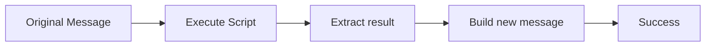
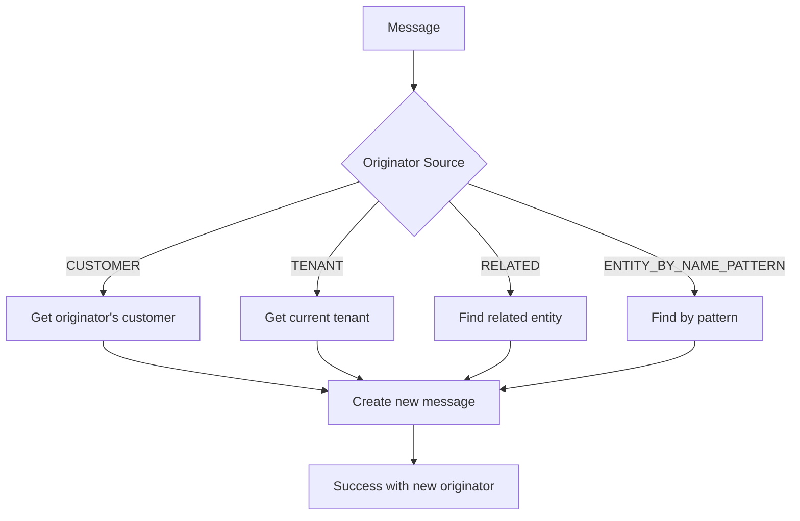
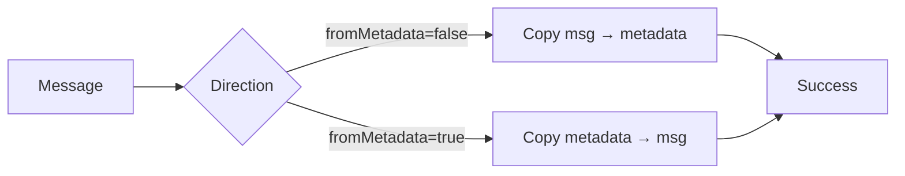
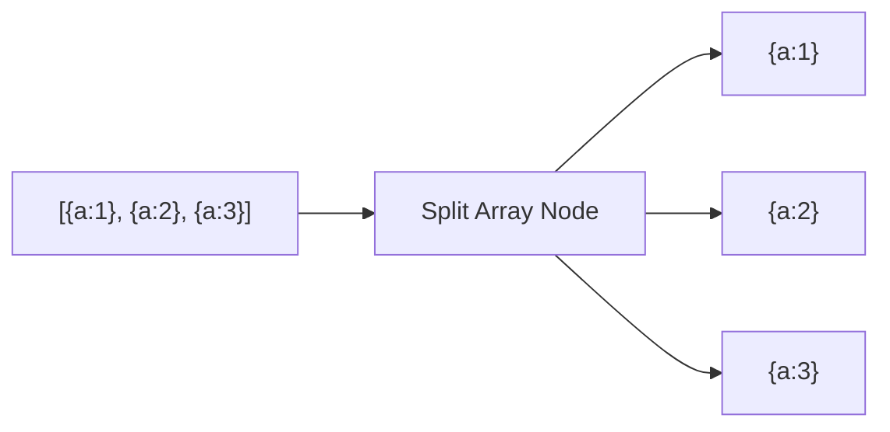
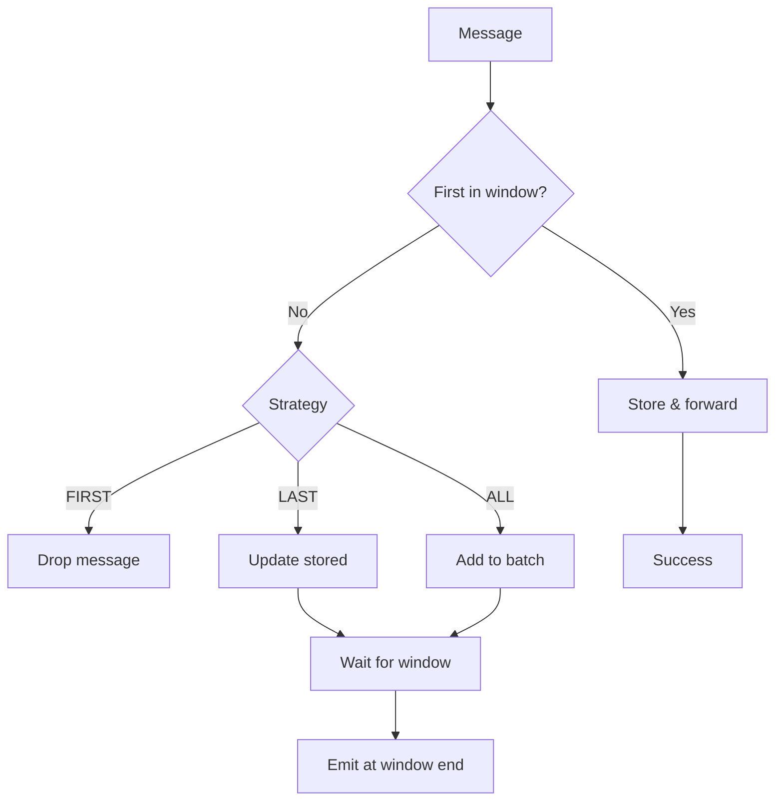
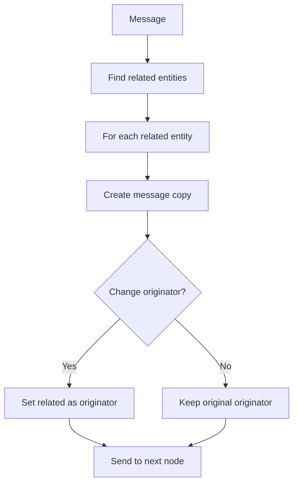
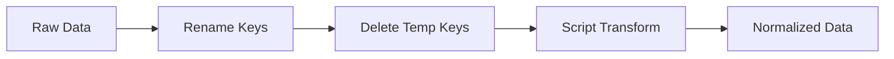
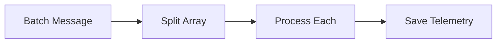
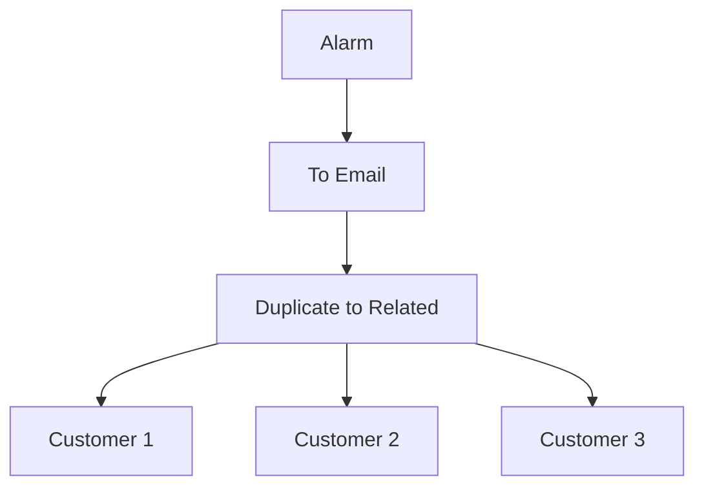
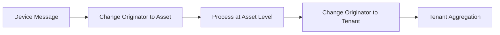

# Transformation Nodes Reference

## Overview

Transformation nodes modify the message structure, payload, metadata, or originator without fetching external data. They reshape messages for downstream processing, convert formats, split arrays, change message ownership, and perform deduplication.

## Node Quick Reference

| Node | Class | Description |
|------|-------|-------------|
| Script | TbTransformMsgNode | Transform using TBEL/JavaScript |
| Change Originator | TbChangeOriginatorNode | Change message originator |
| To Email | TbMsgToEmailNode | Convert to email format |
| Delete Keys | TbDeleteKeysNode | Remove keys from message |
| Copy Keys | TbCopyKeysNode | Copy between message/metadata |
| Rename Keys | TbRenameKeysNode | Rename message keys |
| JSON Path | TbJsonPathNode | Extract using JSONPath |
| Split Array | TbSplitArrayMsgNode | Split array into messages |
| Deduplication | TbMsgDeduplicationNode | Deduplicate by originator |
| Duplicate to Related | TbDuplicateMsgToRelatedNode | Send to related entities |
| Duplicate to Group | TbMsgToEntityGroupNode | Send to entity group |

---

## Script Transform

Transforms messages using user-defined TBEL or JavaScript scripts. Can modify payload, metadata, and message type.

### When to Use

**Primary Use Cases:**
- **Data normalization** - Convert device-specific formats to standard schema
- **Calculated fields** - Add derived values (Fahrenheit from Celsius, totals from components)
- **Format conversion** - Restructure nested objects, flatten/nest data
- **Metadata enrichment** - Copy critical data to metadata for downstream routing
- **Message type conversion** - Change message type for different processing paths

**Not Recommended For:**
- Loading external data (use Enrichment nodes - transforms don't fetch data)
- Heavy computation (impacts all message processing - consider async patterns)
- Simple field operations (use Delete Keys, Copy Keys, Rename Keys - faster and clearer)
- Filtering (use Filter nodes - clearer intent than transform + filter)

### Configuration

| Field | Type | Description |
|-------|------|-------------|
| scriptLang | enum | TBEL or JS |
| tbelScript | string | TBEL transformation script |
| jsScript | string | JavaScript transformation script |

### Script Variables (Input)

| Variable | Type | Description |
|----------|------|-------------|
| msg | object | Message payload |
| metadata | object/Map | Message metadata |
| msgType | string | Message type |

### Script Return Structure

```javascript
{
  msg: { /* new payload */ },
  metadata: { /* new metadata */ },
  msgType: "NEW_MESSAGE_TYPE"
}
```

### Processing Flow



### Example: Add Calculated Field

**Configuration:**
```json
{
  "scriptLang": "TBEL",
  "tbelScript": "var result = { msg: msg, metadata: metadata, msgType: msgType };\nresult.msg.tempFahrenheit = msg.temperature * 9/5 + 32;\nreturn result;"
}
```

**Input:**
```json
{"temperature": 25}
```

**Output:**
```json
{"temperature": 25, "tempFahrenheit": 77}
```

### Example: Change Message Type

**Configuration:**
```json
{
  "scriptLang": "TBEL",
  "tbelScript": "return {\n  msg: msg,\n  metadata: metadata,\n  msgType: 'PROCESSED_TELEMETRY'\n};"
}
```

### Example: Flatten Nested Object (JavaScript)

**Configuration:**
```json
{
  "scriptLang": "JS",
  "jsScript": "var result = { msg: {}, metadata: metadata, msgType: msgType };\nfor (var key in msg) {\n  if (typeof msg[key] === 'object') {\n    for (var subKey in msg[key]) {\n      result.msg[key + '_' + subKey] = msg[key][subKey];\n    }\n  } else {\n    result.msg[key] = msg[key];\n  }\n}\nreturn result;"
}
```

### Complete Example: Multi-Vendor Data Normalization

**Use Case**: Industrial IoT platform receives telemetry from different sensor vendors with different JSON structures. Normalize to standard schema before saving.

**Input Message** (Vendor A format):
```json
{
  "type": "POST_TELEMETRY_REQUEST",
  "originator": {
    "entityType": "DEVICE",
    "id": "sensor-vendorA-42"
  },
  "metadata": {
    "deviceName": "TempSensor-VendorA-42",
    "vendorId": "vendorA"
  },
  "data": {
    "readings": {
      "temp": { "value": 25.5, "unit": "C" },
      "hum": { "value": 60, "unit": "%" }
    },
    "timestamp": 1737963587742,
    "status": 1
  }
}
```

**Node Configuration**:
```json
{
  "scriptLang": "TBEL",
  "tbelScript": "// Normalize vendor-specific format to standard schema\nvar result = {\n  msg: {},\n  metadata: metadata,\n  msgType: msgType\n};\n\n// Check vendor and normalize\nif (metadata.vendorId === 'vendorA') {\n  // VendorA uses nested readings with units\n  result.msg.temperature = msg.readings.temp.value;\n  result.msg.humidity = msg.readings.hum.value;\n  result.msg.status = msg.status === 1 ? 'online' : 'offline';\n  result.metadata.ts = msg.timestamp.toString();\n} else if (metadata.vendorId === 'vendorB') {\n  // VendorB uses flat structure with prefixes\n  result.msg.temperature = msg.t_celsius;\n  result.msg.humidity = msg.h_percent;\n  result.msg.status = msg.conn ? 'online' : 'offline';\n  result.metadata.ts = msg.ts.toString();\n} else {\n  // Default passthrough for unknown vendors\n  result.msg = msg;\n}\n\nreturn result;"
}
```

**Output Message**:
```json
{
  "type": "POST_TELEMETRY_REQUEST",
  "originator": {
    "entityType": "DEVICE",
    "id": "sensor-vendorA-42"
  },
  "metadata": {
    "deviceName": "TempSensor-VendorA-42",
    "vendorId": "vendorA",
    "ts": "1737963587742"
  },
  "data": {
    "temperature": 25.5,
    "humidity": 60,
    "status": "online"
  }
}
```

**Why This Works**: Single transformation node handles multiple vendor formats, normalizing to consistent schema. Downstream nodes (Save Telemetry, alarms, analytics) work with standard fields regardless of source vendor. New vendor formats added by updating the script without changing the rest of the chain.

### Complete Example: Pre-Filter Data Preparation

**Use Case**: Prepare message for script filter by extracting nested values and calculating thresholds in metadata, avoiding complex filter logic.

**Input Message**:
```json
{
  "type": "POST_TELEMETRY_REQUEST",
  "originator": {
    "entityType": "DEVICE",
    "id": "machine-15"
  },
  "metadata": {
    "deviceType": "cnc-machine",
    "warningLevel": "0.8",
    "criticalLevel": "0.9"
  },
  "data": {
    "motor": {
      "rpm": 2400,
      "maxRpm": 3000,
      "temp": 85,
      "maxTemp": 100
      },
    "vibration": 3.2
  }
}
```

**Node Configuration**:
```json
{
  "scriptLang": "TBEL",
  "tbelScript": "// Calculate utilization percentages and add to metadata\nvar result = {\n  msg: msg,\n  metadata: metadata,\n  msgType: msgType\n};\n\n// Calculate motor utilization\nvar rpmUtilization = msg.motor.rpm / msg.motor.maxRpm;\nvar tempUtilization = msg.motor.temp / msg.motor.maxTemp;\n\n// Add calculated values to metadata for downstream filter\nresult.metadata.rpmUtilization = rpmUtilization.toString();\nresult.metadata.tempUtilization = tempUtilization.toString();\n\n// Determine overall health (worst utilization)\nvar maxUtilization = Math.max(rpmUtilization, tempUtilization);\nresult.metadata.healthUtilization = maxUtilization.toString();\n\n// Add severity level for switch node\nvar warning = parseFloat(metadata.warningLevel);\nvar critical = parseFloat(metadata.criticalLevel);\n\nif (maxUtilization >= critical) {\n  result.metadata.severity = 'CRITICAL';\n} else if (maxUtilization >= warning) {\n  result.metadata.severity = 'WARNING';\n} else {\n  result.metadata.severity = 'NORMAL';\n}\n\nreturn result;"
}
```

**Output**: Message with enriched metadata that downstream nodes can use:

**Downstream Filter** (simple, fast):
```javascript
// Script Filter now just checks precalculated metadata
return metadata.severity !== 'NORMAL';
```

**Why This Works**: Complex calculations happen once in transformation node. Downstream filter becomes trivial boolean check on metadata. Separates computation (transform) from decision (filter), improving readability and performance.

### Configuration Tips

| Scenario | Recommended Approach | Rationale |
|----------|---------------------|-----------|
| Must return complete message | Always include `msg`, `metadata`, `msgType` | Missing fields drop data |
| Adding calculated field | Spread existing: `msg: {...msg, newField: value}` | Preserves all original fields |
| Modifying metadata | Spread existing: `metadata: {...metadata, key: value}` | Preserves original metadata |
| Complex nested logic | Use JavaScript for better object handling | TBEL has limited object manipulation |
| Simple calculations | Use TBEL for 10-100x better performance | Faster execution |
| Debugging | Return intermediate values in metadata | Visible in debug mode |
| Message type change | Only change if downstream needs it | Type drives routing decisions |

### Common Transform Patterns

| Pattern | Code Example | Use Case |
|---------|--------------|----------|
| Add field | `result.msg = {...msg, total: msg.a + msg.b};` | Calculated values |
| Remove field | `var {removeMe, ...rest} = msg; result.msg = rest;` | Clean sensitive data |
| Rename field | `result.msg = {newName: msg.oldName, ...};` | Schema migration |
| Copy to metadata | `result.metadata.critical = msg.temperature.toString();` | For downstream routing |
| Conditional transform | `if (msg.temp > 30) { ... } else { ... }` | Context-dependent changes |
| Array mapping | `result.msg.values = msg.array.map(x => x * 2);` | Bulk calculations |

### Performance Considerations

| Practice | Impact | Recommendation |
|----------|--------|----------------|
| Returning incomplete message | Data loss | Always return `{msg, metadata, msgType}` |
| Large array operations | High (10-100ms per message) | Consider split/process/aggregate pattern |
| Deep object cloning | Moderate (1-10ms) | Only clone what you change |
| String concatenation in loop | Moderate | Use array join or template literals |
| TBEL vs JavaScript | 10-100x faster for TBEL | Use TBEL for production chains |
| Transform early vs late | Position matters | Transform after filter to skip irrelevant messages |

---

## Change Originator

Changes the message originator to a different entity.

### When to Use

**Primary Use Cases:**
- **Data aggregation to parent** - Save device telemetry to parent asset (building energy from meters)
- **Multi-level hierarchy updates** - Propagate device changes to customer or tenant level
- **Alarm forwarding** - Create alarms on parent assets when child devices fail
- **Cross-entity workflows** - Process message in context of related entity (user, customer, tenant)
- **Entity view updates** - Copy device attributes to entity views

**Not Recommended For:**
- Just routing to different entities (use enrichment + transformation to duplicate message)
- When you need to keep original originator (changes are permanent - use message cloning instead)
- Authorization checks (use Check Relation filter instead)
- Loading related entity data (use Enrichment nodes - Change Originator only changes ID)

**Critical Timing Decision:**
- **BEFORE Save nodes**: Data saved to NEW originator (device data → asset telemetry)
- **AFTER Save nodes**: Data saved to ORIGINAL originator, alarm/action on NEW originator

### Configuration

| Field | Type | Description |
|-------|------|-------------|
| originatorSource | enum | Source for new originator |
| direction | enum | Relation direction (if RELATED) |
| relationType | string | Relation type (if RELATED) |
| entityType | enum | Target entity type |
| entityNamePattern | string | Pattern for finding entity |

### Originator Sources

| Source | Description |
|--------|-------------|
| CUSTOMER | Current originator's customer |
| TENANT | Current tenant |
| RELATED | Entity related to originator |
| ALARM_ORIGINATOR | Alarm's source entity |
| ENTITY_BY_NAME_PATTERN | Find entity by name pattern |

### Processing Flow



### Example: Change to Parent Asset

**Configuration:**
```json
{
  "originatorSource": "RELATED",
  "direction": "TO",
  "relationType": "Contains",
  "entityType": "ASSET"
}
```

### Example: Find by Name Pattern

**Configuration:**
```json
{
  "originatorSource": "ENTITY_BY_NAME_PATTERN",
  "entityType": "ASSET",
  "entityNamePattern": "Building-${metadata.buildingId}"
}
```

### Complete Example: BEFORE Save - Aggregate to Parent Asset

**Use Case**: Energy meters report individual consumption. Aggregate to building-level telemetry by changing originator to parent asset BEFORE saving.

**Relationship**:
- Asset: "Building-A" (ID: `asset-building-a`)
- Device: "EnergyMeter-Floor1" (ID: `device-meter-1`)
- Relation: `asset-building-a` --[Contains]--> `device-meter-1`

**Input Message** (from energy meter):
```json
{
  "type": "POST_TELEMETRY_REQUEST",
  "originator": {
    "entityType": "DEVICE",
    "id": "device-meter-1"
  },
  "metadata": {
    "deviceName": "EnergyMeter-Floor1"
  },
  "data": {
    "energy": 125.5,
    "power": 4200
  }
}
```

**Rule Chain Flow**:
```
Message → Change Originator → Save Telemetry
```

**Change Originator Configuration**:
```json
{
  "originatorSource": "RELATED",
  "direction": "TO",
  "relationType": "Contains",
  "entityType": "ASSET"
}
```

**After Change Originator** (originator changed):
```json
{
  "type": "POST_TELEMETRY_REQUEST",
  "originator": {
    "entityType": "ASSET",
    "id": "asset-building-a"
  },
  "metadata": {
    "deviceName": "EnergyMeter-Floor1"
  },
  "data": {
    "energy": 125.5,
    "power": 4200
  }
}
```

**Result**: Telemetry saved to **Building-A asset**, not to the meter device. Query Building-A to see aggregated energy from all floors.

**Why This Works**: Changing originator BEFORE Save Telemetry redirects data storage. Multiple meters can report to same building asset, automatically aggregating building-level telemetry.

### Complete Example: AFTER Save - Alarm on Parent

**Use Case**: Device temperature alarm should ALSO create alarm on parent asset, while keeping device telemetry on device.

**Rule Chain Flow**:
```
Message → Save Telemetry → Create Alarm (device) → Change Originator → Create Alarm (asset)
```

**Input Message** (after device save and alarm):
```json
{
  "type": "ALARM_CREATED",
  "originator": {
    "entityType": "DEVICE",
    "id": "device-sensor-42"
  },
  "metadata": {
    "deviceName": "TempSensor-Floor1",
    "alarmType": "High Temperature"
  },
  "data": {
    "temperature": 85,
    "threshold": 80
  }
}
```

**Change Originator Configuration**:
```json
{
  "originatorSource": "RELATED",
  "direction": "TO",
  "relationType": "Contains",
  "entityType": "ASSET"
}
```

**After Change Originator** (originator changed to parent):
```json
{
  "type": "ALARM_CREATED",
  "originator": {
    "entityType": "ASSET",
    "id": "asset-building-a"
  },
  "metadata": {
    "deviceName": "TempSensor-Floor1",
    "alarmType": "High Temperature"
  },
  "data": {
    "temperature": 85,
    "threshold": 80
  }
}
```

**Next Node**: Create Alarm (second instance)

**Result**:
- Device telemetry saved to **Device** (original originator)
- Device alarm created on **Device**
- Asset alarm created on **Building-A** (changed originator)
- Dashboard shows building has child device in alarm state

**Why This Works**: Changing originator AFTER save preserves original data location. The alarm propagates up the hierarchy while telemetry stays at device level. Parent asset gets visibility into child device issues.

### Decision Matrix: When to Change Originator

| Goal | Place Change Originator | Why |
|------|------------------------|-----|
| Save data to parent entity | BEFORE Save Telemetry/Attributes | Data storage follows originator |
| Aggregate child data to parent | BEFORE Save Telemetry | Parent shows sum/avg of children |
| Create alarm on parent | AFTER Save, AFTER Create Alarm (device) | Propagate alarm up hierarchy |
| Update entity view | AFTER Save (device) | Sync device data to view |
| Customer-level reporting | BEFORE Save | Customer entity shows customer data |
| Keep device data, notify parent | AFTER Save, BEFORE notification | Device retains data, parent informed |

### Configuration Tips

| Scenario | Originator Source | Additional Config |
|----------|------------------|-------------------|
| Change to parent asset | RELATED | direction: TO, relationType: Contains |
| Change to customer | CUSTOMER | (no additional config) |
| Change to tenant | TENANT | (no additional config) |
| Find asset by device attribute | ENTITY_BY_NAME_PATTERN | Pattern: ${metadata.assetName} |
| Change to alarm source | ALARM_ORIGINATOR | (for alarm messages only) |
| Multi-hop to grandparent | Not supported | Use two Change Originator nodes |

### Common Mistakes

| Mistake | Symptom | Fix |
|---------|---------|-----|
| Change before save (wanted device data) | Data saved to wrong entity | Move Change Originator after Save |
| Change after save (wanted parent data) | Data saved to device, not parent | Move Change Originator before Save |
| No relation exists | Message routes to Failure | Check Check Relation first |
| Wrong direction (FROM vs TO) | Cannot find parent | Use TO for child→parent |
| Chaining without save between | Data lost | Save after each Change Originator if needed |

---

## To Email

Transforms a message into an email message format suitable for the Send Email node.

### Configuration

| Field | Type | Description |
|-------|------|-------------|
| fromTemplate | string | Sender email template |
| toTemplate | string | Recipient email template |
| ccTemplate | string | CC recipients template |
| bccTemplate | string | BCC recipients template |
| subjectTemplate | string | Email subject template |
| bodyTemplate | string | Email body template |
| bodyType | enum | PLAIN_TEXT or HTML |

### Template Variables

Templates support `${...}` patterns that resolve from message data and metadata:
- `${msg.temperature}` - Message field
- `${metadata.deviceName}` - Metadata field

### Output Message Format

```json
{
  "from": "alerts@company.com",
  "to": "admin@company.com",
  "cc": "",
  "bcc": "",
  "subject": "Temperature Alert",
  "body": "Device sensor-001 temperature is 35°C",
  "html": false
}
```

### Example Configuration

```json
{
  "fromTemplate": "alerts@${metadata.tenantEmail}",
  "toTemplate": "${metadata.customerEmail}",
  "ccTemplate": "",
  "bccTemplate": "",
  "subjectTemplate": "Alert: ${metadata.deviceName} - ${msg.alarmType}",
  "bodyTemplate": "Device ${metadata.deviceName} triggered alarm.\n\nTemperature: ${msg.temperature}°C\nThreshold: ${metadata.threshold}°C\n\nTime: ${metadata.ts}",
  "bodyType": "PLAIN_TEXT"
}
```

---

## Delete Keys

Removes specified keys from the message payload or metadata.

### Configuration

| Field | Type | Description |
|-------|------|-------------|
| messageNames | string[] | Keys to remove from payload |
| metadataNames | string[] | Keys to remove from metadata |

### Processing Flow


### Example Configuration

```json
{
  "messageNames": ["internalId", "rawData"],
  "metadataNames": ["processingTime"]
}
```

---

## Copy Keys

Copies keys between message payload and metadata.

### Configuration

| Field | Type | Description |
|-------|------|-------------|
| fromMetadata | boolean | Copy from metadata to payload |
| messageNames | string[] | Keys to copy (from message if !fromMetadata) |
| metadataNames | string[] | Keys to copy (from metadata if fromMetadata) |

### Processing Flow



### Example: Copy Device Info to Payload

**Configuration:**
```json
{
  "fromMetadata": true,
  "metadataNames": ["deviceName", "deviceType"]
}
```

---

## Rename Keys

Renames keys in the message payload or metadata.

### Configuration

| Field | Type | Description |
|-------|------|-------------|
| messageNames | object | Payload key mappings {old: new} |
| metadataNames | object | Metadata key mappings {old: new} |

### Example Configuration

```json
{
  "messageNames": {
    "temp": "temperature",
    "hum": "humidity",
    "ts": "timestamp"
  },
  "metadataNames": {}
}
```

### Example: Standardize Sensor Data

**Input:**
```json
{"t": 25.5, "h": 60, "p": 1013}
```

**Configuration:**
```json
{
  "messageNames": {
    "t": "temperature",
    "h": "humidity",
    "p": "pressure"
  }
}
```

**Output:**
```json
{"temperature": 25.5, "humidity": 60, "pressure": 1013}
```

---

## JSON Path

Extracts data from the message using JSONPath expressions.

### Configuration

| Field | Type | Description |
|-------|------|-------------|
| jsonPath | string | JSONPath expression |
| resultKey | string | Key for extracted value |
| fetchTo | enum | METADATA or DATA |

### JSONPath Syntax

| Expression | Description |
|------------|-------------|
| `$.key` | Root-level key |
| `$.nested.key` | Nested key |
| `$.array[0]` | Array element |
| `$.array[*].field` | All elements' field |
| `$..key` | Recursive search |

### Example Configuration

```json
{
  "jsonPath": "$.sensors[*].temperature",
  "resultKey": "temperatures",
  "fetchTo": "DATA"
}
```

**Input:**
```json
{
  "sensors": [
    {"id": 1, "temperature": 25},
    {"id": 2, "temperature": 27},
    {"id": 3, "temperature": 26}
  ]
}
```

**Output (added to payload):**
```json
{
  "temperatures": [25, 27, 26]
}
```

---

## Split Array Message

Splits a message containing an array into multiple individual messages.

### Configuration

| Field | Type | Description |
|-------|------|-------------|
| keysToSplit | string[] | Array keys to split |
| splitArrayMsgMode | enum | Split mode |

### Split Modes

| Mode | Behavior |
|------|----------|
| SPLIT_ARRAY_TO_OBJECTS | Each array element becomes separate message |
| SPLIT_ARRAY_TO_ARRAY | Split array into smaller arrays |

### Processing Flow



### Example Configuration

```json
{
  "keysToSplit": ["readings"],
  "splitArrayMsgMode": "SPLIT_ARRAY_TO_OBJECTS"
}
```

**Input:**
```json
{
  "deviceId": "sensor-001",
  "readings": [
    {"ts": 1000, "value": 25},
    {"ts": 2000, "value": 26},
    {"ts": 3000, "value": 27}
  ]
}
```

**Output (3 messages):**
```json
{"deviceId": "sensor-001", "ts": 1000, "value": 25}
{"deviceId": "sensor-001", "ts": 2000, "value": 26}
{"deviceId": "sensor-001", "ts": 3000, "value": 27}
```

---

## Deduplication

Deduplicates messages by originator within a time window.

### Configuration

| Field | Type | Description |
|-------|------|-------------|
| interval | integer | Deduplication window (seconds) |
| strategy | enum | Deduplication strategy |
| outMsgType | string | Output message type |

### Strategies

| Strategy | Behavior |
|----------|----------|
| FIRST | Keep first message in window |
| LAST | Keep last message in window |
| ALL | Aggregate all messages |

### Processing Flow



---

## Duplicate to Related

Sends copies of the message to related entities.

### Configuration

| Field | Type | Description |
|-------|------|-------------|
| direction | enum | Relation direction |
| relationType | string | Relation type |
| entityType | enum | Target entity type |
| changeOriginatorToRelated | boolean | Change originator |

### Processing Flow



---

## Common Patterns

### Data Normalization Pattern



### Batch Processing Pattern



### Multi-Target Notification Pattern



### Hierarchy Propagation Pattern



## Common Pitfalls

### Script Transform

| Pitfall | Impact | Solution |
|---------|--------|----------|
| Forgetting to return complete structure | Message becomes undefined | Always return `{msg, metadata, msgType}` object |
| Not copying unchanged fields | Data loss | Return complete structure even if only changing one field |
| String metadata values | Type conversion errors | Parse numbers: `parseInt(metadata.count)` or `parseFloat(metadata.value)` |
| Modifying input directly | Side effects in TBEL | Create new objects: `var result = {...msg, newField: value}` |
| Complex async operations | Script timeout or errors | Use REST API Call node for external calls, not script transforms |
| Returning null/undefined | Message routes to Failure | Always return valid structure; use empty values if needed |

### Change Originator

| Pitfall | Impact | Solution |
|---------|--------|----------|
| Changing to non-existent entity | Message routes to Failure | Validate entity exists before Change Originator (use enrichment) |
| Losing original originator | Cannot trace back to source device | Save original in metadata: `originalOriginator` before changing |
| Pattern doesn't match any entity | No entity found | Test patterns with debug mode; log resolved values |
| Change after save | Data saved to wrong entity | Change originator BEFORE save/alarm nodes |
| Using wrong entity type in pattern | Pattern fails to resolve | Ensure pattern matches entity type (device ID for devices, asset ID for assets) |

### Deduplication

| Pitfall | Impact | Solution |
|---------|--------|----------|
| Interval too short | Duplicate processing during network retry | Set interval ≥ 3x typical message arrival rate |
| Interval too long | Missing genuine duplicate data | Monitor message frequency; adjust dynamically |
| Dedup applies to entire message | Different telemetry keys deduplicated together | Split into separate messages or use longer interval |
| Metadata used for dedup key | Same data with different metadata not deduped | Understand that dedup key includes metadata |

### Rename Keys

| Pitfall | Impact | Solution |
|---------|--------|----------|
| Key name collision | Existing data overwritten | Check for existing keys before renaming |
| Renaming nested keys | Only top-level keys renamed | Use Script Transform for nested field renaming |
| Case-sensitive renames | Key not found | Ensure exact case match for source keys |

### Split Array

| Pitfall | Impact | Solution |
|---------|--------|----------|
| Non-array payload | Split fails, routes to Failure | Validate payload is array before Split Array node |
| Large arrays | Memory and performance issues | Consider pagination or batching for very large arrays (>1000 items) |
| Losing array context | Individual items don't know their position | Add index to metadata if order matters |
| Array of primitives | Cannot split non-object arrays correctly | Wrap primitives in objects: `[{value: item}]` |

### Copy/Delete Key-Value Pairs

| Pitfall | Impact | Solution |
|---------|--------|----------|
| Copying to existing key | Overwrites target | Check target keys don't exist or use unique names |
| Deleting required keys | Downstream nodes fail | Verify keys aren't needed by subsequent nodes |
| Pattern doesn't match keys | No keys copied/deleted | Test pattern matching with debug mode |

### To Email

| Pitfall | Impact | Solution |
|---------|--------|----------|
| Missing required email fields | Send Email node fails | Ensure `to`, `subject`, and `body` are populated |
| HTML injection in body | Security risk or rendering issues | Sanitize user input before building email body |
| Large email body | Email delivery failure | Keep email bodies reasonable size; use links for large content |
| Not transforming before Send Email | Send Email receives wrong format | Always use To Email transform before Send Email node |

### JSON Path

| Pitfall | Impact | Solution |
|---------|--------|----------|
| Invalid JSON path expression | Extraction fails | Test JSON path with sample data; validate syntax |
| Path returns array when expecting single value | Type mismatch downstream | Use array index: `$.data[0]` or expect array |
| Missing path | Null result | Use safe navigation or validate path exists |

### Duplicate to Related/Group

| Pitfall | Impact | Solution |
|---------|--------|----------|
| No relations found | Message not duplicated | Verify relations exist with Check Relation filter first |
| Large number of relations | Performance impact | Limit duplication scope; consider async processing |
| Circular relations | Infinite duplication loops | Avoid duplicating to entities with circular relations |
| Callback not waited | Downstream processing starts before duplication complete | Understand that duplication is async |

## Best Practices

1. **Use TBEL for performance** - TBEL executes faster than JavaScript
2. **Validate in scripts** - Check for null/undefined before accessing properties
3. **Keep scripts simple** - Complex logic is better in multiple nodes
4. **Use rename for standardization** - Normalize key names early in the chain
5. **Split large arrays** - Process array items individually for better error handling

## See Also

- [Filter Nodes](./filter-nodes.md) - Route transformed messages
- [Enrichment Nodes](./enrichment-nodes.md) - Add context before transforming
- [Action Nodes](./action-nodes.md) - Act on transformed data
- [Node Categories](../node-categories.md) - All node categories
