# Rule Engine Queues

## Overview

ThingsBoard uses message queues to guarantee reliable message processing, handle traffic spikes, and maintain system stability under high load. The Rule Engine subscribes to queues on startup and polls for new messages. Queues are configured with submit strategies (how messages are dispatched) and processing strategies (how failures are handled).

## Key Behaviors

1. **Message Ordering**: Submit strategies control message ordering (sequential, burst, batch).

2. **Failure Handling**: Processing strategies define retry behavior on failures.

3. **Queue Isolation**: Tenants can have isolated queues for resource separation.

4. **Checkpointing**: Messages can be routed between queues using Checkpoint nodes.

5. **Default Queues**: Main, HighPriority, and SequentialByOriginator are pre-configured.

## Queue Architecture

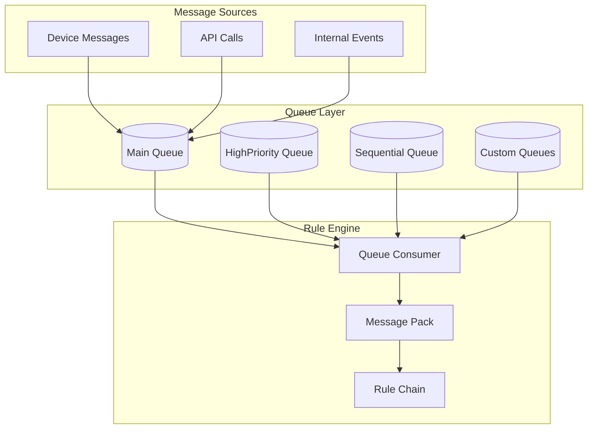

## Queue Types

### Kafka (Production)

Distributed, durable message queue for production environments.

| Feature | Description |
|---------|-------------|
| Persistence | Messages stored on disk |
| Scalability | Horizontal scaling via partitions |
| Durability | Replication for fault tolerance |
| Throughput | High-volume message handling |

### In-Memory (Development)

Lightweight queue for development and small deployments.

| Feature | Description |
|---------|-------------|
| Speed | Fast in-memory operations |
| Simplicity | No external dependencies |
| Persistence | None - messages lost on restart |
| Use Case | Development, testing, demos |

## Queue Configuration

### UI Configuration

System administrators configure queues via **Settings → Queues**.

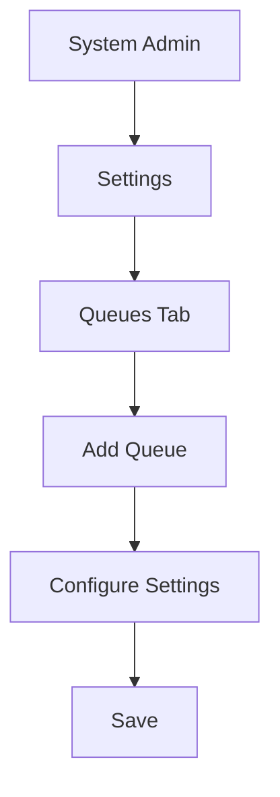

### Queue Settings

| Setting | Description |
|---------|-------------|
| Name | Queue identifier for logging and statistics |
| Submit strategy | How messages are submitted to rule engine |
| Processing strategy | How failures and timeouts are handled |
| Polling settings | Batch size and poll intervals |
| Custom properties | Provider-specific settings |

## Submit Strategies

Submit strategies control how messages from a queue pack are delivered to rule chains.

### Sequential by Originator

Messages processed one-by-one per entity. New message for Device A waits until previous Device A message is acknowledged.

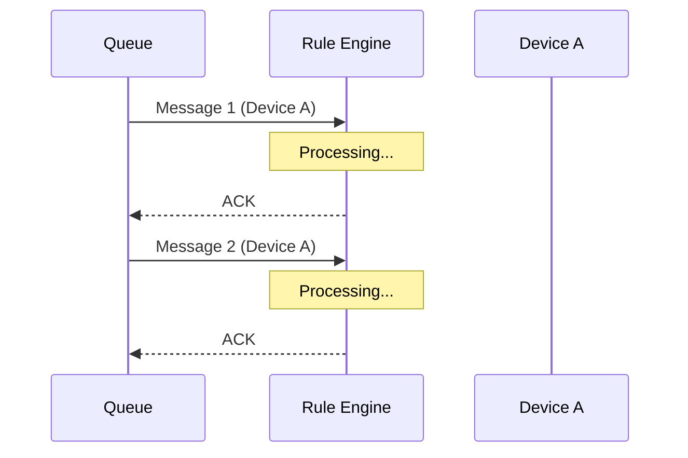

**Use Case:** When message order matters per device (e.g., state machines).

### Sequential by Tenant

Messages processed sequentially within each tenant.

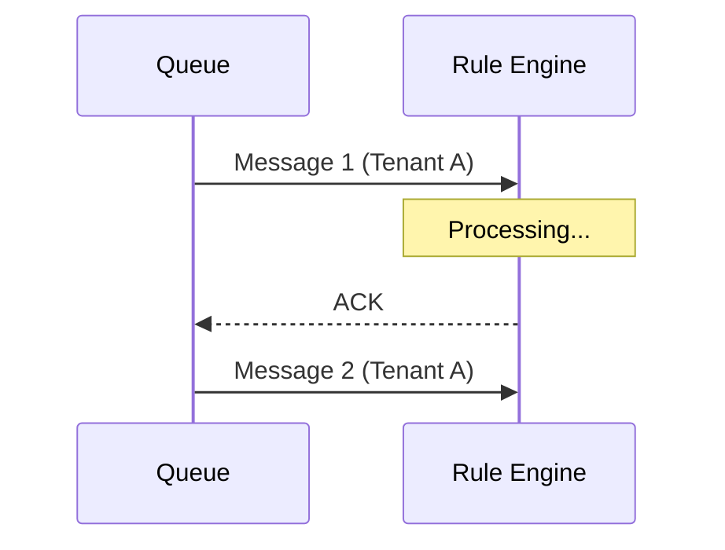

**Use Case:** Tenant-level consistency requirements.

### Sequential (Global)

All messages processed one at a time globally.

**Use Case:** Strict ordering, but very slow throughput.

### Burst

All messages submitted immediately in arrival order.

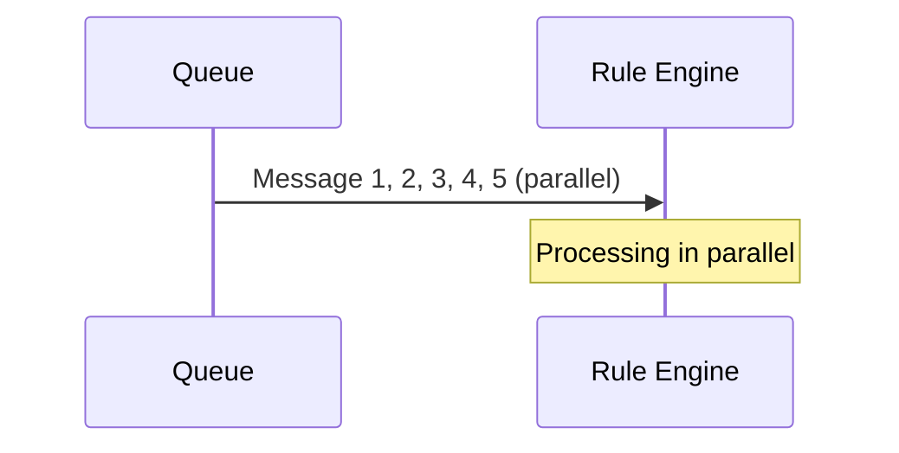

**Use Case:** Maximum throughput, no ordering requirements.

### Batch

Messages grouped into batches by size. New batch waits for previous batch acknowledgment.

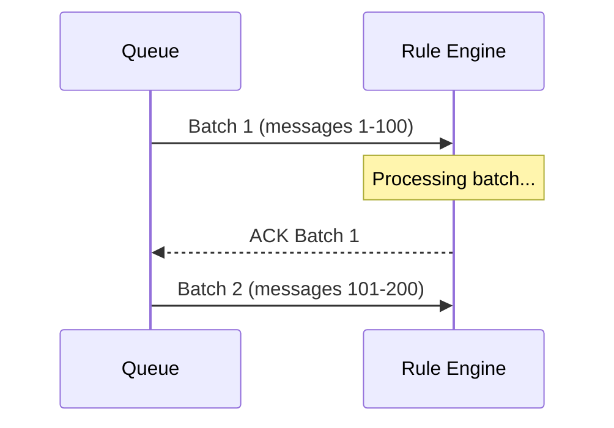

**Use Case:** Balanced throughput with controlled parallelism.

### Strategy Comparison

| Strategy | Ordering | Throughput | Use Case |
|----------|----------|------------|----------|
| Sequential by Originator | Per entity | Medium | Device state tracking |
| Sequential by Tenant | Per tenant | Medium | Tenant consistency |
| Sequential | Global | Low | Strict ordering |
| Burst | None | High | High throughput |
| Batch | Per batch | Medium-High | Balanced processing |

## Processing Strategies

Processing strategies control how failed or timed-out messages are handled.

### Retry Failed and Timeout

Retry all failed and timed-out messages from the processing pack.

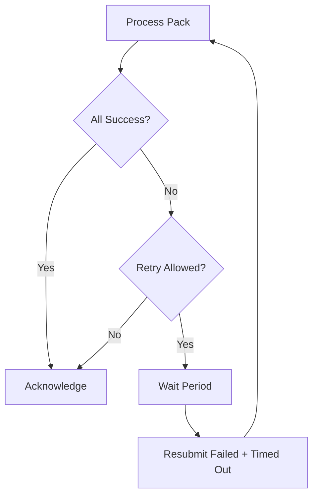

**Use Case:** Critical data requiring reliable delivery.

### Skip All Failures

Ignore failures, acknowledge messages anyway.

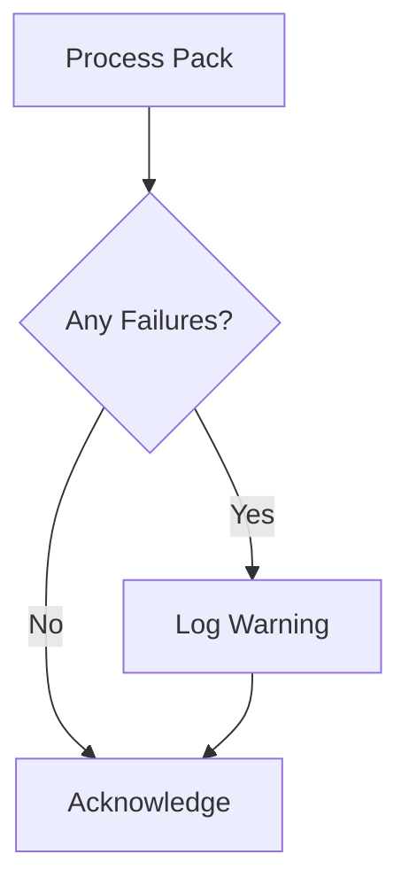

**Use Case:** Non-critical data, backward compatibility.

### Skip All Failures and Timeouts

Ignore both failures and timeouts, cancel timed-out messages.

**Use Case:** Best-effort processing, development environments.

### Retry All

Retry entire pack if any message fails.

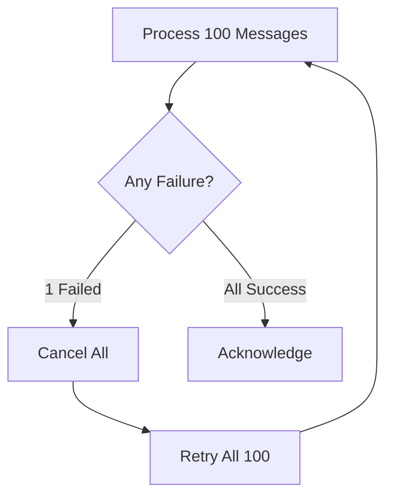

**Use Case:** Atomic processing requirements.

### Retry Failed

Retry only failed messages, not timed-out ones.

**Use Case:** Separate failure and timeout handling.

### Retry Timeout

Retry only timed-out messages, not failed ones.

**Use Case:** Network-sensitive workloads.

### Retry Configuration

| Parameter | Description |
|-----------|-------------|
| Number of retries | Maximum retry attempts (0 = unlimited) |
| Failure percentage | Skip retry if failures < X% of messages |
| Retry within | Initial wait time before retry (seconds) |
| Additional retry within | Wait time for subsequent retries |

### Strategy Comparison

| Strategy | On Failure | On Timeout | Use Case |
|----------|------------|------------|----------|
| Retry Failed and Timeout | Retry | Retry | Critical data |
| Skip All Failures | Skip | Process | Non-critical |
| Skip All Failures and Timeouts | Skip | Cancel | Best effort |
| Retry All | Retry all | Retry all | Atomic batches |
| Retry Failed | Retry | Skip | Failure focus |
| Retry Timeout | Skip | Retry | Network issues |

## Polling Settings

### Batch Processing

| Setting | Description |
|---------|-------------|
| Poll interval | Milliseconds between polls when no messages |
| Partitions | Number of parallel partitions |

### Immediate Processing

| Setting | Description |
|---------|-------------|
| Consumer per partition | Separate consumer per partition |
| Processing within | Timeout for pack processing (ms) |

## Default Queues

### Main Queue

| Setting | Value |
|---------|-------|
| Submit strategy | Burst |
| Processing strategy | Skip All Failures |
| Purpose | General message processing |

### HighPriority Queue

| Setting | Value |
|---------|-------|
| Submit strategy | Burst |
| Processing strategy | Retry Failed and Timeout |
| Purpose | Critical alerts, alarms |

### SequentialByOriginator Queue

| Setting | Value |
|---------|-------|
| Submit strategy | Sequential by Originator |
| Processing strategy | Retry Failed and Timeout |
| Purpose | Ordered device messages |

## Checkpoint Node

Use the **Checkpoint** node to route messages to different queues.

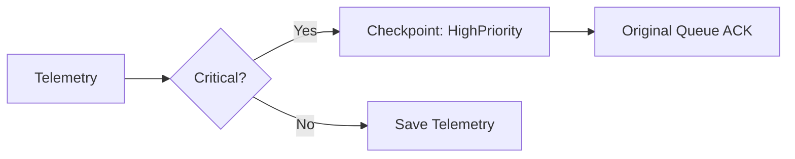

### Configuration

| Setting | Description |
|---------|-------------|
| Queue name | Target queue for message |

### Behavior

1. Message submitted to target queue
2. Original message acknowledged
3. Processing continues in target queue

## Isolated Tenant Queues

### Enable Isolation

Configure in tenant profile:

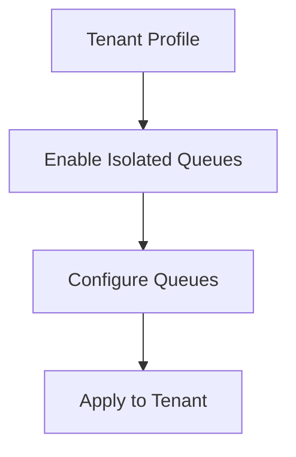

### Benefits

| Benefit | Description |
|---------|-------------|
| Resource isolation | Dedicated queue resources |
| Performance | No interference from other tenants |
| Customization | Custom queue settings per tenant |
| Security | Queue-level separation |

### Configuration

Per-tenant queues are configured in the tenant profile with the same settings as common queues.

## Custom Properties

Provider-specific queue properties:

**Kafka:**
```
retention.ms:604800000;retention.bytes:1048576000
```

**AWS SQS:**
```
MaximumMessageSize:262144;MessageRetentionPeriod:604800
```

**Note:** Properties apply only on queue creation.

## Monitoring

### Rule Engine Statistics Dashboard

Monitor queue processing via the built-in dashboard:

| Metric | Description |
|--------|-------------|
| Messages processed | Total messages per queue |
| Processing time | Average processing duration |
| Failures | Failed message count |
| Retries | Retry attempts |
| Queue depth | Pending messages |

## Best Practices

### Queue Selection

| Scenario | Recommended Queue |
|----------|-------------------|
| General telemetry | Main |
| Alarm notifications | HighPriority |
| State tracking | SequentialByOriginator |
| Critical operations | Custom with retry |

### Performance Tuning

| Practice | Benefit |
|----------|---------|
| Use Burst for high throughput | Maximum parallelism |
| Set appropriate partitions | Horizontal scaling |
| Configure retry limits | Prevent infinite loops |
| Monitor queue depth | Detect bottlenecks |

### Reliability

| Practice | Benefit |
|----------|---------|
| Use retry strategies for critical data | Guaranteed delivery |
| Set failure percentage threshold | Prevent cascade failures |
| Configure reasonable timeouts | Handle slow operations |

## Troubleshooting

### Common Issues

| Issue | Cause | Solution |
|-------|-------|----------|
| Messages not processed | Queue not started | Check queue configuration |
| High latency | Too few partitions | Increase partitions |
| Message loss | Skip strategy | Switch to retry strategy |
| Infinite retries | No failure threshold | Set failure percentage |
| Memory issues | Large queue depth | Scale consumers |

### Debug Steps

1. Check queue status in admin UI
2. Review Rule Engine statistics dashboard
3. Examine server logs for queue errors
4. Verify tenant queue assignment
5. Test with debug mode enabled

## See Also

- [Rule Engine Overview](./README.md) - Rule engine architecture
- [Message Flow](./message-flow.md) - Message routing
- [Flow Nodes](./nodes/flow-nodes.md) - Checkpoint node
- [Message Queue](../08-message-queue/README.md) - Queue infrastructure
- [Rate Limiting](../09-security/rate-limiting.md) - Tenant rate limits
