# Rule Chain Structure

## Overview

A rule chain is a directed acyclic graph (DAG) of rule nodes connected by typed relations. It defines how messages flow through processing logic. The chain has a single entry point (first node) and routes messages between nodes based on relation types like Success, Failure, True, or False. Rule chains can invoke other rule chains, enabling modular composition of complex workflows.

## Key Behaviors

1. **Single Entry Point**: Every rule chain has exactly one first node that receives all incoming messages.

2. **Typed Connections**: Nodes connect via relation types that determine routing (e.g., Success routes differently than Failure).

3. **Graph Representation**: Internally stored as node list + connection list, converted to routing tables at runtime.

4. **Cross-Chain References**: Chains can link to other chains via RuleChainConnectionInfo, enabling modular design.

5. **Visual Layout**: Node positions (x, y) stored in additionalInfo for UI rendering.

6. **Versioning**: Rule chains support optimistic locking via version field for concurrent editing.

## Data Model

### Entity Relationships

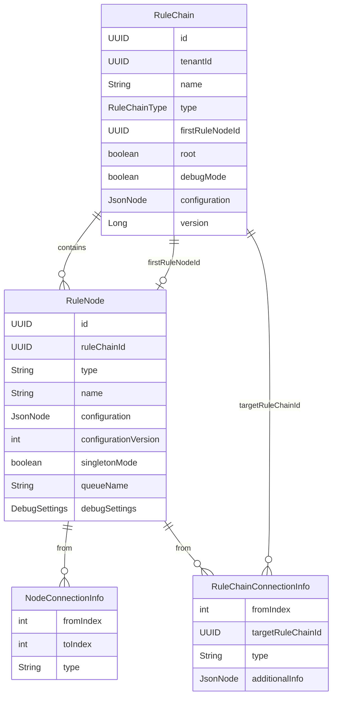

### RuleChain Entity

The container entity for a rule chain.

| Field | Type | Description |
|-------|------|-------------|
| id | RuleChainId (UUID) | Unique identifier |
| tenantId | TenantId (UUID) | Owning tenant |
| name | String | User-defined name (max 255 chars) |
| type | RuleChainType | CORE or EDGE |
| firstRuleNodeId | RuleNodeId (UUID) | Entry point node reference |
| root | boolean | Is this the tenant's default chain |
| debugMode | boolean | Reserved for future use |
| configuration | JsonNode | Reserved for future use |
| version | Long | Optimistic locking version |
| externalId | RuleChainId | For import/export operations |
| additionalInfo | JsonNode | Custom metadata |
| createdTime | long | Creation timestamp (ms) |

### RuleChainType

| Type | Description |
|------|-------------|
| CORE | Standard rule chain for main platform |
| EDGE | Rule chain deployed to edge devices |

### RuleNode Entity

A single processing step within a rule chain.

| Field | Type | Description |
|-------|------|-------------|
| id | RuleNodeId (UUID) | Unique identifier |
| ruleChainId | RuleChainId (UUID) | Parent chain |
| type | String | Fully qualified class name |
| name | String | User-defined display name |
| configuration | JsonNode | Node-specific settings |
| configurationVersion | int | Config schema version |
| singletonMode | boolean | Deploy only on one partition |
| queueName | String | Processing queue name |
| debugSettings | DebugSettings | Debug configuration |
| externalId | RuleNodeId | For import/export |
| additionalInfo | JsonNode | Layout position (x, y) |
| createdTime | long | Creation timestamp (ms) |

### RuleChainMetaData

Complete topology representation for API transfer.

| Field | Type | Description |
|-------|------|-------------|
| ruleChainId | RuleChainId | Reference to the chain |
| version | Long | Chain version |
| firstNodeIndex | Integer | Index of first node in nodes array |
| nodes | List&lt;RuleNode&gt; | All nodes in the chain |
| connections | List&lt;NodeConnectionInfo&gt; | Node-to-node connections |
| ruleChainConnections | List&lt;RuleChainConnectionInfo&gt; | Cross-chain connections |

### NodeConnectionInfo

Connection between two nodes within the same chain.

| Field | Type | Description |
|-------|------|-------------|
| fromIndex | int | Source node index in nodes array |
| toIndex | int | Target node index in nodes array |
| type | String | Relation type (Success, Failure, etc.) |

### RuleChainConnectionInfo

Connection from a node to another rule chain.

| Field | Type | Description |
|-------|------|-------------|
| fromIndex | int | Source node index |
| targetRuleChainId | RuleChainId | Target chain ID |
| type | String | Relation type |
| additionalInfo | JsonNode | Connection metadata (UI labels) |

## Connection Types

### Standard Connection Types

| Type | Constant | Usage |
|------|----------|-------|
| Success | `TbNodeConnectionType.SUCCESS` | Default successful completion |
| Failure | `TbNodeConnectionType.FAILURE` | Error or exception |
| True | `TbNodeConnectionType.TRUE` | Filter condition passed |
| False | `TbNodeConnectionType.FALSE` | Filter condition failed |
| Other | `TbNodeConnectionType.OTHER` | Catch-all for custom types |
| ACK | `TbNodeConnectionType.ACK` | Acknowledgment only |

### Node-Specific Connection Types

Different node types define their own output relations:

| Node Type | Custom Relations |
|-----------|------------------|
| Message Type Switch | One per message type (e.g., "Post telemetry") |
| Originator Type Switch | One per entity type (e.g., "Device", "Asset") |
| Create Alarm | Created, Updated, Cleared |
| Check Alarm Status | Active, Cleared, Acknowledged |
| Device Profile | Success, Failure, per-alarm type outputs |

## Visual Structure

### Graph Layout

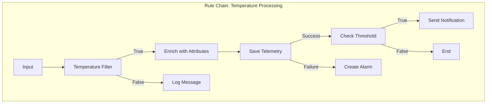

### Layout Storage

Node positions are stored in the `additionalInfo` JSON field:

```json
{
  "layoutX": 450,
  "layoutY": 200,
  "description": "Filters temperature readings above zero"
}
```

## Metadata Structure

### Complete Example

```json
{
  "ruleChainId": {
    "entityType": "RULE_CHAIN",
    "id": "af02c7e0-2f04-11ec-8f2e-4d7a8c12df56"
  },
  "version": 3,
  "firstNodeIndex": 0,
  "nodes": [
    {
      "id": { "entityType": "RULE_NODE", "id": "bf03d8f1-..." },
      "type": "org.thingsboard.rule.engine.filter.TbJsFilterNode",
      "name": "Filter Temperature",
      "configuration": {
        "scriptLang": "TBEL",
        "script": "return msg.temperature != null;"
      },
      "configurationVersion": 0,
      "additionalInfo": { "layoutX": 200, "layoutY": 100 }
    },
    {
      "id": { "entityType": "RULE_NODE", "id": "cf04e9g2-..." },
      "type": "org.thingsboard.rule.engine.telemetry.TbMsgTimeseriesNode",
      "name": "Save Telemetry",
      "configuration": {
        "defaultTTL": 0,
        "skipLatestPersistence": false
      },
      "configurationVersion": 0,
      "additionalInfo": { "layoutX": 450, "layoutY": 100 }
    }
  ],
  "connections": [
    {
      "fromIndex": 0,
      "toIndex": 1,
      "type": "True"
    }
  ],
  "ruleChainConnections": []
}
```

## Runtime Representation

### Route Table Construction

At runtime, the metadata is converted to an efficient routing table:

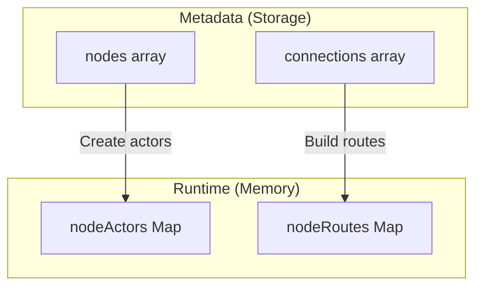

### nodeRoutes Structure

```
Map<RuleNodeId, List<RuleNodeRelation>>

Example:
{
  "filter-node-id": [
    { in: "filter-node-id", out: "save-node-id", type: "True" },
    { in: "filter-node-id", out: "log-node-id", type: "False" }
  ],
  "save-node-id": [
    { in: "save-node-id", out: "alarm-node-id", type: "Success" }
  ]
}
```

### Route Resolution Flow

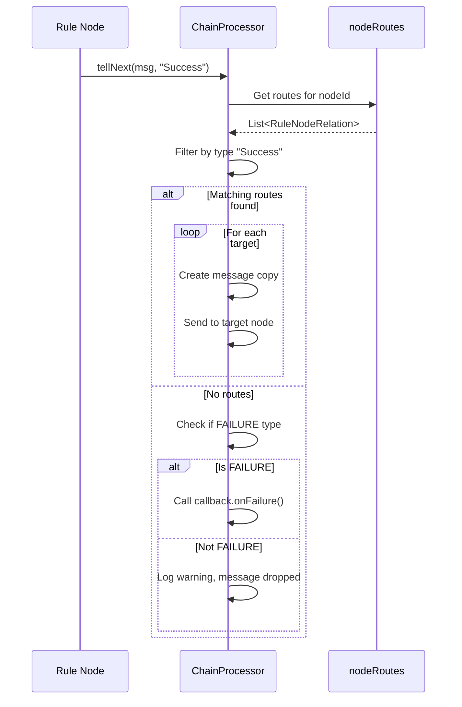

## Root Rule Chain

Each tenant has a root rule chain that processes all incoming device messages by default.

### Root Chain Properties

| Property | Value | Description |
|----------|-------|-------------|
| root | true | Marked as root chain |
| type | CORE | Must be CORE type |
| isDefault() | true | Returns root && type == CORE |

### Root Chain Selection

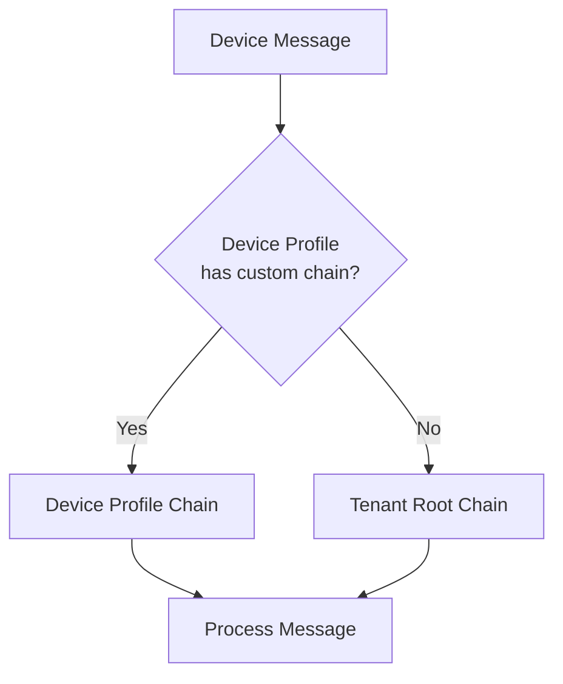

### Default Root Chain Structure

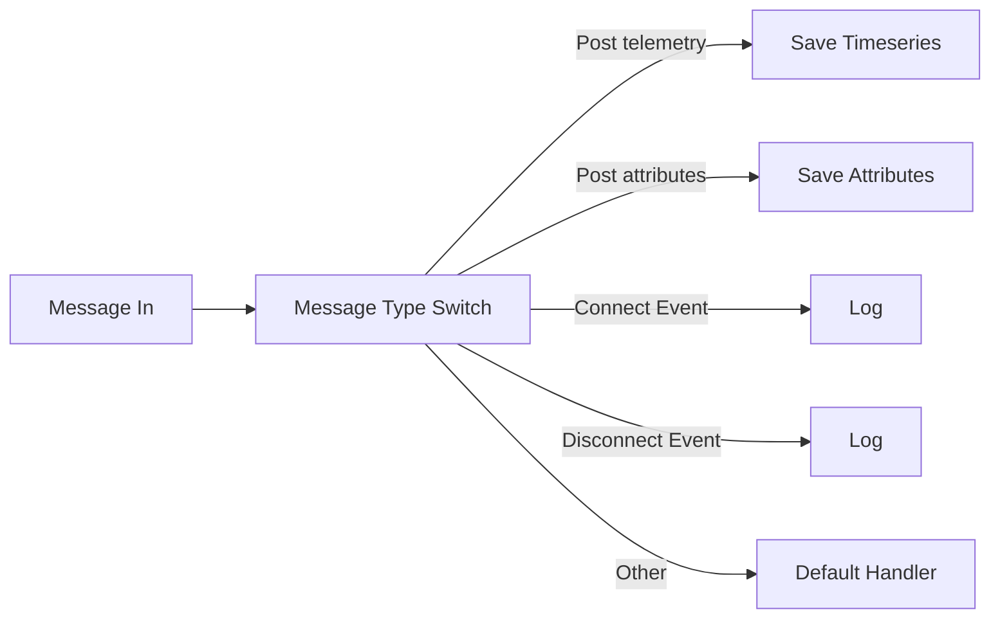

## Nested Rule Chains

### Connection Pattern

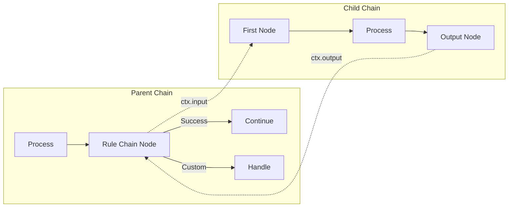

### RuleChainConnectionInfo Usage

When a node needs to route to another chain:

```json
{
  "fromIndex": 2,
  "targetRuleChainId": {
    "entityType": "RULE_CHAIN",
    "id": "child-chain-uuid"
  },
  "type": "Success",
  "additionalInfo": {
    "ruleChainNodeId": "rule-chain-input-node-id"
  }
}
```

### Stack-Based Tracking

Messages maintain a stack for nested chain calls:

```
Message enters Parent Chain
  → Push (parentChainId, currentNodeId) to stack
  → Forward to Child Chain
    → Child processes message
    → Output node pops stack
  → Returns to Parent Chain at saved node
  → Continue processing
```

## Debug Settings

### DebugSettings Structure

| Field | Type | Description |
|-------|------|-------------|
| failuresEnabled | boolean | Log only failures |
| allEnabled | boolean | Log all messages (trigger) |
| allEnabledUntil | long | Timestamp when debug expires |

### Debug Modes

| Mode | Settings | Behavior |
|------|----------|----------|
| Off | failuresEnabled=false, allEnabledUntil=0 | No debug logging |
| Failures Only | failuresEnabled=true | Log only failed messages |
| Timed | allEnabledUntil=future_ts | Log all until timestamp |
| All | allEnabled=true | Log everything (admin sets limit) |

### Debug Event Capture

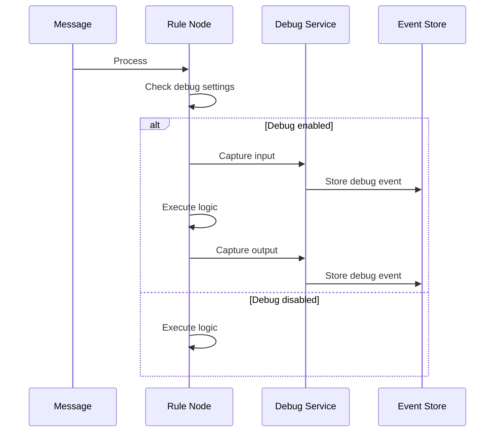

## Singleton Mode

### Purpose

Some nodes should run on only one service instance (e.g., generators, scheduled tasks).

| singletonMode | Behavior |
|---------------|----------|
| false | Node runs on all partitions |
| true | Node runs on one partition only |

### Partition Assignment

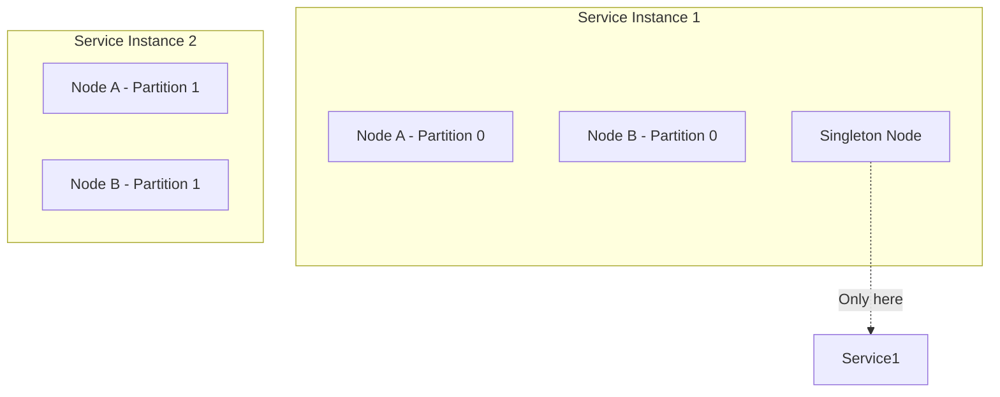

## Queue Assignment

### Per-Node Queue

Nodes can specify a custom processing queue:

| queueName | Behavior |
|-----------|----------|
| null/empty | Use rule chain's default queue |
| "HighPriority" | Process on named queue |
| "Batch" | Process on batch queue |

### Queue Flow

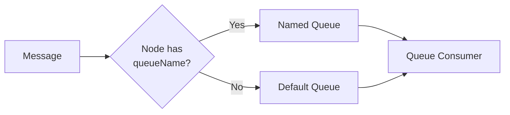

## Import/Export

### External ID

The `externalId` field enables portable rule chain definitions:

| Field | Purpose |
|-------|---------|
| id | Internal database ID |
| externalId | Portable reference ID |

### Export Structure

```json
{
  "ruleChain": {
    "name": "My Chain",
    "type": "CORE",
    "root": false,
    "externalId": { "id": "portable-uuid" }
  },
  "metadata": {
    "nodes": [...],
    "connections": [...],
    "ruleChainConnections": [...]
  }
}
```

### Import Process

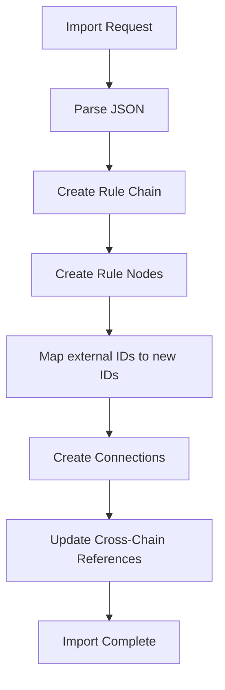

## Validation Rules

### Chain Validation

| Rule | Description |
|------|-------------|
| Name required | Non-empty name |
| First node required | firstRuleNodeId must reference valid node |
| Single root per tenant | Only one root chain per tenant |
| No orphan nodes | All nodes must be reachable |
| No cycles | Graph must be acyclic |

### Node Validation

| Rule | Description |
|------|-------------|
| Type required | Valid class name |
| Name required | Non-empty name |
| Config valid | Configuration matches schema |
| No self-loops | Cannot connect to self |

## API Operations

### Create/Update Chain

```
POST /api/ruleChain
Content-Type: application/json

{
  "name": "New Chain",
  "type": "CORE"
}
```

### Save Metadata

```
POST /api/ruleChain/metadata
Content-Type: application/json

{
  "ruleChainId": {...},
  "firstNodeIndex": 0,
  "nodes": [...],
  "connections": [...],
  "ruleChainConnections": [...]
}
```

### Set Root Chain

```
POST /api/ruleChain/{ruleChainId}/root
```

## Hot Reload Mechanism

When a rule chain is updated via the API, the system performs a hot reload without downtime.

### Update Detection

```mermaid
sequenceDiagram
    participant API as REST API
    participant SVC as RuleChainService
    participant ACTOR as RuleChainActor
    participant NODES as RuleNodeActors

    API->>SVC: Save metadata
    SVC->>SVC: Validate changes
    SVC->>ACTOR: COMPONENT_LIFE_CYCLE_MSG (UPDATE)

    ACTOR->>ACTOR: Load updated config from DB
    ACTOR->>ACTOR: Compare with current state

    alt New nodes detected
        ACTOR->>NODES: Create new RuleNodeActor
    end

    alt Updated nodes detected
        ACTOR->>NODES: RuleNodeUpdatedMsg (high priority)
    end

    alt Deleted nodes detected
        ACTOR->>NODES: COMPONENT_LIFE_CYCLE_MSG (DELETED)
        ACTOR->>ACTOR: Remove from nodeActors map
    end

    ACTOR->>ACTOR: Rebuild nodeRoutes topology
```

### Topology Rebuild

The `nodeRoutes` map is rebuilt from EntityRelation entities:

1. Clear existing routes for modified nodes
2. Load fresh relations from database
3. Validate all target nodes exist (throws exception if invalid reference)
4. Construct new routing table

### In-Flight Message Handling

During hot reload:
- **In-flight messages** use the old configuration until they complete
- **New messages** use the updated configuration immediately
- Transition occurs at node granularity (not atomic chain-wide)

### Node Update Process

When a node's configuration changes:

```mermaid
graph TB
    UPDATE[Config Changed] --> DETECT{Type or<br/>Config Changed?}
    DETECT -->|Yes| DESTROY[destroy() old TbNode]
    DESTROY --> CREATE[Create new TbNode instance]
    CREATE --> INIT[init() with new config]
    INIT --> ACTIVE[Node Active]

    DETECT -->|No| SKIP[Skip reinitialization]
```

### Singleton Node Reassignment

For singleton nodes (`singletonMode: true`):
- If partition ownership changes, node stops on old owner
- Node starts on new owner with fresh initialization
- State is NOT transferred between instances

## See Also

- [Rule Engine Overview](./README.md) - Introduction to rule engine
- [Message Flow (TbMsg)](./message-flow.md) - Message routing details
- [Node Categories](./node-categories.md) - Available node types
- [Node Development Contract](./node-development-contract.md) - Creating custom nodes
- [Actor System](../03-actor-system/README.md) - Underlying execution model
