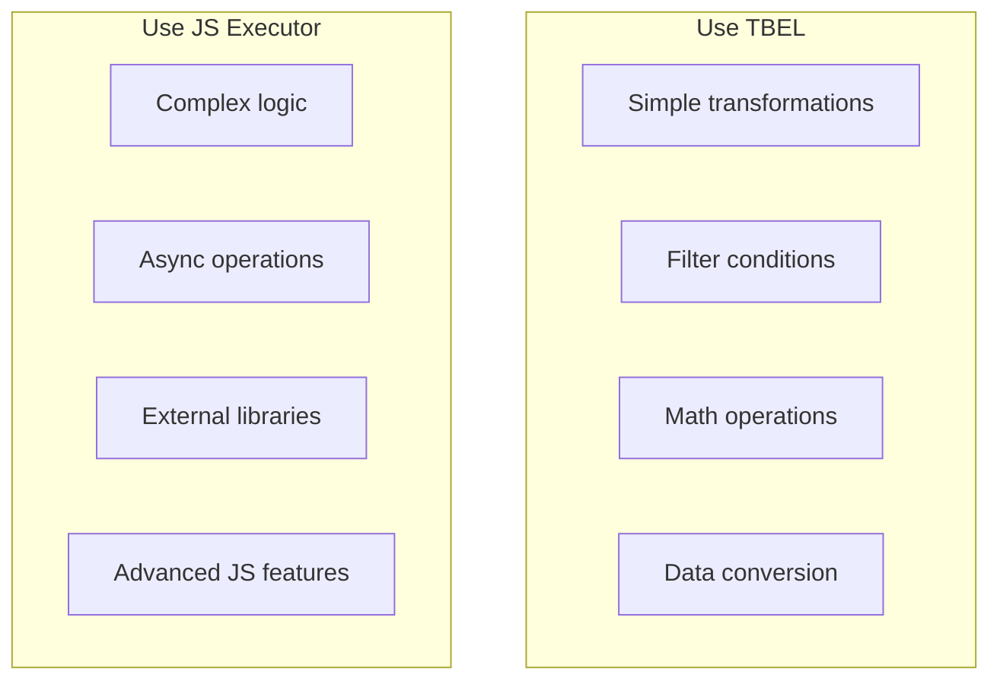

# ThingsBoard Expression Language (TBEL)

## Overview

ThingsBoard Expression Language (TBEL) is a lightweight scripting language for data processing in the Rule Engine and Data Converters. Based on MVEL with security enhancements, TBEL provides a faster, more efficient alternative to JavaScript while maintaining familiar Java-like syntax. TBEL is over 1000x faster than Nashorn and executes locally without the overhead of remote JS Executors.

## Key Behaviors

1. **Java-Like Syntax**: Uses Java syntax with dynamic typing and optional type qualification.

2. **Memory Management**: Built-in memory controls prevent resource abuse.

3. **Security Constraints**: Restricted class access and sandboxed execution.

4. **Helper Functions**: Built-in utilities for encoding, parsing, and type conversion.

5. **Local Execution**: Runs in-process without network overhead.

6. **Compatible with JS**: JSON.stringify/parse and similar functions for migration.

## TBEL vs JavaScript

### Performance Comparison

| Aspect | TBEL | Nashorn (Deprecated) | JS Executor |
|--------|------|----------------------|-------------|
| Execution Speed | 1000x faster | Baseline | ~10x faster |
| Memory Overhead | Minimal | Moderate | Higher |
| Network Latency | None | None | Queue-based |
| Security | Sandboxed | Sandbox required | Container isolated |
| Language Power | Limited | Full JS | Full JS |

### When to Use TBEL



## Syntax Guide

### Basic Expressions

```java
// Property access
msg.temperature

// Boolean expressions
return msg.temperature > 10;

// Complex conditions
return (msg.temperature > 10 && msg.temperature < 20)
    || (msg.humidity > 10 && msg.humidity < 60);
```

### Multiple Statements

Use semicolons to separate statements (optional for last statement):

```java
var a = 2;
var b = 2;
return a + b
```

### Syntax Constraints

**Use `foreach` instead of `for` for iteration:**

```java
// Correct
foreach (item : list) {
    // Process item
}

// Incorrect - not allowed
for (item : list) {
    // Process item
}
```

**Wrap ternary expressions in parentheses:**

```java
// Correct
var result = {
    keyNew: (msg.humidity > 50 ? 3 : 0)
};

// Incorrect
var result = {
    keyNew: msg.humidity > 50 ? 3 : 0  // Results in {3 : 0}
};
```

## Data Structures

### Maps

TBEL uses custom Map implementation for memory control. Only inline creation is allowed.

```java
// Create map
var map = {"temperature": 42, "nested": "508"};

// Access and modify
map.temperature = 0;
map.humidity = 73;
map.put("pressure", 1013);

// Check existence
if (map.temperature != null) {
    // key exists
}

// Null-safe access
if (map.?nonExistingKey.value > 10) {
    // safe navigation
}

// Iteration
foreach (element : map.entrySet()) {
    var key = element.key;
    var value = element.value;
}

// Operations
var keys = map.keys();           // ["temperature", "humidity", "pressure"]
var values = map.values();       // [0, 73, 1013]
var size = map.size();           // 3
map.remove("pressure");          // remove entry
map.sortByKey();                 // sort by keys
map.sortByValue();               // sort by values
```

### Lists

Custom List implementation with JavaScript-like methods.

```java
// Create list
var list = ["A", "B", "C"];

// Access
var first = list[0];
var size = list.size();

// Add elements
list.add("D");
list.push("E");
list.unshift("Z");               // add to front
list.addAll(["X", "Y"]);

// Remove elements
list.remove(0);                  // by index
list.remove("B");                // by value
var last = list.pop();           // remove last
var first = list.shift();        // remove first
list.splice(1, 2);               // remove from index

// Transform
list.sort();                     // ascending
list.sort(false);                // descending
list.reverse();
var newList = list.toSorted();   // returns new sorted list
var sliced = list.slice(0, 2);   // returns new sliced list

// Iteration
foreach (item : list) {
    // process item
}
```

### Sets

```java
// Create from list
var list = ["B", "A", "C", "A"];
var set = toSet(list);           // size = 3, removes duplicate "A"

// Operations
set.add("D");
set.remove("A");
set.contains("B");               // true
set.size();                      // returns count
set.toList();                    // convert to list
set.sort();                      // in-place sort
var sorted = set.toSorted();     // returns new sorted set
```

### Arrays

Only primitive type arrays are supported. String arrays become lists.

```java
// Create array
var array = new int[3];
array[0] = 1;
array[1] = 2;
array[2] = 3;

// String indexing
var str = "Hello";
var first = str[0];              // 'H'
```

## Literals

### String Literals

```java
"Double quoted string"
'Single quoted string'
```

**Escape sequences:**
- `\\` - Backslash
- `\n` - Newline
- `\r` - Return
- `\u####` - Unicode (e.g., `\uAE00`)
- `\###` - Octal (e.g., `\73`)

### Numeric Literals

```java
125        // decimal
0353       // octal (prefix 0)
0xAFF0     // hexadecimal (prefix 0x)
10.503     // double
94.92d     // double (explicit)
14.5f      // float
104.39484B // BigDecimal
8.4I       // BigInteger
```

### Boolean and Null

```java
true
false
null
nil        // alias for null
```

## Flow Control

### If-Then-Else

```java
if (temperature > 0) {
    return "Positive";
} else if (temperature == 0) {
    return "Zero";
} else {
    return "Negative";
}
```

### Ternary Operator

```java
var result = temperature > 0 ? "Hot" : "Cold";
```

### Loops

```java
// Foreach
var sum = 0;
foreach (n : numbers) {
    sum += n;
}

// For loop
for (var i = 0; i < 100; i++) {
    sum += i;
}

// While
while (condition()) {
    doSomething();
}

// Do-while
do {
    x = something();
} while (x != null);

// Until (inverse of while)
until (isFalse()) {
    doSomething();
}
```

## Helper Functions

### Encoding/Decoding

| Function | Description | Example |
|----------|-------------|---------|
| `btoa(str)` | Base64 encode | `btoa("Hello")` → `"SGVsbG8="` |
| `atob(str)` | Base64 decode | `atob("SGVsbG8=")` → `"Hello"` |
| `encodeURI(uri)` | URL encode | `encodeURI("hello world")` |
| `decodeURI(uri)` | URL decode | `decodeURI("hello%20world")` |

### Number Functions

| Function | Description | Example |
|----------|-------------|---------|
| `toFixed(val, precision)` | Round double | `toFixed(0.345, 2)` → `0.35` |
| `toInt(val)` | Round to integer | `toInt(2.7)` → `3` |
| `isNaN(val)` | Check if NaN | `isNaN(0.0/0.0)` → `true` |

### String/Byte Conversion

```java
// String to bytes
var bytes = stringToBytes("Hello");        // UTF-8 default
var bytes = stringToBytes("Hello", "UTF-16");

// Bytes to string
var str = bytesToString([72, 69, 76, 76, 79]);  // "HELLO"

// Decode JSON from bytes
var json = decodeToJson(bytes);
```

### Hex Conversion

```java
// Hex to bytes
var bytes = hexToBytes("0x48454C4C4F");    // [72, 69, 76, 76, 79]

// Bytes to hex
var hex = bytesToHex([0xAA, 0xBB]);         // "AABB"

// Number to hex
var hex = intToHex(255);                    // "FF"
var hex = longToHex(9223372036854775807L);

// Hex to number
var i = parseHexToInt("FF");                // 255
var d = parseHexToDouble("409B04B10CB295EA");
```

### Byte Parsing

```java
var bytes = [0xAA, 0xBB, 0xCC, 0xDD];

// Parse to int (offset, length, bigEndian)
var i = parseBytesToInt(bytes, 0, 3, true);    // 11189196
var i = parseBytesToInt(bytes, 0, 3, false);   // 13417386 (little endian)

// Parse to long
var l = parseBytesToLong(bytes, 0, 4);

// Parse to float
var f = parseBytesToFloat(bytes, 0, 4);

// Parse to double
var d = parseBytesToDouble(bytes, 0, 8);
```

### Padding

```java
// Pad start
padStart("42", 5, '0');          // "00042"

// Pad end
padEnd("42", 5, '0');            // "42000"
```

### Type Checking

| Function | Description | Return |
|----------|-------------|--------|
| `isBinary(str)` | Is binary string | 2 or -1 |
| `isOctal(str)` | Is octal string | 8 or -1 |
| `isDecimal(str)` | Is decimal string | 10 or -1 |
| `isHexadecimal(str)` | Is hex string | 16 or -1 |
| `isMap(obj)` | Is Map | boolean |
| `isList(obj)` | Is List | boolean |
| `isSet(obj)` | Is Set | boolean |
| `isArray(obj)` | Is Array | boolean |

### Error Handling

```java
raiseError("Invalid value: " + value);
```

## Date Handling

TBEL provides a Date class compatible with JavaScript Date methods.

### Create Date

```java
// From ISO string
var d = new Date("2023-08-06T04:04:05.123Z");

// From components (year, month, day, hour, min, sec, timezone)
var d = new Date(2023, 8, 6, 4, 4, 5, "America/New_York");

// With pattern
var pattern = "yyyy-MM-dd HH:mm:ss.SSSXXX";
var d = new Date("2023-08-06 04:04:05.000+02:00", pattern);

// With pattern and locale
var d = new Date("12:15:30 PM, Sun 10/09/2022", "hh:mm:ss a, EEE M/d/uuuu", "en-US");
```

### Date Methods

```java
var d = new Date("2023-08-06T04:04:05.123Z");

// Output formats
d.toISOString();                             // "2023-08-06T04:04:05.123Z"
d.toLocaleString("en-US");                   // "8/6/23, 4:04:05 AM"
d.toLocaleString("de", "Europe/Berlin");     // "06.08.23, 06:04:05"

// With options
var options = {"timeZone":"Europe/Berlin", "dateStyle":"full"};
d.toLocaleString("en-US", JSON.stringify(options));

// Date manipulation
d.addYears(1);
d.addMonths(2);
d.addDays(10);
d.addHours(5);
d.addMinutes(30);
d.addSeconds(45);
```

## JSON Handling

```java
// Parse JSON string to object
var obj = JSON.parse('{"temperature": 25}');

// Stringify object to JSON
var str = JSON.stringify({"temperature": 25});

// Access parsed data
var temp = obj.temperature;
```

## Java Class Usage

Limited Java classes from `java.util` and `java.lang` are available:

```java
// Math operations
var sqrt = Math.sqrt(4);           // 2.0
var abs = Math.abs(-5);            // 5
var max = Math.max(10, 20);        // 20

// String formatting
var formatted = String.format("%.2f", 3.14159);  // "3.14"

// Collections
java.util.Collections.reverse(list);

// Integer/Long conversion
var hex = Integer.toString(255, 16);  // "ff"
var bin = Integer.toString(10, 2);    // "1010"
```

**Restrictions:**
- Cannot instantiate classes (`new java.util.ArrayList()` not allowed)
- Only specific whitelisted classes available

## Common Use Cases

### Filter Node

```java
// Simple threshold check
return msg.temperature > 100;

// Complex condition
return msg.temperature > 50
    && msg.humidity < 80
    && metadata.deviceType == "sensor";
```

### Transform Node

```java
// Transform message
var result = {
    "temp_celsius": msg.temperature,
    "temp_fahrenheit": msg.temperature * 9/5 + 32,
    "timestamp": metadata.ts
};
return {"msg": result, "metadata": metadata, "msgType": msgType};
```

### Script Node

```java
// Parse hex payload
var hexData = msg.data;
var bytes = hexToBytes(hexData);

var temperature = parseBytesToInt(bytes, 0, 2) / 100.0;
var humidity = parseBytesToInt(bytes, 2, 2) / 100.0;

return {
    "msg": {
        "temperature": temperature,
        "humidity": humidity
    },
    "metadata": metadata,
    "msgType": msgType
};
```

### Data Converter (Uplink)

```java
// LoRaWAN uplink decoder
var data = decodeToJson(payload);
var deviceName = data.deviceEUI;

var result = {
    "deviceName": deviceName,
    "deviceType": "lorawan-sensor",
    "telemetry": {
        "temperature": data.temperature,
        "battery": data.battery
    },
    "attributes": {
        "rssi": data.rssi,
        "snr": data.snr
    }
};
return result;
```

## Performance Tips

| Practice | Benefit |
|----------|---------|
| Use TBEL for simple transforms | Faster than JS |
| Avoid complex loops | Memory efficient |
| Use built-in helpers | Optimized functions |
| Minimize string operations | Reduce allocations |
| Pre-compute constants | Avoid repeated calculations |

## Configuration

### Enable TBEL

TBEL is enabled by default. System parameters:

| Parameter | Default | Description |
|-----------|---------|-------------|
| `script.use_sandbox` | true | Enable sandbox mode |
| `script.stats.enabled` | true | Enable script statistics |
| `script.stats.max_errors` | 5 | Max errors before throttle |

### Memory Limits

Built-in limits prevent resource abuse:
- Map/List size limits
- Loop iteration limits
- String length limits
- Execution time limits

## Troubleshooting

### Common Errors

| Error | Cause | Solution |
|-------|-------|----------|
| `Invalid statement` | Syntax error | Check Java syntax |
| `ArrayIndexOutOfBounds` | Array access error | Validate array indices |
| `Map is unmodifiable` | Modifying immutable | Use mutable copy |
| `List is unmodifiable` | Modifying immutable | Use `.clone()` |
| `Class not allowed` | Restricted class | Use allowed classes only |

### Debug Tips

1. Test expressions in Rule Engine debug mode
2. Use `return` to output intermediate values
3. Check for null values with safe navigation (`?.`)
4. Validate input data types
5. Review transformation output in rule chain debug

## Common Pitfalls

### Null Pointer Handling

| Pitfall | Impact | Solution |
|---------|--------|----------|
| Not checking for null | NullPointerException, script fails | Always use safe navigation: `msg.?field` or explicit null checks |
| Accessing nested nulls | Runtime exception | Check each level: `msg.?obj.?field` or validate first |
| Null in arithmetic | Error or unexpected results | Use null coalescing: `(msg.value ?? 0) + 10` |
| Missing metadata keys | Null reference | Check existence: `metadata.key != null` before use |

### Type Coercion and Conversion

| Pitfall | Impact | Solution |
|---------|--------|----------|
| String to number implicit conversion | Type errors | Explicit conversion: `parseFloat(metadata.value)` or `parseInt(metadata.count)` |
| Boolean string comparison | Unexpected results | Compare strings: `metadata.enabled === 'true'`, not `=== true` |
| Numeric string concatenation | String concat instead of math | Convert first: `parseInt(a) + parseInt(b)` |
| Date string handling | Invalid date operations | Use `parseDate()` or Java Date constructors |

### Syntax and Language Features

| Pitfall | Impact | Solution |
|---------|--------|----------|
| Using `for` instead of `foreach` | Syntax error | Use `foreach (item : array) { }` not `for (item in array)` |
| Arrow functions (`=>`) | Not supported in TBEL | Use traditional function syntax: `function name() { }` |
| `let`/`const` keywords | Not supported | Use `var` for variable declarations |
| Template literals | Not supported | Use string concatenation: `"Value: " + value` |
| Spread operator (`...`) | Not supported | Use manual array/object copying |

### Performance Issues

| Pitfall | Impact | Solution |
|---------|--------|----------|
| Infinite loops | Script timeout, message failure | Always include termination condition; use iteration limits |
| Large loops in filters | Processing delay per message | Pre-calculate in enrichment; use simpler logic |
| Deep recursion | Stack overflow | Limit recursion depth; use iterative approach |
| Creating large objects | Memory pressure | Minimize object creation in hot paths |
| String concatenation in loops | Performance degradation | Use array and join: `parts.push(item); parts.join("")` |

### Array and Collection Operations

| Pitfall | Impact | Solution |
|---------|--------|----------|
| Array index out of bounds | Runtime exception | Check length first: `if (array.length > index)` |
| Modifying immutable collections | Error | Clone first: `var copy = msg.array.clone()` |
| Assuming array exists | Null pointer | Check: `if (msg.array != null && msg.array.length > 0)` |
| Foreach on non-array | Type error | Validate: `if (Array.isArray(msg.items))` |

### Data Access Patterns

| Pitfall | Impact | Solution |
|---------|--------|----------|
| Accessing missing message fields | Null reference | Use safe navigation or check existence |
| Assuming metadata format | Type mismatches | Validate and convert metadata values |
| Modifying msg/metadata directly | Side effects | Return new structure in transforms |
| Deep object navigation | Null pointer at any level | Check each level or use safe navigation |

### Common Logic Errors

| Pitfall | Impact | Solution |
|---------|--------|----------|
| Using `=` instead of `===` | Assignment, not comparison | Use `===` for equality, `==` for loose equality |
| Incorrect operator precedence | Wrong calculation results | Use parentheses: `(a + b) * c` |
| Short-circuit evaluation surprise | Unexpected behavior | Understand `&&` and `||` evaluation order |
| Truthy/falsy confusion | Wrong boolean logic | Explicit comparison: `value === true`, not `if (value)` |

### TBEL vs JavaScript Differences

| Pitfall | Impact | Solution |
|---------|--------|----------|
| Using JavaScript-only features | Syntax errors | Stick to TBEL supported syntax |
| Expecting async/await | Not supported | Use synchronous code only |
| Promise-based code | Not supported | Use direct values |
| ES6+ features | Syntax errors | Use ES5-compatible syntax |

### Script Structure

| Pitfall | Impact | Solution |
|---------|--------|----------|
| Filter script not returning boolean | Routes to Failure | Always return `true` or `false` explicitly |
| Transform script incomplete return | Undefined message | Return `{msg, metadata, msgType}` structure |
| Switch script wrong return type | Routing errors | Return string or string array |
| Script without return statement | Undefined behavior | Always include explicit return |

### Security and Validation

| Pitfall | Impact | Solution |
|---------|--------|----------|
| No input validation | Processing invalid data | Validate data types and ranges |
| Trusting user input | Injection risks | Sanitize all external data |
| Exposing sensitive data in logs | Security breach | Sanitize before logging |
| No error handling | Unhandled exceptions | Use try-catch where appropriate |

## See Also

- [Rule Engine Overview](./README.md) - Rule chain processing
- [Transformation Nodes](./nodes/transformation-nodes.md) - Script and transform nodes
- [Filter Nodes](./nodes/filter-nodes.md) - Script filter nodes
- [JS Executor Service](../11-microservices/js-executor.md) - JavaScript execution service
