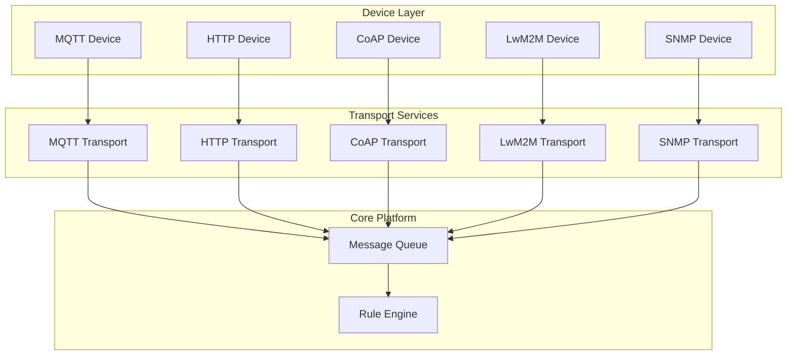

# Transport Layer

## Overview

The transport layer handles device connectivity across multiple IoT protocols. Each transport implements a common contract, allowing devices to connect via MQTT, HTTP, CoAP, LwM2M, or SNMP while presenting a unified interface to the rest of the platform.

## Contents

| Document | Description |
|----------|-------------|
| [Transport Contract](./transport-contract.md) | Common abstraction, message routing, and transport lifecycle |
| [MQTT](./mqtt.md) | MQTT 3.1.1/5.0 support, topics, QoS, and session management |
| [Gateway MQTT](./gateway-mqtt.md) | Multi-device gateway API for MQTT bridges |
| [HTTP](./http.md) | REST-based device API for telemetry and attributes |
| [CoAP](./coap.md) | Constrained Application Protocol for low-power devices |
| [LwM2M](./lwm2m.md) | Lightweight M2M for device management and firmware updates |
| [SNMP](./snmp.md) | Simple Network Management Protocol for network equipment |
| [SSL/TLS Configuration](./ssl-configuration.md) | Certificate setup, DTLS, and secure transport configuration |

## Key Concepts

- **Protocol Abstraction**: All transports produce `TransportProtos` messages internally
- **Authentication**: Token-based, X.509 certificate, or protocol-specific credentials
- **Session Management**: Connection state, keep-alive, and reconnection handling
- **Message Routing**: Transport → Queue → Rule Engine flow
- **Rate Limiting**: Per-device and per-tenant throttling
- **Transport Security**: SSL/TLS for TCP protocols, DTLS for UDP protocols

## Transport Architecture

## See Also

- [Device Entity](../02-core-concepts/entities/device.md) - Device provisioning and credentials
- [Message Queue](../08-message-queue/README.md) - Transport to core communication
- [Security](../09-security/README.md) - Transport authentication
