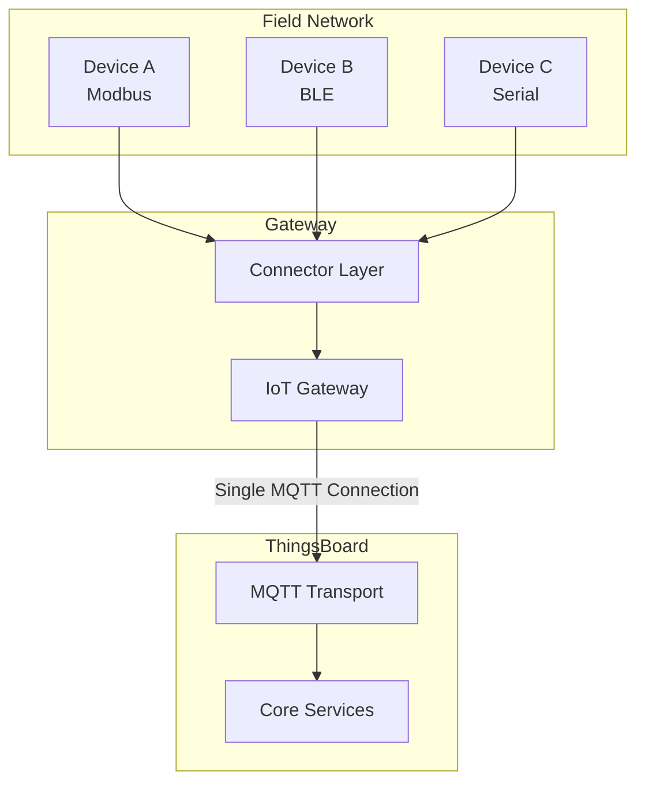
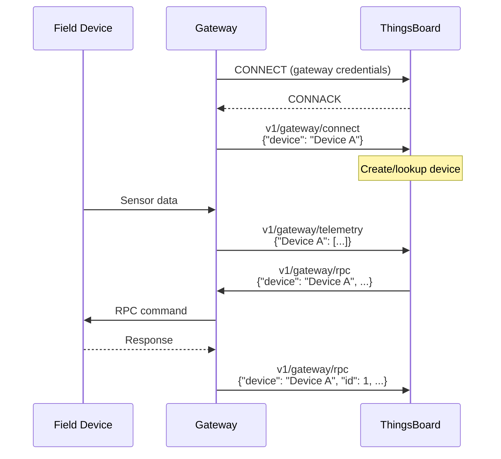
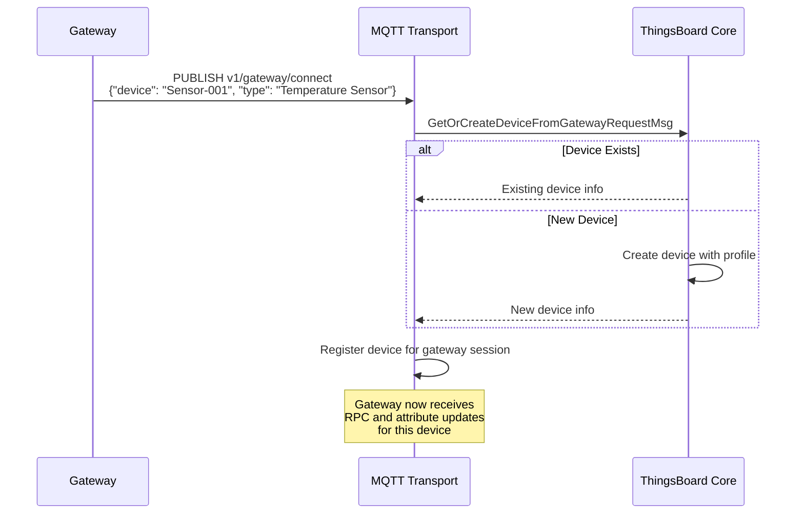
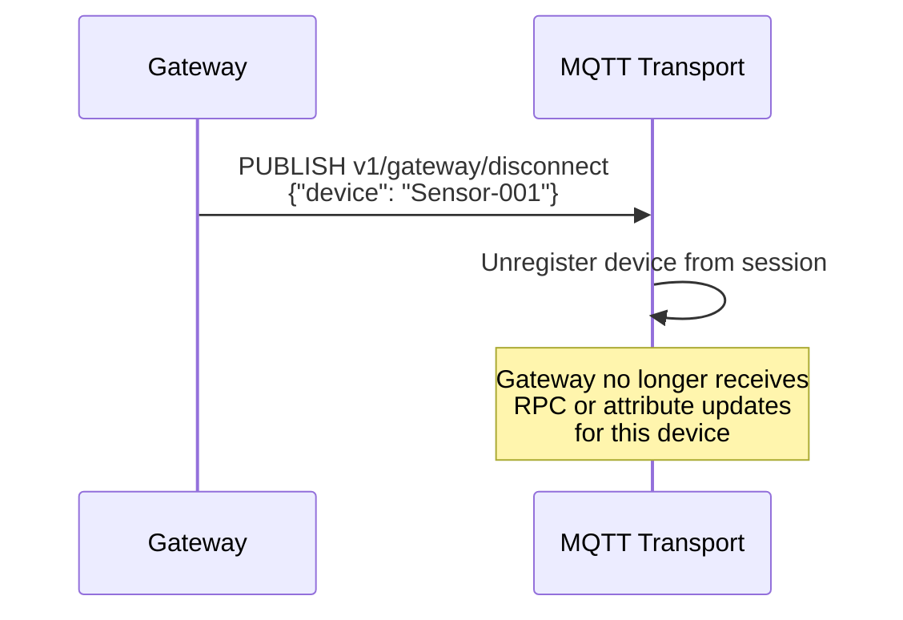
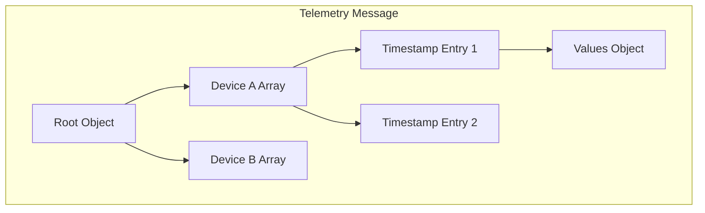
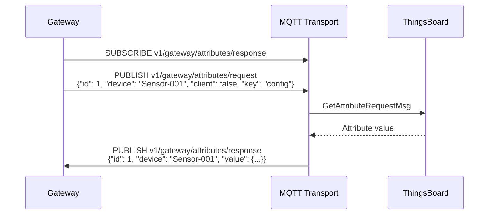
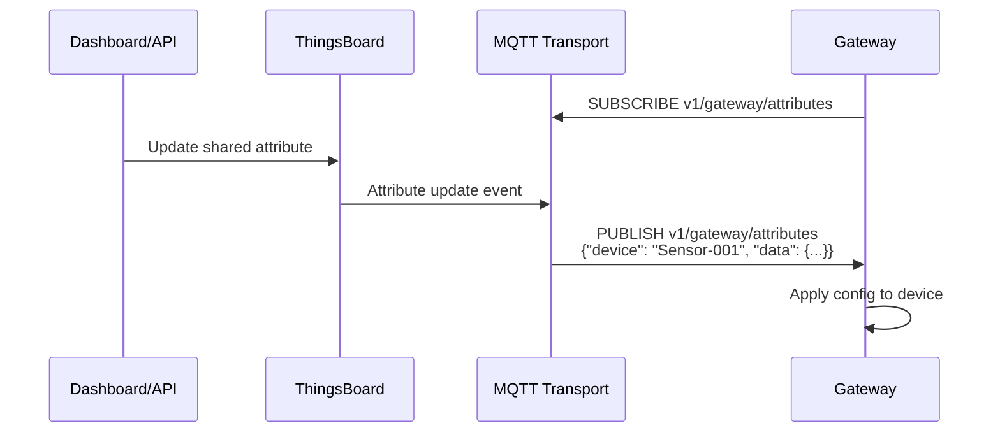
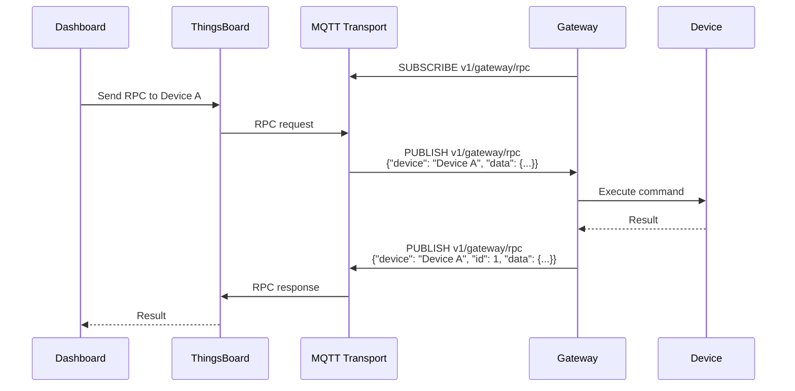
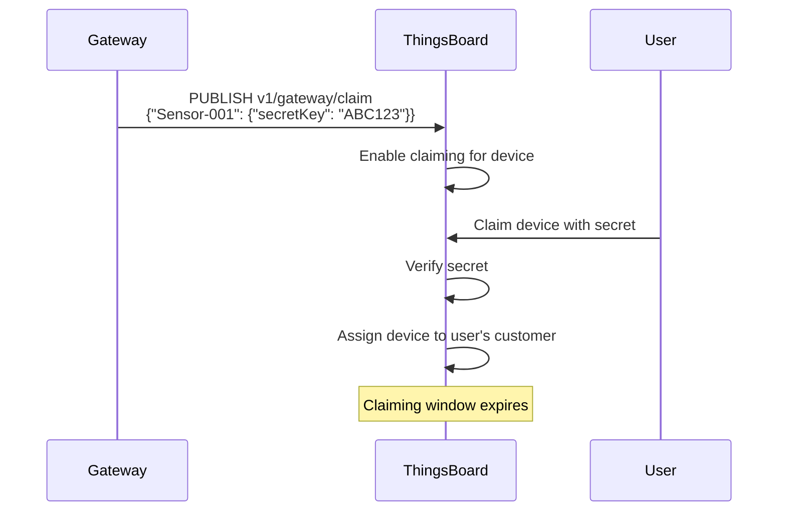
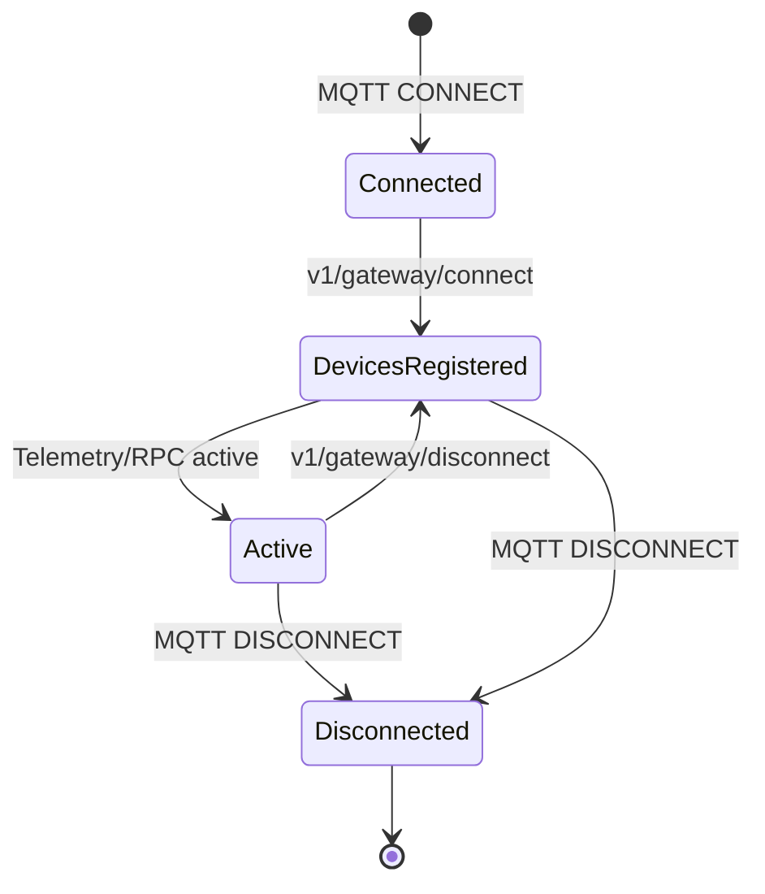

# Gateway MQTT API

## Overview

The Gateway MQTT API enables a single device to act as a bridge between ThingsBoard and multiple connected devices. A gateway maintains one MQTT connection to ThingsBoard while managing telemetry, attributes, and RPC for many downstream devices. This is ideal for scenarios where devices cannot connect directly to ThingsBoard due to protocol limitations, network constraints, or legacy system integration.

## Key Behaviors

1. **Single Connection, Multiple Devices**: One MQTT session handles all connected devices.

2. **Dynamic Device Management**: Devices can be connected and disconnected at runtime.

3. **Automatic Provisioning**: Devices are created automatically when first reported by the gateway.

4. **Bidirectional Communication**: Supports telemetry upload, attribute sync, and RPC in both directions.

5. **Device Profile Assignment**: Devices can be assigned to profiles via the `type` parameter.

## Architecture

### Gateway Communication Model



### Message Flow



## Topic Reference

### Gateway Topics

| Topic | Direction | Description |
|-------|-----------|-------------|
| `v1/gateway/connect` | Publish | Announce device connection |
| `v1/gateway/disconnect` | Publish | Announce device disconnection |
| `v1/gateway/telemetry` | Publish | Send telemetry for multiple devices |
| `v1/gateway/attributes` | Publish | Update client attributes |
| `v1/gateway/attributes` | Subscribe | Receive shared attribute updates |
| `v1/gateway/attributes/request` | Publish | Request attribute values |
| `v1/gateway/attributes/response` | Subscribe | Receive attribute values |
| `v1/gateway/rpc` | Subscribe | Receive RPC commands |
| `v1/gateway/rpc` | Publish | Send RPC responses |
| `v1/gateway/claim` | Publish | Initiate device claiming |

### Topic Comparison: Device vs Gateway

| Operation | Device Topic | Gateway Topic |
|-----------|--------------|---------------|
| Telemetry | `v1/devices/me/telemetry` | `v1/gateway/telemetry` |
| Attributes | `v1/devices/me/attributes` | `v1/gateway/attributes` |
| RPC Subscribe | `v1/devices/me/rpc/request/+` | `v1/gateway/rpc` |
| RPC Response | `v1/devices/me/rpc/response/{id}` | `v1/gateway/rpc` |

## Device Connect API

### Connect Device

Inform ThingsBoard that a device is connected to the gateway.

**Topic:** `v1/gateway/connect`

**Payload:**
```json
{
  "device": "Device A",
  "type": "default"
}
```

| Field | Required | Description |
|-------|----------|-------------|
| `device` | Yes | Device name (created if not exists) |
| `type` | No | Device profile name (default: "default") |

### Connect Flow



### Device Lookup Behavior

When a gateway connects a device:

1. **Device Exists**: ThingsBoard looks up by name within the gateway's tenant
2. **Device Not Found**: A new device is created with:
   - Name from the `device` field
   - Profile from the `type` field (or "default")
   - Assigned to the gateway as a related device

### Multiple Devices

Connect multiple devices in sequence:

```json
// First publish
{"device": "Sensor-001", "type": "Temperature Sensor"}

// Second publish
{"device": "Sensor-002", "type": "Humidity Sensor"}

// Third publish
{"device": "Actuator-001", "type": "Relay Controller"}
```

## Device Disconnect API

### Disconnect Device

Inform ThingsBoard that a device has disconnected from the gateway.

**Topic:** `v1/gateway/disconnect`

**Payload:**
```json
{
  "device": "Device A"
}
```

### Disconnect Behavior



**Important:** Disconnecting a device:
- Stops RPC command delivery to the gateway for that device
- Stops shared attribute update notifications
- Does **not** delete the device from ThingsBoard
- Does **not** affect telemetry history

## Telemetry Upload API

### Upload Telemetry

Send telemetry data for one or more devices in a single message.

**Topic:** `v1/gateway/telemetry`

**Payload Format:**
```json
{
  "Device A": [
    {
      "ts": 1483228800000,
      "values": {
        "temperature": 42.5,
        "humidity": 80
      }
    },
    {
      "ts": 1483228801000,
      "values": {
        "temperature": 42.7,
        "humidity": 79
      }
    }
  ],
  "Device B": [
    {
      "ts": 1483228800000,
      "values": {
        "pressure": 101.3
      }
    }
  ]
}
```

### Telemetry Structure



| Field | Required | Description |
|-------|----------|-------------|
| Device key | Yes | Device name (must be connected first) |
| `ts` | No | Unix timestamp in milliseconds |
| `values` | Yes | Key-value telemetry data |

### Timestamp Handling

| Scenario | Behavior |
|----------|----------|
| `ts` provided | Use provided timestamp |
| `ts` omitted | Server assigns current timestamp |
| Multiple entries | Each entry can have different timestamp |

### Simplified Format

For single-timestamp data without explicit timestamp:

```json
{
  "Device A": {
    "temperature": 42.5,
    "humidity": 80
  },
  "Device B": {
    "pressure": 101.3
  }
}
```

## Attributes API

### Publish Client Attributes

Update client-side attributes for devices.

**Topic:** `v1/gateway/attributes`

**Payload:**
```json
{
  "Device A": {
    "attribute1": "value1",
    "attribute2": 42
  },
  "Device B": {
    "firmware": "1.2.3",
    "status": "active"
  }
}
```

### Request Attribute Values

Request client or shared attributes from the server.

**Request Topic:** `v1/gateway/attributes/request`

**Request Payload:**
```json
{
  "id": 1,
  "device": "Device A",
  "client": true,
  "key": "firmware"
}
```

| Field | Required | Description |
|-------|----------|-------------|
| `id` | Yes | Request identifier (integer) |
| `device` | Yes | Device name |
| `client` | Yes | `true` for client attributes, `false` for shared |
| `key` | Yes | Attribute key to retrieve |

**Response Topic:** `v1/gateway/attributes/response`

**Response Payload:**
```json
{
  "id": 1,
  "device": "Device A",
  "value": "1.2.3"
}
```

### Request Flow



### Subscribe to Attribute Updates

Receive notifications when shared attributes change.

**Subscribe Topic:** `v1/gateway/attributes`

**Notification Payload:**
```json
{
  "device": "Device A",
  "data": {
    "configParam1": "newValue",
    "configParam2": 100
  }
}
```

### Attribute Update Flow



## RPC API

### Subscribe to RPC Commands

Receive server-side RPC commands for connected devices.

**Subscribe Topic:** `v1/gateway/rpc`

**Command Payload (received):**
```json
{
  "device": "Device A",
  "data": {
    "id": 1,
    "method": "setValue",
    "params": {
      "pin": 7,
      "value": 1
    }
  }
}
```

| Field | Description |
|-------|-------------|
| `device` | Target device name |
| `data.id` | RPC request identifier |
| `data.method` | RPC method name |
| `data.params` | Method parameters |

### Send RPC Response

Respond to server-side RPC commands.

**Publish Topic:** `v1/gateway/rpc`

**Response Payload:**
```json
{
  "device": "Device A",
  "id": 1,
  "data": {
    "success": true,
    "value": 42
  }
}
```

| Field | Required | Description |
|-------|----------|-------------|
| `device` | Yes | Device that processed the RPC |
| `id` | Yes | Request ID from the command |
| `data` | Yes | Response payload |

### RPC Flow



### RPC Timeout Handling

| Scenario | Behavior |
|----------|----------|
| Response received | Delivered to caller |
| No response within timeout | Error returned to caller |
| Gateway disconnects | RPC fails with connection error |

## Device Claiming API

### Initiate Claiming

Allow end users to claim devices connected through the gateway.

**Topic:** `v1/gateway/claim`

**Payload:**
```json
{
  "Device A": {
    "secretKey": "claiming_secret",
    "durationMs": 60000
  },
  "Device B": {
    "secretKey": "another_secret",
    "durationMs": 120000
  }
}
```

| Field | Required | Description |
|-------|----------|-------------|
| `secretKey` | No | Claiming secret (empty string if omitted) |
| `durationMs` | No | Claiming window duration (uses system default if omitted) |

### Claiming Flow



## Gateway Session Management

### Session Lifecycle



### Gateway vs Device Sessions

| Aspect | Device Session | Gateway Session |
|--------|---------------|-----------------|
| Scope | Single device | Multiple devices |
| Authentication | Per device | Gateway credentials |
| RPC delivery | Direct to device | Routed via gateway |
| Attribute updates | Direct to device | Routed via gateway |
| Telemetry | Single device per message | Multiple devices per message |

### Session State

The gateway session tracks:

| State | Description |
|-------|-------------|
| Connected devices | Set of device names announced via `connect` |
| Subscriptions | Active MQTT subscriptions (attributes, RPC) |
| Pending RPCs | Outstanding RPC requests awaiting responses |

## Error Handling

### Common Errors

| Error | Cause | Solution |
|-------|-------|----------|
| Device not found | Telemetry for unconnected device | Send `connect` first |
| Invalid JSON | Malformed payload | Validate JSON structure |
| Unauthorized | Invalid gateway credentials | Check access token |
| Rate limited | Too many requests | Implement backoff |

### Error Response Handling

The gateway API does not return explicit error responses for most operations. Monitor:

- MQTT PUBACK for delivery confirmation
- Device connectivity in ThingsBoard UI
- Gateway logs for processing errors

## Configuration

### Gateway Device Setup

1. Create a gateway device in ThingsBoard
2. Enable "Is Gateway" flag in device settings
3. Copy access token for MQTT connection

### Transport Configuration

| Setting | Default | Description |
|---------|---------|-------------|
| `GATEWAY_MAX_DEVICES` | 1000 | Max devices per gateway |
| `GATEWAY_SESSION_REPORT_TIMEOUT` | 30000 | Activity report interval (ms) |

## Best Practices

### Device Management

| Practice | Benefit |
|----------|---------|
| Connect devices on discovery | Accurate device inventory |
| Disconnect on device loss | Clean session state |
| Use meaningful device names | Easy identification |
| Assign device profiles | Proper type classification |

### Telemetry Optimization

| Practice | Benefit |
|----------|---------|
| Batch telemetry | Reduced message count |
| Use timestamps | Accurate time-series data |
| Aggregate on gateway | Lower bandwidth |
| Compress payloads | Smaller messages |

### Reliability

| Practice | Benefit |
|----------|---------|
| Use QoS 1 for critical data | Delivery guarantee |
| Implement local buffering | Handle disconnections |
| Monitor RPC timeouts | Detect failures |
| Health check connectivity | Proactive maintenance |

## Example Implementation

### Python Gateway Example

```python
import paho.mqtt.client as mqtt
import json
import time

# Gateway configuration
THINGSBOARD_HOST = "localhost"
GATEWAY_TOKEN = "GATEWAY_ACCESS_TOKEN"

# Connect callback
def on_connect(client, userdata, flags, rc):
    print(f"Connected with result code {rc}")
    # Subscribe to RPC and attribute updates
    client.subscribe("v1/gateway/rpc")
    client.subscribe("v1/gateway/attributes")
    client.subscribe("v1/gateway/attributes/response")

# Message callback
def on_message(client, userdata, msg):
    print(f"Received: {msg.topic} -> {msg.payload}")

    if msg.topic == "v1/gateway/rpc":
        # Handle RPC command
        data = json.loads(msg.payload)
        device = data["device"]
        rpc_id = data["data"]["id"]
        method = data["data"]["method"]

        # Process RPC and send response
        response = {
            "device": device,
            "id": rpc_id,
            "data": {"success": True}
        }
        client.publish("v1/gateway/rpc", json.dumps(response))

# Initialize client
client = mqtt.Client()
client.username_pw_set(GATEWAY_TOKEN)
client.on_connect = on_connect
client.on_message = on_message

# Connect to ThingsBoard
client.connect(THINGSBOARD_HOST, 1883, 60)

# Connect a device
client.publish("v1/gateway/connect",
    json.dumps({"device": "Sensor-001", "type": "Temperature Sensor"}))

# Send telemetry
telemetry = {
    "Sensor-001": [
        {"ts": int(time.time() * 1000), "values": {"temperature": 25.5}}
    ]
}
client.publish("v1/gateway/telemetry", json.dumps(telemetry))

# Run event loop
client.loop_forever()
```

### Node.js Gateway Example

```javascript
const mqtt = require('mqtt');

const THINGSBOARD_HOST = 'mqtt://localhost';
const GATEWAY_TOKEN = 'GATEWAY_ACCESS_TOKEN';

const client = mqtt.connect(THINGSBOARD_HOST, {
    username: GATEWAY_TOKEN
});

client.on('connect', () => {
    console.log('Connected to ThingsBoard');

    // Subscribe to gateway topics
    client.subscribe('v1/gateway/rpc');
    client.subscribe('v1/gateway/attributes');

    // Connect a device
    client.publish('v1/gateway/connect', JSON.stringify({
        device: 'Sensor-001',
        type: 'Temperature Sensor'
    }));

    // Send telemetry periodically
    setInterval(() => {
        const telemetry = {
            'Sensor-001': [{
                ts: Date.now(),
                values: { temperature: 20 + Math.random() * 10 }
            }]
        };
        client.publish('v1/gateway/telemetry', JSON.stringify(telemetry));
    }, 5000);
});

client.on('message', (topic, message) => {
    console.log(`Received: ${topic} -> ${message}`);

    if (topic === 'v1/gateway/rpc') {
        const data = JSON.parse(message);
        // Handle RPC and respond
        const response = {
            device: data.device,
            id: data.data.id,
            data: { success: true }
        };
        client.publish('v1/gateway/rpc', JSON.stringify(response));
    }
});
```

## Integration with ThingsBoard IoT Gateway

The [ThingsBoard IoT Gateway](/docs/13-iot-gateway/README.md) is a reference implementation that uses this API to connect various protocols:

| Connector | Protocol | Use Case |
|-----------|----------|----------|
| MQTT | MQTT 3.1.1/5.0 | MQTT devices |
| Modbus | Modbus TCP/RTU | Industrial equipment |
| OPC-UA | OPC UA | Industrial automation |
| BLE | Bluetooth Low Energy | Sensors, beacons |
| CAN | CAN bus | Automotive, industrial |
| REST | HTTP/HTTPS | Web services |
| SNMP | SNMPv1/v2c/v3 | Network equipment |

## See Also

- [MQTT Protocol](./mqtt.md) - Standard MQTT device API
- [Transport Contract](./transport-contract.md) - Common transport behaviors
- [IoT Gateway](../13-iot-gateway/README.md) - ThingsBoard IoT Gateway
- [Device Entity](../02-core-concepts/entities/device.md) - Device configuration
- [Telemetry Data Model](../02-core-concepts/data-model/telemetry.md) - Telemetry storage
