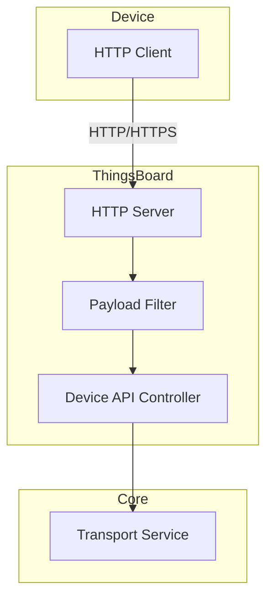
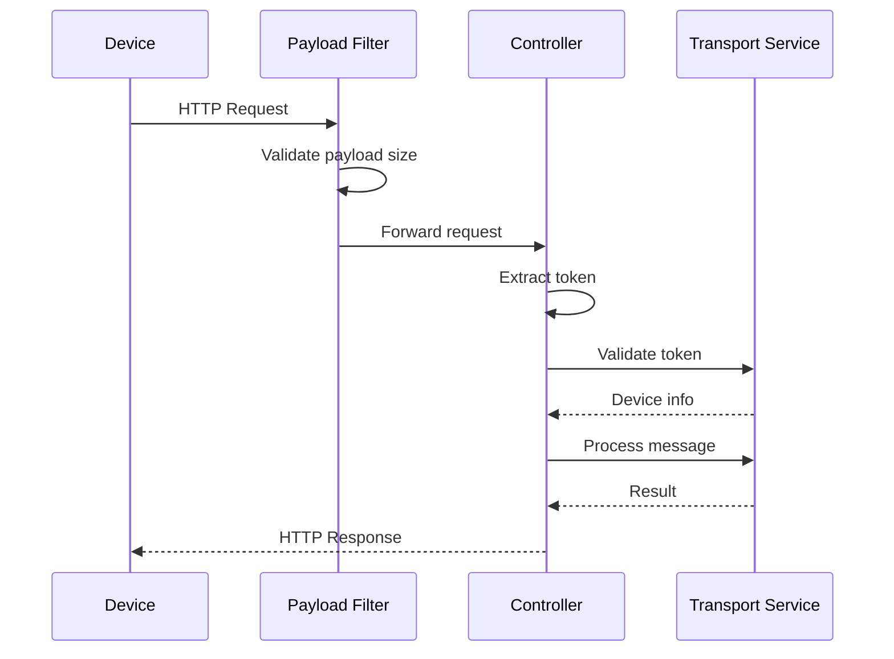
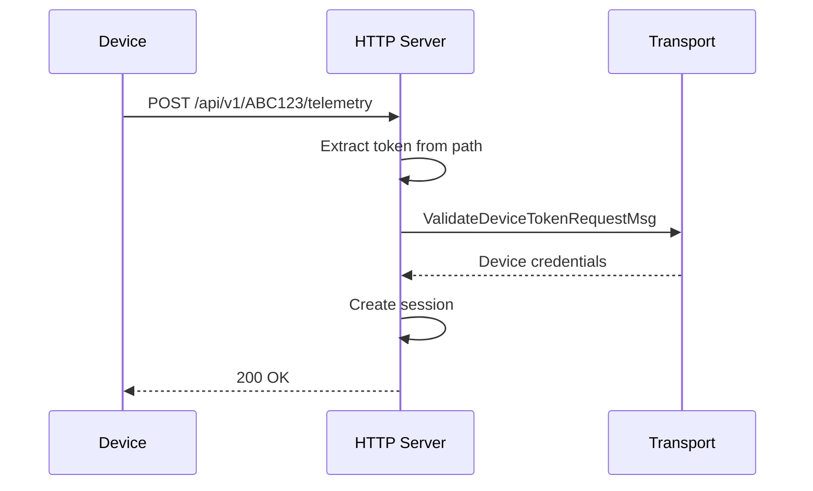
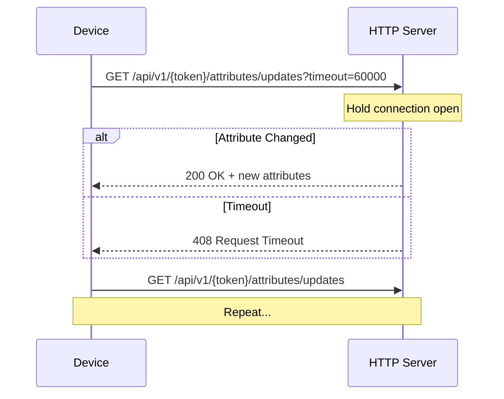
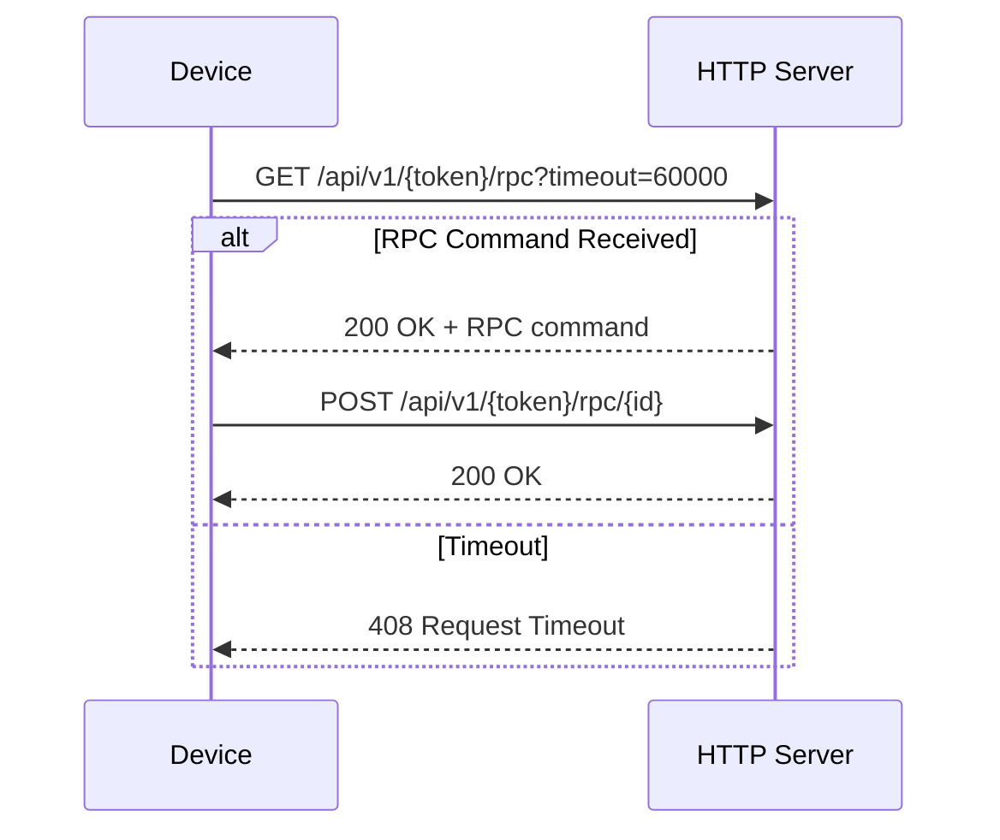
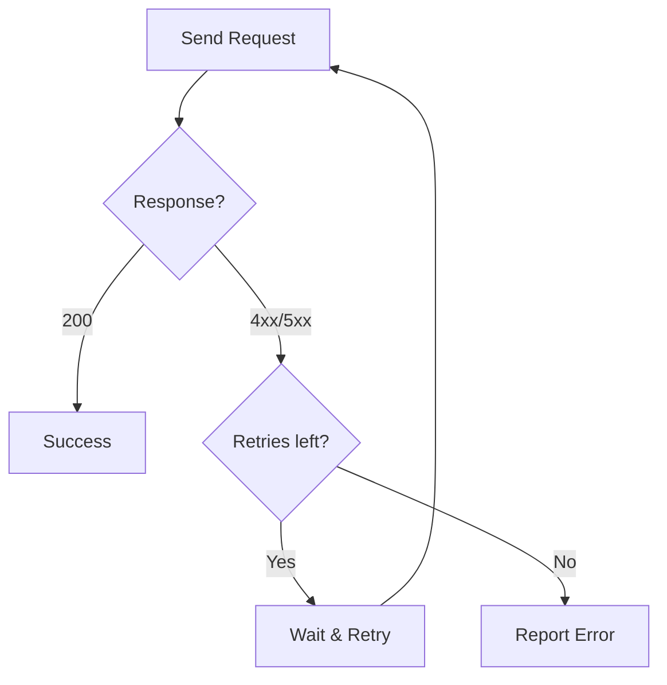

# HTTP Protocol

## Overview

The HTTP transport provides a simple REST-based interface for device communication with ThingsBoard. It offers the most straightforward integration path for devices and gateways that support HTTP/HTTPS. While not as efficient as MQTT or CoAP for frequent updates, HTTP is ideal for devices with strong HTTP support, infrequent telemetry, or integration with existing HTTP-based systems.

## Key Behaviors

1. **RESTful Interface**: Standard HTTP methods (GET, POST) with JSON payloads.

2. **Access Token Authentication**: Device tokens embedded in URL path.

3. **Synchronous Request/Response**: Each request receives an immediate response.

4. **SSL/TLS Support**: Optional HTTPS with certificate-based encryption.

5. **Long Polling**: Deprecated mechanism for attribute updates and RPC (use MQTT instead).

## Protocol Architecture

### Communication Model



### Request Flow



## Endpoints

### Base URL

```
http://host:8081/api/v1/{deviceToken}/{resource}
https://host:8081/api/v1/{deviceToken}/{resource}
```

### Available Endpoints

```mermaid
graph TB
    subgraph "HTTP Endpoints"
        TELEMETRY[POST /telemetry<br/>Send telemetry]
        GET_ATTR[GET /attributes<br/>Get attributes]
        POST_ATTR[POST /attributes<br/>Update attributes]
        RPC_SUB[GET /rpc<br/>Subscribe RPC]
        RPC_SEND[POST /rpc<br/>Send RPC request]
        RPC_RESP[POST /rpc/{id}<br/>RPC response]
        CLAIM[POST /claim<br/>Claim device]
        PROVISION[POST /provision<br/>Provision device]
        FIRMWARE[GET /firmware<br/>Download firmware]
        SOFTWARE[GET /software<br/>Download software]
    end
```

| Endpoint | Method | Description |
|----------|--------|-------------|
| `/api/v1/{token}/telemetry` | POST | Send time-series data |
| `/api/v1/{token}/attributes` | GET | Retrieve device attributes |
| `/api/v1/{token}/attributes` | POST | Update client attributes |
| `/api/v1/{token}/rpc` | GET | Subscribe to RPC (long polling, deprecated) |
| `/api/v1/{token}/rpc` | POST | Send RPC request to server |
| `/api/v1/{token}/rpc/{requestId}` | POST | Respond to server RPC |
| `/api/v1/{token}/claim` | POST | Claim device ownership |
| `/api/v1/provision` | POST | Provision new device |
| `/api/v1/{token}/firmware` | GET | Download firmware package |
| `/api/v1/{token}/software` | GET | Download software package |

## Message Formats

### Telemetry

**Simple Format (server timestamp):**
```json
{
  "temperature": 26,
  "humidity": 87
}
```

**With Timestamp:**
```json
{
  "ts": 1634712287000,
  "values": {
    "temperature": 26,
    "humidity": 87
  }
}
```

**Multiple Entries:**
```json
[
  {"ts": 1634712287000, "values": {"temperature": 26}},
  {"ts": 1634712588000, "values": {"temperature": 25}}
]
```

### Attributes

**Update Attributes (POST):**
```json
{
  "stringKey": "value1",
  "booleanKey": true,
  "doubleKey": 42.0,
  "longKey": 73,
  "jsonKey": {
    "nested": "object"
  }
}
```

**Get Attributes (GET):**
```
GET /api/v1/{token}/attributes?clientKeys=attr1,attr2&sharedKeys=config
```

**Query Parameters:**

| Parameter | Description |
|-----------|-------------|
| clientKeys | Comma-separated client attribute keys |
| sharedKeys | Comma-separated shared attribute keys |

**Response:**
```json
{
  "client": {
    "attr1": "value1",
    "attr2": 42
  },
  "shared": {
    "config": {"setting": true}
  }
}
```

### RPC

**Server-to-Device RPC (received via long polling):**
```json
{
  "id": 123,
  "method": "remoteMethodName",
  "params": {"key": "value"}
}
```

**Device RPC Response:**
```
POST /api/v1/{token}/rpc/123
```
```json
{
  "status": "success",
  "result": "response_value"
}
```

**Device-to-Server RPC:**
```
POST /api/v1/{token}/rpc
```
```json
{
  "method": "methodName",
  "params": {
    "param1": "value1"
  }
}
```

### Device Provisioning

**Request:**
```
POST /api/v1/provision
```
```json
{
  "deviceName": "NEW_DEVICE_NAME",
  "provisionDeviceKey": "u7piawkboq8v32dmcmpp",
  "provisionDeviceSecret": "jpmwdn8ptlswmf4m29bw"
}
```

**Response:**
```json
{
  "credentialsType": "ACCESS_TOKEN",
  "credentialsValue": "DEVICE_ACCESS_TOKEN",
  "status": "SUCCESS"
}
```

### Device Claiming

**Request:**
```
POST /api/v1/{token}/claim
```
```json
{
  "secretKey": "optional_secret",
  "durationMs": 60000
}
```

### OTA Downloads

**Query Parameters:**

| Parameter | Required | Description |
|-----------|----------|-------------|
| title | Yes | Package title |
| version | Yes | Package version |
| size | No | Chunk size (bytes) |
| chunk | No | Chunk index (0-based) |

**Example:**
```
GET /api/v1/{token}/firmware?title=MyFirmware&version=1.0.0&size=4096&chunk=0
```

## Authentication

### Access Token



The access token is the third path segment in the URL.

### No Other Authentication

HTTP transport uses **token-based authentication only**. For REST API access (not device API), use JWT tokens instead.

## Response Codes

| Code | Description |
|------|-------------|
| 200 OK | Successful operation |
| 400 Bad Request | Invalid JSON or request |
| 401 Unauthorized | Invalid or missing token |
| 403 Forbidden | Device deleted or permission denied |
| 404 Not Found | Resource not found |
| 408 Request Timeout | Long polling timeout |
| 413 Payload Too Large | Request exceeds limit |
| 429 Too Many Requests | Rate limit exceeded |
| 500 Internal Error | Server error |

### Error Response Format

```json
{
  "status": 401,
  "message": "Authentication failed",
  "errorCode": 10,
  "timestamp": "2024-01-15T10:30:00.000+00:00"
}
```

### Internal Error Codes

| Code | Meaning |
|------|---------|
| 10 | Authentication failed |
| 11 | JWT token expired |
| 15 | Credentials expired |
| 20 | Permission denied |
| 30 | Invalid arguments |
| 31 | Bad request parameters |
| 32 | Item not found |
| 33 | Too many requests (rate limited) |

## Configuration

### Server Settings

| Setting | Default | Description |
|---------|---------|-------------|
| server.port | 8081 | HTTP bind port |
| server.address | 0.0.0.0 | Bind address |
| server.ssl.enabled | false | Enable SSL/TLS |
| server.http2.enabled | true | Enable HTTP/2 |

### Request Settings

| Setting | Default | Description |
|---------|---------|-------------|
| request_timeout | 60000 | Request timeout (ms) |
| max_request_timeout | 300000 | Max async timeout (ms) |
| inactivity_timeout | 600000 | Session idle timeout (ms) |

### Payload Limits

| Endpoint Pattern | Default Limit |
|------------------|---------------|
| `/api/v1/*/rpc/**` | 64 KB |
| `/api/v1/**` | 50 MB |

Custom configuration format:
```
/api/v1/*/rpc/**=65536;/api/v1/**=52428800
```

**Payload Size Filter:**
The `PayloadSizeFilter` validates request size before processing:
- Uses AntPathMatcher for URL pattern matching
- Returns HTTP 413 `PAYLOAD_TOO_LARGE` when exceeded
- Filters both async and error dispatches
- Checks Content-Length header against configured limits

### HTTP/2 Support

| Setting | Default | Description |
|---------|---------|-------------|
| server.http2.enabled | true | Enable HTTP/2 protocol |

**Requirements:**
- HTTP/2 only takes effect when SSL is enabled
- Uses Apache Coyote Http11NioProtocol with NIO connector
- Provides multiplexing and reduced latency

**Configuration:**
```yaml
server:
  ssl:
    enabled: true
  http2:
    enabled: true
```

### CORS Configuration

Cross-Origin Resource Sharing is configured via Spring MVC properties:

```yaml
spring:
  mvc:
    cors:
      mapping: /**
      allowed-origins: "*"
      allowed-methods: GET,POST
      allowed-headers: "*"
```

**Device API CORS:**
The device API (`/api/v1/**`) has CORS explicitly enabled via `TransportSecurityConfiguration`.

### Async Timeout Management

| Setting | Environment Variable | Default | Description |
|---------|---------------------|---------|-------------|
| request_timeout | HTTP_REQUEST_TIMEOUT | 60000 | Default request timeout (ms) |
| max_request_timeout | HTTP_MAX_REQUEST_TIMEOUT | 300000 | Maximum async timeout (ms) |

**Tomcat Configuration:**
- Async timeout set via `connector.setAsyncTimeout(maxRequestTimeout)`
- Independent from Spring's `DeferredResult` timeouts
- Ensures requests don't hang indefinitely

### JSON Processing

| Setting | Default | Description |
|---------|---------|-------------|
| JSON_TYPE_CAST_ENABLED | true | Enable type casting |
| JSON_MAX_STRING_VALUE_LENGTH | 0 | Max string length (0=unlimited) |

Type casting converts string values to appropriate types (numbers, booleans) when detected.

### SSL/TLS Configuration

**PEM Format:**
```yaml
ssl:
  enabled: true
  certificate: server.pem
  key: server_key.pem
  key-password: optional_password
```

**Keystore Format:**
```yaml
ssl:
  enabled: true
  key-store-type: PKCS12
  key-store: keystore.p12
  key-store-password: thingsboard
  key-alias: tomcat
```

## Long Polling (Deprecated)

### Attribute Updates



### RPC Subscription



**Recommendation:** Use MQTT or CoAP for real-time updates instead of HTTP long polling.

## Data Types

### Supported Value Types

| Type | Example | Notes |
|------|---------|-------|
| String | `"value"` | Default max length unlimited |
| Boolean | `true` / `false` | |
| Double | `42.5` | Floating-point |
| Long | `42` | Integer |
| JSON | `{"key": "value"}` | Objects and arrays |

### Type Casting

Enabled by default - strings can be cast to numeric types when appropriate.

## Best Practices

### When to Use HTTP

| Scenario | Recommendation |
|----------|----------------|
| Infrequent telemetry | HTTP is suitable |
| Real-time updates needed | Use MQTT or CoAP |
| Behind corporate proxy | HTTP works well |
| Simple integration | HTTP is easiest |
| Battery-powered device | Use CoAP instead |

### Performance Tips

| Tip | Benefit |
|-----|---------|
| Batch telemetry | Reduce request count |
| Use compression | Smaller payloads |
| Enable HTTP/2 | Multiplexing, efficiency |
| Avoid long polling | Use MQTT for real-time |

### Security

| Practice | Description |
|----------|-------------|
| Use HTTPS | Encrypt all traffic |
| Rotate tokens | Change tokens periodically |
| Limit payload size | Prevent DoS |
| Use provisioning | Don't hardcode tokens |

## Error Handling

### Common Errors

| Error | Cause | Solution |
|-------|-------|----------|
| 401 Unauthorized | Invalid token | Verify access token |
| 413 Payload Too Large | Request too big | Reduce payload or batch |
| 408 Request Timeout | Long poll timeout | Reconnect and retry |
| 400 Bad Request | Invalid JSON | Validate payload format |

### Retry Strategy



## Integration Example

### Curl Examples

**Send Telemetry:**
```bash
curl -X POST \
  http://localhost:8081/api/v1/YOUR_TOKEN/telemetry \
  -H 'Content-Type: application/json' \
  -d '{"temperature": 25.5}'
```

**Get Attributes:**
```bash
curl -X GET \
  'http://localhost:8081/api/v1/YOUR_TOKEN/attributes?clientKeys=version&sharedKeys=config'
```

**Provision Device:**
```bash
curl -X POST \
  http://localhost:8081/api/v1/provision \
  -H 'Content-Type: application/json' \
  -d '{"deviceName": "NewDevice", "provisionDeviceKey": "key", "provisionDeviceSecret": "secret"}'
```

## Common Pitfalls

### Authentication Issues

| Pitfall | Symptom | Solution |
|---------|---------|----------|
| **Token in wrong URL position** | 401 Unauthorized | Token must be third path segment: `/api/v1/{TOKEN}/telemetry` |
| **Using JWT instead of device token** | 401 Unauthorized | Device API uses access tokens, not JWT; JWT is for REST API |
| **Case sensitivity** | Authentication fails | Access tokens are case-sensitive |
| **URL encoding issues** | 404 or 401 errors | Ensure token is properly URL-encoded if it contains special characters |

### Request Format Issues

| Pitfall | Symptom | Solution |
|---------|---------|----------|
| **Missing Content-Type header** | 400 Bad Request | Include `Content-Type: application/json` header |
| **Invalid JSON syntax** | 400 Bad Request | Validate JSON before sending; check for trailing commas |
| **Timestamp in seconds** | Incorrect time-series data | Use milliseconds for `ts` field, not seconds |
| **Wrong HTTP method** | 405 Method Not Allowed | POST for telemetry/attributes upload, GET for retrieval |

### Payload Size Issues

| Pitfall | Symptom | Solution |
|---------|---------|----------|
| **RPC payload too large** | 413 Payload Too Large | RPC limit is 64 KB; reduce payload or use attribute updates |
| **Telemetry payload too large** | 413 Payload Too Large | Default limit is 50 MB; batch data or increase limit |
| **No Content-Length header** | Request rejected | Include Content-Length or use chunked transfer encoding |

### Connection Issues

| Pitfall | Symptom | Solution |
|---------|---------|----------|
| **HTTP instead of HTTPS** | Connection refused | Use HTTPS when SSL is enabled on server |
| **Wrong port** | Connection timeout | Default is 8081; verify server configuration |
| **Proxy blocking requests** | Intermittent failures | Configure proxy to allow ThingsBoard endpoints |
| **HTTP/2 issues** | Protocol errors | HTTP/2 requires SSL; use HTTP/1.1 without SSL |

### Long Polling Issues (Deprecated)

| Pitfall | Symptom | Solution |
|---------|---------|----------|
| **Using long polling for production** | Scalability problems | Migrate to MQTT or CoAP for real-time updates |
| **Timeout too short** | Frequent reconnections | Set timeout to at least 60000ms (60 seconds) |
| **Missing timeout parameter** | Server defaults used | Explicitly set `timeout` query parameter |
| **Not reconnecting after timeout** | Missed updates | Immediately reconnect after 408 timeout response |

### Performance Issues

| Pitfall | Symptom | Solution |
|---------|---------|----------|
| **Per-message requests** | High latency overhead | Batch telemetry into single requests with multiple timestamps |
| **Synchronous blocking** | Slow throughput | Use async HTTP client with connection pooling |
| **No connection reuse** | High connection overhead | Enable HTTP keep-alive and connection pooling |
| **Rate limiting** | 429 Too Many Requests | Implement backoff; batch data to reduce request count |

### Error Handling

| Pitfall | Symptom | Solution |
|---------|---------|----------|
| **Not checking response codes** | Silent failures | Always verify response status codes |
| **Ignoring error messages** | Debugging difficulty | Parse error response JSON for detailed error codes |
| **No retry logic** | Data loss on transient failures | Implement exponential backoff for 5xx errors |
| **Retrying 4xx errors** | Wasted resources | Only retry 5xx and network errors; 4xx requires code fix |

## See Also

- [Transport Contract](./transport-contract.md) - Common transport behaviors
- [MQTT Protocol](./mqtt.md) - Recommended for real-time
- [CoAP Protocol](./coap.md) - UDP alternative
- [REST API Overview](../06-api-layer/rest-api-overview.md) - Platform API
