# LwM2M Protocol

## Overview

LwM2M (Lightweight Machine-to-Machine) is an OMA (Open Mobile Alliance) standard protocol designed for IoT device management. Built on CoAP, it provides a standardized object model for device registration, configuration, monitoring, and firmware updates. ThingsBoard implements a full LwM2M server supporting versions 1.0-1.2 with comprehensive security modes and OTA capabilities.

## Key Behaviors

1. **Object-Based Model**: Standardized objects for device info, connectivity, firmware, and sensors.

2. **Registration Lifecycle**: Devices register, update registration, and deregister with the server.

3. **Observe Pattern**: Server subscribes to resource changes for real-time monitoring.

4. **Bootstrap Support**: Server-initiated or client-initiated credential provisioning.

5. **Multiple Security Modes**: PSK, RPK, X.509 certificates, and no-security options.

6. **OTA Updates**: Standardized firmware and software update mechanisms.

## Protocol Architecture

### LwM2M Architecture

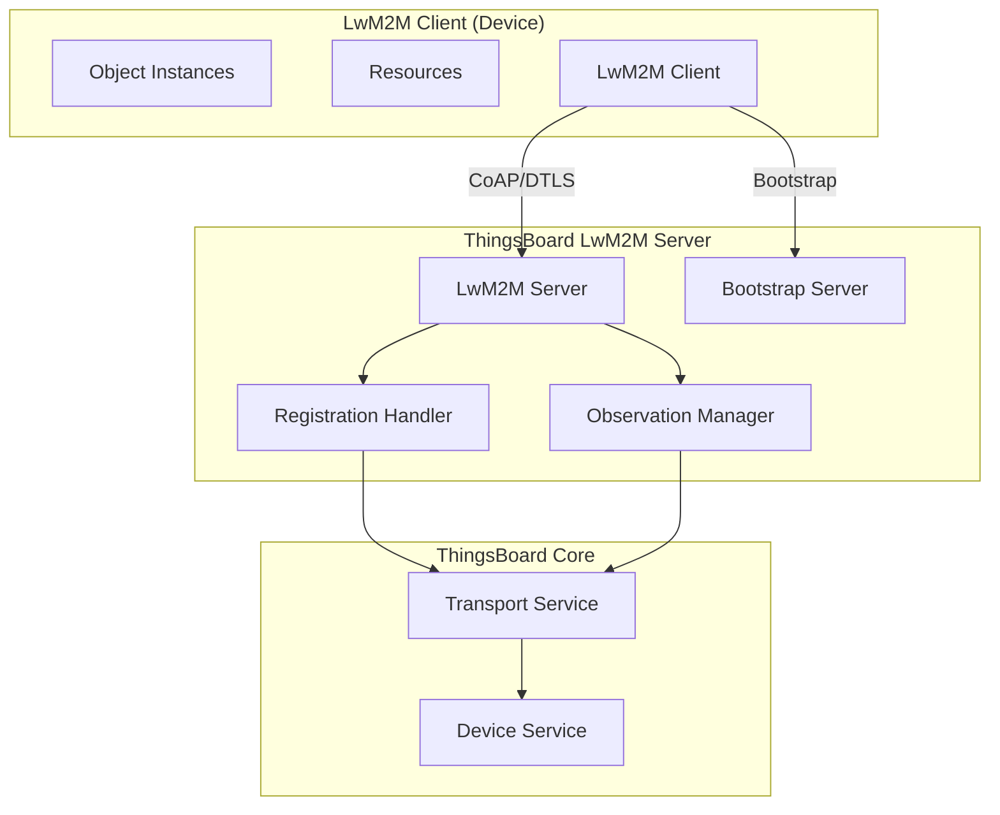

### Object Model Hierarchy

```mermaid
graph TB
    subgraph "LwM2M Path Structure"
        ROOT[/]
        OBJ[/{ObjectID}]
        INST[/{ObjectID}/{InstanceID}]
        RES[/{ObjectID}/{InstanceID}/{ResourceID}]
    end

    ROOT --> OBJ
    OBJ --> INST
    INST --> RES
```

**Path Format:** `/{ObjectID}/{InstanceID}/{ResourceID}`

Example: `/3/0/0` = Device Object, Instance 0, Manufacturer resource

## Standard Objects

### Core Objects

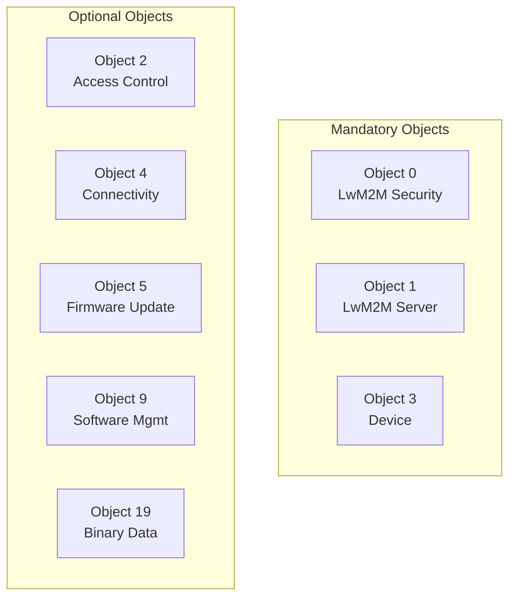

### Object 0: LwM2M Security

| Resource | ID | Description |
|----------|------|-------------|
| Server URI | 0 | Bootstrap/LwM2M server URI |
| Bootstrap Server | 1 | Is bootstrap server flag |
| Security Mode | 2 | PSK (0), RPK (1), Certificate (2), NoSec (3) |
| Public Key | 3 | Client public key or identity |
| Server Public Key | 4 | Server public key |
| Secret Key | 5 | PSK or private key |
| Short Server ID | 10 | Server identifier |

### Object 1: LwM2M Server

| Resource | ID | Description |
|----------|------|-------------|
| Short Server ID | 0 | Server identifier |
| Lifetime | 1 | Registration lifetime (seconds) |
| Default Min Period | 2 | Minimum observation period |
| Default Max Period | 3 | Maximum observation period |
| Disable Timeout | 5 | Disable timeout period |
| Binding | 7 | U (UDP), T (TCP), S (SMS) |

### Object 3: Device

| Resource | ID | Description |
|----------|------|-------------|
| Manufacturer | 0 | Device manufacturer |
| Model Number | 1 | Device model |
| Serial Number | 2 | Serial number |
| Firmware Version | 3 | Current firmware |
| Reboot | 4 | Execute to reboot |
| Factory Reset | 5 | Execute to reset |
| Battery Level | 9 | Battery percentage |
| Memory Total | 21 | Total memory |

### Object 5: Firmware Update

| Resource | ID | Description |
|----------|------|-------------|
| Package | 0 | Firmware binary |
| Package URI | 1 | Download URL |
| Update | 2 | Execute to install |
| State | 3 | Current state |
| Update Result | 5 | Last update result |

## Operations

### Supported Operations

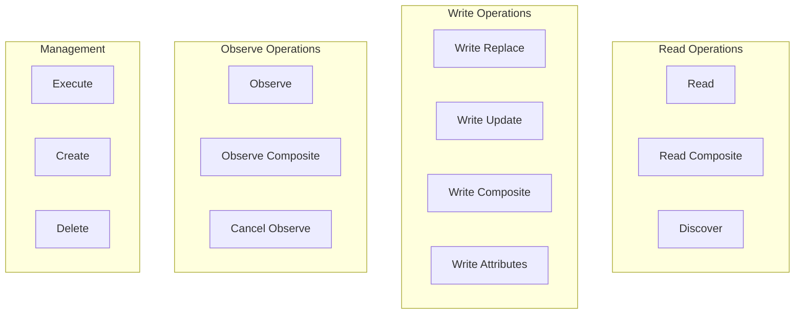

| Operation | Description | LwM2M Version |
|-----------|-------------|---------------|
| READ | Read single resource value | 1.0+ |
| READ_COMPOSITE | Read multiple resources | 1.1+ |
| DISCOVER | Get resource metadata | 1.0+ |
| OBSERVE | Subscribe to changes | 1.0+ |
| OBSERVE_COMPOSITE | Subscribe to multiple resources | 1.1+ |
| EXECUTE | Execute resource function | 1.0+ |
| WRITE_REPLACE | Replace entire resource | 1.0+ |
| WRITE_UPDATE | Partial update | 1.0+ |
| WRITE_COMPOSITE | Update multiple resources | 1.1+ |
| CREATE | Create object instance | 1.0+ |
| DELETE | Delete object instance | 1.0+ |

## LwM2M Version Support

### Version Differences

| Feature | LwM2M 1.0 | LwM2M 1.1 |
|---------|-----------|-----------|
| Content Format | TLV | TEXT (JSON-like) |
| Composite Operations | Not supported | Supported |
| Object Versioning | Basic | Full support |
| Default Object Version | 1.0 | 1.1 |

**Version Detection:**
- Protocol version from client registration
- Per-client version tracking
- Operation type enforcement based on version

### Object Versioning

Objects can have multiple versions within a deployment. Proper version handling is critical for successful device communication.

**Path Format with Version:**
```
/{ObjectID}_{ObjectVersion}/{InstanceID}/{ResourceID}
```

Example: `/3_1.2/0/9` = Device Object v1.2, Instance 0, Battery Level resource

**Version Handling Rules:**

| Source | Priority | Description |
|--------|----------|-------------|
| Device Profile Model | 1 (Highest) | `<ObjectVersion>` tag in uploaded model |
| LwM2MVersion from registration | 2 | Client's declared LwM2M version |
| Default | 3 (Lowest) | Falls back to "1.0" |

**Version Determination:**
1. If model includes `<ObjectVersion>` tag → use that version
2. If model lacks version tag → system sets ObjectVersion = 1.0
3. During registration, client declares supported object versions
4. All operations validate ObjectVersion matches profile configuration

**Version in Terminal Commands:**

```bash
# Explicit version specification
"/3_1.2/0/9"          # ObjectID=3, ObjectVersion=1.2

# Implicit version (uses LwM2MVersion)
"/3/0/9"              # ObjectID=3, ObjectVersion=LwM2MVersion
                      # If LwM2MVersion=1.1 → becomes "/3_1.1/0/9"
                      # If LwM2MVersion=1.2 → becomes "/3_1.2/0/9"
```

**Version Mismatch Handling:**

| Scenario | Result |
|----------|--------|
| Request version matches client | ✓ Success |
| Request version differs from client | ✗ Error: "Invalid object version. Required version: X.X" |
| Profile version differs from client | ✗ Initialization operations rejected |

**Example:**
```bash
# Client registered with ObjectID=3, ObjectVersion=1.1
"/3_1.1/0/9"    # ✓ OK
"/3_1.2/0/9"    # ✗ Error

# Client registered with ObjectID=3, ObjectVersion=1.2
"/3_1.1/0/9"    # ✗ Error
"/3_1.2/0/9"    # ✓ OK
```

**Finding Device Object Versions:**

After a client connects, check the telemetry logs for supported objects:
```
info: Endpoint [ClientName] Client registered with registration id: [xyz]
      LwM2mVersion: [1.1], SupportedObjectIdVer [{1=1.1, 3=1.2, 5=1.1, 6=1.0}]
```

This log shows exact object versions the device supports.

### Composite Operations (LwM2M 1.1)

**Benefits:**
- Multiple resources in single CoAP message
- Reduced message overhead for bulk operations
- More efficient for periodic telemetry collection

**Request Types:**
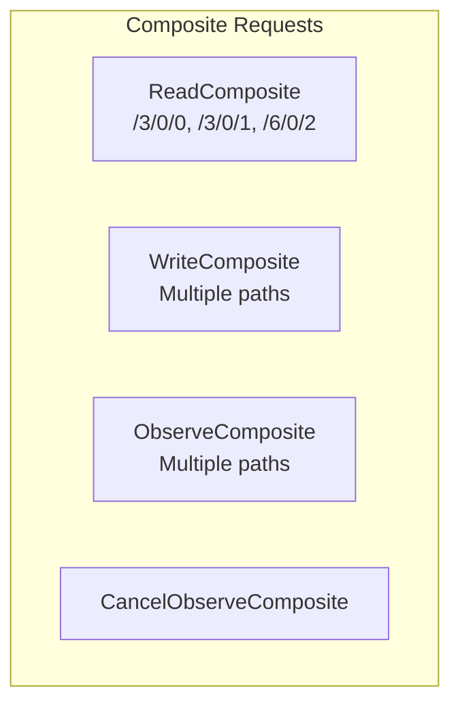

**Usage:**
```json
{
  "paths": ["/3/0/0", "/3/0/1", "/3/0/9"],
  "operation": "READ_COMPOSITE"
}
```

### Operation Flow

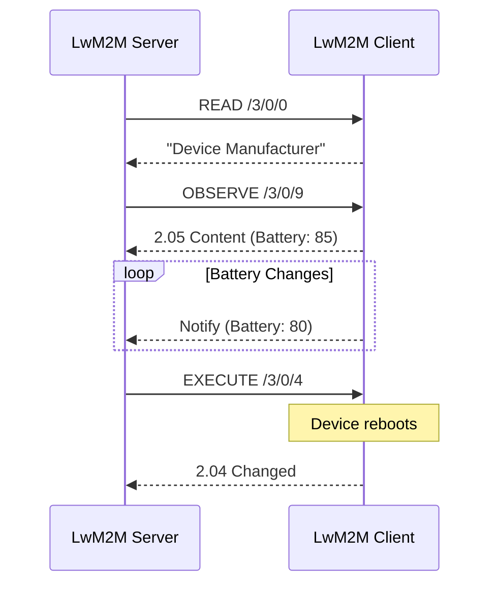

## Security Modes

### Security Options

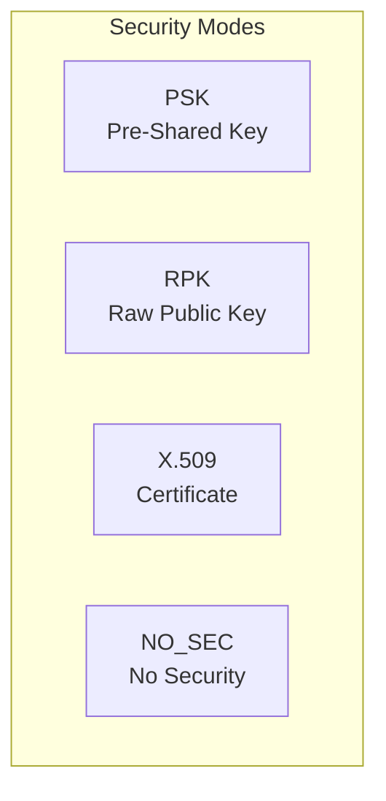

### PSK (Pre-Shared Key)

| Parameter | Description |
|-----------|-------------|
| Identity | PSK identity string |
| Key | Hex-encoded shared secret |

**Use Case:** Simple devices with pre-provisioned keys.

### RPK (Raw Public Key)

| Parameter | Description |
|-----------|-------------|
| Client Public Key | Base64-encoded public key |
| Client Private Key | Base64-encoded private key |
| Server Public Key | Base64-encoded server key |

**Use Case:** Certificate-less authentication for constrained devices.

### X.509 Certificate

| Parameter | Description |
|-----------|-------------|
| Client Certificate | PEM-encoded certificate |
| Client Private Key | Base64-encoded private key |
| Server Certificate | PEM-encoded server certificate |

**Use Case:** Enterprise deployments with PKI infrastructure.

### Security Configuration

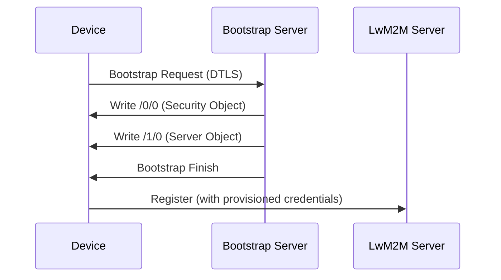

## Bootstrap

### Bootstrap Process

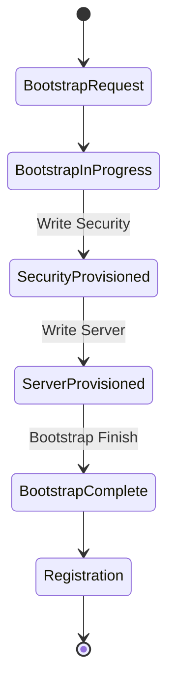

### Bootstrap Modes

| Mode | Description |
|------|-------------|
| Client-Initiated | Device requests bootstrap |
| Server-Initiated | Server triggers bootstrap |
| Bootstrap on Failure | Auto-bootstrap if registration fails |

### Bootstrap Configuration

| Setting | Description |
|---------|-------------|
| Bootstrap Server URI | coaps://host:5686 |
| Bootstrap Security Mode | PSK, RPK, X.509, NO_SEC |
| Client Hold Off Time | Delay before bootstrap |
| Bootstrap Account Timeout | Session timeout |

## Device Profiles

### LwM2M Profile Configuration

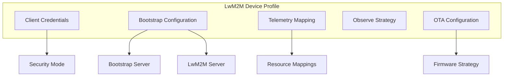

### Telemetry Mapping

| Setting | Description |
|---------|-------------|
| Key Name | ThingsBoard attribute/telemetry key |
| Resource Path | LwM2M resource path (e.g., /3/0/9) |
| Attribute Flag | Map as attribute |
| Telemetry Flag | Map as telemetry |

### Observe Strategies

ThingsBoard supports multiple observe strategies that define how LwM2M resources are monitored.

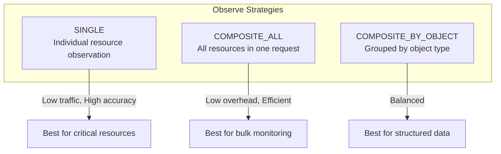

| Strategy | Description | Traffic | Accuracy | LwM2M Version |
|----------|-------------|---------|----------|---------------|
| **SINGLE** | Each resource observed individually | Higher | Best | 1.0+ |
| **COMPOSITE_ALL** | All resources via single Composite Observe | Lowest | Good | 1.1+ |
| **COMPOSITE_BY_OBJECT** | Resources grouped per object type | Medium | Good | 1.1+ |

**Strategy Selection Guidelines:**

| Use Case | Recommended Strategy | Reason |
|----------|---------------------|--------|
| Critical individual values | SINGLE | Immediate per-resource notifications |
| High-frequency telemetry | COMPOSITE_ALL | Reduced message overhead |
| Object-oriented data models | COMPOSITE_BY_OBJECT | Logical grouping, balanced traffic |
| Mixed LwM2M 1.0/1.1 devices | SINGLE | Backwards compatibility |

**Changing Observe Strategy:**

When changing strategies after a client is connected:

| Current → New | Action Required |
|---------------|-----------------|
| SINGLE → SINGLE | Direct observe/cancel per resource |
| COMPOSITE → COMPOSITE | Direct composite observe/cancel |
| Different strategies | Execute **Cancel All Observations** first |

Changes take effect:
- **Immediately** if LwM2M session is active
- **On next Update Registration** if session is inactive

## Firmware Updates

### Update Strategies

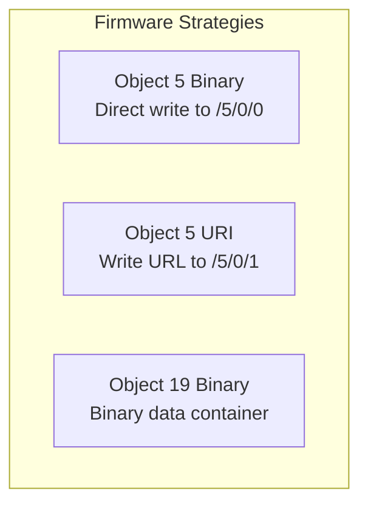

| Strategy | Description | Use Case |
|----------|-------------|----------|
| OBJ_5_BINARY | Write binary to Package resource | Small firmware |
| OBJ_5_TEMP_URL | Write download URL | Large firmware |
| OBJ_19_BINARY | Use Binary Data Container | Complex packages |

### Firmware State Machine

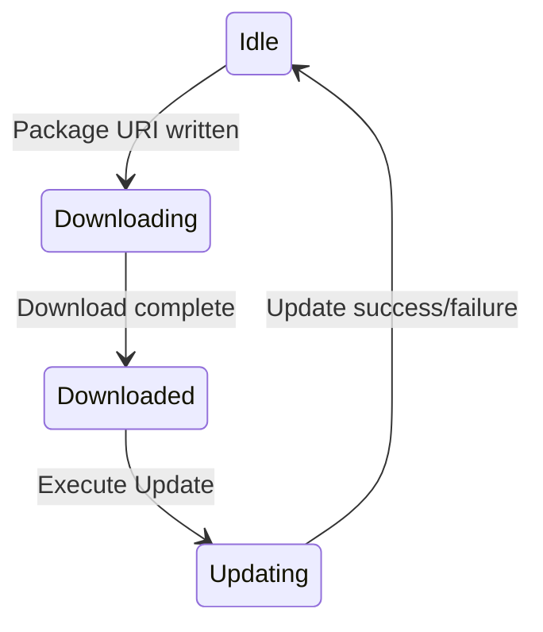

| State | Value | Description |
|-------|-------|-------------|
| Idle | 0 | Ready for update |
| Downloading | 1 | Download in progress |
| Downloaded | 2 | Ready to install |
| Updating | 3 | Installation in progress |

### Update Results

| Code | Result |
|------|--------|
| 0 | Initial state |
| 1 | Success |
| 2 | Insufficient storage |
| 3 | Out of memory |
| 4 | Connection lost |
| 5 | Integrity check failure |
| 6 | Unsupported package type |
| 7 | Invalid URI |
| 8 | Update failed |
| 9 | Unsupported protocol |
| 10 | Cancelled |

### OTA Resource Paths

| Resource | Firmware (Object 5) | Software (Object 9) |
|----------|---------------------|---------------------|
| Package | /5/0/0 | /9/0/2 |
| Package URI | /5/0/1 | /9/0/3 |
| Execute | /5/0/2 | /9/0/4 |
| State | /5/0/3 | /9/0/7 |
| Result | /5/0/5 | /9/0/9 |

**CoAP Delivery Resources:**
- Firmware: `/tbfw`
- Software: `/tbsw`

### OTA State Tracking

Per-client OTA state is maintained in `LwM2MClientFwOtaInfo` / `LwM2MClientSwOtaInfo`:

| Property | Description |
|----------|-------------|
| currentTitle | Package title |
| currentVersion | Package version |
| targetTitle | Target update title |
| targetVersion | Target update version |
| checksum | SHA-256 verification |
| deliveryMethod | CoAP (1) or CoAPS (2) |
| updateState | Current state enum |
| updateResult | Last result code |

**Device Attribute Mapping:**
- `fw_title`, `fw_version`, `fw_tag`, `fw_url`
- `sw_title`, `sw_version`, `sw_tag`, `sw_url`

## Configuration

### Server Configuration

| Setting | Default | Description |
|---------|---------|-------------|
| bind_address | 0.0.0.0 | Server bind address |
| bind_port | 5685 | LwM2M server port |
| bootstrap_port | 5686 | Bootstrap server port |
| security_mode | DTLS | Default security |
| lifetime | 300 | Default registration lifetime |

### DTLS Configuration

| Setting | Default | Description |
|---------|---------|-------------|
| retransmission_timeout | 9000ms | DTLS retransmit (RFC7925) |
| connection_id_length | 8 | RFC 9146 Connection ID |
| max_transmission_unit | 1024 | Max DTLS fragment |
| max_fragment_length | 1024 | Max CoAP message |

### DTLS Connection ID (CID)

The DTLS Connection ID (RFC 9146) improves connection resilience, especially in NAT or unstable network environments.

**CID Benefits:**
- Maintains DTLS sessions across IP/port changes
- Essential for NATed environments
- Enables stable multi-node deployments
- Reduces re-handshake overhead

**CID Length Configuration:**

| Server CID Length | Mode | NodeID | Description |
|-------------------|------|--------|-------------|
| null or 0 | No CID | - | CID disabled |
| 1-4 | SingleNode | - | CID without node routing |
| 5+ | MultiNode | 0x00 | CID with node routing for clusters |

**CID Alignment Table:**

| Client CID | Server CID | Connection Mode | Notes |
|------------|------------|-----------------|-------|
| null | null | DTLS 1.2 (no CID) | Both sides don't support CID |
| 1 | null | DTLS 1.2 (no CID) | Server doesn't support CID |
| null | 4 | DTLS 1.2 (no CID) | Client must initiate CID |
| 1 | 1 | DTLS 1.2 + CID | Short CID (SingleNode) |
| 1 | 5 | DTLS 1.2 + CID (MultiNode) | Server generates NodeID |
| 2 | 8 | DTLS 1.2 + CID (MultiNode) | Default recommended config |

**Configuration:**
```yaml
# tb-lwm2m-transport.yml
transport:
  lwm2m:
    dtls:
      connection_id_length: 8  # Enables MultiNode mode
```

When `connection_id_length >= 5`, the MultiNodeConnectionIdGenerator assigns unique CIDs per client session, enabling proper routing in clustered deployments.

**Supported Cipher Suites:**

| Security Mode | Cipher Suite |
|---------------|--------------|
| PSK | TLS_PSK_WITH_AES_128_CCM_8 |
| PSK | TLS_PSK_WITH_AES_128_CBC_SHA256 |
| RPK/X.509 | TLS_ECDHE_ECDSA_* |

**Authentication Protocols:**

| Protocol | OID |
|----------|-----|
| MD5 | 1.3.6.1.6.3.10.1.1.2 |
| SHA-1 | 1.3.6.1.6.3.10.1.1.3 |
| SHA-224 | 1.3.6.1.6.3.10.1.1.4 |
| SHA-256 | 1.3.6.1.6.3.10.1.1.5 |
| SHA-384 | 1.3.6.1.6.3.10.1.1.6 |
| SHA-512 | 1.3.6.1.6.3.10.1.1.7 |

**Privacy Protocols:**

| Protocol | OID |
|----------|-----|
| DES | 1.3.6.1.6.3.10.1.2.2 |
| AES-128 | 1.3.6.1.6.3.10.1.2.4 |
| AES-192 | 1.3.6.1.4.1.4976.2.2.1.1.1 |
| AES-256 | 1.3.6.1.4.1.4976.2.2.1.1.2 |

### Storage Configuration

| Store | Default | Description |
|-------|---------|-------------|
| Registration Store | In-Memory | Client registration data |
| Security Store | In-Memory | PSK/RPK/X.509 credentials |
| DTLS Session Store | In-Memory | DTLS session state |
| Model Config Store | In-Memory | LwM2M model configurations |

**Redis-Backed Storage:**
For clustered deployments, stores can be backed by Redis:
- `TbLwM2mRedisSecurityStore`
- `TbLwM2mRedisSessionStore`
- `TbLwM2mRedisModelConfigStore`

### Thread Pool Configuration

| Pool | Default | Purpose |
|------|---------|---------|
| Downlink Executor | 8 | Server-to-device operations |
| Uplink Executor | 8 | Device-to-server processing |
| OTA Executor | 4 | Firmware/software updates |

## Registration Lifecycle

### Registration Flow

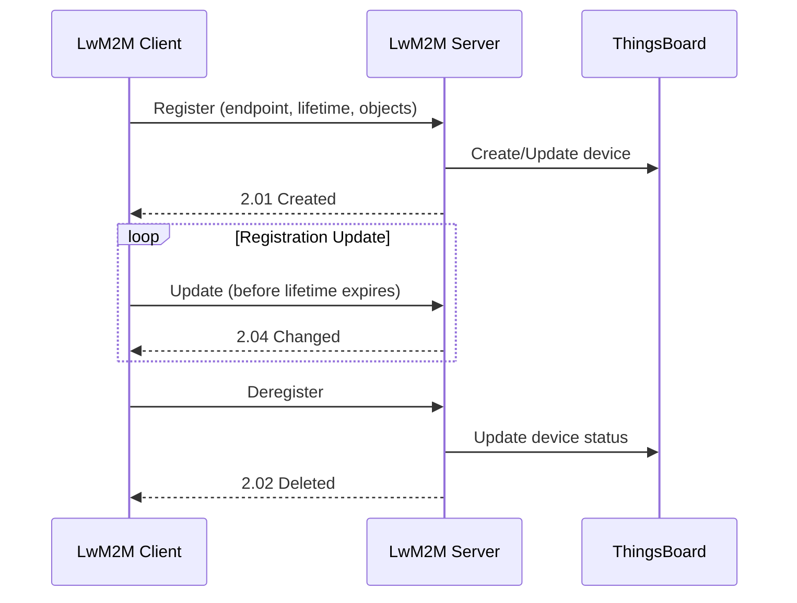

### Registration Parameters

| Parameter | Description |
|-----------|-------------|
| Endpoint Name | Unique client identifier |
| Lifetime | Registration validity (seconds) |
| LwM2M Version | Protocol version |
| Binding Mode | U (UDP), T (TCP) |
| Objects | Supported objects list |

## Best Practices

### Device Implementation

| Practice | Benefit |
|----------|---------|
| Use Observe | Efficient updates |
| Implement Object 3 | Device info standardized |
| Support firmware update | Enable OTA |
| Use DTLS | Secure communication |

### Server Configuration

| Practice | Benefit |
|----------|---------|
| Configure timeouts | Handle unreliable networks |
| Map resources to telemetry | Automatic data collection |
| Use composite observe | Reduce traffic |
| Enable bootstrap | Simplified provisioning |

## Troubleshooting

### Common Issues

| Issue | Cause | Solution |
|-------|-------|----------|
| Registration fails | Wrong credentials | Verify security config |
| Observe not working | Client doesn't support | Check object support |
| Firmware update fails | Wrong strategy | Match device capability |
| DTLS handshake fails | Certificate issue | Verify certificate chain |

### Debugging

| Tool | Purpose |
|------|---------|
| Wireshark | CoAP/DTLS packet analysis |
| Debug logging | Server-side troubleshooting |
| Device logs | Client-side issues |

## Common Pitfalls

### Registration Issues

| Pitfall | Symptom | Solution |
|---------|---------|----------|
| **Endpoint name mismatch** | Registration fails | Ensure endpoint name in credentials matches device |
| **Wrong LwM2M server URI** | Connection timeout | Verify `coap://host:5685` (plain) or `coaps://host:5684` (DTLS) |
| **Lifetime too short** | Frequent re-registrations | Set lifetime ≥ 300 seconds; account for network latency |
| **Missing mandatory objects** | Registration rejected | Device must support Objects 0, 1, and 3 |

### Security Configuration

| Pitfall | Symptom | Solution |
|---------|---------|----------|
| **PSK identity mismatch** | DTLS handshake fails | Verify PSK identity matches device credentials exactly |
| **Key encoding errors** | Authentication failure | Ensure hex encoding for PSK, Base64 for RPK/X.509 |
| **Certificate CN mismatch** | X.509 validation fails | Certificate Common Name must match endpoint name |
| **Expired certificates** | DTLS rejected | Monitor certificate expiration; auto-renew if possible |

### Object Version Issues

| Pitfall | Symptom | Solution |
|---------|---------|----------|
| **Profile version mismatch** | Operations rejected | Match profile ObjectVersion to device's declared version |
| **Missing version in request** | Wrong resource accessed | Use explicit version: `/3_1.2/0/9` not `/3/0/9` |
| **Model not uploaded** | Profile configuration fails | Upload LwM2M models to Resource Library first |
| **Stale model version** | Unexpected behavior | Update model files when devices are upgraded |

### Observe Strategy Issues

| Pitfall | Symptom | Solution |
|---------|---------|----------|
| **Composite on LwM2M 1.0** | Observe fails | Use SINGLE strategy for LwM2M 1.0 devices |
| **Strategy change without cancel** | Duplicate observations | Cancel All Observations before changing strategy |
| **Mixed strategy devices** | Inconsistent behavior | Use SINGLE for mixed 1.0/1.1 deployments |

### Firmware Update Issues

| Pitfall | Symptom | Solution |
|---------|---------|----------|
| **Wrong update strategy** | OTA fails | Match strategy to device capability (binary vs URI) |
| **Package URI not accessible** | Download fails | Ensure device can reach the firmware URL |
| **State not monitored** | Silent failures | Observe /5/0/3 (State) and /5/0/5 (Result) |
| **Checksum mismatch** | Update rejected | Verify SHA-256 hash in package configuration |

### Connection Issues

| Pitfall | Symptom | Solution |
|---------|---------|----------|
| **UDP port blocked** | No connectivity | Open ports 5685 (LwM2M), 5686 (Bootstrap), 5684 (DTLS) |
| **NAT timeout** | Disconnections | Enable DTLS CID or reduce registration lifetime |
| **MTU too large** | Fragmentation issues | Set MTU ≤ 1024 for constrained networks |
| **CID not enabled** | Sessions lost on IP change | Configure `connection_id_length: 8` for NAT environments |

### Bootstrap Issues

| Pitfall | Symptom | Solution |
|---------|---------|----------|
| **Bootstrap credentials wrong** | Bootstrap fails | Separate credentials for bootstrap vs LwM2M server |
| **Security object not written** | Client can't connect to server | Verify bootstrap writes both /0 and /1 objects |
| **Hold-off time too long** | Slow provisioning | Reduce client hold-off time for faster bootstrap |

## See Also

- [Transport Contract](./transport-contract.md) - Common transport behaviors
- [CoAP Protocol](./coap.md) - Underlying protocol
- [Device Entity](../02-core-concepts/entities/device.md) - Device configuration
- [Authentication](../06-api-layer/authentication.md) - Security overview
